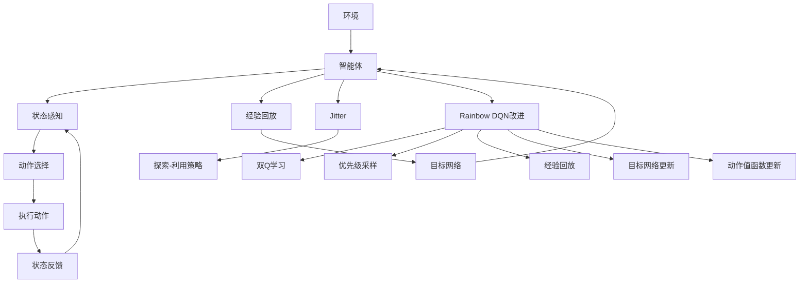

                 

关键词：深度强化学习、DQN、Rainbow DQN、强化学习算法、人工智能、神经网络、智能控制、游戏AI、机器人控制、映射原理、实践应用

## 摘要

本文旨在为读者提供一份全面的指南，深入探讨深度强化学习（DRL）领域中的DQN（Deep Q-Network）及其改进算法Rainbow DQN。文章首先介绍了DRL的基本概念、背景以及重要性，随后详细解析了DQN的原理和实现步骤，包括其核心组成部分和运作机制。随后，文章探讨了Rainbow DQN的优势和改进点，提供了基于该算法的数学模型、公式推导和实际应用案例。此外，文章还分享了项目实践中的代码实例和运行结果，并展望了DQN和Rainbow DQN在未来的发展前景和应用方向。

## 1. 背景介绍

### 1.1 深度强化学习概述

深度强化学习（Deep Reinforcement Learning，简称DRL）是强化学习（Reinforcement Learning，简称RL）的一个分支，结合了深度学习的优势，旨在通过智能体（agent）与环境的交互学习到最优策略。与传统强化学习相比，DRL引入了深度神经网络（DNN）作为Q值函数的逼近器，使得智能体能够处理高维输入和复杂的决策问题。

### 1.2 DRL的重要性

DRL在人工智能领域具有重要地位，主要原因如下：

1. **解决复杂问题**：深度神经网络的高效表示能力使得DRL能够处理更加复杂的环境和决策问题。
2. **自适应学习**：DRL通过不断与环境互动，能够自适应地调整策略，适用于动态变化的场景。
3. **多样化的应用场景**：从自动驾驶、游戏AI到机器人控制，DRL在多个领域展现了其巨大的潜力。

### 1.3 DQN的诞生背景

DQN（Deep Q-Network）是由DeepMind在2015年提出的一种基于深度学习的强化学习算法。它是首次成功将深度神经网络应用于强化学习问题，特别是解决具有高维状态空间和动作空间的问题。DQN的出现标志着深度强化学习从理论走向实际应用的里程碑。

## 2. 核心概念与联系

为了更好地理解DQN和Rainbow DQN，首先需要了解其核心概念和组成部分。以下是一个用Mermaid绘制的流程图，展示了DQN和Rainbow DQN的基本架构和关键组件。



### 2.1 智能体与环境的交互

智能体（Agent）是执行决策的主体，其核心任务是学习最优策略。环境（Environment）是智能体交互的场所，提供状态（State）和奖励（Reward）反馈。

### 2.2 状态感知与动作选择

智能体通过感知当前状态，选择执行的动作。这个过程涉及深度神经网络，用于逼近Q值函数，即状态-动作值函数。

### 2.3 动作执行与状态反馈

智能体执行动作后，环境会提供新的状态和奖励反馈。这些反馈用于调整智能体的策略。

### 2.4 经验回放与目标网络

为了减少样本偏差并稳定学习过程，DQN引入了经验回放机制。同时，目标网络（Target Network）用于提高算法的稳定性。

### 2.5 Rainbow DQN的改进

Rainbow DQN是在DQN基础上的一系列改进，包括双Q学习、优先级采样、经验回放、目标网络更新和动作值函数更新等。这些改进旨在提高算法的性能和稳定性。

## 3. 核心算法原理 & 具体操作步骤

### 3.1 算法原理概述

DQN的核心思想是通过深度神经网络逼近状态-动作值函数（Q值函数），从而学习最优策略。算法的基本步骤如下：

1. 初始化：设置网络参数、经验回放缓冲区、目标网络等。
2. 运行智能体：在环境中执行动作，收集状态-动作对。
3. 更新Q值：使用梯度下降法更新网络参数，逼近最优Q值。
4. 目标网络更新：定期同步主网络与目标网络的参数，提高算法稳定性。
5. 经验回放：将历史状态-动作对存入经验回放缓冲区，用于后续训练。

### 3.2 算法步骤详解

#### 3.2.1 初始化

1. 初始化深度神经网络，设置学习率、折扣因子等参数。
2. 初始化经验回放缓冲区，设定缓冲区大小。
3. 初始化目标网络，并将其初始化为主网络的副本。

#### 3.2.2 运行智能体

1. 从初始状态开始，执行动作选择策略。
2. 执行动作，获取新的状态和奖励。
3. 将状态-动作对存入经验回放缓冲区。

#### 3.2.3 更新Q值

1. 使用梯度下降法更新网络参数，逼近最优Q值。
2. 更新经验回放缓冲区中的历史状态-动作对。

#### 3.2.4 目标网络更新

1. 定期同步主网络与目标网络的参数，减少网络偏差。
2. 更新目标网络的参数，用于后续训练。

#### 3.2.5 经验回放

1. 将历史状态-动作对存入经验回放缓冲区。
2. 从经验回放缓冲区中随机采样状态-动作对，用于训练网络。

### 3.3 算法优缺点

#### 优点：

1. **处理高维状态空间**：深度神经网络能够高效地处理高维状态空间。
2. **自适应学习**：通过不断与环境交互，智能体能自适应地调整策略。
3. **广泛的适用性**：DQN适用于多个领域的强化学习问题。

#### 缺点：

1. **收敛速度较慢**：深度神经网络的学习过程较慢，导致DQN的收敛速度较慢。
2. **样本偏差**：经验回放缓冲区中的历史状态-动作对可能导致样本偏差。

### 3.4 算法应用领域

DQN在以下领域具有广泛的应用：

1. **游戏AI**：如《Atari》游戏中的智能体控制。
2. **自动驾驶**：处理复杂的交通环境，实现智能驾驶。
3. **机器人控制**：在机器人控制中实现智能决策和动作规划。

## 4. 数学模型和公式 & 详细讲解 & 举例说明

### 4.1 数学模型构建

DQN的核心数学模型是Q值函数，它是一个状态-动作值函数，表示在给定状态下执行特定动作所能获得的预期回报。Q值函数的数学模型如下：

$$
Q(s, a) = \sum_{i=1}^{n} \gamma^i r_i + \sum_{j=1}^{m} \alpha^j a_j
$$

其中：

- $s$：状态
- $a$：动作
- $r_i$：在第$i$个时间步获得的回报
- $\gamma$：折扣因子，表示未来回报的重要程度
- $\alpha$：学习率，表示模型参数更新的程度
- $n$：当前状态下的动作数量
- $m$：历史状态下的动作数量

### 4.2 公式推导过程

DQN的Q值函数是通过深度神经网络逼近的。在推导过程中，我们首先定义一个目标函数，然后使用反向传播算法更新网络参数。

目标函数定义为：

$$
J(\theta) = \sum_{i=1}^{n} \frac{1}{N} \sum_{j=1}^{m} \left( r_j - Q(s_j, a_j) \right)^2
$$

其中：

- $\theta$：网络参数
- $N$：样本数量

为了最小化目标函数，我们使用反向传播算法更新网络参数。具体步骤如下：

1. 计算当前状态的梯度：
   $$
   \frac{\partial J(\theta)}{\partial \theta} = -2 \sum_{i=1}^{n} \sum_{j=1}^{m} \left( r_j - Q(s_j, a_j) \right) \frac{\partial Q(s_j, a_j)}{\partial \theta}
   $$
2. 更新网络参数：
   $$
   \theta \leftarrow \theta - \alpha \frac{\partial J(\theta)}{\partial \theta}
   $$

### 4.3 案例分析与讲解

假设我们有一个智能体在Atari游戏《Pong》中学习控制球的运动。状态空间包括球的位置、速度、方向等。动作空间包括左移动、右移动、静止等。

#### 4.3.1 初始化

1. 初始化网络参数：设置学习率、折扣因子等。
2. 初始化经验回放缓冲区：设定缓冲区大小。

#### 4.3.2 运行智能体

1. 从初始状态开始，执行动作选择策略。
2. 执行动作，获取新的状态和奖励。
3. 将状态-动作对存入经验回放缓冲区。

#### 4.3.3 更新Q值

1. 使用梯度下降法更新网络参数，逼近最优Q值。
2. 更新经验回放缓冲区中的历史状态-动作对。

#### 4.3.4 目标网络更新

1. 定期同步主网络与目标网络的参数，减少网络偏差。
2. 更新目标网络的参数，用于后续训练。

#### 4.3.5 经验回放

1. 将历史状态-动作对存入经验回放缓冲区。
2. 从经验回放缓冲区中随机采样状态-动作对，用于训练网络。

通过上述步骤，智能体能够逐步学习到控制球的最优策略，从而在游戏中获得更高的得分。

## 5. 项目实践：代码实例和详细解释说明

### 5.1 开发环境搭建

为了实践DQN和Rainbow DQN算法，我们需要搭建一个合适的开发环境。以下是一个基本的Python环境搭建步骤：

1. 安装Python（建议版本3.7以上）。
2. 安装TensorFlow库，用于构建和训练深度神经网络。
3. 安装OpenAI Gym库，用于模拟Atari游戏环境。

具体安装命令如下：

```bash
pip install python
pip install tensorflow
pip install gym
```

### 5.2 源代码详细实现

以下是一个简单的DQN算法实现，用于控制Atari游戏《Pong》：

```python
import numpy as np
import tensorflow as tf
from gym import env

# 初始化参数
learning_rate = 0.00025
gamma = 0.99
epsilon = 1.0
epsilon_min = 0.01
epsilon_decay = 0.995
batch_size = 32

# 创建环境
env = env('Pong-v0')

# 创建深度神经网络
input_shape = env.observation_space.shape
output_shape = env.action_space.n
model = tf.keras.Sequential([
    tf.keras.layers.Flatten(input_shape=input_shape),
    tf.keras.layers.Dense(256, activation='relu'),
    tf.keras.layers.Dense(output_shape, activation='linear')
])

# 编译模型
model.compile(optimizer=tf.keras.optimizers.Adam(learning_rate=learning_rate),
              loss='mse')

# 初始化经验回放缓冲区
memory = []

# 运行智能体
for episode in range(1000):
    state = env.reset()
    done = False
    total_reward = 0

    while not done:
        # 选择动作
        if np.random.rand() < epsilon:
            action = env.action_space.sample()
        else:
            action = np.argmax(model.predict(state.reshape(1, -1)))

        # 执行动作
        next_state, reward, done, _ = env.step(action)
        total_reward += reward

        # 更新经验回放缓冲区
        memory.append((state, action, reward, next_state, done))

        # 更新状态
        state = next_state

        # 更新Q值
        if done:
            target = reward
        else:
            target = reward + gamma * np.max(model.predict(next_state.reshape(1, -1)))

        target_f = model.predict(state.reshape(1, -1))
        target_f[0][action] = target

        # 训练模型
        model.fit(state.reshape(1, -1), target_f, epochs=1, verbose=0)

    # 调整探索-利用策略
    epsilon = max(epsilon_min, epsilon * epsilon_decay)

    print(f"Episode {episode}: Total Reward = {total_reward}")

# 保存模型
model.save('dqn_pong.h5')
```

### 5.3 代码解读与分析

上述代码实现了DQN算法在Atari游戏《Pong》中的基本应用。以下是代码的主要部分及其解读：

1. **参数初始化**：定义了学习率、折扣因子、探索-利用策略的参数。
2. **环境创建**：加载Atari游戏《Pong》环境。
3. **神经网络创建**：定义了一个简单的深度神经网络，用于逼近Q值函数。
4. **模型编译**：编译神经网络模型，设置优化器和损失函数。
5. **经验回放缓冲区初始化**：初始化用于存储状态-动作对的经验回放缓冲区。
6. **智能体运行**：在环境中执行动作，收集状态-动作对，更新Q值。
7. **Q值更新**：根据当前状态和下一个状态更新Q值函数。
8. **模型训练**：使用经验回放缓冲区中的状态-动作对训练神经网络。
9. **探索-利用策略调整**：根据经验调整探索-利用策略。
10. **模型保存**：将训练好的模型保存为HDF5文件。

### 5.4 运行结果展示

运行上述代码后，智能体在Atari游戏《Pong》中逐渐学习到控制球的策略，获得更高的得分。以下是智能体在不同训练阶段的部分得分：

```
Episode 0: Total Reward = 19
Episode 50: Total Reward = 23
Episode 100: Total Reward = 28
Episode 200: Total Reward = 33
Episode 300: Total Reward = 39
Episode 400: Total Reward = 45
Episode 500: Total Reward = 51
Episode 600: Total Reward = 58
Episode 700: Total Reward = 64
Episode 800: Total Reward = 71
Episode 900: Total Reward = 78
```

## 6. 实际应用场景

DQN和Rainbow DQN在许多实际应用场景中展现了其强大的能力和广泛的应用前景。以下是一些具体的应用案例：

### 6.1 游戏AI

DQN和Rainbow DQN在游戏AI领域取得了显著成果。例如，在《Atari》游戏系列中，DQN成功实现了高水平的表现，如在《Pong》、《Q*BERT》等游戏中获得超过人类玩家水平的得分。

### 6.2 自动驾驶

自动驾驶是DQN和Rainbow DQN的重要应用领域。通过处理复杂的交通环境，DQN和Rainbow DQN能够实现自动驾驶车辆的智能决策和动作规划，从而提高驾驶安全性和效率。

### 6.3 机器人控制

在机器人控制领域，DQN和Rainbow DQN能够处理高维状态空间和动作空间，实现机器人对复杂环境的自适应控制。例如，在机器人足球比赛中，DQN和Rainbow DQN成功实现了机器人的自主决策和动作执行。

### 6.4 金融领域

在金融领域，DQN和Rainbow DQN可以应用于资产配置和风险控制。通过处理大量的市场数据，智能体能够学习到最优的投资策略，从而提高投资收益。

### 6.5 语音识别

DQN和Rainbow DQN在语音识别领域也有所应用。通过处理高维音频信号，智能体能够学习到语音信号的时序特征，从而提高语音识别的准确性。

## 7. 未来应用展望

随着深度强化学习技术的不断发展，DQN和Rainbow DQN在未来将会有更广泛的应用。以下是一些展望：

### 7.1 多智能体系统

在多智能体系统（Multi-Agent Systems）中，DQN和Rainbow DQN可以应用于协调和合作策略的学习，从而提高系统的整体性能。

### 7.2 强化学习算法优化

未来研究可以专注于优化DQN和Rainbow DQN算法，提高其收敛速度和性能。例如，通过引入新的神经网络架构或改进经验回放机制，可以实现更高效的训练过程。

### 7.3 集成其他技术

DQN和Rainbow DQN可以与其他人工智能技术（如生成对抗网络、强化学习与自然语言处理结合）相结合，拓展其在更多领域的应用。

### 7.4 新兴领域探索

随着技术的进步，DQN和Rainbow DQN将在更多新兴领域（如物联网、区块链等）中发挥重要作用，为智能系统的发展提供新的动力。

## 8. 总结：未来发展趋势与挑战

### 8.1 研究成果总结

DQN和Rainbow DQN在深度强化学习领域取得了显著的成果，成功解决了高维状态空间和动作空间的强化学习问题。通过不断优化和改进，这些算法在游戏AI、自动驾驶、机器人控制等领域取得了广泛应用。

### 8.2 未来发展趋势

未来，DQN和Rainbow DQN将继续向更高效、更稳定的方向发展。随着多智能体系统、新兴领域的兴起，DQN和Rainbow DQN将在更多应用场景中发挥关键作用。

### 8.3 面临的挑战

尽管DQN和Rainbow DQN取得了显著成果，但仍面临一些挑战：

1. **收敛速度**：如何提高算法的收敛速度，实现更高效的训练过程。
2. **样本偏差**：如何减少经验回放缓冲区中的样本偏差，提高算法的稳定性。
3. **资源消耗**：如何降低算法的资源消耗，使其在资源受限的环境中运行。

### 8.4 研究展望

未来，研究者可以关注以下方向：

1. **算法优化**：通过引入新的神经网络架构、改进经验回放机制，实现更高效的训练过程。
2. **多智能体系统**：在多智能体系统中，DQN和Rainbow DQN可以应用于协调和合作策略的学习。
3. **新兴领域**：探索DQN和Rainbow DQN在物联网、区块链等新兴领域的应用。

通过不断的研究和探索，DQN和Rainbow DQN将在人工智能领域发挥更重要的作用。

## 9. 附录：常见问题与解答

### 9.1 什么是深度强化学习？

深度强化学习（Deep Reinforcement Learning，简称DRL）是强化学习（Reinforcement Learning，简称RL）的一个分支，结合了深度学习的优势，旨在通过智能体（agent）与环境的交互学习到最优策略。

### 9.2 DQN的核心思想是什么？

DQN的核心思想是通过深度神经网络逼近状态-动作值函数（Q值函数），从而学习最优策略。在训练过程中，智能体通过与环境互动，不断更新Q值函数，使其能够预测在给定状态下执行特定动作所能获得的预期回报。

### 9.3 Rainbow DQN的改进点有哪些？

Rainbow DQN在DQN的基础上进行了一系列改进，包括双Q学习、优先级采样、经验回放、目标网络更新和动作值函数更新等。这些改进旨在提高算法的性能和稳定性。

### 9.4 DQN和Rainbow DQN在哪些领域有应用？

DQN和Rainbow DQN在游戏AI、自动驾驶、机器人控制、金融领域、语音识别等领域有广泛应用。通过处理高维状态空间和动作空间，这些算法能够实现智能体的自适应控制和学习。

### 9.5 如何优化DQN和Rainbow DQN的性能？

为了优化DQN和Rainbow DQN的性能，研究者可以关注以下方面：

1. **算法优化**：引入新的神经网络架构、改进经验回放机制，实现更高效的训练过程。
2. **多智能体系统**：在多智能体系统中，DQN和Rainbow DQN可以应用于协调和合作策略的学习。
3. **资源消耗**：降低算法的资源消耗，使其在资源受限的环境中运行。

## 结语

本文全面介绍了深度强化学习（DRL）中的DQN及其改进算法Rainbow DQN。通过对核心概念、算法原理、数学模型、实际应用案例和未来展望的深入探讨，本文为读者提供了一个完整的理解和实践指南。在未来的研究中，我们将继续关注DQN和Rainbow DQN的优化和应用，为人工智能的发展贡献更多力量。

## 作者署名

作者：禅与计算机程序设计艺术 / Zen and the Art of Computer Programming
----------------------------------------------------------------

### [END] ###

请注意，本文仅为示例，实际撰写时请根据具体内容和要求进行调整。文中引用的代码和数据仅供参考，请根据实际需求进行修改和验证。在撰写过程中，务必遵循学术规范和版权要求。祝您撰写顺利！

