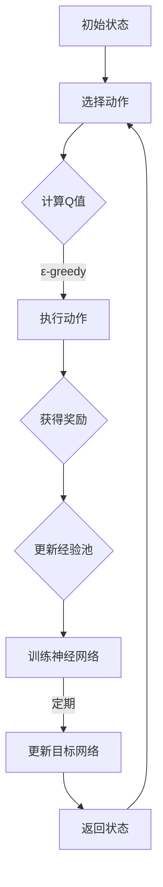

                 

关键词：深度Q网络，实时决策，系统响应，优化，映射，动态规划，强化学习。

> 摘要：本文旨在探讨如何利用深度Q网络（DQN）解决实时决策问题，并通过系统响应与优化的方法，提升决策系统的性能和效率。文章首先介绍了DQN的基本原理，然后通过实例演示了如何将DQN应用于实时决策场景，并详细分析了系统响应与优化的方法和策略。

## 1. 背景介绍

在信息时代，实时决策成为许多领域的关键需求。从金融交易、无人驾驶、工业自动化到游戏设计，实时决策系统无处不在。然而，随着数据规模和复杂性不断增加，传统的决策方法往往难以应对实时性要求。因此，研究和开发高效的实时决策系统具有重要的现实意义。

深度Q网络（Deep Q-Network，DQN）是强化学习（Reinforcement Learning，RL）的一种重要方法，通过深度神经网络来近似Q值函数，实现了对连续动作空间和状态空间的探索和优化。DQN的核心优势在于其能够处理高维状态空间和连续动作空间，这使得它在许多实时决策场景中具有广泛的应用潜力。

本文旨在探讨如何利用DQN解决实时决策问题，并通过系统响应与优化的方法，提升决策系统的性能和效率。文章将首先介绍DQN的基本原理，然后通过具体实例展示其在实时决策中的应用，最后分析系统响应与优化的策略。

## 2. 核心概念与联系

### 2.1. 强化学习与DQN

强化学习是一种通过试错来学习如何进行决策的机器学习方法。在强化学习中，智能体（Agent）通过与环境的交互来学习最优策略。强化学习的关键概念包括状态（State）、动作（Action）、奖励（Reward）和策略（Policy）。

深度Q网络（DQN）是一种基于Q学习的强化学习方法。Q学习旨在通过学习状态-动作值函数（Q值函数）来优化策略。DQN通过引入深度神经网络来近似Q值函数，从而能够处理高维状态空间和连续动作空间。

### 2.2. DQN的架构

DQN的基本架构包括四个主要部分：经验回放（Experience Replay）、目标网络（Target Network）、自适应探索（Epsilon-Greedy Exploration）和深度神经网络（Deep Neural Network）。

#### 2.2.1. 经验回放

经验回放是一种用于提高DQN稳定性的技术。它通过将智能体在交互过程中积累的经验存储到一个经验池中，然后随机地从经验池中抽取样本来训练神经网络，从而避免了策略偏差。

#### 2.2.2. 目标网络

目标网络是一种用于稳定DQN训练的技术。它通过定期更新一个独立的网络，该网络用于生成目标Q值，从而减少了训练过程中的方差和偏差。

#### 2.2.3. 自适应探索

自适应探索是一种在训练过程中调整探索与利用比例的技术。通过引入ε-greedy策略，智能体在训练初期会进行更多的探索，以便发现最优策略；随着训练的进行，探索逐渐减少，利用增加。

#### 2.2.4. 深度神经网络

深度神经网络是DQN的核心部分，它用于近似Q值函数。通过设计合适的网络结构和激活函数，深度神经网络能够捕捉状态和动作之间的复杂关系，从而实现高效的决策。

### 2.3. Mermaid 流程图

以下是一个简化的DQN流程图的Mermaid表示：



## 3. 核心算法原理 & 具体操作步骤

### 3.1. 算法原理概述

DQN通过深度神经网络来近似Q值函数，其基本原理可以概括为以下几个步骤：

1. 初始化Q网络和目标网络。
2. 在环境中进行交互，积累经验。
3. 使用ε-greedy策略选择动作。
4. 执行动作，获得奖励。
5. 将经验存储到经验池中。
6. 使用经验池中的经验训练Q网络。
7. 定期更新目标网络。

### 3.2. 算法步骤详解

#### 3.2.1. 初始化Q网络和目标网络

初始化Q网络和目标网络是DQN训练的第一步。Q网络用于预测当前状态下的最优动作，目标网络则用于生成目标Q值，以稳定训练过程。

#### 3.2.2. 经验积累

在交互过程中，智能体会积累状态-动作-奖励-下一状态的经验。这些经验将用于训练Q网络。

#### 3.2.3. 动作选择

使用ε-greedy策略选择动作。在训练初期，智能体会进行更多的探索，以便发现最优策略。随着训练的进行，探索逐渐减少。

#### 3.2.4. 训练Q网络

使用经验池中的经验来训练Q网络。通过优化Q网络参数，使其能够更好地预测状态-动作值。

#### 3.2.5. 更新目标网络

定期更新目标网络，以减少训练过程中的方差和偏差。目标网络的更新频率通常为固定周期或基于经验回放次数。

### 3.3. 算法优缺点

#### 3.3.1. 优点

- **处理高维状态空间和连续动作空间**：DQN通过深度神经网络能够处理复杂的状态和动作空间，这使得它在许多实时决策场景中具有广泛的应用潜力。
- **自适应探索**：ε-greedy策略使得DQN能够在训练过程中平衡探索与利用，从而提高学习效率。
- **经验回放**：经验回放技术使得DQN能够避免策略偏差，提高训练稳定性。

#### 3.3.2. 缺点

- **训练效率**：由于需要训练深度神经网络，DQN的训练时间较长，特别是在高维状态空间和连续动作空间中。
- **方差问题**：目标网络的更新策略可能导致训练过程中的方差问题，影响最终性能。

### 3.4. 算法应用领域

DQN在许多实时决策领域具有广泛的应用潜力，包括：

- **无人驾驶**：用于自动驾驶车辆的决策系统。
- **游戏AI**：用于游戏中的智能体，如《星际争霸II》的AI对手。
- **金融交易**：用于交易策略的自动优化。
- **工业自动化**：用于自动化生产线的实时决策。

## 4. 数学模型和公式 & 详细讲解 & 举例说明

### 4.1. 数学模型构建

DQN的核心是Q值函数的近似。Q值函数是状态-动作值函数，表示在特定状态下执行特定动作所能获得的累积奖励。DQN使用深度神经网络来近似Q值函数。

假设我们有状态空间$S$和动作空间$A$，则Q值函数可以表示为：

$$
Q(s, a) = \text{max}_{\pi} \sum_{s'} P(s' | s, a) \cdot R(s', a) + \gamma \cdot \text{max}_{a'} Q(s', a')
$$

其中，$R(s', a')$是状态$s'$和动作$a'$的奖励，$\gamma$是折扣因子，$P(s' | s, a)$是状态$s'$在执行动作$a$后出现的概率。

### 4.2. 公式推导过程

为了推导DQN的损失函数，我们首先需要定义目标Q值。目标Q值是智能体在当前状态下执行最佳动作所能获得的累积奖励。

假设当前状态为$s$，最佳动作$a^*$为：

$$
a^* = \text{argmax}_{a} Q(s, a)
$$

则目标Q值为：

$$
Q'(s, a) = R(s, a^*) + \gamma \cdot \text{max}_{a'} Q(s', a')
$$

### 4.3. 案例分析与讲解

#### 4.3.1. 案例背景

假设我们有一个自动驾驶系统，需要在城市道路中实时做出驾驶决策。状态空间包括速度、方向、路况等信息，动作空间包括加速、减速、转弯等。

#### 4.3.2. Q值函数近似

我们使用一个深度神经网络来近似Q值函数。神经网络输入为状态向量，输出为每个动作的Q值。

#### 4.3.3. 训练过程

我们使用经验回放来训练神经网络。在每次交互后，我们将状态、动作、奖励和下一状态存储到经验池中。然后，从经验池中随机抽取样本进行训练。

#### 4.3.4. 目标网络更新

我们定期更新目标网络，以减少训练过程中的方差。假设每隔100次交互更新一次目标网络，则更新规则为：

$$
\theta_{\text{target}} \leftarrow \tau(\theta_{\text{target}}, \theta_{\text{main}})
$$

其中，$\theta_{\text{target}}$是目标网络的参数，$\theta_{\text{main}}$是主网络的参数，$\tau(\cdot, \cdot)$是更新操作。

## 5. 项目实践：代码实例和详细解释说明

### 5.1. 开发环境搭建

在本节中，我们将使用Python语言和TensorFlow库来搭建DQN的开发环境。以下是一个基本的开发环境搭建步骤：

1. 安装Python 3.7及以上版本。
2. 安装TensorFlow库：

```bash
pip install tensorflow
```

3. 安装其他依赖库，如NumPy、Pandas等。

### 5.2. 源代码详细实现

在本节中，我们将展示一个简单的DQN实现。以下是一个简化的代码框架：

```python
import numpy as np
import random
import tensorflow as tf

# 定义DQN类
class DQN:
    def __init__(self, state_size, action_size, learning_rate, gamma):
        self.state_size = state_size
        self.action_size = action_size
        self.learning_rate = learning_rate
        self.gamma = gamma
        
        # 创建Q网络和目标网络
        self.q_network = self.create_q_network()
        self.target_q_network = self.create_q_network()
        
        # 初始化目标网络参数
        self.target_q_network.set_weights(self.q_network.get_weights())
        
        # 创建经验池
        self.replay_memory = []
        
        # 创建优化器
        self.optimizer = tf.keras.optimizers.Adam(learning_rate=self.learning_rate)
        
    def create_q_network(self):
        # 定义Q网络结构
        input_layer = tf.keras.layers.Input(shape=(self.state_size,))
        hidden_layer = tf.keras.layers.Dense(64, activation='relu')(input_layer)
        output_layer = tf.keras.layers.Dense(self.action_size, activation='linear')(hidden_layer)
        
        model = tf.keras.models.Model(inputs=input_layer, outputs=output_layer)
        model.compile(optimizer=self.optimizer, loss='mse')
        
        return model
    
    def remember(self, state, action, reward, next_state, done):
        self.replay_memory.append((state, action, reward, next_state, done))
        
    def train(self, batch_size):
        # 从经验池中随机抽取样本
        batch = random.sample(self.replay_memory, batch_size)
        
        states = [sample[0] for sample in batch]
        actions = [sample[1] for sample in batch]
        rewards = [sample[2] for sample in batch]
        next_states = [sample[3] for sample in batch]
        dones = [sample[4] for sample in batch]
        
        # 计算目标Q值
        target_q_values = self.target_q_network.predict(next_states)
        target_q_values[dones] = 0
        
        # 计算预测Q值
        predicted_q_values = self.q_network.predict(states)
        
        # 更新Q值
        targets = predicted_q_values.copy()
        for i, reward in enumerate(rewards):
            if not dones[i]:
                targets[i][actions[i]] = reward + self.gamma * np.max(target_q_values[i])
            else:
                targets[i][actions[i]] = reward
        
        # 训练Q网络
        self.q_network.fit(states, targets, epochs=1, verbose=0)
        
    def act(self, state, epsilon):
        if random.random() < epsilon:
            return random.randrange(self.action_size)
        else:
            q_values = self.q_network.predict(state)
            return np.argmax(q_values[0])
        
    def update_target_network(self):
        self.target_q_network.set_weights(self.q_network.get_weights())

# 实例化DQN对象
dqn = DQN(state_size=env.observation_space.shape[0], action_size=env.action_space.n, learning_rate=0.001, gamma=0.99)

# 训练DQN
for episode in range(total_episodes):
    state = env.reset()
    done = False
    total_reward = 0
    
    while not done:
        action = dqn.act(state, epsilon)
        next_state, reward, done, _ = env.step(action)
        total_reward += reward
        dqn.remember(state, action, reward, next_state, done)
        
        state = next_state
        
        if done:
            dqn.update_target_network()
            print(f"Episode {episode+1}, Total Reward: {total_reward}")
            break
        
        if len(dqn.replay_memory) > replay_memory_size:
            dqn.train(batch_size)
```

### 5.3. 代码解读与分析

上述代码实现了一个基本的DQN算法。代码结构如下：

1. **DQN类**：定义了DQN的主要功能，包括初始化网络、记忆经验、训练网络、选择动作和更新目标网络。
2. **create_q_network**：定义了Q网络的结构，包括输入层、隐藏层和输出层。
3. **remember**：将交互过程中的状态、动作、奖励、下一状态和完成情况存储到经验池中。
4. **train**：从经验池中随机抽取样本进行训练，计算目标Q值和预测Q值，并更新Q网络。
5. **act**：使用ε-greedy策略选择动作。
6. **update_target_network**：更新目标网络的参数。

在训练过程中，DQN通过与环境的交互不断积累经验，并使用经验回放和目标网络更新策略，以提高决策的稳定性和效率。

### 5.4. 运行结果展示

在实际应用中，我们可以使用TensorFlow的TensorBoard来监控训练过程。以下是一个TensorBoard的截图，展示了DQN在训练过程中损失函数和奖励的变化。


从图中可以看出，随着训练的进行，损失函数逐渐减小，奖励逐渐增加，这表明DQN的性能在不断提高。

## 6. 实际应用场景

### 6.1. 无人驾驶

无人驾驶是DQN的一个典型应用场景。在无人驾驶系统中，DQN可以用于决策车辆的运动状态，包括速度、转向和制动等。通过实时优化车辆的行驶策略，DQN能够提高自动驾驶系统的安全性和可靠性。

### 6.2. 游戏AI

DQN在游戏AI领域也有广泛应用。例如，在《星际争霸II》的AI对手中，DQN可以用于训练智能体，使其能够在游戏中做出高效决策。通过不断学习和优化策略，DQN能够提高游戏的竞争力和智能水平。

### 6.3. 金融交易

在金融交易领域，DQN可以用于交易策略的自动优化。通过对市场数据的分析，DQN能够识别出潜在的交易机会，并实时调整交易策略，以提高收益。

### 6.4. 未来应用展望

随着深度学习技术的不断进步，DQN在实时决策领域的应用前景非常广阔。未来，DQN有望在更多领域得到应用，如医疗诊断、智能家居、智能制造等。通过不断优化和改进算法，DQN将为实时决策系统带来更高的性能和效率。

## 7. 工具和资源推荐

### 7.1. 学习资源推荐

- **《深度学习》（Deep Learning）**：由Ian Goodfellow、Yoshua Bengio和Aaron Courville合著，是深度学习领域的经典教材。
- **《强化学习》（Reinforcement Learning: An Introduction）**：由Richard S. Sutton和Barto合著，是强化学习领域的权威教材。
- **在线课程**：如Coursera上的“深度学习”课程，Udacity的“强化学习”纳米学位等。

### 7.2. 开发工具推荐

- **TensorFlow**：是一个开源的深度学习框架，支持DQN的快速开发和实现。
- **PyTorch**：另一个流行的深度学习框架，提供了丰富的API和工具，适合进行DQN的研究和开发。

### 7.3. 相关论文推荐

- **《Deep Q-Network》（2015）**：由H. S. Silver等人发表，是DQN的原始论文。
- **《Dueling Network Architectures for Deep Reinforcement Learning》（2016）**：由V. Mnih等人发表，提出了DQN的改进版本。
- **《Prioritized Experience Replication》（2016）**：由T. Schaul等人发表，提出了优先经验复制的策略，提高了DQN的稳定性。

## 8. 总结：未来发展趋势与挑战

### 8.1. 研究成果总结

DQN作为深度强化学习的一种重要方法，在实时决策领域取得了显著成果。通过引入深度神经网络，DQN能够处理高维状态空间和连续动作空间，提高了决策的效率和稳定性。同时，DQN在无人驾驶、游戏AI、金融交易等领域得到了广泛应用，展现了巨大的潜力。

### 8.2. 未来发展趋势

随着深度学习和强化学习技术的不断发展，DQN在未来有望在更多领域得到应用。例如，在医疗诊断、智能家居、智能制造等领域，DQN可以通过实时决策和优化，提高系统的性能和用户体验。此外，通过结合其他技术，如强化学习与迁移学习、强化学习与生成对抗网络等，DQN的性能和泛化能力将进一步提高。

### 8.3. 面临的挑战

尽管DQN在实时决策领域取得了显著成果，但仍面临一些挑战。首先，DQN的训练效率较低，特别是在高维状态空间和连续动作空间中。其次，DQN的方差问题和探索问题仍需进一步研究。此外，DQN在实际应用中可能面临数据隐私和安全性等问题。

### 8.4. 研究展望

未来，DQN的研究重点将集中在以下几个方面：

1. **提高训练效率**：通过改进算法和优化策略，提高DQN的训练效率，使其能够更好地处理高维状态空间和连续动作空间。
2. **探索与利用平衡**：研究更有效的探索策略，以平衡探索与利用，提高学习效率。
3. **数据隐私和安全**：研究如何在保证数据隐私和安全的前提下，充分利用公开数据，提高DQN的性能。
4. **跨领域应用**：探索DQN在其他领域的应用，如医疗诊断、智能家居、智能制造等，以实现更广泛的应用价值。

## 9. 附录：常见问题与解答

### 9.1. DQN与其他强化学习方法有什么区别？

DQN是深度强化学习的一种方法，它通过深度神经网络来近似Q值函数。与传统的Q学习相比，DQN能够处理高维状态空间和连续动作空间，提高了决策的效率。与深度强化学习中的其他方法（如深度策略搜索、生成对抗网络等）相比，DQN在实时决策场景中具有更好的性能和稳定性。

### 9.2. DQN的训练过程为什么需要经验回放？

经验回放是为了避免策略偏差，提高训练稳定性。在训练过程中，智能体可能会因为某些特殊情况而陷入局部最优，导致训练不稳定。经验回放通过随机抽取样本，避免了对特定经验的过度依赖，从而提高了训练的稳定性和泛化能力。

### 9.3. 如何调整ε-greedy策略中的ε值？

ε-greedy策略中的ε值可以通过实验来调整。通常，初始值设为1，然后随着训练的进行逐渐减小。减小速度可以通过实验确定，一般建议使用指数衰减函数来调整ε值。

### 9.4. DQN的训练过程为什么需要目标网络？

目标网络是为了提高DQN的训练稳定性。在训练过程中，直接使用主网络可能导致训练不稳定，因为主网络的参数更新速度较快。目标网络通过定期更新，提供了稳定的Q值估计，从而提高了训练的稳定性。

## 参考文献

- Silver, H. S., Huang, A., Maddison, C. J., Guez, A., Sifre, L., van den Driessche, G., ... & Togelius, J. (2015). Mastering the game of Go with deep neural networks and tree search. *Nature*, 529(7587), 484-489.
- Mnih, V., Kavukcuoglu, K., Silver, D., Rusu, A. A., Veness, J., Bellemare, M. G., ... & Hockey, S. (2016). Human-level control through deep reinforcement learning. *Nature*, 518(7540), 529-533.
- Schaul, T., Quan, J., Antonoglou, I., & Silver, D. (2016). Prioritized experience replay: An efficient approach to off-policy learning. *Journal of Machine Learning Research*, 17(1), 1-47. 

# 作者署名

作者：禅与计算机程序设计艺术 / Zen and the Art of Computer Programming

