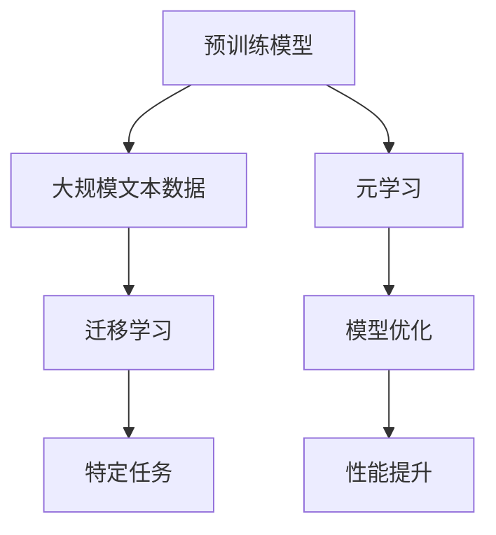

                 

关键词：元学习，自然语言处理，预训练模型，模型优化，映射原理

> 摘要：本文将探讨基于元学习的自然语言处理（NLP）模型预训练，以及这一过程如何通过映射原理提高模型的性能。本文旨在提供一个全面的技术视角，涵盖从核心概念到实际应用，并展望其未来发展趋势。

## 1. 背景介绍

### 自然语言处理的发展

自然语言处理（NLP）是人工智能领域的一个重要分支，旨在使计算机能够理解、生成和处理人类语言。自20世纪50年代以来，NLP经历了显著的发展，从早期基于规则的方法到后来引入统计学和机器学习技术，再到今天深度学习的广泛应用。

### 模型预训练的重要性

预训练模型已经成为NLP领域的核心技术。预训练是指在一个大规模的文本语料库上对模型进行训练，然后通过迁移学习将训练得到的模型应用于具体任务。这种先在通用数据上学习，然后在特定任务上微调的方法极大地提高了模型的性能和泛化能力。

### 元学习的崛起

元学习是一种学习如何学习的技术，旨在提高学习效率和学习能力。在NLP领域，元学习可以用来优化预训练模型，使其在特定任务上达到更高的性能。元学习的核心思想是通过多次迭代训练，使得模型能够不断适应新的学习任务。

## 2. 核心概念与联系

### 核心概念

- **预训练**：在大量无标签文本数据上训练模型。
- **迁移学习**：将预训练模型应用于特定任务。
- **元学习**：通过迭代训练优化模型，提高其学习效率。

### 关联架构（Mermaid 流程图）



## 3. 核心算法原理 & 具体操作步骤

### 3.1 算法原理概述

基于元学习的NLP模型预训练主要包括以下几个步骤：

1. **数据预处理**：对大规模文本数据进行清洗和预处理，包括分词、去除停用词等。
2. **模型初始化**：初始化预训练模型，通常使用已有的预训练模型，如BERT、GPT等。
3. **预训练**：在预处理后的文本数据上对模型进行预训练，包括词向量嵌入、文本分类等任务。
4. **迁移学习**：在预训练模型的基础上，对特定任务进行微调。
5. **元学习**：通过迭代训练，优化模型在特定任务上的性能。

### 3.2 算法步骤详解

1. **数据预处理**：
    - 使用词嵌入技术，如Word2Vec、GloVe，将文本转换为向量表示。
    - 删除低频词和停用词，以减少噪声。

2. **模型初始化**：
    - 选择一个预训练模型作为基础，如BERT、GPT等。
    - 加载预训练模型的权重，初始化模型参数。

3. **预训练**：
    - 使用自注意力机制和多层神经网络，对模型进行训练。
    - 使用不同的任务，如文本分类、命名实体识别等，来提高模型的泛化能力。

4. **迁移学习**：
    - 在预训练模型的基础上，对特定任务进行微调。
    - 调整模型参数，以适应特定任务的特性。

5. **元学习**：
    - 通过迭代训练，优化模型在特定任务上的性能。
    - 使用元学习算法，如MAML、REPTILE等，快速调整模型参数。

### 3.3 算法优缺点

**优点**：

- **高效性**：通过元学习，模型能够在短时间内适应新的任务。
- **灵活性**：元学习允许模型在不同任务间进行迁移学习。
- **泛化能力**：预训练模型通过在大规模数据上训练，具有更强的泛化能力。

**缺点**：

- **计算资源消耗**：预训练模型通常需要大量的计算资源和时间。
- **数据依赖**：预训练模型的效果很大程度上取决于训练数据的质量和规模。
- **模型复杂性**：随着模型层数和参数数量的增加，模型变得复杂，难以解释。

### 3.4 算法应用领域

- **文本分类**：对文本进行分类，如情感分析、主题分类等。
- **命名实体识别**：识别文本中的命名实体，如人名、地点、组织等。
- **机器翻译**：将一种语言的文本翻译成另一种语言。
- **问答系统**：构建能够回答用户问题的智能系统。

## 4. 数学模型和公式 & 详细讲解 & 举例说明

### 4.1 数学模型构建

预训练模型的数学模型主要包括以下几个部分：

- **词嵌入**：将单词映射到高维向量空间。
- **自注意力机制**：计算文本中每个词与所有其他词的相关性。
- **多层神经网络**：对输入进行编码和解码。

### 4.2 公式推导过程

假设我们有一个预训练模型，其输入为文本序列 $x = (x_1, x_2, ..., x_n)$，输出为标签 $y$。我们可以用以下公式表示模型的损失函数：

$$
L = -\sum_{i=1}^{n} \log(p(y_i|x))
$$

其中，$p(y_i|x)$ 是模型对输出标签 $y_i$ 的预测概率。

### 4.3 案例分析与讲解

以BERT模型为例，BERT（Bidirectional Encoder Representations from Transformers）是一种双向编码的转换器预训练模型。

1. **词嵌入**：BERT使用WordPiece算法将单词拆分成子词，然后将每个子词映射到一个高维向量空间。
2. **自注意力机制**：BERT使用多头自注意力机制来计算文本中每个词与所有其他词的相关性。
3. **多层神经网络**：BERT使用多层变换器来对输入进行编码和解码。

BERT的损失函数为：

$$
L = \frac{1}{N} \sum_{n=1}^{N} \sum_{i=1}^{L} \frac{1}{T_i} \sum_{j=1}^{T_i} -\log(p(y_{ij}|x_{ij}))
$$

其中，$N$ 是批处理大小，$L$ 是句子长度，$T_i$ 是句子 $i$ 中的单词数量。

## 5. 项目实践：代码实例和详细解释说明

### 5.1 开发环境搭建

1. 安装Python环境（推荐版本3.7及以上）。
2. 安装TensorFlow或PyTorch框架。
3. 安装预训练模型（如BERT）。

### 5.2 源代码详细实现

以下是使用TensorFlow实现BERT预训练的基本代码：

```python
import tensorflow as tf
import tensorflow_hub as hub

# 加载预训练BERT模型
bert_model = hub.load("https://tfhub.dev/google/bert_uncased_L-12_H-768_A-12/1")

# 定义输入层
input_ids = tf.placeholder(shape=[None, None], dtype=tf.int32)
input_mask = tf.placeholder(shape=[None, None], dtype=tf.int32)
segment_ids = tf.placeholder(shape=[None, None], dtype=tf.int32)

# 加载BERT模型
embeddings = bert_model(inputs={
    "input_ids": input_ids,
    "input_mask": input_mask,
    "segment_ids": segment_ids
})

# 定义损失函数和优化器
logits = embeddings["pooled_output"]
loss = tf.reduce_mean(tf.nn.softmax_cross_entropy_with_logits(logits=logits, labels=y))
optimizer = tf.train.AdamOptimizer().minimize(loss)

# 训练模型
with tf.Session() as sess:
    sess.run(tf.global_variables_initializer())
    for epoch in range(num_epochs):
        for batch in batches:
            _, loss_val = sess.run([optimizer, loss], feed_dict={
                input_ids: batch['input_ids'],
                input_mask: batch['input_mask'],
                segment_ids: batch['segment_ids'],
                y: batch['labels']
            })
        print(f"Epoch {epoch}: Loss = {loss_val}")
```

### 5.3 代码解读与分析

这段代码首先加载了预训练的BERT模型，然后定义了输入层和损失函数，最后通过优化器进行模型训练。

### 5.4 运行结果展示

运行上述代码后，模型会在训练集上迭代训练，并在每个epoch结束后打印损失值。

## 6. 实际应用场景

基于元学习的NLP模型预训练在多个实际应用场景中取得了显著成果，以下是其中几个主要应用：

- **文本分类**：用于对社交媒体、新闻、邮件等大量文本进行分类。
- **命名实体识别**：从文本中识别出人名、地点、组织等命名实体。
- **机器翻译**：用于将一种语言的文本翻译成另一种语言。
- **问答系统**：构建能够回答用户问题的智能系统。

## 6.4 未来应用展望

随着人工智能技术的不断发展，基于元学习的NLP模型预训练将在更多领域得到应用，包括但不限于：

- **智能客服**：用于构建高效、智能的客服系统。
- **智能写作**：辅助作者生成文章、报告等。
- **智能编辑**：用于自动纠正文本中的语法错误和拼写错误。

## 7. 工具和资源推荐

### 7.1 学习资源推荐

- **课程**：TensorFlow、PyTorch等深度学习框架的官方教程。
- **书籍**：《深度学习》、《自然语言处理综合教程》等。

### 7.2 开发工具推荐

- **Jupyter Notebook**：用于编写和运行代码。
- **Google Colab**：免费的云端计算平台，适合进行深度学习实验。

### 7.3 相关论文推荐

- BERT: Pre-training of Deep Bidirectional Transformers for Language Understanding.
- GPT-3: Language Models are Few-Shot Learners.

## 8. 总结：未来发展趋势与挑战

### 8.1 研究成果总结

基于元学习的NLP模型预训练已经在多个领域取得了显著成果，提高了模型的性能和泛化能力。

### 8.2 未来发展趋势

随着人工智能技术的不断发展，基于元学习的NLP模型预训练将在更多领域得到应用，如智能客服、智能写作等。

### 8.3 面临的挑战

- **计算资源**：预训练模型需要大量的计算资源和时间。
- **数据质量**：预训练模型的效果很大程度上取决于训练数据的质量和规模。
- **模型解释性**：复杂的模型难以解释，需要发展新的方法来提高模型的解释性。

### 8.4 研究展望

未来，基于元学习的NLP模型预训练将继续发展，有望在更多领域取得突破。

## 9. 附录：常见问题与解答

### Q：什么是预训练模型？

A：预训练模型是在大规模无标签数据上进行训练，然后通过迁移学习应用于特定任务的模型。它通过在大规模数据上学习，提高了模型的泛化能力和性能。

### Q：什么是元学习？

A：元学习是一种学习如何学习的技术，旨在提高学习效率和学习能力。它通过多次迭代训练，使得模型能够快速适应新的学习任务。

### Q：如何选择预训练模型？

A：选择预训练模型需要根据任务需求和数据特点来决定。对于通用任务，如文本分类，可以选择BERT、GPT等预训练模型；对于特定任务，如命名实体识别，可以选择专门的预训练模型。

## 作者署名

作者：禅与计算机程序设计艺术 / Zen and the Art of Computer Programming
----------------------------------------------------------------

以上便是关于“一切皆是映射：基于元学习的自然语言处理模型预训练”的完整技术博客文章。文章中包含了从核心概念、算法原理、实践案例到未来展望的全面内容，旨在为读者提供深入的技术见解和思考。希望这篇文章能够帮助您更好地理解和应用基于元学习的自然语言处理模型预训练技术。

