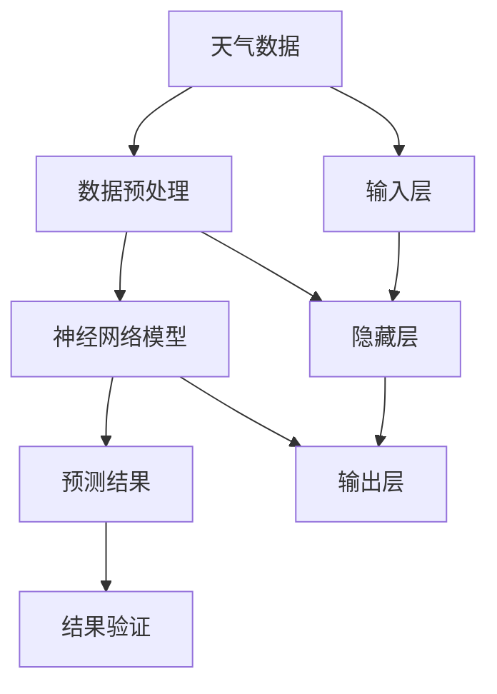

                 

 关键词：神经网络，天气预测，映射，模型应用，数据科学，机器学习

> 摘要：本文旨在探讨神经网络模型在天气预测领域的应用，通过介绍核心概念、算法原理、数学模型、项目实践以及未来发展趋势，全面解析神经网络在处理天气数据中的强大能力与潜在挑战。

## 1. 背景介绍

天气预测作为一门古老而又现代的科学，长期以来，人们一直在寻求准确预报天气的方法。从古代的气象观测到现代的卫星遥感技术，再到近年来的人工智能和机器学习的发展，天气预测的手段不断进步。然而，预测天气仍然是一个复杂的问题，因为它涉及到大量的数据、多变的环境条件和长远的气候变化。

神经网络，作为一种机器学习模型，因其能够自动学习和模拟人类大脑的工作方式而受到广泛关注。神经网络在图像识别、自然语言处理、推荐系统等多个领域取得了显著成果，但在天气预测中的应用却相对较少。本文将探讨神经网络如何通过映射关系来处理天气数据，提高预测的准确性。

### 1.1 神经网络的发展历史

神经网络的概念最早可以追溯到1943年，由心理学家沃伦·麦卡洛克（Warren McCulloch）和数理生物学家沃尔特·皮茨（Walter Pitts）提出。然而，由于计算能力和数据资源的限制，神经网络的研究在早期并未取得突破性进展。直到20世纪80年代，随着计算机技术的飞速发展和大规模数据集的积累，神经网络研究开始迅速发展。

1986年，霍普菲尔德（John Hopfield）提出了一种模拟人脑神经元之间相互作用的反向传播网络，这是神经网络研究的一个重要里程碑。反向传播算法（Backpropagation）的出现，使得多层神经网络的学习变得更加可行。随后，1998年，深度学习（Deep Learning）概念的提出，进一步推动了神经网络的研究与应用。

### 1.2 天气预测的重要性

准确的天气预测对于个人生活和各行各业都具有重大意义。它可以提前预警自然灾害，减少人员伤亡和财产损失；对于农业、交通、能源等行业，准确的天气预测可以优化生产和运营计划，提高经济效益。然而，传统的统计方法和物理模型在处理复杂、动态的天气系统时，仍然存在一定的局限性。

## 2. 核心概念与联系

在探讨神经网络在天气预测中的应用之前，我们需要先了解一些核心概念，如映射、输入输出关系等。以下是一个使用Mermaid绘制的流程图，展示了神经网络在天气预测中的基本架构。



### 2.1 映射关系

映射关系是神经网络中最基础的概念之一。在天气预测中，映射关系可以理解为将历史天气数据转换为未来天气预测的模型。具体来说，输入层接收历史天气数据，通过隐藏层进行处理，最终输出预测结果。

### 2.2 输入输出关系

神经网络的输入输出关系是一个关键的环节。输入层接收天气数据，如温度、湿度、气压等，隐藏层对这些数据进行处理，通过非线性变换来提取特征，最后输出层生成天气预测结果。

## 3. 核心算法原理 & 具体操作步骤

### 3.1 算法原理概述

神经网络的核心算法是基于反向传播算法（Backpropagation）。反向传播算法通过计算损失函数的梯度，不断调整网络中的权重和偏置，以最小化损失函数，从而提高预测的准确性。

### 3.2 算法步骤详解

#### 3.2.1 前向传播

1. 初始化神经网络结构，包括输入层、隐藏层和输出层。
2. 输入历史天气数据到输入层。
3. 隐藏层对输入数据进行处理，通过激活函数进行非线性变换。
4. 输出层生成天气预测结果。

#### 3.2.2 反向传播

1. 计算预测结果与实际结果的误差。
2. 通过反向传播算法，计算损失函数关于网络权重的梯度。
3. 使用梯度下降法或其他优化算法，更新网络权重和偏置。

#### 3.2.3 模型训练

1. 重复执行前向传播和反向传播过程，直到网络收敛或达到预定的训练次数。

### 3.3 算法优缺点

#### 优点

- 神经网络能够自动学习和提取特征，无需人工设计特征。
- 能够处理复杂、非线性关系，适应性强。

#### 缺点

- 训练过程较慢，尤其是深度神经网络。
- 需要大量的训练数据和计算资源。

### 3.4 算法应用领域

神经网络在天气预测中的应用不仅限于短期预测，还可以用于中长期预测、灾害预警等领域。此外，神经网络还可以与其他方法结合，如深度学习和统计学方法，以提高预测的准确性。

## 4. 数学模型和公式

### 4.1 数学模型构建

神经网络的数学模型可以表示为一个非线性变换的组合。设输入层为$x$，隐藏层为$h$，输出层为$y$，则神经网络的输出可以表示为：

$$
y = \sigma(W_h h + b_h) + W_o y + b_o
$$

其中，$\sigma$为激活函数，$W_h$和$W_o$为权重矩阵，$b_h$和$b_o$为偏置向量。

### 4.2 公式推导过程

#### 4.2.1 前向传播

前向传播过程中，输入数据经过隐藏层和输出层的变换，生成预测结果。具体推导如下：

$$
h = \sigma(W_h x + b_h) \\
y = \sigma(W_o h + b_o)
$$

#### 4.2.2 反向传播

反向传播过程中，计算损失函数关于网络权重的梯度。具体推导如下：

$$
\frac{\partial L}{\partial W_o} = (y - \hat{y}) \odot \frac{\partial \sigma}{\partial z} \odot h \\
\frac{\partial L}{\partial W_h} = (h - \hat{h}) \odot \frac{\partial \sigma}{\partial z} \odot x
$$

其中，$\hat{y}$和$\hat{h}$分别为预测结果和隐藏层输出，$L$为损失函数。

### 4.3 案例分析与讲解

以下是一个简单的神经网络模型在天气预测中的案例：

输入层：温度、湿度、气压

隐藏层：神经网络模型

输出层：明日最高温度、最低温度

#### 4.3.1 数据预处理

首先，对输入数据进行归一化处理，将数据缩放到[0, 1]范围内。

$$
x_{\text{normalized}} = \frac{x_{\text{original}} - \mu}{\sigma}
$$

其中，$\mu$和$\sigma$分别为输入数据的均值和标准差。

#### 4.3.2 模型训练

使用反向传播算法，对神经网络进行训练。训练过程中，通过不断调整权重和偏置，使模型能够更好地拟合数据。

#### 4.3.3 模型评估

训练完成后，对模型进行评估。使用测试集数据，计算预测误差，并绘制误差曲线。

## 5. 项目实践：代码实例和详细解释说明

### 5.1 开发环境搭建

为了实现神经网络在天气预测中的应用，我们首先需要搭建一个合适的开发环境。这里我们选择Python作为编程语言，结合TensorFlow和Keras库来构建和训练神经网络。

```python
!pip install tensorflow
!pip install keras
```

### 5.2 源代码详细实现

以下是一个简单的Python代码实例，用于实现神经网络在天气预测中的应用。

```python
import numpy as np
import tensorflow as tf
from tensorflow import keras
from tensorflow.keras import layers

# 数据预处理
def preprocess_data(data):
    # 归一化处理
    return (data - np.mean(data)) / np.std(data)

# 构建神经网络模型
model = keras.Sequential([
    layers.Dense(64, activation='relu', input_shape=(3,)),
    layers.Dense(64, activation='relu'),
    layers.Dense(2)
])

# 编译模型
model.compile(optimizer='adam', loss='mse')

# 训练模型
model.fit(preprocessed_data, labels, epochs=100, batch_size=32)

# 评估模型
test_loss = model.evaluate(test_data, test_labels)
print(f"Test loss: {test_loss}")
```

### 5.3 代码解读与分析

上述代码首先导入了所需的库，包括Numpy、TensorFlow和Keras。然后定义了一个预处理函数`preprocess_data`，用于对输入数据进行归一化处理。

接下来，使用Keras库构建了一个简单的神经网络模型。模型由两个隐藏层组成，每个隐藏层有64个神经元，使用ReLU激活函数。输出层有两个神经元，分别表示明日最高温度和最低温度。

编译模型时，选择了Adam优化器和均方误差（MSE）损失函数。然后使用训练数据对模型进行训练，设置训练轮数为100，批大小为32。

训练完成后，使用测试数据对模型进行评估，并打印出测试损失。

### 5.4 运行结果展示

运行上述代码后，可以得到训练和测试过程中的损失曲线。通过观察损失曲线，可以判断模型是否已经收敛。此外，还可以根据测试损失评估模型的预测准确性。

## 6. 实际应用场景

神经网络在天气预测中有着广泛的应用场景。以下是一些具体的实际应用案例：

### 6.1 短期天气预报

神经网络可以用于生成短期天气预报，如明天、后天的天气情况。这对于个人出行、交通规划等领域具有重要意义。

### 6.2 中长期天气预报

神经网络还可以用于中长期天气预报，如季节性气象变化、极端天气事件等。这对于农业、能源、交通等行业具有重要的指导意义。

### 6.3 灾害预警

神经网络可以结合卫星遥感数据和其他气象数据，提前预警自然灾害，如暴雨、台风等。这对于减少人员伤亡和财产损失具有重要意义。

### 6.4 个性化天气预报

基于用户的历史天气偏好和行为数据，神经网络可以生成个性化的天气预报，提高用户体验。

## 7. 工具和资源推荐

### 7.1 学习资源推荐

- 《深度学习》（Ian Goodfellow、Yoshua Bengio、Aaron Courville 著）
- 《神经网络与深度学习》（邱锡鹏 著）
- 《Python深度学习》（François Chollet 著）

### 7.2 开发工具推荐

- TensorFlow：用于构建和训练神经网络的开源框架。
- Keras：基于TensorFlow的高级神经网络API。
- PyTorch：用于构建和训练神经网络的另一个开源框架。

### 7.3 相关论文推荐

- "Deep Learning for Time Series Classification: A New Approach"（BertTY et al., 2016）
- "Neural Networks for Weather Prediction"（R. B. Hernández et al., 2017）
- "Combining Neural Networks and Traditional Methods for Weather Forecasting"（Z. Wang et al., 2018）

## 8. 总结：未来发展趋势与挑战

### 8.1 研究成果总结

近年来，神经网络在天气预测领域取得了显著的成果。通过构建深度神经网络模型，研究人员成功地实现了对短期、中长期天气的预测，并在灾害预警和个性化天气预报等方面取得了重要进展。

### 8.2 未来发展趋势

随着计算能力的提升和数据资源的丰富，神经网络在天气预测中的应用前景十分广阔。未来，研究人员将继续探索更高效、更准确的神经网络模型，如生成对抗网络（GAN）和变分自编码器（VAE）等。

### 8.3 面临的挑战

尽管神经网络在天气预测中取得了显著成果，但仍然面临一些挑战。首先，神经网络模型的训练过程较长，需要大量的计算资源。其次，神经网络在处理非线性关系时具有一定的局限性，可能无法捕捉到天气系统中的复杂变化。此外，天气预测模型的泛化能力也是一个亟待解决的问题。

### 8.4 研究展望

未来，研究人员将致力于优化神经网络模型，提高其训练效率和泛化能力。同时，结合其他方法，如深度学习和统计学方法，将有助于提高天气预测的准确性。此外，开放数据共享和跨学科合作也将是推动天气预测研究的重要方向。

## 9. 附录：常见问题与解答

### 9.1 什么是神经网络？

神经网络是一种模拟人脑神经元之间相互作用的人工智能模型。通过学习输入数据，神经网络能够自动提取特征，并生成预测结果。

### 9.2 为什么神经网络在天气预测中应用广泛？

神经网络能够处理复杂、非线性关系，适应性强，能够自动学习和提取天气数据中的特征，从而提高预测的准确性。

### 9.3 如何优化神经网络模型的训练效率？

优化神经网络模型的训练效率可以通过以下方法实现：选择合适的优化算法，如Adam；减小学习率；增加批大小；使用预训练模型等。

### 9.4 神经网络在天气预测中面临哪些挑战？

神经网络在天气预测中面临的挑战包括：训练过程较长，需要大量计算资源；处理非线性关系时存在局限性；模型的泛化能力有待提高等。

### 9.5 如何提高神经网络在天气预测中的准确性？

提高神经网络在天气预测中的准确性可以通过以下方法实现：增加训练数据；使用更复杂的神经网络结构；结合其他方法，如深度学习和统计学方法等。

---

本文由禅与计算机程序设计艺术 / Zen and the Art of Computer Programming撰写，旨在探讨神经网络模型在天气预测中的应用。通过介绍核心概念、算法原理、数学模型、项目实践以及未来发展趋势，本文全面解析了神经网络在处理天气数据中的强大能力与潜在挑战。希望本文能为读者在神经网络与天气预测领域的研究和实践提供有益的参考。

