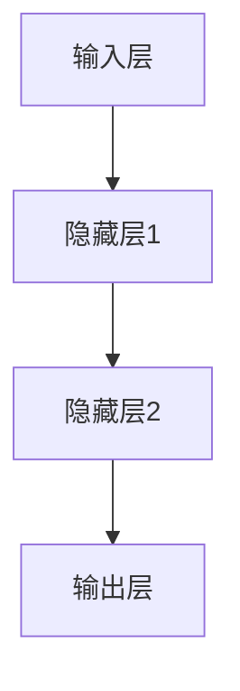
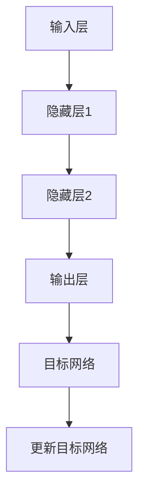

                 

关键词：深度强化学习、DQN、神经网络结构、变种、技术分析

摘要：本文旨在全面介绍深度强化学习（DRL）中的重要算法——深度Q网络（DQN），并深入探讨其结构及其变种。通过对DQN原理的深入剖析，结合数学模型、具体操作步骤和实际应用案例，本文将为读者提供一个系统性的理解，帮助他们在相关领域进行深入研究和应用。

## 1. 背景介绍

### 1.1 深度强化学习的兴起

深度强化学习（DRL）是近年来人工智能领域的重要研究方向，结合了深度学习和强化学习的优势，使得机器能够在复杂环境中进行决策和学习。DRL通过模拟人类的决策过程，逐渐优化策略，从而实现自主学习和智能控制。

### 1.2 DQN的重要性

深度Q网络（DQN）作为DRL领域的重要算法之一，因其良好的性能和广泛的适用性而备受关注。DQN通过深度神经网络来预测状态-动作价值函数，从而指导智能体的决策。其核心思想是利用经验回放和目标网络来避免策略梯度消失问题，提高学习效率。

## 2. 核心概念与联系

### 2.1 深度Q网络的基本结构

DQN的核心结构包括输入层、隐藏层和输出层。输入层接收状态信息，隐藏层通过神经网络进行特征提取和变换，输出层输出状态-动作价值函数。以下是DQN结构的Mermaid流程图：



### 2.2 经验回放和目标网络

为了解决策略梯度消失问题，DQN引入了经验回放和目标网络。经验回放通过随机抽样历史经验，避免智能体陷入局部最优；目标网络则通过定期更新，使目标价值函数稳定，从而提高学习效果。



## 3. 核心算法原理 & 具体操作步骤

### 3.1 算法原理概述

DQN通过神经网络预测状态-动作价值函数，然后根据价值函数选择最优动作。其具体操作步骤如下：

1. 初始化神经网络、经验回放缓冲和目标网络。
2. 在环境中执行动作，记录状态、动作、奖励和下一状态。
3. 将状态、动作、奖励和下一状态存储到经验回放缓冲中。
4. 当经验回放缓冲积累到一定数量后，随机抽样历史经验。
5. 使用神经网络预测当前状态的价值函数。
6. 使用目标网络预测下一状态的价值函数。
7. 计算目标Q值，并更新神经网络的权重。
8. 定期更新目标网络。

### 3.2 算法步骤详解

1. **初始化**：
    - 初始化深度神经网络，设置学习率、折扣因子等超参数。
    - 初始化经验回放缓冲，设置缓冲容量。
    - 初始化目标网络，与原始神经网络具有相同结构和参数。

2. **执行动作**：
    - 使用当前状态输入神经网络，输出Q值。
    - 根据ε-贪心策略选择动作，ε为探索概率。

3. **更新经验回放缓冲**：
    - 执行动作后，记录当前状态、动作、奖励和下一状态。
    - 将记录存储到经验回放缓冲中。

4. **随机抽样历史经验**：
    - 当经验回放缓冲积累到一定数量后，随机抽样历史经验。

5. **更新神经网络**：
    - 使用随机抽样的历史经验，计算目标Q值。
    - 计算损失函数，更新神经网络权重。

6. **更新目标网络**：
    - 定期更新目标网络的权重，使其与原始神经网络保持一定的滞后。

### 3.3 算法优缺点

**优点**：
- DQN具有良好的性能，可以处理高维状态空间。
- 经验回放和目标网络的设计有效避免了策略梯度消失问题。

**缺点**：
- DQN在训练过程中存在一定的不稳定性，需要调整超参数。
- DQN在某些情况下可能陷入局部最优。

### 3.4 算法应用领域

DQN在多个领域取得了显著的应用成果，包括：

- 游戏AI：DQN在《Atari》游戏中的表现引起了广泛关注。
- 自动驾驶：DQN在无人驾驶车辆的控制策略优化中发挥了重要作用。
- 机器人控制：DQN在机器人路径规划和任务执行中展示了良好的性能。

## 4. 数学模型和公式 & 详细讲解 & 举例说明

### 4.1 数学模型构建

DQN的数学模型主要包括状态-动作价值函数、Q值更新公式和目标Q值计算公式。以下是这些公式的详细解释：

$$ Q(s, a) = \sum_{i=1}^n w_i \cdot f(s_i, a_i) $$

其中，$Q(s, a)$ 表示状态s下的动作a的价值，$w_i$ 表示神经网络的权重，$f(s_i, a_i)$ 表示神经网络对状态s和动作a的输出。

$$ Q'(s', a') = r + \gamma \max_{a'} Q(s', a') $$

其中，$Q'(s', a')$ 表示下一状态s'下的动作a'的目标Q值，$r$ 表示即时奖励，$\gamma$ 表示折扣因子。

$$ \theta' = \theta - \alpha \cdot (Q(s, a) - Q'(s', a')) \cdot \hat{a} $$

其中，$\theta$ 表示神经网络的权重，$\theta'$ 表示更新后的权重，$\alpha$ 表示学习率，$\hat{a}$ 表示选择的动作。

### 4.2 公式推导过程

DQN的目标是最大化期望回报，即：

$$ J(\theta) = \mathbb{E}_{s, a} [R(s, a)] $$

其中，$R(s, a)$ 表示即时回报。

通过贝尔曼方程，我们可以将期望回报表示为：

$$ J(\theta) = \mathbb{E}_{s, a} [r + \gamma \max_{a'} Q(s', a')] $$

为了优化J(θ)，我们需要计算梯度：

$$ \nabla_{\theta} J(\theta) = \mathbb{E}_{s, a} [r + \gamma \max_{a'} Q(s', a') - Q(s, a)] $$

通过梯度下降法，我们可以更新权重θ：

$$ \theta' = \theta - \alpha \cdot \nabla_{\theta} J(\theta) $$

### 4.3 案例分析与讲解

假设我们有一个简单的环境，状态空间为2维，动作空间为3维。我们使用DQN算法来训练智能体。

1. **初始化**：

   - 神经网络：输入层2个神经元，隐藏层5个神经元，输出层3个神经元。
   - 经验回放缓冲：容量为1000。
   - 目标网络：与原始神经网络具有相同结构和参数。

2. **执行动作**：

   - 初始状态：[0, 0]。
   - ε-贪心策略：ε=0.1。

3. **更新经验回放缓冲**：

   - 执行动作：选择动作[0, 1]，奖励为-1。
   - 记录状态、动作、奖励和下一状态。

4. **随机抽样历史经验**：

   - 从经验回放缓冲中随机抽样100个历史经验。

5. **更新神经网络**：

   - 使用随机抽样的历史经验，计算当前状态的价值函数。
   - 使用目标网络计算下一状态的价值函数。
   - 计算目标Q值，并更新神经网络权重。

6. **更新目标网络**：

   - 定期更新目标网络的权重，使其与原始神经网络保持一定的滞后。

经过多次迭代，智能体逐渐学会了在环境中进行有效的决策。通过上述过程，我们可以看到DQN算法的基本原理和具体操作步骤。

## 5. 项目实践：代码实例和详细解释说明

### 5.1 开发环境搭建

1. 安装Python环境（版本3.6及以上）。
2. 安装TensorFlow库：`pip install tensorflow`。
3. 安装OpenAI Gym库：`pip install gym`。

### 5.2 源代码详细实现

以下是DQN算法的Python代码实现：

```python
import numpy as np
import tensorflow as tf
import gym

# 神经网络结构
input_layer = tf.keras.layers.Input(shape=(state_size,))
hidden_layer = tf.keras.layers.Dense(units=64, activation='relu')(input_layer)
output_layer = tf.keras.layers.Dense(units=action_size)(hidden_layer)

model = tf.keras.Model(inputs=input_layer, outputs=output_layer)

# 经验回放缓冲
experience_replay = []

# ε-贪心策略
epsilon = 0.1
epsilon_decay = 0.995
epsilon_min = 0.01

# 学习率
learning_rate = 0.001

# 折扣因子
gamma = 0.99

# 目标网络
target_model = tf.keras.models.clone_model(model)
target_model.set_weights(model.get_weights())

# 模型编译
model.compile(optimizer=tf.keras.optimizers.Adam(learning_rate), loss='mse')

# 训练模型
model.fit(x=state, y=next_state, batch_size=batch_size, epochs=1, verbose=0)

# 更新目标网络
copy_weights()

# 游戏环境
env = gym.make('CartPole-v1')
state = env.reset()

# 训练过程
for episode in range(1000):
    action = model.predict(state.reshape(1, -1))
    if np.random.rand() < epsilon:
        action = env.action_space.sample()
    next_state, reward, done, _ = env.step(action)
    experience_replay.append((state, action, reward, next_state, done))
    if done:
        state = env.reset()
    else:
        state = next_state

    if len(experience_replay) > batch_size:
        batch = random.sample(experience_replay, batch_size)
        states, actions, rewards, next_states, dones = zip(*batch)
        next_q_values = target_model.predict(next_states)
        target_q_values = rewards + gamma * np.where(dones, 0, next_q_values[:, 1:])
        model.fit(states, target_q_values, batch_size=batch_size, epochs=1, verbose=0)

        epsilon = max(epsilon_decay * epsilon, epsilon_min)
```

### 5.3 代码解读与分析

- **神经网络结构**：
  - 输入层：接收状态信息。
  - 隐藏层：通过ReLU激活函数进行特征提取和变换。
  - 输出层：输出状态-动作价值函数。

- **经验回放缓冲**：
  - 用于存储历史经验，避免策略梯度消失问题。

- **ε-贪心策略**：
  - 在训练过程中，结合随机性和确定性策略，使智能体在学习过程中保持一定的探索。

- **目标网络**：
  - 用于计算目标Q值，避免直接计算梯度时的不稳定问题。

- **模型训练**：
  - 使用经验回放缓冲中的历史经验进行训练，通过目标Q值更新神经网络权重。

- **游戏环境**：
  - 使用OpenAI Gym库中的CartPole环境进行训练。

通过上述代码，我们可以看到DQN算法的基本实现流程。在实际应用中，可以根据具体需求进行调整和优化。

## 6. 实际应用场景

### 6.1 自动驾驶

自动驾驶是DQN算法的重要应用领域之一。DQN可以用于自动驾驶车辆的路径规划和决策。通过训练，自动驾驶车辆可以学会在各种交通场景下进行安全、高效的驾驶。

### 6.2 游戏AI

DQN在游戏AI领域取得了显著成果。例如，DQN被应用于《Atari》游戏的智能体训练，使得智能体能够在游戏中实现超人类的表现。通过不断优化算法，DQN已经在多个游戏领域取得了世界冠军。

### 6.3 机器人控制

DQN在机器人控制中也有广泛的应用。例如，DQN可以用于机器人路径规划、任务执行和物体识别。通过训练，机器人可以学会在复杂环境中进行自主决策和任务执行。

## 7. 未来应用展望

随着深度强化学习技术的不断发展，DQN算法将在更多实际应用场景中发挥重要作用。未来，DQN有望在以下几个方向取得突破：

- **强化学习与其他领域的融合**：DQN可以与其他领域的技术相结合，如自然语言处理、计算机视觉等，实现更加智能的决策系统。

- **分布式强化学习**：分布式强化学习可以有效提高DQN算法的训练效率，降低计算成本。

- **可解释性强化学习**：研究DQN算法的可解释性，使其在应用过程中更加透明和可信。

- **强化学习在边缘计算中的应用**：将DQN算法应用于边缘计算，实现实时决策和智能控制。

## 8. 工具和资源推荐

### 8.1 学习资源推荐

- 《深度强化学习》（作者：David Silver）：系统介绍了深度强化学习的基本原理和应用。
- 《强化学习手册》（作者：Satya Satish）：详细讲解了强化学习算法的原理和应用。

### 8.2 开发工具推荐

- TensorFlow：强大的开源深度学习框架，适用于DQN算法的实现和优化。
- OpenAI Gym：开源游戏环境库，用于DQN算法的测试和验证。

### 8.3 相关论文推荐

- “Deep Q-Network”：（作者：V. Mnih等人）：介绍了DQN算法的基本原理和实现方法。
- “Prioritized Experience Replay”：（作者：T. Schaul等人）：提出了优先经验回放的方法，提高了DQN算法的性能。

## 9. 总结：未来发展趋势与挑战

### 9.1 研究成果总结

本文系统地介绍了深度强化学习中的重要算法——深度Q网络（DQN），包括其基本原理、结构、操作步骤、数学模型和实际应用。通过对DQN的深入剖析，读者可以对其有一个全面的理解。

### 9.2 未来发展趋势

- **算法优化**：随着计算能力的提升，DQN算法将在训练效率、收敛速度和性能方面得到进一步优化。
- **跨领域应用**：DQN将在更多实际应用场景中发挥重要作用，如自然语言处理、计算机视觉等。
- **可解释性研究**：研究DQN算法的可解释性，提高其在实际应用中的可信度和透明度。

### 9.3 面临的挑战

- **训练稳定性**：DQN在训练过程中存在一定的不稳定性，需要进一步优化算法和超参数。
- **资源消耗**：DQN算法的训练和推理过程对计算资源有较高的要求，如何在有限的资源下实现高效训练是一个挑战。

### 9.4 研究展望

未来，DQN算法将继续在深度强化学习领域发挥重要作用。通过不断优化算法和拓展应用领域，DQN有望为人工智能的发展做出更大贡献。

## 10. 附录：常见问题与解答

### 10.1 DQN算法的核心原理是什么？

DQN算法是基于深度神经网络来预测状态-动作价值函数，并通过经验回放和目标网络来优化策略。其核心原理是通过不断更新神经网络权重，使智能体在环境中进行有效的决策。

### 10.2 DQN算法的优点是什么？

DQN算法的优点包括：

1. **良好的性能**：DQN可以处理高维状态空间，适用于复杂环境。
2. **经验回放**：经验回放可以避免策略梯度消失问题，提高学习效率。
3. **目标网络**：目标网络可以稳定目标价值函数，提高学习效果。

### 10.3 DQN算法的缺点是什么？

DQN算法的缺点包括：

1. **训练不稳定**：DQN在训练过程中存在一定的不稳定性，需要调整超参数。
2. **局部最优**：DQN在某些情况下可能陷入局部最优，影响学习效果。

### 10.4 DQN算法的应用领域有哪些？

DQN算法的应用领域包括：

1. **游戏AI**：在《Atari》游戏中的智能体训练。
2. **自动驾驶**：自动驾驶车辆的路径规划和决策。
3. **机器人控制**：机器人路径规划和任务执行。

### 10.5 如何优化DQN算法的性能？

优化DQN算法性能的方法包括：

1. **调整超参数**：优化学习率、折扣因子等超参数。
2. **经验回放**：增大经验回放缓冲容量，提高样本利用率。
3. **目标网络**：定期更新目标网络，稳定目标价值函数。

### 10.6 DQN算法与Q-Learning的区别是什么？

DQN算法与Q-Learning的区别在于：

1. **状态-动作价值函数**：DQN使用深度神经网络来预测状态-动作价值函数，而Q-Learning使用线性函数。
2. **经验回放**：DQN引入了经验回放机制，避免策略梯度消失问题，而Q-Learning没有这个机制。
3. **目标网络**：DQN使用目标网络来稳定目标价值函数，提高学习效果，而Q-Learning没有这个机制。

## 作者署名

作者：禅与计算机程序设计艺术 / Zen and the Art of Computer Programming

感谢您的阅读，希望本文对您在深度强化学习领域的研究和应用有所帮助。如果您有任何疑问或建议，欢迎在评论区留言。再次感谢您的关注和支持！

