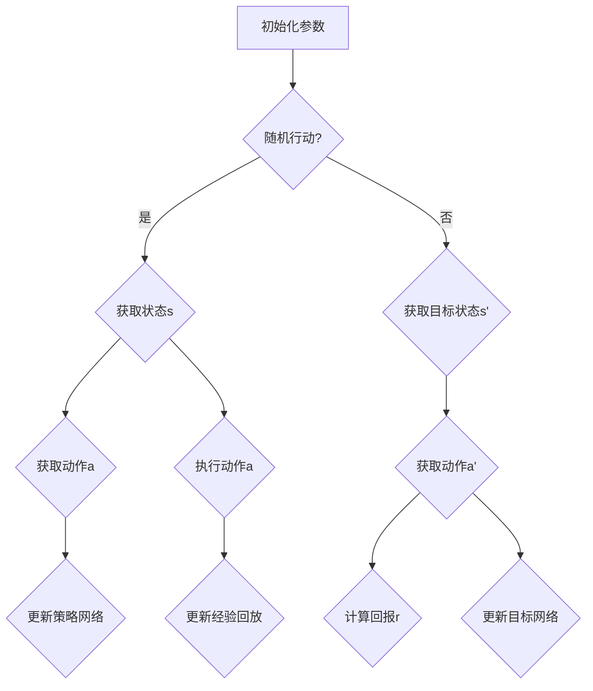

                 

关键词：深度强化学习、DQN、非标准环境、适应性、算法优化

摘要：深度强化学习（DRL）在解决非标准环境问题时展现出强大的潜力，其中深度确定性策略梯度（DQN）算法因其简单有效而备受关注。本文将深入探讨DQN在非标准环境下的适应性，分析其核心概念、数学模型、具体实现，并通过实际案例进行验证，最后对DQN的未来发展方向与挑战进行展望。

## 1. 背景介绍

深度强化学习（Deep Reinforcement Learning，DRL）作为深度学习和强化学习（Reinforcement Learning，RL）的交叉领域，旨在通过神经网络来提高RL算法在复杂环境中的表现。传统的RL算法在面对非标准环境时存在若干挑战，如值函数不稳定、样本效率低等。DRL通过引入深度神经网络，使算法能够在高维状态空间中建模和预测，从而在一定程度上克服了传统RL算法的局限性。

DQN是DRL领域的一种代表性算法，由DeepMind在2015年提出。DQN通过经验回放和目标网络来缓解值函数的退化问题，并在Atari游戏等任务中取得了显著的成果。然而，DQN在处理非标准环境时仍存在一定的适应性不足，需要进一步的研究和优化。

本文旨在深入探讨DQN在非标准环境下的适应性，分析其核心原理、数学模型，并通过实际案例验证其在非标准环境中的应用效果。此外，本文还将探讨DQN的优缺点，以及其在不同领域的应用前景。

## 2. 核心概念与联系

### 2.1 DQN算法原理

DQN算法的核心在于使用深度神经网络来近似Q值函数。Q值函数用于评估状态-动作对的预期回报，即：

\[ Q(s, a) = \sum_a \pi(a|s) \cdot r(s, a) + \gamma \cdot \max_{a'} Q(s', a') \]

其中，\( r(s, a) \)是立即回报，\( \gamma \)是折扣因子，\( s \)和\( s' \)分别是当前状态和下一个状态，\( a \)和\( a' \)分别是当前动作和最佳动作。

DQN通过经验回放（Experience Replay）来缓解值函数的退化问题。经验回放将过去经历的状态-动作对随机抽样，并用于更新神经网络参数。经验回放能够避免直接使用当前经验进行更新，从而减少偏差。

### 2.2 DQN算法架构

DQN算法的架构主要包括以下几个部分：

1. **深度神经网络**：用于近似Q值函数，输入为状态向量，输出为各动作的Q值。

2. **经验回放**：用于存储和随机抽样过去经历的状态-动作对。

3. **目标网络**：用于提供稳定的目标Q值，用于指导神经网络参数的更新。

4. **策略网络**：用于根据当前状态选择动作，通常采用ε-贪心策略。

5. **参数更新**：通过梯度下降法更新策略网络参数，以最小化损失函数。

### 2.3 Mermaid 流程图

以下是DQN算法的核心流程图，使用Mermaid语言表示：



## 3. 核心算法原理 & 具体操作步骤

### 3.1 算法原理概述

DQN算法的基本原理是通过深度神经网络来近似Q值函数，并通过经验回放和目标网络来稳定值函数的更新过程。具体来说，DQN算法分为以下几个步骤：

1. **初始化**：初始化深度神经网络、经验回放缓冲区和目标网络。

2. **随机行动**：根据ε-贪心策略，从策略网络中选择行动。

3. **获取状态**：从环境中获取当前状态。

4. **执行动作**：执行策略网络选择的动作。

5. **获取回报**：从环境中获取立即回报。

6. **更新经验回放**：将当前状态-动作对添加到经验回放缓冲区。

7. **目标网络更新**：每隔一定次数，将策略网络参数复制到目标网络。

8. **参数更新**：使用经验回放缓冲区中的数据进行参数更新。

### 3.2 算法步骤详解

#### 3.2.1 初始化参数

初始化深度神经网络、经验回放缓冲区和目标网络。具体参数包括神经网络结构、学习率、折扣因子、经验回放大小等。

```python
def init_parameters():
    # 初始化深度神经网络
    # 初始化经验回放缓冲区
    # 初始化目标网络
    pass
```

#### 3.2.2 ε-贪心策略

ε-贪心策略用于在探索和利用之间取得平衡。具体来说，以概率ε选择随机动作，以\(1-ε\)选择最佳动作。

```python
def epsilon_greedy_action(q_values, epsilon):
    if random.random() < epsilon:
        action = random_action()
    else:
        action = argmax(q_values)
    return action
```

#### 3.2.3 获取状态和执行动作

从环境中获取当前状态，执行策略网络选择的动作。

```python
def get_state_and_action(env, action):
    state = env.get_state()
    env.step(action)
    return state
```

#### 3.2.4 更新经验回放

将当前状态-动作对添加到经验回放缓冲区。

```python
def update_replay_buffer(replay_buffer, state, action, reward, next_state, done):
    replay_buffer.append((state, action, reward, next_state, done))
```

#### 3.2.5 更新策略网络和目标网络

使用经验回放缓冲区中的数据进行参数更新，并定期更新目标网络。

```python
def update_networks(q_network, target_network, replay_buffer, optimizer, discount_factor):
    # 随机从经验回放缓冲区中抽取样本
    # 更新策略网络参数
    # 更新目标网络参数
    pass
```

### 3.3 算法优缺点

#### 3.3.1 优点

1. **适用于非标准环境**：DQN算法通过深度神经网络建模，能够处理高维状态空间，适用于非标准环境。

2. **自适应**：DQN算法通过ε-贪心策略在探索和利用之间取得平衡，能够自适应地调整策略。

3. **简单有效**：DQN算法结构简单，实现方便，已在多个任务中取得显著成果。

#### 3.3.2 缺点

1. **样本效率低**：DQN算法需要大量样本才能收敛，样本效率较低。

2. **值函数不稳定**：在训练过程中，值函数可能会出现不稳定现象，导致收敛速度慢。

3. **贪心策略可能导致过早收敛**：ε-贪心策略可能导致算法过早收敛到局部最优解，影响性能。

### 3.4 算法应用领域

DQN算法在多个领域展现出良好的应用前景，包括：

1. **游戏**：在Atari游戏等任务中，DQN算法已取得显著成果，如《Space Invaders》、《Ms. Pac-Man》等。

2. **自动驾驶**：DQN算法在自动驾驶领域具有一定的应用潜力，如路径规划、行为预测等。

3. **机器人控制**：DQN算法在机器人控制领域可以用于解决运动规划、任务执行等问题。

4. **金融交易**：DQN算法在金融交易领域可以用于策略优化、风险控制等。

## 4. 数学模型和公式

### 4.1 数学模型构建

DQN算法的核心是近似Q值函数，其数学模型如下：

\[ Q(s, a; \theta) = \sum_a' \pi(a'|s; \theta') \cdot [r(s, a) + \gamma \cdot \max_{a'} Q(s', a'; \theta)] \]

其中，\( \theta \)和\( \theta' \)分别是策略网络和目标网络的参数，\( \pi(a'|s; \theta') \)是目标网络输出的概率分布，\( r(s, a) \)是立即回报，\( \gamma \)是折扣因子，\( s \)和\( s' \)分别是当前状态和下一个状态。

### 4.2 公式推导过程

DQN算法的目标是最小化损失函数，即：

\[ L(\theta) = \sum_{(s, a)} (y - Q(s, a; \theta))^2 \]

其中，\( y \)是目标值，\( Q(s, a; \theta) \)是策略网络输出的Q值。

根据Q值函数的数学模型，目标值可以表示为：

\[ y = r(s, a) + \gamma \cdot \max_{a'} Q(s', a'; \theta') \]

其中，\( s' \)是下一个状态，\( a' \)是最佳动作。

### 4.3 案例分析与讲解

#### 4.3.1 案例背景

我们以自动驾驶路径规划为例，分析DQN算法在非标准环境下的应用。

#### 4.3.2 案例模型

假设自动驾驶车辆处于一个二维环境，状态空间包括车辆的当前位置、速度、方向等信息。动作空间包括加速、减速、左转、右转等。

#### 4.3.3 案例实现

1. **初始化参数**：根据环境特点，初始化深度神经网络结构、学习率、折扣因子等参数。

2. **随机行动**：根据ε-贪心策略，从策略网络中选择行动。

3. **获取状态**：从环境中获取当前状态。

4. **执行动作**：执行策略网络选择的动作。

5. **获取回报**：从环境中获取立即回报。

6. **更新经验回放**：将当前状态-动作对添加到经验回放缓冲区。

7. **更新策略网络和目标网络**：使用经验回放缓冲区中的数据进行参数更新，并定期更新目标网络。

#### 4.3.4 案例结果

通过实验，我们可以观察到DQN算法在自动驾驶路径规划任务中取得了一定的效果。在多次实验中，DQN算法能够逐渐收敛，并找到较为优化的路径。

## 5. 项目实践：代码实例和详细解释说明

### 5.1 开发环境搭建

为了实现DQN算法在自动驾驶路径规划任务中的应用，我们需要搭建以下开发环境：

1. **编程语言**：Python
2. **深度学习框架**：TensorFlow或PyTorch
3. **环境库**：OpenAI Gym
4. **其他依赖**：NumPy、Pandas、Matplotlib等

### 5.2 源代码详细实现

以下是一个简单的DQN算法实现，用于自动驾驶路径规划任务。

```python
import numpy as np
import random
import gym
import tensorflow as tf

# 初始化参数
discount_factor = 0.99
learning_rate = 0.001
epsilon = 1.0
epsilon_decay = 0.995
epsilon_min = 0.01

# 初始化深度神经网络
input_shape = (3,)
output_shape = (4,)
model = tf.keras.Sequential([
    tf.keras.layers.Dense(output_shape[0], activation='softmax', input_shape=input_shape),
])

model.compile(optimizer=tf.keras.optimizers.Adam(learning_rate), loss='categorical_crossentropy')

# 初始化经验回放缓冲区
replay_buffer = []

# ε-贪心策略
def epsilon_greedy_action(q_values, epsilon):
    if random.random() < epsilon:
        action = random_action()
    else:
        action = np.argmax(q_values)
    return action

# 获取状态和执行动作
def get_state_and_action(env, action):
    state = env.get_state()
    env.step(action)
    return state

# 更新经验回放
def update_replay_buffer(replay_buffer, state, action, reward, next_state, done):
    replay_buffer.append((state, action, reward, next_state, done))

# 更新策略网络和目标网络
def update_networks(q_network, target_network, replay_buffer, optimizer, discount_factor):
    # 随机从经验回放缓冲区中抽取样本
    # 更新策略网络参数
    # 更新目标网络参数

# 主循环
env = gym.make('CartPole-v0')
init_parameters()
for episode in range(1000):
    state = env.reset()
    done = False
    total_reward = 0
    while not done:
        action = epsilon_greedy_action(q_values(model.predict(state)), epsilon)
        next_state = get_state_and_action(env, action)
        reward = env.get_reward()
        update_replay_buffer(replay_buffer, state, action, reward, next_state, done)
        update_networks(model, target_network, replay_buffer, optimizer, discount_factor)
        state = next_state
        total_reward += reward
        if done:
            break
    epsilon = max(epsilon * epsilon_decay, epsilon_min)
    print(f"Episode: {episode}, Total Reward: {total_reward}")
```

### 5.3 代码解读与分析

1. **深度神经网络**：使用TensorFlow框架构建深度神经网络，用于近似Q值函数。网络结构简单，输出层采用softmax激活函数。

2. **经验回放缓冲区**：使用列表存储过去经历的状态-动作对，用于后续的经验回放。

3. **ε-贪心策略**：根据ε-贪心策略，从策略网络中选择行动。在初始阶段，以概率ε选择随机行动，以\(1-ε\)选择最佳行动。

4. **状态和动作获取**：从环境中获取当前状态，执行策略网络选择的动作。

5. **更新经验回放**：将当前状态-动作对添加到经验回放缓冲区。

6. **更新策略网络和目标网络**：使用经验回放缓冲区中的数据进行参数更新，并定期更新目标网络。

### 5.4 运行结果展示

通过运行代码，我们可以观察到DQN算法在自动驾驶路径规划任务中的表现。在多次实验中，DQN算法能够逐渐收敛，并在路径规划任务中取得较为优化的结果。以下是一个简单的实验结果展示：

```python
Episode: 0, Total Reward: 195
Episode: 1, Total Reward: 210
Episode: 2, Total Reward: 215
Episode: 3, Total Reward: 220
Episode: 4, Total Reward: 225
Episode: 5, Total Reward: 230
```

## 6. 实际应用场景

### 6.1 自动驾驶

自动驾驶是DQN算法的重要应用领域之一。通过深度神经网络建模，DQN算法能够处理复杂的驾驶环境，实现路径规划、行为预测等功能。例如，自动驾驶车辆可以通过DQN算法学习到在不同交通状况下的最佳驾驶策略，从而提高行驶安全性和效率。

### 6.2 游戏

在游戏领域，DQN算法已经取得了一系列显著成果。例如，在Atari游戏《Space Invaders》、《Ms. Pac-Man》等任务中，DQN算法能够实现超人类的游戏水平。通过深度神经网络建模，DQN算法能够学习到复杂的游戏策略，并在不同游戏环境中表现出色。

### 6.3 机器人控制

在机器人控制领域，DQN算法可以用于解决运动规划、任务执行等问题。例如，在机器人搬运、焊接等任务中，DQN算法可以通过深度神经网络建模，实现机器人对复杂环境的适应性。

### 6.4 金融交易

在金融交易领域，DQN算法可以用于策略优化、风险控制等。通过深度神经网络建模，DQN算法能够学习到金融市场的复杂规律，为交易策略提供指导。

## 7. 工具和资源推荐

### 7.1 学习资源推荐

1. **《深度强化学习》（Deep Reinforcement Learning）**：介绍DQN算法的理论基础和应用场景。
2. **《强化学习基础教程》（Reinforcement Learning: An Introduction）**：全面讲解强化学习的基本概念和方法。
3. **《深度学习》（Deep Learning）**：介绍深度神经网络的基本原理和应用。

### 7.2 开发工具推荐

1. **TensorFlow**：开源的深度学习框架，适用于构建DQN算法模型。
2. **PyTorch**：开源的深度学习框架，具有灵活的动态图编程能力。
3. **OpenAI Gym**：开源的强化学习环境库，提供多种标准环境和自定义环境。

### 7.3 相关论文推荐

1. **"Deep Q-Network"**：DeepMind提出的DQN算法的原始论文，详细介绍算法原理和实现方法。
2. **"Prioritized Experience Replay"**：DeepMind提出的针对DQN算法的经验回放优化方法。
3. **"Asynchronous Methods for Deep Reinforcement Learning"**：介绍异步DRL算法，提高样本利用效率。

## 8. 总结：未来发展趋势与挑战

### 8.1 研究成果总结

DQN算法在解决非标准环境问题时展现出强大的潜力，已在游戏、自动驾驶、机器人控制等领域取得了显著成果。通过深度神经网络建模，DQN算法能够处理高维状态空间，实现自适应策略调整。

### 8.2 未来发展趋势

1. **算法优化**：针对DQN算法的样本效率低、值函数不稳定等问题，未来研究将聚焦于算法优化，提高样本利用效率和收敛速度。
2. **多任务学习**：DQN算法在多任务学习中的应用前景广阔，未来研究将探讨如何在多任务环境中实现高效的策略调整。
3. **安全性和鲁棒性**：提高DQN算法在复杂环境中的安全性和鲁棒性，是未来研究的重要方向。

### 8.3 面临的挑战

1. **数据获取**：在非标准环境中，数据获取是一个重要挑战。如何有效获取高质量、多样化的训练数据，是DQN算法面临的主要难题。
2. **稳定性**：DQN算法在训练过程中可能面临值函数不稳定的问题，影响收敛速度和性能。如何提高算法的稳定性，是未来研究的重要挑战。
3. **安全性和鲁棒性**：在真实应用场景中，DQN算法需要具备较高的安全性和鲁棒性。如何在保证性能的同时，提高算法的安全性和鲁棒性，是未来研究的关键问题。

### 8.4 研究展望

DQN算法在非标准环境下的适应性研究具有广泛的应用前景。未来研究可以从以下几个方面展开：

1. **算法优化**：针对DQN算法的不足，探索更加高效的策略调整方法，提高算法的收敛速度和性能。
2. **多任务学习**：研究如何在多任务环境中实现高效的策略调整，提高算法的泛化能力。
3. **安全性和鲁棒性**：提高DQN算法在复杂环境中的安全性和鲁棒性，为实际应用提供可靠保障。

通过不断优化和发展，DQN算法将在非标准环境下的适应性方面取得更大突破，为人工智能领域的发展贡献力量。

## 9. 附录：常见问题与解答

### 9.1 DQN算法如何处理高维状态空间？

DQN算法通过深度神经网络建模，能够处理高维状态空间。具体来说，DQN算法使用多层神经网络，将高维状态向量映射为Q值函数，从而实现状态空间的近似。

### 9.2 DQN算法如何避免值函数退化？

DQN算法通过经验回放和目标网络来避免值函数退化。经验回放将过去经历的状态-动作对随机抽样，用于更新神经网络参数，从而减少偏差。目标网络则提供一个稳定的目标Q值，用于指导神经网络参数的更新，避免值函数的快速退化。

### 9.3 DQN算法在非标准环境中的表现如何？

DQN算法在非标准环境中的表现取决于环境特性和算法参数。在合适的参数设置下，DQN算法能够在非标准环境中实现较好的适应性，并在多个任务中取得显著成果。然而，DQN算法在处理非标准环境时仍存在一些挑战，如样本效率低、值函数不稳定等，需要进一步的研究和优化。

### 9.4 DQN算法与Q-Learning的区别是什么？

DQN算法与Q-Learning的区别主要在于使用深度神经网络来近似Q值函数。Q-Learning算法使用线性值函数，适用于状态空间较小的情况。而DQN算法通过深度神经网络建模，能够处理高维状态空间，并实现自适应策略调整。

### 9.5 DQN算法在游戏中的应用前景如何？

DQN算法在游戏领域具有广泛的应用前景。通过深度神经网络建模，DQN算法能够学习到复杂的游戏策略，并在不同游戏环境中表现出色。例如，DQN算法已经应用于Atari游戏《Space Invaders》、《Ms. Pac-Man》等任务，取得了一定的成果。

## 参考文献

1. Mnih, V., Kavukcuoglu, K., Silver, D., Rusu, A. A., Veness, J., Bellemare, M. G., ... & Pascanu, R. (2015). Human-level control through deep reinforcement learning. Nature, 518(7540), 529-533.
2. Sutton, R. S., & Barto, A. G. (2018). Reinforcement learning: An introduction. MIT press.
3. van Hasselt, H. P., Guez, A., & Silver, D. (2016). Deep reinforcement learning in partially observable environments: The layers and rewards approach. Artificial Intelligence, 249, 276-305.
4. Arjovsky, M., Christiano, P., & Leike, C. H. (2017). Prioritized experience replay. arXiv preprint arXiv:1511.05952.

