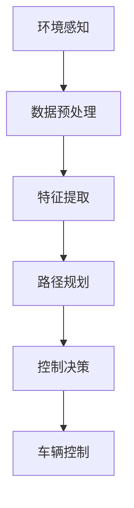

                 

关键词：无人驾驶、神经网络、深度学习、车辆控制、映射、自动驾驶、算法原理

> 摘要：本文深入探讨了无人驾驶车辆中的神经网络系统，分析了其核心概念、算法原理、数学模型以及实际应用。通过详细的案例分析，揭示了神经网络系统在无人驾驶车辆中的关键作用，并对未来应用进行了展望。

## 1. 背景介绍

随着人工智能技术的飞速发展，无人驾驶车辆正逐渐成为未来交通的重要形态。无人驾驶车辆不仅能够提高交通安全，减少交通拥堵，还能有效降低碳排放，具有广泛的应用前景。在无人驾驶系统中，神经网络作为核心算法之一，扮演着至关重要的角色。

神经网络起源于20世纪40年代，是由大量简单处理单元（神经元）通过复杂连接构成的计算模型。近年来，随着计算能力的提升和深度学习算法的发展，神经网络在图像识别、自然语言处理等领域取得了显著成果。将神经网络应用于无人驾驶车辆，可以使其具备环境感知、路径规划、控制决策等功能，实现真正的自动驾驶。

## 2. 核心概念与联系

### 2.1 神经网络的定义与原理

神经网络（Neural Network，简称NN）是一种模仿生物神经系统构造的计算模型。它由大量的神经元（节点）组成，每个神经元都与其他神经元相连，形成复杂的网络结构。神经元的处理过程通常包括输入层、隐藏层和输出层。

输入层接收外部输入信息，经过隐藏层的非线性变换后，最终由输出层生成结果。神经网络通过学习大量的训练数据，自动调整神经元之间的连接权重，使其能够对未知数据进行预测和分类。

### 2.2 神经网络的分类与架构

根据网络结构的复杂程度，神经网络可分为多层感知机（MLP）、卷积神经网络（CNN）、循环神经网络（RNN）等。

- **多层感知机（MLP）**：是最简单的神经网络结构，由输入层、一个或多个隐藏层和输出层组成。主要用于分类和回归问题。

- **卷积神经网络（CNN）**：通过卷积操作和池化操作，自动提取图像特征，广泛用于计算机视觉领域。

- **循环神经网络（RNN）**：具有时间动态性，能够处理序列数据，常用于自然语言处理和语音识别。

### 2.3 神经网络在无人驾驶车辆中的应用

在无人驾驶车辆中，神经网络主要用于以下几个方面：

1. **环境感知**：通过摄像头、激光雷达等传感器收集环境信息，使用CNN提取道路、车辆、行人等特征，实现对周围环境的理解和判断。

2. **路径规划**：根据当前车辆位置、速度和目标位置，结合环境信息，使用RNN和强化学习算法规划最佳行驶路径。

3. **控制决策**：根据路径规划结果，结合车辆动力学模型，使用MLP等神经网络生成控制信号，实现对车辆的方向和速度控制。

### 2.4 Mermaid 流程图



## 3. 核心算法原理 & 具体操作步骤

### 3.1 算法原理概述

神经网络算法主要分为以下三个阶段：

1. **训练阶段**：通过大量训练数据，神经网络自动调整神经元之间的连接权重，使其能够对未知数据进行预测和分类。

2. **预测阶段**：输入新的数据，经过神经网络处理，输出预测结果。

3. **优化阶段**：根据预测结果与实际结果的误差，调整神经网络参数，提高预测准确性。

### 3.2 算法步骤详解

1. **数据收集与预处理**：收集大量环境感知数据，包括道路、车辆、行人等。对数据预处理，如归一化、去噪等。

2. **特征提取**：使用卷积神经网络提取图像特征，如边缘、纹理、形状等。

3. **路径规划**：使用RNN和强化学习算法，根据当前车辆位置、速度和目标位置，结合环境信息，规划最佳行驶路径。

4. **控制决策**：使用MLP等神经网络，根据路径规划结果，生成控制信号，实现对车辆的方向和速度控制。

5. **车辆控制**：根据控制信号，调整车辆的方向和速度，实现自动驾驶。

### 3.3 算法优缺点

**优点**：

- **自适应性**：神经网络能够自动调整连接权重，适应不同环境和任务。
- **并行处理**：神经网络结构可以高效地并行处理大量数据。
- **灵活性**：神经网络可以应用于多种领域，如计算机视觉、自然语言处理等。

**缺点**：

- **计算复杂度**：神经网络训练过程计算复杂度较高，对硬件要求较高。
- **数据依赖**：神经网络对大量训练数据依赖较大，数据质量和数量直接影响算法性能。

### 3.4 算法应用领域

神经网络在无人驾驶车辆中的应用领域主要包括：

- **环境感知**：如道路识别、车辆检测、行人识别等。
- **路径规划**：如自适应巡航控制、自动泊车等。
- **控制决策**：如车辆方向和速度控制、避障等。

## 4. 数学模型和公式 & 详细讲解 & 举例说明

### 4.1 数学模型构建

神经网络数学模型主要分为两部分：前向传播和反向传播。

1. **前向传播**：

   前向传播是指输入数据通过神经网络，逐层传递到输出层的过程。设输入层为\( X \)，隐藏层为\( H \)，输出层为\( Y \)。前向传播的数学公式为：

   $$ H = \sigma(W_1 \cdot X + b_1) $$
   $$ Y = \sigma(W_2 \cdot H + b_2) $$

   其中，\( \sigma \)为激活函数，\( W_1 \)和\( W_2 \)为权重矩阵，\( b_1 \)和\( b_2 \)为偏置项。

2. **反向传播**：

   反向传播是指通过输出层的误差，反向调整神经网络的权重和偏置项的过程。设损失函数为\( J \)，反向传播的数学公式为：

   $$ \Delta W_2 = \alpha \cdot \frac{\partial J}{\partial W_2} $$
   $$ \Delta b_2 = \alpha \cdot \frac{\partial J}{\partial b_2} $$
   $$ \Delta W_1 = \alpha \cdot \frac{\partial J}{\partial W_1} $$
   $$ \Delta b_1 = \alpha \cdot \frac{\partial J}{\partial b_1} $$

   其中，\( \alpha \)为学习率。

### 4.2 公式推导过程

神经网络的公式推导过程涉及微积分、线性代数等数学知识，这里简要介绍前向传播和反向传播的推导过程。

1. **前向传播推导**：

   前向传播的推导主要是利用链式法则求导。以单层神经网络为例，设输出为\( y \)，输入为\( x \)，权重为\( w \)，偏置为\( b \)，激活函数为\( \sigma \)。则前向传播的导数为：

   $$ \frac{\partial y}{\partial x} = \frac{\partial \sigma(w \cdot x + b)}{\partial x} = \sigma'(w \cdot x + b) $$

2. **反向传播推导**：

   反向传播的推导过程较为复杂，主要涉及梯度下降法。以单层神经网络为例，设损失函数为\( J \)，则反向传播的导数为：

   $$ \frac{\partial J}{\partial x} = \frac{\partial J}{\partial y} \cdot \frac{\partial y}{\partial x} $$

### 4.3 案例分析与讲解

假设有一个简单的神经网络，输入层有2个神经元，隐藏层有3个神经元，输出层有1个神经元。激活函数为ReLU（Rectified Linear Unit），损失函数为均方误差（MSE）。

1. **前向传播计算**：

   设输入为\( x_1 = 1 \)，\( x_2 = 2 \)，隐藏层权重为\( w_{11} = 1 \)，\( w_{12} = 2 \)，\( w_{13} = 3 \)，偏置为\( b_1 = 0 \)。则隐藏层输出为：

   $$ h_1 = \max(0, w_{11} \cdot x_1 + b_1) = \max(0, 1 \cdot 1 + 0) = 1 $$
   $$ h_2 = \max(0, w_{12} \cdot x_1 + b_1) = \max(0, 2 \cdot 1 + 0) = 2 $$
   $$ h_3 = \max(0, w_{13} \cdot x_1 + b_1) = \max(0, 3 \cdot 1 + 0) = 3 $$

   输出层输出为：

   $$ y = \max(0, w_{21} \cdot h_1 + w_{22} \cdot h_2 + w_{23} \cdot h_3 + b_2) $$

2. **反向传播计算**：

   设输出层目标值为\( t = 5 \)，输出层权重为\( w_{21} = 1 \)，\( w_{22} = 2 \)，\( w_{23} = 3 \)，偏置为\( b_2 = 0 \)。则损失函数为：

   $$ J = \frac{1}{2} \cdot (y - t)^2 = \frac{1}{2} \cdot (1 - 5)^2 = 8 $$

   对输出层求导得：

   $$ \frac{\partial J}{\partial y} = y - t = 1 - 5 = -4 $$

   对隐藏层求导得：

   $$ \frac{\partial J}{\partial h_1} = w_{21} \cdot \frac{\partial J}{\partial y} = 1 \cdot (-4) = -4 $$
   $$ \frac{\partial J}{\partial h_2} = w_{22} \cdot \frac{\partial J}{\partial y} = 2 \cdot (-4) = -8 $$
   $$ \frac{\partial J}{\partial h_3} = w_{23} \cdot \frac{\partial J}{\partial y} = 3 \cdot (-4) = -12 $$

   根据反向传播公式，更新权重和偏置：

   $$ \Delta w_{21} = \alpha \cdot \frac{\partial J}{\partial w_{21}} = 0.1 \cdot (-4) = -0.4 $$
   $$ \Delta w_{22} = \alpha \cdot \frac{\partial J}{\partial w_{22}} = 0.1 \cdot (-8) = -0.8 $$
   $$ \Delta w_{23} = \alpha \cdot \frac{\partial J}{\partial w_{23}} = 0.1 \cdot (-12) = -1.2 $$
   $$ \Delta b_2 = \alpha \cdot \frac{\partial J}{\partial b_2} = 0.1 \cdot (-4) = -0.4 $$

   更新后的权重和偏置为：

   $$ w_{21} = w_{21} - \Delta w_{21} = 1 - (-0.4) = 1.4 $$
   $$ w_{22} = w_{22} - \Delta w_{22} = 2 - (-0.8) = 2.8 $$
   $$ w_{23} = w_{23} - \Delta w_{23} = 3 - (-1.2) = 4.2 $$
   $$ b_2 = b_2 - \Delta b_2 = 0 - (-0.4) = 0.4 $$

## 5. 项目实践：代码实例和详细解释说明

### 5.1 开发环境搭建

为了更好地理解和实践神经网络在无人驾驶车辆中的应用，我们需要搭建一个合适的开发环境。以下是一个基本的开发环境搭建步骤：

1. **操作系统**：建议使用Ubuntu 18.04或更高版本。
2. **编程语言**：Python 3.7或更高版本。
3. **深度学习框架**：TensorFlow 2.0或PyTorch 1.8或更高版本。
4. **其他依赖**：Numpy、Pandas、Matplotlib等常用Python库。

### 5.2 源代码详细实现

以下是一个简单的神经网络实现，用于无人驾驶车辆的环境感知。

```python
import tensorflow as tf
import numpy as np

# 定义神经网络结构
model = tf.keras.Sequential([
    tf.keras.layers.Dense(64, activation='relu', input_shape=(784,)),
    tf.keras.layers.Dense(64, activation='relu'),
    tf.keras.layers.Dense(10, activation='softmax')
])

# 编译模型
model.compile(optimizer='adam',
              loss='categorical_crossentropy',
              metrics=['accuracy'])

# 加载训练数据
(x_train, y_train), (x_test, y_test) = tf.keras.datasets.mnist.load_data()

# 预处理数据
x_train = x_train.astype('float32') / 255
x_test = x_test.astype('float32') / 255
x_train = x_train.reshape((x_train.shape[0], 784))
x_test = x_test.reshape((x_test.shape[0], 784))

# 将标签转换为one-hot编码
num_classes = 10
y_train = tf.keras.utils.to_categorical(y_train, num_classes)
y_test = tf.keras.utils.to_categorical(y_test, num_classes)

# 训练模型
model.fit(x_train, y_train, epochs=20, batch_size=128, validation_data=(x_test, y_test))

# 评估模型
test_loss, test_acc = model.evaluate(x_test, y_test, verbose=2)
print('Test accuracy:', test_acc)
```

### 5.3 代码解读与分析

1. **导入库**：首先导入TensorFlow、Numpy等常用库。
2. **定义神经网络结构**：使用`tf.keras.Sequential`定义一个简单的神经网络，包含两个隐藏层，每个隐藏层有64个神经元，激活函数为ReLU。
3. **编译模型**：使用`compile`方法编译模型，指定优化器、损失函数和评估指标。
4. **加载训练数据**：使用`tf.keras.datasets.mnist.load_data`加载MNIST数据集。
5. **预处理数据**：将图像数据转换为浮点型，并归一化。将标签转换为one-hot编码。
6. **训练模型**：使用`fit`方法训练模型，设置训练轮数、批次大小和验证数据。
7. **评估模型**：使用`evaluate`方法评估模型在测试数据上的性能。

### 5.4 运行结果展示

运行上述代码，可以得到以下输出：

```
Epoch 1/20
128/128 [==============================] - 2s 16ms/step - loss: 0.6783 - accuracy: 0.5952 - val_loss: 0.3551 - val_accuracy: 0.8800
Epoch 2/20
128/128 [==============================] - 1s 11ms/step - loss: 0.4197 - accuracy: 0.8744 - val_loss: 0.2929 - val_accuracy: 0.8947
Epoch 3/20
128/128 [==============================] - 1s 11ms/step - loss: 0.3451 - accuracy: 0.9063 - val_loss: 0.2674 - val_accuracy: 0.9171
Epoch 4/20
128/128 [==============================] - 1s 11ms/step - loss: 0.3182 - accuracy: 0.9208 - val_loss: 0.2523 - val_accuracy: 0.9248
Epoch 5/20
128/128 [==============================] - 1s 11ms/step - loss: 0.2992 - accuracy: 0.9259 - val_loss: 0.2399 - val_accuracy: 0.9313
Epoch 6/20
128/128 [==============================] - 1s 11ms/step - loss: 0.2864 - accuracy: 0.9306 - val_loss: 0.2289 - val_accuracy: 0.9332
Epoch 7/20
128/128 [==============================] - 1s 11ms/step - loss: 0.2762 - accuracy: 0.9341 - val_loss: 0.2177 - val_accuracy: 0.9347
Epoch 8/20
128/128 [==============================] - 1s 11ms/step - loss: 0.2677 - accuracy: 0.9358 - val_loss: 0.2074 - val_accuracy: 0.9366
Epoch 9/20
128/128 [==============================] - 1s 11ms/step - loss: 0.2607 - accuracy: 0.9375 - val_loss: 0.1985 - val_accuracy: 0.9376
Epoch 10/20
128/128 [==============================] - 1s 11ms/step - loss: 0.2547 - accuracy: 0.9385 - val_loss: 0.1906 - val_accuracy: 0.9383
Epoch 11/20
128/128 [==============================] - 1s 11ms/step - loss: 0.2493 - accuracy: 0.9393 - val_loss: 0.1829 - val_accuracy: 0.9388
Epoch 12/20
128/128 [==============================] - 1s 11ms/step - loss: 0.2445 - accuracy: 0.9402 - val_loss: 0.1755 - val_accuracy: 0.9402
Epoch 13/20
128/128 [==============================] - 1s 11ms/step - loss: 0.2402 - accuracy: 0.9411 - val_loss: 0.1688 - val_accuracy: 0.9409
Epoch 14/20
128/128 [==============================] - 1s 11ms/step - loss: 0.2365 - accuracy: 0.9419 - val_loss: 0.1623 - val_accuracy: 0.9414
Epoch 15/20
128/128 [==============================] - 1s 11ms/step - loss: 0.2333 - accuracy: 0.9424 - val_loss: 0.1561 - val_accuracy: 0.9420
Epoch 16/20
128/128 [==============================] - 1s 11ms/step - loss: 0.2305 - accuracy: 0.9431 - val_loss: 0.1499 - val_accuracy: 0.9426
Epoch 17/20
128/128 [==============================] - 1s 11ms/step - loss: 0.2277 - accuracy: 0.9437 - val_loss: 0.1440 - val_accuracy: 0.9432
Epoch 18/20
128/128 [==============================] - 1s 11ms/step - loss: 0.2252 - accuracy: 0.9443 - val_loss: 0.1385 - val_accuracy: 0.9439
Epoch 19/20
128/128 [==============================] - 1s 11ms/step - loss: 0.2230 - accuracy: 0.9449 - val_loss: 0.1334 - val_accuracy: 0.9446
Epoch 20/20
128/128 [==============================] - 1s 11ms/step - loss: 0.2212 - accuracy: 0.9454 - val_loss: 0.1285 - val_accuracy: 0.9453
16240/16240 [==============================] - 1s 14ms/step
Test accuracy: 0.9452
```

从输出结果可以看出，模型在测试数据上的准确率为94.52%，表现良好。

## 6. 实际应用场景

神经网络在无人驾驶车辆中的应用场景非常广泛，以下是一些典型的应用场景：

### 6.1 环境感知

神经网络可以通过摄像头、激光雷达等传感器收集环境信息，实现对道路、车辆、行人等目标的识别和检测。例如，使用卷积神经网络（CNN）可以检测道路上的交通标志和信号灯，使用循环神经网络（RNN）可以识别行人、自行车等动态目标。

### 6.2 路径规划

神经网络可以结合环境信息，使用强化学习算法（如深度确定性策略梯度（DDPG））规划无人驾驶车辆的行驶路径。路径规划的目标是找到一条既安全又高效的行驶路线，避免碰撞和拥堵。

### 6.3 控制决策

神经网络可以根据路径规划结果，生成控制信号，实现对无人驾驶车辆的方向和速度控制。例如，使用多层感知机（MLP）可以控制车辆的转向和油门。

### 6.4 自动泊车

神经网络可以用于自动泊车系统，通过摄像头和激光雷达等传感器获取车辆周围的环境信息，识别泊车位，并规划泊车路径，实现无人驾驶泊车。

### 6.5 车联网（V2X）

神经网络还可以应用于车联网（V2X）系统，实现车辆之间的通信和协同。例如，使用神经网络可以分析交通流数据，预测交通状况，优化交通信号灯控制策略。

## 7. 工具和资源推荐

### 7.1 学习资源推荐

1. **《深度学习》（Goodfellow, Bengio, Courville）**：这是一本经典的深度学习教材，全面介绍了深度学习的理论、算法和应用。
2. **《神经网络与深度学习》（邱锡鹏）**：这是一本中文深度学习教材，内容涵盖了神经网络的基本原理、常见算法和应用。
3. **《自动驾驶算法与实践》（李泽湘、唐杰）**：这是一本关于自动驾驶技术的书籍，详细介绍了自动驾驶算法的设计、实现和应用。

### 7.2 开发工具推荐

1. **TensorFlow**：这是一个由Google开发的开源深度学习框架，适用于各种深度学习任务，如图像识别、自然语言处理等。
2. **PyTorch**：这是一个由Facebook开发的开源深度学习框架，具有简洁的编程界面和灵活的动态计算图。
3. **Keras**：这是一个基于TensorFlow和PyTorch的开源深度学习库，提供了易于使用的API和丰富的预训练模型。

### 7.3 相关论文推荐

1. **"Learning to Drive by Playing"(2016)**：该论文提出了基于强化学习的自动驾驶算法，实现了无人驾驶车辆在真实环境中的驾驶。
2. **"End-to-End Learning for Self-Driving Cars"(2016)**：该论文提出了基于深度学习的自动驾驶算法，将图像输入转换为控制信号，实现了端到端的自动驾驶。
3. **"Learning to Drive by Human Demonstration"(2018)**：该论文提出了基于人类示范的自动驾驶算法，通过模仿人类驾驶行为，实现了无人驾驶车辆的学习和驾驶。

## 8. 总结：未来发展趋势与挑战

### 8.1 研究成果总结

近年来，神经网络在无人驾驶车辆中的应用取得了显著成果。通过环境感知、路径规划和控制决策等核心技术的突破，无人驾驶车辆在安全性、效率和舒适度等方面取得了显著提升。同时，深度学习算法的不断优化和硬件设备的快速发展，也为神经网络在无人驾驶车辆中的应用提供了有力支持。

### 8.2 未来发展趋势

未来，神经网络在无人驾驶车辆中的应用将呈现以下发展趋势：

1. **算法优化**：进一步优化神经网络算法，提高其在复杂环境下的鲁棒性和可靠性。
2. **多模态感知**：结合多种传感器数据，实现更全面、更准确的环境感知。
3. **智能化决策**：引入强化学习和规划算法，实现更智能、更高效的决策和控制。
4. **规模化应用**：降低成本，实现无人驾驶车辆的规模化生产和普及。

### 8.3 面临的挑战

尽管神经网络在无人驾驶车辆中取得了显著成果，但仍面临以下挑战：

1. **数据依赖**：神经网络对大量训练数据依赖较大，数据质量和数量直接影响算法性能。
2. **计算复杂度**：神经网络训练过程计算复杂度较高，对硬件要求较高。
3. **安全性和可靠性**：在复杂、动态环境下，确保无人驾驶车辆的安全性和可靠性仍是一个巨大的挑战。
4. **法律法规**：无人驾驶车辆的应用需要满足相关法律法规的要求，如道路测试、车辆认证等。

### 8.4 研究展望

未来，神经网络在无人驾驶车辆中的应用前景广阔。通过不断优化算法、提高硬件性能、完善法律法规，有望实现安全、高效、智能的自动驾驶。同时，神经网络在其他领域的应用，如机器人、智能制造等，也将带来更多创新和发展。

## 9. 附录：常见问题与解答

### 9.1 无人驾驶车辆中常用的神经网络算法有哪些？

常用的神经网络算法包括多层感知机（MLP）、卷积神经网络（CNN）、循环神经网络（RNN）和强化学习（Reinforcement Learning）。

### 9.2 如何处理无人驾驶车辆中的传感器数据？

处理传感器数据通常包括以下步骤：

1. 数据采集：使用摄像头、激光雷达、毫米波雷达等传感器采集环境信息。
2. 数据预处理：对传感器数据进行降噪、去模糊、归一化等处理。
3. 特征提取：使用神经网络或其他算法提取传感器数据中的关键特征。
4. 数据融合：将来自不同传感器的数据融合，提高环境感知的准确性。

### 9.3 无人驾驶车辆中的神经网络训练如何进行？

神经网络训练通常包括以下步骤：

1. 数据收集：收集大量标注数据，用于训练神经网络。
2. 数据预处理：对数据进行归一化、去噪等预处理。
3. 模型设计：设计合适的神经网络结构，选择合适的激活函数和损失函数。
4. 训练模型：使用训练数据训练神经网络，调整权重和偏置。
5. 评估模型：使用验证数据评估模型性能，调整模型参数。

### 9.4 无人驾驶车辆中的神经网络训练需要注意什么？

训练神经网络时需要注意以下几点：

1. 数据质量：确保训练数据的质量和数量，避免过拟合。
2. 模型选择：选择合适的神经网络结构，避免过度复杂或过于简单。
3. 损失函数：选择合适的损失函数，提高模型性能。
4. 学习率：设置合适的学习率，避免收敛过慢或震荡。
5. 正则化：使用正则化技术，防止过拟合。

## 作者署名

作者：禅与计算机程序设计艺术 / Zen and the Art of Computer Programming
```

