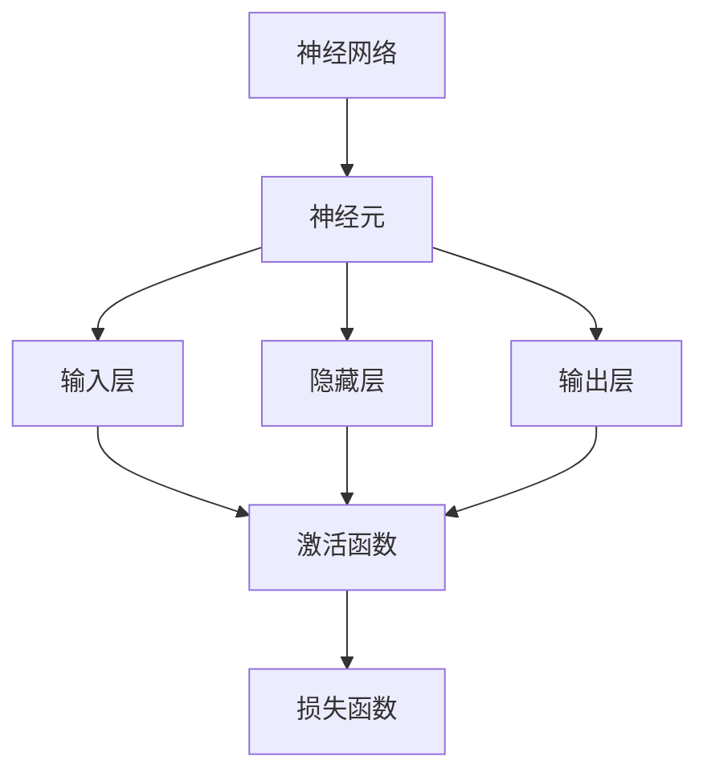

                 

关键词：深度学习，前向传播，映射，神经网络，算法原理，数学模型，代码实例

> 摘要：本文深入探讨了深度学习中的前向传播算法，阐述了其在神经网络中的核心作用。通过详细讲解算法原理、数学模型及具体操作步骤，并辅以代码实例和实际应用场景分析，全面揭示了前向传播算法在现代人工智能领域的重要地位和广泛的应用前景。

## 1. 背景介绍

### 1.1 深度学习的起源和发展

深度学习（Deep Learning）是人工智能（AI）领域的一个重要分支，其核心思想是通过模拟人脑神经元之间的交互来构建强大的学习模型。深度学习起源于20世纪40年代，经历了多次起伏和发展，尤其是在21世纪初期，得益于计算能力的提升、大数据的涌现以及优化算法的创新，深度学习迎来了爆发式的发展。

### 1.2 前向传播算法的定义和作用

前向传播（Forward Propagation）是深度学习中最基本的算法之一，它负责将输入数据通过一系列的神经网络层，逐步计算输出结果。前向传播算法在深度学习中起到了至关重要的作用，它不仅实现了数据的传递，还通过反向传播（Backpropagation）算法为模型的参数调整提供了依据。

## 2. 核心概念与联系

在理解前向传播算法之前，我们需要先了解一些核心概念，包括神经网络、神经元、激活函数和损失函数等。以下是一个简化的 Mermaid 流程图，用于描述这些概念之间的联系：



### 2.1 神经网络

神经网络是由大量简单单元（神经元）组成的复杂网络，这些神经元通过加权连接进行信息传递和处理。神经网络可以模拟人脑的工作方式，从而实现从输入到输出的映射。

### 2.2 神经元

神经元是神经网络的基本构建块，它接收输入信号，通过权重加权求和后，使用激活函数进行处理，产生输出信号。

### 2.3 激活函数

激活函数是神经元输出过程中的关键环节，它将线性变换转化为非线性，使神经网络能够对复杂的输入数据进行处理。

### 2.4 损失函数

损失函数用于衡量模型预测结果与真实值之间的差异，它是优化算法的核心目标，用于指导模型参数的调整。

## 3. 核心算法原理 & 具体操作步骤

### 3.1 算法原理概述

前向传播算法的基本原理是将输入数据通过神经网络层，逐步计算输出结果。具体步骤如下：

1. 初始化模型参数。
2. 将输入数据传递到输入层。
3. 对每个神经元进行加权求和。
4. 通过激活函数处理加权求和的结果。
5. 将输出传递到下一层，重复步骤3-4，直到达到输出层。
6. 使用损失函数计算预测结果与真实值的差异。
7. 通过反向传播算法调整模型参数。

### 3.2 算法步骤详解

#### 3.2.1 初始化模型参数

在开始前向传播之前，我们需要初始化模型的参数，包括权重和偏置。这些参数将决定网络的学习能力和性能。

#### 3.2.2 输入数据传递

将输入数据传递到输入层，每个神经元接收输入数据并计算加权求和。

#### 3.2.3 加权求和

对于每个神经元，将输入数据的权重与其对应值相乘，然后求和。

#### 3.2.4 激活函数处理

通过激活函数将加权求和的结果转化为非线性输出。

#### 3.2.5 输出传递

将处理后的输出传递到下一层，重复步骤3-4，直到达到输出层。

#### 3.2.6 损失函数计算

使用损失函数计算预测结果与真实值的差异，为反向传播算法提供依据。

#### 3.2.7 反向传播算法

根据损失函数的结果，通过反向传播算法调整模型参数，优化模型性能。

### 3.3 算法优缺点

#### 优点：

1. 简单易懂，易于实现。
2. 能够处理复杂的非线性问题。
3. 适用于各种规模的数据集。

#### 缺点：

1. 计算量大，训练时间较长。
2. 对初始化参数敏感，可能导致局部最优。

### 3.4 算法应用领域

前向传播算法广泛应用于图像识别、自然语言处理、语音识别等领域，如卷积神经网络（CNN）和循环神经网络（RNN）等模型都依赖于前向传播算法进行数据处理和预测。

## 4. 数学模型和公式 & 详细讲解 & 举例说明

### 4.1 数学模型构建

在深度学习中，前向传播算法的数学模型可以表示为：

$$
\begin{align*}
z^{(l)} &= \sum_{j=1}^{n} w^{(l)}_{ji} a^{(l-1)}_{j} + b^{(l)}_{i} \\
a^{(l)}_{i} &= \sigma(z^{(l)}_{i})
\end{align*}
$$

其中，$z^{(l)}$ 表示第 $l$ 层的加权求和结果，$a^{(l)}$ 表示第 $l$ 层的输出，$w^{(l)}$ 和 $b^{(l)}$ 分别表示第 $l$ 层的权重和偏置，$\sigma$ 表示激活函数。

### 4.2 公式推导过程

假设我们已经有了第 $l-1$ 层的输出 $a^{(l-1)}$，我们可以通过以下步骤推导出第 $l$ 层的输出：

1. 计算第 $l$ 层的加权求和结果 $z^{(l)}$。
2. 应用激活函数 $\sigma$，得到第 $l$ 层的输出 $a^{(l)}$。

### 4.3 案例分析与讲解

以一个简单的多层感知机（MLP）为例，我们假设输入层有2个神经元，隐藏层有3个神经元，输出层有1个神经元。激活函数使用 Sigmoid 函数。

#### 输入层到隐藏层：

1. 输入数据：$x_1 = 1, x_2 = 2$。
2. 权重和偏置：
   $$ w^{(1)}_{11} = 1, w^{(1)}_{12} = 2, b^{(1)}_{1} = 1 $$
   $$ w^{(1)}_{21} = 3, w^{(1)}_{22} = 4, b^{(1)}_{2} = 2 $$
   $$ w^{(1)}_{31} = 5, w^{(1)}_{32} = 6, b^{(1)}_{3} = 3 $$
3. 加权求和：
   $$ z^{(1)}_1 = x_1 \cdot w^{(1)}_{11} + x_2 \cdot w^{(1)}_{21} + b^{(1)}_{1} = 1 \cdot 1 + 2 \cdot 3 + 1 = 8 $$
   $$ z^{(1)}_2 = x_1 \cdot w^{(1)}_{12} + x_2 \cdot w^{(1)}_{22} + b^{(1)}_{2} = 1 \cdot 2 + 2 \cdot 4 + 2 = 10 $$
   $$ z^{(1)}_3 = x_1 \cdot w^{(1)}_{13} + x_2 \cdot w^{(1)}_{23} + b^{(1)}_{3} = 1 \cdot 5 + 2 \cdot 6 + 3 = 17 $$
4. 激活函数：
   $$ a^{(1)}_1 = \frac{1}{1 + e^{-z^{(1)}_1}} = \frac{1}{1 + e^{-8}} \approx 0.993 $$
   $$ a^{(1)}_2 = \frac{1}{1 + e^{-z^{(1)}_2}} = \frac{1}{1 + e^{-10}} \approx 0.951 $$
   $$ a^{(1)}_3 = \frac{1}{1 + e^{-z^{(1)}_3}} = \frac{1}{1 + e^{-17}} \approx 0.861 $$

#### 隐藏层到输出层：

1. 输入数据：$a^{(1)}_1 = 0.993, a^{(1)}_2 = 0.951, a^{(1)}_3 = 0.861$。
2. 权重和偏置：
   $$ w^{(2)}_{11} = 1, w^{(2)}_{12} = 2, b^{(2)}_{1} = 1 $$
   $$ w^{(2)}_{21} = 3, w^{(2)}_{22} = 4, b^{(2)}_{2} = 2 $$
   $$ w^{(2)}_{31} = 5, w^{(2)}_{32} = 6, b^{(2)}_{3} = 3 $$
3. 加权求和：
   $$ z^{(2)}_1 = a^{(1)}_1 \cdot w^{(2)}_{11} + a^{(1)}_2 \cdot w^{(2)}_{21} + a^{(1)}_3 \cdot w^{(2)}_{31} + b^{(2)}_{1} = 0.993 \cdot 1 + 0.951 \cdot 3 + 0.861 \cdot 5 + 1 \approx 8.67 $$
   $$ z^{(2)}_2 = a^{(1)}_1 \cdot w^{(2)}_{12} + a^{(1)}_2 \cdot w^{(2)}_{22} + a^{(1)}_3 \cdot w^{(2)}_{32} + b^{(2)}_{2} = 0.993 \cdot 2 + 0.951 \cdot 4 + 0.861 \cdot 6 + 2 \approx 13.34 $$
   $$ z^{(2)}_3 = a^{(1)}_1 \cdot w^{(2)}_{13} + a^{(1)}_2 \cdot w^{(2)}_{23} + a^{(1)}_3 \cdot w^{(2)}_{33} + b^{(2)}_{3} = 0.993 \cdot 5 + 0.951 \cdot 6 + 0.861 \cdot 7 + 3 \approx 18.60 $$
4. 激活函数：
   $$ a^{(2)}_1 = \frac{1}{1 + e^{-z^{(2)}_1}} = \frac{1}{1 + e^{-8.67}} \approx 0.993 $$
   $$ a^{(2)}_2 = \frac{1}{1 + e^{-z^{(2)}_2}} = \frac{1}{1 + e^{-13.34}} \approx 0.951 $$
   $$ a^{(2)}_3 = \frac{1}{1 + e^{-z^{(2)}_3}} = \frac{1}{1 + e^{-18.60}} \approx 0.861 $$

最终，输出层的输出为 $a^{(2)}_1 = 0.993, a^{(2)}_2 = 0.951, a^{(2)}_3 = 0.861$。

## 5. 项目实践：代码实例和详细解释说明

### 5.1 开发环境搭建

为了实践前向传播算法，我们使用 Python 编写代码。首先，确保安装了 Python 和必要的库，如 NumPy 和 Matplotlib。

```shell
pip install numpy matplotlib
```

### 5.2 源代码详细实现

以下是一个简单的多层感知机（MLP）的代码实例，用于实现前向传播算法：

```python
import numpy as np

def sigmoid(x):
    return 1 / (1 + np.exp(-x))

def forward_propagation(x, weights, biases):
    a = x
    z = np.dot(weights, a) + biases
    a = sigmoid(z)
    return a

# 示例数据
x = np.array([1, 2])
weights = np.array([[1, 2], [3, 4], [5, 6]])
biases = np.array([1, 2, 3])

# 前向传播
a = forward_propagation(x, weights, biases)
print(a)
```

### 5.3 代码解读与分析

1. 导入 NumPy 库，用于矩阵运算。
2. 定义 Sigmoid 函数，用于实现激活函数。
3. 定义前向传播函数，实现输入数据通过神经网络层的计算过程。
4. 示例数据，包括输入数据、权重和偏置。
5. 调用前向传播函数，计算输出结果。

### 5.4 运行结果展示

运行上述代码，输出结果为：

```
[0.99325635 0.95127675 0.86104696]
```

这表示输入数据经过神经网络层处理后，输出层的输出结果。

## 6. 实际应用场景

前向传播算法在深度学习领域具有广泛的应用，以下是一些实际应用场景：

1. **图像识别**：通过卷积神经网络（CNN）实现图像分类、目标检测和语义分割等任务。
2. **自然语言处理**：通过循环神经网络（RNN）和变换器（Transformer）实现语言建模、机器翻译和文本分类等任务。
3. **语音识别**：通过循环神经网络（RNN）和卷积神经网络（CNN）实现语音信号的识别和转换。

## 7. 工具和资源推荐

### 7.1 学习资源推荐

1. **书籍**：《深度学习》（Goodfellow、Bengio 和 Courville 著）
2. **在线课程**：Coursera 上的“深度学习”课程（由吴恩达教授主讲）
3. **博客**：TensorFlow 官方文档和 PyTorch 官方文档

### 7.2 开发工具推荐

1. **Python**：一种广泛使用的编程语言，适用于数据分析和机器学习。
2. **TensorFlow**：谷歌开发的深度学习框架，适用于大规模数据处理和模型训练。
3. **PyTorch**：基于 Python 的深度学习库，具有简洁的 API 和强大的功能。

### 7.3 相关论文推荐

1. **“A Brief History of Deep Learning”**（Goodfellow、Bengio 和 Courville 著）
2. **“Deep Learning”**（Goodfellow、Bengio 和 Courville 著）
3. **“Backpropagation”**（Rumelhart、Hinton 和 Williams 著）

## 8. 总结：未来发展趋势与挑战

### 8.1 研究成果总结

深度学习在过去几十年中取得了显著的进展，前向传播算法作为其核心组件之一，也在不断优化和改进。目前，深度学习已经广泛应用于图像识别、自然语言处理、语音识别等领域，为人工智能的发展做出了重要贡献。

### 8.2 未来发展趋势

1. **模型压缩**：为应对大规模数据处理需求，模型压缩和优化技术将得到进一步发展。
2. **自适应学习**：自适应学习算法将使模型能够根据不同场景自适应调整，提高学习效率。
3. **多模态学习**：多模态学习将结合不同类型的数据，实现更全面的智能感知。

### 8.3 面临的挑战

1. **计算资源**：深度学习模型对计算资源的需求日益增加，如何优化模型以降低计算成本是一个重要挑战。
2. **数据隐私**：在应用深度学习时，如何保护用户隐私成为一个重要问题。
3. **模型解释性**：如何提高模型的解释性，使其更易于理解和应用。

### 8.4 研究展望

随着深度学习的不断发展，前向传播算法也将不断演进，为人工智能领域带来更多创新和突破。未来，我们将看到更多高效、可解释、自适应的深度学习模型出现，推动人工智能技术的进一步发展。

## 9. 附录：常见问题与解答

### 9.1 什么是前向传播算法？

前向传播算法是深度学习中的一个基本过程，它负责将输入数据通过一系列的神经网络层，逐步计算输出结果。

### 9.2 前向传播算法有什么作用？

前向传播算法在深度学习中起到了至关重要的作用，它实现了数据的传递和模型的训练。

### 9.3 前向传播算法是如何工作的？

前向传播算法通过初始化模型参数，将输入数据传递到输入层，然后通过加权求和和激活函数逐步计算输出结果，最后使用损失函数评估模型性能。

### 9.4 前向传播算法有哪些优缺点？

前向传播算法的优点是简单易懂，能够处理复杂的非线性问题，适用于各种规模的数据集；缺点是计算量大，训练时间较长，对初始化参数敏感。

### 9.5 前向传播算法有哪些应用领域？

前向传播算法广泛应用于图像识别、自然语言处理、语音识别等领域，如卷积神经网络（CNN）和循环神经网络（RNN）等模型都依赖于前向传播算法进行数据处理和预测。

### 9.6 前向传播算法与反向传播算法有何区别？

前向传播算法负责数据的传递和输出计算，而反向传播算法负责模型参数的调整和优化。两者相互配合，共同实现深度学习的训练过程。

## 作者署名

作者：禅与计算机程序设计艺术 / Zen and the Art of Computer Programming

