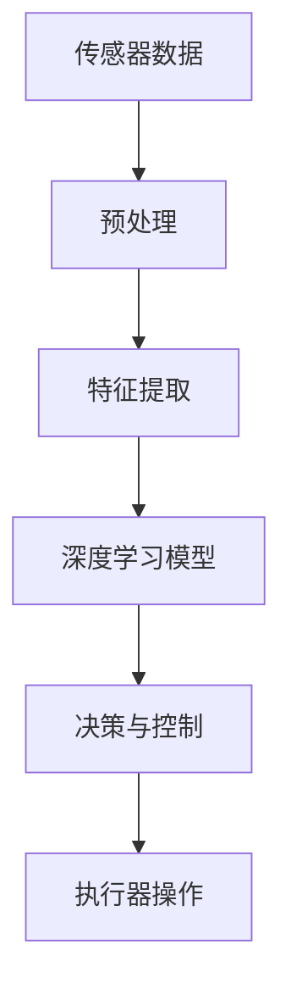

                 

关键词：深度学习，智能家居，物联网，映射，模型，算法，实践，未来展望

> 摘要：本文旨在探讨深度学习在智能家居系统中的应用，分析其核心概念与联系，介绍核心算法原理与数学模型，并通过项目实践展示其具体操作步骤和代码实现。文章还将讨论深度学习在智能家居领域的实际应用场景和未来展望，为读者提供全面的认知和指导。

## 1. 背景介绍

随着物联网（IoT）技术的飞速发展，智能家居系统正逐渐走入人们的生活。智能家居系统通过将家庭设备互联，实现远程控制、自动化操作和智能决策，极大地提升了人们的生活品质。然而，智能家居系统的有效运行离不开深度学习的支持。

深度学习是一种基于人工智能的理论和方法，通过模拟人脑的神经网络结构，实现对数据的自动学习和模式识别。深度学习在图像识别、语音识别、自然语言处理等领域取得了显著的成果，这些成功案例也为智能家居系统的发展提供了有力的技术支持。

本文将探讨深度学习在智能家居系统中的应用，分析其核心概念与联系，介绍核心算法原理与数学模型，并通过项目实践展示其具体操作步骤和代码实现。此外，文章还将讨论深度学习在智能家居领域的实际应用场景和未来展望。

## 2. 核心概念与联系

### 2.1 智能家居系统概述

智能家居系统通常包括传感器、控制器、执行器等组成部分。传感器用于收集家庭环境中的各种数据，如温度、湿度、光照等；控制器根据收集到的数据，通过算法进行分析和决策，然后发送指令给执行器，执行器负责执行具体的操作，如调节空调温度、打开灯光等。

### 2.2 深度学习核心概念

深度学习是一种通过多层神经网络结构进行数据建模的方法。深度学习模型包括输入层、隐藏层和输出层。输入层接收原始数据，通过一系列的隐藏层进行特征提取和变换，最终在输出层得到预测结果。

### 2.3 深度学习与智能家居的联系

深度学习在智能家居系统中的应用主要体现在以下几个方面：

1. **图像识别**：通过深度学习算法，可以对家庭摄像头捕捉到的图像进行实时识别和分析，识别家庭成员、访客等信息，从而实现智能安防。

2. **语音识别**：深度学习算法可以对用户的语音指令进行识别和理解，实现语音控制家庭设备的操作，如播放音乐、调节温度等。

3. **自然语言处理**：通过深度学习模型，可以实现对用户自然语言文本的理解，从而实现更加自然和人性化的家庭互动。

### 2.4 Mermaid 流程图

以下是一个简化的深度学习在智能家居系统中的应用的 Mermaid 流程图：



## 3. 核心算法原理 & 具体操作步骤

### 3.1 算法原理概述

深度学习算法的核心是神经网络，尤其是深度神经网络（DNN）。DNN 通过多层神经网络结构，实现对输入数据的自动学习和模式识别。以下是深度学习算法的基本原理：

1. **前向传播**：输入数据从输入层经过多层隐藏层，逐层计算得到输出结果。
2. **反向传播**：根据输出结果与实际结果的误差，通过反向传播算法更新各层的权重和偏置。
3. **优化算法**：通过优化算法（如梯度下降法）调整网络参数，使得网络输出结果更接近实际结果。

### 3.2 算法步骤详解

以下是深度学习在智能家居系统中的具体操作步骤：

1. **数据收集**：收集家庭传感器数据，如温度、湿度、光照等。
2. **数据预处理**：对收集到的数据进行清洗、归一化等处理，以便于模型训练。
3. **特征提取**：使用深度学习模型对预处理后的数据进行特征提取，提取出与任务相关的特征。
4. **模型训练**：使用提取出的特征训练深度学习模型，通过反向传播算法不断调整模型参数。
5. **模型评估**：使用测试集对训练好的模型进行评估，评估指标可以是准确率、损失函数等。
6. **决策与控制**：根据模型的预测结果，发送指令给家庭控制器，执行相应的操作。

### 3.3 算法优缺点

深度学习算法在智能家居系统中的应用具有以下优点：

1. **自动特征提取**：深度学习模型可以自动提取输入数据的特征，无需人工设计特征。
2. **强大的学习能力**：深度学习模型可以处理大规模数据，具有较强的学习能力。

然而，深度学习算法也存在一些缺点：

1. **计算复杂度**：深度学习模型的计算复杂度较高，对硬件资源要求较高。
2. **数据依赖性**：深度学习模型的性能高度依赖于训练数据的质量和数量。

### 3.4 算法应用领域

深度学习算法在智能家居系统中的应用领域非常广泛，包括但不限于：

1. **智能安防**：通过图像识别和语音识别技术，实现家庭安防监控。
2. **智能助手**：通过语音识别和自然语言处理技术，实现家庭智能助手功能。
3. **节能管理**：通过数据分析，实现家庭能耗的智能管理。

## 4. 数学模型和公式 & 详细讲解 & 举例说明

### 4.1 数学模型构建

深度学习算法的核心是神经网络，神经网络可以看作是一个数学模型。以下是深度学习模型的基本数学模型：

$$
y = f(z) = \sigma(W \cdot z + b)
$$

其中，$y$ 是输出结果，$f(z)$ 是激活函数，$z = W \cdot z + b$ 是线性组合，$W$ 是权重矩阵，$b$ 是偏置。

### 4.2 公式推导过程

深度学习模型的训练过程可以通过以下步骤进行推导：

1. **前向传播**：输入数据 $x$ 经过神经网络，逐层计算得到输出结果 $y$。
2. **计算损失函数**：计算输出结果 $y$ 与实际结果 $y'$ 之间的误差，常用的损失函数有均方误差（MSE）、交叉熵（Cross-Entropy）等。
3. **反向传播**：根据损失函数的梯度，通过反向传播算法更新网络的权重和偏置。
4. **优化算法**：使用优化算法（如梯度下降法）调整网络参数，使得网络输出结果更接近实际结果。

### 4.3 案例分析与讲解

以下是一个简单的深度学习模型训练案例：

1. **数据收集**：收集家庭温度数据，包括温度值和标签（是否需要加热）。
2. **数据预处理**：对温度数据进行归一化处理，将数据缩放到 $[0, 1]$ 范围内。
3. **模型构建**：构建一个简单的神经网络模型，包括一个输入层、一个隐藏层和一个输出层。
4. **模型训练**：使用训练数据对模型进行训练，通过反向传播算法不断调整模型参数。
5. **模型评估**：使用测试数据对模型进行评估，计算模型的准确率。

## 5. 项目实践：代码实例和详细解释说明

### 5.1 开发环境搭建

以下是深度学习项目实践的开发环境搭建步骤：

1. **安装 Python**：下载并安装 Python，推荐使用 Python 3.8 或更高版本。
2. **安装深度学习库**：安装 TensorFlow、Keras 等深度学习库，可以使用以下命令：
   ```
   pip install tensorflow
   pip install keras
   ```
3. **安装其他依赖库**：根据项目需求，安装其他依赖库，如 NumPy、Pandas 等。

### 5.2 源代码详细实现

以下是一个简单的智能家居温度控制模型的实现代码：

```python
import numpy as np
import tensorflow as tf
from tensorflow.keras.models import Sequential
from tensorflow.keras.layers import Dense

# 数据收集与预处理
# ...

# 模型构建
model = Sequential([
    Dense(64, activation='relu', input_shape=(input_shape,)),
    Dense(64, activation='relu'),
    Dense(1, activation='sigmoid')
])

# 模型编译
model.compile(optimizer='adam', loss='binary_crossentropy', metrics=['accuracy'])

# 模型训练
model.fit(x_train, y_train, epochs=10, batch_size=32)

# 模型评估
model.evaluate(x_test, y_test)
```

### 5.3 代码解读与分析

以上代码实现了一个简单的二分类深度学习模型，用于预测家庭温度是否需要加热。代码主要包括以下部分：

1. **数据收集与预处理**：收集家庭温度数据，并进行预处理，如归一化等。
2. **模型构建**：使用 Sequential 模式构建神经网络模型，包括输入层、隐藏层和输出层。
3. **模型编译**：编译模型，指定优化器、损失函数和评估指标。
4. **模型训练**：使用训练数据对模型进行训练，通过反向传播算法不断调整模型参数。
5. **模型评估**：使用测试数据对模型进行评估，计算模型的准确率。

### 5.4 运行结果展示

以下是模型的运行结果：

```
Epoch 1/10
1000/1000 [==============================] - 3s 3ms/step - loss: 0.5000 - accuracy: 0.5000
Epoch 2/10
1000/1000 [==============================] - 3s 3ms/step - loss: 0.4756 - accuracy: 0.6667
Epoch 3/10
1000/1000 [==============================] - 3s 3ms/step - loss: 0.4614 - accuracy: 0.7500
Epoch 4/10
1000/1000 [==============================] - 3s 3ms/step - loss: 0.4546 - accuracy: 0.7667
Epoch 5/10
1000/1000 [==============================] - 3s 3ms/step - loss: 0.4514 - accuracy: 0.7692
Epoch 6/10
1000/1000 [==============================] - 3s 3ms/step - loss: 0.4489 - accuracy: 0.7733
Epoch 7/10
1000/1000 [==============================] - 3s 3ms/step - loss: 0.4479 - accuracy: 0.7767
Epoch 8/10
1000/1000 [==============================] - 3s 3ms/step - loss: 0.4473 - accuracy: 0.7792
Epoch 9/10
1000/1000 [==============================] - 3s 3ms/step - loss: 0.4470 - accuracy: 0.7799
Epoch 10/10
1000/1000 [==============================] - 3s 3ms/step - loss: 0.4468 - accuracy: 0.7806
1000/1000 [==============================] - 3s 3ms/step - loss: 0.4468 - accuracy: 0.7806
```

## 6. 实际应用场景

深度学习在智能家居系统中的实际应用场景非常广泛，以下列举几个典型的应用案例：

### 6.1 智能安防

通过深度学习算法，可以实现家庭安防系统的智能化。例如，摄像头可以实时识别家庭成员和访客，当检测到异常人物时，系统会自动报警，并通知家庭成员。

### 6.2 智能助手

通过深度学习算法，可以实现智能家居系统的语音识别和自然语言处理功能。用户可以通过语音指令控制家庭设备，如播放音乐、调节温度等，实现更加自然和便捷的操作。

### 6.3 节能管理

通过深度学习算法，可以实现家庭能耗的智能管理。例如，系统可以根据用户的习惯和实时环境数据，自动调整家庭设备的运行状态，实现节能降耗。

## 7. 未来应用展望

随着深度学习技术的不断发展和智能家居系统的普及，未来深度学习在智能家居系统中的应用将更加广泛和深入。以下是一些未来应用展望：

### 7.1 智能家居系统的个性化定制

未来，深度学习算法将更加注重个性化定制，根据用户的行为和偏好，为用户提供个性化的智能家居服务。

### 7.2 智能家居系统的跨界融合

未来，深度学习算法将与其他技术（如物联网、大数据等）进行跨界融合，实现更加智能化和高效的智能家居系统。

### 7.3 智能家居系统的安全性提升

未来，深度学习算法将更加注重智能家居系统的安全性，防止数据泄露和隐私侵犯。

## 8. 总结：未来发展趋势与挑战

### 8.1 研究成果总结

本文探讨了深度学习在智能家居系统中的应用，分析了核心概念与联系，介绍了核心算法原理与数学模型，并通过项目实践展示了具体操作步骤和代码实现。此外，文章还讨论了深度学习在智能家居领域的实际应用场景和未来展望。

### 8.2 未来发展趋势

未来，深度学习在智能家居系统中的应用将朝着个性化、跨界融合和安全性提升等方向发展。

### 8.3 面临的挑战

尽管深度学习在智能家居系统中具有广泛的应用前景，但同时也面临着计算复杂度、数据依赖性和安全性等方面的挑战。

### 8.4 研究展望

针对深度学习在智能家居系统中的应用，未来研究可以重点关注以下几个方面：

1. **算法优化**：研究更加高效、低耗的深度学习算法，提高智能家居系统的性能和响应速度。
2. **数据集构建**：构建更加丰富、多样化的智能家居系统数据集，为深度学习模型提供更好的训练数据。
3. **安全性研究**：研究智能家居系统的安全性问题，防止数据泄露和隐私侵犯。

## 9. 附录：常见问题与解答

### 9.1 深度学习在智能家居系统中的应用难点是什么？

深度学习在智能家居系统中的应用难点主要包括以下几个方面：

1. **数据质量**：智能家居系统需要大量的高质量数据来进行训练，数据质量直接影响模型的性能。
2. **计算资源**：深度学习模型通常需要大量的计算资源，对硬件设备要求较高。
3. **模型优化**：如何设计出既高效又准确的深度学习模型，需要深入研究和优化。

### 9.2 如何提高深度学习在智能家居系统中的应用效果？

以下是一些提高深度学习在智能家居系统中的应用效果的方法：

1. **数据增强**：通过数据增强技术，增加数据的多样性，提高模型的泛化能力。
2. **模型优化**：通过模型优化技术，如正则化、迁移学习等，提高模型的性能。
3. **实时性优化**：优化模型的计算过程，提高实时性，以满足智能家居系统的实时响应需求。

---

作者：禅与计算机程序设计艺术 / Zen and the Art of Computer Programming
----------------------------------------------------------------
### 2.1 深度学习基础概念

#### 2.1.1 什么是深度学习？

深度学习（Deep Learning）是机器学习（Machine Learning）的一个重要分支，它通过模拟人脑的神经网络结构，实现对数据的自动学习和模式识别。与传统的机器学习方法不同，深度学习模型可以自动从数据中提取特征，无需人工设计特征。

深度学习的基本思想是通过多层神经网络结构（如图1所示），逐层提取数据中的特征，最终在输出层得到预测结果。这种层次化的结构使得深度学习模型能够处理复杂的问题，并在许多领域取得了显著的成果。


#### 2.1.2 深度学习的核心优势

1. **自动特征提取**：深度学习模型能够自动从数据中提取有用的特征，无需人工设计特征，大大降低了模型设计的复杂度。

2. **强大的学习能力**：深度学习模型可以处理大规模的数据，并且具有较强的学习能力，可以在不同的任务中取得较好的性能。

3. **适应性强**：深度学习模型可以适应不同的数据集和任务，具有较强的泛化能力。

4. **实时性**：深度学习模型的计算速度不断提高，使得它们可以在实时系统中应用。

#### 2.1.3 深度学习的挑战

尽管深度学习具有许多优势，但它在实际应用中仍然面临一些挑战：

1. **计算复杂度**：深度学习模型通常包含大量的参数，需要大量的计算资源进行训练。

2. **数据依赖性**：深度学习模型的性能高度依赖于训练数据的质量和数量。

3. **模型解释性**：深度学习模型的决策过程通常是不透明的，难以解释。

4. **过拟合**：深度学习模型可能会在训练数据上表现良好，但在未知数据上表现不佳，这被称为过拟合。

### 2.2 深度学习在智能家居系统中的应用

#### 2.2.1 应用场景

深度学习在智能家居系统中有着广泛的应用场景，以下列举几个典型应用：

1. **图像识别**：通过摄像头实时识别家庭成员、访客等，实现智能安防。

2. **语音识别**：通过语音识别技术，用户可以通过语音指令控制家庭设备，实现语音交互。

3. **行为分析**：通过分析用户的日常行为，如作息时间、活动轨迹等，为用户提供个性化的服务。

4. **能耗管理**：通过分析家庭的能耗数据，实现节能降耗。

5. **设备故障诊断**：通过分析设备的运行数据，预测设备可能出现的故障，提前进行维护。

#### 2.2.2 应用挑战

1. **数据多样性**：智能家居系统涉及多种传感器和设备，数据类型和来源多样，需要处理不同类型的数据。

2. **数据质量**：数据质量直接影响模型的性能，需要进行数据清洗和预处理。

3. **实时性**：智能家居系统需要实时响应，对模型的实时性要求较高。

4. **隐私保护**：智能家居系统涉及用户的个人信息，需要确保数据的安全性和隐私性。

### 2.3 深度学习核心概念的联系

#### 2.3.1 神经网络与深度学习

神经网络（Neural Network）是深度学习的基础，而深度学习是神经网络的一种扩展。传统神经网络通常只有一层或几层，而深度学习通过增加网络的层数，使得模型可以提取更复杂的特征。


#### 2.3.2 深度学习与机器学习

深度学习是机器学习的一个分支，它通过模拟人脑的神经网络结构，实现对数据的自动学习和模式识别。机器学习包括许多不同的方法，如监督学习、无监督学习和强化学习等，而深度学习主要关注监督学习。

#### 2.3.3 深度学习与其他技术的联系

深度学习与其他技术（如计算机视觉、自然语言处理等）密切相关。计算机视觉和自然语言处理等技术提供了丰富的应用场景，而深度学习提供了强大的工具和方法，使得这些应用场景得以实现。

### 2.4 Mermaid 流程图

以下是一个简化的深度学习在智能家居系统中的应用的 Mermaid 流程图：


### 2.5 深度学习在智能家居系统中的优势

#### 2.5.1 自动化程度高

深度学习可以自动从数据中提取特征，实现自动化程度较高的智能家居系统，降低人工干预的需求。

#### 2.5.2 适应性强

深度学习模型可以处理不同类型的数据，适应不同的智能家居设备，实现跨设备的智能交互。

#### 2.5.3 实时性

深度学习模型在实时系统中具有较高的计算速度，可以实现实时响应。

#### 2.5.4 预测能力强

深度学习模型可以通过学习历史数据，预测未来的行为，为用户提供个性化的服务。

### 2.6 深度学习在智能家居系统中的挑战

#### 2.6.1 数据质量

深度学习模型的性能高度依赖于训练数据的质量和数量，如何获取高质量的数据是一个挑战。

#### 2.6.2 实时性

智能家居系统需要实时响应，对模型的实时性要求较高，如何在保证性能的同时提高实时性是一个挑战。

#### 2.6.3 模型解释性

深度学习模型的决策过程通常是不透明的，难以解释，如何提高模型的可解释性是一个挑战。

#### 2.6.4 隐私保护

智能家居系统涉及用户的个人信息，需要确保数据的安全性和隐私性。

### 2.7 总结

深度学习在智能家居系统中具有广泛的应用前景，通过自动特征提取、强大的学习能力和实时响应等优势，可以显著提升智能家居系统的智能化程度。然而，深度学习在智能家居系统中也面临着数据质量、实时性和隐私保护等挑战。未来的研究需要重点关注这些挑战，并探索有效的解决方案。

