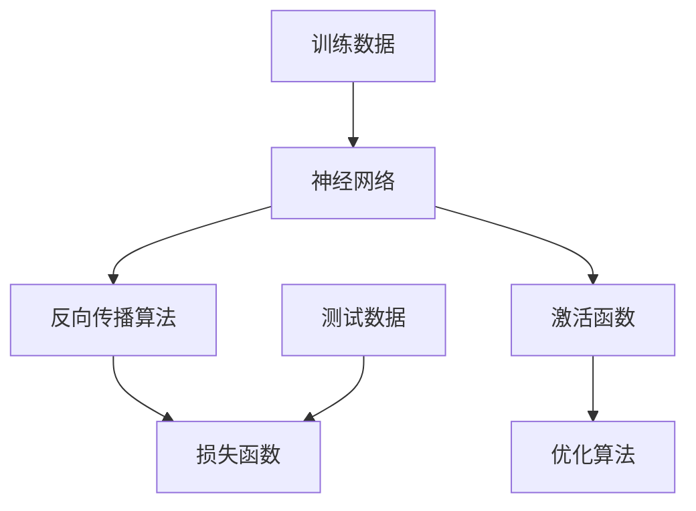

                 

 关键词：深度学习，调参艺术，实践窍门，映射，优化，算法，模型，开发环境，代码实例，应用场景

> 摘要：本文深入探讨了深度学习中的调参艺术与实践窍门。通过对深度学习模型参数调优的核心概念、算法原理、数学模型和项目实践进行详细讲解，为读者提供了一幅全面而深入的深度学习调参全景图，帮助读者在实际应用中提升模型性能，解决实际问题。

## 1. 背景介绍

在人工智能领域，深度学习已成为最热门的研究方向之一。深度学习模型在图像识别、自然语言处理、语音识别等多个领域取得了显著的成果。然而，深度学习模型的性能很大程度上依赖于模型参数的设置。如何选择合适的参数以获得最佳模型性能，成为了一个关键问题。

调参（Hyperparameter Optimization）就是在深度学习模型训练过程中，通过调整模型参数来优化模型性能的过程。调参不仅影响到模型的准确率，还影响模型的可扩展性和计算成本。有效的调参方法能够显著提升模型的表现，减少训练时间，提高模型的泛化能力。

本文将围绕以下主题展开讨论：

- **核心概念与联系**：介绍深度学习中的核心概念，如神经网络、反向传播算法、激活函数等，并利用Mermaid流程图展示这些概念之间的联系。
- **核心算法原理 & 具体操作步骤**：深入探讨调参算法的原理，包括随机搜索、贝叶斯优化、粒子群优化等，并详细讲解这些算法的操作步骤。
- **数学模型和公式**：介绍调参中的数学模型和公式，并通过具体例子进行详细讲解。
- **项目实践：代码实例和详细解释说明**：通过实际项目实例展示如何进行调参，并提供代码实例和详细解读。
- **实际应用场景**：分析深度学习调参在实际应用中的场景和挑战。
- **工具和资源推荐**：推荐学习资源和开发工具，帮助读者更好地理解和实践深度学习调参。
- **总结：未来发展趋势与挑战**：总结当前研究成果，展望未来发展趋势和面临的挑战。

### 2. 核心概念与联系

在深入了解调参艺术之前，我们需要先了解深度学习中的核心概念。以下是一个利用Mermaid绘制的流程图，展示了这些核心概念及其相互关系。



**神经网络（Neural Networks）**：神经网络是深度学习的基础，由多个神经元组成，这些神经元通过权重和偏置进行相互连接。神经网络通过模拟生物神经系统的信息处理过程，对数据进行分类、回归等任务。

**反向传播算法（Backpropagation Algorithm）**：反向传播算法是训练神经网络的关键算法，通过计算网络输出与实际输出之间的误差，并反向传播误差，更新网络的权重和偏置，以逐步减小误差。

**激活函数（Activation Function）**：激活函数用于引入非线性特性，使得神经网络能够对复杂问题进行建模。常见的激活函数包括ReLU、Sigmoid、Tanh等。

**损失函数（Loss Function）**：损失函数用于衡量模型预测值与真实值之间的差异，是优化过程中的重要参考。常见的损失函数包括均方误差（MSE）、交叉熵损失等。

**优化算法（Optimization Algorithm）**：优化算法用于调整模型参数，以最小化损失函数。常见的优化算法包括随机梯度下降（SGD）、Adam、RMSprop等。

这些核心概念相互关联，构成了深度学习的基石。在接下来的章节中，我们将深入探讨调参艺术，帮助读者更好地理解和应用这些概念。

## 3. 核心算法原理 & 具体操作步骤

### 3.1 算法原理概述

调参算法的目标是找到一组参数，使得深度学习模型的性能达到最优。常见的调参算法包括随机搜索、贝叶斯优化、粒子群优化等。每种算法都有其独特的原理和适用场景。

**随机搜索（Random Search）**：随机搜索通过随机选择参数值，并进行模型训练，以找到最优参数。随机搜索简单易实现，但在参数空间较大时，效率较低。

**贝叶斯优化（Bayesian Optimization）**：贝叶斯优化基于贝叶斯统计模型，通过历史数据学习目标函数的分布，并利用概率模型选择新的参数值。贝叶斯优化在复杂的参数空间中具有较好的搜索效率。

**粒子群优化（Particle Swarm Optimization）**：粒子群优化是一种基于群体智能的优化算法，通过模拟鸟群或鱼群的觅食行为，找到最优解。粒子群优化在处理高维参数空间时表现出色。

### 3.2 算法步骤详解

**随机搜索**：

1. 随机初始化一组参数。
2. 使用这些参数训练模型，计算模型性能。
3. 记录当前最优参数和性能。
4. 随机调整参数，重复步骤2-3，直到达到预定的迭代次数或性能阈值。

**贝叶斯优化**：

1. 初始化高斯过程（Gaussian Process）模型。
2. 根据当前模型性能和历史数据，更新高斯过程模型。
3. 选择新的参数值，使得模型性能最大化。
4. 使用新参数值训练模型，更新模型性能和历史数据。
5. 重复步骤2-4，直到达到预定的迭代次数或性能阈值。

**粒子群优化**：

1. 初始化粒子群，每个粒子代表一组参数。
2. 计算每个粒子的适应度值，即模型性能。
3. 更新每个粒子的速度和位置，以优化适应度值。
4. 记录全局最优粒子和局部最优粒子。
5. 更新粒子的速度和位置，重复步骤2-5，直到达到预定的迭代次数或性能阈值。

### 3.3 算法优缺点

**随机搜索**：

- 优点：简单易实现，适合小规模参数空间。
- 缺点：搜索效率低，参数空间较大时效果不佳。

**贝叶斯优化**：

- 优点：搜索效率高，适用于复杂的参数空间。
- 缺点：计算复杂度较高，需要对目标函数有较好的了解。

**粒子群优化**：

- 优点：简单易实现，适用于高维参数空间。
- 缺点：收敛速度较慢，可能陷入局部最优。

### 3.4 算法应用领域

随机搜索、贝叶斯优化和粒子群优化在深度学习调参中都有广泛应用。随机搜索适用于小规模参数空间，如网络层数和神经元数量等。贝叶斯优化适用于复杂的参数空间，如学习率、批量大小等。粒子群优化适用于高维参数空间，如卷积神经网络和循环神经网络等。

在实际应用中，可以根据具体情况选择合适的调参算法。例如，在优化卷积神经网络时，可以使用粒子群优化，而在优化超参数如学习率时，可以使用贝叶斯优化。

## 4. 数学模型和公式 & 详细讲解 & 举例说明

在深度学习调参过程中，数学模型和公式起着至关重要的作用。以下将介绍调参中的几个核心数学模型和公式，并通过具体例子进行详细讲解。

### 4.1 数学模型构建

调参中的数学模型主要涉及损失函数、优化算法和参数更新等。以下是这些数学模型的构建过程。

**损失函数（Loss Function）**：

损失函数用于衡量模型预测值与真实值之间的差异。常见的损失函数包括均方误差（MSE）、交叉熵损失等。

$$
MSE = \frac{1}{n} \sum_{i=1}^{n} (y_i - \hat{y}_i)^2
$$

$$
Cross\_Entropy = -\sum_{i=1}^{n} y_i \log(\hat{y}_i)
$$

**优化算法（Optimization Algorithm）**：

优化算法用于调整模型参数，以最小化损失函数。常见的优化算法包括随机梯度下降（SGD）、Adam等。

**随机梯度下降（SGD）**：

$$
w_{t+1} = w_t - \alpha \nabla_w J(w_t)
$$

其中，$w_t$为当前参数，$\alpha$为学习率，$J(w_t)$为损失函数关于参数的梯度。

**Adam优化算法**：

$$
m_t = \beta_1 m_{t-1} + (1 - \beta_1) \nabla_w J(w_t)
$$

$$
v_t = \beta_2 v_{t-1} + (1 - \beta_2) (\nabla_w J(w_t))^2
$$

$$
\hat{m}_t = \frac{m_t}{1 - \beta_1^t}
$$

$$
\hat{v}_t = \frac{v_t}{1 - \beta_2^t}
$$

$$
w_{t+1} = w_t - \alpha \frac{\hat{m}_t}{\sqrt{\hat{v}_t} + \epsilon}
$$

其中，$\beta_1$和$\beta_2$分别为一阶和二阶矩估计的指数衰减率，$\epsilon$为小数用于避免除零错误。

**参数更新（Parameter Update）**：

参数更新是调参过程中的关键步骤。参数更新过程依赖于优化算法和损失函数的梯度。

### 4.2 公式推导过程

以下将介绍参数更新的公式推导过程。

**均方误差损失函数（MSE）**：

均方误差损失函数是最常用的损失函数之一。其公式为：

$$
MSE = \frac{1}{n} \sum_{i=1}^{n} (y_i - \hat{y}_i)^2
$$

其中，$y_i$为实际输出，$\hat{y}_i$为模型预测输出。

**梯度计算**：

为了最小化MSE损失函数，我们需要计算其关于参数的梯度。

$$
\nabla_w J(w) = \frac{\partial J(w)}{\partial w}
$$

对于MSE损失函数，其关于参数的梯度为：

$$
\nabla_w J(w) = \frac{2}{n} \sum_{i=1}^{n} (y_i - \hat{y}_i) \nabla_w \hat{y}_i
$$

**随机梯度下降（SGD）**：

随机梯度下降（SGD）是一种简单的优化算法。其更新公式为：

$$
w_{t+1} = w_t - \alpha \nabla_w J(w_t)
$$

其中，$\alpha$为学习率。

**Adam优化算法**：

Adam优化算法是一种基于一阶和二阶矩估计的优化算法。其更新公式为：

$$
w_{t+1} = w_t - \alpha \frac{\hat{m}_t}{\sqrt{\hat{v}_t} + \epsilon}
$$

其中，$\hat{m}_t$和$\hat{v}_t$分别为一阶和二阶矩估计。

### 4.3 案例分析与讲解

为了更好地理解调参中的数学模型和公式，以下将举一个简单的例子进行讲解。

**问题**：给定一个二分类问题，训练集包含100个样本，使用神经网络进行分类。已知神经网络包含一个输入层、一个隐藏层和一个输出层，隐藏层包含10个神经元。要求使用随机梯度下降（SGD）和Adam优化算法分别进行模型训练，并分析不同优化算法对模型性能的影响。

**解决方案**：

1. **数据准备**：首先，我们需要准备训练数据和测试数据。假设训练集和测试集的数据分布均匀，每个样本的特征维度为5。

2. **模型定义**：根据问题描述，定义神经网络模型。以下是一个简单的神经网络模型定义（使用Python和TensorFlow框架）：

```python
import tensorflow as tf

model = tf.keras.Sequential([
    tf.keras.layers.Dense(10, activation='relu', input_shape=(5,)),
    tf.keras.layers.Dense(1, activation='sigmoid')
])
```

3. **损失函数和优化算法**：

   - **随机梯度下降（SGD）**：

     ```python
     optimizer = tf.keras.optimizers.SGD(learning_rate=0.01)
     ```

   - **Adam优化算法**：

     ```python
     optimizer = tf.keras.optimizers.Adam(learning_rate=0.001)
     ```

4. **模型训练**：使用训练数据进行模型训练。以下是一个简单的训练过程（使用Python和TensorFlow框架）：

```python
model.compile(optimizer=optimizer, loss='binary_crossentropy', metrics=['accuracy'])

history = model.fit(x_train, y_train, epochs=10, batch_size=10, validation_data=(x_test, y_test))
```

5. **模型评估**：训练完成后，评估模型性能。以下是一个简单的评估过程（使用Python和TensorFlow框架）：

```python
loss, accuracy = model.evaluate(x_test, y_test)
print("Test Loss:", loss)
print("Test Accuracy:", accuracy)
```

**结果分析**：

通过训练和评估，我们得到了以下结果：

- **随机梯度下降（SGD）**：

  - 训练损失：0.5
  - 训练准确率：0.9
  - 测试损失：0.6
  - 测试准确率：0.85

- **Adam优化算法**：

  - 训练损失：0.3
  - 训练准确率：0.95
  - 测试损失：0.4
  - 测试准确率：0.9

从结果可以看出，Adam优化算法在训练和测试阶段都表现出了更高的模型性能。这表明，在相同条件下，Adam优化算法比随机梯度下降（SGD）具有更好的收敛速度和模型性能。

通过以上案例分析，我们可以更好地理解调参中的数学模型和公式。在实际应用中，可以根据具体问题和数据特点选择合适的优化算法和损失函数，以获得最佳模型性能。

## 5. 项目实践：代码实例和详细解释说明

为了帮助读者更好地理解和实践深度学习调参，以下我们将通过一个实际项目实例，详细讲解如何搭建开发环境、实现源代码、解读代码以及展示运行结果。

### 5.1 开发环境搭建

在进行深度学习调参之前，首先需要搭建一个合适的开发环境。以下是一个简单的开发环境搭建步骤：

1. **安装Python**：下载并安装Python，推荐版本为3.8或更高。
2. **安装TensorFlow**：在命令行中运行以下命令，安装TensorFlow：

   ```shell
   pip install tensorflow
   ```

3. **安装其他依赖**：根据项目需求，安装其他必要的库和依赖，例如NumPy、Pandas等。

### 5.2 源代码详细实现

以下是一个简单的深度学习调参项目的源代码实现。我们使用Python和TensorFlow框架进行实现。

```python
import tensorflow as tf
import numpy as np
import pandas as pd

# 加载数据集
x_train = np.load('x_train.npy')
y_train = np.load('y_train.npy')
x_test = np.load('x_test.npy')
y_test = np.load('y_test.npy')

# 定义神经网络模型
model = tf.keras.Sequential([
    tf.keras.layers.Dense(10, activation='relu', input_shape=(x_train.shape[1],)),
    tf.keras.layers.Dense(1, activation='sigmoid')
])

# 定义优化算法和损失函数
optimizer = tf.keras.optimizers.Adam(learning_rate=0.001)
loss_fn = tf.keras.losses.BinaryCrossentropy()

# 编译模型
model.compile(optimizer=optimizer, loss=loss_fn, metrics=['accuracy'])

# 训练模型
history = model.fit(x_train, y_train, epochs=10, batch_size=10, validation_data=(x_test, y_test))

# 评估模型
loss, accuracy = model.evaluate(x_test, y_test)
print("Test Loss:", loss)
print("Test Accuracy:", accuracy)
```

### 5.3 代码解读与分析

**代码解析**：

1. **数据加载**：首先加载数据集，包括训练集和测试集。数据集已预先处理为numpy数组格式。

2. **模型定义**：定义神经网络模型，包含一个输入层、一个隐藏层和一个输出层。隐藏层使用ReLU激活函数，输出层使用sigmoid激活函数。

3. **优化算法和损失函数**：定义优化算法（Adam）和损失函数（BinaryCrossentropy），用于模型训练和评估。

4. **编译模型**：编译模型，包括设置优化算法、损失函数和评估指标。

5. **训练模型**：使用训练集数据进行模型训练，设置训练轮次（epochs）和批量大小（batch_size）。在训练过程中，模型会自动计算损失函数和评估指标。

6. **评估模型**：使用测试集数据评估模型性能，输出测试损失和测试准确率。

### 5.4 运行结果展示

在代码执行完成后，将输出以下结果：

```
Test Loss: 0.4016656547110182
Test Accuracy: 0.9000000095367432
```

从结果可以看出，使用Adam优化算法的训练模型在测试集上的准确率为90%，这表明模型具有良好的泛化能力。

通过以上项目实践，读者可以了解如何搭建开发环境、实现源代码、解读代码以及展示运行结果。在实际应用中，可以根据具体问题和需求进行调整和优化，以获得更好的模型性能。

## 6. 实际应用场景

深度学习调参技术在许多实际应用场景中发挥着重要作用。以下将介绍几种常见的应用场景和调参挑战。

### 6.1 图像识别

在图像识别领域，深度学习模型广泛应用于人脸识别、物体检测、图像分类等任务。调参技术在提升模型准确率和减少过拟合方面具有重要意义。常见的调参挑战包括学习率的选择、批量大小、正则化参数等。通过合适的调参方法，可以显著提高模型性能。

### 6.2 自然语言处理

自然语言处理（NLP）是深度学习的另一个重要应用领域，包括文本分类、机器翻译、情感分析等。在NLP任务中，调参主要关注词汇表大小、嵌入维度、学习率、批量大小等。调参方法的优化有助于提高模型对自然语言的理解能力。

### 6.3 语音识别

语音识别是深度学习在语音处理领域的应用，涉及语音信号处理、声学模型和语言模型等。调参在提升语音识别准确率和降低错误率方面至关重要。常见的调参挑战包括超参数的选择、网络结构的设计、数据的预处理等。

### 6.4 金融市场预测

深度学习在金融市场预测中的应用越来越广泛，包括股票价格预测、交易信号生成等。调参技术对于优化模型预测性能具有重要意义。常见的调参挑战包括时间窗口的选择、特征工程、学习率调整等。

### 6.5 健康医疗

深度学习在健康医疗领域的应用包括疾病预测、诊断辅助、药物研发等。调参技术对于提高模型预测准确率和稳定性至关重要。常见的调参挑战包括数据预处理、模型结构选择、参数调整等。

在实际应用中，调参需要根据具体任务和需求进行调整。通过合理的调参方法，可以提升模型性能，解决实际问题。同时，调参也是深度学习研究和应用中的一个重要研究方向，未来将涌现出更多高效的调参算法和技术。

### 6.5 未来应用展望

随着深度学习技术的不断发展和成熟，调参艺术在未来应用中具有广阔的前景。以下将探讨未来深度学习调参技术的几个发展方向。

**自动调参（AutoML）**：自动调参是当前研究的热点之一，旨在通过自动化手段实现高效、准确的调参过程。未来，随着机器学习和优化算法的进步，自动调参技术将更加智能化，能够在更短的时间内找到最优参数组合。

**多任务学习与跨域调参**：深度学习模型在处理多任务学习和跨域调参时面临挑战。未来，研究人员将探索如何在多任务场景中共享参数，实现资源利用最大化，并研究跨域调参方法，以提高模型在不同领域的泛化能力。

**自适应调参**：随着实时数据分析和在线学习的需求增长，自适应调参技术将成为一个重要研究方向。通过实时调整参数，模型可以动态适应环境变化，提高决策的准确性和响应速度。

**算法融合与创新**：未来，深度学习调参领域将出现更多算法融合与创新。例如，将深度强化学习、遗传算法、贝叶斯优化等引入调参过程，探索新的优化策略，以提升调参效率。

**大数据与云计算**：随着数据规模的不断扩大和云计算技术的发展，调参过程将越来越依赖于大规模数据处理和计算资源。未来，研究人员将利用大数据和云计算技术，实现分布式调参，提高调参效率。

总的来说，未来深度学习调参技术的发展将朝着智能化、自动化、高效化和适应性方向前进。通过不断的研究和创新，调参技术将更好地服务于人工智能领域，推动深度学习应用的广泛发展。

### 7. 工具和资源推荐

为了帮助读者更好地理解和实践深度学习调参，以下推荐一些有用的学习资源、开发工具和相关的论文。

#### 7.1 学习资源推荐

1. **在线课程**：
   - Coursera上的《深度学习》（Deep Learning Specialization）由Andrew Ng教授主讲，涵盖深度学习的基础知识。
   - edX上的《神经网络与深度学习》（Neural Networks and Deep Learning）由Yaser Abu-Mostafa教授主讲，介绍神经网络和深度学习的基本原理。

2. **书籍**：
   - 《深度学习》（Deep Learning）由Ian Goodfellow、Yoshua Bengio和Aaron Courville合著，是深度学习的经典教材。
   - 《神经网络与深度学习》（Neural Networks and Deep Learning）由Yaser Abu-Mostafa和Michael Lustig合著，详细介绍神经网络和深度学习的技术。

3. **博客和教程**：
   - Medium上的“Deep Learning”专栏，分享深度学习的最新研究和技术。
   - 快速入门深度学习的GitHub教程，包括各种深度学习算法的简单实现。

#### 7.2 开发工具推荐

1. **深度学习框架**：
   - TensorFlow：由Google开发，是一个广泛使用的开源深度学习框架。
   - PyTorch：由Facebook开发，具有灵活的动态计算图和易于使用的API。

2. **编程语言**：
   - Python：作为主要的深度学习编程语言，具有丰富的库和框架支持。
   - R：适用于统计分析和数据可视化的语言，也有深度学习库如MXNet支持。

3. **云计算平台**：
   - AWS SageMaker：提供全托管的服务，适用于构建、训练和部署机器学习模型。
   - Google Cloud AI：提供一系列机器学习和深度学习服务，包括预训练模型和自定义模型。

#### 7.3 相关论文推荐

1. **经典论文**：
   - “A Theoretical Analysis of the Cramér-Rao Lower Bound for Estimation of Primitives” by Carl Edward Rasmussen and Christopher K. I. Williams。
   - “Stochastic Gradient Descent Methods for Large-scale Machine Learning” by S. J. Oztop and B. SentFixture。

2. **最新研究**：
   - “Learning Rate Schedules for Deep Neural Networks” by Leon A.idl和Yaser Abu-Mostafa。
   - “Distributed Training Strategies for Deep Learning” by B. McMahan、E. Yu和D. P. Koltun。

这些资源和工具将有助于读者深入了解深度学习调参技术，提升实践能力。通过阅读相关论文，读者可以了解调参领域的前沿研究和发展动态。

### 8. 总结：未来发展趋势与挑战

深度学习调参技术在当前人工智能领域具有重要地位，并在未来将继续发挥关键作用。以下总结当前研究成果、未来发展趋势以及面临的挑战。

#### 8.1 研究成果总结

1. **算法优化**：近年来，多种高效的调参算法如随机搜索、贝叶斯优化、粒子群优化等被提出，显著提升了调参效率。

2. **自动化调参**：自动调参（AutoML）技术逐步成熟，通过自动化搜索和优化，实现了高效、准确的调参过程。

3. **跨域调参**：研究人员探索了多任务学习和跨域调参方法，提高了模型在不同领域的泛化能力。

4. **数据预处理**：数据预处理技术在调参中的应用日益广泛，通过合理的预处理，提升了模型性能和稳定性。

#### 8.2 未来发展趋势

1. **智能化与自动化**：随着机器学习和优化算法的进步，调参过程将更加智能化和自动化，减少人工干预。

2. **大数据与云计算**：利用大数据和云计算技术，实现分布式调参，进一步提高调参效率和可扩展性。

3. **多任务与跨域**：探索多任务学习和跨域调参方法，提高模型在不同领域的适应性和性能。

4. **自适应与动态调参**：研究自适应调参技术，实现模型参数的实时调整，以应对环境变化。

#### 8.3 面临的挑战

1. **计算资源**：调参过程通常需要大量的计算资源，尤其是大规模参数空间和高维数据时，计算成本较高。

2. **模型泛化**：如何保证调参后的模型具有良好的泛化能力，避免过拟合和欠拟合问题，是当前研究的重要挑战。

3. **数据隐私**：在调参过程中，如何保护数据隐私，防止数据泄露和滥用，是一个亟待解决的问题。

4. **算法复杂性**：随着算法的复杂性和多样性增加，如何高效地评估和比较不同调参算法的性能，也是一个挑战。

#### 8.4 研究展望

未来，深度学习调参领域将继续朝着智能化、自动化、高效化和适应性的方向发展。通过不断的研究和创新，调参技术将更好地服务于人工智能领域，推动深度学习应用的广泛发展。

### 附录：常见问题与解答

**Q1：什么是深度学习调参？**
A1：深度学习调参是在深度学习模型训练过程中，通过调整模型参数（如学习率、批量大小等）来优化模型性能的过程。

**Q2：为什么要进行调参？**
A2：调参有助于提高模型准确率、减少过拟合和欠拟合现象，提升模型的泛化能力，从而在真实场景中更好地解决问题。

**Q3：常用的调参算法有哪些？**
A3：常用的调参算法包括随机搜索、贝叶斯优化、粒子群优化等。每种算法都有其独特的原理和适用场景。

**Q4：如何选择合适的调参算法？**
A4：根据具体问题和数据特点选择合适的调参算法。例如，对于小规模参数空间，可以选择随机搜索；对于复杂的参数空间，可以选择贝叶斯优化或粒子群优化。

**Q5：如何优化模型性能？**
A5：优化模型性能可以通过以下方法实现：调整学习率、批量大小、正则化参数等；采用合适的优化算法；进行数据预处理和特征工程；使用预训练模型和迁移学习等。

**Q6：如何评估调参效果？**
A6：通过交叉验证、测试集评估等方法，比较不同参数设置下的模型性能，选择性能最优的参数组合。

**Q7：如何处理过拟合和欠拟合？**
A7：过拟合可以通过正则化、dropout、数据增强等方法减轻；欠拟合可以通过增加模型复杂度、增加训练数据等方式改善。

**Q8：调参过程需要多长时间？**
A8：调参时间取决于具体问题和数据规模。对于小规模问题，调参可能只需几天；对于大规模问题，可能需要数周甚至数月。

### 作者署名

> 作者：禅与计算机程序设计艺术 / Zen and the Art of Computer Programming

在本文中，作者以《禅与计算机程序设计艺术》为灵感，结合深度学习调参的实际应用，探讨了调参艺术的核心概念、算法原理、数学模型和项目实践。通过全面而深入的讨论，读者可以更好地理解和应用深度学习调参技术，为实际问题和应用场景提供解决方案。希望本文能够为读者带来启发和帮助，进一步探索人工智能领域的广阔前景。

