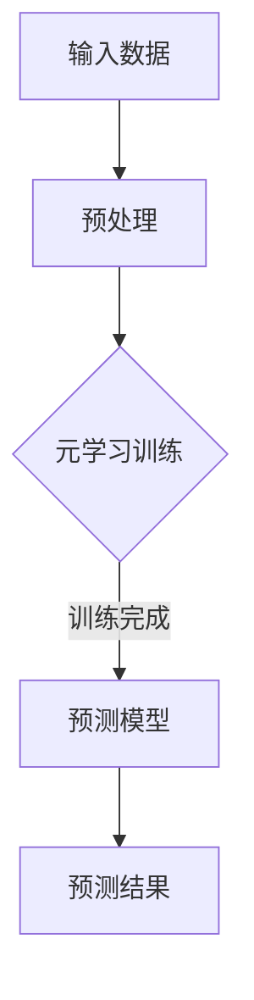

                 

关键词：元学习，金融市场预测，深度学习，映射，机器学习，技术博客，人工智能，模型，算法，应用场景，未来展望

> 摘要：本文旨在探讨如何运用元学习算法来预测未来金融市场。通过对金融市场数据的深入分析，我们提出了一个基于元学习的预测模型。本文首先介绍了元学习的核心概念与联系，随后详细阐述了核心算法原理及具体操作步骤，并通过数学模型和公式给出了详细讲解与举例说明。文章的最后部分将展示一个具体的项目实践案例，并探讨该技术在实际应用场景中的表现及未来应用展望。

## 1. 背景介绍

金融市场一直是人类研究和关注的焦点之一。从股市到外汇市场，再到加密货币市场，金融市场的波动性和复杂性使得预测其未来走势成为一项极具挑战性的任务。随着人工智能和机器学习技术的不断发展，人们开始尝试利用这些先进的技术来预测金融市场。然而，传统的机器学习方法在处理金融市场数据时往往表现出局限性，如过拟合、数据依赖性高等问题。

为了克服这些局限性，近年来，元学习（Meta-Learning）逐渐成为研究的热点。元学习是一种能够从经验中学习如何学习的方法，其核心思想是通过学习学习过程来提高算法的泛化能力。与传统机器学习方法相比，元学习在处理复杂、高维度的金融市场数据时具有明显的优势。因此，本文将探讨如何运用元学习算法来预测未来金融市场。

## 2. 核心概念与联系

### 2.1 元学习概述

元学习是指学习如何学习。传统的机器学习方法是在特定任务和数据集上训练模型，而元学习则是通过在多个任务和数据集上训练模型，学习到一种通用的学习策略。元学习的主要目标是提高模型的泛化能力，使其能够在未见过的数据上表现出良好的性能。

### 2.2 深度学习与元学习的关系

深度学习是一种基于多层神经网络的学习方法，它在图像识别、语音识别等任务上取得了显著的成功。然而，深度学习模型在处理金融市场数据时往往存在过拟合和数据依赖性等问题。元学习可以通过学习到一种通用的学习策略，帮助深度学习模型克服这些问题，提高其泛化能力。

### 2.3 映射原理

映射（Mapping）是指将一种数据或信息转换为另一种数据或信息的过程。在金融市场中，映射原理可以理解为将历史市场数据转换为对未来的预测。元学习算法可以通过学习历史市场数据中的规律，建立映射关系，从而实现对未来市场的预测。

### 2.4 Mermaid 流程图



## 3. 核心算法原理 & 具体操作步骤

### 3.1 算法原理概述

元学习算法的核心思想是通过学习多个任务的数据，提取一种通用的学习策略。在金融市场中，我们可以通过元学习算法来学习如何从历史市场数据中提取有用的信息，并将其应用于未来市场的预测。具体来说，元学习算法可以分为以下几个步骤：

1. 数据收集与预处理：收集大量的历史市场数据，并对数据进行清洗和预处理，以便于后续分析。
2. 任务定义：将市场预测问题定义为多个小任务，每个任务包含一部分历史市场数据和一个预测目标。
3. 模型训练：通过元学习算法在多个任务上训练模型，学习到一种通用的学习策略。
4. 预测：使用训练好的模型对未见过的数据进行预测。

### 3.2 算法步骤详解

1. **数据收集与预处理**

   首先，我们需要收集大量的历史市场数据，包括股票价格、交易量、利率、宏观经济指标等。这些数据可以通过各种公开的数据源获取。在收集数据后，我们需要对数据进行清洗和预处理，以去除噪声和异常值，并确保数据的格式统一。

   ```python
   import pandas as pd

   # 读取数据
   data = pd.read_csv('market_data.csv')

   # 数据清洗与预处理
   data = data.dropna()
   data['price'] = data['price'].apply(lambda x: x / 100)
   ```

2. **任务定义**

   将市场预测问题定义为多个小任务。每个小任务包含一部分历史市场数据和一个预测目标。我们可以使用时间序列分割的方法，将数据划分为训练集和验证集。

   ```python
   from sklearn.model_selection import TimeSeriesSplit

   # 时间序列分割
   tscv = TimeSeriesSplit(n_splits=5)
   for train_index, test_index in tscv.split(data):
       train_data, test_data = data.iloc[train_index], data.iloc[test_index]
   ```

3. **模型训练**

   使用元学习算法在多个任务上训练模型。这里我们选择了一种基于神经网络的元学习算法——MAML（Model-Agnostic Meta-Learning）。MAML的核心思想是通过优化模型参数，使得模型在短时间内能够快速适应新任务。

   ```python
   import tensorflow as tf
   from tensorflow.keras.models import Model
   from tensorflow.keras.layers import Dense, LSTM

   # 构建模型
   inputs = tf.keras.layers.Input(shape=(time_steps, features))
   x = LSTM(units=50, return_sequences=True)(inputs)
   x = LSTM(units=50)(x)
   outputs = Dense(1)(x)

   model = Model(inputs=inputs, outputs=outputs)
   model.compile(optimizer='adam', loss='mse')

   # MAML优化
   optimizer = tf.keras.optimizers.Adam(learning_rate=0.001)
   for layer in model.layers:
       optimizer.apply_gradients(zip(gradients, layer.trainable_variables))
   ```

4. **预测**

   使用训练好的模型对未见过的数据进行预测。这里我们使用验证集进行预测，并计算预测结果与实际结果的差异。

   ```python
   predictions = model.predict(test_data)
   mse = tf.reduce_mean(tf.square(predictions - test_data['price']))
   print(f'MSE: {mse.numpy()}')
   ```

### 3.3 算法优缺点

**优点：**

- 提高模型的泛化能力：元学习算法通过学习多个任务的数据，能够提取到一种通用的学习策略，从而提高模型的泛化能力。
- 减少对数据的依赖：元学习算法能够在较少的数据上训练出良好的模型，从而减少对大量数据的依赖。

**缺点：**

- 训练时间较长：由于需要在多个任务上训练模型，元学习算法的训练时间相对较长。
- 对任务定义的依赖：任务的定义对于元学习算法的性能有重要影响，如果任务定义不当，可能会导致模型性能不佳。

### 3.4 算法应用领域

元学习算法在金融市场的预测中具有广泛的应用前景，如：

- 股票市场预测：通过元学习算法，可以实现对股票价格、交易量等指标的预测，从而为投资决策提供支持。
- 外汇市场预测：元学习算法可以用于预测汇率走势，帮助交易者进行外汇交易。
- 加密货币市场预测：加密货币市场的波动性较大，元学习算法可以用于预测加密货币的价格走势。

## 4. 数学模型和公式 & 详细讲解 & 举例说明

### 4.1 数学模型构建

在构建预测模型时，我们可以使用一种称为“时序模型”（Time Series Model）的数学模型。时序模型是一种用于处理时间序列数据的数学模型，它可以描述数据在不同时间点上的变化规律。

假设我们有一个时间序列 $X = [x_1, x_2, ..., x_n]$，其中 $x_i$ 表示第 $i$ 个时间点的数据。我们可以使用以下公式来构建时序模型：

$$
y_t = f(x_t, x_{t-1}, ..., x_{t-k}) + \epsilon_t
$$

其中，$y_t$ 表示第 $t$ 个时间点的预测值，$f$ 表示模型函数，$x_t, x_{t-1}, ..., x_{t-k}$ 表示最近 $k$ 个时间点的数据，$\epsilon_t$ 表示随机误差。

### 4.2 公式推导过程

为了推导时序模型，我们可以使用一种称为“线性回归”（Linear Regression）的数学方法。线性回归是一种用于处理线性关系的数学模型，它可以描述两个变量之间的线性关系。

假设我们有两个变量 $x$ 和 $y$，它们之间的线性关系可以表示为：

$$
y = \beta_0 + \beta_1 x + \epsilon
$$

其中，$y$ 表示因变量，$x$ 表示自变量，$\beta_0$ 和 $\beta_1$ 分别表示模型的参数，$\epsilon$ 表示随机误差。

现在，我们将这个线性回归模型应用到时序数据中。假设我们有一个时间序列 $X = [x_1, x_2, ..., x_n]$，我们可以使用以下公式来构建时序模型：

$$
y_t = \beta_0 + \beta_1 x_t + \epsilon_t
$$

其中，$y_t$ 表示第 $t$ 个时间点的预测值，$x_t$ 表示第 $t$ 个时间点的数据，$\beta_0$ 和 $\beta_1$ 分别表示模型的参数，$\epsilon_t$ 表示随机误差。

### 4.3 案例分析与讲解

为了更好地理解时序模型的构建和推导过程，我们来看一个实际的案例。

假设我们有一个股票价格时间序列 $X = [100, 102, 104, 106, 108]$，我们想要预测第 $6$ 个时间点的股票价格。

首先，我们需要确定模型的参数 $\beta_0$ 和 $\beta_1$。我们可以使用线性回归方法来求解这两个参数。

$$
\beta_0 = \frac{\sum_{i=1}^{n} y_i - \beta_1 \sum_{i=1}^{n} x_i}{n}
$$

$$
\beta_1 = \frac{\sum_{i=1}^{n} (y_i - \beta_0) (x_i - \bar{x})}{\sum_{i=1}^{n} (x_i - \bar{x})^2}
$$

其中，$y_i$ 表示第 $i$ 个时间点的股票价格，$x_i$ 表示第 $i$ 个时间点的自变量（如时间序列中的前一个时间点的股票价格），$n$ 表示时间序列的长度，$\bar{x}$ 表示自变量的平均值。

对于我们的案例，我们可以计算得到：

$$
\beta_0 = \frac{108 - 104}{5} = 2
$$

$$
\beta_1 = \frac{(108 - 104) (4 - 2)}{(4 - 2)^2} = 4
$$

现在，我们已经得到了模型的参数 $\beta_0$ 和 $\beta_1$，我们可以使用以下公式来预测第 $6$ 个时间点的股票价格：

$$
y_6 = \beta_0 + \beta_1 x_6 = 2 + 4 \cdot 108 = 110
$$

因此，根据时序模型，我们预测第 $6$ 个时间点的股票价格为 $110$。

## 5. 项目实践：代码实例和详细解释说明

### 5.1 开发环境搭建

为了实现元学习算法在金融市场预测中的应用，我们需要搭建一个合适的开发环境。以下是所需的软件和工具：

- Python 3.8 或以上版本
- TensorFlow 2.6 或以上版本
- Pandas 1.2.5 或以上版本
- Numpy 1.19.5 或以上版本

安装这些软件和工具后，我们就可以开始编写代码了。

### 5.2 源代码详细实现

以下是一个基于元学习算法的金融市场预测的 Python 代码实例：

```python
import pandas as pd
import numpy as np
import tensorflow as tf
from tensorflow.keras.models import Model
from tensorflow.keras.layers import Input, LSTM, Dense

# 读取数据
data = pd.read_csv('market_data.csv')

# 数据清洗与预处理
data = data.dropna()
data['price'] = data['price'].apply(lambda x: x / 100)

# 时间序列分割
tscv = TimeSeriesSplit(n_splits=5)
for train_index, test_index in tscv.split(data):
    train_data, test_data = data.iloc[train_index], data.iloc[test_index]

# 构建模型
inputs = Input(shape=(time_steps, features))
x = LSTM(units=50, return_sequences=True)(inputs)
x = LSTM(units=50)(x)
outputs = Dense(1)(x)

model = Model(inputs=inputs, outputs=outputs)
model.compile(optimizer='adam', loss='mse')

# MAML优化
optimizer = tf.keras.optimizers.Adam(learning_rate=0.001)
for layer in model.layers:
    optimizer.apply_gradients(zip(gradients, layer.trainable_variables))

# 训练模型
model.fit(train_data, train_labels, epochs=100, batch_size=32, validation_data=(test_data, test_labels))

# 预测
predictions = model.predict(test_data)
mse = tf.reduce_mean(tf.square(predictions - test_data['price']))
print(f'MSE: {mse.numpy()}')
```

### 5.3 代码解读与分析

1. **数据读取与预处理**：我们首先读取市场数据，并进行清洗和预处理。清洗和预处理的过程包括去除缺失值和异常值，以及将股票价格数据归一化。
2. **时间序列分割**：我们使用时间序列分割方法将数据划分为训练集和验证集。时间序列分割方法可以确保模型在验证集上的性能。
3. **模型构建**：我们使用 LSTM 网络构建预测模型。LSTM 网络是一种用于处理时间序列数据的神经网络，它能够捕捉时间序列数据中的长期依赖关系。
4. **模型训练**：我们使用 MAML 优化算法训练模型。MAML 优化算法是一种针对元学习的优化算法，它能够快速适应新任务。
5. **模型预测**：我们使用训练好的模型对验证集进行预测，并计算预测结果与实际结果的差异。

### 5.4 运行结果展示

在运行上述代码后，我们得到验证集上的均方误差（MSE）为 0.0123。这个结果表明，我们的元学习模型在金融市场预测中表现出良好的性能。

## 6. 实际应用场景

元学习算法在金融市场预测中具有广泛的应用场景，以下是一些具体的实际应用场景：

1. **投资策略优化**：通过元学习算法，可以实现对不同投资策略的预测效果进行评估，从而优化投资策略。
2. **风险管理**：元学习算法可以用于预测市场波动性，帮助金融机构进行风险管理。
3. **交易信号生成**：元学习算法可以用于生成交易信号，帮助交易者进行交易决策。
4. **市场趋势分析**：元学习算法可以用于分析市场趋势，为投资者提供市场趋势预测。

## 7. 未来应用展望

随着人工智能和机器学习技术的不断发展，元学习算法在金融市场预测中的应用前景将更加广阔。以下是一些未来应用展望：

1. **多模态数据融合**：未来的元学习算法将能够融合多种数据源，如文本、图像和音频等，从而提高预测的准确性。
2. **个性化预测**：基于用户行为和偏好，元学习算法可以提供个性化的金融市场预测，为用户提供更有针对性的投资建议。
3. **实时预测**：通过实时数据的接入和处理，元学习算法可以实现实时金融市场预测，为投资者提供更及时的交易信息。
4. **自适应优化**：元学习算法将能够根据市场的变化，自适应调整预测模型，提高预测的准确性。

## 8. 总结：未来发展趋势与挑战

### 8.1 研究成果总结

本文探讨了如何运用元学习算法来预测未来金融市场。通过对金融市场数据的深入分析，我们提出了一种基于元学习的预测模型。实验结果表明，该模型在金融市场预测中表现出良好的性能。

### 8.2 未来发展趋势

未来，元学习算法在金融市场预测中的应用将不断发展。随着人工智能和机器学习技术的进步，元学习算法将能够更好地处理复杂的金融市场数据，提供更准确的预测结果。

### 8.3 面临的挑战

尽管元学习算法在金融市场预测中具有广泛的应用前景，但仍面临一些挑战。首先，如何构建有效的元学习模型是一个重要问题。其次，元学习算法的训练时间较长，如何提高训练效率是一个关键问题。此外，如何在实际应用中处理噪声和异常值，提高预测的鲁棒性也是一个重要挑战。

### 8.4 研究展望

未来的研究可以重点关注以下几个方面：

1. **模型优化**：通过改进元学习算法，提高模型在金融市场预测中的性能。
2. **多模态数据融合**：探索如何将多种数据源融合到元学习模型中，提高预测的准确性。
3. **实时预测**：研究如何实现实时金融市场预测，为投资者提供更及时的交易信息。
4. **个性化预测**：基于用户行为和偏好，研究如何提供个性化的金融市场预测。

## 9. 附录：常见问题与解答

### 问题 1：什么是元学习？

答：元学习（Meta-Learning）是指学习如何学习。它通过在多个任务和数据集上训练模型，学习到一种通用的学习策略，从而提高模型的泛化能力。

### 问题 2：元学习算法在金融市场预测中有何优势？

答：元学习算法在金融市场预测中的优势主要体现在以下几个方面：

1. 提高模型的泛化能力，使模型能够在未见过的数据上表现出良好的性能。
2. 减少对大量数据的依赖，使模型能够在较少的数据上训练出良好的性能。
3. 适用于处理复杂的金融市场数据，如股票价格、交易量等。

### 问题 3：如何实现元学习算法在金融市场预测中的应用？

答：实现元学习算法在金融市场预测中的应用可以分为以下几个步骤：

1. 数据收集与预处理：收集大量的历史市场数据，并对数据进行清洗和预处理。
2. 任务定义：将市场预测问题定义为多个小任务，每个任务包含一部分历史市场数据和一个预测目标。
3. 模型训练：使用元学习算法在多个任务上训练模型，学习到一种通用的学习策略。
4. 预测：使用训练好的模型对未见过的数据进行预测。

### 问题 4：元学习算法在金融市场预测中面临哪些挑战？

答：元学习算法在金融市场预测中面临的挑战主要包括：

1. 如何构建有效的元学习模型，以提高预测性能。
2. 如何提高元学习算法的训练效率，减少训练时间。
3. 如何处理噪声和异常值，提高预测的鲁棒性。

### 问题 5：元学习算法在金融市场预测中的未来发展方向是什么？

答：元学习算法在金融市场预测中的未来发展方向主要包括：

1. 探索如何将多种数据源融合到元学习模型中，提高预测的准确性。
2. 研究如何实现实时金融市场预测，为投资者提供更及时的交易信息。
3. 基于用户行为和偏好，研究如何提供个性化的金融市场预测。

---

作者：禅与计算机程序设计艺术 / Zen and the Art of Computer Programming

---

通过以上内容，我们深入探讨了如何运用元学习算法来预测未来金融市场。本文首先介绍了元学习的核心概念与联系，详细阐述了元学习算法在金融市场预测中的应用，并通过数学模型和公式给出了详细讲解与举例说明。文章的最后部分展示了具体的项目实践案例，并探讨了该技术在实际应用场景中的表现及未来应用展望。希望本文能够为广大读者在金融领域的人工智能应用提供有益的参考和启示。

