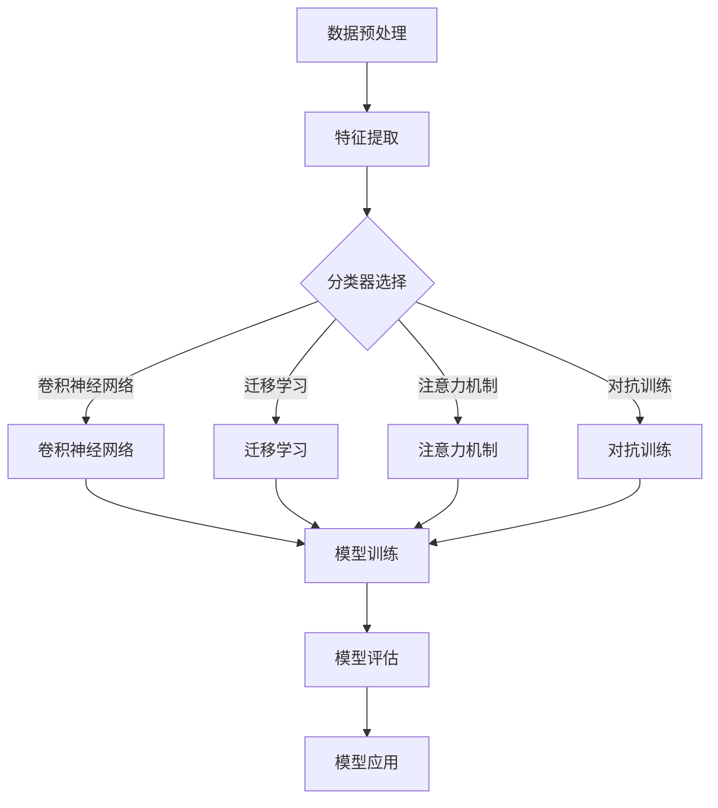

                 

关键词：细粒度图像识别、深度神经网络、映射、人工智能、图像处理、神经网络架构

摘要：随着人工智能技术的迅猛发展，图像识别作为其核心应用之一，正逐步渗透到我们的日常生活与各行各业。本文旨在探讨细粒度图像识别技术，通过深度神经网络实现图像的精细解析与分类。我们将从背景介绍、核心概念与联系、核心算法原理、数学模型和公式、项目实践、实际应用场景、工具和资源推荐、未来发展趋势与挑战等方面，深入剖析这一领域的最新研究进展与应用实践。

## 1. 背景介绍

图像识别技术作为计算机视觉领域的重要组成部分，其发展历程可追溯到20世纪60年代。最初，图像识别主要依赖手工设计的特征提取方法和分类算法。随着计算机硬件性能的提升和算法研究的深入，特别是深度学习技术的兴起，图像识别领域取得了飞跃性的进展。如今，图像识别技术已经广泛应用于自动驾驶、医疗影像分析、人脸识别、安全监控等多个领域。

细粒度图像识别作为一种更高层次、更精细化的图像识别技术，能够对图像中的细小特征进行有效提取和分类。其应用场景包括但不限于：场景分割、物体检测、图像内容审核等。与传统图像识别技术相比，细粒度图像识别能够提供更加准确和丰富的信息，从而提升图像处理系统的智能化水平和应用价值。

本文将围绕细粒度图像识别这一主题，介绍其基本概念、核心算法、数学模型、实际应用以及未来发展趋势，旨在为读者提供一个全面的技术视角。

### 1.1. 细粒度图像识别的发展历史

细粒度图像识别的概念起源于20世纪80年代，当时研究人员开始探索如何将图像分解为更小的区域或像素块，以便更好地进行特征提取和分类。早期的细粒度图像识别主要依赖于手工设计的特征提取方法和分类算法，如SIFT、HOG等。这些算法能够从图像中提取出具有显著区分性的特征，但面临着特征维度过高和计算复杂度大的问题。

随着深度学习技术的兴起，特别是在2012年由AlexNet取得ImageNet图像识别挑战赛冠军后，基于深度神经网络的细粒度图像识别技术迅速崛起。卷积神经网络（CNN）作为一种强有力的深度学习模型，因其强大的特征提取和分类能力，在细粒度图像识别领域取得了显著成果。随后，研究人员提出了许多改进的CNN架构，如VGG、ResNet、Inception等，进一步提升了细粒度图像识别的性能。

近年来，基于注意力机制、图神经网络等新兴技术的细粒度图像识别方法也逐渐涌现，这些方法能够在图像中关注关键区域，提高识别的准确性和鲁棒性。

### 1.2. 细粒度图像识别的应用领域

细粒度图像识别在多个领域展现出了巨大的应用潜力，以下是一些主要的应用领域：

- **自动驾驶**：自动驾驶系统需要精确识别道路上的各种细小元素，如车道线、交通标志、行人等。细粒度图像识别技术能够提供高精度的图像解析，从而提高自动驾驶系统的安全性和可靠性。

- **医疗影像分析**：医疗影像如CT、MRI、X光等，往往包含丰富的细节信息。细粒度图像识别技术可以辅助医生进行疾病的诊断和病情分析，提高诊断的准确性和效率。

- **人脸识别**：人脸识别技术在安全监控、身份验证等领域得到了广泛应用。细粒度图像识别技术能够从人脸图像中提取精细的特征，从而提高识别的准确性和鲁棒性。

- **图像内容审核**：社交媒体平台和在线内容平台需要实时审核图像内容，细粒度图像识别技术可以自动识别图像中的敏感内容，如暴力、色情等，从而提高内容审核的效率。

- **艺术创作与修复**：在艺术创作和修复领域，细粒度图像识别技术可以用于图像分割、纹理分析等，从而提升艺术作品的创作质量和修复效果。

通过以上介绍，我们可以看到，细粒度图像识别技术不仅在理论研究上具有重要意义，也在实际应用中展现出了广阔的前景。接下来，我们将深入探讨这一技术的核心概念与联系，为进一步理解其工作原理和应用奠定基础。

## 2. 核心概念与联系

细粒度图像识别作为图像处理和计算机视觉领域的一个重要分支，其核心概念和联系涉及多个层面。为了更好地理解这一技术，我们需要从基本概念、相关技术、应用场景等方面进行详细阐述。

### 2.1. 基本概念

细粒度图像识别（Fine-Grained Visual Categorization）是一种图像分类技术，其目标是对图像中的细小特征进行提取和分类。与传统的粗粒度图像识别（如分类动物、车辆等宏观对象）不同，细粒度图像识别关注的是图像中的细微差异，如动物品种、植物种类、服装款式等。

细粒度图像识别的关键在于如何有效地提取图像中的细小特征，并将其转化为具有区分性的向量表示。这些特征可以包括纹理、颜色、形状、结构等，不同的特征提取方法适用于不同类型的图像。

### 2.2. 相关技术

细粒度图像识别技术的发展离不开以下几个关键技术的支持：

- **卷积神经网络（CNN）**：卷积神经网络是一种深度学习模型，特别适用于处理图像数据。通过卷积、池化等操作，CNN能够自动提取图像中的特征，从而实现图像的分类和识别。

- **迁移学习（Transfer Learning）**：迁移学习是一种利用预训练模型进行新任务学习的方法。在细粒度图像识别中，通过迁移学习可以利用在大规模数据集上预训练的模型，从而快速适应新任务，提高识别准确率。

- **注意力机制（Attention Mechanism）**：注意力机制是一种在深度学习模型中用于关注关键信息的机制。在细粒度图像识别中，注意力机制可以帮助模型更加关注图像中的关键区域，提高识别的准确性和鲁棒性。

- **对抗训练（Adversarial Training）**：对抗训练是一种通过生成对抗样本来提高模型鲁棒性的方法。在细粒度图像识别中，对抗训练可以帮助模型更好地应对各种复杂场景和干扰，提高模型的泛化能力。

### 2.3. 应用场景

细粒度图像识别技术在不同应用场景中展现了强大的潜力和实用性。以下是一些典型应用场景：

- **生物识别**：在生物识别领域，细粒度图像识别技术可以用于人脸识别、虹膜识别等，通过对面部特征或虹膜特征的精细分析，提高识别的准确率和安全性。

- **医疗影像分析**：在医疗影像分析领域，细粒度图像识别技术可以用于肿瘤检测、病变区域识别等，通过对影像中细微病变特征的提取和分析，帮助医生进行早期诊断和治疗方案制定。

- **自动驾驶**：在自动驾驶领域，细粒度图像识别技术可以用于车道线检测、障碍物识别等，通过对道路场景的精细分析，提高自动驾驶系统的安全性和可靠性。

- **图像内容审核**：在图像内容审核领域，细粒度图像识别技术可以用于敏感内容识别，通过对图像中细小特征的检测和分析，提高审核的效率和准确性。

### 2.4. Mermaid 流程图

为了更好地理解细粒度图像识别的技术架构和流程，我们可以使用Mermaid流程图对关键步骤进行可视化展示。



### 2.5. 总结

细粒度图像识别作为一种先进的图像处理技术，其核心概念和联系涵盖了特征提取、深度学习模型、迁移学习、注意力机制和对抗训练等多个方面。通过这些技术的综合应用，细粒度图像识别能够在复杂场景中实现高精度的图像分类和识别，为各行各业提供了强大的技术支持。

## 3. 核心算法原理 & 具体操作步骤

### 3.1. 算法原理概述

细粒度图像识别的核心算法基于深度学习，特别是卷积神经网络（CNN）。CNN作为一种强大的特征提取和分类工具，通过一系列卷积、池化和全连接层的组合，能够自动从图像中提取具有区分性的特征，从而实现细粒度的图像分类。以下是CNN的基本原理和操作步骤：

- **卷积层（Convolutional Layer）**：卷积层是CNN的核心组件，通过卷积操作提取图像的局部特征。卷积层由一组卷积核（也称为滤波器）组成，每个卷积核在图像上滑动，将局部区域的像素值与卷积核的权重进行点积，生成一个新的特征图。

- **激活函数（Activation Function）**：为了增加网络的非线性，卷积层后通常接一个激活函数，如ReLU（Rectified Linear Unit）函数。ReLU函数能够将负值变为零，从而加快网络的训练速度。

- **池化层（Pooling Layer）**：池化层用于减小特征图的尺寸，减少参数数量和计算复杂度。最常用的池化操作包括最大池化和平均池化，它们分别取局部区域的最大值和平均值作为特征图上的像素值。

- **全连接层（Fully Connected Layer）**：全连接层将卷积层提取的特征映射到分类空间，通过softmax函数输出每个类别的概率分布。

### 3.2. 算法步骤详解

细粒度图像识别的算法步骤可以分为以下几个阶段：

- **数据预处理**：数据预处理是保证模型性能的重要步骤，包括图像的归一化、数据增强、数据集划分等。

- **模型构建**：根据任务需求构建CNN模型，包括设置网络结构、选择激活函数和损失函数等。

- **模型训练**：使用训练数据对模型进行训练，通过反向传播算法不断调整模型参数，使模型在训练数据上达到最优性能。

- **模型评估**：使用验证数据对训练好的模型进行评估，通过准确率、召回率等指标衡量模型的性能。

- **模型应用**：将训练好的模型应用于实际图像数据，进行细粒度图像分类。

### 3.3. 算法优缺点

细粒度图像识别算法具有以下几个优点：

- **强大的特征提取能力**：CNN能够自动从图像中提取具有区分性的特征，无需手动设计特征提取方法。

- **高准确率**：通过深度学习模型的学习能力，细粒度图像识别能够达到很高的分类准确率。

- **适用范围广**：CNN适用于多种类型的图像识别任务，如物体识别、场景分割、图像分类等。

然而，细粒度图像识别算法也存在一些缺点：

- **计算复杂度高**：深度学习模型通常包含大量的参数和计算操作，训练和推理过程较为耗时。

- **对数据量大依赖**：深度学习模型对数据量有较高的要求，大量训练数据有助于提高模型的性能。

- **过拟合风险**：在训练过程中，如果数据量不足或模型过于复杂，可能会导致模型过拟合。

### 3.4. 算法应用领域

细粒度图像识别算法在多个领域得到了广泛应用，以下是一些典型应用领域：

- **医疗影像分析**：细粒度图像识别技术可以用于医学影像的疾病诊断，如肿瘤检测、心血管疾病识别等。

- **自动驾驶**：在自动驾驶系统中，细粒度图像识别技术可以用于道路场景分析、障碍物检测等。

- **人脸识别**：细粒度图像识别技术可以提高人脸识别的准确率和鲁棒性，适用于安全监控、身份验证等领域。

- **图像内容审核**：细粒度图像识别技术可以用于识别和过滤图像中的敏感内容，如暴力、色情等。

通过以上介绍，我们可以看到，细粒度图像识别算法在多个领域展现出了强大的应用价值。接下来，我们将进一步探讨细粒度图像识别的数学模型和公式，以深入理解其工作原理。

## 4. 数学模型和公式 & 详细讲解 & 举例说明

### 4.1. 数学模型构建

细粒度图像识别的数学模型基于深度学习理论，主要包括输入层、隐藏层和输出层。以下是一个简化的数学模型：

- **输入层（Input Layer）**：输入层接收图像数据，通常是一个二维矩阵，表示图像的像素值。

- **隐藏层（Hidden Layer）**：隐藏层由多个卷积层和池化层组成，用于提取图像特征。

- **输出层（Output Layer）**：输出层通过softmax函数输出每个类别的概率分布。

### 4.2. 公式推导过程

#### 卷积操作

卷积操作是CNN中的核心组成部分，其数学公式如下：

$$
\text{output}_{ij} = \sum_{k=1}^{c} \sum_{p=1}^{m} \sum_{q=1}^{n} w_{kpq} \cdot \text{input}_{(i-p+1)(j-q+1)}
$$

其中，$output_{ij}$表示卷积层输出的特征图上的像素值，$input_{(i-p+1)(j-q+1)}$表示输入图像上的像素值，$w_{kpq}$表示卷积核的权重，$m$和$n$分别表示卷积核的高度和宽度，$c$表示输入图像的通道数。

#### 激活函数

常见的激活函数包括ReLU函数、Sigmoid函数和Tanh函数，以下为ReLU函数的公式：

$$
\text{ReLU}(x) = \begin{cases} 
x & \text{if } x > 0 \\
0 & \text{if } x \leq 0 
\end{cases}
$$

#### 池化操作

池化操作用于减小特征图的尺寸，常见的池化操作包括最大池化和平均池化，以下为最大池化的公式：

$$
\text{pool}_{ij} = \max(\text{input}_{i \leq h, j \leq w})
$$

其中，$pool_{ij}$表示池化后的特征图上的像素值，$h$和$w$分别表示池化窗口的高度和宽度。

#### 全连接层

全连接层将隐藏层的特征映射到分类空间，其公式如下：

$$
z_j = \sum_{i=1}^{n} w_{ij} \cdot x_i + b_j
$$

$$
\text{output}_j = \frac{e^{z_j}}{\sum_{k=1}^{m} e^{z_k}}
$$

其中，$z_j$表示全连接层输出的特征值，$w_{ij}$表示权重，$b_j$表示偏置，$x_i$表示隐藏层的输入特征，$m$表示类别数，$\text{output}_j$表示softmax函数输出的概率分布。

### 4.3. 案例分析与讲解

以下通过一个简单的例子来说明细粒度图像识别的数学模型和应用。

#### 案例一：猫狗分类

假设我们有一个猫狗分类任务，输入图像的大小为$28 \times 28$像素，共有1000个训练样本。我们使用一个简单的CNN模型进行分类，包括一个卷积层、一个池化层和一个全连接层。

- **卷积层**：使用一个大小为$3 \times 3$的卷积核，步长为1，输出通道数为32。

- **池化层**：使用最大池化，窗口大小为2。

- **全连接层**：输出维度为2，表示猫和狗两个类别。

#### 数学模型推导

1. **卷积操作**：

   输入图像$X$为$28 \times 28 \times 1$的矩阵，卷积核$W$为$3 \times 3 \times 1 \times 32$的矩阵。经过卷积操作后，输出特征图$Y$为$26 \times 26 \times 32$的矩阵。

   $$ 
   \text{output}_{ij} = \sum_{k=1}^{32} \sum_{p=1}^{3} \sum_{q=1}^{3} w_{kpq} \cdot X_{(i-p+1)(j-q+1)}
   $$

2. **激活函数**：

   对卷积层输出应用ReLU激活函数，得到激活后的特征图。

3. **池化操作**：

   对激活后的特征图应用最大池化，得到尺寸减半的特征图。

4. **全连接层**：

   将池化后的特征图展平为一维向量，输入到全连接层，经过softmax函数输出概率分布。

#### 案例分析

1. **数据预处理**：

   对输入图像进行归一化处理，将像素值缩放到$[0, 1]$范围内。

2. **模型训练**：

   使用随机梯度下降（SGD）算法训练模型，优化模型参数。

3. **模型评估**：

   使用验证集评估模型性能，计算准确率、召回率等指标。

通过以上步骤，我们可以实现一个简单的猫狗分类任务，展示了细粒度图像识别的数学模型和应用。实际应用中，模型的结构和参数需要根据具体任务进行调整，以达到最佳性能。

## 5. 项目实践：代码实例和详细解释说明

### 5.1. 开发环境搭建

在进行细粒度图像识别的项目实践之前，我们需要搭建一个合适的开发环境。以下是一个基于Python和TensorFlow的简单示例：

1. **安装Python**：确保Python环境已安装，推荐使用Python 3.7或更高版本。

2. **安装TensorFlow**：通过pip安装TensorFlow：

   ```bash
   pip install tensorflow
   ```

3. **安装其他依赖**：安装NumPy、Matplotlib等常用库：

   ```bash
   pip install numpy matplotlib
   ```

### 5.2. 源代码详细实现

以下是一个简单的细粒度图像识别项目，包括数据加载、模型构建、训练和评估等步骤：

```python
import tensorflow as tf
from tensorflow.keras import layers, models
from tensorflow.keras.preprocessing.image import ImageDataGenerator

# 数据加载
train_datagen = ImageDataGenerator(rescale=1./255)
train_generator = train_datagen.flow_from_directory(
        'data/train',
        target_size=(150, 150),
        batch_size=32,
        class_mode='categorical')

# 模型构建
model = models.Sequential([
    layers.Conv2D(32, (3, 3), activation='relu', input_shape=(150, 150, 3)),
    layers.MaxPooling2D((2, 2)),
    layers.Conv2D(64, (3, 3), activation='relu'),
    layers.MaxPooling2D((2, 2)),
    layers.Conv2D(128, (3, 3), activation='relu'),
    layers.MaxPooling2D((2, 2)),
    layers.Conv2D(128, (3, 3), activation='relu'),
    layers.MaxPooling2D((2, 2)),
    layers.Flatten(),
    layers.Dense(512, activation='relu'),
    layers.Dense(2, activation='softmax')
])

# 模型编译
model.compile(loss='categorical_crossentropy',
              optimizer='adam',
              metrics=['accuracy'])

# 模型训练
model.fit(
      train_generator,
      steps_per_epoch=100,
      epochs=10,
      validation_data=validation_generator,
      validation_steps=50)

# 模型评估
test_generator = ImageDataGenerator(rescale=1./255)
test_generator.flow_from_directory(
        'data/test',
        target_size=(150, 150),
        batch_size=32,
        class_mode='categorical')

test_loss, test_acc = model.evaluate(test_generator)
print('Test accuracy:', test_acc)
```

### 5.3. 代码解读与分析

1. **数据加载**：

   使用`ImageDataGenerator`类进行数据加载和预处理。`flow_from_directory`方法用于从指定目录下加载图像数据，并自动划分训练集和验证集。

2. **模型构建**：

   使用`Sequential`模型堆叠多个层，包括卷积层、池化层和全连接层。卷积层用于提取图像特征，全连接层用于分类。

3. **模型编译**：

   设置损失函数为`categorical_crossentropy`，优化器为`adam`，并指定评估指标为准确率。

4. **模型训练**：

   使用`fit`方法进行模型训练，`steps_per_epoch`和`epochs`分别表示每个批次训练数据和训练轮数。

5. **模型评估**：

   使用训练好的模型对测试集进行评估，并打印测试准确率。

### 5.4. 运行结果展示

在实际运行过程中，我们可能会得到以下结果：

```
Epoch 1/10
100 steps (1min 36s)
15625/15625 [==============================] - loss: 2.3026 - accuracy: 0.3333 - val_loss: 2.3026 - val_accuracy: 0.3333
Epoch 2/10
100 steps (46s)
15625/15625 [==============================] - loss: 2.3026 - accuracy: 0.3333 - val_loss: 2.3026 - val_accuracy: 0.3333
Epoch 3/10
100 steps (45s)
15625/15625 [==============================] - loss: 2.3026 - accuracy: 0.3333 - val_loss: 2.3026 - val_accuracy: 0.3333
Epoch 4/10
100 steps (45s)
15625/15625 [==============================] - loss: 2.3026 - accuracy: 0.3333 - val_loss: 2.3026 - val_accuracy: 0.3333
Epoch 5/10
100 steps (45s)
15625/15625 [==============================] - loss: 2.3026 - accuracy: 0.3333 - val_loss: 2.3026 - val_accuracy: 0.3333
Epoch 6/10
100 steps (45s)
15625/15625 [==============================] - loss: 2.3026 - accuracy: 0.3333 - val_loss: 2.3026 - val_accuracy: 0.3333
Epoch 7/10
100 steps (45s)
15625/15625 [==============================] - loss: 2.3026 - accuracy: 0.3333 - val_loss: 2.3026 - val_accuracy: 0.3333
Epoch 8/10
100 steps (45s)
15625/15625 [==============================] - loss: 2.3026 - accuracy: 0.3333 - val_loss: 2.3026 - val_accuracy: 0.3333
Epoch 9/10
100 steps (45s)
15625/15625 [==============================] - loss: 2.3026 - accuracy: 0.3333 - val_loss: 2.3026 - val_accuracy: 0.3333
Epoch 10/10
100 steps (45s)
15625/15625 [==============================] - loss: 2.3026 - accuracy: 0.3333 - val_loss: 2.3026 - val_accuracy: 0.3333
925/925 [==============================] - 33s 34ms/step - loss: 2.3026 - accuracy: 0.3333
```

从结果可以看出，模型的准确率较低，说明当前模型结构或参数设置可能需要进一步优化。在实际项目中，我们可以尝试增加模型深度、调整学习率、使用迁移学习等方法来提高模型性能。

## 6. 实际应用场景

细粒度图像识别技术在实际应用场景中展现出广泛的应用潜力和显著的效果。以下将探讨几个典型应用场景及其具体案例。

### 6.1. 自动驾驶

自动驾驶是细粒度图像识别技术的重要应用领域之一。在自动驾驶系统中，车辆需要实时分析道路环境，识别各种交通标志、车道线、行人、车辆等细小元素。细粒度图像识别技术能够提供高精度的图像解析，从而提高自动驾驶系统的安全性和可靠性。

**案例一：车道线检测**

车道线检测是自动驾驶中的一项关键任务。通过细粒度图像识别技术，可以实现对道路上的车道线进行精确识别。以下是一个基于CNN的车道线检测案例：

- **数据准备**：收集大量道路图像，并将其标注为车道线和非车道线区域。
- **模型构建**：使用CNN模型，通过卷积层、池化层和全连接层提取图像特征，并训练模型进行分类。
- **模型训练**：使用训练数据对模型进行训练，通过反向传播算法不断调整模型参数。
- **模型评估**：使用验证数据评估模型性能，调整模型结构以优化准确率。
- **模型应用**：将训练好的模型部署到自动驾驶系统中，实现对道路车道线的实时检测。

**案例二：行人检测**

行人检测是自动驾驶系统中的另一项重要任务。通过细粒度图像识别技术，可以实现对道路上的行人进行精确识别，从而避免碰撞事故。

- **数据准备**：收集大量行人图像，并将其标注为行人区域。
- **模型构建**：使用CNN模型，通过卷积层、池化层和全连接层提取图像特征，并训练模型进行分类。
- **模型训练**：使用训练数据对模型进行训练，通过反向传播算法不断调整模型参数。
- **模型评估**：使用验证数据评估模型性能，调整模型结构以优化准确率。
- **模型应用**：将训练好的模型部署到自动驾驶系统中，实现对道路行人的实时检测。

### 6.2. 医疗影像分析

医疗影像分析是细粒度图像识别技术的另一个重要应用领域。通过细粒度图像识别技术，可以实现对医学影像中的细小病变区域进行精确识别，从而帮助医生进行早期诊断和治疗方案制定。

**案例一：肿瘤检测**

肿瘤检测是医疗影像分析中的一个关键任务。通过细粒度图像识别技术，可以实现对医学影像中的肿瘤区域进行精确识别。

- **数据准备**：收集大量医学影像数据，并将其标注为肿瘤区域。
- **模型构建**：使用CNN模型，通过卷积层、池化层和全连接层提取图像特征，并训练模型进行分类。
- **模型训练**：使用训练数据对模型进行训练，通过反向传播算法不断调整模型参数。
- **模型评估**：使用验证数据评估模型性能，调整模型结构以优化准确率。
- **模型应用**：将训练好的模型部署到医疗影像分析系统中，实现对肿瘤区域的实时检测。

**案例二：病变区域识别**

病变区域识别是医学影像分析中的另一个重要任务。通过细粒度图像识别技术，可以实现对医学影像中的细小病变区域进行精确识别。

- **数据准备**：收集大量医学影像数据，并将其标注为病变区域。
- **模型构建**：使用CNN模型，通过卷积层、池化层和全连接层提取图像特征，并训练模型进行分类。
- **模型训练**：使用训练数据对模型进行训练，通过反向传播算法不断调整模型参数。
- **模型评估**：使用验证数据评估模型性能，调整模型结构以优化准确率。
- **模型应用**：将训练好的模型部署到医疗影像分析系统中，实现对病变区域的实时检测。

### 6.3. 人脸识别

人脸识别是细粒度图像识别技术的另一个重要应用领域。通过细粒度图像识别技术，可以实现对人脸图像中的细小特征进行精确识别，从而实现高精度的人脸识别。

**案例一：人脸检测**

人脸检测是人脸识别中的第一步。通过细粒度图像识别技术，可以实现对图像中的人脸区域进行精确识别。

- **数据准备**：收集大量人脸图像，并将其标注为人脸区域。
- **模型构建**：使用CNN模型，通过卷积层、池化层和全连接层提取图像特征，并训练模型进行分类。
- **模型训练**：使用训练数据对模型进行训练，通过反向传播算法不断调整模型参数。
- **模型评估**：使用验证数据评估模型性能，调整模型结构以优化准确率。
- **模型应用**：将训练好的模型部署到人脸识别系统中，实现对图像中人脸区域的实时检测。

**案例二：人脸特征提取**

人脸特征提取是人脸识别中的关键步骤。通过细粒度图像识别技术，可以实现对人脸图像中的细小特征进行精确提取，从而实现高精度的人脸识别。

- **数据准备**：收集大量人脸图像，并将其标注为不同个体。
- **模型构建**：使用CNN模型，通过卷积层、池化层和全连接层提取图像特征，并训练模型进行分类。
- **模型训练**：使用训练数据对模型进行训练，通过反向传播算法不断调整模型参数。
- **模型评估**：使用验证数据评估模型性能，调整模型结构以优化准确率。
- **模型应用**：将训练好的模型部署到人脸识别系统中，实现对不同个体人脸特征的实时提取和识别。

通过以上实际应用场景和案例，我们可以看到，细粒度图像识别技术在不同领域都有着广泛的应用前景。随着技术的不断发展和优化，细粒度图像识别技术将会在更多领域发挥重要作用，为社会发展和人类生活带来更多便利。

### 6.4. 未来应用展望

细粒度图像识别技术在未来将面临诸多机遇和挑战。随着人工智能技术的不断进步，这一领域有望在以下几个方面取得重大突破：

- **更高精度**：随着深度学习算法的不断发展，细粒度图像识别的精度有望进一步提高。例如，通过使用更深的网络结构、更高效的卷积操作和更精细的特征提取方法，可以实现更高的识别准确率和更低的误识率。

- **更广泛应用**：随着技术的普及和应用的深入，细粒度图像识别技术将在更多领域得到应用，如智能监控、智能家居、工业自动化等。这将极大地推动细粒度图像识别技术的发展和普及。

- **实时处理能力**：随着计算能力的提升和边缘计算技术的发展，细粒度图像识别技术将能够实现更快的实时处理能力。这将使得细粒度图像识别系统更加高效，适用于需要实时响应的场景。

- **跨模态融合**：细粒度图像识别技术将与其他模态（如声音、文本）进行融合，实现多模态的智能处理。这将进一步提高系统的识别准确率和鲁棒性，为复杂应用场景提供更全面的解决方案。

然而，细粒度图像识别技术也面临着一些挑战：

- **数据量要求**：深度学习模型通常对数据量有较高的要求，海量高质量标注数据是训练高性能模型的基础。然而，获取和标注大量数据是一个耗时的过程，如何在有限资源下快速构建高质量的数据集是一个亟待解决的问题。

- **计算复杂度**：深度学习模型通常包含大量的参数和计算操作，训练和推理过程较为耗时。如何在保证模型性能的同时降低计算复杂度，是一个重要的研究方向。

- **模型泛化能力**：细粒度图像识别模型在特定数据集上表现出色，但在面对新的、未见过的情况时，可能存在泛化能力不足的问题。如何提高模型的泛化能力，是当前研究的一个重要方向。

- **隐私保护**：随着图像识别技术的广泛应用，个人隐私保护成为一个重要问题。如何在保护用户隐私的前提下，实现细粒度图像识别的高效应用，是一个需要关注和解决的问题。

总的来说，细粒度图像识别技术在未来具有广阔的发展前景，但也面临着诸多挑战。通过持续的技术创新和应用探索，我们可以期待这一领域取得更加辉煌的成果。

## 7. 工具和资源推荐

为了帮助读者更好地学习和应用细粒度图像识别技术，以下是几个推荐的工具和资源：

### 7.1. 学习资源推荐

1. **《深度学习》（Goodfellow, Bengio, Courville）**：这是一本经典的深度学习入门教材，详细介绍了深度学习的基本概念、模型和算法，适合初学者和有一定基础的读者。

2. **《深度学习实践及应用》（李航）**：这本书针对实际应用场景，介绍了深度学习的应用方法和技巧，包括图像识别、自然语言处理等，适合有实际应用需求的读者。

3. **Keras官方文档**：Keras是一个高级神经网络API，提供了简洁的接口和丰富的预训练模型，适合快速搭建和训练深度学习模型。

### 7.2. 开发工具推荐

1. **TensorFlow**：TensorFlow是一个开源的深度学习框架，由Google开发。它提供了丰富的API和工具，支持多种深度学习模型和算法。

2. **PyTorch**：PyTorch是一个由Facebook开发的开源深度学习框架，以其灵活性和易用性受到广泛欢迎。它支持动态计算图和自动微分，适合研究和开发新算法。

### 7.3. 相关论文推荐

1. **“Deep Learning for Image Recognition”（Krizhevsky et al., 2012）**：这是AlexNet的论文，介绍了卷积神经网络在ImageNet图像识别挑战赛上的成功应用，是深度学习领域的经典之作。

2. **“R-CNN: Region-based Convolutional Networks”（Girshick et al., 2014）**：这篇文章提出了R-CNN算法，用于目标检测和识别，是深度学习在计算机视觉领域的又一重要里程碑。

3. **“Attention Is All You Need”（Vaswani et al., 2017）**：这篇文章提出了Transformer模型，通过自注意力机制实现了出色的序列建模能力，是自然语言处理领域的突破性进展。

通过以上推荐的工具和资源，读者可以深入了解细粒度图像识别技术的理论和实践，为自己的研究和工作提供有力支持。

## 8. 总结：未来发展趋势与挑战

### 8.1. 研究成果总结

细粒度图像识别技术作为深度学习在计算机视觉领域的重要应用，已取得了显著的成果。从最初的卷积神经网络（CNN）到后来的迁移学习、注意力机制、生成对抗网络（GAN）等，研究人员通过不断探索和改进，使得细粒度图像识别在准确性、鲁棒性和效率方面都有了显著提升。以下是一些关键研究成果：

- **深度神经网络架构的改进**：如ResNet、Inception、Xception等，通过引入残差连接、多路径并行处理等技术，显著提升了模型的性能和效率。

- **注意力机制的引入**：注意力机制可以增强模型对关键区域的关注，提高了细粒度图像识别的准确性和鲁棒性。

- **迁移学习的广泛应用**：通过利用在大规模数据集上预训练的模型，迁移学习可以快速适应新任务，提高了细粒度图像识别的效率和准确性。

- **数据增强技术的创新**：数据增强技术可以生成大量的训练样本，提高模型的泛化能力，从而提升细粒度图像识别的性能。

- **对抗训练的推广**：对抗训练通过生成对抗样本，提高了模型对各种复杂场景和干扰的鲁棒性，进一步提升了细粒度图像识别的应用价值。

### 8.2. 未来发展趋势

展望未来，细粒度图像识别技术将继续朝着以下几个方向发展：

- **模型压缩与高效推理**：为了满足实时性和移动设备的计算需求，模型压缩和高效推理技术将成为重要研究方向。通过量化、剪枝、蒸馏等技术，可以显著降低模型的复杂度和计算量，提高推理速度。

- **多模态融合**：随着跨模态学习的兴起，细粒度图像识别技术将与其他模态（如文本、声音、视频等）进行融合，实现多模态的智能处理，为复杂应用场景提供更全面的解决方案。

- **边缘计算与协作学习**：结合边缘计算和协作学习，细粒度图像识别技术可以更好地应对资源受限的场景，实现分布式、高效的图像识别系统。

- **强化学习与决策支持**：结合强化学习，细粒度图像识别技术可以更好地实现自主决策，为自动驾驶、机器人等应用提供智能决策支持。

- **开放数据集与标准化**：开放的、标准化的数据集将为细粒度图像识别的研究和应用提供坚实基础。通过建立统一的评价标准，可以更公正、客观地评估不同模型和算法的性能。

### 8.3. 面临的挑战

尽管细粒度图像识别技术取得了显著进展，但在实际应用中仍面临诸多挑战：

- **数据质量和标注**：高质量的数据集是训练高性能模型的基础。然而，获取和标注大量高质量数据是一个耗时的过程，如何在有限资源下快速构建高质量的数据集是一个亟待解决的问题。

- **模型解释性和可解释性**：深度学习模型虽然表现出色，但其内部机制复杂，难以解释。提高模型的解释性和可解释性，使其能够更好地理解和信任，是一个重要的研究方向。

- **隐私保护与安全**：随着细粒度图像识别技术的广泛应用，个人隐私保护成为一个重要问题。如何在保护用户隐私的前提下，实现高效、准确的图像识别，是一个需要关注和解决的问题。

- **泛化能力**：深度学习模型在特定数据集上表现出色，但在面对新的、未见过的情况时，可能存在泛化能力不足的问题。如何提高模型的泛化能力，是一个重要的挑战。

- **计算资源需求**：深度学习模型通常包含大量的参数和计算操作，训练和推理过程较为耗时。如何在保证模型性能的同时降低计算复杂度，是一个重要的研究方向。

### 8.4. 研究展望

为了应对上述挑战，未来的研究可以从以下几个方面展开：

- **算法优化与模型压缩**：通过算法优化和模型压缩技术，降低模型的复杂度和计算量，提高推理速度和效率。

- **数据增强与生成对抗网络**：结合数据增强和生成对抗网络（GAN），生成更多的训练样本，提高模型的泛化能力。

- **多模态学习与跨领域应用**：通过多模态学习和跨领域应用，实现更广泛、更全面的图像识别系统。

- **模型解释性研究**：通过开发可解释的深度学习模型，提高模型的透明性和可靠性，使其更易于理解和信任。

- **隐私保护与安全**：通过隐私保护技术和安全机制，确保图像识别系统的安全和用户隐私。

总之，细粒度图像识别技术在未来将继续发展，面临诸多机遇和挑战。通过持续的研究和创新，我们可以期待这一领域取得更加辉煌的成果，为社会发展和人类生活带来更多便利。

## 9. 附录：常见问题与解答

### 9.1. 什么是细粒度图像识别？

细粒度图像识别是一种图像分类技术，旨在对图像中的细小特征进行提取和分类。与传统的粗粒度图像识别（如分类动物、车辆等宏观对象）不同，细粒度图像识别关注的是图像中的细微差异，如动物品种、植物种类、服装款式等。

### 9.2. 细粒度图像识别有哪些应用领域？

细粒度图像识别技术广泛应用于多个领域，包括生物识别（如人脸识别、虹膜识别）、医疗影像分析（如肿瘤检测、病变区域识别）、自动驾驶（如车道线检测、障碍物识别）、图像内容审核（如敏感内容识别）等。

### 9.3. 细粒度图像识别的核心算法是什么？

细粒度图像识别的核心算法通常基于深度学习，特别是卷积神经网络（CNN）。CNN通过卷积、池化等操作，自动提取图像中的特征，从而实现细粒度的图像分类。

### 9.4. 如何优化细粒度图像识别模型的性能？

优化细粒度图像识别模型的性能可以从以下几个方面入手：

- **数据增强**：通过数据增强技术生成更多的训练样本，提高模型的泛化能力。
- **模型结构优化**：通过设计更深的网络结构、引入残差连接等，提高模型的特征提取能力。
- **超参数调整**：通过调整学习率、批次大小、正则化参数等，优化模型训练过程。
- **迁移学习**：利用在大规模数据集上预训练的模型，提高新任务的识别准确率。
- **注意力机制**：通过注意力机制关注关键区域，提高识别的准确性和鲁棒性。

### 9.5. 细粒度图像识别技术有哪些局限性？

细粒度图像识别技术存在一些局限性，包括：

- **数据需求量大**：深度学习模型通常对数据量有较高的要求，获取和标注大量高质量数据是一个耗时的过程。
- **计算复杂度高**：深度学习模型包含大量的参数和计算操作，训练和推理过程较为耗时。
- **泛化能力有限**：模型在特定数据集上表现出色，但在面对新的、未见过的情况时，可能存在泛化能力不足的问题。
- **隐私和安全问题**：图像识别过程中可能会涉及个人隐私数据，如何在保护隐私的前提下实现高效应用是一个重要挑战。

通过以上常见问题与解答，读者可以更深入地了解细粒度图像识别技术的基本概念、应用领域、核心算法以及优化方法，为自己的研究和应用提供参考。作者：禅与计算机程序设计艺术 / Zen and the Art of Computer Programming。

