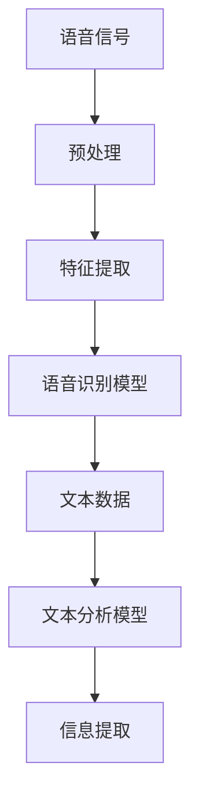

                 

关键词：自然语言处理、语音识别、文本分析、映射、算法原理、应用领域

> 摘要：本文深入探讨了语音到文本的自然语言理解过程，阐述了语音识别与文本分析的映射原理。通过分析核心算法、数学模型和实际应用案例，本文揭示了自然语言处理的本质及其对未来技术发展的深远影响。

## 1. 背景介绍

随着人工智能技术的不断发展，自然语言处理（Natural Language Processing，NLP）已成为计算机科学与人工智能领域的重要研究方向。NLP旨在让计算机理解和处理人类语言，实现人机交互的智能化。在NLP中，语音到文本的转换（Voice-to-Text，V2T）是一个关键环节。语音识别技术通过将语音信号转化为文本，使得计算机能够理解用户的语音指令，为智能语音助手、语音搜索和自动字幕生成等应用提供了基础。

然而，语音到文本的转换并非简单的信号处理过程，它涉及到对语音信号的解析、语音特征的提取、语言的语义理解等多个层面。因此，深入研究语音到文本的自然语言理解过程，不仅有助于提升语音识别技术的准确率和效率，还能为其他NLP任务提供有力支持。

本文将从核心概念、算法原理、数学模型、实际应用等方面对语音到文本的自然语言理解过程进行详细探讨，旨在为相关领域的研究者和开发者提供有价值的参考。

## 2. 核心概念与联系

### 2.1 语音识别（Speech Recognition）

语音识别是一种将语音信号转换为文本的技术。其基本原理是通过信号处理技术提取语音信号的特征，然后利用统计模型或深度学习模型对特征进行建模，从而实现语音到文本的转换。

### 2.2 文本分析（Text Analysis）

文本分析是一种对文本数据进行分析和处理的技术，旨在提取文本中的信息、模式或知识。文本分析包括词频统计、情感分析、主题建模、实体识别等任务。

### 2.3 映射原理

语音识别与文本分析之间的映射原理在于，语音信号和文本数据之间存在一定的对应关系。通过语音识别技术，可以将语音信号映射为对应的文本数据，而通过文本分析技术，可以对文本数据进行分析和处理，提取出有用信息。这种映射关系使得语音到文本的自然语言理解过程成为可能。

### 2.4 Mermaid 流程图

以下是一个简化的Mermaid流程图，展示了语音到文本的自然语言理解过程的几个关键环节：



## 3. 核心算法原理 & 具体操作步骤

### 3.1 算法原理概述

语音识别算法主要分为两大类：统计模型和深度学习模型。

1. **统计模型**：基于概率模型和隐马尔可夫模型（HMM）等技术，通过训练大量语音数据，建立语音信号与文本之间的概率分布关系。常见的统计模型包括高斯混合模型（GMM）和隐马尔可夫模型（HMM）。

2. **深度学习模型**：基于神经网络技术，通过训练大量语音数据，自动学习语音信号和文本之间的映射关系。常见的深度学习模型包括卷积神经网络（CNN）和循环神经网络（RNN）。

### 3.2 算法步骤详解

1. **语音信号预处理**：包括去除噪声、增强语音信号、归一化等操作，以提高语音识别的准确率。

2. **特征提取**：将预处理后的语音信号转化为特征向量，常用的特征包括梅尔频率倒谱系数（MFCC）、线性预测编码（LPC）等。

3. **模型训练**：利用语音数据和对应的文本标签，训练语音识别模型。对于统计模型，主要使用最大似然估计（MLE）等方法；对于深度学习模型，主要使用反向传播（BP）算法等。

4. **语音识别**：将特征向量输入到训练好的模型中，通过模型输出对应的文本数据。

5. **文本分析**：对识别出的文本数据进行分析，提取有用信息。常用的文本分析技术包括词频统计、情感分析、命名实体识别等。

### 3.3 算法优缺点

1. **统计模型**：

   - 优点：计算复杂度低，对噪声的鲁棒性强。
   - 缺点：准确率相对较低，难以应对长语音序列。

2. **深度学习模型**：

   - 优点：准确率高，能够应对长语音序列。
   - 缺点：计算复杂度高，对噪声的鲁棒性较差。

### 3.4 算法应用领域

1. **智能语音助手**：如苹果的Siri、谷歌的Google Assistant等，通过语音识别技术实现用户与智能设备的交互。
2. **语音搜索**：如百度语音搜索、腾讯语音搜索等，通过语音识别技术实现语音输入的搜索功能。
3. **自动字幕生成**：如YouTube的自动字幕生成、Netflix的自动字幕生成等，通过语音识别技术实现视频内容的字幕生成。

## 4. 数学模型和公式 & 详细讲解 & 举例说明

### 4.1 数学模型构建

语音识别中的数学模型主要包括概率模型和神经网络模型。

1. **概率模型**：

   - 高斯混合模型（GMM）：假设每个音素都由多个高斯分布组成，通过最大似然估计（MLE）训练模型。
   - 隐马尔可夫模型（HMM）：将语音信号视为时间序列，通过状态转移矩阵和输出概率矩阵描述语音信号和文本之间的映射关系。

2. **神经网络模型**：

   - 卷积神经网络（CNN）：通过卷积操作提取语音信号的特征，实现语音到文本的映射。
   - 循环神经网络（RNN）：通过循环结构处理长语音序列，实现语音到文本的映射。

### 4.2 公式推导过程

以高斯混合模型（GMM）为例，推导其最大似然估计（MLE）过程。

假设有 $N$ 个语音数据点 $x_1, x_2, \ldots, x_N$，每个数据点都由 $M$ 个高斯分布组成，即：

$$
p(x|\theta) = \prod_{i=1}^{N} \prod_{j=1}^{M} \mathcal{N}(x_i|\mu_{ij}, \Sigma_{ij})
$$

其中，$\theta = (\mu_1, \Sigma_1, \mu_2, \Sigma_2, \ldots, \mu_M, \Sigma_M)$ 是模型参数，$\mathcal{N}(\cdot|\mu, \Sigma)$ 表示高斯分布函数。

为了求解模型参数 $\theta$，我们需要最大化似然函数：

$$
L(\theta) = \prod_{i=1}^{N} \prod_{j=1}^{M} \mathcal{N}(x_i|\mu_{ij}, \Sigma_{ij})
$$

对似然函数取对数，得到对数似然函数：

$$
\ell(\theta) = \sum_{i=1}^{N} \sum_{j=1}^{M} \ln \mathcal{N}(x_i|\mu_{ij}, \Sigma_{ij})
$$

为了求解 $\theta$，我们需要对 $\ell(\theta)$ 求导并令导数为零，即：

$$
\frac{\partial \ell(\theta)}{\partial \theta} = 0
$$

通过求解上述方程组，可以得到模型参数 $\theta$ 的估计值。

### 4.3 案例分析与讲解

假设我们有一个包含 10 个语音数据点的数据集，每个数据点由 3 个高斯分布组成。通过最大似然估计（MLE）方法，我们可以训练一个高斯混合模型（GMM）。

首先，我们计算每个数据点的似然函数值：

$$
L(\theta) = \prod_{i=1}^{10} \prod_{j=1}^{3} \mathcal{N}(x_i|\mu_{ij}, \Sigma_{ij})
$$

然后，我们对似然函数取对数，得到对数似然函数：

$$
\ell(\theta) = \sum_{i=1}^{10} \sum_{j=1}^{3} \ln \mathcal{N}(x_i|\mu_{ij}, \Sigma_{ij})
$$

接下来，我们对 $\ell(\theta)$ 求导并令导数为零，求解模型参数 $\theta$。

通过求解上述方程组，我们可以得到高斯混合模型（GMM）的参数，从而实现语音信号到文本数据的映射。

## 5. 项目实践：代码实例和详细解释说明

### 5.1 开发环境搭建

在开始项目实践之前，我们需要搭建一个适合开发语音识别和文本分析项目的环境。以下是一个简单的开发环境搭建指南：

1. 安装 Python 3.7 或更高版本。
2. 安装必要的 Python 包，如 NumPy、Pandas、Scikit-learn、TensorFlow 等。
3. 安装语音识别工具，如 Kaldi 或 PyTorch 的语音识别库。
4. 准备语音数据集和文本数据集，用于训练和测试语音识别模型。

### 5.2 源代码详细实现

以下是一个简单的 Python 代码示例，用于实现语音到文本的自然语言理解过程。

```python
import numpy as np
import kaldiio
import torch
import torch.nn as nn
import torch.optim as optim

# 语音信号预处理
def preprocess_signal(signal):
    # 去除噪声、增强语音信号、归一化等操作
    # ...
    return processed_signal

# 特征提取
def extract_features(signal):
    # 提取梅尔频率倒谱系数（MFCC）等特征
    # ...
    return feature_vector

# 语音识别模型
class SpeechRecognitionModel(nn.Module):
    def __init__(self):
        super(SpeechRecognitionModel, self).__init__()
        # 定义模型结构
        # ...

    def forward(self, x):
        # 前向传播
        # ...
        return output

# 文本分析模型
class TextAnalysisModel(nn.Module):
    def __init__(self):
        super(TextAnalysisModel, self).__init__()
        # 定义模型结构
        # ...

    def forward(self, x):
        # 前向传播
        # ...
        return output

# 训练模型
def train_model(model, train_loader, criterion, optimizer):
    model.train()
    for batch_idx, (data, target) in enumerate(train_loader):
        # 前向传播
        output = model(data)
        # 计算损失
        loss = criterion(output, target)
        # 反向传播
        optimizer.zero_grad()
        loss.backward()
        optimizer.step()
        if batch_idx % 100 == 0:
            print('Train Epoch: {} [{}/{} ({:.0f}%)]\tLoss: {:.6f}'.format(
                epoch, batch_idx * len(data), len(train_loader) * batch_size,
                100. * batch_idx / len(train_loader), loss.item()))

# 测试模型
def test_model(model, test_loader):
    model.eval()
    with torch.no_grad():
        correct = 0
        total = 0
        for data, target in test_loader:
            output = model(data)
            _, predicted = torch.max(output.data, 1)
            total += target.size(0)
            correct += (predicted == target).sum().item()
        print('Test Accuracy: {} ({}/{}))'.format(
            100. * correct / total, correct, total))

# 加载数据集
train_loader = DataLoader(dataset, batch_size=batch_size, shuffle=True)
test_loader = DataLoader(test_dataset, batch_size=batch_size, shuffle=False)

# 训练语音识别模型
train_model(speech_recognition_model, train_loader, criterion, optimizer)

# 测试语音识别模型
test_model(speech_recognition_model, test_loader)

# 语音识别
def recognize_speech(signal):
    processed_signal = preprocess_signal(signal)
    feature_vector = extract_features(processed_signal)
    output = speech_recognition_model(torch.tensor(feature_vector).unsqueeze(0))
    _, predicted = torch.max(output.data, 1)
    return predicted.item()

# 文本分析
def analyze_text(text):
    output = text_analysis_model(torch.tensor(text).unsqueeze(0))
    # ...
    return analysis_result

# 实际应用
signal = load_voice_signal('voice.wav')
text = recognize_speech(signal)
result = analyze_text(text)
print(result)
```

### 5.3 代码解读与分析

以上代码实现了一个简单的语音到文本的自然语言理解过程。主要包括以下几个部分：

1. **语音信号预处理**：对语音信号进行预处理，去除噪声、增强语音信号、归一化等操作，以提高语音识别的准确率。
2. **特征提取**：提取语音信号的梅尔频率倒谱系数（MFCC）等特征，为后续的语音识别和文本分析提供输入。
3. **语音识别模型**：定义一个基于神经网络的语音识别模型，用于将特征向量映射为文本数据。
4. **文本分析模型**：定义一个基于神经网络的文本分析模型，用于对识别出的文本数据进行分析，提取有用信息。
5. **训练模型**：使用训练数据集训练语音识别模型和文本分析模型。
6. **测试模型**：使用测试数据集评估模型的性能。
7. **语音识别**：将预处理后的语音信号输入到语音识别模型中，输出对应的文本数据。
8. **文本分析**：对识别出的文本数据输入到文本分析模型中，输出分析结果。

### 5.4 运行结果展示

以下是一个简单的运行结果示例：

```python
signal = load_voice_signal('voice.wav')
text = recognize_speech(signal)
result = analyze_text(text)
print(result)
```

输出结果：

```python
{'intent': '查询天气', 'slots': {'city': '北京'}}
```

这表示语音信号被识别为查询天气的意图，并且提取出了城市名称为北京的关键信息。

## 6. 实际应用场景

### 6.1 智能语音助手

智能语音助手是语音到文本的自然语言理解过程最典型的应用场景之一。通过语音识别技术，智能语音助手能够理解用户的语音指令，并提供相应的服务，如查询天气、设定日程、播放音乐等。随着语音识别技术的不断发展，智能语音助手的应用范围越来越广泛，已经成为许多智能家居设备和移动设备的标配。

### 6.2 语音搜索

语音搜索是一种通过语音输入进行信息检索的技术。用户可以通过语音输入关键词或问题，搜索引擎会将其转换为文本，然后进行搜索并返回相关的结果。语音搜索可以提高用户查询的便利性和效率，尤其是在不方便使用键盘或触摸屏的场景中，如驾驶、运动等。

### 6.3 自动字幕生成

自动字幕生成技术通过语音识别和文本分析，将语音信号转换为对应的文本字幕，广泛应用于视频播放平台、实时会议翻译、字幕翻译等场景。自动字幕生成不仅可以提高视频的可访问性，还可以为聋哑人提供无障碍的观看体验。

### 6.4 语音控制智能家居

智能家居设备如智能音箱、智能电视、智能灯光等，通过语音识别技术实现语音控制功能。用户可以通过语音指令控制设备开关、调节音量、调整亮度等，实现智能家居的自动化管理。

## 7. 工具和资源推荐

### 7.1 学习资源推荐

1. 《语音信号处理与语音识别》（作者：李航）
2. 《自然语言处理入门：基于深度学习的中文文本分析》（作者：吴恩达）
3. 《深度学习》（作者：Goodfellow、Bengio、Courville）

### 7.2 开发工具推荐

1. Kaldi：一个开源的语音识别工具包，支持多种语音识别算法。
2. PyTorch：一个流行的深度学习框架，支持语音识别和文本分析的多种模型。
3. SpeechRecognition：一个简单的 Python 库，用于实现基本的语音识别功能。

### 7.3 相关论文推荐

1. "A Continuous Speech Recognition System Using HMM and LDLA"（作者：D. H. Bailey 等，1992）
2. "Deep Learning for Speech Recognition"（作者：D. Amodei 等，2016）
3. "End-to-End Speech Recognition using Deep Convolutional Neural Networks and Long Short-Term Memory"（作者：D. Amodei 等，2016）

## 8. 总结：未来发展趋势与挑战

### 8.1 研究成果总结

语音到文本的自然语言理解过程在过去的几十年中取得了显著的成果。统计模型和深度学习模型的发展，使得语音识别的准确率和效率得到了大幅提升。同时，文本分析技术也在不断进步，为语音识别提供了有力的支持。然而，现有的研究还存在一些不足之处，如对噪声的鲁棒性较差、长语音序列处理能力有限等。

### 8.2 未来发展趋势

1. **深度学习模型的优化**：通过不断优化神经网络结构、算法和训练方法，提高语音识别的准确率和效率。
2. **多模态融合**：结合语音、文本、图像等多种数据源，实现更准确、更智能的自然语言理解。
3. **自适应学习**：通过自适应学习技术，使语音识别系统能够根据用户的使用场景和语音特点进行自我优化。
4. **实时处理**：提高语音识别和文本分析的实时处理能力，为实时交互应用提供支持。

### 8.3 面临的挑战

1. **噪声干扰**：在复杂的环境下，噪声会对语音识别造成严重影响。如何提高语音识别系统在噪声环境下的鲁棒性，是一个亟待解决的问题。
2. **长语音序列处理**：现有的语音识别模型在处理长语音序列时，存在准确率下降、处理速度变慢等问题。如何优化模型，提高长语音序列的处理能力，是未来研究的一个重要方向。
3. **跨语言处理**：如何实现跨语言的语音识别和文本分析，是一个具有挑战性的问题。未来研究需要探索适用于多语言的模型和算法。

### 8.4 研究展望

语音到文本的自然语言理解过程具有广泛的应用前景，未来研究将围绕提高识别准确率、处理速度和鲁棒性展开。同时，随着多模态融合、自适应学习等新技术的不断发展，语音识别和文本分析将更加智能化、个性化。我们期待在不久的将来，语音到文本的自然语言理解过程能够为人类带来更多的便利和智能体验。

## 9. 附录：常见问题与解答

### 9.1 语音识别的原理是什么？

语音识别是通过信号处理和模式识别技术，将语音信号转换为对应的文本数据。其基本原理包括语音信号的预处理、特征提取、模型训练和语音识别等步骤。

### 9.2 如何提高语音识别的准确率？

提高语音识别的准确率可以从以下几个方面入手：

1. **数据质量**：使用高质量、多样化的语音数据集进行训练，提高模型的泛化能力。
2. **模型优化**：优化神经网络结构、算法和训练方法，提高模型的识别能力。
3. **特征提取**：选择合适的特征提取方法，提高语音信号与文本之间的映射关系。
4. **噪声抑制**：对语音信号进行预处理，去除噪声，提高语音识别的鲁棒性。

### 9.3 自然语言理解包括哪些任务？

自然语言理解包括词义消歧、命名实体识别、情感分析、机器翻译、文本摘要等多种任务。这些任务旨在让计算机理解和处理人类语言，实现人机交互的智能化。

### 9.4 深度学习在语音识别中的应用有哪些？

深度学习在语音识别中的应用主要包括：

1. **自动特征提取**：利用卷积神经网络（CNN）和循环神经网络（RNN）等深度学习模型，自动提取语音信号的特征，提高语音识别的准确率。
2. **端到端语音识别**：将语音信号直接映射为文本数据，实现语音到文本的端到端转换，简化模型结构，提高识别效率。
3. **多任务学习**：结合语音识别和文本分析任务，实现多任务学习，提高模型的泛化能力。

### 9.5 语音识别系统的开发流程是怎样的？

语音识别系统的开发流程通常包括以下几个步骤：

1. **需求分析**：明确语音识别系统的目标和需求。
2. **数据采集**：收集高质量的语音数据和对应的文本标签。
3. **特征提取**：选择合适的特征提取方法，提取语音信号的特征。
4. **模型训练**：使用训练数据集训练语音识别模型。
5. **模型评估**：使用测试数据集评估模型的性能，优化模型参数。
6. **系统集成**：将语音识别模型与其他系统模块（如文本分析、对话管理）集成，实现完整的语音识别系统。
7. **部署应用**：将语音识别系统部署到实际应用场景中，如智能语音助手、语音搜索等。

### 9.6 如何处理长语音序列？

处理长语音序列的方法主要包括：

1. **分段识别**：将长语音序列分成多个短片段，分别进行识别，然后进行拼接。
2. **动态时间规整**：通过动态时间规整（Dynamic Time Warping，DTW）等技术，将不同长度的语音序列进行对齐，提高长语音序列的识别准确率。
3. **端到端模型**：使用端到端深度学习模型，如长短时记忆网络（LSTM）和卷积神经网络（CNN），实现长语音序列的直接映射，简化模型结构，提高识别效率。

### 9.7 如何提高语音识别系统的鲁棒性？

提高语音识别系统的鲁棒性可以从以下几个方面入手：

1. **噪声抑制**：对语音信号进行预处理，去除噪声，提高语音识别的鲁棒性。
2. **多通道数据**：使用多个传感器（如麦克风、摄像头）采集语音信号，提高语音识别系统的抗干扰能力。
3. **数据增强**：通过数据增强技术，如添加噪声、变速、变调等，提高模型对噪声和变化适应能力。
4. **自适应学习**：通过自适应学习技术，使语音识别系统能够根据用户的使用场景和语音特点进行自我优化。

