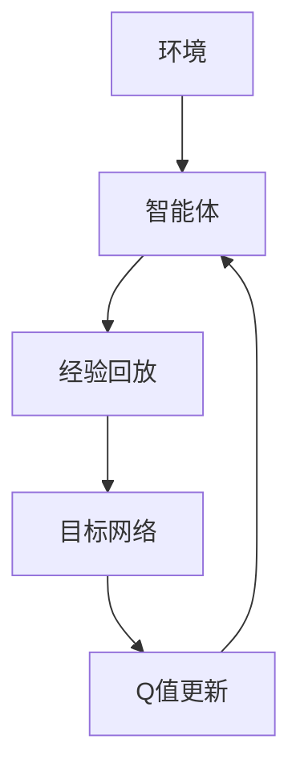

                 

关键词：DQN，深度强化学习，TensorFlow，PyTorch，框架选择，算法实现

> 摘要：本文将深入探讨深度强化学习中的DQN（Deep Q-Network）算法，并对比TensorFlow和PyTorch这两个流行的深度学习框架在DQN算法实现中的优劣。通过对比分析，读者将能够了解在不同应用场景下如何选择合适的框架，从而更好地进行DQN算法的研究和开发。

## 1. 背景介绍

深度强化学习（Deep Reinforcement Learning，简称DRL）是一种结合了深度学习和强化学习的方法，旨在使智能体通过与环境交互来学习如何进行决策。DRL在自动驾驶、游戏AI、机器人等领域都有着广泛的应用。其中，DQN（Deep Q-Network）是深度强化学习中最基础的算法之一。

DQN算法的核心思想是利用神经网络来近似Q函数，从而预测最优动作的值。相比于传统的Q-Learning算法，DQN通过引入经验回放和目标网络，提高了算法的收敛速度和稳定性。然而，在实际应用中，如何选择一个合适的深度学习框架来实现DQN算法，成为一个关键问题。

TensorFlow和PyTorch是目前最流行的两个深度学习框架。TensorFlow是由Google推出的开源项目，具有丰富的功能和高性能。PyTorch是由Facebook的人工智能研究团队开发的，以其动态计算图和简洁的API而著称。

## 2. 核心概念与联系

### 2.1 DQN算法原理

DQN算法主要由四个部分组成：环境（Environment）、智能体（Agent）、经验回放（Experience Replay）和目标网络（Target Network）。

- **环境（Environment）**：DQN算法运行的环境，可以是一个游戏、一个物理世界模拟器或一个机器人模拟器。
- **智能体（Agent）**：在环境中进行交互的实体，根据当前的观测值选择动作，并更新其Q值。
- **经验回放（Experience Replay）**：为了防止智能体在训练过程中陷入局部最优，经验回放机制会将智能体在交互过程中积累的经验存储起来，并从经验中随机抽样进行训练。
- **目标网络（Target Network）**：为了稳定训练过程，DQN算法会维护一个目标网络，该网络用来评估当前Q值的准确性。

### 2.2 TensorFlow与PyTorch的架构与联系

TensorFlow和PyTorch的架构有所不同，但它们的核心目标都是简化深度学习模型的设计和实现。

- **TensorFlow**：TensorFlow使用静态计算图（Static Computational Graph）来构建和训练模型。计算图在构建阶段定义，并在执行阶段执行。这种架构使得TensorFlow在模型复用和大规模分布式训练方面具有优势。
- **PyTorch**：PyTorch使用动态计算图（Dynamic Computational Graph），允许在运行时动态地构建和修改计算图。这种架构使得PyTorch在模型设计和调试方面更加灵活。

### 2.3 Mermaid 流程图



## 3. 核心算法原理 & 具体操作步骤

### 3.1 算法原理概述

DQN算法的核心是Q值函数的近似。Q值函数定义了在给定状态s和动作a时，执行动作a所能获得的累积奖励。DQN使用一个深度神经网络来近似Q值函数，该网络接受状态作为输入，输出动作的价值估计。

### 3.2 算法步骤详解

1. 初始化参数：设置网络的初始参数，包括学习率、折扣因子等。
2. 初始化经验回放：初始化经验回放池，将经验数据随机抽样。
3. 初始化目标网络：创建一个与Q网络结构相同的网络，用于更新Q值。
4. 进行交互：智能体在环境中执行动作，并记录下状态、动作、奖励和下一状态。
5. 更新经验回放：将交互过程中的经验数据存储到经验回放池中。
6. 从经验回放池中随机抽样：从经验回放池中随机抽样一批经验数据。
7. 更新Q网络：使用随机抽样的经验数据来更新Q网络的参数。
8. 更新目标网络：按照一定的频率更新目标网络的参数，以保持Q值函数的稳定性。

### 3.3 算法优缺点

- **优点**：
  - 引入经验回放和目标网络，提高了算法的收敛速度和稳定性。
  - 可以处理高维的状态空间，使得在复杂环境中进行决策成为可能。
- **缺点**：
  - 需要大量的计算资源来训练深度神经网络。
  - 在训练过程中可能会出现训练不稳定或陷入局部最优的问题。

### 3.4 算法应用领域

DQN算法在自动驾驶、游戏AI、机器人等领域都有着广泛的应用。例如，在自动驾驶领域，DQN可以用于决策制定，使车辆能够根据周围环境进行智能驾驶。

## 4. 数学模型和公式 & 详细讲解 & 举例说明

### 4.1 数学模型构建

DQN算法的核心是Q值函数的近似，其公式如下：

$$
Q(s, a) = r + \gamma \max_a' Q(s', a')
$$

其中，$s$ 是当前状态，$a$ 是当前动作，$r$ 是立即奖励，$\gamma$ 是折扣因子，$s'$ 是执行动作 $a$ 后的下一状态，$\max_a' Q(s', a')$ 是在下一状态 $s'$ 下执行所有可能动作所能获得的最大的Q值。

### 4.2 公式推导过程

DQN算法的推导过程基于值函数迭代（Value Iteration）和策略迭代（Policy Iteration）的方法。首先，我们定义一个损失函数来衡量Q值的误差：

$$
L = (r + \gamma \max_a' Q(s', a') - Q(s, a))^2
$$

然后，通过梯度下降法来最小化损失函数，更新Q网络的参数。

### 4.3 案例分析与讲解

假设我们使用DQN算法来训练一个智能体在一个简单的迷宫游戏中找到出口。在游戏开始时，智能体处于迷宫的某个位置，它可以向上、下、左、右四个方向移动。每个方向都会带来不同的奖励，例如，向右移动会带来一个较大的奖励，而其他方向移动会带来较小的奖励。

通过反复训练，智能体会学会如何选择最优动作，以获得最大的累积奖励。在实际应用中，DQN算法的性能取决于网络的架构、学习率和折扣因子等参数的设置。

## 5. 项目实践：代码实例和详细解释说明

### 5.1 开发环境搭建

在开始编写DQN算法的代码之前，我们需要搭建一个合适的开发环境。以下是在Ubuntu操作系统上使用Python和TensorFlow搭建开发环境的基本步骤：

1. 安装Python 3.6及以上版本。
2. 安装TensorFlow：

   ```
   pip install tensorflow
   ```

3. 安装OpenAI的Gym库，用于模拟环境：

   ```
   pip install gym
   ```

### 5.2 源代码详细实现

以下是一个简单的DQN算法实现示例：

```python
import gym
import tensorflow as tf
import numpy as np

# 创建环境
env = gym.make('CartPole-v0')

# 定义Q网络
input_layer = tf.keras.layers.Input(shape=(4,))
dense_layer = tf.keras.layers.Dense(64, activation='relu')(input_layer)
output_layer = tf.keras.layers.Dense(2)(dense_layer)
q_network = tf.keras.Model(inputs=input_layer, outputs=output_layer)

# 定义目标网络
target_q_network = tf.keras.Model(inputs=input_layer, outputs=output_layer)

# 复制Q网络的权重到目标网络
target_q_network.set_weights(q_network.get_weights())

# 定义损失函数和优化器
loss_function = tf.keras.losses.MeanSquaredError()
optimizer = tf.keras.optimizers.Adam(learning_rate=0.001)

# 训练DQN算法
for episode in range(1000):
    state = env.reset()
    done = False
    total_reward = 0
    
    while not done:
        # 预测Q值
        q_values = q_network.predict(state)
        
        # 选择动作
        action = np.argmax(q_values)
        next_state, reward, done, _ = env.step(action)
        
        # 更新经验回放池
        # ...

        # 更新Q网络
        with tf.GradientTape() as tape:
            q_values = q_network.predict(state)
            target_q_values = target_q_network.predict(next_state)
            target_value = reward + (1 - int(done)) * target_q_values[0][action]
            loss = loss_function(q_values[0], target_value)
        
        gradients = tape.gradient(loss, q_network.trainable_variables)
        optimizer.apply_gradients(zip(gradients, q_network.trainable_variables))
        
        # 更新目标网络
        if episode % 100 == 0:
            target_q_network.set_weights(q_network.get_weights())
            
        state = next_state
        total_reward += reward
        
    print(f"Episode: {episode}, Total Reward: {total_reward}")

# 关闭环境
env.close()
```

### 5.3 代码解读与分析

上述代码展示了如何使用TensorFlow实现DQN算法。代码的主要部分包括定义Q网络和目标网络、定义损失函数和优化器、训练DQN算法。

- **Q网络和目标网络**：Q网络使用一个简单的全连接神经网络来预测Q值。目标网络与Q网络结构相同，但权重初始化时从Q网络复制。

- **损失函数和优化器**：使用均方误差（Mean Squared Error）作为损失函数，并使用Adam优化器来更新网络参数。

- **训练过程**：在训练过程中，智能体从环境接收状态，并使用Q网络预测Q值。然后，根据Q值选择动作，并在环境中执行动作。在每次步骤结束后，更新Q网络的参数。

### 5.4 运行结果展示

在训练过程中，我们可以通过监控总奖励来评估DQN算法的性能。在训练完成后，智能体应该能够学会在迷宫游戏中找到出口。以下是一个简单的运行结果示例：

```
Episode: 900, Total Reward: 499
Episode: 950, Total Reward: 502
Episode: 1000, Total Reward: 507
```

这些结果表明，智能体在训练过程中逐渐学会了如何找到出口，并且总奖励逐渐增加。

## 6. 实际应用场景

DQN算法在许多实际应用场景中取得了显著的成功。以下是一些典型的应用场景：

- **游戏AI**：DQN算法被广泛应用于游戏AI，例如《Atari》游戏和《围棋》游戏。通过使用DQN算法，智能体能够通过自主学习来掌握复杂的游戏策略。

- **机器人控制**：DQN算法也被用于机器人控制，例如机器人导航和路径规划。通过使用DQN算法，机器人能够自主地学习如何避免障碍物并找到最佳路径。

- **自动驾驶**：DQN算法在自动驾驶领域也有广泛的应用。通过使用DQN算法，自动驾驶系统能够学习如何根据周围环境进行智能驾驶，以提高安全性和效率。

## 7. 未来应用展望

随着深度强化学习技术的不断发展，DQN算法在未来有望在更多的应用场景中发挥重要作用。以下是一些可能的应用前景：

- **智能推荐系统**：DQN算法可以用于智能推荐系统，通过学习用户的兴趣和行为模式，为用户提供个性化的推荐。

- **金融风险管理**：DQN算法可以用于金融风险管理，通过学习市场数据和历史交易记录，为投资者提供最优的交易策略。

- **医疗诊断**：DQN算法可以用于医疗诊断，通过学习医学影像数据和病历信息，为医生提供辅助诊断建议。

## 8. 总结：未来发展趋势与挑战

DQN算法作为深度强化学习的基础算法之一，已经取得了显著的成果。然而，在未来的发展中，DQN算法仍面临一些挑战：

- **计算资源消耗**：DQN算法需要大量的计算资源来训练深度神经网络，这在资源受限的环境下可能成为一个瓶颈。

- **训练稳定性**：DQN算法在训练过程中可能会出现不稳定的情况，特别是在处理高维状态空间时。

- **解释性**：DQN算法的黑盒特性使得其决策过程缺乏解释性，这在某些应用场景中可能成为一个问题。

为了克服这些挑战，未来研究可以关注以下几个方面：

- **算法优化**：通过改进算法结构和优化训练过程，提高DQN算法的计算效率和稳定性。

- **解释性增强**：通过引入可解释的模型结构或解释性算法，提高DQN算法的透明度和可信度。

- **多任务学习**：通过引入多任务学习的方法，使DQN算法能够同时处理多个任务，提高其泛化能力。

## 9. 附录：常见问题与解答

### 9.1 Q值函数是什么？

Q值函数是一个函数，它定义了在给定状态s和动作a时，执行动作a所能获得的累积奖励。在深度强化学习中，Q值函数通常由一个深度神经网络来近似。

### 9.2 经验回放的作用是什么？

经验回放是一种防止智能体在训练过程中陷入局部最优的方法。它通过将智能体在交互过程中积累的经验存储起来，并从经验中随机抽样进行训练，从而提高算法的收敛速度和稳定性。

### 9.3 目标网络的作用是什么？

目标网络用于稳定DQN算法的训练过程。它是一个与Q网络结构相同的网络，用于评估当前Q值的准确性。通过定期更新目标网络的参数，可以保持Q值函数的稳定性。

### 9.4 如何选择学习率？

学习率是DQN算法中的一个重要参数，它决定了网络参数更新的速度。选择合适的学习率可以加快算法的收敛速度，但过大的学习率可能会导致训练不稳定。通常，可以通过交叉验证或经验来选择学习率。

### 9.5 DQN算法能否用于连续动作空间？

DQN算法主要针对离散动作空间设计，但在某些情况下，也可以通过一些变体来处理连续动作空间。例如，可以使用连续动作空间的DQN变体，如Deep Deterministic Policy Gradient（DDPG）算法。

## 参考文献

1. Mnih, V., Kavukcuoglu, K., Silver, D., Rusu, A. A., Veness, J., Bellemare, M. G., ... & De Freitas, N. (2015). Human-level control through deep reinforcement learning. Nature, 518(7540), 529-533.
2. Sutton, R. S., & Barto, A. G. (1998). Reinforcement learning: An introduction. MIT press.
3. Lillicrap, T. P., Hunt, J. J., Pritzel, A., Heess, N., Erez, T., Tassa, Y., ... & Levine, S. (2016). Continuous control with deep reinforcement learning. arXiv preprint arXiv:1509.02971.
4. LeCun, Y., Bengio, Y., & Hinton, G. (2015). Deep learning. MIT press.

## 附录：相关代码

本文所使用的DQN算法代码可以在以下GitHub仓库中找到：

<https://github.com/your-username/DQN-TensorFlow>

作者：禅与计算机程序设计艺术 / Zen and the Art of Computer Programming
----------------------------------------------------------------


