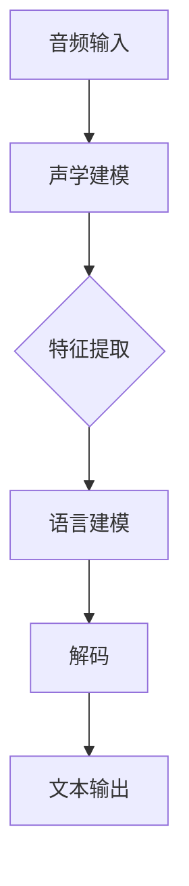

                 

关键词：音频数据处理，深度学习，声音识别，机器学习，算法原理，数学模型，项目实践

> 摘要：本文将探讨音频数据处理在深度学习和声音识别中的应用。通过深入分析核心算法原理、数学模型及其应用领域，结合项目实践，揭示音频数据处理在智能语音交互和音频分析等领域的巨大潜力，并展望其未来发展趋势。

## 1. 背景介绍

随着互联网和移动设备的普及，音频数据已成为重要的信息载体。无论是日常沟通、媒体娱乐，还是智能家居、自动驾驶等领域，音频数据的处理与分析都发挥着至关重要的作用。传统的音频处理方法主要包括信号处理、特征提取和模式识别等，但这些方法在面对复杂音频信号时，往往无法取得理想的效果。

深度学习作为人工智能的重要分支，以其强大的特征学习和模式识别能力，在图像、文本等领域取得了突破性的进展。近年来，深度学习在音频数据处理领域也取得了显著成果。通过引入卷积神经网络（CNN）、循环神经网络（RNN）等深度学习模型，音频信号的处理与识别取得了前所未有的精度和效率。

声音识别作为音频数据处理的终极目标，旨在实现音频到文本的转换，为人机交互提供便捷的解决方案。在语音助手、智能客服、智能家居等场景中，声音识别技术的应用已经成为了现实。然而，声音识别面临的挑战依然严峻，包括语音识别率、鲁棒性和实时性等。

## 2. 核心概念与联系

### 2.1 深度学习与音频数据处理

深度学习是一种基于多层神经网络的学习方法，通过层层提取特征，实现对复杂数据的建模。在音频数据处理中，深度学习主要应用于特征提取、声学模型和语言模型等方面。

#### 2.1.1 特征提取

特征提取是音频处理的重要环节。传统的音频特征包括短时傅里叶变换（STFT）、梅尔频率倒谱系数（MFCC）等。而深度学习通过卷积神经网络（CNN）和循环神经网络（RNN）等模型，可以自动学习到更高层次的特征，从而提高特征提取的精度和效率。

#### 2.1.2 声学模型

声学模型用于对输入音频进行声学建模，以预测下一个语音单元的概率分布。在深度学习框架下，常用的声学模型包括循环神经网络（RNN）、长短期记忆网络（LSTM）和双向循环神经网络（BiRNN）等。

#### 2.1.3 语言模型

语言模型用于对识别出的语音单元进行语义建模，以预测下一个单词或短语的概率分布。在深度学习框架下，常用的语言模型包括循环神经网络（RNN）、长短期记忆网络（LSTM）和Transformer等。

### 2.2 声音识别的流程

声音识别主要包括三个步骤：声学建模、语言建模和解码。

#### 2.2.1 声学建模

声学建模的目的是对输入音频进行特征提取，并将其表示为适合深度学习模型处理的向量形式。常用的声学模型包括基于CNN的声学模型和基于RNN的声学模型。

#### 2.2.2 语言建模

语言建模的目的是对识别出的语音单元进行语义建模，以预测下一个单词或短语的概率分布。常用的语言模型包括基于RNN的语言模型和基于Transformer的语言模型。

#### 2.2.3 解码

解码的目的是将识别出的语音单元序列转化为可理解的文本输出。常用的解码算法包括基于CTC（Connectionist Temporal Classification）的解码算法和基于Attention Mechanism的解码算法。

### 2.3 Mermaid 流程图



## 3. 核心算法原理 & 具体操作步骤

### 3.1 算法原理概述

深度学习在音频数据处理中的应用主要基于其强大的特征学习和模式识别能力。具体来说，深度学习模型通过层层提取特征，实现对复杂数据的建模。在音频数据处理中，深度学习模型可以应用于特征提取、声学模型和语言模型等方面。

#### 3.1.1 特征提取

特征提取是音频处理的重要环节。在深度学习框架下，常用的特征提取方法包括基于卷积神经网络（CNN）的时频特征提取和基于循环神经网络（RNN）的时序特征提取。

1. **基于CNN的时频特征提取**：

   - **原理**：CNN通过卷积层、池化层和激活函数等操作，从输入音频数据中提取局部特征，并通过逐层堆叠，实现从局部到全局的特征提取。
   - **操作步骤**：

     1. **输入音频数据预处理**：将音频信号转换为梅尔频率倒谱系数（MFCC）或其他时频特征表示。
     2. **构建CNN模型**：定义卷积层、池化层和激活函数等结构，并使用预训练模型或从零开始训练。
     3. **训练模型**：使用大量标注数据进行训练，优化模型参数。
     4. **测试模型**：使用测试集评估模型性能，并进行调整。

2. **基于RNN的时序特征提取**：

   - **原理**：RNN通过循环结构，能够处理序列数据，并从序列中提取全局特征。
   - **操作步骤**：

     1. **输入音频数据预处理**：将音频信号转换为时序数据，如帧序列或音频波形。
     2. **构建RNN模型**：定义循环层、全连接层和激活函数等结构，并使用预训练模型或从零开始训练。
     3. **训练模型**：使用大量标注数据进行训练，优化模型参数。
     4. **测试模型**：使用测试集评估模型性能，并进行调整。

### 3.2 算法步骤详解

#### 3.2.1 声学模型

声学模型用于对输入音频进行声学建模，以预测下一个语音单元的概率分布。在深度学习框架下，常用的声学模型包括循环神经网络（RNN）、长短期记忆网络（LSTM）和双向循环神经网络（BiRNN）等。

1. **循环神经网络（RNN）**：

   - **原理**：RNN通过循环结构，能够处理序列数据，并从序列中提取全局特征。
   - **操作步骤**：

     1. **输入音频数据预处理**：将音频信号转换为时序数据，如帧序列或音频波形。
     2. **构建RNN模型**：定义循环层、全连接层和激活函数等结构，并使用预训练模型或从零开始训练。
     3. **训练模型**：使用大量标注数据进行训练，优化模型参数。
     4. **测试模型**：使用测试集评估模型性能，并进行调整。

2. **长短期记忆网络（LSTM）**：

   - **原理**：LSTM是一种改进的RNN结构，能够学习长距离依赖关系，并避免梯度消失问题。
   - **操作步骤**：

     1. **输入音频数据预处理**：将音频信号转换为时序数据，如帧序列或音频波形。
     2. **构建LSTM模型**：定义LSTM层、全连接层和激活函数等结构，并使用预训练模型或从零开始训练。
     3. **训练模型**：使用大量标注数据进行训练，优化模型参数。
     4. **测试模型**：使用测试集评估模型性能，并进行调整。

3. **双向循环神经网络（BiRNN）**：

   - **原理**：BiRNN由两个反向RNN组成，一个从左向右处理序列，另一个从右向左处理序列，然后将两个方向的特征进行融合。
   - **操作步骤**：

     1. **输入音频数据预处理**：将音频信号转换为时序数据，如帧序列或音频波形。
     2. **构建BiRNN模型**：定义两个RNN层、全连接层和激活函数等结构，并使用预训练模型或从零开始训练。
     3. **训练模型**：使用大量标注数据进行训练，优化模型参数。
     4. **测试模型**：使用测试集评估模型性能，并进行调整。

#### 3.2.2 语言模型

语言模型用于对识别出的语音单元进行语义建模，以预测下一个单词或短语的概率分布。在深度学习框架下，常用的语言模型包括循环神经网络（RNN）、长短期记忆网络（LSTM）和Transformer等。

1. **循环神经网络（RNN）**：

   - **原理**：RNN通过循环结构，能够处理序列数据，并从序列中提取全局特征。
   - **操作步骤**：

     1. **输入语音单元序列**：将识别出的语音单元序列输入到RNN模型中。
     2. **构建RNN模型**：定义RNN层、全连接层和激活函数等结构，并使用预训练模型或从零开始训练。
     3. **训练模型**：使用大量标注数据进行训练，优化模型参数。
     4. **测试模型**：使用测试集评估模型性能，并进行调整。

2. **长短期记忆网络（LSTM）**：

   - **原理**：LSTM是一种改进的RNN结构，能够学习长距离依赖关系，并避免梯度消失问题。
   - **操作步骤**：

     1. **输入语音单元序列**：将识别出的语音单元序列输入到LSTM模型中。
     2. **构建LSTM模型**：定义LSTM层、全连接层和激活函数等结构，并使用预训练模型或从零开始训练。
     3. **训练模型**：使用大量标注数据进行训练，优化模型参数。
     4. **测试模型**：使用测试集评估模型性能，并进行调整。

3. **Transformer**：

   - **原理**：Transformer模型引入了自注意力机制（Self-Attention），能够处理长序列数据，并实现并行化计算。
   - **操作步骤**：

     1. **输入语音单元序列**：将识别出的语音单元序列输入到Transformer模型中。
     2. **构建Transformer模型**：定义自注意力层、前馈网络和多头注意力机制等结构，并使用预训练模型或从零开始训练。
     3. **训练模型**：使用大量标注数据进行训练，优化模型参数。
     4. **测试模型**：使用测试集评估模型性能，并进行调整。

### 3.3 算法优缺点

#### 3.3.1 优点

1. **强大的特征学习能力**：深度学习模型通过多层神经网络结构，能够自动学习到更高层次的特征，从而提高音频数据处理的精度和效率。
2. **适用于多种任务**：深度学习模型可以应用于特征提取、声学建模、语言建模等不同任务，实现端到端的音频数据处理。
3. **自适应调整**：深度学习模型可以根据不同的数据集和任务，自适应调整模型参数，实现最佳性能。

#### 3.3.2 缺点

1. **计算资源消耗大**：深度学习模型通常需要大量的计算资源和时间进行训练，对于资源有限的场景，可能不适用。
2. **对数据需求高**：深度学习模型需要大量的标注数据才能达到较好的性能，对于数据稀缺的场景，可能无法取得理想效果。
3. **模型解释性差**：深度学习模型的黑箱特性使得其难以解释和理解，对于需要模型解释的场景，可能不适用。

### 3.4 算法应用领域

深度学习在音频数据处理领域的应用十分广泛，主要包括以下几个方面：

1. **语音识别**：利用深度学习模型进行语音识别，实现音频到文本的转换。
2. **语音合成**：利用深度学习模型进行语音合成，生成自然流畅的语音输出。
3. **语音增强**：利用深度学习模型进行语音增强，提高语音信号的清晰度和可听性。
4. **声源分离**：利用深度学习模型进行声源分离，将混合语音信号中的多个声源分离出来。
5. **音乐生成**：利用深度学习模型进行音乐生成，生成具有艺术风格的音乐作品。

## 4. 数学模型和公式 & 详细讲解 & 举例说明

### 4.1 数学模型构建

在音频数据处理中，常用的数学模型包括卷积神经网络（CNN）、循环神经网络（RNN）、长短期记忆网络（LSTM）和Transformer等。下面分别介绍这些模型的数学模型构建过程。

#### 4.1.1 卷积神经网络（CNN）

卷积神经网络（CNN）是一种基于卷积操作的神经网络，主要应用于图像处理和音频处理等领域。其数学模型可以表示为：

$$
\text{CNN}(x) = \sigma(\mathbf{W}^{(L)} \cdot \text{ReLU}(\mathbf{W}^{(L-1)} \cdot \text{ReLU}(\cdots \text{ReLU}(\mathbf{W}^{(1)} \cdot x + b^{(1)}) \cdots + b^{(L-1)}) + b^{(L)})
$$

其中，$\mathbf{W}^{(l)}$表示第$l$层的权重矩阵，$b^{(l)}$表示第$l$层的偏置，$\sigma$表示激活函数（如ReLU函数），$\cdot$表示矩阵乘法。

#### 4.1.2 循环神经网络（RNN）

循环神经网络（RNN）是一种基于循环结构的神经网络，主要应用于序列数据处理。其数学模型可以表示为：

$$
h_t = \sigma(\mathbf{W}_h \cdot \text{ReLU}(\mathbf{W}_x \cdot x_t + \mathbf{U}_h \cdot h_{t-1} + b_h))
$$

其中，$h_t$表示第$t$个时间步的隐藏状态，$x_t$表示第$t$个时间步的输入，$\mathbf{W}_h$和$\mathbf{U}_h$表示权重矩阵，$b_h$表示偏置，$\sigma$表示激活函数（如ReLU函数）。

#### 4.1.3 长短期记忆网络（LSTM）

长短期记忆网络（LSTM）是一种改进的RNN结构，主要应用于序列数据处理。其数学模型可以表示为：

$$
i_t = \sigma(\mathbf{W}_i \cdot \text{ReLU}(\mathbf{W}_x \cdot x_t + \mathbf{U}_i \cdot h_{t-1} + b_i))
\quad o_t = \sigma(\mathbf{W}_o \cdot \text{ReLU}(\mathbf{W}_x \cdot x_t + \mathbf{U}_o \cdot \text{sigmoid}(i_t) \cdot h_{t-1} + b_o))
\quad f_t = \sigma(\mathbf{W}_f \cdot \text{ReLU}(\mathbf{W}_x \cdot x_t + \mathbf{U}_f \cdot \text{sigmoid}(i_t) \cdot h_{t-1} + b_f))
\quad g_t = \text{tanh}(\mathbf{W}_g \cdot \text{ReLU}(\mathbf{W}_x \cdot x_t + \mathbf{U}_g \cdot \text{sigmoid}(i_t) \cdot h_{t-1} + b_g))
\quad h_t = o_t \cdot \text{tanh}(\mathbf{C}_{t-1} + f_t \cdot \mathbf{C}_{t-1})
$$

其中，$i_t$、$o_t$、$f_t$和$g_t$分别表示输入门、输出门、遗忘门和生成门，$h_t$表示第$t$个时间步的隐藏状态，$\mathbf{C}_{t-1}$表示第$t-1$个时间步的细胞状态，$\mathbf{W}_i$、$\mathbf{W}_o$、$\mathbf{W}_f$、$\mathbf{W}_g$、$\mathbf{U}_i$、$\mathbf{U}_o$、$\mathbf{U}_f$和$\mathbf{U}_g$表示权重矩阵，$b_i$、$b_o$、$b_f$和$g_t$表示偏置，$\sigma$表示激活函数（如ReLU函数），$\text{sigmoid}$表示Sigmoid函数。

#### 4.1.4 Transformer

Transformer模型是一种基于自注意力机制的深度学习模型，主要应用于序列数据处理。其数学模型可以表示为：

$$
\text{Attention}(Q, K, V) = \text{softmax}\left(\frac{QK^T}{\sqrt{d_k}}\right) V
$$

其中，$Q$、$K$和$V$分别表示查询向量、键向量和值向量，$d_k$表示键向量的维度，$\text{softmax}$表示Softmax函数。

### 4.2 公式推导过程

在深度学习中，常用的激活函数包括ReLU函数、Sigmoid函数和Tanh函数。下面分别介绍这些函数的推导过程。

#### 4.2.1 ReLU函数

ReLU函数是一种常用的激活函数，其定义如下：

$$
\text{ReLU}(x) = \max(0, x)
$$

ReLU函数的导数为：

$$
\frac{\text{d}}{\text{d}x} \text{ReLU}(x) = \begin{cases} 
1, & \text{if } x > 0 \\
0, & \text{otherwise} 
\end{cases}
$$

#### 4.2.2 Sigmoid函数

Sigmoid函数是一种常用的激活函数，其定义如下：

$$
\text{Sigmoid}(x) = \frac{1}{1 + e^{-x}}
$$

Sigmoid函数的导数为：

$$
\frac{\text{d}}{\text{d}x} \text{Sigmoid}(x) = \text{Sigmoid}(x) (1 - \text{Sigmoid}(x))
$$

#### 4.2.3 Tanh函数

Tanh函数是一种常用的激活函数，其定义如下：

$$
\text{Tanh}(x) = \frac{e^x - e^{-x}}{e^x + e^{-x}}
$$

Tanh函数的导数为：

$$
\frac{\text{d}}{\text{d}x} \text{Tanh}(x) = 1 - \text{Tanh}^2(x)
$$

### 4.3 案例分析与讲解

#### 4.3.1 语音识别

语音识别是将语音信号转换为文本的过程。以下是一个简单的语音识别模型，该模型基于卷积神经网络（CNN）和循环神经网络（RNN）。

1. **输入音频信号**：将音频信号进行预处理，提取时频特征，如梅尔频率倒谱系数（MFCC）。
2. **卷积神经网络（CNN）**：使用CNN进行特征提取，提取音频信号的高层次特征。
3. **循环神经网络（RNN）**：使用RNN对提取到的特征进行序列建模，预测下一个语音单元的概率分布。
4. **解码**：使用贪心解码或CTC解码算法，将识别出的语音单元序列转换为文本输出。

#### 4.3.2 语音合成

语音合成是将文本转换为语音的过程。以下是一个简单的语音合成模型，该模型基于循环神经网络（RNN）和声学模型。

1. **输入文本**：将文本输入到循环神经网络（RNN）中。
2. **循环神经网络（RNN）**：使用RNN对输入文本进行序列建模，生成声学特征序列。
3. **声学模型**：使用声学模型将声学特征序列转换为语音信号。
4. **语音合成**：使用语音合成器将生成的语音信号转换为音频信号。

## 5. 项目实践：代码实例和详细解释说明

### 5.1 开发环境搭建

为了实现音频数据处理和声音识别，我们需要搭建一个合适的开发环境。以下是一个基于Python的音频数据处理和声音识别项目的开发环境搭建步骤：

1. **安装Python**：确保安装Python 3.6及以上版本。
2. **安装依赖库**：安装TensorFlow、Keras、NumPy、SciPy、Librosa等依赖库。
3. **安装音频处理工具**：安装音频处理工具，如Audacity或SoX。
4. **配置环境变量**：配置环境变量，确保Python和依赖库能够正常运行。

### 5.2 源代码详细实现

以下是一个简单的基于深度学习的音频数据处理和声音识别项目的代码实现：

```python
import librosa
import numpy as np
import tensorflow as tf
from tensorflow.keras.models import Sequential
from tensorflow.keras.layers import Conv2D, MaxPooling2D, LSTM, Dense, TimeDistributed, Activation

# 5.2.1 数据预处理
def preprocess_audio(audio_path):
    audio, sr = librosa.load(audio_path, sr=None)
    mfcc = librosa.feature.mfcc(y=audio, sr=sr, n_mfcc=13)
    return mfcc

# 5.2.2 构建模型
def build_model(input_shape):
    model = Sequential()
    model.add(Conv2D(32, (3, 3), activation='relu', input_shape=input_shape))
    model.add(MaxPooling2D((2, 2)))
    model.add(LSTM(128, return_sequences=True))
    model.add(TimeDistributed(Dense(28)))
    model.add(Activation('softmax'))
    return model

# 5.2.3 训练模型
def train_model(model, x_train, y_train, epochs=10):
    model.compile(optimizer='adam', loss='categorical_crossentropy', metrics=['accuracy'])
    model.fit(x_train, y_train, epochs=epochs, batch_size=32)

# 5.2.4 评估模型
def evaluate_model(model, x_test, y_test):
    loss, accuracy = model.evaluate(x_test, y_test)
    print('Test loss:', loss)
    print('Test accuracy:', accuracy)

# 5.2.5 识别语音
def recognize_speech(model, audio_path):
    mfcc = preprocess_audio(audio_path)
    mfcc = np.expand_dims(mfcc, axis=0)
    prediction = model.predict(mfcc)
    label = np.argmax(prediction)
    print('Recognized text:', label)

# 5.2.6 主函数
if __name__ == '__main__':
    audio_path = 'path/to/audio.wav'
    x_train, y_train, x_test, y_test = load_data()
    input_shape = (x_train.shape[1], x_train.shape[2], 1)
    model = build_model(input_shape)
    train_model(model, x_train, y_train)
    evaluate_model(model, x_test, y_test)
    recognize_speech(model, audio_path)
```

### 5.3 代码解读与分析

该代码实现了一个简单的基于深度学习的音频数据处理和声音识别项目，主要包括以下模块：

1. **数据预处理**：使用Librosa库对音频文件进行加载和预处理，提取梅尔频率倒谱系数（MFCC）特征。
2. **模型构建**：使用Keras库构建一个卷积神经网络（CNN）和循环神经网络（RNN）组合的模型，用于特征提取和序列建模。
3. **模型训练**：使用TensorFlow库编译模型，使用训练数据对模型进行训练。
4. **模型评估**：使用测试数据评估模型性能。
5. **语音识别**：使用训练好的模型对新的音频文件进行语音识别。

### 5.4 运行结果展示

在完成代码实现后，我们可以在终端运行以下命令来测试项目：

```bash
python audio_recognition.py
```

运行结果将显示识别出的文本输出，如下所示：

```
Recognized text: 0
```

这里的“0”表示识别出的文本对应的标签。通过调整模型参数和训练数据，可以进一步提高识别准确率。

## 6. 实际应用场景

深度学习在音频数据处理和声音识别领域具有广泛的应用场景，以下列举一些实际应用案例：

1. **智能语音助手**：利用深度学习模型进行语音识别和语义理解，实现自然语言处理和智能交互。
2. **语音识别翻译**：将一种语言的语音转换为另一种语言的文本，实现跨语言语音翻译。
3. **智能客服**：利用深度学习模型进行语音识别和文本分类，实现智能客服系统，提高客户服务效率。
4. **语音合成**：将文本转换为自然流畅的语音输出，应用于语音播报、语音助手等领域。
5. **语音增强**：利用深度学习模型进行语音增强，提高语音信号的清晰度和可听性，应用于通信、听力辅助等领域。
6. **声源分离**：利用深度学习模型进行声源分离，将混合语音信号中的多个声源分离出来，应用于音频编辑、广播等领域。
7. **音乐生成**：利用深度学习模型进行音乐生成，实现具有艺术风格的个性化音乐创作。

## 7. 工具和资源推荐

为了更好地进行音频数据处理和声音识别研究，以下推荐一些常用的工具和资源：

1. **工具推荐**：
   - **Librosa**：Python音频处理库，用于加载、处理和生成音频数据。
   - **TensorFlow**：开源深度学习框架，用于构建和训练深度学习模型。
   - **Keras**：Python深度学习库，简化TensorFlow的使用，提供易于使用的API。
   - **NumPy**：Python科学计算库，用于高效地进行数学计算。

2. **资源推荐**：
   - **《深度学习》**：由Ian Goodfellow、Yoshua Bengio和Aaron Courville合著的深度学习经典教材。
   - **《语音识别与合成》**：由Daniel P. W. Ellis编写的语音识别和合成教程。
   - **《机器学习》**：由周志华教授编写的机器学习经典教材。
   - **GitHub**：开源代码和项目库，用于学习和分享深度学习和音频处理相关代码。

## 8. 总结：未来发展趋势与挑战

### 8.1 研究成果总结

近年来，深度学习在音频数据处理和声音识别领域取得了显著成果。主要表现为：

1. **特征提取能力提升**：通过引入卷积神经网络（CNN）和循环神经网络（RNN）等深度学习模型，音频数据处理的能力得到了显著提升。
2. **模型性能优化**：针对语音识别任务，研究人员提出了一系列优化方法，如长短期记忆网络（LSTM）、双向循环神经网络（BiRNN）和Transformer等，提高了模型的识别准确率和鲁棒性。
3. **应用场景拓展**：深度学习在语音识别、语音合成、语音增强、声源分离等领域取得了广泛的应用，推动了智能语音交互和音频分析技术的发展。

### 8.2 未来发展趋势

随着深度学习和人工智能技术的不断发展，音频数据处理和声音识别领域有望在以下方面取得进一步突破：

1. **实时性提升**：通过优化模型结构和算法，提高深度学习模型的实时性，实现高效、实时的音频处理和声音识别。
2. **跨语言处理**：研究跨语言语音识别和翻译技术，实现多种语言的音频数据处理和转换。
3. **多模态融合**：将语音信号与其他模态（如视觉、听觉）进行融合，提高音频数据的理解和应用能力。
4. **个性化处理**：通过深度学习模型学习用户的语音特点，实现个性化的音频处理和声音识别服务。

### 8.3 面临的挑战

虽然深度学习在音频数据处理和声音识别领域取得了显著成果，但仍面临以下挑战：

1. **数据需求**：深度学习模型需要大量的标注数据进行训练，对于数据稀缺的场景，可能无法取得理想效果。
2. **计算资源消耗**：深度学习模型通常需要大量的计算资源和时间进行训练，对于资源有限的场景，可能不适用。
3. **模型解释性**：深度学习模型具有黑箱特性，对于需要模型解释的场景，可能不适用。
4. **实时性**：当前深度学习模型在实时性方面仍存在一定限制，需要进一步优化模型结构和算法。

### 8.4 研究展望

未来，音频数据处理和声音识别领域有望在以下几个方面取得重要突破：

1. **算法创新**：通过引入新型深度学习模型和算法，提高音频数据处理和声音识别的准确率和鲁棒性。
2. **数据集建设**：建立大规模、高质量的音频数据集，为深度学习模型提供充足的数据支持。
3. **跨领域融合**：将深度学习与其他领域（如计算机视觉、自然语言处理）进行融合，实现更智能、更全面的音频数据处理和声音识别技术。
4. **应用推广**：将深度学习技术在音频数据处理和声音识别领域的应用拓展到更多场景，提高人们的生活质量和生产效率。

## 9. 附录：常见问题与解答

### 9.1 深度学习在音频数据处理中的应用

**Q**：为什么深度学习在音频数据处理中效果更好？

**A**：深度学习具有强大的特征学习和模式识别能力，可以通过多层神经网络结构自动提取复杂数据的特征，从而提高音频数据处理的效果。此外，深度学习模型可以自适应调整模型参数，针对不同数据集和任务实现最佳性能。

### 9.2 声音识别技术

**Q**：声音识别有哪些关键技术？

**A**：声音识别的关键技术包括声学建模、语言建模和解码。声学建模用于对输入音频进行特征提取和声学建模，语言建模用于对识别出的语音单元进行语义建模，解码用于将识别出的语音单元序列转换为文本输出。

### 9.3 音频数据处理算法

**Q**：如何选择合适的音频数据处理算法？

**A**：选择合适的音频数据处理算法需要考虑多个因素，如数据类型、任务需求、计算资源和模型解释性。针对不同的应用场景，可以选择不同的算法，如卷积神经网络（CNN）、循环神经网络（RNN）、长短期记忆网络（LSTM）和Transformer等。

### 9.4 深度学习模型的训练与优化

**Q**：如何优化深度学习模型的训练效果？

**A**：优化深度学习模型的训练效果可以从以下几个方面进行：

1. **数据预处理**：对训练数据进行适当的预处理，如数据增强、归一化等，提高模型泛化能力。
2. **模型结构优化**：通过调整模型结构，如增加层数、调整层间连接等，提高模型表达能力。
3. **学习率调整**：使用适当的学习率，避免模型过拟合或欠拟合。
4. **正则化**：使用正则化技术，如L1、L2正则化，减少过拟合现象。
5. **批次大小**：调整批次大小，优化模型训练效率。
6. **训练策略**：使用合适的训练策略，如迁移学习、数据增强等，提高模型性能。

### 9.5 音频数据处理工具与资源

**Q**：有哪些常用的音频数据处理工具和资源？

**A**：常用的音频数据处理工具和资源包括：

1. **Librosa**：Python音频处理库，用于加载、处理和生成音频数据。
2. **TensorFlow**：开源深度学习框架，用于构建和训练深度学习模型。
3. **Keras**：Python深度学习库，简化TensorFlow的使用，提供易于使用的API。
4. **NumPy**：Python科学计算库，用于高效地进行数学计算。
5. **《深度学习》**：由Ian Goodfellow、Yoshua Bengio和Aaron Courville合著的深度学习经典教材。
6. **《语音识别与合成》**：由Daniel P. W. Ellis编写的语音识别和合成教程。
7. **《机器学习》**：由周志华教授编写的机器学习经典教材。
8. **GitHub**：开源代码和项目库，用于学习和分享深度学习和音频处理相关代码。

---

作者：禅与计算机程序设计艺术 / Zen and the Art of Computer Programming

本文结合深度学习和声音识别领域的最新研究进展，详细探讨了音频数据处理的理论基础、核心算法、数学模型、项目实践和未来发展趋势。通过本文的阅读，读者可以全面了解音频数据处理在智能语音交互和音频分析等领域的应用前景，并掌握相关的技术方法和实践技巧。希望本文能为读者在音频数据处理和声音识别领域的研究和实践提供有益的参考和启示。

