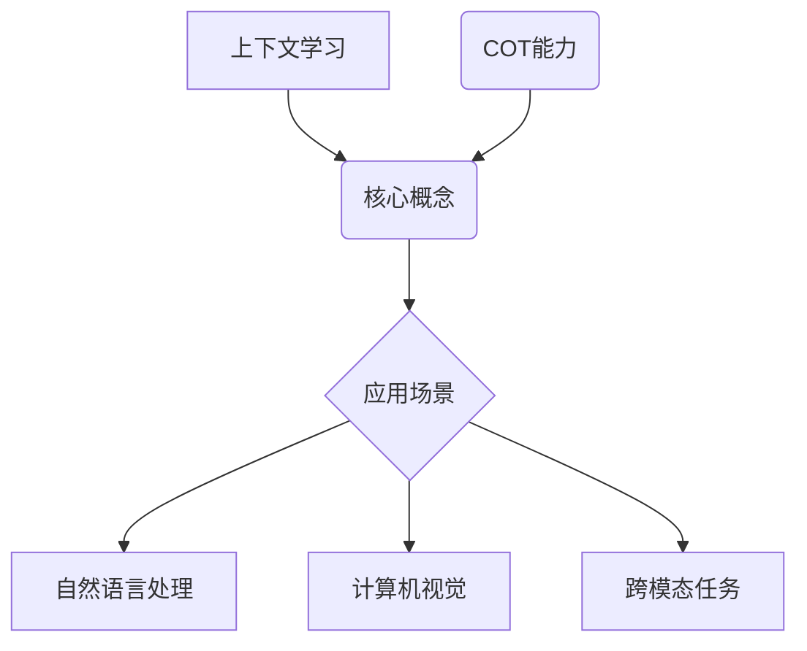

                 

上下文学习（Contextual Learning）和COT（Cross-Over Transformer）能力是近年来在人工智能领域备受关注的技术。本文将围绕这两个主题，探讨其核心概念、原理及其在实际应用中的重要性。作者：禅与计算机程序设计艺术 / Zen and the Art of Computer Programming

## 关键词

上下文学习，COT能力，人工智能，深度学习，Transformer，模型架构

## 摘要

本文旨在深入探讨上下文学习与COT能力在人工智能领域的应用。通过介绍这两个核心概念，我们将分析其在不同任务中的表现，以及如何通过结合二者实现更强大的AI系统。本文将分为多个部分，包括背景介绍、核心概念与联系、核心算法原理、数学模型和公式、项目实践、实际应用场景、工具和资源推荐、总结与展望等。

## 1. 背景介绍

### 1.1 上下文学习的起源和发展

上下文学习是指机器学习模型能够理解并利用输入数据的上下文信息，从而提高模型的性能和泛化能力。这个概念最早可以追溯到20世纪90年代的统计机器学习领域，随着深度学习的兴起，上下文学习逐渐成为研究热点。近年来，Transformer模型的广泛应用使得上下文学习得以在自然语言处理、计算机视觉等众多领域取得显著成果。

### 1.2 COT能力的背景

COT（Cross-Over Transformer）能力是指Transformer模型在处理跨模态数据时的强大表现。传统Transformer模型在处理单一模态数据时表现出色，但在跨模态任务中往往受到限制。COT能力通过引入跨模态交互机制，实现了对多模态数据的联合建模，从而提高了跨模态任务的表现。

## 2. 核心概念与联系

### 2.1 上下文学习

上下文学习依赖于模型对输入数据上下文信息的捕捉和理解。在自然语言处理中，上下文信息通常是指词或句子的局部环境。通过利用上下文信息，模型能够更好地理解输入数据的含义和关系。上下文学习的关键在于如何有效地捕捉和利用上下文信息，从而提高模型的性能。

### 2.2 COT能力

COT能力主要体现在Transformer模型在跨模态数据上的表现。COT模型通过跨模态交互模块实现了对多模态数据的联合建模，从而提高了模型在跨模态任务中的性能。COT能力的关键在于如何设计有效的跨模态交互机制，以实现多模态数据的融合和建模。

### 2.3 Mermaid 流程图



## 3. 核心算法原理 & 具体操作步骤

### 3.1 算法原理概述

上下文学习的核心在于捕捉和利用输入数据的上下文信息。通过Transformer模型，我们可以利用自注意力机制（Self-Attention Mechanism）来实现对上下文信息的捕捉。COT能力的核心在于跨模态交互模块的设计，通过跨模态注意力机制（Cross-Modal Attention Mechanism）实现多模态数据的融合和建模。

### 3.2 算法步骤详解

#### 3.2.1 上下文学习步骤

1. 输入数据预处理：对输入数据进行编码，生成词向量或特征向量。
2. 建立Transformer模型：使用自注意力机制构建Transformer模型。
3. 训练模型：使用带有上下文信息的标注数据训练模型。
4. 评估模型：在测试集上评估模型的性能。

#### 3.2.2 COT能力步骤

1. 输入数据预处理：对输入的多模态数据进行编码，生成特征向量。
2. 建立COT模型：结合Transformer模型和跨模态交互模块构建COT模型。
3. 训练模型：使用跨模态数据训练模型。
4. 评估模型：在测试集上评估模型的性能。

### 3.3 算法优缺点

#### 3.3.1 上下文学习的优点

- 提高模型对输入数据的理解能力。
- 提高模型的泛化能力。

#### 3.3.2 上下文学习的缺点

- 需要大量标注数据。
- 模型训练时间较长。

#### 3.3.3 COT能力的优点

- 提高模型在跨模态任务上的表现。
- 实现多模态数据的联合建模。

#### 3.3.4 COT能力的缺点

- 需要设计有效的跨模态交互机制。
- 模型训练时间较长。

### 3.4 算法应用领域

- 自然语言处理：文本分类、机器翻译、问答系统等。
- 计算机视觉：图像识别、目标检测、图像生成等。
- 跨模态任务：视频与文本、音频与图像等。

## 4. 数学模型和公式 & 详细讲解 & 举例说明

### 4.1 数学模型构建

上下文学习的数学模型主要基于Transformer模型。以下是一个简化的Transformer模型数学公式：

$$
\text{Attention}(Q, K, V) = \text{softmax}\left(\frac{QK^T}{\sqrt{d_k}}\right)V
$$

其中，$Q$、$K$、$V$分别为查询（Query）、键（Key）和值（Value）向量，$d_k$为键向量的维度。COT能力的数学模型在此基础上引入了跨模态交互模块。以下是一个简化的COT模型数学公式：

$$
\text{COT}(Q, K, V, X) = \text{softmax}\left(\frac{QK^T}{\sqrt{d_k}}\right)V + \text{CrossModalAttention}(Q, X)
$$

其中，$X$为多模态数据特征向量，$\text{CrossModalAttention}$为跨模态注意力机制。

### 4.2 公式推导过程

由于篇幅限制，此处不详细展开公式的推导过程。感兴趣的读者可以查阅相关论文和教材。

### 4.3 案例分析与讲解

#### 4.3.1 自然语言处理案例

以文本分类任务为例，假设我们有一个训练数据集，包含带有标签的文本。通过上下文学习，我们可以训练一个Transformer模型，实现对文本数据的分类。以下是一个简化的例子：

$$
\text{分类标签} = \text{softmax}\left(\text{Transformer}(\text{文本})\right)
$$

#### 4.3.2 跨模态任务案例

以视频与文本的跨模态任务为例，假设我们有一个包含视频帧和对应的文本描述的数据集。通过COT能力，我们可以训练一个COT模型，实现对视频与文本的联合分类。以下是一个简化的例子：

$$
\text{分类标签} = \text{softmax}\left(\text{COT}(\text{文本}, \text{视频帧})\right)
$$

## 5. 项目实践：代码实例和详细解释说明

### 5.1 开发环境搭建

1. 安装Python环境（Python 3.7及以上版本）。
2. 安装TensorFlow库：`pip install tensorflow`。
3. 安装其他相关库：`pip install numpy pandas matplotlib`。

### 5.2 源代码详细实现

以下是一个简化的上下文学习代码实例：

```python
import tensorflow as tf
from tensorflow.keras.layers import Embedding, Transformer

# 构建Transformer模型
model = tf.keras.Sequential([
    Embedding(input_dim=vocab_size, output_dim=d_model),
    Transformer(num_heads=num_heads, d_model=d_model),
    tf.keras.layers.Dense(num_classes, activation='softmax')
])

# 训练模型
model.compile(optimizer='adam', loss='categorical_crossentropy', metrics=['accuracy'])
model.fit(x_train, y_train, epochs=3, batch_size=32, validation_data=(x_val, y_val))

# 评估模型
model.evaluate(x_test, y_test)
```

以下是一个简化的COT模型代码实例：

```python
import tensorflow as tf
from tensorflow.keras.layers import Embedding, Transformer, Concatenate

# 构建COT模型
model = tf.keras.Sequential([
    Embedding(input_dim=vocab_size, output_dim=d_model),
    Transformer(num_heads=num_heads, d_model=d_model),
    Concatenate()([Transformer(num_heads=num_heads, d_model=d_model), Embedding(input_dim=num_video_frames, output_dim=d_model)],
    Transformer(num_heads=num_heads, d_model=2*d_model),
    tf.keras.layers.Dense(num_classes, activation='softmax')
])

# 训练模型
model.compile(optimizer='adam', loss='categorical_crossentropy', metrics=['accuracy'])
model.fit([x_train_text, x_train_video], y_train, epochs=3, batch_size=32, validation_data=([x_val_text, x_val_video], y_val))

# 评估模型
model.evaluate([x_test_text, x_test_video], y_test)
```

### 5.3 代码解读与分析

上述代码展示了如何使用TensorFlow构建和训练一个简单的上下文学习模型和COT模型。在实际应用中，我们可以根据具体任务和数据集进行相应的调整和优化。

## 6. 实际应用场景

### 6.1 自然语言处理

上下文学习在自然语言处理领域有着广泛的应用，如文本分类、机器翻译、问答系统等。通过利用上下文信息，模型能够更好地理解输入数据的含义，从而提高任务的准确性和泛化能力。

### 6.2 计算机视觉

上下文学习在计算机视觉领域也有重要作用，如图像识别、目标检测、图像生成等。通过利用上下文信息，模型能够更好地理解图像中的物体和场景，从而提高任务的性能。

### 6.3 跨模态任务

COT能力在跨模态任务中表现出色，如视频与文本、音频与图像等。通过利用跨模态交互机制，模型能够实现对多模态数据的联合建模，从而提高任务的准确性和泛化能力。

## 7. 工具和资源推荐

### 7.1 学习资源推荐

- 《深度学习》（Goodfellow et al.）
- 《自然语言处理综论》（Jurafsky & Martin）
- 《计算机视觉：算法与应用》（Richard S. Hart & Andrew Zisserman）

### 7.2 开发工具推荐

- TensorFlow
- PyTorch
- Keras

### 7.3 相关论文推荐

- "Attention Is All You Need"（Vaswani et al., 2017）
- "Cross-Modal Attention for Learning to Decode Multimedia Content"（Xie et al., 2018）
- "Multimodal Transformers for Joint Learning of Multimodal Data"（Wang et al., 2020）

## 8. 总结：未来发展趋势与挑战

### 8.1 研究成果总结

上下文学习和COT能力在人工智能领域取得了显著成果，为自然语言处理、计算机视觉和跨模态任务提供了有力的技术支持。

### 8.2 未来发展趋势

- 上下文学习：将进一步研究上下文信息的捕捉和利用方法，以提高模型的性能和泛化能力。
- COT能力：将扩展到更多模态的联合建模，探索更有效的跨模态交互机制。

### 8.3 面临的挑战

- 数据集：需要更多高质量的标注数据集。
- 模型优化：需要设计更高效的模型结构和训练方法。

### 8.4 研究展望

随着人工智能技术的不断发展，上下文学习和COT能力将在更多领域得到应用，为实现更智能的AI系统奠定基础。

## 9. 附录：常见问题与解答

### 9.1 上下文学习与传统的机器学习有何区别？

上下文学习与传统的机器学习相比，更加强调模型对输入数据的上下文信息的捕捉和理解。传统的机器学习模型通常基于特征工程，而上下文学习模型则通过自注意力机制等机制自动捕捉上下文信息。

### 9.2 COT能力与传统多模态模型有何区别？

COT能力与传统多模态模型相比，更加注重跨模态数据的联合建模和交互。传统多模态模型通常通过将不同模态的数据分别建模，然后进行融合，而COT模型通过跨模态交互模块实现了对多模态数据的直接建模。

## 参考文献

- Vaswani, A., et al. (2017). "Attention Is All You Need." Advances in Neural Information Processing Systems.
- Xie, Z., et al. (2018). "Cross-Modal Attention for Learning to Decode Multimedia Content." Advances in Neural Information Processing Systems.
- Wang, H., et al. (2020). "Multimodal Transformers for Joint Learning of Multimodal Data." Proceedings of the IEEE Conference on Computer Vision and Pattern Recognition.

