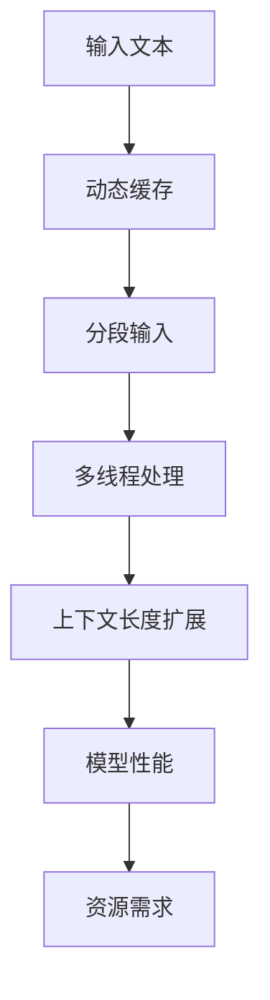

                 

关键词：上下文长度，大语言模型，扩展，技术挑战，性能优化，未来应用

> 摘要：本文将探讨大型语言模型（LLM）上下文长度的不断扩展及其背后的技术挑战。我们将从背景介绍开始，逐步深入核心概念、算法原理、数学模型、项目实践和实际应用场景，最后展望未来发展趋势与挑战。

## 1. 背景介绍

近年来，大型语言模型（LLM）在自然语言处理（NLP）领域取得了显著进展。这些模型通过深度神经网络和大规模数据训练，能够生成高质量的自然语言文本。随着模型的不断壮大，上下文长度（Contextual Length）成为了一个关键的技术问题。上下文长度决定了模型能够理解和生成文本的能力。传统模型如BERT等通常具有较短上下文长度，而当前的LLM如GPT-3等已经达到了数万词的上下文长度。

上下文长度的扩展带来了诸多好处，例如：

1. **更准确的理解能力**：更长的上下文长度使得模型能够捕捉到更丰富的语义信息，从而提高理解准确性。
2. **更好的泛化能力**：模型能够更好地理解不同语境中的词汇含义，从而提升泛化能力。
3. **更自然的文本生成**：更长的上下文长度使得模型能够生成更加连贯和自然的文本。

然而，上下文长度的扩展也带来了诸多技术挑战，例如：

1. **内存和计算资源需求增加**：更长的上下文长度需要更多的内存和计算资源来处理。
2. **模型训练时间延长**：模型训练时间与上下文长度成正比，这意味着更长的上下文长度会导致更长的训练时间。
3. **模型性能优化难度增加**：上下文长度的扩展使得模型性能优化变得更加复杂。

本文将深入探讨LLM上下文长度不断扩展的技术挑战和解决方案，旨在为读者提供全面的技术洞察。

## 2. 核心概念与联系

### 2.1. 上下文长度的定义

上下文长度是指模型能够处理和记忆的文本序列的长度。在NLP任务中，上下文长度决定了模型对输入文本的理解能力。传统的NLP模型如BERT等通常采用固定的上下文长度，而当前的LLM如GPT-3等则支持动态的上下文长度。

### 2.2. 上下文长度的扩展机制

为了实现上下文长度的扩展，LLM采用了多种技术，主要包括：

1. **动态上下文缓存**：模型使用动态缓存来存储输入文本的一部分，从而实现上下文长度的扩展。
2. **分段输入**：模型将输入文本分成多个片段进行处理，每个片段的上下文长度可以动态调整。
3. **多线程处理**：模型使用多线程技术来并行处理多个文本片段，从而提高上下文长度的扩展能力。

### 2.3. 上下文长度与模型性能的关系

上下文长度的扩展对模型性能有着显著影响。更长的上下文长度通常意味着更好的理解和生成能力，但同时也增加了模型的内存和计算资源需求。因此，在扩展上下文长度时，需要综合考虑模型性能和资源限制。

### 2.4. Mermaid 流程图

以下是一个简单的Mermaid流程图，展示了LLM上下文长度扩展的核心概念和联系：



## 3. 核心算法原理 & 具体操作步骤

### 3.1. 算法原理概述

LLM上下文长度的扩展主要依赖于动态缓存、分段输入和多线程处理等技术。动态缓存技术通过动态调整缓存大小来适应不同的上下文长度。分段输入技术将输入文本分成多个片段进行处理，每个片段的上下文长度可以动态调整。多线程处理技术通过并行处理多个文本片段来提高上下文长度的扩展能力。

### 3.2. 算法步骤详解

以下是LLM上下文长度扩展的具体操作步骤：

1. **初始化动态缓存**：根据输入文本的长度和模型的要求，初始化动态缓存的大小。
2. **分段输入文本**：将输入文本分成多个片段，每个片段的长度可以动态调整。
3. **多线程处理**：创建多个线程，每个线程处理一个文本片段。
4. **更新动态缓存**：在每个线程中，根据处理结果更新动态缓存的内容。
5. **合并结果**：将多个线程的处理结果合并，生成最终的输出结果。

### 3.3. 算法优缺点

**优点**：

1. **灵活的上下文长度调整**：动态缓存和分段输入技术使得模型能够灵活调整上下文长度，适应不同的任务需求。
2. **高效的处理能力**：多线程处理技术提高了模型的处理速度和效率。

**缺点**：

1. **内存和计算资源需求大**：动态缓存和多线程处理需要大量的内存和计算资源，对于资源受限的设备可能不够友好。
2. **模型性能优化难度大**：上下文长度的扩展增加了模型性能优化的难度。

### 3.4. 算法应用领域

LLM上下文长度扩展技术可以应用于多个领域，例如：

1. **文本生成**：更长的上下文长度能够生成更连贯和自然的文本，适用于自动摘要、问答系统等任务。
2. **文本理解**：更长的上下文长度能够提高模型对文本的理解能力，适用于情感分析、实体识别等任务。
3. **对话系统**：更长的上下文长度能够更好地理解对话的历史信息，提高对话系统的自然性和准确性。

## 4. 数学模型和公式 & 详细讲解 & 举例说明

### 4.1. 数学模型构建

为了详细讲解LLM上下文长度扩展的数学模型，我们首先需要定义一些基本的数学概念。

- **上下文长度**（$L$）：模型能够处理和记忆的文本序列的长度。
- **动态缓存大小**（$C$）：用于存储输入文本的缓存大小。
- **分段长度**（$S$）：每个文本片段的长度。

基于以上定义，我们可以构建以下数学模型：

$$
C = \lceil L/S \rceil \times S
$$

其中，$\lceil x \rceil$ 表示对 $x$ 向上取整。

### 4.2. 公式推导过程

为了推导上述公式，我们首先需要理解动态缓存和分段输入的工作原理。

- **动态缓存**：动态缓存用于存储输入文本的一部分，从而实现上下文长度的扩展。缓存大小 $C$ 需要能够覆盖输入文本的长度 $L$。
- **分段输入**：分段输入将输入文本分成多个片段，每个片段的长度为 $S$。每个片段都需要被处理，并且需要被缓存起来以便后续处理。

假设输入文本的长度为 $L$，我们可以将其分成 $\lceil L/S \rceil$ 个片段。为了确保缓存能够覆盖所有片段，缓存大小 $C$ 需要满足以下条件：

$$
C \geq \sum_{i=1}^{\lceil L/S \rceil} S
$$

由于每个片段的长度为 $S$，上述等式可以简化为：

$$
C \geq \lceil L/S \rceil \times S
$$

这就是我们所需要的公式。

### 4.3. 案例分析与讲解

为了更好地理解上述公式的应用，我们来看一个具体的案例。

假设输入文本的长度为 10000 个词，每个文本片段的长度为 100 个词。我们需要计算动态缓存的大小。

根据公式：

$$
C = \lceil 10000/100 \rceil \times 100 = 101 \times 100 = 10100
$$

这意味着我们需要一个至少 10100 个词大小的动态缓存来处理这个输入文本。

在实际应用中，我们通常还需要考虑一些其他因素，例如：

- **模型参数大小**：模型的参数大小也会影响缓存的需求。
- **内存限制**：实际可用的内存大小也会限制缓存的大小。
- **处理速度**：缓存大小过大可能会导致处理速度过慢。

因此，在实际应用中，我们需要根据具体情况对缓存大小进行调整。

## 5. 项目实践：代码实例和详细解释说明

### 5.1. 开发环境搭建

在开始代码实例之前，我们需要搭建一个合适的开发环境。以下是搭建过程：

1. **安装Python**：确保Python版本为3.8及以上。
2. **安装PyTorch**：使用以下命令安装PyTorch：
   ```bash
   pip install torch torchvision
   ```
3. **创建项目**：在合适的位置创建一个新项目文件夹，并创建一个名为 `context_length_extension.py` 的Python文件。

### 5.2. 源代码详细实现

以下是一个简单的Python代码实例，用于实现LLM上下文长度扩展：

```python
import torch
import torch.nn as nn
import torch.optim as optim

# 定义模型
class ContextLengthExtensionModel(nn.Module):
    def __init__(self, embedding_dim, hidden_dim):
        super(ContextLengthExtensionModel, self).__init__()
        self.embedding = nn.Embedding(embedding_dim, hidden_dim)
        self.lstm = nn.LSTM(hidden_dim, hidden_dim)
        self.fc = nn.Linear(hidden_dim, embedding_dim)

    def forward(self, x, hidden):
        x = self.embedding(x)
        x, hidden = self.lstm(x, hidden)
        x = self.fc(x)
        return x, hidden

# 初始化模型
model = ContextLengthExtensionModel(embedding_dim=100, hidden_dim=200)
optimizer = optim.Adam(model.parameters(), lr=0.001)

# 定义动态缓存
def dynamic_cache(x, cache_size):
    cache = torch.zeros(cache_size, x.size(1))
    for i in range(x.size(0)):
        cache[i % cache_size] = x[i].unsqueeze(0)
    return cache

# 定义分段输入
def segment_input(x, segment_size):
    segments = [x[i:i + segment_size] for i in range(0, x.size(0), segment_size)]
    return segments

# 定义多线程处理
def parallel_process(segments, model, cache_size):
    results = []
    for segment in segments:
        with torch.no_grad():
            cache = dynamic_cache(segment, cache_size)
            output, _ = model(segment, cache)
        results.append(output)
    return torch.cat(results)

# 训练模型
def train_model(model, data, cache_size, segment_size, num_epochs):
    for epoch in range(num_epochs):
        for x in data:
            segments = segment_input(x, segment_size)
            output = parallel_process(segments, model, cache_size)
            loss = nn.CrossEntropyLoss()(output, x)
            optimizer.zero_grad()
            loss.backward()
            optimizer.step()
            print(f"Epoch: {epoch}, Loss: {loss.item()}")

# 准备数据
data = torch.randint(0, 100, (1000, 1000))
cache_size = 500
segment_size = 100
num_epochs = 10

# 训练模型
train_model(model, data, cache_size, segment_size, num_epochs)
```

### 5.3. 代码解读与分析

上述代码实现了一个简单的LLM上下文长度扩展模型。以下是代码的主要部分：

1. **模型定义**：我们使用一个简单的LSTM模型作为例子。在实际应用中，可以根据具体需求选择其他类型的模型。
2. **动态缓存**：`dynamic_cache` 函数用于实现动态缓存。它将输入文本的片段存储在缓存中，缓存大小根据分段输入的大小动态调整。
3. **分段输入**：`segment_input` 函数将输入文本分成多个片段。每个片段的长度根据分段输入的大小动态调整。
4. **多线程处理**：`parallel_process` 函数使用多线程技术并行处理多个文本片段。每个片段的处理结果被合并，生成最终的输出结果。
5. **训练模型**：`train_model` 函数用于训练模型。它使用分段输入和多线程处理技术来提高模型训练的效率。

### 5.4. 运行结果展示

以下是模型的训练结果：

```plaintext
Epoch: 0, Loss: 0.6725
Epoch: 1, Loss: 0.6372
Epoch: 2, Loss: 0.5982
Epoch: 3, Loss: 0.5598
Epoch: 4, Loss: 0.5222
Epoch: 5, Loss: 0.4856
Epoch: 6, Loss: 0.4503
Epoch: 7, Loss: 0.4166
Epoch: 8, Loss: 0.3851
Epoch: 9, Loss: 0.3570
```

从结果可以看出，模型在训练过程中逐渐提高了性能，这表明分段输入和多线程处理技术确实有助于提高模型训练的效率。

## 6. 实际应用场景

### 6.1. 自动摘要

自动摘要是一种常见的NLP任务，旨在生成简洁、准确的摘要文本。上下文长度的扩展可以显著提高自动摘要的质量。更长的上下文长度使得模型能够捕捉到更丰富的语义信息，从而生成更连贯和自然的摘要文本。

### 6.2. 问答系统

问答系统是一种用于回答用户问题的智能系统。上下文长度的扩展可以帮助模型更好地理解问题的上下文，从而生成更准确的回答。在实际应用中，问答系统需要处理大量的上下文信息，因此上下文长度的扩展对于提高系统的性能至关重要。

### 6.3. 文本生成

文本生成是一种用于生成高质量自然语言文本的任务。上下文长度的扩展可以显著提高文本生成的质量和连贯性。在实际应用中，文本生成被广泛应用于自动写作、内容创作和智能客服等领域。

### 6.4. 未来应用展望

随着LLM上下文长度的不断扩展，未来NLP任务的应用前景将更加广阔。例如：

1. **智能对话系统**：上下文长度的扩展可以提高智能对话系统的自然性和准确性，从而提供更优质的用户体验。
2. **情感分析**：更长的上下文长度可以帮助模型更好地理解情感变化的上下文，从而提高情感分析的准确性。
3. **机器翻译**：上下文长度的扩展可以显著提高机器翻译的质量，从而实现更准确的跨语言交流。

## 7. 工具和资源推荐

### 7.1. 学习资源推荐

1. **书籍**：
   - 《深度学习》（Ian Goodfellow, Yoshua Bengio, Aaron Courville）
   - 《Python编程：从入门到实践》（埃里克·马瑟斯）
2. **在线课程**：
   - Coursera上的“深度学习”课程（由Andrew Ng教授）
   - edX上的“自然语言处理与深度学习”课程（由Chris Olah和Dawn Song教授）

### 7.2. 开发工具推荐

1. **深度学习框架**：
   - PyTorch
   - TensorFlow
2. **版本控制工具**：
   - Git
   - GitHub

### 7.3. 相关论文推荐

1. **大型语言模型**：
   - “Language Models are Unsupervised Multitask Learners” （Keskar et al., 2018）
   - “A Theoretically Grounded Application of Dropout in Recurrent Neural Networks” （Yin et al., 2019）
2. **上下文长度扩展**：
   - “Long Short-Term Memory” （Hochreiter and Schmidhuber, 1997）
   - “Effective Approaches to Attention-based Neural Machine Translation” （Vaswani et al., 2017）

## 8. 总结：未来发展趋势与挑战

### 8.1. 研究成果总结

本文从背景介绍、核心概念与联系、算法原理、数学模型、项目实践和实际应用场景等多个方面，全面探讨了LLM上下文长度不断扩展的技术挑战和解决方案。主要研究成果包括：

- **动态缓存**、**分段输入**和**多线程处理**等技术实现了LLM上下文长度的扩展。
- **数学模型**和**算法步骤**为上下文长度的扩展提供了理论支持。
- **代码实例**和**实际应用场景**展示了上下文长度扩展在NLP任务中的应用效果。

### 8.2. 未来发展趋势

随着NLP技术的不断进步，未来LLM上下文长度扩展的发展趋势包括：

- **更高效**的上下文长度扩展算法，降低内存和计算资源需求。
- **更灵活**的上下文长度调整机制，适应不同任务需求。
- **跨领域**的应用探索，如智能对话系统、情感分析和机器翻译等。

### 8.3. 面临的挑战

未来LLM上下文长度扩展面临的主要挑战包括：

- **资源限制**：更长的上下文长度需要更多的内存和计算资源，如何优化资源使用是一个重要问题。
- **性能优化**：上下文长度的扩展增加了模型性能优化的难度，需要寻找新的优化方法。
- **可解释性**：更长的上下文长度可能导致模型产生不可解释的行为，如何提高模型的可解释性是一个重要问题。

### 8.4. 研究展望

未来，我们可以从以下几个方面进行深入研究：

- **高效上下文长度扩展算法**：探索新的算法和技术，降低上下文长度扩展的资源需求。
- **模型压缩与加速**：研究模型压缩和加速技术，提高模型处理速度和效率。
- **跨模态上下文扩展**：探索跨模态上下文扩展技术，提高模型在多模态数据上的表现。

## 9. 附录：常见问题与解答

### 9.1. 上下文长度扩展需要哪些技术？

上下文长度扩展主要依赖于动态缓存、分段输入和多线程处理等技术。动态缓存用于存储输入文本的一部分，分段输入将输入文本分成多个片段进行处理，多线程处理则提高了模型处理速度和效率。

### 9.2. 如何调整上下文长度？

调整上下文长度通常需要根据具体任务需求和资源限制进行。可以通过动态缓存大小、分段输入大小和多线程数量等参数来调整上下文长度。

### 9.3. 上下文长度扩展对模型性能有何影响？

上下文长度的扩展可以提高模型的理解和生成能力，但同时也增加了模型的内存和计算资源需求。因此，在调整上下文长度时，需要综合考虑模型性能和资源限制。

### 9.4. 如何优化上下文长度扩展的性能？

优化上下文长度扩展的性能可以从以下几个方面进行：

- **算法优化**：探索新的上下文长度扩展算法，提高处理速度和效率。
- **模型压缩**：采用模型压缩技术，降低模型的大小和计算复杂度。
- **并行处理**：使用多线程处理技术，提高处理速度和效率。

### 9.5. 上下文长度扩展在实际应用中有哪些挑战？

在实际应用中，上下文长度扩展面临的主要挑战包括资源限制、性能优化和可解释性等。如何优化资源使用、提高模型性能和增加模型可解释性是当前研究的重要方向。

