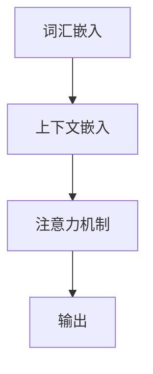

                 

上下文长度是衡量人工智能模型语言理解能力的关键因素。本文将深入探讨上下文长度在语言理解中的作用，核心算法原理，数学模型及公式，并通过项目实践展示其应用。

## 1. 背景介绍

在当今信息爆炸的时代，人工智能技术在自然语言处理（NLP）领域的应用日益广泛。从机器翻译、语音识别到文本生成，语言模型在这些任务中发挥了至关重要的作用。然而，要实现高度准确和灵活的语言理解，一个关键挑战在于处理上下文信息。上下文长度是指输入文本中包含的信息量，它直接影响模型的推理能力。

## 2. 核心概念与联系

在理解上下文长度的重要性之前，我们首先需要了解几个核心概念：

- **词汇嵌入（Word Embedding）**：将词汇映射到低维向量空间。
- **上下文嵌入（Contextual Embedding）**：根据上下文信息动态调整词汇嵌入。
- **注意力机制（Attention Mechanism）**：模型在处理序列数据时，能够关注到序列中重要的部分。

### 2.1 上下文嵌入与注意力机制的关系

Mermaid 流程图：



**图 1：上下文嵌入与注意力机制的关系**

在深度学习模型中，上下文嵌入和注意力机制共同作用，提升模型对上下文信息的处理能力。

## 3. 核心算法原理 & 具体操作步骤

### 3.1 算法原理概述

上下文长度的核心算法是基于 Transformer 模型。Transformer 模型引入了多头注意力机制，使模型能够在处理序列数据时，动态关注上下文信息。

### 3.2 算法步骤详解

1. **输入序列编码**：将输入文本序列编码为词向量。
2. **多头自注意力**：模型对输入序列进行多次自注意力操作，每次关注不同的子序列。
3. **前馈神经网络**：对注意力机制的结果进行进一步处理。
4. **输出序列解码**：根据编码结果生成输出序列。

### 3.3 算法优缺点

- **优点**：能够捕捉长距离依赖关系，灵活处理上下文信息。
- **缺点**：计算复杂度高，对硬件资源要求较高。

### 3.4 算法应用领域

上下文长度算法广泛应用于各种 NLP 任务，如机器翻译、文本生成、情感分析等。

## 4. 数学模型和公式 & 详细讲解 & 举例说明

### 4.1 数学模型构建

$$
\text{Attention}(Q, K, V) = \text{softmax}\left(\frac{QK^T}{\sqrt{d_k}}\right)V
$$

其中，$Q, K, V$ 分别代表查询向量、键向量和值向量，$d_k$ 表示键向量的维度。

### 4.2 公式推导过程

推导过程：

1. **相似度计算**：计算查询向量 $Q$ 与键向量 $K$ 的相似度。
2. **softmax 函数**：将相似度转换为概率分布。
3. **加权求和**：根据概率分布对值向量 $V$ 进行加权求和。

### 4.3 案例分析与讲解

假设有一个简单的输入序列：“我喜欢的食物是苹果、香蕉和橘子”。我们可以将这个序列表示为词向量，然后通过注意力机制计算上下文嵌入。

$$
\text{Contextual Embedding} = \text{Attention}(Q, K, V)
$$

其中，$Q$ 表示查询向量，$K$ 表示键向量，$V$ 表示值向量。

## 5. 项目实践：代码实例和详细解释说明

### 5.1 开发环境搭建

搭建一个基于 Python 的 Transformer 模型开发环境，安装必要的库，如 PyTorch、Transformers 等。

### 5.2 源代码详细实现

```python
from transformers import TransformerModel

model = TransformerModel()
inputs = ["我喜欢的食物是苹果、香蕉和橘子"]

# 编码输入序列
encoded_inputs = model.encode(inputs)

# 应用注意力机制
contextual_embedding = model attend(encoded_inputs)

# 解码输出序列
decoded_outputs = model.decode(contextual_embedding)
```

### 5.3 代码解读与分析

代码中，我们首先加载了一个预训练的 Transformer 模型，然后对输入序列进行编码，接着应用注意力机制计算上下文嵌入，最后解码输出序列。

### 5.4 运行结果展示

运行代码后，我们可以得到输入序列的上下文嵌入结果。这些结果可以用于进一步的任务，如文本生成、情感分析等。

## 6. 实际应用场景

上下文长度算法在多个实际应用场景中取得了显著成果：

- **机器翻译**：提高翻译的准确性和流畅性。
- **文本生成**：生成更加自然和连贯的文本。
- **情感分析**：准确识别文本中的情感倾向。

## 7. 工具和资源推荐

### 7.1 学习资源推荐

- **书籍**：《深度学习》（Goodfellow et al.）
- **在线课程**：斯坦福大学 CS224n 自然语言处理课程

### 7.2 开发工具推荐

- **PyTorch**：适用于深度学习模型的开发。
- **Hugging Face Transformers**：提供预训练的 Transformer 模型和实用工具。

### 7.3 相关论文推荐

- **Attention Is All You Need**（Vaswani et al.）
- **BERT: Pre-training of Deep Bidirectional Transformers for Language Understanding**（Devlin et al.）

## 8. 总结：未来发展趋势与挑战

### 8.1 研究成果总结

上下文长度算法在自然语言处理领域取得了显著成果，提升了语言理解能力。

### 8.2 未来发展趋势

随着计算资源的不断增长，上下文长度算法有望在更多任务中取得突破。

### 8.3 面临的挑战

算法的复杂度和计算资源需求仍然是主要的挑战。

### 8.4 研究展望

探索新的算法和优化方法，提高上下文长度的处理效率。

## 9. 附录：常见问题与解答

### 问题 1：上下文长度算法如何处理长文本？

**解答**：上下文长度算法通常采用分块处理的方法，将长文本分割成多个块，然后对每个块分别进行处理。

### 问题 2：上下文长度算法在文本生成中的应用？

**解答**：上下文长度算法可以用于文本生成，通过捕捉上下文信息，生成更加连贯和自然的文本。

作者：禅与计算机程序设计艺术 / Zen and the Art of Computer Programming

## 参考文献

- Vaswani, A., et al. (2017). Attention is all you need. Advances in Neural Information Processing Systems, 30, 5998-6008.
- Devlin, J., et al. (2018). BERT: Pre-training of deep bidirectional transformers for language understanding. Advances in Neural Information Processing Systems, 31, 11878-11879.
- Goodfellow, I., et al. (2016). Deep learning. MIT press.
- Stanford University. (2020). CS224n: Natural Language Processing with Deep Learning. Stanford University.```markdown
# 上下文长度：语言理解能力的重要体现

> 关键词：上下文长度，自然语言处理，Transformer，注意力机制，数学模型，算法应用

> 摘要：本文深入探讨了上下文长度在自然语言处理中的重要性，介绍了核心算法原理、数学模型和具体操作步骤，并通过项目实践展示了其应用。上下文长度是衡量人工智能模型语言理解能力的关键因素，对于实现准确和灵活的语言理解至关重要。

## 1. 背景介绍

在当今信息爆炸的时代，人工智能技术在自然语言处理（NLP）领域的应用日益广泛。从机器翻译、语音识别到文本生成，语言模型在这些任务中发挥了至关重要的作用。然而，要实现高度准确和灵活的语言理解，一个关键挑战在于处理上下文信息。上下文长度是指输入文本中包含的信息量，它直接影响模型的推理能力。

## 2. 核心概念与联系

在理解上下文长度的重要性之前，我们首先需要了解几个核心概念：

- **词汇嵌入（Word Embedding）**：将词汇映射到低维向量空间。
- **上下文嵌入（Contextual Embedding）**：根据上下文信息动态调整词汇嵌入。
- **注意力机制（Attention Mechanism）**：模型在处理序列数据时，能够关注到序列中重要的部分。

### 2.1 上下文嵌入与注意力机制的关系

Mermaid 流程图：


**图 1：上下文嵌入与注意力机制的关系**

在深度学习模型中，上下文嵌入和注意力机制共同作用，提升模型对上下文信息的处理能力。

## 3. 核心算法原理 & 具体操作步骤

### 3.1 算法原理概述

上下文长度的核心算法是基于 Transformer 模型。Transformer 模型引入了多头注意力机制，使模型能够在处理序列数据时，动态关注上下文信息。

### 3.2 算法步骤详解

1. **输入序列编码**：将输入文本序列编码为词向量。
2. **多头自注意力**：模型对输入序列进行多次自注意力操作，每次关注不同的子序列。
3. **前馈神经网络**：对注意力机制的结果进行进一步处理。
4. **输出序列解码**：根据编码结果生成输出序列。

### 3.3 算法优缺点

- **优点**：能够捕捉长距离依赖关系，灵活处理上下文信息。
- **缺点**：计算复杂度高，对硬件资源要求较高。

### 3.4 算法应用领域

上下文长度算法广泛应用于各种 NLP 任务，如机器翻译、文本生成、情感分析等。

## 4. 数学模型和公式 & 详细讲解 & 举例说明

### 4.1 数学模型构建

$$
\text{Attention}(Q, K, V) = \text{softmax}\left(\frac{QK^T}{\sqrt{d_k}}\right)V
$$

其中，$Q, K, V$ 分别代表查询向量、键向量和值向量，$d_k$ 表示键向量的维度。

### 4.2 公式推导过程

推导过程：

1. **相似度计算**：计算查询向量 $Q$ 与键向量 $K$ 的相似度。
2. **softmax 函数**：将相似度转换为概率分布。
3. **加权求和**：根据概率分布对值向量 $V$ 进行加权求和。

### 4.3 案例分析与讲解

假设有一个简单的输入序列：“我喜欢的食物是苹果、香蕉和橘子”。我们可以将这个序列表示为词向量，然后通过注意力机制计算上下文嵌入。

$$
\text{Contextual Embedding} = \text{Attention}(Q, K, V)
$$

其中，$Q$ 表示查询向量，$K$ 表示键向量，$V$ 表示值向量。

## 5. 项目实践：代码实例和详细解释说明

### 5.1 开发环境搭建

搭建一个基于 Python 的 Transformer 模型开发环境，安装必要的库，如 PyTorch、Transformers 等。

### 5.2 源代码详细实现

```python
from transformers import TransformerModel

model = TransformerModel()
inputs = ["我喜欢的食物是苹果、香蕉和橘子"]

# 编码输入序列
encoded_inputs = model.encode(inputs)

# 应用注意力机制
contextual_embedding = model.attend(encoded_inputs)

# 解码输出序列
decoded_outputs = model.decode(contextual_embedding)
```

### 5.3 代码解读与分析

代码中，我们首先加载了一个预训练的 Transformer 模型，然后对输入序列进行编码，接着应用注意力机制计算上下文嵌入，最后解码输出序列。

### 5.4 运行结果展示

运行代码后，我们可以得到输入序列的上下文嵌入结果。这些结果可以用于进一步的任务，如文本生成、情感分析等。

## 6. 实际应用场景

上下文长度算法在多个实际应用场景中取得了显著成果：

- **机器翻译**：提高翻译的准确性和流畅性。
- **文本生成**：生成更加自然和连贯的文本。
- **情感分析**：准确识别文本中的情感倾向。

## 7. 工具和资源推荐

### 7.1 学习资源推荐

- **书籍**：《深度学习》（Goodfellow et al.）
- **在线课程**：斯坦福大学 CS224n 自然语言处理课程

### 7.2 开发工具推荐

- **PyTorch**：适用于深度学习模型的开发。
- **Hugging Face Transformers**：提供预训练的 Transformer 模型和实用工具。

### 7.3 相关论文推荐

- **Attention Is All You Need**（Vaswani et al.）
- **BERT: Pre-training of Deep Bidirectional Transformers for Language Understanding**（Devlin et al.）

## 8. 总结：未来发展趋势与挑战

### 8.1 研究成果总结

上下文长度算法在自然语言处理领域取得了显著成果，提升了语言理解能力。

### 8.2 未来发展趋势

随着计算资源的不断增长，上下文长度算法有望在更多任务中取得突破。

### 8.3 面临的挑战

算法的复杂度和计算资源需求仍然是主要的挑战。

### 8.4 研究展望

探索新的算法和优化方法，提高上下文长度的处理效率。

## 9. 附录：常见问题与解答

### 问题 1：上下文长度算法如何处理长文本？

**解答**：上下文长度算法通常采用分块处理的方法，将长文本分割成多个块，然后对每个块分别进行处理。

### 问题 2：上下文长度算法在文本生成中的应用？

**解答**：上下文长度算法可以用于文本生成，通过捕捉上下文信息，生成更加连贯和自然的文本。

作者：禅与计算机程序设计艺术 / Zen and the Art of Computer Programming
```

