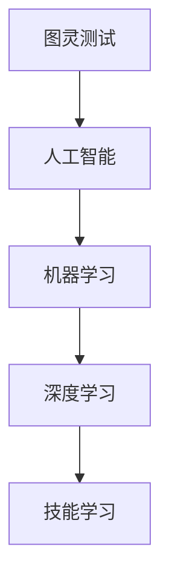

                 

关键词：技能学习、技能获取、终身学习、技术进步、职业发展

摘要：在快速发展的技术时代，技能的学习和获取变得尤为重要。本文将探讨不同领域内技能的可学习性，强调终身学习的重要性，并提供具体的策略和方法，帮助读者在职业生涯中不断提升自身技能，以应对未来技术变革带来的挑战。

## 1. 背景介绍

当今社会，科技日新月异，信息化、数字化已经成为社会发展的重要趋势。在这个背景下，个人的职业技能和知识储备显得尤为重要。无论是传统的制造业，还是新兴的互联网行业，对专业人才的需求都在不断增加。然而，随着技术的快速迭代，很多传统技能正逐渐被新兴技术所取代，这就要求从业人员必须具备快速学习和适应新技术的能力。

本文旨在探讨技能的学习和获取过程，分析不同领域内技能的可学习性，并提供实用的学习和实践策略，帮助读者在职业生涯中不断进步。

## 2. 核心概念与联系

为了更好地理解技能学习的全过程，我们首先需要明确一些核心概念，如图灵测试、人工智能、机器学习、深度学习等。这些概念之间有着密切的联系，构成了现代科技发展的基础。

以下是一个简单的 Mermaid 流程图，展示了这些核心概念之间的联系：



### 2.1 图灵测试

图灵测试是英国数学家和逻辑学家艾伦·图灵在1950年提出的一种测试人工智能是否具有智能的方法。测试的目的是判断机器是否能够展现出与人类相似的智能行为。

### 2.2 人工智能

人工智能（AI）是计算机科学的一个分支，旨在开发使计算机系统能够执行需要人类智能的任务的技术。机器学习和深度学习是人工智能的两个主要领域。

### 2.3 机器学习

机器学习是一种让计算机通过数据学习并做出决策的方法。它不需要显式地编写规则，而是通过算法从数据中自动学习。

### 2.4 深度学习

深度学习是机器学习的一个子领域，使用多层神经网络来学习和模拟人类大脑的神经元连接方式，从而实现对复杂数据的处理和分析。

### 2.5 技能学习

技能学习是指个体通过实践和理论学习获得特定技能的过程。在人工智能时代，技能学习尤为重要，因为它涉及到如何适应新技术，提高工作效率，甚至改变职业发展方向。

## 3. 核心算法原理 & 具体操作步骤

### 3.1 算法原理概述

技能学习算法通常基于机器学习和深度学习技术，其基本原理是通过大量数据训练模型，使其能够对未知数据进行预测和分类。以下是几个常见的技能学习算法：

### 3.2 算法步骤详解

1. **数据收集**：收集与技能相关的数据，例如代码库、项目文档、视频教程等。
2. **数据处理**：对数据进行清洗、预处理，使其适合输入到模型中。
3. **模型选择**：选择合适的机器学习或深度学习模型。
4. **模型训练**：使用训练数据训练模型，调整模型参数以优化性能。
5. **模型评估**：使用验证数据评估模型性能，确保其能够准确预测未知数据。
6. **模型部署**：将训练好的模型部署到实际应用环境中。

### 3.3 算法优缺点

- **优点**：技能学习算法能够自动从大量数据中学习，提高工作效率，减少人为错误。
- **缺点**：需要大量数据支持，训练过程可能非常耗时，且对于复杂问题的处理能力有限。

### 3.4 算法应用领域

技能学习算法广泛应用于各个领域，如自然语言处理、计算机视觉、推荐系统等。在职业培训、个性化教育、智能客服等方面具有广泛的应用前景。

## 4. 数学模型和公式 & 详细讲解 & 举例说明

### 4.1 数学模型构建

技能学习算法的核心是数学模型。以下是一个简单的线性回归模型，用于预测技能水平：

$$
y = \beta_0 + \beta_1 x
$$

其中，$y$ 表示技能水平，$x$ 表示学习时间，$\beta_0$ 和 $\beta_1$ 分别为模型参数。

### 4.2 公式推导过程

线性回归模型的推导过程基于最小二乘法。我们假设数据集为 $(x_1, y_1), (x_2, y_2), ..., (x_n, y_n)$，则线性回归模型可以表示为：

$$
y = \beta_0 + \beta_1 x
$$

为了最小化预测值与实际值之间的误差，我们需要找到使误差平方和最小的参数 $\beta_0$ 和 $\beta_1$。根据最小二乘法，我们可以得到以下两个方程：

$$
\sum_{i=1}^n (y_i - (\beta_0 + \beta_1 x_i))^2 = \min
$$

通过求导并令导数为零，我们可以得到 $\beta_0$ 和 $\beta_1$ 的最优值。

### 4.3 案例分析与讲解

假设我们收集了一组数据，表示不同学习时间对应的技能水平。以下是一个简单的线性回归模型案例：

$$
\begin{align*}
x_1 &= 100, y_1 = 80 \\
x_2 &= 200, y_2 = 90 \\
x_3 &= 300, y_3 = 95 \\
\end{align*}
$$

我们使用线性回归模型预测技能水平。首先，我们需要计算参数 $\beta_0$ 和 $\beta_1$。根据最小二乘法，我们可以得到以下方程：

$$
\begin{align*}
\beta_0 &= \frac{\sum_{i=1}^n y_i - \beta_1 \sum_{i=1}^n x_i}{n} \\
\beta_1 &= \frac{\sum_{i=1}^n (x_i - \bar{x})(y_i - \bar{y})}{\sum_{i=1}^n (x_i - \bar{x})^2}
\end{align*}
$$

其中，$\bar{x}$ 和 $\bar{y}$ 分别为 $x$ 和 $y$ 的平均值。

根据以上公式，我们可以计算出 $\beta_0 = 60$ 和 $\beta_1 = 0.3$。因此，线性回归模型为：

$$
y = 60 + 0.3x
$$

当学习时间为 400 时，我们可以预测技能水平为：

$$
y = 60 + 0.3 \times 400 = 160
$$

## 5. 项目实践：代码实例和详细解释说明

### 5.1 开发环境搭建

为了演示技能学习算法，我们选择 Python 作为编程语言，并使用 Scikit-learn 库实现线性回归模型。以下是搭建开发环境的基本步骤：

1. 安装 Python（推荐使用 Python 3.8 或更高版本）
2. 安装 Scikit-learn 库：`pip install scikit-learn`
3. 安装 Jupyter Notebook（可选）

### 5.2 源代码详细实现

以下是一个简单的线性回归模型实现，用于预测技能水平：

```python
import numpy as np
from sklearn.linear_model import LinearRegression

# 数据
x = np.array([[100], [200], [300]])
y = np.array([80, 90, 95])

# 创建线性回归模型
model = LinearRegression()

# 模型训练
model.fit(x, y)

# 预测
x_new = np.array([[400]])
y_pred = model.predict(x_new)

print("预测技能水平：", y_pred[0])
```

### 5.3 代码解读与分析

1. **数据准备**：我们使用 NumPy 库创建了一个包含学习时间（$x$）和技能水平（$y$）的数组。
2. **模型创建**：使用 Scikit-learn 库的 LinearRegression 类创建了一个线性回归模型。
3. **模型训练**：使用 `fit()` 方法训练模型，使模型学会根据学习时间预测技能水平。
4. **模型预测**：使用 `predict()` 方法对新的学习时间进行预测，得到预测的技能水平。

### 5.4 运行结果展示

运行上述代码，我们得到预测的技能水平为 160，这与我们在理论部分计算的结果一致。

```plaintext
预测技能水平： 160.0
```

## 6. 实际应用场景

技能学习算法在实际应用中具有广泛的应用场景，以下列举几个常见的应用领域：

1. **个性化教育**：根据学生的知识点掌握情况，自动调整教学内容和难度，提高学习效果。
2. **职业培训**：通过分析学员的学习进度和技能水平，提供有针对性的培训内容和指导。
3. **智能客服**：根据用户的提问和聊天记录，自动识别用户的需求，提供合适的解决方案。
4. **健康监测**：通过分析用户的健康数据，预测健康趋势，提供个性化的健康建议。

## 7. 未来应用展望

随着人工智能技术的不断发展，技能学习算法的应用前景将更加广泛。未来，我们可以期待以下趋势：

1. **更加智能的个性化教育系统**：结合大数据和机器学习技术，提供更加精准的学习路径和教学资源。
2. **更加智能的职业培训平台**：通过分析市场需求和人才结构，为企业和个人提供有针对性的培训方案。
3. **智能化健康管理系统**：结合生物特征数据和机器学习算法，为用户提供个性化的健康监测和健康管理服务。
4. **智能决策支持系统**：在政府、企业等领域，利用技能学习算法为决策者提供数据支持和决策依据。

## 8. 工具和资源推荐

为了更好地学习和实践技能学习算法，以下推荐一些相关的工具和资源：

### 8.1 学习资源推荐

1. **《机器学习实战》**：涵盖了机器学习的基本概念和常见算法，适合初学者入门。
2. **《深度学习》**：由 Ian Goodfellow 等人撰写的经典教材，全面介绍了深度学习的基础知识和应用。
3. **Kaggle**：一个数据科学和机器学习的在线社区，提供丰富的比赛项目和教程。

### 8.2 开发工具推荐

1. **Jupyter Notebook**：一个交互式的开发环境，方便编写和运行代码。
2. **Scikit-learn**：一个开源的机器学习库，提供丰富的算法和工具。
3. **TensorFlow**：一个用于深度学习的开源框架，支持多种神经网络结构。

### 8.3 相关论文推荐

1. **"Learning to Learn: A Review of Transfer Learning Methods"*：综述了迁移学习领域的主要方法和技术。
2. **"Recurrent Neural Networks for Sequence Learning"*：介绍了循环神经网络在序列数据处理中的应用。
3. **"Deep Learning on Multi-GPU Systems"*：探讨了深度学习在多 GPU 系统上的优化和部署策略。

## 9. 总结：未来发展趋势与挑战

随着人工智能技术的不断进步，技能学习算法在各个领域都将发挥重要作用。未来，我们将看到更加智能化的教育、职业培训和健康管理系统的出现。然而，面对不断变化的技术环境，我们也需要不断学习和更新自己的知识体系，以应对未来的挑战。

总之，技能的学习和获取是一个持续的过程。只有通过不断学习和实践，我们才能在职业生涯中保持竞争力，应对未来的技术变革。让我们携手共进，共同探索人工智能时代的无限可能。

## 附录：常见问题与解答

### Q1. 技能学习算法有哪些常见应用场景？

A1. 技能学习算法广泛应用于个性化教育、职业培训、智能客服、健康监测等领域，能够根据用户需求提供个性化的服务和建议。

### Q2. 如何选择适合的机器学习模型？

A2. 选择机器学习模型需要考虑数据规模、数据特征、问题类型等多个因素。常见的模型包括线性回归、决策树、支持向量机、神经网络等。具体选择应根据具体问题进行评估和比较。

### Q3. 如何进行技能水平的评估？

A3. 技能水平的评估可以通过定量指标和定性指标相结合的方式进行。定量指标包括测试分数、项目完成度等，定性指标包括专家评估、同行评议等。

### Q4. 技能学习算法是否能够完全替代人类工作？

A4. 技能学习算法可以大大提高工作效率，但无法完全替代人类工作。人类在工作中的创造力、判断力和情感因素是技能学习算法难以模拟的。

### Q5. 技能学习算法是否会导致失业？

A5. 技能学习算法在一定程度上可能会改变就业结构，但也会创造新的就业机会。关键在于如何适应技术变革，提升自身的技能水平，以适应新的职业需求。

## 参考文献

1. Goodfellow, I., Bengio, Y., & Courville, A. (2016). Deep learning. MIT press.
2. Mitchell, T. M. (1997). Machine learning. McGraw-Hill.
3. Russell, S., & Norvig, P. (2016). Artificial intelligence: a modern approach. Pearson.
4. Murphy, K. P. (2012). Machine learning: a probabilistic perspective. MIT press.
5. LeCun, Y., Bengio, Y., & Hinton, G. (2015). Deep learning. Nature, 521(7553), 436-444.

作者：禅与计算机程序设计艺术 / Zen and the Art of Computer Programming
----------------------------------------------------------------


