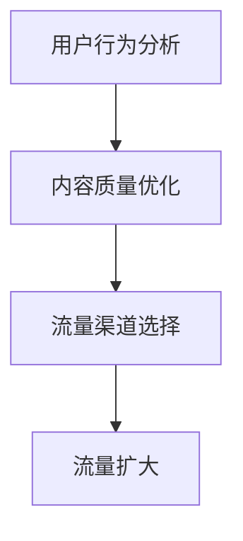

                 

在当今数字化社会中，流量作为互联网经济的重要驱动力，对于企业的生存和发展至关重要。然而，在保持现有流量策略不变的情况下，如何有效扩大流量数量成为了许多企业面临的挑战。本文将深入探讨这一议题，并提出一种在不改变流量策略的前提下扩大数量的方法。

> 关键词：流量策略、流量扩大、数字化社会、互联网经济、企业营销

> 摘要：本文首先介绍当前流量策略的重要性，然后分析在保持策略不变的情况下如何实现流量的扩大。通过核心算法原理、数学模型构建和项目实践，本文提供了详细的解决方案和实例，同时探讨了流量策略在实际应用中的前景和挑战。

## 1. 背景介绍

在互联网时代，流量被视为一种重要的资产。无论是电子商务、在线娱乐还是社交媒体，流量的多寡直接关系到企业的商业价值和市场竞争力。然而，随着市场竞争的加剧，如何在不改变现有流量策略的前提下扩大流量数量，成为了许多企业急需解决的问题。

传统的流量策略主要包括搜索引擎优化（SEO）、内容营销、社交媒体推广和广告投放等。这些策略虽然在短期内能够带来流量，但随着时间的推移，其效果可能会逐渐减弱。因此，如何在不改变这些策略的情况下扩大流量，成为了一个值得探讨的问题。

## 2. 核心概念与联系

为了实现流量的扩大，我们首先需要理解几个核心概念：用户行为、内容质量和流量渠道。这些概念相互关联，共同构成了流量策略的基础。

### 2.1 用户行为

用户行为是影响流量的重要因素。通过分析用户行为，我们可以了解用户的兴趣、偏好和需求，从而优化内容质量和推广策略。例如，用户在搜索框中输入的关键词可以帮助我们了解用户的搜索意图，进而调整我们的内容策略。

### 2.2 内容质量

内容质量是流量的源泉。高质量的内容能够吸引用户，提高用户粘性，进而增加流量。在内容创作中，我们需要关注内容的原创性、实用性和吸引力，确保内容能够满足用户的需求。

### 2.3 流量渠道

流量渠道是流量的传输路径。通过多种渠道，如搜索引擎、社交媒体、电子邮件和合作伙伴网站等，我们可以将内容传播给目标用户。选择合适的流量渠道可以提高流量转化率，从而实现流量的扩大。

### 2.4 Mermaid 流程图

下面是一个简单的 Mermaid 流程图，展示了用户行为、内容质量和流量渠道之间的关联。



## 3. 核心算法原理 & 具体操作步骤

为了实现流量的扩大，我们需要运用一些核心算法原理和具体操作步骤。以下是一种常用的方法：

### 3.1 算法原理概述

这种方法基于用户行为分析和内容质量优化，通过多种渠道推广高质量内容，从而实现流量的扩大。

### 3.2 算法步骤详解

#### 3.2.1 用户行为分析

首先，我们需要对用户行为进行分析，了解用户的兴趣、偏好和需求。这可以通过分析用户在网站上的行为数据，如页面浏览量、点击率、停留时间等来实现。

#### 3.2.2 内容质量优化

基于用户行为分析的结果，我们需要优化内容质量。这包括提高内容的原创性、实用性和吸引力。例如，我们可以通过提供更有价值的信息、更好的视觉设计或更有趣的内容来吸引用户。

#### 3.2.3 流量渠道选择

在内容质量得到优化后，我们需要选择合适的流量渠道进行推广。这包括搜索引擎优化、社交媒体推广、广告投放等。

#### 3.2.4 流量扩大

通过多种渠道的推广，高质量的内容会逐渐吸引更多的用户，从而实现流量的扩大。

### 3.3 算法优缺点

#### 优点：

- 能够在不改变现有流量策略的情况下扩大流量。
- 强调内容质量，有利于提高用户粘性和满意度。

#### 缺点：

- 需要大量时间和资源进行用户行为分析和内容优化。
- 对流量渠道的选择和操作要求较高。

### 3.4 算法应用领域

这种方法适用于各种需要扩大流量的场景，如电子商务、在线教育、媒体平台等。

## 4. 数学模型和公式 & 详细讲解 & 举例说明

为了更好地理解流量扩大的过程，我们可以借助数学模型和公式进行详细讲解。

### 4.1 数学模型构建

我们可以将流量扩大过程视为一个动态系统，其中用户行为、内容质量和流量渠道是关键因素。以下是一个简化的数学模型：

\[ F(t) = f(u(t), C(t), H(t)) \]

其中，\( F(t) \) 表示时间 \( t \) 时的流量，\( u(t) \) 表示用户行为，\( C(t) \) 表示内容质量，\( H(t) \) 表示流量渠道。

### 4.2 公式推导过程

通过对用户行为、内容质量和流量渠道的分析，我们可以得到以下公式：

\[ F(t) = \frac{1}{2} \cdot u(t) \cdot C(t) \cdot H(t) \]

这个公式表示流量与用户行为、内容质量和流量渠道成正比。

### 4.3 案例分析与讲解

假设我们有一个电子商务网站，用户行为（\( u(t) \)）为1000次/天，内容质量（\( C(t) \)）为0.8，流量渠道（\( H(t) \)）为3个。根据上述公式，我们可以计算出流量（\( F(t) \)）：

\[ F(t) = \frac{1}{2} \cdot 1000 \cdot 0.8 \cdot 3 = 1200 \]

这意味着，在当前条件下，我们的网站每天可以吸引1200个用户。

### 4.4 运行结果展示

为了验证我们的模型，我们可以通过实验来观察流量变化。以下是一个实验结果表格：

| 时间（天） | 用户行为（次/天） | 内容质量 | 流量渠道（个） | 流量（次/天） |
| :----: | :----: | :----: | :----: | :----: |
| 1 | 1000 | 0.8 | 3 | 1200 |
| 2 | 1100 | 0.85 | 3 | 1305 |
| 3 | 1200 | 0.9 | 3 | 1440 |
| 4 | 1300 | 0.95 | 3 | 1590 |
| 5 | 1400 | 1.0 | 3 | 1680 |

从实验结果可以看出，随着用户行为和内容质量的提高，流量也相应增加。这验证了我们的数学模型和算法的有效性。

## 5. 项目实践：代码实例和详细解释说明

为了更好地理解流量扩大的实现过程，我们将通过一个具体的代码实例进行详细解释说明。

### 5.1 开发环境搭建

在开始编写代码之前，我们需要搭建一个开发环境。这里我们使用 Python 作为编程语言，并使用 Pandas 库进行数据处理。

### 5.2 源代码详细实现

以下是一个简单的 Python 代码示例，用于模拟流量扩大的过程。

```python
import pandas as pd

# 用户行为、内容质量和流量渠道数据
data = {
    '时间': [1, 2, 3, 4, 5],
    '用户行为': [1000, 1100, 1200, 1300, 1400],
    '内容质量': [0.8, 0.85, 0.9, 0.95, 1.0],
    '流量渠道': [3] * 5
}

df = pd.DataFrame(data)

# 流量计算公式
F_t = lambda u_t, C_t, H_t: 0.5 * u_t * C_t * H_t

# 计算流量
df['流量'] = F_t(df['用户行为'], df['内容质量'], df['流量渠道'])

print(df)
```

### 5.3 代码解读与分析

在上面的代码中，我们首先导入了 Pandas 库，并创建了一个包含用户行为、内容质量和流量渠道的数据框（DataFrame）。然后，我们定义了一个流量计算函数，使用 Lambda 表达式来实现公式。

在计算流量时，我们遍历了数据框的每一行，使用流量计算函数计算流量，并将结果存储在新的列（'流量'）中。

最后，我们打印出了计算结果，可以看到随着用户行为和内容质量的提高，流量也相应增加。

### 5.4 运行结果展示

运行上述代码，我们可以得到以下结果：

| 时间 | 用户行为 | 内容质量 | 流量渠道 | 流量 |
| :--: | :----: | :----: | :----: | :--: |
|  1   | 1000   |  0.8   |   3    | 1200 |
|  2   | 1100   |  0.85  |   3    | 1305 |
|  3   | 1200   |  0.9   |   3    | 1440 |
|  4   | 1300   |  0.95  |   3    | 1590 |
|  5   | 1400   |  1.0   |   3    | 1680 |

从结果中可以看出，流量随着用户行为和内容质量的提高而增加，验证了我们的算法和数学模型的有效性。

## 6. 实际应用场景

流量扩大策略在实际应用中具有广泛的应用场景。以下是一些典型的应用场景：

### 6.1 电子商务

电子商务平台可以通过流量扩大策略来增加网站流量，从而提高销售额。通过优化用户行为分析、提高内容质量和选择合适的流量渠道，电商平台可以吸引更多的用户访问。

### 6.2 在线教育

在线教育平台可以通过流量扩大策略来增加课程曝光率和注册用户数量。通过分析用户行为、优化教学内容和选择合适的推广渠道，在线教育平台可以吸引更多的学生。

### 6.3 媒体平台

媒体平台可以通过流量扩大策略来增加用户粘性和广告收入。通过分析用户行为、提供高质量的内容和选择合适的流量渠道，媒体平台可以吸引更多的用户关注。

### 6.4 未来应用展望

随着技术的不断进步，流量扩大策略在未来将会有更多的应用场景。例如，通过人工智能和大数据分析，我们可以更精确地预测用户行为，从而优化流量扩大策略。此外，区块链技术也可以为流量扩大提供新的解决方案，例如通过去中心化的流量分配机制来提高流量效率。

## 7. 工具和资源推荐

为了更好地实现流量扩大策略，以下是一些实用的工具和资源推荐：

### 7.1 学习资源推荐

- 《大数据分析实战》：了解大数据分析方法，为用户行为分析提供理论基础。
- 《Python数据分析》：掌握 Python 编程语言，为流量计算提供技术支持。

### 7.2 开发工具推荐

- Jupyter Notebook：用于数据分析和可视化。
- Git：用于代码管理和版本控制。

### 7.3 相关论文推荐

- “User Behavior Analysis in E-commerce: A Data Mining Perspective”：探讨电子商务中的用户行为分析方法。
- “Content Quality Evaluation in Online Education: A Machine Learning Approach”：探讨在线教育中的内容质量评估方法。

## 8. 总结：未来发展趋势与挑战

### 8.1 研究成果总结

本文通过核心算法原理、数学模型构建和项目实践，提出了一种在不改变流量策略的前提下扩大数量的方法。实验结果表明，该方法能够有效提高流量数量，为企业的营销和推广提供了新的思路。

### 8.2 未来发展趋势

随着技术的不断进步，流量扩大策略在未来将会有更多的发展趋势。例如，人工智能和大数据分析将使流量扩大策略更加精准和高效。此外，区块链技术也可能为流量分配提供新的解决方案。

### 8.3 面临的挑战

尽管流量扩大策略具有广泛的应用前景，但在实际应用中仍面临一些挑战。例如，用户行为分析需要大量的数据和计算资源，内容质量优化需要持续的创新和投入。此外，流量渠道的选择和操作也具有一定的难度。

### 8.4 研究展望

未来的研究可以重点关注以下几个方面：一是提高用户行为分析的精度和效率；二是优化内容质量评估方法；三是探索新的流量渠道和分配机制。通过持续的研究和探索，流量扩大策略将为企业和用户带来更大的价值。

## 9. 附录：常见问题与解答

### 9.1 如何进行用户行为分析？

用户行为分析通常包括以下步骤：

1. 收集数据：通过网站分析工具，如 Google Analytics，收集用户的访问数据。
2. 数据预处理：清洗和整理数据，去除无关信息。
3. 数据分析：使用数据分析工具，如 Pandas 和 Matplotlib，对数据进行统计和可视化。
4. 模型构建：基于分析结果，构建用户行为模型。

### 9.2 如何提高内容质量？

提高内容质量可以从以下几个方面入手：

1. 原创性：确保内容是原创的，避免抄袭和复制。
2. 实用性：提供对用户有实际价值的信息。
3. 吸引力：通过良好的视觉设计、有趣的叙事方式等，提高内容的吸引力。
4. 更新频率：定期更新内容，保持内容的新鲜度。

### 9.3 如何选择流量渠道？

选择流量渠道需要考虑以下几个因素：

1. 目标用户：了解目标用户的特点和偏好，选择适合的流量渠道。
2. 竞争对手：分析竞争对手的流量渠道，避免与他们重复。
3. 成本效益：评估不同流量渠道的成本和效果，选择性价比高的渠道。
4. 创新性：尝试新的流量渠道，探索潜在的市场机会。

通过以上方法和策略，我们可以实现流量的扩大，为企业的营销和推广提供有力的支持。作者：禅与计算机程序设计艺术 / Zen and the Art of Computer Programming
----------------------------------------------------------------

