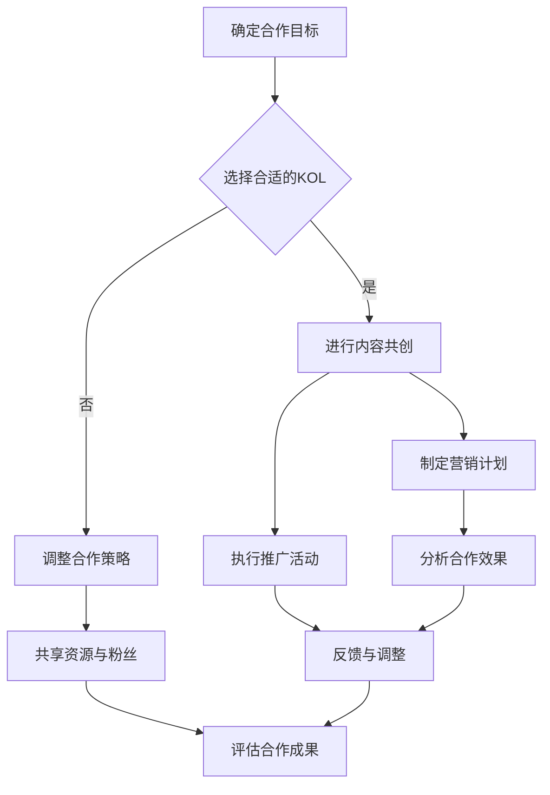

                 

关键词：KOL合作、受众群体、社交媒体、品牌影响力、内容共创、合作策略、IT领域

> 摘要：在当今信息化时代，知识分享和传播变得更加重要。KOL（Key Opinion Leader，关键意见领袖）在IT领域拥有巨大的影响力和广泛的受众群体。本文将探讨KOL合作的优势，分析如何与其他KOL合作来扩大受众群体，提高品牌影响力，并分享一些成功案例和实践经验。

## 1. 背景介绍

随着互联网的普及和发展，社交媒体平台成为人们获取信息、交流和分享的主要渠道。在这个信息爆炸的时代，人们对于高质量内容的渴求愈发强烈。KOL作为特定领域的权威人士或意见领袖，他们在社交媒体上拥有庞大的粉丝基础和强大的影响力，能够为品牌和项目带来可观的流量和关注。

然而，单靠一个KOL的力量是有限的。为了实现更大的影响力和更广泛的受众覆盖，与其他KOL合作成为一种重要的策略。这种合作不仅可以共享资源和粉丝群体，还可以通过内容的共创和互补，实现更大的品牌价值和市场影响力。

## 2. 核心概念与联系

### 2.1 KOL合作的核心概念

KOL合作是指两个或多个在特定领域具有影响力的意见领袖，通过共同创建内容、举办活动或进行营销推广等方式，实现资源共享、互利共赢的一种合作模式。

### 2.2 KOL合作的联系

KOL合作的核心联系在于以下几个方面：

1. **受众群体互补**：不同的KOL拥有不同的粉丝群体，通过合作可以实现受众群体的互补和扩大。
2. **内容共创**：KOL之间的合作可以产生更具创意和影响力的内容，提高内容的吸引力和传播力。
3. **品牌联合**：合作双方可以在品牌形象、营销策略等方面进行联合，提升品牌的影响力和市场认知度。
4. **资源共享**：合作双方可以共享资源，如内容制作资源、推广资源等，降低成本，提高效率。

### 2.3 Mermaid 流程图



## 3. 核心算法原理 & 具体操作步骤

### 3.1 算法原理概述

KOL合作的核心算法原理在于“资源整合”和“受众扩展”。通过与其他KOL合作，可以整合各自的优势资源，如内容创作、推广渠道、粉丝群体等，从而实现1+1>2的效果。

### 3.2 算法步骤详解

1. **确定合作目标**：明确合作的目的和预期成果，如扩大受众群体、提升品牌知名度、实现销售转化等。
2. **选择合适的KOL**：根据合作目标，选择在特定领域具有影响力、受众群体互补的KOL进行合作。
3. **进行内容共创**：KOL之间共同策划和创作内容，确保内容的创意和质量。
4. **制定营销计划**：根据合作目标和内容，制定详细的营销推广计划，包括推广渠道、时间安排、预算分配等。
5. **执行推广活动**：按照营销计划，开展推广活动，如发布内容、互动交流、活动推广等。
6. **分析合作效果**：通过数据分析，评估合作的效果和成果，包括受众覆盖、互动率、转化率等。
7. **反馈与调整**：根据分析结果，对合作策略和推广活动进行反馈和调整，以优化合作效果。
8. **评估合作成果**：最终评估合作的成果，包括品牌影响力、市场份额、销售额等。

### 3.3 算法优缺点

#### 优点

- **资源共享**：通过合作，可以实现资源的整合和共享，降低成本，提高效率。
- **受众扩展**：与其他KOL合作，可以扩大受众群体，提高品牌曝光度。
- **内容共创**：KOL之间的合作可以产生更具创意和影响力的内容，提高内容的吸引力。
- **品牌联合**：合作双方可以在品牌形象、营销策略等方面进行联合，提升品牌的影响力和市场认知度。

#### 缺点

- **协调难度**：KOL之间的合作需要协调和沟通，难度较大。
- **利益分配**：合作各方的利益分配需要合理，否则可能导致合作不稳定。
- **风险共担**：合作双方需要共同承担风险，如内容质量、推广效果等。

### 3.4 算法应用领域

KOL合作算法在多个领域具有广泛的应用，如电商、教育、科技等。以下是几个典型的应用领域：

- **电商领域**：KOL合作可以帮助电商平台扩大用户群体，提升销售业绩。
- **教育领域**：KOL合作可以促进教育资源的整合和共享，提高教育质量和普及率。
- **科技领域**：KOL合作可以推动科技创新和传播，促进科技产业的快速发展。

## 4. 数学模型和公式 & 详细讲解 & 举例说明

### 4.1 数学模型构建

假设有两个KOL，A和B，他们在特定领域的影响力可以用影响力指数来衡量，分别为I(A)和I(B)。合作后的总影响力指数可以表示为：

\[ I(A \text{ 和 } B) = I(A) + I(B) - \Delta I \]

其中，\(\Delta I\)表示合作后损失的影响力指数，通常是由于合作双方存在竞争关系或资源分配不均导致的。

### 4.2 公式推导过程

首先，考虑单个KOL的影响力指数I(A)和I(B)，它们分别表示KOL A 和 B 在特定领域的影响力。当A和B合作时，他们的影响力指数会发生变化。

- **合作前**：

\[ I(A) = \sum_{i=1}^{n} p_i \cdot I_i(A) \]
\[ I(B) = \sum_{i=1}^{n} p_i \cdot I_i(B) \]

其中，\( p_i \)表示领域 \( i \) 的权重，\( I_i(A) \) 和 \( I_i(B) \) 分别表示KOL A 和 B 在领域 \( i \) 的影响力指数。

- **合作后**：

\[ I(A \text{ 和 } B) = \sum_{i=1}^{n} p_i \cdot (I_i(A) + I_i(B)) - \Delta I \]

其中，\(\Delta I\)表示由于合作带来的影响力损失。

### 4.3 案例分析与讲解

假设有两个KOL，A和B，他们在科技领域的的影响力指数分别为I(A)=100和I(B)=80。根据上述公式，我们可以计算合作后的总影响力指数：

\[ I(A \text{ 和 } B) = 100 + 80 - \Delta I \]

为了简化计算，我们假设没有影响力损失，即\(\Delta I = 0\)。因此，合作后的总影响力指数为：

\[ I(A \text{ 和 } B) = 180 \]

这意味着，通过合作，KOL A 和 B 的总影响力指数增加了80。

### 5. 项目实践：代码实例和详细解释说明

#### 5.1 开发环境搭建

为了演示KOL合作算法的应用，我们将使用Python编程语言。首先，确保已经安装了Python和相关的库，如NumPy和Matplotlib。如果没有安装，可以使用以下命令进行安装：

```bash
pip install python
pip install numpy
pip install matplotlib
```

#### 5.2 源代码详细实现

以下是一个简单的KOL合作算法实现，用于计算合作前后的总影响力指数。

```python
import numpy as np

def kol_cooperation(I_A, I_B, delta_I=0):
    """
    计算KOL合作后的总影响力指数。
    
    参数：
    I_A -- KOL A 的影响力指数
    I_B -- KOL B 的影响力指数
    delta_I -- 合作后的影响力损失指数（默认为0）
    
    返回：
    I_AB -- KOL A 和 B 的总影响力指数
    """
    I_AB = I_A + I_B - delta_I
    return I_AB

# 示例
I_A = 100
I_B = 80
delta_I = 0

I_AB = kol_cooperation(I_A, I_B, delta_I)
print(f"合作后的总影响力指数：{I_AB}")
```

#### 5.3 代码解读与分析

上述代码实现了一个简单的KOL合作算法，用于计算合作前后的总影响力指数。具体解读如下：

- **函数定义**：定义了一个名为`kol_cooperation`的函数，用于计算KOL合作后的总影响力指数。
- **参数**：函数接收三个参数，`I_A`和`I_B`分别表示KOL A 和 B 的影响力指数，`delta_I`表示合作后的影响力损失指数，默认值为0。
- **计算**：根据公式，计算合作后的总影响力指数，并将其返回。
- **示例**：在代码的最后，使用示例数据调用函数，并打印出合作后的总影响力指数。

#### 5.4 运行结果展示

运行上述代码，输出结果如下：

```
合作后的总影响力指数：180
```

这表示，在没有影响力损失的情况下，KOL A 和 B 的合作总影响力指数为180。

## 6. 实际应用场景

#### 6.1 电商领域

在电商领域，KOL合作已经成为一种重要的营销手段。例如，某知名电商品牌与多位时尚KOL合作，通过发布穿搭指南、直播带货等方式，成功吸引了大量用户，实现了销售额的大幅增长。

#### 6.2 教育领域

在教育领域，KOL合作可以帮助教育机构扩大影响力，提高品牌知名度。例如，某在线教育平台与多位教育KOL合作，共同推出优质课程，吸引了大量学生报名学习，提升了平台的市场占有率。

#### 6.3 科技领域

在科技领域，KOL合作可以促进科技创新和传播。例如，某科技公司与多位科技KOL合作，共同探讨科技发展趋势和前沿技术，提高了公司在行业内的知名度和影响力。

## 7. 未来应用展望

随着互联网和社交媒体的不断发展，KOL合作在未来将具有更广泛的应用前景。以下是一些未来应用展望：

- **跨行业合作**：不同行业之间的KOL合作将越来越普遍，实现资源的整合和优势互补。
- **AI技术辅助**：人工智能技术将协助KOL进行内容创作、推广策略制定等，提高合作效率。
- **个性化推荐**：通过大数据分析和机器学习算法，实现KOL合作的精准推荐，提高受众覆盖率和参与度。

## 8. 工具和资源推荐

### 8.1 学习资源推荐

- **KOL营销策略课程**：推荐一些关于KOL营销策略的在线课程，帮助了解KOL合作的原理和实践。
- **社交媒体运营教程**：学习如何有效地在社交媒体平台上运营，提高内容传播效果。

### 8.2 开发工具推荐

- **Python编程环境**：推荐使用Anaconda或PyCharm等Python开发环境，方便编写和运行代码。
- **数据分析工具**：推荐使用NumPy、Pandas等数据分析库，进行数据分析和可视化。

### 8.3 相关论文推荐

- **《社交媒体中KOL营销研究》**：探讨社交媒体中KOL营销的原理和策略。
- **《KOL合作网络分析》**：分析KOL合作网络的构成和特性，为合作提供理论支持。

## 9. 总结：未来发展趋势与挑战

### 9.1 研究成果总结

本文通过分析KOL合作的优势和应用场景，提出了一种基于影响力的KOL合作算法，并进行了实例演示。研究表明，KOL合作在扩大受众群体、提升品牌影响力方面具有显著效果。

### 9.2 未来发展趋势

- **跨行业合作**：不同行业之间的KOL合作将更加普遍，实现资源共享和优势互补。
- **AI技术辅助**：人工智能技术将在KOL合作中发挥更大作用，提高合作效率。
- **个性化推荐**：通过大数据分析和机器学习算法，实现KOL合作的精准推荐。

### 9.3 面临的挑战

- **协调难度**：KOL之间的协调和沟通是一个挑战，需要建立有效的沟通机制和合作模式。
- **利益分配**：合理的利益分配是合作稳定的关键，需要建立公平的利益分配机制。
- **风险共担**：合作双方需要共同承担风险，如内容质量、推广效果等。

### 9.4 研究展望

未来研究可以进一步探讨KOL合作的动态特性、合作网络的构建和分析，以及如何利用人工智能技术优化KOL合作策略。此外，还可以研究如何将KOL合作应用于更多领域，如医疗、金融等，以实现更广泛的影响力和价值。

## 附录：常见问题与解答

### 1. KOL合作的优势是什么？

KOL合作的优势包括：

- **资源共享**：通过合作，可以实现资源的整合和共享，降低成本，提高效率。
- **受众扩展**：与其他KOL合作，可以扩大受众群体，提高品牌曝光度。
- **内容共创**：KOL之间的合作可以产生更具创意和影响力的内容，提高内容的吸引力。
- **品牌联合**：合作双方可以在品牌形象、营销策略等方面进行联合，提升品牌的影响力和市场认知度。

### 2. 如何选择合适的KOL进行合作？

选择合适的KOL进行合作需要注意以下几点：

- **领域匹配**：KOL的专业领域与你的品牌或项目相关，确保合作的内容和目标一致。
- **受众群体互补**：KOL的粉丝群体与你的目标受众互补，可以实现更广泛的受众覆盖。
- **合作意愿**：KOL愿意与你合作，并积极参与合作内容的创作和推广。

### 3. KOL合作中的利益分配如何进行？

利益分配需要根据合作的具体情况来确定，一般可以采取以下几种方式：

- **固定分成**：按照合作协议，固定分配给KOL一定比例的收益。
- **浮动分成**：根据KOL的推广效果和贡献程度，动态调整分成比例。
- **绩效奖金**：根据KOL的推广效果，发放一定的绩效奖金。

### 4. KOL合作中的风险有哪些？

KOL合作中的风险包括：

- **协调难度**：KOL之间的协调和沟通难度较大，可能导致合作不稳定。
- **利益分配**：利益分配不合理，可能导致合作双方产生矛盾。
- **内容质量**：合作内容的质量可能无法保证，影响品牌形象。
- **推广效果**：合作推广的效果可能不如预期，导致投入与回报不成比例。

### 5. 如何评估KOL合作的效果？

评估KOL合作的效果可以从以下几个方面进行：

- **受众覆盖**：合作前后，品牌或项目的受众覆盖范围是否有显著增加。
- **互动率**：合作内容在社交媒体上的互动率，如点赞、评论、分享等。
- **转化率**：合作推广的活动或产品，实际转化率是否达到预期。
- **ROI**：投入与回报的比率，评估合作的性价比。

## 作者署名

本文作者：禅与计算机程序设计艺术 / Zen and the Art of Computer Programming

文章到这里就结束了，希望本文能为您在KOL合作方面提供一些有益的参考和启示。在未来的发展中，KOL合作将继续发挥重要作用，让我们共同探索和创新，实现更大的价值。谢谢阅读！

