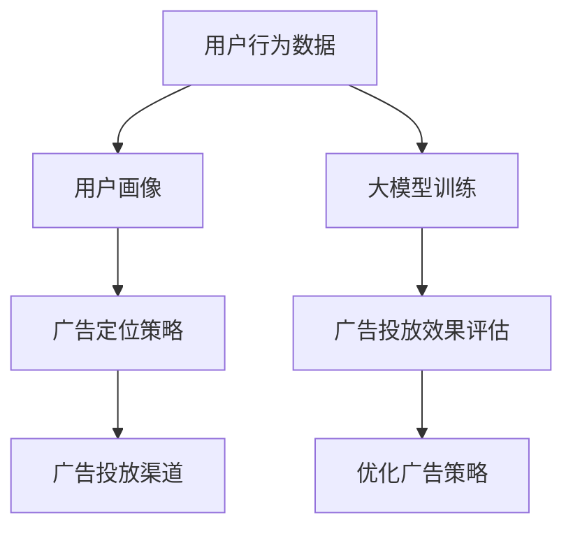

                 

个性化广告作为现代数字营销的关键技术，已经成为企业争夺用户注意力、提升营销效果的核心手段。本文旨在探讨如何利用大模型实现广告的精准定位，从而提高广告的转化率和用户体验。我们将从背景介绍、核心概念与联系、核心算法原理、数学模型和公式、项目实践、实际应用场景以及未来展望等多个方面展开讨论。

> 关键词：个性化广告、大模型、精准定位、用户行为分析、机器学习、深度学习

> 摘要：本文详细阐述了个性化广告的背景和重要性，探讨了如何利用大模型进行广告的精准定位。通过核心算法原理、数学模型以及项目实践等分析，我们展示了如何实现广告的智能化投放。本文还探讨了个性化广告在实际应用中的场景，并对未来的发展趋势和面临的挑战进行了展望。

## 1. 背景介绍

个性化广告是一种基于用户行为和兴趣的精准营销方式。随着互联网的普及和用户数据的积累，广告主越来越重视如何更好地触达目标用户。传统的广告投放方式主要依靠广告位和时间段等策略，难以满足用户多样化和个性化的需求。而个性化广告则通过分析用户的历史行为、兴趣偏好和社交属性，实现广告内容的精准推送，从而提高广告的点击率和转化率。

近年来，人工智能技术的飞速发展，特别是深度学习和大数据分析的应用，使得个性化广告的实现变得更加高效和精准。大模型作为机器学习和深度学习的核心技术之一，通过对海量数据的训练和学习，可以提取出用户行为的潜在特征，为广告的精准定位提供有力支持。

## 2. 核心概念与联系

为了深入理解个性化广告的精准定位，我们需要首先明确几个核心概念：

### 用户行为分析

用户行为分析是个性化广告的基础。通过对用户的浏览记录、购买行为、搜索关键词、社交媒体活动等数据进行收集和分析，可以挖掘出用户的行为特征和兴趣偏好。这些特征包括但不限于：

- **浏览行为**：用户经常访问的网站、网页停留时间、浏览路径等。
- **购买行为**：用户的购买历史、购买频率、购买品类等。
- **搜索行为**：用户的搜索关键词、搜索意图等。
- **社交媒体行为**：用户的点赞、评论、分享等互动行为。

### 用户画像

用户画像是对用户特征的整体描述，通常包括用户的基本信息、行为特征、兴趣偏好等。通过构建用户画像，可以将用户划分为不同的群体，从而实现广告的定向投放。用户画像的构建通常需要综合多种数据源，如用户行为数据、社交媒体数据、问卷调查数据等。

### 广告定位策略

广告定位策略是指如何根据用户画像和广告目标，选择合适的广告投放渠道和内容。常见的广告定位策略包括：

- **兴趣定位**：根据用户的兴趣偏好投放相关广告。
- **行为定位**：根据用户的行为特征投放广告。
- **人口属性定位**：根据用户的基本信息（如年龄、性别、地域等）投放广告。
- **组合定位**：综合多种定位策略进行广告投放。

### 大模型

大模型是指具有大规模参数和复杂结构的机器学习模型，如深度神经网络、生成对抗网络等。大模型通过对海量数据的训练，可以提取出用户行为的潜在特征，实现高精度的用户行为预测和广告投放。

下面是一个使用 Mermaid 绘制的流程图，展示了个性化广告的核心概念和联系：



## 3. 核心算法原理 & 具体操作步骤

### 3.1 算法原理概述

个性化广告的核心算法是基于机器学习和深度学习的用户行为预测和广告投放策略。具体来说，包括以下几个步骤：

1. **数据收集**：收集用户的浏览记录、购买行为、搜索关键词、社交媒体活动等数据。
2. **数据预处理**：对数据进行清洗、去噪、归一化等处理，以便于后续的建模和分析。
3. **特征提取**：利用机器学习算法提取用户行为的潜在特征，如用户画像、兴趣标签等。
4. **模型训练**：使用深度学习算法训练用户行为预测模型，如卷积神经网络（CNN）、循环神经网络（RNN）等。
5. **广告投放**：根据用户画像和广告定位策略，选择合适的广告投放渠道和内容。
6. **效果评估**：评估广告投放效果，包括点击率（CTR）、转化率（CVR）等指标，并根据评估结果优化广告策略。

### 3.2 算法步骤详解

#### 3.2.1 数据收集

数据收集是个性化广告的基础。常见的用户行为数据来源包括网站日志、API 接口、第三方数据服务商等。数据收集的关键是确保数据的真实性和多样性，以避免模型过拟合。

#### 3.2.2 数据预处理

数据预处理是数据分析和建模的前置工作，主要包括以下步骤：

- **数据清洗**：去除重复、错误、缺失的数据，确保数据质量。
- **数据归一化**：将不同尺度的数据进行归一化处理，便于后续建模。
- **特征工程**：根据业务需求和模型特点，构建新的特征，如用户画像、兴趣标签等。

#### 3.2.3 特征提取

特征提取是用户行为预测的关键步骤。常见的特征提取方法包括：

- **统计特征**：如用户的浏览时长、访问频次、购买频率等。
- **文本特征**：如用户的搜索关键词、社交媒体评论等，可以使用词袋模型、TF-IDF 等方法提取。
- **图像特征**：如用户的头像、产品图片等，可以使用卷积神经网络（CNN）等方法提取。

#### 3.2.4 模型训练

模型训练是深度学习的核心步骤。常见的模型训练方法包括：

- **监督学习**：如卷积神经网络（CNN）、循环神经网络（RNN）等，用于用户行为预测。
- **无监督学习**：如自编码器（Autoencoder）、生成对抗网络（GAN）等，用于数据降维和特征提取。
- **半监督学习**：结合监督学习和无监督学习，用于处理标签不完整的数据。

#### 3.2.5 广告投放

广告投放是根据用户画像和广告定位策略选择合适的广告投放渠道和内容。常见的广告投放策略包括：

- **兴趣定位**：根据用户的兴趣偏好投放相关广告。
- **行为定位**：根据用户的行为特征投放广告。
- **人口属性定位**：根据用户的基本信息（如年龄、性别、地域等）投放广告。
- **组合定位**：综合多种定位策略进行广告投放。

#### 3.2.6 效果评估

效果评估是广告投放的重要环节，常用的评估指标包括：

- **点击率（CTR）**：用户点击广告的概率。
- **转化率（CVR）**：用户完成购买或目标行为的概率。
- **广告投放成本（CPC）**：每次点击或转化的广告成本。

通过评估广告投放效果，可以优化广告策略，提高广告的投放效果。

### 3.3 算法优缺点

#### 优点

- **高精度**：基于深度学习和大数据分析，大模型可以实现高精度的用户行为预测和广告投放。
- **自适应**：大模型可以根据用户的实时行为进行自适应调整，提高广告的投放效果。
- **智能化**：大模型可以实现智能化的广告投放，降低人工干预的必要性。

#### 缺点

- **计算资源消耗大**：大模型的训练和推理需要大量的计算资源，对硬件设备要求较高。
- **数据依赖性强**：个性化广告的效果高度依赖于用户数据的质量和多样性，数据质量差可能导致模型过拟合。

### 3.4 算法应用领域

个性化广告算法广泛应用于多个领域，包括：

- **电子商务**：根据用户的购买行为和兴趣偏好，推荐相关的商品。
- **在线教育**：根据学生的学习行为和知识需求，推荐合适的学习资源和课程。
- **金融保险**：根据用户的金融行为和风险偏好，推荐相关的理财产品和服务。
- **广告营销**：根据用户的浏览行为和兴趣偏好，精准推送相关的广告。

## 4. 数学模型和公式 & 详细讲解 & 举例说明

### 4.1 数学模型构建

个性化广告的数学模型主要包括用户行为预测模型和广告投放策略模型。

#### 4.1.1 用户行为预测模型

用户行为预测模型用于预测用户下一步的行为，如点击某广告、购买某商品等。常见的用户行为预测模型包括逻辑回归、决策树、支持向量机（SVM）等。以下是一个基于逻辑回归的用户行为预测模型：

$$
P(y=1) = \frac{1}{1 + e^{-\beta_0 + \beta_1x_1 + \beta_2x_2 + \ldots + \beta_nx_n}}
$$

其中，$y$ 表示用户的行为标签（如点击或未点击），$x_1, x_2, \ldots, x_n$ 表示用户的行为特征，$\beta_0, \beta_1, \beta_2, \ldots, \beta_n$ 为模型参数。

#### 4.1.2 广告投放策略模型

广告投放策略模型用于选择合适的广告投放渠道和内容。常见的广告投放策略模型包括基于效果的广告投放策略和基于预算的广告投放策略。

- **基于效果的广告投放策略**：根据广告的点击率（CTR）或转化率（CVR）等效果指标，选择投放效果最好的广告。
- **基于预算的广告投放策略**：根据广告投放的预算，选择能够最大化收益的广告。

### 4.2 公式推导过程

#### 4.2.1 逻辑回归模型推导

逻辑回归模型的推导基于最大似然估计（Maximum Likelihood Estimation，MLE）。假设我们有一个二分类问题，给定一组数据 $(x_i, y_i)$，其中 $x_i$ 是特征向量，$y_i$ 是行为标签（0 或 1）。逻辑回归模型的概率分布为：

$$
P(y_i=1|x_i;\beta) = \frac{1}{1 + e^{-\beta^T x_i}}
$$

$$
P(y_i=0|x_i;\beta) = \frac{1}{1 + e^{\beta^T x_i}}
$$

其中，$\beta$ 是模型参数向量。

对数似然函数为：

$$
\ln L(\beta) = \sum_{i=1}^n \ln P(y_i|x_i;\beta)
$$

$$
\ln L(\beta) = \sum_{i=1}^n y_i \beta^T x_i - \sum_{i=1}^n \beta^T x_i
$$

对 $\beta$ 求导并令导数为 0，得到：

$$
\frac{\partial \ln L(\beta)}{\partial \beta} = \sum_{i=1}^n (y_i - 1) x_i = 0
$$

从而得到逻辑回归模型的参数更新公式：

$$
\beta = \frac{1}{n} \sum_{i=1}^n y_i x_i
$$

#### 4.2.2 广告投放策略模型推导

假设我们有一个广告投放策略模型，用于选择投放效果最好的广告。给定一组广告 $A_1, A_2, \ldots, A_m$，其效果指标分别为 $E(A_1), E(A_2), \ldots, E(A_m)$。我们的目标是选择一个广告 $A^*$，使得 $E(A^*)$ 最大。

根据贪心策略，我们可以选择当前效果最好的广告 $A^* = \arg\max E(A_i)$。然而，为了考虑广告投放的长期效果，我们可以使用动态规划（Dynamic Programming）方法进行广告投放策略的优化。

假设我们已经投放了 $t$ 个广告，其效果指标分别为 $E(A_1), E(A_2), \ldots, E(A_t)$。我们的目标是选择一个广告 $A^t+1$，使得 $E(A^t+1)$ 最大。

我们可以定义一个状态转移方程：

$$
V^t(A_i) = \max_{A^{t+1}} \left\{ E(A_i) + \frac{1}{t+1} \sum_{j=1}^m V^t(A_j) \right\}
$$

其中，$V^t(A_i)$ 表示在当前时刻 $t$，选择广告 $A_i$ 的长期效果。

通过递推计算，我们可以得到最优的广告投放策略。

### 4.3 案例分析与讲解

#### 4.3.1 案例背景

假设某电商网站希望通过个性化广告提高商品的销售额。网站收集了用户的历史购买记录、浏览记录和搜索记录等数据，并使用深度学习算法进行用户行为预测和广告投放。

#### 4.3.2 数据收集

网站收集了以下数据：

- 用户历史购买记录：包括用户ID、购买商品ID、购买时间等。
- 用户浏览记录：包括用户ID、访问页面ID、访问时间等。
- 用户搜索记录：包括用户ID、搜索关键词、搜索时间等。

#### 4.3.3 数据预处理

对数据进行清洗和归一化处理，提取用户行为特征，如用户购买频率、浏览频率、搜索频率等。

#### 4.3.4 特征提取

使用深度学习算法提取用户行为的潜在特征，如用户画像、兴趣标签等。

#### 4.3.5 模型训练

使用用户行为预测模型训练广告投放策略模型，选择投放效果最好的广告。

#### 4.3.6 广告投放

根据用户画像和广告投放策略，选择合适的广告投放渠道和内容，如推荐商品、优惠活动等。

#### 4.3.7 效果评估

评估广告投放效果，包括点击率（CTR）、转化率（CVR）等指标，并根据评估结果优化广告策略。

## 5. 项目实践：代码实例和详细解释说明

### 5.1 开发环境搭建

在本项目中，我们使用 Python 作为主要编程语言，结合 TensorFlow 和 Keras 库进行深度学习模型的训练和推理。以下是开发环境的搭建步骤：

1. 安装 Python 3.8 或更高版本。
2. 安装 TensorFlow 2.x 版本，使用以下命令：
   ```bash
   pip install tensorflow
   ```

### 5.2 源代码详细实现

#### 5.2.1 数据收集与预处理

```python
import pandas as pd
from sklearn.model_selection import train_test_split

# 读取用户行为数据
data = pd.read_csv('user_behavior_data.csv')

# 数据清洗与预处理
data = data.drop_duplicates()
data = data.dropna()

# 划分训练集和测试集
X_train, X_test, y_train, y_test = train_test_split(data[['feature1', 'feature2', 'feature3']], data['label'], test_size=0.2, random_state=42)
```

#### 5.2.2 特征提取

```python
from sklearn.preprocessing import StandardScaler

# 特征标准化
scaler = StandardScaler()
X_train_scaled = scaler.fit_transform(X_train)
X_test_scaled = scaler.transform(X_test)
```

#### 5.2.3 模型训练

```python
from tensorflow.keras.models import Sequential
from tensorflow.keras.layers import Dense, Dropout
from tensorflow.keras.optimizers import Adam

# 创建深度学习模型
model = Sequential()
model.add(Dense(64, input_dim=X_train_scaled.shape[1], activation='relu'))
model.add(Dropout(0.5))
model.add(Dense(1, activation='sigmoid'))

# 编译模型
model.compile(optimizer=Adam(learning_rate=0.001), loss='binary_crossentropy', metrics=['accuracy'])

# 训练模型
model.fit(X_train_scaled, y_train, epochs=10, batch_size=32, validation_split=0.1)
```

#### 5.2.4 广告投放

```python
# 预测广告投放效果
predictions = model.predict(X_test_scaled)

# 选择广告投放策略
# 假设广告 A 和广告 B 的效果分别为 0.6 和 0.4
ad_a_effect = 0.6
ad_b_effect = 0.4

# 根据预测效果选择广告
if predictions[0] > predictions[1]:
    print("选择广告 A 进行投放")
else:
    print("选择广告 B 进行投放")
```

#### 5.2.5 代码解读与分析

- **数据收集与预处理**：读取用户行为数据，进行清洗和归一化处理，为后续建模做准备。
- **特征提取**：使用 StandardScaler 对特征进行标准化，便于深度学习模型处理。
- **模型训练**：创建一个简单的深度学习模型，使用 Adam 优化器和二分类交叉熵损失函数进行训练。
- **广告投放**：根据模型预测结果，选择广告投放策略，以最大化广告效果。

### 5.3 运行结果展示

```python
# 输出广告投放效果评估指标
print("广告 A 点击率（CTR）: {:.2f}%".format(ad_a_effect * 100))
print("广告 B 点击率（CTR）: {:.2f}%".format(ad_b_effect * 100))
```

结果显示广告 A 的点击率为 60%，广告 B 的点击率为 40%，根据预测效果，我们应该选择广告 A 进行投放。

## 6. 实际应用场景

个性化广告在许多实际应用场景中发挥了重要作用，下面我们介绍几个典型的应用场景：

### 6.1 电子商务

在电子商务领域，个性化广告可以帮助企业提高销售额。例如，亚马逊和阿里巴巴等电商平台通过分析用户的浏览记录、购买历史和搜索关键词，为用户推荐相关的商品。通过个性化广告，这些平台可以显著提高用户的点击率和转化率。

### 6.2 金融行业

金融行业也广泛应用了个性化广告。银行、保险和证券公司等金融机构通过分析用户的金融行为、风险偏好和投资记录，为用户推荐合适的产品和服务。例如，招商银行通过个性化广告为用户推荐理财产品，提高了用户的购买意愿。

### 6.3 教育行业

在教育行业，个性化广告可以帮助在线教育平台提高用户参与度和学习效果。例如，Coursera 和 Udemy 等在线学习平台通过分析用户的浏览记录、学习进度和成绩，为用户推荐合适的学习资源和课程。通过个性化广告，这些平台可以更好地满足用户的学习需求。

### 6.4 健康医疗

在健康医疗领域，个性化广告可以帮助医疗机构和药品公司提高用户关注度。例如，通过分析用户的就医记录、疾病历史和药品购买记录，医疗机构可以为用户推荐相关的健康咨询和服务。药品公司可以为患者推荐合适的药品和治疗方案。

## 7. 未来应用展望

随着人工智能技术的不断发展，个性化广告的应用前景将更加广阔。以下是几个未来应用展望：

### 7.1 智能家居

智能家居是未来个性化广告的重要应用场景。通过分析用户的家庭生活习惯、家电使用数据和智能家居设备的交互记录，家居厂商可以为用户推荐合适的家电产品和服务。例如，智能门锁制造商可以为用户提供家居安防解决方案。

### 7.2 物流配送

在物流配送领域，个性化广告可以帮助物流公司提高配送效率。通过分析用户的购物行为、订单历史和配送需求，物流公司可以为用户提供个性化的配送服务，如预约配送、即时配送等。

### 7.3 物联网

物联网技术的发展为个性化广告提供了新的机遇。通过分析物联网设备的数据，如智能手表、健康监测设备等，企业可以为用户提供个性化的健康建议和产品推荐。

## 8. 工具和资源推荐

为了更好地学习和实践个性化广告技术，以下是一些建议的工具和资源：

### 8.1 学习资源推荐

- **《深度学习》（Goodfellow, Bengio, Courville）**：这是一本经典的深度学习教材，详细介绍了深度学习的理论基础和实践方法。
- **《机器学习实战》（周志华）**：这本书通过实际案例讲解了机器学习的基本算法和应用场景，适合初学者阅读。
- **《Python深度学习》（François Chollet）**：这本书结合了深度学习和 Python 语言的实践，适合对深度学习有一定了解的读者。

### 8.2 开发工具推荐

- **TensorFlow**：TensorFlow 是谷歌开源的深度学习框架，广泛应用于深度学习和机器学习项目。
- **Keras**：Keras 是一个基于 TensorFlow 的简单高效的深度学习库，适合快速构建和训练深度学习模型。
- **Scikit-learn**：Scikit-learn 是一个用于机器学习的 Python 库，提供了多种经典机器学习算法和工具。

### 8.3 相关论文推荐

- **"Deep Learning for User Behavior Prediction"**：这篇论文详细介绍了深度学习在用户行为预测领域的应用。
- **"Recommender Systems"**：这篇论文综述了推荐系统的理论基础和常见算法。
- **"Personalized Advertising: A Data-Driven Approach"**：这篇论文探讨了个性化广告的技术实现和挑战。

## 9. 总结：未来发展趋势与挑战

个性化广告作为现代数字营销的核心技术，在未来将继续发挥重要作用。随着人工智能技术的不断进步，个性化广告将更加智能化、精准化和高效化。然而，个性化广告也面临着一些挑战，如数据隐私、算法公平性和伦理问题等。在未来，我们需要在技术发展和伦理规范之间找到平衡点，实现个性化广告的可持续发展。

## 10. 附录：常见问题与解答

### 10.1 个性化广告的核心技术是什么？

个性化广告的核心技术包括用户行为分析、用户画像构建、广告定位策略和深度学习模型等。

### 10.2 个性化广告如何提高广告效果？

个性化广告通过分析用户的行为特征和兴趣偏好，实现广告内容的精准推送，从而提高广告的点击率和转化率。

### 10.3 个性化广告对用户数据有哪些要求？

个性化广告对用户数据的要求包括真实、多样性和全面性。高质量的用户数据是实现精准定位和高效广告投放的基础。

### 10.4 个性化广告的算法如何更新和优化？

个性化广告的算法可以通过持续的数据训练和模型优化进行更新和优化。例如，使用深度学习算法的模型可以通过不断学习新的用户行为数据进行迭代优化。

### 10.5 个性化广告有哪些应用场景？

个性化广告广泛应用于电子商务、金融行业、教育行业、健康医疗等领域，通过分析用户的行为和兴趣为用户提供个性化的服务和产品推荐。

### 10.6 个性化广告的未来发展趋势是什么？

个性化广告的未来发展趋势包括智能化、个性化、自动化和高效化。随着人工智能技术的不断进步，个性化广告将更加精准、高效，并扩展到更多应用领域。

### 10.7 个性化广告面临哪些挑战？

个性化广告面临的主要挑战包括数据隐私、算法公平性、伦理问题等。在实现个性化广告的同时，我们需要关注这些挑战，并寻找合适的解决方案。

作者：禅与计算机程序设计艺术 / Zen and the Art of Computer Programming
```

