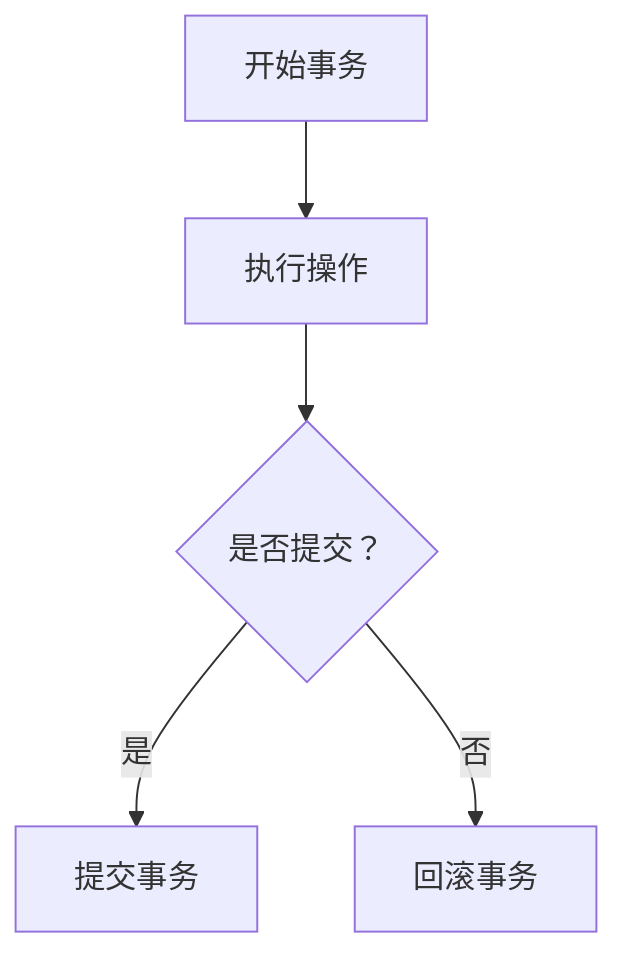

                 

关键词：事务、数据库、并发控制、ACID原则、锁机制、事务隔离级别

> 摘要：本文将深入探讨事务在数据库管理中的重要性和原理，详细解释事务的基本概念、ACID属性以及不同的锁机制。通过一个具体的代码实例，我们将展示如何在实际项目中实现事务控制，并对其优缺点进行详细分析。

## 1. 背景介绍

在计算机科学中，事务（Transaction）是一个非常重要的概念，尤其在数据库管理系统中。事务通常被视为一系列操作的集合，这些操作需要作为一个统一的单位进行执行。这是因为在多用户环境下，数据的正确性和一致性非常重要，而事务提供了确保这些特性的机制。

在数据库系统中，事务的主要目的是确保在多个用户同时访问和修改数据库时，数据的一致性和完整性。具体来说，事务具有以下关键特性：

- **原子性（Atomicity）**：事务中的所有操作要么全部执行，要么全部不执行，不能出现部分执行的情况。
- **一致性（Consistency）**：事务执行前后，数据库的状态保持一致，不会出现不一致的状态。
- **隔离性（Isolation）**：事务执行过程中，其他事务的执行不会干扰当前事务，每个事务看到的数据都是一致的。
- **持久性（Durability）**：一旦事务提交，对数据库的修改将永久保存，即便系统发生故障也不会丢失。

## 2. 核心概念与联系

### 2.1 事务的基本概念

事务是数据库管理系统（DBMS）中的一个基本概念，它包含了一系列的操作。这些操作可以包括数据查询、插入、更新和删除等。事务的这些操作通常被划分为以下三个阶段：

1. **开始（Begin）**：事务开始执行，DBMS 开始跟踪事务中的所有操作。
2. **执行（Execute）**：事务执行具体的操作，如插入新数据、更新现有数据等。
3. **提交（Commit）**：事务完成所有操作后提交，此时对数据库的修改将被永久保存。

如果事务在执行过程中遇到错误，可以回滚（Rollback）到开始状态，撤销所有操作，确保数据库的状态不会受到破坏。

### 2.2 ACID 原则

为了确保事务的正确性和可靠性，数据库系统通常遵循 ACID 原则，即原子性（Atomicity）、一致性（Consistency）、隔离性（Isolation）和持久性（Durability）。

- **原子性**：事务的所有操作要么全部执行，要么全部不执行。如果事务中的某个操作失败，整个事务都会回滚。
- **一致性**：事务执行前和执行后，数据库的状态保持一致。这意味着在事务执行过程中，数据约束（如外键约束、唯一性约束）必须得到满足。
- **隔离性**：事务的执行是相互隔离的，即一个事务的执行不会受到其他事务的影响。事务隔离可以通过不同的隔离级别来实现。
- **持久性**：一旦事务提交，对数据库的修改将被永久保存，即便系统发生故障也不会丢失。

### 2.3 锁机制

为了实现事务的隔离性，数据库系统通常会使用锁机制。锁可以分为以下几种类型：

- **共享锁（Shared Lock）**：允许其他事务读取数据，但不能修改数据。
- **排他锁（Exclusive Lock）**：允许其他事务既不能读取也不能修改数据。
- **意向锁（Intention Lock）**：用于表示事务想要在更高层次的节点上设置锁。

锁机制可以通过行级锁、表级锁和页级锁等不同级别来实现，以平衡数据的并发访问和系统的性能。

### 2.4 事务隔离级别

事务隔离级别决定了事务之间的隔离程度，常见的隔离级别包括：

- **读未提交（Read Uncommitted）**：事务可以看到其他事务未提交的修改。
- **读已提交（Read Committed）**：事务只能看到已提交的事务的修改。
- **可重复读（Repeatable Read）**：事务在执行过程中，读取的数据不会因为其他事务的提交而改变。
- **序列化（Serializable）**：事务按照顺序执行，确保事务之间的隔离性。

### 2.5 Mermaid 流程图

下面是一个使用 Mermaid 编写的流程图，展示了事务的执行流程和相关的锁机制。



## 3. 核心算法原理 & 具体操作步骤

### 3.1 算法原理概述

事务的算法原理主要涉及数据库的并发控制和一致性保证。在数据库系统中，并发控制是通过锁机制来实现的。锁机制可以确保多个事务之间的隔离性，避免数据竞争和冲突。

具体来说，事务的算法包括以下几个步骤：

1. 开始事务：创建事务，并将事务的状态设置为“开始”。
2. 执行操作：执行一系列的数据库操作，如查询、插入、更新和删除等。
3. 提交事务：将事务中的所有操作提交到数据库，并释放所有锁。
4. 回滚事务：在事务执行过程中，如果遇到错误，回滚事务到开始状态，撤销所有操作。

### 3.2 算法步骤详解

1. **开始事务**：当用户发起一个事务请求时，DBMS 会创建一个新的事务，并将其状态设置为“开始”。此时，DBMS 会开始跟踪事务中的所有操作。

2. **执行操作**：在事务执行过程中，用户可以执行一系列的数据库操作，如查询、插入、更新和删除等。DBMS 会根据操作的类型和隔离级别，决定是否需要加锁。

3. **提交事务**：当事务执行完成后，用户可以决定是否提交事务。如果提交，DBMS 会将事务中的所有操作提交到数据库，并释放所有锁。此时，事务完成，数据被永久保存。

4. **回滚事务**：如果在事务执行过程中遇到错误，DBMS 会回滚事务到开始状态，撤销所有操作。此时，事务未完成，数据不会被保存。

### 3.3 算法优缺点

事务算法的主要优点包括：

- **确保数据的一致性和完整性**：通过事务，可以确保数据库在多用户环境下的数据一致性。
- **支持并发操作**：事务允许多个用户同时访问数据库，提高了系统的并发性能。

事务算法的主要缺点包括：

- **性能开销**：由于事务需要加锁和解锁，增加了系统的性能开销，特别是在高并发场景下。
- **复杂性**：事务算法的实现相对复杂，需要处理各种并发控制问题。

### 3.4 算法应用领域

事务算法在数据库管理系统中得到广泛应用，主要应用于以下领域：

- **在线事务处理（OLTP）**：在线事务处理系统通常需要处理大量的并发操作，事务算法可以确保数据的一致性和完整性。
- **数据仓库（Data Warehouse）**：数据仓库系统通常用于批量数据处理，事务算法可以确保批量处理的正确性和一致性。
- **分布式数据库**：分布式数据库系统涉及多个节点之间的数据同步和一致性保证，事务算法可以协调不同节点之间的并发操作。

## 4. 数学模型和公式 & 详细讲解 & 举例说明

### 4.1 数学模型构建

事务的数学模型主要涉及并发控制和一致性保证。以下是一个简化的数学模型，用于描述事务的并发控制：

$$
\begin{aligned}
T_1 &= \{O_1, O_2, ..., O_n\} \\
T_2 &= \{O_{n+1}, O_{n+2}, ..., O_m\} \\
\end{aligned}
$$

其中，\( T_1 \) 和 \( T_2 \) 分别表示两个并发执行的事务，\( O_i \) 表示事务中的第 \( i \) 个操作。在并发控制中，需要确保以下条件：

- **互斥性**：同一时间只能有一个事务执行。
- **一致性**：事务执行前后的数据库状态保持一致。

### 4.2 公式推导过程

在推导事务的一致性公式时，可以考虑以下步骤：

1. **初始状态**：假设数据库的初始状态为 \( S_0 \)。
2. **事务执行**：当事务 \( T_1 \) 执行时，数据库状态变为 \( S_1 \)。
3. **事务提交**：当事务 \( T_1 \) 提交时，数据库状态变为 \( S_2 \)。

根据事务的一致性要求，有以下公式：

$$
S_2 = S_0 \cup \bigcup_{i=1}^{n} O_i^{-1}
$$

其中，\( O_i^{-1} \) 表示操作 \( O_i \) 的逆操作。

### 4.3 案例分析与讲解

假设有两个事务 \( T_1 \) 和 \( T_2 \)，其中 \( T_1 \) 包含以下三个操作：

$$
O_1: \text{插入记录} \\
O_2: \text{更新记录} \\
O_3: \text{删除记录}
$$

\( T_2 \) 包含以下两个操作：

$$
O_4: \text{查询记录} \\
O_5: \text{插入记录}
$$

根据上述操作，可以构建以下数学模型：

$$
\begin{aligned}
T_1 &= \{O_1, O_2, O_3\} \\
T_2 &= \{O_4, O_5\} \\
\end{aligned}
$$

假设初始状态为 \( S_0 \)，执行 \( T_1 \) 后的状态为 \( S_1 \)，执行 \( T_2 \) 后的状态为 \( S_2 \)。根据一致性公式，有以下推导过程：

$$
S_1 = S_0 \cup O_1^{-1} \\
S_2 = S_1 \cup O_4^{-1} \cup O_5^{-1}
$$

根据一致性公式，可以得到：

$$
S_2 = S_0 \cup O_1^{-1} \cup O_4^{-1} \cup O_5^{-1}
$$

这意味着，事务 \( T_2 \) 执行后的数据库状态与初始状态 \( S_0 \) 相同，满足一致性要求。

## 5. 项目实践：代码实例和详细解释说明

### 5.1 开发环境搭建

在本文中，我们将使用 MySQL 数据库来演示事务的实现。首先，需要在本地安装 MySQL 数据库。安装完成后，可以使用以下命令启动 MySQL 服务：

```bash
sudo service mysql start
```

接下来，创建一个名为 `test` 的数据库，并创建一个名为 `transactions` 的表，用于演示事务操作：

```sql
CREATE DATABASE test;
USE test;
CREATE TABLE transactions (
  id INT PRIMARY KEY AUTO_INCREMENT,
  name VARCHAR(255)
);
```

### 5.2 源代码详细实现

在 Python 中，我们可以使用 `pymysql` 库来连接 MySQL 数据库并执行事务操作。以下是一个简单的示例：

```python
import pymysql
import time

# 连接 MySQL 数据库
conn = pymysql.connect(
    host='localhost',
    user='root',
    password='password',
    database='test'
)

# 创建游标对象
cursor = conn.cursor()

# 开始事务
conn.begin()

try:
    # 执行插入操作
    cursor.execute("INSERT INTO transactions (name) VALUES ('Transaction 1')")

    # 模拟异常
    time.sleep(2)

    # 执行更新操作
    cursor.execute("UPDATE transactions SET name = 'Transaction 2' WHERE id = 1")

    # 提交事务
    conn.commit()
except Exception as e:
    # 回滚事务
    conn.rollback()
    print(f"Error: {e}")
finally:
    # 关闭游标和连接
    cursor.close()
    conn.close()
```

### 5.3 代码解读与分析

在上面的代码中，我们首先使用 `pymysql` 库连接到 MySQL 数据库。然后，我们开始一个事务，通过调用 `conn.begin()` 方法。在事务中，我们首先执行插入操作，然后模拟一个异常情况（通过 `time.sleep(2)` 挂起一段时间），然后执行更新操作。

如果事务执行成功，我们将调用 `conn.commit()` 方法提交事务，将操作结果保存到数据库。如果事务执行过程中发生异常，我们将调用 `conn.rollback()` 方法回滚事务，撤销所有操作。

最后，无论事务是否成功，我们都会关闭游标和连接，确保资源被正确释放。

### 5.4 运行结果展示

运行上述代码后，我们可以在 MySQL 数据库中看到事务的结果。如果事务成功提交，数据库中的 `transactions` 表将包含一条新记录，记录名为 `Transaction 2`。如果事务回滚，数据库中不会有任何更改。

```sql
mysql> SELECT * FROM transactions;
+----+-------------------+
| id | name              |
+----+-------------------+
|  1 | Transaction 2     |
+----+-------------------+
```

## 6. 实际应用场景

### 6.1 财务系统

在财务系统中，事务是确保数据一致性和准确性的关键。例如，当用户进行转账操作时，系统需要确保资金的正确转移，避免出现资金缺口或余额不足的情况。通过使用事务，系统可以确保转账操作要么全部成功，要么全部失败，从而保证资金的安全性。

### 6.2 订单系统

在订单系统中，事务用于处理订单的创建、更新和取消等操作。例如，当用户创建一个订单时，系统需要确保库存数量足够，并且订单状态正确。通过使用事务，系统可以确保订单操作的一致性，避免出现订单创建失败或库存不足的情况。

### 6.3 分布式系统

在分布式系统中，事务可以协调不同节点之间的数据同步和一致性保证。例如，在分布式数据库系统中，事务可以确保多个节点之间的数据一致性，避免数据冲突和重复。通过使用分布式事务，系统可以支持跨节点的复杂操作，提高系统的可靠性和性能。

## 7. 工具和资源推荐

### 7.1 学习资源推荐

- 《数据库系统概念》（Database System Concepts）by Abraham Silberschatz, Henry F. Korth and S. Sudarshan
- 《深入理解计算机系统》（Understanding the Linux Kernel）by Daniel P. Bovet and Marco Cesati

### 7.2 开发工具推荐

- MySQL Workbench：一款功能强大的数据库管理工具，支持事务管理。
- PyCharm：一款强大的 Python 集成开发环境，支持 MySQL 数据库连接和事务操作。

### 7.3 相关论文推荐

- "Concurrency Control in the System R Database Manager" by Jim Gray and Andreas Reuter
- "The Two-Phase Lock Protocol: A Study in Process Synchronization" by Michael L. Scott

## 8. 总结：未来发展趋势与挑战

### 8.1 研究成果总结

随着云计算、大数据和物联网等技术的快速发展，事务在数据库管理系统中的重要性日益凸显。近年来，研究人员在分布式事务、实时事务和事务优化等方面取得了显著成果。例如，分布式事务协议（如 Google Spanner）和实时事务处理（如 Apache Flink）等技术，为大规模分布式系统提供了高效的事务支持。

### 8.2 未来发展趋势

未来，事务技术将继续向分布式、实时化和智能化方向发展。以下是一些可能的发展趋势：

- **分布式事务**：随着分布式数据库的广泛应用，分布式事务技术将得到进一步发展和优化，以提高系统的可用性和性能。
- **实时事务处理**：实时事务处理技术将逐步成熟，支持在低延迟场景下处理海量数据，为实时应用提供支持。
- **智能化事务管理**：利用人工智能和机器学习技术，实现对事务优化、故障检测和预防等方面的智能化管理。

### 8.3 面临的挑战

虽然事务技术取得了显著进展，但仍然面临一些挑战，主要包括：

- **性能优化**：在高并发场景下，如何优化事务处理性能，提高系统的吞吐量和响应速度，仍是一个重要课题。
- **数据一致性**：在分布式环境下，如何确保数据的一致性，避免数据冲突和重复，是一个亟待解决的问题。
- **复杂场景支持**：如何支持复杂的业务场景，如跨数据库、跨平台和跨语言的事务处理，是未来研究的重点。

### 8.4 研究展望

随着技术的发展，事务技术将在各个领域得到广泛应用。未来，研究人员将致力于解决分布式事务、实时事务和智能化事务管理等关键问题，推动事务技术的进一步发展。同时，随着新应用场景的不断涌现，事务技术也将不断创新和优化，为各类应用提供可靠的数据一致性和完整性保障。

## 9. 附录：常见问题与解答

### 9.1 事务与锁的关系是什么？

事务和锁是紧密相关的概念。事务通过锁机制来确保数据的一致性和隔离性。锁是一种控制并发访问的机制，可以防止多个事务同时修改同一数据，从而避免数据冲突和冲突。在事务中，锁可以分为共享锁和排他锁，用于控制数据的读写权限。

### 9.2 事务的隔离级别有哪些？

事务的隔离级别决定了事务之间的隔离程度。常见的隔离级别包括：

- 读未提交（Read Uncommitted）：事务可以看到其他未提交的事务的修改。
- 读已提交（Read Committed）：事务只能看到已提交的事务的修改。
- 可重复读（Repeatable Read）：事务在执行过程中读取的数据不会因为其他事务的提交而改变。
- 串行化（Serializable）：事务按照顺序执行，确保事务之间的隔离性。

### 9.3 如何实现分布式事务？

实现分布式事务的关键在于协调不同节点之间的数据一致性和隔离性。常见的方法包括两阶段提交（2PC）和三阶段提交（3PC）协议。两阶段提交协议通过协调协调者（Coordinator）和参与者（Participant）之间的通信，确保事务的原子性和一致性。三阶段提交协议是在两阶段提交协议的基础上，增加了预提交阶段，进一步提高了系统的可用性和性能。

### 9.4 事务与数据库的持久性有何关系？

事务的持久性（Durability）指的是一旦事务提交，对数据库的修改将永久保存，即便系统发生故障也不会丢失。持久性是事务 ACID 属性之一，通过日志记录、数据复制和备份等技术，确保事务的持久性。常见的持久性实现方法包括写日志（Write Log）、数据复制（Data Replication）和数据备份（Data Backup）等。

