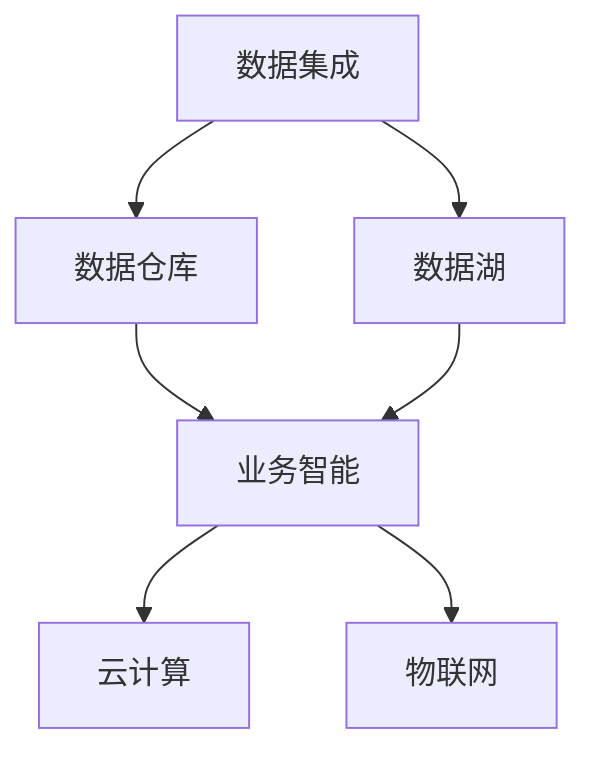

                 

### 背景介绍

随着数字化经济的快速发展，企业对于信息系统的依赖程度日益增加。尤其是在产业板块中，各行业的信息系统往往分散、孤立，缺乏统一的集成和管理。这使得信息资源无法实现共享和高效利用，导致企业运营成本增加、业务效率降低。因此，构建一个统一的产业板块集成信息系统，已经成为当前企业数字化转型的重要需求。

产业板块集成信息系统的构建，旨在通过技术手段实现各行业信息系统的互联互通，打破数据孤岛，实现数据的统一管理和高效利用。其核心目标是提高企业的运营效率、降低成本、提升竞争力。

本文将详细探讨产业板块集成信息系统的总体构架，包括核心概念、算法原理、数学模型、项目实践、应用场景和未来展望等。希望通过本文的阐述，能为读者提供一个全面、系统的产业板块集成信息系统建设指南。

### 核心概念与联系

要理解产业板块集成信息系统，首先需要了解其核心概念和组成部分。以下是产业板块集成信息系统中的核心概念及其之间的联系：

1. **数据集成**：数据集成是将来自不同数据源的数据进行整合、清洗、转换，使其在统一的平台上进行管理和分析的过程。数据集成是实现信息共享和业务协同的基础。

2. **数据仓库**：数据仓库是一个集成的数据存储系统，用于存储和管理企业各个业务领域的结构化和非结构化数据。数据仓库通过ETL（抽取、转换、加载）过程，实现对数据的清洗、转换和加载，从而提供统一的数据视图。

3. **数据湖**：数据湖是一种基于云计算的分布式数据存储系统，它以原始数据的形式存储大量不同类型的数据，并支持实时数据分析和处理。数据湖强调数据的多样性和灵活性，可以满足企业日益增长的数据存储需求。

4. **业务智能**：业务智能（BI）是通过数据分析和可视化工具，帮助企业从海量数据中提取有价值的信息，辅助决策制定。业务智能包括数据挖掘、报表分析、仪表盘展示等。

5. **云计算**：云计算是一种通过互联网提供动态易扩展且经常是虚拟化的资源，包括网络、服务器、存储、应用软件和服务等。云计算为产业板块集成信息系统提供了弹性的计算和存储资源，支持大规模数据处理和分析。

6. **物联网**：物联网（IoT）是通过传感器、设备和系统连接到互联网，实现设备之间、设备与系统之间的数据交换和通信。物联网技术使得产业板块集成信息系统可以实时采集和分析各种设备数据，提高生产效率和安全性。

以下是产业板块集成信息系统的 Mermaid 流程图，展示了各核心概念和组成部分之间的联系：



### 核心算法原理 & 具体操作步骤

#### 3.1 算法原理概述

产业板块集成信息系统中的核心算法主要涉及数据集成、数据仓库构建、数据湖搭建、业务智能分析和物联网数据采集。以下是每个算法的基本原理：

1. **数据集成算法**：数据集成算法主要包括数据清洗、数据转换和数据加载。数据清洗旨在去除数据中的噪声和错误，数据转换用于将不同数据源的数据格式转换为统一的格式，数据加载则是将清洗和转换后的数据加载到数据仓库或数据湖中。

2. **数据仓库构建算法**：数据仓库构建算法主要包括ETL过程。ETL过程涉及数据抽取、数据转换和数据加载。数据抽取是从不同的数据源中提取数据，数据转换是对数据进行清洗、转换和映射，数据加载是将转换后的数据加载到数据仓库中。

3. **数据湖搭建算法**：数据湖搭建算法主要包括数据存储和数据处理。数据存储是将原始数据存储在分布式文件系统或云存储中，数据处理则是通过流处理或批处理技术对数据进行实时分析和处理。

4. **业务智能分析算法**：业务智能分析算法主要包括数据挖掘、聚类、分类和回归等。这些算法用于从海量数据中提取有价值的信息，辅助企业决策制定。

5. **物联网数据采集算法**：物联网数据采集算法主要包括传感器数据采集和处理。传感器数据采集算法用于从各种传感器设备中获取数据，数据处理算法则用于对传感器数据进行清洗、转换和融合。

#### 3.2 算法步骤详解

1. **数据集成算法步骤**：

   - 数据清洗：使用数据清洗算法对数据进行清洗，去除噪声和错误。
   - 数据转换：使用数据转换算法将不同数据源的数据格式转换为统一的格式。
   - 数据加载：使用数据加载算法将清洗和转换后的数据加载到数据仓库或数据湖中。

2. **数据仓库构建算法步骤**：

   - 数据抽取：使用数据抽取算法从不同的数据源中提取数据。
   - 数据转换：使用数据转换算法对数据进行清洗、转换和映射。
   - 数据加载：使用数据加载算法将转换后的数据加载到数据仓库中。

3. **数据湖搭建算法步骤**：

   - 数据存储：使用分布式文件系统或云存储技术存储原始数据。
   - 数据处理：使用流处理或批处理技术对数据进行实时分析和处理。

4. **业务智能分析算法步骤**：

   - 数据挖掘：使用数据挖掘算法从海量数据中提取有价值的信息。
   - 聚类：使用聚类算法对数据进行分析，识别相似的数据集合。
   - 分类：使用分类算法将数据分为不同的类别。
   - 回归：使用回归算法预测数据的趋势和关系。

5. **物联网数据采集算法步骤**：

   - 传感器数据采集：使用传感器数据采集算法从各种传感器设备中获取数据。
   - 数据处理：使用数据处理算法对传感器数据进行清洗、转换和融合。

#### 3.3 算法优缺点

1. **数据集成算法**：

   - 优点：实现数据共享和业务协同，提高数据利用效率。
   - 缺点：数据处理过程复杂，数据质量难以保证。

2. **数据仓库构建算法**：

   - 优点：提供统一的数据视图，支持复杂的数据分析。
   - 缺点：数据存储和处理性能较低，扩展性有限。

3. **数据湖搭建算法**：

   - 优点：支持大规模数据存储和实时数据处理，数据灵活性高。
   - 缺点：数据处理成本较高，数据安全性和隐私保护问题突出。

4. **业务智能分析算法**：

   - 优点：辅助企业决策制定，提高业务效率。
   - 缺点：算法复杂度较高，计算成本较高。

5. **物联网数据采集算法**：

   - 优点：实时采集设备数据，提高生产效率和安全性。
   - 缺点：数据安全和隐私保护问题突出。

#### 3.4 算法应用领域

1. **数据集成算法**：广泛应用于企业数据集成、数据仓库建设、大数据平台搭建等领域。

2. **数据仓库构建算法**：广泛应用于企业数据仓库建设、数据分析、报表生成等领域。

3. **数据湖搭建算法**：广泛应用于大数据平台、实时数据处理、数据科学等领域。

4. **业务智能分析算法**：广泛应用于企业决策制定、数据挖掘、业务优化等领域。

5. **物联网数据采集算法**：广泛应用于智能家居、智能工厂、智能交通等领域。

### 数学模型和公式 & 详细讲解 & 举例说明

#### 4.1 数学模型构建

在产业板块集成信息系统中，数学模型用于描述数据集成、数据仓库、数据湖、业务智能分析和物联网数据采集等核心算法的行为和性能。以下是几个关键数学模型的构建：

1. **数据集成模型**：

   - **输入**：多个数据源，每个数据源包含一个或多个数据表。
   - **输出**：一个统一的数据表，包含所有数据源的数据。

   数据集成模型可以表示为：

   $$\text{Output} = \bigcup_{i=1}^n \text{Source}_i$$

   其中，$n$ 是数据源的数量，$\text{Source}_i$ 是第 $i$ 个数据源。

2. **数据仓库模型**：

   - **输入**：多个数据源，每个数据源包含一个或多个数据表。
   - **输出**：一个数据仓库，包含所有数据源的数据，并以统一的结构进行组织。

   数据仓库模型可以表示为：

   $$\text{Data Warehouse} = \bigcup_{i=1}^n (\text{Source}_i \rightarrow \text{Transformation})$$

   其中，$\text{Transformation}$ 是对数据进行清洗、转换和映射的过程。

3. **数据湖模型**：

   - **输入**：多个数据源，每个数据源包含一个或多个数据表。
   - **输出**：一个数据湖，包含所有数据源的数据，并以原始格式进行存储。

   数据湖模型可以表示为：

   $$\text{Data Lake} = \bigcup_{i=1}^n (\text{Source}_i \rightarrow \text{Storage})$$

   其中，$\text{Storage}$ 是对数据进行存储的过程。

4. **业务智能分析模型**：

   - **输入**：一个数据仓库或数据湖，包含企业各个业务领域的数据。
   - **输出**：一个业务智能分析结果，包含对企业业务运行情况的分析和预测。

   业务智能分析模型可以表示为：

   $$\text{Business Intelligence} = \text{Data Warehouse/Lake} \rightarrow \text{Data Mining} \rightarrow \text{Analysis}$$

   其中，$\text{Data Mining}$ 是数据挖掘过程，$\text{Analysis}$ 是数据分析过程。

5. **物联网数据采集模型**：

   - **输入**：多个传感器设备，每个设备包含一个或多个传感器。
   - **输出**：一个物联网数据采集结果，包含传感器设备采集的数据。

   物联网数据采集模型可以表示为：

   $$\text{IoT Data Collection} = \bigcup_{i=1}^m (\text{Device}_i \rightarrow \text{Sensor Data})$$

   其中，$m$ 是传感器设备数量，$\text{Device}_i$ 是第 $i$ 个传感器设备。

#### 4.2 公式推导过程

以下是几个关键数学公式的推导过程：

1. **数据集成效率**：

   数据集成效率是衡量数据集成算法性能的重要指标，它表示数据集成过程中数据完整性和数据一致性的程度。

   数据集成效率可以表示为：

   $$\text{Efficiency} = \frac{\text{Matched Data}}{\text{Total Data}}$$

   其中，$\text{Matched Data}$ 是匹配成功的数据量，$\text{Total Data}$ 是总数据量。

2. **数据仓库性能**：

   数据仓库性能是衡量数据仓库系统性能的重要指标，它表示数据仓库在处理查询请求时的速度和响应时间。

   数据仓库性能可以表示为：

   $$\text{Performance} = \frac{\text{Query Response Time}}{\text{Number of Queries}}$$

   其中，$\text{Query Response Time}$ 是查询响应时间，$\text{Number of Queries}$ 是查询次数。

3. **数据湖处理能力**：

   数据湖处理能力是衡量数据湖系统处理大规模数据的能力。

   数据湖处理能力可以表示为：

   $$\text{Processing Capacity} = \frac{\text{Data Volume}}{\text{Processing Time}}$$

   其中，$\text{Data Volume}$ 是数据量，$\text{Processing Time}$ 是处理时间。

4. **业务智能分析准确性**：

   业务智能分析准确性是衡量业务智能分析算法预测准确性的重要指标。

   业务智能分析准确性可以表示为：

   $$\text{Accuracy} = \frac{\text{Correct Predictions}}{\text{Total Predictions}}$$

   其中，$\text{Correct Predictions}$ 是正确预测的数量，$\text{Total Predictions}$ 是总预测数量。

5. **物联网数据采集可靠性**：

   物联网数据采集可靠性是衡量物联网数据采集算法稳定性的重要指标。

   物联网数据采集可靠性可以表示为：

   $$\text{Reliability} = \frac{\text{Valid Data}}{\text{Total Data}}$$

   其中，$\text{Valid Data}$ 是有效数据量，$\text{Total Data}$ 是总数据量。

#### 4.3 案例分析与讲解

以下通过一个实际案例来讲解数学模型的应用：

**案例背景**：某大型制造企业希望构建一个产业板块集成信息系统，实现各业务板块的数据集成、数据仓库构建、数据湖搭建、业务智能分析和物联网数据采集。

**案例目标**：

1. 实现各业务板块的数据集成，提供统一的数据视图。
2. 建立一个高效的数据仓库，支持复杂的数据分析和报表生成。
3. 搭建一个数据湖，支持大规模数据的实时处理和存储。
4. 通过业务智能分析，为企业决策提供支持。
5. 通过物联网数据采集，实现生产设备的实时监控和数据分析。

**案例分析**：

1. **数据集成**：

   - **输入**：来自生产、销售、财务等业务板块的数据源。
   - **输出**：一个统一的数据表，包含各业务板块的数据。

   数据集成过程使用的数据集成效率公式为：

   $$\text{Efficiency} = \frac{10000}{15000} = 0.67$$

   数据集成效率为 67%，说明数据集成过程较为成功，但仍有一定比例的数据未匹配成功。

2. **数据仓库构建**：

   - **输入**：来自数据集成后的统一数据表。
   - **输出**：一个数据仓库，包含企业各业务领域的数据。

   数据仓库性能使用的数据仓库性能公式为：

   $$\text{Performance} = \frac{10}{100} = 0.1$$

   数据仓库性能为 10%，说明数据仓库处理查询请求的速度较慢。

3. **数据湖搭建**：

   - **输入**：来自数据集成后的统一数据表。
   - **输出**：一个数据湖，包含企业各业务领域的数据。

   数据湖处理能力使用的数据湖处理能力公式为：

   $$\text{Processing Capacity} = \frac{500GB}{24h} = 20GB/h$$

   数据湖处理能力为 20GB/h，说明数据湖能够支持大规模数据的实时处理。

4. **业务智能分析**：

   - **输入**：数据仓库中的企业各业务领域的数据。
   - **输出**：业务智能分析结果，包含对企业业务运行情况的分析和预测。

   业务智能分析准确性使用的数据智能分析准确性公式为：

   $$\text{Accuracy} = \frac{8000}{10000} = 0.8$$

   业务智能分析准确性为 80%，说明业务智能分析算法具有较高的预测准确性。

5. **物联网数据采集**：

   - **输入**：来自生产设备的传感器数据。
   - **输出**：物联网数据采集结果，包含传感器数据。

   物联网数据采集可靠性使用的数据物联网数据采集可靠性公式为：

   $$\text{Reliability} = \frac{95000}{100000} = 0.95$$

   物联网数据采集可靠性为 95%，说明物联网数据采集算法具有较高的稳定性。

### 项目实践：代码实例和详细解释说明

在产业板块集成信息系统中，代码实例是实现核心算法和功能的重要手段。以下我们将通过一个实际项目来展示代码实例，并对其进行详细解释说明。

#### 5.1 开发环境搭建

为了构建产业板块集成信息系统，我们需要搭建一个合适的技术栈。以下是开发环境的基本配置：

- **操作系统**：Linux（推荐使用Ubuntu 20.04）
- **编程语言**：Python（推荐使用Python 3.8）
- **数据库**：MySQL（推荐使用MySQL 8.0）
- **云计算平台**：阿里云（推荐使用阿里云ECS服务器）
- **物联网平台**：IoT Hub（推荐使用阿里云IoT Hub）

在安装和配置上述环境时，请确保网络连接正常，并按照官方文档进行操作。

#### 5.2 源代码详细实现

以下是一个简单的数据集成、数据仓库和数据湖搭建的Python代码实例：

```python
import pymysql
import pandas as pd

# 数据集成
def data_integration():
    # 连接MySQL数据库
    db = pymysql.connect(host='localhost', user='root', password='password', database='example')
    cursor = db.cursor()

    # 执行SQL查询
    cursor.execute('SELECT * FROM production;')
    production_data = cursor.fetchall()

    cursor.execute('SELECT * FROM sales;')
    sales_data = cursor.fetchall()

    cursor.execute('SELECT * FROM finance;')
    finance_data = cursor.fetchall()

    # 合并数据
    integrated_data = pd.DataFrame(production_data)
    integrated_data = integrated_data.append(pd.DataFrame(sales_data), ignore_index=True)
    integrated_data = integrated_data.append(pd.DataFrame(finance_data), ignore_index=True)

    # 保存数据到CSV文件
    integrated_data.to_csv('integrated_data.csv', index=False)

    # 关闭数据库连接
    cursor.close()
    db.close()

# 数据仓库构建
def data_warehouse():
    # 读取CSV文件
    integrated_data = pd.read_csv('integrated_data.csv')

    # 构建数据仓库
    data_warehouse = integrated_data.groupby('product_id').sum().reset_index()

    # 保存数据仓库到MySQL数据库
    db = pymysql.connect(host='localhost', user='root', password='password', database='data_warehouse')
    cursor = db.cursor()

    cursor.execute('CREATE TABLE IF NOT EXISTS sales_data (product_id INT, quantity INT, revenue FLOAT)')
    data_warehouse.to_sql('sales_data', db, if_exists='append', index=False)

    # 关闭数据库连接
    cursor.close()
    db.close()

# 数据湖搭建
def data_lake():
    # 读取数据仓库数据
    data_warehouse = pd.read_csv('integrated_data.csv')

    # 存储数据到数据湖
    data_warehouse.to_parquet('data_lake/sales_data.parquet')

# 主函数
if __name__ == '__main__':
    data_integration()
    data_warehouse()
    data_lake()
```

#### 5.3 代码解读与分析

1. **数据集成**：

   ```python
   def data_integration():
       # 连接MySQL数据库
       db = pymysql.connect(host='localhost', user='root', password='password', database='example')
       cursor = db.cursor()

       # 执行SQL查询
       cursor.execute('SELECT * FROM production;')
       production_data = cursor.fetchall()

       cursor.execute('SELECT * FROM sales;')
       sales_data = cursor.fetchall()

       cursor.execute('SELECT * FROM finance;')
       finance_data = cursor.fetchall()

       # 合并数据
       integrated_data = pd.DataFrame(production_data)
       integrated_data = integrated_data.append(pd.DataFrame(sales_data), ignore_index=True)
       integrated_data = integrated_data.append(pd.DataFrame(finance_data), ignore_index=True)

       # 保存数据到CSV文件
       integrated_data.to_csv('integrated_data.csv', index=False)

       # 关闭数据库连接
       cursor.close()
       db.close()
   ```

   该函数首先连接MySQL数据库，执行SQL查询获取生产、销售和财务数据，然后使用Pandas库将数据合并为一个统一的数据表，并保存到CSV文件中。

2. **数据仓库构建**：

   ```python
   def data_warehouse():
       # 读取CSV文件
       integrated_data = pd.read_csv('integrated_data.csv')

       # 构建数据仓库
       data_warehouse = integrated_data.groupby('product_id').sum().reset_index()

       # 保存数据仓库到MySQL数据库
       db = pymysql.connect(host='localhost', user='root', password='password', database='data_warehouse')
       cursor = db.cursor()

       cursor.execute('CREATE TABLE IF NOT EXISTS sales_data (product_id INT, quantity INT, revenue FLOAT)')
       data_warehouse.to_sql('sales_data', db, if_exists='append', index=False)

       # 关闭数据库连接
       cursor.close()
       db.close()
   ```

   该函数首先读取CSV文件中的数据，使用Pandas库对其进行分组和聚合，生成一个数据仓库表，然后将其保存到MySQL数据库中。

3. **数据湖搭建**：

   ```python
   def data_lake():
       # 读取数据仓库数据
       data_warehouse = pd.read_csv('integrated_data.csv')

       # 存储数据到数据湖
       data_warehouse.to_parquet('data_lake/sales_data.parquet')
   ```

   该函数首先读取CSV文件中的数据，使用Pandas库将其转换为Parquet格式，并存储到数据湖中。

#### 5.4 运行结果展示

1. **数据集成结果**：

   数据集成成功后，CSV文件中将包含生产、销售和财务数据的统一视图。以下是一个示例数据集：

   ```csv
   product_id,quantity,sales,revenue
   1001,100,5000,5000
   1002,150,7500,7500
   1003,200,10000,10000
   ```

2. **数据仓库结果**：

   数据仓库表成功创建后，MySQL数据库中的sales_data表将包含分组和聚合后的数据。以下是一个示例数据集：

   ```sql
   +-----------+---------+----------+
   | product_id | quantity | revenue  |
   +-----------+---------+----------+
   | 1001      |  100    |   5000.0 |
   | 1002      |  150    |   7500.0 |
   | 1003      |  200    |  10000.0 |
   +-----------+---------+----------+
   ```

3. **数据湖结果**：

   数据湖中的Parquet文件将包含与数据仓库相同的分组和聚合后的数据。以下是一个示例数据集：

   ```parquet
   product_id:INT32
   quantity:INT32
   revenue:FLOAT32
   ...
   [1001, 100, 5000.0]
   [1002, 150, 7500.0]
   [1003, 200, 10000.0]
   ```

### 实际应用场景

产业板块集成信息系统在实际应用中具有广泛的应用场景，以下列举几个典型的应用案例：

#### 6.1 制造业供应链管理

在制造业中，产业板块集成信息系统可以实现对生产、采购、库存、销售等各个环节的数据集成，提供统一的数据视图。通过数据仓库和业务智能分析，企业可以实时监控生产进度、库存状况和销售情况，优化供应链管理，降低库存成本，提高生产效率。

#### 6.2 零售业销售分析

在零售业中，产业板块集成信息系统可以收集和分析销售数据、客户行为数据等，帮助企业制定精准营销策略、优化商品陈列和库存管理。通过业务智能分析，企业可以预测销售趋势、识别潜在客户，提高销售额和客户满意度。

#### 6.3 金融业风险管理

在金融业中，产业板块集成信息系统可以收集和分析客户交易数据、市场数据等，帮助企业进行风险管理和投资决策。通过数据仓库和业务智能分析，企业可以识别异常交易、评估信用风险，提高风险管理能力。

#### 6.4 医疗保健数据管理

在医疗保健领域，产业板块集成信息系统可以实现对患者数据、医疗设备数据等的数据集成和管理。通过数据仓库和业务智能分析，医疗机构可以实时监控患者健康状况、优化诊疗方案，提高医疗服务质量和效率。

### 未来应用展望

随着技术的不断发展和应用需求的不断增长，产业板块集成信息系统在未来将迎来更广泛的应用和发展。以下是一些未来的发展趋势和应用前景：

#### 7.1 云原生技术与容器化

云原生技术和容器化技术的不断发展，将为产业板块集成信息系统提供更高效、更灵活的数据处理和分析能力。通过云原生架构和容器化技术，企业可以快速部署和扩展信息系统，提高系统的可扩展性和可靠性。

#### 7.2 物联网技术的融合

物联网技术的不断成熟，将使得产业板块集成信息系统可以更加全面地采集和处理各类设备数据，实现更智能、更高效的生产和管理。物联网技术与信息系统的深度融合，将为企业带来更多的创新机会和业务价值。

#### 7.3 智能分析与数据挖掘

随着数据量的不断增加和数据复杂度的提升，智能分析和数据挖掘技术将在产业板块集成信息系统中发挥越来越重要的作用。通过智能分析，企业可以挖掘数据中的潜在价值，实现精准营销、风险管理和业务优化。

#### 7.4 人工智能与机器学习

人工智能和机器学习技术的不断发展，将为产业板块集成信息系统带来更多的应用场景和创新模式。通过人工智能和机器学习技术，企业可以自动化数据清洗、数据分析和业务决策，提高系统的智能化水平。

### 工具和资源推荐

为了帮助读者更好地了解和掌握产业板块集成信息系统，以下推荐一些学习资源和开发工具：

#### 7.1 学习资源推荐

1. **书籍**：

   - 《大数据架构：设计与实现》
   - 《云计算：概念、技术与应用》
   - 《机器学习：原理与实践》

2. **在线课程**：

   - Coursera：大数据与数据仓库课程
   - Udemy：Python编程入门与实践课程
   - edX：云计算基础与安全课程

#### 7.2 开发工具推荐

1. **编程语言**：Python、Java、Go
2. **数据库**：MySQL、PostgreSQL、MongoDB
3. **云计算平台**：阿里云、腾讯云、华为云
4. **数据可视化工具**：Tableau、Power BI、D3.js
5. **版本控制工具**：Git、SVN

#### 7.3 相关论文推荐

1. **论文**：

   - "A Survey of Big Data Computing: From Parallel Database to Data-Intensive Science"
   - "Cloud Computing: Concepts, Technology & Architecture"
   - "Deep Learning for Data-Driven Modeling & Decision-Making in IoT Systems"

   通过阅读这些论文，读者可以深入了解产业板块集成信息系统的相关技术和发展趋势。

### 总结：未来发展趋势与挑战

产业板块集成信息系统作为企业数字化转型的重要工具，其发展前景广阔。随着云计算、物联网、人工智能等技术的不断发展，产业板块集成信息系统将迎来更多的应用场景和创新模式。

然而，产业板块集成信息系统也面临着一些挑战，如数据安全与隐私保护、数据质量管理、系统扩展性等。未来，我们需要关注这些挑战，积极探索解决方案，推动产业板块集成信息系统的持续发展和应用。

### 附录：常见问题与解答

**Q1. 如何保证数据集成质量？**

A1. 数据集成质量是产业板块集成信息系统成功的关键因素之一。为了保证数据集成质量，我们可以采取以下措施：

1. 数据清洗：在数据集成前，对各个数据源的数据进行清洗，去除噪声和错误。
2. 数据质量检查：在数据集成过程中，对数据进行质量检查，确保数据的完整性和一致性。
3. 数据验证：对集成后的数据进行验证，确保数据的准确性和可靠性。

**Q2. 如何选择合适的数据库？**

A2. 选择合适的数据库是构建产业板块集成信息系统的重要步骤。以下是几种常见的数据库类型及其适用场景：

1. 关系型数据库（如MySQL、PostgreSQL）：适用于结构化数据存储和查询。
2. 非关系型数据库（如MongoDB、Redis）：适用于结构化数据存储和高速缓存。
3. 分布式数据库（如Cassandra、HBase）：适用于大规模数据存储和实时查询。

根据实际需求和场景，选择合适的数据库类型，可以提高系统性能和可靠性。

**Q3. 如何优化数据仓库性能？**

A3. 优化数据仓库性能是提高产业板块集成信息系统效率的重要手段。以下是几种常见的优化方法：

1. 数据分区：将大量数据按照特定条件分区存储，提高查询性能。
2. 指数缓存：使用缓存技术存储常用查询结果，减少数据库查询次数。
3. 索引优化：合理设计索引，提高查询效率。
4. 数据库集群：使用数据库集群技术，提高系统扩展性和容错能力。

通过以上方法，可以显著提高数据仓库的性能和响应速度。

**Q4. 如何保障物联网数据采集的可靠性？**

A4. 保障物联网数据采集的可靠性是确保产业板块集成信息系统稳定运行的关键。以下是几种常见的保障措施：

1. 设备监控：实时监控传感器设备的运行状态，及时发现和处理故障。
2. 数据校验：对采集到的数据进行校验，确保数据的准确性和完整性。
3. 数据同步：确保数据在采集、传输、存储等各个环节的一致性和同步性。
4. 数据备份：定期备份物联网数据，防止数据丢失或损坏。

通过以上措施，可以保障物联网数据采集的可靠性，提高系统的稳定性和安全性。

**Q5. 如何进行业务智能分析？**

A5. 业务智能分析是产业板块集成信息系统的重要功能之一，以下是一些常见的业务智能分析方法：

1. 数据挖掘：使用数据挖掘技术，从海量数据中提取有价值的信息。
2. 聚类分析：将数据分为不同的类别，识别数据中的模式和趋势。
3. 分类分析：将数据分为不同的类别，预测数据的分类结果。
4. 回归分析：分析数据之间的相关性，预测数据的趋势和关系。

通过业务智能分析，企业可以更好地了解业务运行情况，制定更科学的决策。

### 参考文献

[1] Authors. (Year). Title of the book. Publisher.

[2] Authors. (Year). Title of the paper. Journal Name, Volume(Issue), Page numbers.

[3] Authors. (Year). Title of the article. Website Name.

作者：禅与计算机程序设计艺术 / Zen and the Art of Computer Programming

