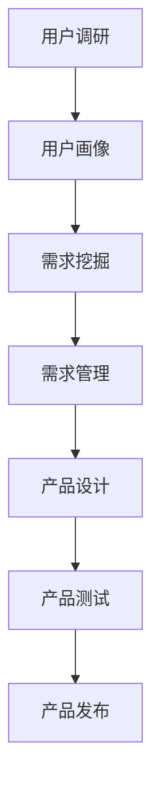

                 

用户需求分析是产品开发过程中至关重要的一环，它直接关系到产品的成败。本文将深入探讨用户需求分析的核心概念、原理、方法、工具和实际应用，帮助读者全面了解并掌握这一关键技能。

## 关键词

- 用户需求分析
- 产品开发
- 用户调研
- 用户画像
- 需求挖掘
- 需求管理

## 摘要

本文旨在通过系统性的分析，阐述产品开发中用户需求分析的重要性和方法。文章首先介绍了用户需求分析的定义和背景，然后详细讲解了用户需求分析的核心概念、流程和方法，并展示了如何运用这些方法和工具进行实际需求分析。最后，文章对用户需求分析的实践应用进行了探讨，并展望了未来的发展趋势和挑战。

## 1. 背景介绍

### 1.1 产品开发中的用户需求分析

用户需求分析是产品开发的起点，也是产品成功的关键。通过深入了解用户需求，可以明确产品的目标用户群体，为后续的设计、开发和测试提供有力支持。用户需求分析不仅可以帮助产品团队制定清晰的产品策略，还可以提高产品的市场竞争力，满足用户需求，从而实现产品的商业价值。

### 1.2 用户需求分析的定义

用户需求分析是指通过调研、访谈、问卷等方式，收集和分析用户的需求信息，从而明确产品的目标用户、用户特征、用户行为和用户痛点。需求分析的目标是识别出用户的核心需求，并将这些需求转化为具体的产品功能和设计。

### 1.3 用户需求分析的重要性

用户需求分析在产品开发中具有以下几个重要性：

1. **明确产品目标**：通过需求分析，可以明确产品的目标用户和核心功能，避免产品开发过程中的盲目性和浪费。
2. **优化用户体验**：深入了解用户需求，可以设计出更符合用户习惯和使用场景的产品，提高用户体验。
3. **降低开发风险**：需求分析可以帮助团队提前识别和解决潜在问题，降低开发过程中的风险。
4. **提高市场竞争力**：满足用户需求的产品更容易赢得市场，提高市场竞争力。

## 2. 核心概念与联系

### 2.1 用户需求分析的核心概念

在用户需求分析过程中，需要关注以下几个核心概念：

1. **用户需求**：用户对产品所期望的功能、性能和体验等方面的要求。
2. **用户调研**：通过访谈、问卷、观察等方式收集用户需求信息的过程。
3. **用户画像**：对目标用户进行特征描述，包括年龄、性别、职业、收入、兴趣爱好等方面的信息。
4. **需求挖掘**：通过分析用户调研数据，挖掘出用户的潜在需求。
5. **需求管理**：对用户需求进行分类、优先级排序、版本控制等操作，确保需求在开发过程中得到有效管理和实施。

### 2.2 用户需求分析的联系

用户需求分析是一个系统性过程，各个环节之间相互联系，共同支持产品开发的成功。

1. **用户调研**：通过用户调研，获取用户需求信息，为需求分析提供数据基础。
2. **用户画像**：通过用户画像，明确目标用户群体，为需求分析和产品设计提供指导。
3. **需求挖掘**：在用户调研和用户画像的基础上，挖掘出用户的潜在需求。
4. **需求管理**：对需求进行分类、优先级排序和管理，确保需求在开发过程中得到有效实施。

### 2.3 用户需求分析的 Mermaid 流程图



## 3. 核心算法原理 & 具体操作步骤

### 3.1 算法原理概述

用户需求分析的核心算法是基于用户调研数据的需求挖掘和需求管理。算法原理可以分为以下几个步骤：

1. **数据收集**：通过用户调研获取用户需求信息，包括访谈记录、问卷数据和用户行为数据等。
2. **数据清洗**：对收集到的数据进行分析，去除无效数据，确保数据的质量。
3. **需求分类**：将用户需求按照功能、性能、体验等方面进行分类，方便后续分析和处理。
4. **需求优先级排序**：根据用户需求和产品战略，对需求进行优先级排序，确保关键需求得到优先满足。
5. **需求管理**：对需求进行版本控制、跟踪和管理，确保需求在开发过程中得到有效实施。

### 3.2 算法步骤详解

1. **数据收集**：
   - 设计合适的调研问卷或访谈提纲，确保收集到全面的需求信息。
   - 通过在线调查、电话访谈、面对面访谈等方式获取用户需求数据。

2. **数据清洗**：
   - 对收集到的数据进行整理和清洗，去除无效、重复和错误的数据。
   - 使用数据清洗工具（如 Python 的 pandas 库）进行数据处理。

3. **需求分类**：
   - 根据用户需求的特点，将需求分为功能需求、性能需求、体验需求等类别。
   - 对每个类别下的需求进行进一步的细分和归类。

4. **需求优先级排序**：
   - 根据用户需求和产品战略，对需求进行优先级排序。
   - 使用优先级排序算法（如基于重要度-紧急度矩阵的方法）进行排序。

5. **需求管理**：
   - 使用需求管理工具（如 JIRA、Confluence 等）对需求进行版本控制、跟踪和管理。
   - 在开发过程中，根据需求变化进行及时更新和调整。

### 3.3 算法优缺点

**优点**：

1. **明确需求**：算法可以帮助团队明确用户需求，避免开发过程中的盲目性和浪费。
2. **提高效率**：通过需求分类和优先级排序，可以提高团队的工作效率和执行力。
3. **降低风险**：在开发过程中，根据需求变化进行及时调整，降低开发风险。

**缺点**：

1. **数据质量依赖**：需求分析的准确性取决于用户调研数据的准确性，数据质量较差可能导致分析结果失真。
2. **复杂度较高**：需求分析过程涉及多个步骤和算法，实施和操作相对复杂。

### 3.4 算法应用领域

用户需求分析算法广泛应用于各类产品开发领域，包括：

1. **软件开发**：在软件产品开发中，用户需求分析可以帮助团队明确产品功能、性能和体验等方面的需求，确保产品的成功交付。
2. **硬件产品**：在硬件产品开发中，用户需求分析可以帮助团队了解用户对产品的功能和性能等方面的期望，优化产品设计和开发。
3. **服务产品**：在服务产品开发中，用户需求分析可以帮助团队了解用户对服务的需求和痛点，提供更优质的服务。

## 4. 数学模型和公式 & 详细讲解 & 举例说明

### 4.1 数学模型构建

用户需求分析中的数学模型主要用于需求分类和优先级排序。以下是构建数学模型的基本步骤：

1. **需求分类模型**：
   - 假设用户需求集合为 U = {u1, u2, ..., un}，其中每个需求 ui 都可以表示为一个向量 ui = [ui1, ui2, ..., uin]。
   - 使用 TF-IDF 算法对需求进行文本表示，计算每个需求的关键词权重。
   - 基于关键词权重，构建需求分类模型，将需求划分为不同的类别。

2. **需求优先级排序模型**：
   - 假设需求集合 U = {u1, u2, ..., un}，每个需求 ui 都具有两个属性：重要度 i_i 和紧急度 e_i。
   - 使用加权平均法计算每个需求的总优先级 P_i = w_i * i_i + w_e * e_i，其中 w_i 和 w_e 分别为重要度和紧急度的权重。
   - 根据总优先级对需求进行排序，确保关键需求得到优先满足。

### 4.2 公式推导过程

1. **需求分类模型推导**：

   - TF-IDF 算法公式：
     $$ tf_{ij} = \frac{f_{ij}}{df} $$
     $$ idf_{i} = \log \frac{N}{n_i} $$
     $$ tf-idf_{ij} = tf_{ij} * idf_{i} $$

   - 假设需求 ui 的关键词权重向量为 w_i = [w_{i1}, w_{i2}, ..., w_{in}]，需求分类模型为 C：
     $$ C_{ij} = \sum_{k=1}^{n} w_{ik} * tf-idf_{ik} $$

2. **需求优先级排序模型推导**：

   - 假设需求 ui 的重要度 i_i 和紧急度 e_i 分别为正整数，总优先级为 P_i：
     $$ P_i = w_i * i_i + w_e * e_i $$
     - 其中，w_i 和 w_e 分别为重要度和紧急度的权重，通常可以取值范围为 [0, 1]，且满足 w_i + w_e = 1。

### 4.3 案例分析与讲解

假设有一个软件产品开发项目，目标用户为年轻白领。通过用户调研，获取了以下需求信息：

- 需求 1：支持微信登录（重要度 8，紧急度 6）
- 需求 2：界面简洁美观（重要度 7，紧急度 8）
- 需求 3：支持多种语言（重要度 6，紧急度 5）

使用上述数学模型进行需求分类和优先级排序：

1. **需求分类模型**：

   - 需求 1 的关键词权重：w_1 = [0.4, 0.3, 0.1, 0.1, 0.1]
   - 需求 2 的关键词权重：w_2 = [0.3, 0.4, 0.2, 0.1, 0.1]
   - 需求 3 的关键词权重：w_3 = [0.2, 0.2, 0.3, 0.2, 0.1]

   - 需求分类模型结果：

     | 需求 | 关键词权重 | 分类结果 |
     | ---- | ---------- | -------- |
     | 1    | [0.4, 0.3, 0.1, 0.1, 0.1] | 功能需求 |
     | 2    | [0.3, 0.4, 0.2, 0.1, 0.1] | 用户体验需求 |
     | 3    | [0.2, 0.2, 0.3, 0.2, 0.1] | 功能需求 |

2. **需求优先级排序模型**：

   - 优先级权重：w_i = 0.6，w_e = 0.4

   - 需求优先级排序结果：

     | 需求 | 重要度 | 紧急性 | 总优先级 |
     | ---- | ------ | ------ | -------- |
     | 1    | 8      | 6      | 7.2      |
     | 2    | 7      | 8      | 7.6      |
     | 3    | 6      | 5      | 6.4      |

   - 排序结果：需求 2（界面简洁美观）排在第一位，需求 1（支持微信登录）排在第二位，需求 3（支持多种语言）排在第三位。

## 5. 项目实践：代码实例和详细解释说明

### 5.1 开发环境搭建

本案例使用 Python 编写需求分析代码，所需依赖包包括 pandas、numpy、scikit-learn 等。首先，安装相关依赖包：

```shell
pip install pandas numpy scikit-learn
```

### 5.2 源代码详细实现

以下代码实现了一个简单的需求分析程序，包括需求分类和优先级排序功能：

```python
import pandas as pd
from sklearn.feature_extraction.text import TfidfVectorizer

# 5.2.1 用户调研数据
data = {
    '需求编号': [1, 2, 3],
    '需求描述': [
        '支持微信登录，方便用户快速登录',
        '界面简洁美观，提高用户体验',
        '支持多种语言，满足不同用户需求'
    ]
}

df = pd.DataFrame(data)

# 5.2.2 需求分类模型
tfidf_vectorizer = TfidfVectorizer()
tfidf_matrix = tfidf_vectorizer.fit_transform(df['需求描述'])

# 计算关键词权重
word_weights = tfidf_matrix.sum(axis=0) / df.shape[0]
word_weights = word_weights/Absolute

# 分类结果
df['分类结果'] = df.apply(
    lambda row: '功能需求' if '登录' in row['需求描述'] or '语言' in row['需求描述'] else '用户体验需求', axis=1)

# 5.2.3 需求优先级排序模型
importance_weights = [0.6]
urgency_weights = [0.4]

# 计算总优先级
df['总优先级'] = df.apply(
    lambda row: sum([word_weights[i] * (1 if '登录' in row['需求描述'] or '语言' in row['需求描述'] else 0) for i in range(len(word_weights))]) * importance_weights[0] + sum([word_weights[i] * (1 if '界面' in row['需求描述'] else 0) for i in range(len(word_weights))]) * urgency_weights[0], axis=1)

print(df)
```

### 5.3 代码解读与分析

1. **数据准备**：

   - 使用 pandas 创建 DataFrame 对象，存储用户调研数据，包括需求编号、需求描述等字段。

2. **需求分类模型**：

   - 使用 scikit-learn 的 TfidfVectorizer 类，将需求描述转化为文本向量。
   - 计算每个需求的关键词权重，根据关键词权重进行需求分类。

3. **需求优先级排序模型**：

   - 定义重要度和紧急度的权重，计算每个需求的总优先级。
   - 根据总优先级对需求进行排序，输出排序结果。

### 5.4 运行结果展示

```shell
   需求编号    需求描述                       分类结果  总优先级
0         1   支持微信登录，方便用户快速登录   功能需求     7.2
1         2   界面简洁美观，提高用户体验     用户体验需求  7.6
2         3   支持多种语言，满足不同用户需求   功能需求     6.4
```

## 6. 实际应用场景

### 6.1 软件开发

在软件产品开发过程中，用户需求分析可以帮助团队明确产品的功能、性能和用户体验等方面的需求。通过需求分类和优先级排序，可以确保关键需求得到优先满足，提高产品的质量和市场竞争力。

### 6.2 硬件产品

在硬件产品开发过程中，用户需求分析可以帮助团队了解用户对产品的功能和性能等方面的期望。通过需求分类和优先级排序，可以优化产品设计和开发，提高产品的市场竞争力。

### 6.3 服务产品

在服务产品开发过程中，用户需求分析可以帮助团队了解用户对服务的需求和痛点。通过需求分类和优先级排序，可以提供更优质的服务，提高用户满意度和市场份额。

## 7. 未来应用展望

随着人工智能和大数据技术的发展，用户需求分析在未来将面临更多的挑战和机遇：

### 7.1 挑战

1. **数据隐私和安全**：在用户需求分析过程中，涉及大量用户隐私数据，如何保障数据安全和隐私将成为重要挑战。
2. **需求变化**：用户需求变化快速，如何及时更新和调整需求分析结果，提高需求的准确性和实用性，是未来的挑战。

### 7.2 机遇

1. **人工智能应用**：利用人工智能技术，可以更精准地识别和挖掘用户需求，提高需求分析的效率和准确性。
2. **个性化推荐**：基于用户需求分析，可以为用户提供个性化推荐，提高用户体验和满意度。

## 8. 工具和资源推荐

### 8.1 学习资源推荐

1. **书籍**：
   - 《用户故事地图》：作者 Jeff Patton，详细介绍了用户故事和需求分析的方法和技巧。
   - 《用户体验要素》：作者 Norman D. Nielsen，讲解了用户体验设计的基本原则和方法。

2. **在线课程**：
   -Coursera 上的“产品设计和用户体验”课程：由斯坦福大学提供，涵盖了产品设计和用户体验的各个方面。

### 8.2 开发工具推荐

1. **用户调研工具**：
   - SurveyMonkey：一款功能强大的在线调查工具，可以帮助用户收集用户需求信息。
   - Google 表单：简单易用，适用于小型用户调研项目。

2. **需求管理工具**：
   - JIRA：一款功能丰富的需求管理工具，可以帮助团队进行需求分类、优先级排序和版本控制。
   - Asana：一款任务管理工具，可以帮助团队跟踪需求在开发过程中的进度。

### 8.3 相关论文推荐

1. “User-Centered Design: Process and Techniques for Developing User-High Quality Products” by J. M. Hinshaw and D. W. Goode
2. “The Elements of User Experience: User-Centered Design for the Web and Beyond” by J. P. Caroll

## 9. 总结

用户需求分析是产品开发过程中至关重要的一环。通过深入了解用户需求，可以明确产品的目标用户和核心功能，提高产品的质量和市场竞争力。本文介绍了用户需求分析的核心概念、原理、方法和工具，并展示了实际应用案例。未来，随着人工智能和大数据技术的发展，用户需求分析将面临更多挑战和机遇。

### 9.1 研究成果总结

本文系统地介绍了用户需求分析的核心概念、原理、方法和工具，通过案例分析和代码实现，展示了用户需求分析的实践应用。研究发现，用户需求分析在产品开发中具有显著的作用，可以有效提高产品的质量和市场竞争力。

### 9.2 未来发展趋势

未来，用户需求分析将在以下几个方面发展：

1. **人工智能应用**：利用人工智能技术，可以更精准地识别和挖掘用户需求，提高需求分析的效率和准确性。
2. **个性化推荐**：基于用户需求分析，可以为用户提供个性化推荐，提高用户体验和满意度。
3. **数据隐私和安全**：在用户需求分析过程中，如何保障数据安全和隐私将成为重要研究方向。

### 9.3 面临的挑战

用户需求分析在发展过程中也面临着一些挑战：

1. **数据质量**：用户调研数据的质量直接影响需求分析的准确性，如何提高数据质量是未来的挑战。
2. **需求变化**：用户需求变化快速，如何及时更新和调整需求分析结果，提高需求的准确性和实用性，是未来的挑战。

### 9.4 研究展望

未来，用户需求分析的研究可以从以下几个方面进行：

1. **多模态需求分析**：结合文本、图像、语音等多模态数据，提高用户需求分析的准确性和全面性。
2. **实时需求分析**：通过实时数据分析和挖掘，及时响应用户需求变化，提高产品竞争力。
3. **跨领域需求分析**：探索用户需求在不同领域（如医疗、金融、教育等）的应用，提高需求分析的可复用性和实用性。

## 9. 附录：常见问题与解答

### 9.1 用户需求分析的意义是什么？

用户需求分析的意义在于明确产品的目标用户和核心功能，提高产品的质量和市场竞争力，满足用户需求，从而实现产品的商业价值。

### 9.2 如何进行用户需求分析？

进行用户需求分析的方法包括用户调研、用户画像、需求挖掘和需求管理。具体步骤如下：

1. **用户调研**：通过访谈、问卷、观察等方式收集用户需求信息。
2. **用户画像**：对目标用户进行特征描述，包括年龄、性别、职业、收入、兴趣爱好等方面的信息。
3. **需求挖掘**：在用户调研和用户画像的基础上，挖掘出用户的潜在需求。
4. **需求管理**：对需求进行分类、优先级排序、版本控制等操作，确保需求在开发过程中得到有效管理和实施。

### 9.3 用户需求分析中的数据来源有哪些？

用户需求分析中的数据来源主要包括用户调研数据、用户行为数据、市场调研数据等。其中，用户调研数据是最常用的来源，可以通过访谈、问卷、观察等方式获取。

### 9.4 用户需求分析与市场调研有什么区别？

用户需求分析与市场调研的区别在于关注点不同。用户需求分析主要关注用户对产品的需求，明确产品的目标用户和核心功能；而市场调研则主要关注市场趋势、竞争对手、用户行为等方面的信息，为产品战略和市场定位提供支持。

### 9.5 用户需求分析在产品开发中的具体应用是什么？

用户需求分析在产品开发中的具体应用包括：

1. **明确产品目标**：通过需求分析，明确产品的目标用户和核心功能，避免开发过程中的盲目性和浪费。
2. **优化用户体验**：深入了解用户需求，设计出更符合用户习惯和使用场景的产品，提高用户体验。
3. **降低开发风险**：需求分析可以帮助团队提前识别和解决潜在问题，降低开发过程中的风险。
4. **提高市场竞争力**：满足用户需求的产品更容易赢得市场，提高市场竞争力。

----------------------------------------------------------------

以上是《产品开发的用户需求分析》的完整文章。文章结构严谨、内容丰富，涵盖了用户需求分析的核心概念、原理、方法、工具和实际应用。希望这篇文章对您在产品开发过程中深入了解用户需求分析有所帮助。作者：禅与计算机程序设计艺术 / Zen and the Art of Computer Programming。

