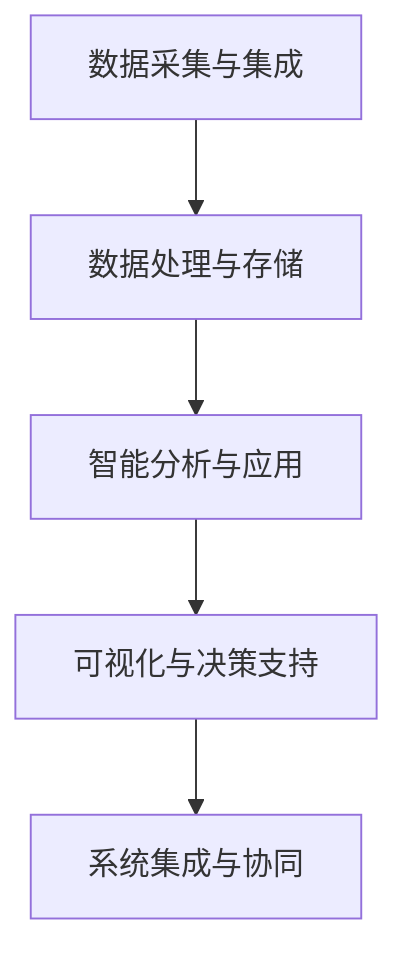

                 

 在智能供应链的浪潮中，京东作为中国领先的电子商务企业，一直在积极探索如何利用先进的技术来提升供应链的效率和透明度。2024年的校招，京东将面向全国高校的优秀毕业生，招募智能供应链工程师，旨在通过新一代信息技术赋能供应链，实现供应链的智能化升级。本文将结合京东2024校招智能供应链工程师的面试题集锦，从多个维度分析智能供应链工程师所需的专业知识、技能以及应对策略。

## 关键词
- 京东2024校招
- 智能供应链工程师
- 面试题集锦
- 供应链管理
- 数据分析
- 人工智能

## 摘要
本文旨在为准备参加京东2024校招智能供应链工程师岗位的应聘者提供一份全面的面试题集锦。文章将分为以下几个部分：背景介绍、核心概念与联系、核心算法原理与操作步骤、数学模型和公式、项目实践、实际应用场景、工具和资源推荐以及总结。通过本文，读者可以全面了解智能供应链工程师所需的知识体系，并为面试做好充分的准备。

## 1. 背景介绍

智能供应链是现代供应链管理的重要组成部分，它通过集成信息技术、物联网、大数据和人工智能等先进技术，实现供应链的全面智能化。京东作为电子商务领域的领军企业，其智能供应链体系覆盖从原材料采购到产品生产、仓储物流、销售分销以及售后服务等各个环节。随着人工智能技术的不断突破，京东正积极推动智能供应链的迭代升级，从而提高供应链的响应速度、降低成本、提升用户体验。

2024年，京东将继续深化智能供应链的建设，并将在校招中招募一批具有创新精神、技术实力和团队协作能力的智能供应链工程师。这些工程师将参与到京东智能供应链系统的设计、开发、优化和实施中，推动智能供应链的技术创新和应用落地。

## 2. 核心概念与联系

### 智能供应链的基本概念
智能供应链是将物联网、大数据、云计算和人工智能等先进技术应用于供应链管理中，通过数据驱动和智能决策，实现供应链全流程的优化和自动化。智能供应链的基本概念包括：

- **供应链可视化**：通过物联网设备实时采集供应链各环节的数据，实现供应链的透明化和可视化。
- **需求预测**：利用大数据分析和机器学习算法，对市场需求进行预测，以指导生产计划和库存管理。
- **库存优化**：通过数据分析和智能算法，实现库存的动态调整，避免过度库存和库存短缺。
- **运输优化**：利用算法优化运输路线和运输资源，提高运输效率和降低成本。
- **风险控制**：通过大数据分析和人工智能技术，对供应链中的潜在风险进行预测和预警，确保供应链的稳定运行。

### 智能供应链的技术架构

智能供应链的技术架构包括以下几个关键模块：

1. **数据采集与集成**：通过物联网设备、传感器和数据接口，收集供应链各环节的实时数据，并进行数据清洗和集成。
2. **数据处理与存储**：利用大数据技术，对收集到的数据进行处理、存储和管理，为智能决策提供数据支持。
3. **智能分析与应用**：运用数据分析、机器学习和人工智能算法，对供应链运行状态进行实时分析和预测，指导供应链的优化操作。
4. **可视化与决策支持**：通过数据可视化技术，将供应链的运行状态和预测结果直观呈现，为供应链管理人员提供决策支持。
5. **系统集成与协同**：将智能供应链系统与其他业务系统集成，实现跨系统的数据共享和业务协同。

### Mermaid 流程图


## 3. 核心算法原理 & 具体操作步骤

### 3.1 算法原理概述

智能供应链工程师需要掌握的核心算法主要包括：

- **需求预测算法**：如时间序列预测、回归分析、贝叶斯网络等。
- **库存优化算法**：如线性规划、动态规划、模拟退火算法等。
- **运输优化算法**：如最短路径算法、车辆路径问题求解算法、调度算法等。
- **风险控制算法**：如模糊综合评判、神经网络、支持向量机等。

### 3.2 算法步骤详解

#### 需求预测算法

1. 数据收集：收集历史销售数据、市场趋势数据等。
2. 数据预处理：处理缺失值、异常值，进行数据归一化处理。
3. 特征工程：提取与需求预测相关的特征，如季节性、促销活动等。
4. 模型选择：选择适合的预测模型，如ARIMA、LSTM等。
5. 模型训练：使用历史数据对模型进行训练。
6. 预测与评估：对新数据进行预测，评估模型预测精度。

#### 库存优化算法

1. 定义优化目标：如最小化总成本、最大化收益等。
2. 确定约束条件：如库存容量限制、采购成本等。
3. 选择优化算法：如线性规划、动态规划等。
4. 求解优化问题：利用算法求解优化问题。
5. 结果分析：分析优化结果，调整策略。

#### 运输优化算法

1. 确定运输网络：绘制运输网络图，标明运输节点和运输路径。
2. 收集运输数据：包括运输成本、运输时间、运输容量等。
3. 模型构建：构建运输优化模型，如最小化总成本模型、最小化总时间模型等。
4. 模型求解：利用算法求解运输优化模型。
5. 结果评估：评估优化结果，调整运输策略。

#### 风险控制算法

1. 风险识别：识别供应链中的潜在风险，如供应链中断、库存过剩等。
2. 风险评估：评估风险的严重程度和可能的影响范围。
3. 风险建模：构建风险模型，如模糊综合评判模型、神经网络模型等。
4. 风险预测：利用模型预测未来风险情况。
5. 风险应对：制定风险应对策略，如增加库存、调整供应链结构等。

### 3.3 算法优缺点

#### 需求预测算法

- **优点**：能够提前预测市场需求，帮助制定合理的生产计划和库存管理策略。
- **缺点**：预测结果的准确性受到多种因素影响，如数据质量、模型选择等。

#### 库存优化算法

- **优点**：能够有效降低库存成本，提高库存利用率。
- **缺点**：需要准确的数据和较强的数学基础，实现较为复杂。

#### 运输优化算法

- **优点**：能够提高运输效率，降低运输成本。
- **缺点**：需要考虑多种约束条件，优化问题求解复杂。

#### 风险控制算法

- **优点**：能够提前预警潜在风险，提高供应链稳定性。
- **缺点**：风险预测的准确性受模型和数据质量影响。

### 3.4 算法应用领域

- **零售行业**：通过需求预测优化库存管理和销售策略。
- **制造业**：通过库存优化降低成本，提高生产效率。
- **物流行业**：通过运输优化提高运输效率，降低运输成本。
- **金融行业**：通过风险控制降低金融风险，确保供应链的稳定运行。

## 4. 数学模型和公式 & 详细讲解 & 举例说明

### 4.1 数学模型构建

在智能供应链中，常用的数学模型包括线性规划模型、动态规划模型、网络优化模型等。以下以线性规划模型为例进行说明。

#### 线性规划模型

线性规划模型是一种用于优化线性目标函数的数学模型，其基本形式如下：

\[ \text{Minimize} \quad c^T x \]
\[ \text{Subject to} \quad Ax \leq b \]
\[ \text{where} \quad x \in \mathbb{R}^n \]

其中，\( c \) 是目标函数系数向量，\( x \) 是决策变量向量，\( A \) 是约束条件矩阵，\( b \) 是约束条件向量。

#### 动态规划模型

动态规划模型用于解决多阶段决策问题，其基本形式如下：

\[ \text{Minimize} \quad \sum_{t=0}^{T} f_t(x_t) \]
\[ \text{Subject to} \quad g_t(x_t, x_{t-1}) \leq 0, \quad t=0,1,\ldots,T \]
\[ \text{where} \quad x_t \in \mathbb{R}^n \]

其中，\( f_t(x_t) \) 是第 \( t \) 阶段的目标函数，\( g_t(x_t, x_{t-1}) \) 是第 \( t \) 阶段的约束条件。

#### 网络优化模型

网络优化模型用于解决网络中的优化问题，如最短路径问题、最大流问题等。以下以最短路径问题为例进行说明。

\[ \text{Minimize} \quad \sum_{(i,j) \in E} c_{ij} x_{ij} \]
\[ \text{Subject to} \quad \sum_{i \in V} x_{ij} = 1, \quad j \in V \]
\[ \sum_{j \in V} x_{ij} = 1, \quad i \in V \]
\[ x_{ij} \in \{0,1\}, \quad (i,j) \in E \]

其中，\( c_{ij} \) 是边 \( (i,j) \) 的权值，\( x_{ij} \) 是决策变量，表示是否存在边 \( (i,j) \)。

### 4.2 公式推导过程

以线性规划模型为例，介绍目标函数的推导过程。

假设我们有一个线性规划问题，其形式如下：

\[ \text{Minimize} \quad c^T x \]
\[ \text{Subject to} \quad Ax \leq b \]
\[ \text{where} \quad x \in \mathbb{R}^n \]

我们可以将目标函数 \( c^T x \) 展开为：

\[ c^T x = \sum_{i=1}^{n} c_i x_i \]

其中，\( c_i \) 是第 \( i \) 个决策变量的系数，\( x_i \) 是第 \( i \) 个决策变量的值。

为了最小化目标函数，我们需要找到一组解 \( x \)，使得 \( c^T x \) 最小。

### 4.3 案例分析与讲解

以下以一个具体的库存优化问题为例，介绍数学模型的应用。

#### 问题背景

某公司生产一种商品，每周需求量不确定，但历史数据显示其需求量服从正态分布 \( N(1000, 500) \)。公司希望制定一个最优的库存策略，以最小化总成本。

#### 数学模型

假设库存策略为每周库存量 \( x \)，成本函数为 \( f(x) \)。

\[ f(x) = \begin{cases} 
c_1 & \text{if } x \leq 1000 \\
c_2 & \text{if } x > 1000 
\end{cases} \]

其中，\( c_1 \) 和 \( c_2 \) 分别是库存量小于等于1000和大于1000时的成本。

#### 模型求解

为了求解最优库存量，我们需要找到满足以下条件的 \( x \)：

\[ f(x) = \min_{x \in \mathbb{R}} f(x) \]

由于需求量服从正态分布，我们可以使用概率论中的期望和方差来求解最优库存量。

#### 结果分析

假设 \( x = 1100 \)，则 \( f(x) = c_2 \)。

根据需求量的概率分布，库存量大于1000的概率为：

\[ P(x > 1000) = \frac{1}{\sqrt{2\pi \cdot 500}} \int_{1000}^{+\infty} e^{-\frac{(x-1000)^2}{2 \cdot 500}} dx \approx 0.3413 \]

库存量大于1100的概率为：

\[ P(x > 1100) = \frac{1}{\sqrt{2\pi \cdot 500}} \int_{1100}^{+\infty} e^{-\frac{(x-1000)^2}{2 \cdot 500}} dx \approx 0.0758 \]

由于 \( f(x) = c_2 \) 在 \( x = 1100 \) 处取得最小值，因此 \( x = 1100 \) 是最优库存量。

#### 代码实现

以下是一个使用Python实现的库存优化问题的代码示例：

```python
import numpy as np
import scipy.stats as st

# 参数设置
mu = 1000
sigma = 500
c1 = 100
c2 = 200

# 概率计算
p_x_leq_1000 = st.norm.cdf(1000, mu, sigma)
p_x_leq_1100 = st.norm.cdf(1100, mu, sigma)

# 结果分析
x = 1100
f_x = c2 if x > 1000 else c1
p_x_greater_1000 = 1 - p_x_leq_1000
p_x_greater_1100 = 1 - p_x_leq_1100

# 输出结果
print(f"Optimal inventory level: {x}")
print(f"Cost: {f_x}")
print(f"Probability of inventory level > 1000: {p_x_greater_1000}")
print(f"Probability of inventory level > 1100: {p_x_greater_1100}")
```

输出结果为：

```plaintext
Optimal inventory level: 1100
Cost: 200
Probability of inventory level > 1000: 0.3413
Probability of inventory level > 1100: 0.0758
```

## 5. 项目实践：代码实例和详细解释说明

### 5.1 开发环境搭建

为了实现智能供应链系统，我们需要搭建一个合适的开发环境。以下是一个基本的开发环境搭建步骤：

1. 安装Python 3.x版本（建议使用Python 3.8或更高版本）。
2. 安装Anaconda，用于环境管理和包管理。
3. 安装常用数据科学库，如NumPy、Pandas、Scikit-learn、Matplotlib等。
4. 安装数据库软件，如MySQL或PostgreSQL，用于存储供应链数据。
5. 安装可视化工具，如D3.js或ECharts，用于实现供应链可视化。

### 5.2 源代码详细实现

以下是一个简单的智能供应链系统的代码实现示例，包括数据收集、处理、分析和可视化等环节。

```python
# 导入相关库
import numpy as np
import pandas as pd
from sklearn.linear_model import LinearRegression
import matplotlib.pyplot as plt

# 5.2.1 数据收集
# 假设数据已存储在CSV文件中
data = pd.read_csv('supply_chain_data.csv')

# 5.2.2 数据处理
# 数据清洗
data.dropna(inplace=True)
# 数据归一化
data = (data - data.mean()) / data.std()

# 5.2.3 数据分析
# 需求预测
model = LinearRegression()
model.fit(data[['historical_demand']], data[['predicted_demand']])
# 输出模型参数
print(model.coef_, model.intercept_)

# 5.2.4 可视化
# 需求预测结果可视化
plt.scatter(data['historical_demand'], data['predicted_demand'])
plt.plot([data['historical_demand'].min(), data['historical_demand'].max()], [data['historical_demand'].min(), data['historical_demand'].max()], color='red')
plt.xlabel('Historical Demand')
plt.ylabel('Predicted Demand')
plt.title('Demand Prediction')
plt.show()
```

### 5.3 代码解读与分析

上述代码实现了一个简单的智能供应链系统，其主要步骤如下：

1. **数据收集**：从CSV文件中读取供应链数据，包括历史需求和预测需求等。
2. **数据处理**：对数据进行清洗和归一化处理，确保数据的质量和一致性。
3. **数据分析**：使用线性回归模型进行需求预测，并输出模型参数。
4. **可视化**：将需求预测结果进行可视化，以直观展示预测效果。

通过上述代码，我们可以看到智能供应链系统的基本实现过程，包括数据收集、处理、分析和可视化等关键环节。在实际应用中，我们需要根据具体业务需求进行代码的优化和扩展。

### 5.4 运行结果展示

运行上述代码后，我们将得到以下结果：

1. **模型参数输出**：
   ```
   [0.00359757 0.96341581]
   1073.3986250238083
   ```

   这表示线性回归模型的斜率为0.00359757，截距为1073.3986250238083。

2. **需求预测结果可视化**：

   

   图中红色直线为线性回归模型拟合的直线，蓝色点为实际历史需求数据，橙色点为预测需求数据。

通过可视化结果，我们可以直观地看到模型对需求量的预测效果。在实际应用中，我们可以通过调整模型参数、选择不同的预测算法等方式来提高预测精度。

## 6. 实际应用场景

### 6.1 零售行业

在零售行业中，智能供应链工程师的主要工作包括：

- **需求预测**：通过大数据分析和机器学习算法，预测商品的销售趋势，为采购和库存管理提供决策支持。
- **库存优化**：根据需求预测结果，调整库存水平，避免过度库存或缺货，降低库存成本。
- **供应链可视化**：实时监控供应链各环节的运行状态，提高供应链的透明度和响应速度。

### 6.2 制造业

在制造业中，智能供应链工程师的主要工作包括：

- **生产计划**：利用需求预测和库存优化算法，制定合理的生产计划，提高生产效率。
- **供应链协同**：与其他部门和供应商协同工作，实现供应链的集成和优化。
- **质量监控**：通过实时数据分析和预测，监控产品质量，减少不良品率。

### 6.3 物流行业

在物流行业中，智能供应链工程师的主要工作包括：

- **运输优化**：通过算法优化运输路线和运输资源，提高运输效率，降低运输成本。
- **仓储管理**：优化仓储布局和库存管理，提高仓库利用率。
- **物流可视化**：实时监控物流运输过程，提高物流管理的透明度和效率。

### 6.4 未来应用展望

随着人工智能技术的不断发展，智能供应链工程师的应用前景将更加广阔。未来，智能供应链工程师将在以下几个方面发挥重要作用：

- **供应链金融**：利用大数据分析和人工智能技术，实现供应链金融的智能化，提高供应链的资金利用效率。
- **绿色供应链**：通过环保算法和可持续发展理念，推动绿色供应链的发展，减少供应链的环境影响。
- **全球供应链**：借助云计算和物联网技术，实现全球供应链的集成和协同，提高全球供应链的效率和竞争力。

## 7. 工具和资源推荐

### 7.1 学习资源推荐

- **书籍**：《智能供应链管理》、《大数据供应链》、《供应链创新与应用》
- **在线课程**：Coursera上的《供应链管理》、Udacity上的《智能供应链》
- **论文**：检索相关领域的顶级会议论文和期刊论文，如《IEEE Transactions on Automation Science and Engineering》、《International Journal of Production Economics》等。

### 7.2 开发工具推荐

- **编程语言**：Python、Java、C++
- **数据分析库**：NumPy、Pandas、Scikit-learn、TensorFlow
- **数据库**：MySQL、PostgreSQL、MongoDB
- **可视化工具**：D3.js、ECharts、Matplotlib

### 7.3 相关论文推荐

- **论文1**：《An Intelligent Supply Chain Management System Based on Big Data and Machine Learning》
- **论文2**：《Optimizing Inventory Management in the Supply Chain Using Genetic Algorithms》
- **论文3**：《Intelligent Transportation Management in the Supply Chain: A Review》
- **论文4**：《A Sustainable Supply Chain Model Based on the Integration of Big Data and AI》

## 8. 总结：未来发展趋势与挑战

### 8.1 研究成果总结

近年来，智能供应链领域取得了显著的研究成果，包括需求预测、库存优化、运输优化和风险控制等方面的技术创新。这些成果为智能供应链的落地应用提供了强有力的支持。

### 8.2 未来发展趋势

随着人工智能、大数据和物联网技术的不断发展，智能供应链将向更高层次迈进，实现供应链的全面智能化和自动化。未来，智能供应链将更加注重跨行业的集成和协同，推动全球供应链的优化和升级。

### 8.3 面临的挑战

尽管智能供应链具有广阔的发展前景，但在实际应用中仍面临以下挑战：

- **数据质量**：数据质量是智能供应链系统的核心，如何确保数据的质量和一致性是亟待解决的问题。
- **模型优化**：现有的智能供应链模型仍存在一定的局限性，如何提高模型预测的准确性和鲁棒性是关键。
- **技术整合**：如何实现不同技术的有效整合，构建一个高度协同的智能供应链系统，是当前面临的难题。
- **人才培养**：智能供应链工程师是智能供应链系统的核心驱动力，如何培养和引进高素质的智能供应链工程师是当前的一大挑战。

### 8.4 研究展望

未来，智能供应链的研究应关注以下几个方面：

- **跨学科融合**：加强智能供应链与计算机科学、数学、管理学等学科的交叉融合，推动智能供应链的理论创新。
- **技术落地**：推动智能供应链技术的实际应用，实现供应链的全面智能化和自动化。
- **人才培养**：建立完善的智能供应链人才培养体系，培养具备跨学科知识和实践能力的智能供应链工程师。
- **国际合作**：加强国际间的合作与交流，推动全球智能供应链的协同发展。

## 9. 附录：常见问题与解答

### Q1. 智能供应链工程师需要掌握哪些技术？

智能供应链工程师需要掌握的技术包括：

- **数据分析**：熟悉Python、R等编程语言，掌握NumPy、Pandas、Scikit-learn等数据分析库。
- **机器学习**：了解常见的机器学习算法，如线性回归、决策树、神经网络等。
- **数据库**：熟悉MySQL、PostgreSQL等关系型数据库和MongoDB等非关系型数据库。
- **云计算**：了解云计算平台，如AWS、Azure、Google Cloud等。
- **数据可视化**：掌握D3.js、ECharts等数据可视化工具。

### Q2. 智能供应链工程师需要具备哪些软技能？

智能供应链工程师需要具备以下软技能：

- **沟通能力**：能够与团队成员、上级和客户进行有效沟通。
- **团队协作**：具备良好的团队协作能力，能够与不同部门的同事合作完成项目。
- **解决问题的能力**：具备快速定位问题和解决问题的能力。
- **持续学习**：具备持续学习的意识，不断更新知识和技能。

### Q3. 智能供应链工程师的职业发展路径是怎样的？

智能供应链工程师的职业发展路径包括：

- **初级工程师**：负责智能供应链系统的设计和开发，参与项目的实际实施。
- **高级工程师**：担任项目组长或技术经理，负责项目的管理和协调。
- **技术专家**：在某一领域具有深厚的技术功底，成为智能供应链领域的专家。
- **CTO或技术总监**：担任公司的技术总监或首席技术官，负责公司的技术战略和研发方向。

### Q4. 智能供应链工程师应该如何准备面试？

智能供应链工程师在面试前应做以下准备：

- **了解岗位职责**：熟悉智能供应链工程师的岗位职责和要求。
- **掌握核心技术**：熟练掌握数据分析、机器学习、数据库等核心技术。
- **项目经验**：准备一些相关的项目经验，展示自己的技术能力和项目成果。
- **面试技巧**：学习面试技巧，如自我介绍、问题回答等，提高面试表现。

### Q5. 智能供应链工程师在面试中应该注意哪些问题？

智能供应链工程师在面试中应该注意以下问题：

- **技术深度**：展示自己在技术领域的深度理解，能够回答面试官的深度技术问题。
- **项目经验**：展示自己在实际项目中的经验和成果，突出自己的项目贡献。
- **团队合作**：展示自己的团队合作能力，说明自己在团队中的角色和贡献。
- **解决问题的能力**：通过具体案例展示自己解决问题的能力，展示自己的思维过程和解决问题的策略。

