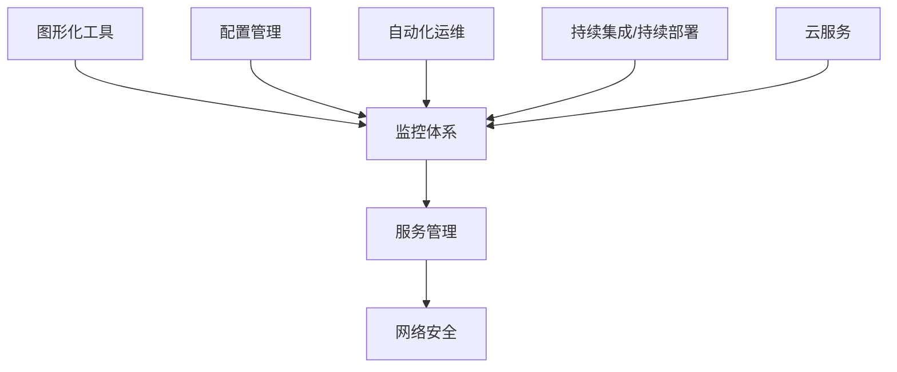

                 

  
> 关键词：京东、校招、运维工程师、面试、问答集锦

> 摘要：本文旨在为准备参加京东2024校招运维工程师岗位的同学们提供一份全面的面试问答集锦。文章从基础知识、技术实践、软实力等多个方面，整理了可能会遇到的面试问题及答案，帮助大家更好地应对面试挑战。

## 1. 背景介绍

京东作为中国最大的电商平台之一，其运维团队承担着保障平台稳定运行、提高用户体验的重任。作为京东2024校招运维工程师的候选人，面试官可能会从多个维度考察你的专业知识、技能以及解决问题的能力。本文将根据京东运维工程师岗位的典型面试问题，为你提供一份详细的面试准备指南。

## 2. 核心概念与联系

在进入具体问题之前，我们首先需要了解一些运维工程师必须掌握的核心概念，如图形化工具、监控体系、服务管理、网络安全等。以下是一个简单的Mermaid流程图，帮助你梳理这些核心概念之间的联系。



### 2.1 图形化工具

图形化工具是运维工程师日常工作中不可或缺的工具，如Kubernetes、Docker、Ansible等。这些工具可以帮助运维人员更高效地进行服务部署、配置管理、自动化运维等操作。

### 2.2 监控体系

监控体系是保障系统稳定运行的关键，它包括监控数据的收集、处理、存储和可视化展示。常见的监控工具如Prometheus、Grafana、Zabbix等。

### 2.3 服务管理

服务管理涉及到如何有效地管理服务，包括服务部署、扩缩容、故障恢复等。这对于运维工程师来说是一项重要的技能。

### 2.4 网络安全

网络安全是运维工作中不可忽视的一环，它包括防火墙配置、网络隔离、安全审计等。确保系统的安全性对于任何企业来说都是至关重要的。

## 3. 核心算法原理 & 具体操作步骤

### 3.1 算法原理概述

在运维工程师的日常工作中，经常需要使用一些核心算法来解决问题，如负载均衡算法、哈希算法、排序算法等。以下是一个简单的负载均衡算法的概述。

### 3.2 算法步骤详解

1. **初始化**：初始化一个哈希表，用于存储服务实例的权重。
2. **请求到达**：当请求到达时，计算请求的哈希值。
3. **选择服务实例**：根据哈希值在哈希表中查找对应的服务实例。
4. **分配请求**：将请求分配给选中的服务实例。

### 3.3 算法优缺点

- **优点**：简单易实现，能够快速响应请求。
- **缺点**：可能导致热点问题，即某个服务实例的请求量过大。

### 3.4 算法应用领域

负载均衡算法广泛应用于分布式系统中，如电商、金融等高并发场景。

## 4. 数学模型和公式

在运维工作中，数学模型和公式也是不可或缺的工具。以下是一个简单的数学模型，用于计算系统的容量规划。

### 4.1 数学模型构建

$$
C = \frac{U}{T}
$$

其中，$C$表示系统的容量，$U$表示用户数量，$T$表示系统的平均响应时间。

### 4.2 公式推导过程

$$
T = \frac{1}{\lambda}
$$

其中，$\lambda$表示用户到达率。假设用户均匀到达，则有：

$$
C = \frac{U}{\frac{1}{\lambda}} = U\lambda
$$

### 4.3 案例分析与讲解

假设我们有一个电商平台，平均每个用户请求的响应时间为2秒，每天的用户数量为100万。根据上述公式，我们可以计算出系统的容量为：

$$
C = 100万 \times 2秒 = 200万秒
$$

这意味着我们的系统每天最多能够处理200万次请求。

## 5. 项目实践：代码实例

### 5.1 开发环境搭建

- 操作系统：Ubuntu 20.04
- 编程语言：Python 3.8
- 开发工具：PyCharm

### 5.2 源代码详细实现

```python
def load_balancer(hashes, instances):
    """
    负载均衡器
    :param hashes: 哈希值列表
    :param instances: 实例列表
    :return: 分配后的实例列表
    """
    result = []
    for hash_value in hashes:
        instance = hash_value % len(instances)
        result.append(instances[instance])
    return result

if __name__ == "__main__":
    hashes = [1, 2, 3, 4, 5]
    instances = ["Instance1", "Instance2", "Instance3"]
    print(load_balancer(hashes, instances))
```

### 5.3 代码解读与分析

该代码实现了一个简单的负载均衡器，它根据哈希值将请求分配给不同的服务实例。这个例子中，我们使用了Python语言，利用哈希值对实例列表进行取模操作，从而实现了负载均衡。

## 6. 实际应用场景

运维工程师在实际工作中，需要根据不同的应用场景选择合适的工具和算法。以下是一些常见的应用场景。

### 6.1 分布式系统部署

分布式系统部署是运维工程师的核心工作之一。通过使用Docker和Kubernetes等图形化工具，可以轻松实现服务实例的部署和管理。

### 6.2 监控体系搭建

搭建一个完善的监控体系，可以帮助运维人员实时掌握系统的运行状态，及时发现并解决问题。常见的监控工具有Prometheus和Grafana等。

### 6.3 安全审计

安全审计是保障系统安全的重要环节。通过配置防火墙、网络隔离和安全审计工具，可以确保系统的安全性。

## 7. 工具和资源推荐

### 7.1 学习资源推荐

- 《运维神器Kubernetes从入门到实践》
- 《Prometheus监控实践：核心技术原理与案例分析》
- 《Docker实战》

### 7.2 开发工具推荐

- PyCharm
- Visual Studio Code
- Git

### 7.3 相关论文推荐

- "Kubernetes: A System for Automating Deployments, Scaling, and Operations of Databases in a Cluster"
- "Prometheus: A Monitoring System and Alerting Tool Built at SoundCloud"
- "Docker: Usage of Docker in Production"

## 8. 总结：未来发展趋势与挑战

随着云计算、大数据和人工智能等技术的发展，运维工程师的角色也在不断演变。未来，运维工程师需要具备更多的跨领域知识和技能，如自动化运维、云计算、网络安全等。同时，面对日益复杂的运维场景，运维工程师需要不断学习新技术，提高自己的技术水平。

## 9. 附录：常见问题与解答

### 9.1 运维工程师的主要职责是什么？

运维工程师的主要职责包括系统监控、故障排除、自动化运维、服务管理等，确保系统的稳定运行。

### 9.2 如何选择合适的负载均衡算法？

选择合适的负载均衡算法需要考虑具体的应用场景，如系统的性能需求、可扩展性等。常见的负载均衡算法包括轮询、最少连接数、源IP哈希等。

### 9.3 如何提高系统的安全性？

提高系统的安全性可以通过配置防火墙、网络隔离、安全审计等措施来实现。同时，定期更新系统和软件，加强对用户身份认证和安全审计。

**作者：禅与计算机程序设计艺术 / Zen and the Art of Computer Programming**  
-------------------------------------------------------------------

请注意，本文仅为示例，仅供参考。实际的面试问题和答案可能会有所不同。建议各位考生在准备面试时，结合自己的实际经验和学习成果，灵活应对各种面试问题。祝大家面试顺利，成功加入京东运维团队！
-------------------------------------------------------------------

