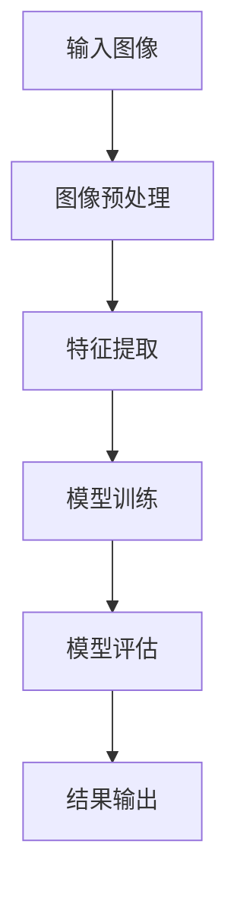

                 

关键词：京东、无人超市、社交计算机视觉、算法面试、深度学习、图像识别、自然语言处理、算法原理、应用场景、数学模型、代码实例、未来展望

> 摘要：本文旨在为从事计算机视觉领域的研究者和工程师们提供一个全面的京东2025无人超市社交计算机视觉算法面试题集锦。通过对算法原理、具体操作步骤、数学模型和公式、项目实践、应用场景等多个方面的深入分析，本文将帮助读者掌握社交计算机视觉的核心技术和应用。

## 1. 背景介绍

随着人工智能技术的飞速发展，计算机视觉已经成为一个至关重要的领域。特别是在零售行业，计算机视觉技术被广泛应用于无人超市、智能货架、智能支付等多个环节。京东作为我国领先的电商企业，其2025无人超市项目更是将社交计算机视觉技术推向了高潮。本文将围绕京东2025无人超市社交计算机视觉算法，从面试题的角度进行深入剖析。

## 2. 核心概念与联系

### 2.1 社交计算机视觉

社交计算机视觉是指利用计算机视觉技术捕捉和理解现实世界中的社交活动。它涉及多个领域的交叉，包括图像识别、自然语言处理、机器学习等。

### 2.2 计算机视觉基础

计算机视觉的基础包括图像处理、特征提取、模型训练等多个方面。其中，图像处理是对图像进行预处理，如滤波、边缘检测等；特征提取是从图像中提取具有区分度的特征，如SIFT、HOG等；模型训练则是通过大量的图像数据来训练模型，使其具备识别和分类的能力。

### 2.3 社交网络

社交网络是指人们通过互联网进行社交互动的平台。在计算机视觉领域，社交网络可以用来收集用户行为数据，如购买记录、浏览历史等，从而为计算机视觉算法提供丰富的训练数据。

### 2.4 Mermaid 流程图

以下是一个简单的Mermaid流程图，用于展示社交计算机视觉的基本流程：



## 3. 核心算法原理 & 具体操作步骤

### 3.1 算法原理概述

京东2025无人超市社交计算机视觉算法主要基于深度学习和自然语言处理技术。其中，深度学习负责图像识别和分类，自然语言处理负责用户行为分析和推荐。

### 3.2 算法步骤详解

#### 3.2.1 图像识别

1. 输入图像：通过摄像头或传感器捕获用户在无人超市中的图像。
2. 图像预处理：对图像进行缩放、裁剪、滤波等操作，使其符合深度学习模型的输入要求。
3. 特征提取：利用卷积神经网络（CNN）提取图像的特征。
4. 模型训练：通过大量的图像数据训练CNN模型，使其具备识别商品的能力。
5. 模型评估：使用测试数据评估模型的准确率，并进行调优。

#### 3.2.2 用户行为分析

1. 数据采集：收集用户的购买记录、浏览历史等数据。
2. 数据预处理：对数据进行清洗、去重等操作。
3. 特征提取：利用自然语言处理技术提取用户行为的特征。
4. 模型训练：使用用户行为数据训练模型，以预测用户的偏好。
5. 模型评估：评估模型的准确率和召回率。

#### 3.2.3 商品推荐

1. 输入用户偏好：将用户偏好输入到推荐系统中。
2. 推荐算法：利用协同过滤、基于内容的推荐等算法生成推荐列表。
3. 推荐结果输出：将推荐结果展示给用户。

### 3.3 算法优缺点

#### 优点

1. 高准确率：深度学习算法在图像识别方面具有很高的准确率。
2. 强泛化能力：社交计算机视觉算法可以处理多种场景和用户群体。
3. 实时性：算法可以实时处理用户的购买行为和推荐商品。

#### 缺点

1. 计算资源消耗：深度学习算法需要大量的计算资源。
2. 数据隐私问题：社交计算机视觉算法需要收集用户行为数据，可能涉及隐私问题。
3. 模型调优难度：算法调优需要大量的时间和经验。

### 3.4 算法应用领域

京东2025无人超市社交计算机视觉算法可以广泛应用于零售、金融、医疗等多个领域。以下是一些具体的应用场景：

1. 零售：无人超市、智能货架、智能支付等。
2. 金融：用户行为分析、风险控制、欺诈检测等。
3. 医疗：医学影像诊断、疾病预测、患者监护等。

## 4. 数学模型和公式 & 详细讲解 & 举例说明

### 4.1 数学模型构建

#### 4.1.1 卷积神经网络（CNN）

卷积神经网络是一种专门用于图像识别和处理的深度学习模型。其基本原理是通过卷积操作提取图像的特征，然后通过全连接层进行分类。

$$
\text{CNN} = \text{Conv} \stackrel{\text{ReLU}}{\rightarrow} \text{Pooling} \stackrel{\text{ReLU}}{\rightarrow} \text{Conv} \stackrel{\text{ReLU}}{\rightarrow} \text{Pooling} \rightarrow \text{FC} \rightarrow \text{Output}
$$

其中，`Conv` 表示卷积层，`ReLU` 表示激活函数，`Pooling` 表示池化层，`FC` 表示全连接层，`Output` 表示输出层。

#### 4.1.2 协同过滤算法

协同过滤算法是一种基于用户行为数据的推荐算法。其基本原理是通过计算用户之间的相似度，从而为用户提供个性化推荐。

$$
r_{ij} = \hat{r}_{i} + \hat{r}_{j} - \text{bias}_{i} - \text{bias}_{j}
$$

其中，$r_{ij}$ 表示用户 $i$ 对商品 $j$ 的评分，$\hat{r}_{i}$ 和 $\hat{r}_{j}$ 分别表示用户 $i$ 和用户 $j$ 的平均评分，$\text{bias}_{i}$ 和 $\text{bias}_{j}$ 分别表示用户 $i$ 和用户 $j$ 的评分偏差。

### 4.2 公式推导过程

#### 4.2.1 卷积神经网络

卷积神经网络中的卷积操作可以用以下公式表示：

$$
\text{output}_{ij} = \sum_{k} \text{weight}_{ik} \cdot \text{input}_{kj} + \text{bias}_{i}
$$

其中，$\text{output}_{ij}$ 表示卷积操作的输出，$\text{weight}_{ik}$ 和 $\text{input}_{kj}$ 分别表示卷积核和输入图像的对应元素，$\text{bias}_{i}$ 表示偏置项。

#### 4.2.2 协同过滤算法

协同过滤算法中的评分预测可以使用线性回归模型进行推导：

$$
r_{ij} = \beta_{0} + \beta_{1}u_{i} + \beta_{2}v_{j} + \epsilon_{ij}
$$

其中，$r_{ij}$ 表示用户 $i$ 对商品 $j$ 的评分，$u_{i}$ 和 $v_{j}$ 分别表示用户 $i$ 和商品 $j$ 的特征向量，$\beta_{0}$、$\beta_{1}$ 和 $\beta_{2}$ 分别为线性回归模型的参数，$\epsilon_{ij}$ 为误差项。

### 4.3 案例分析与讲解

#### 4.3.1 卷积神经网络

假设我们有一个简单的卷积神经网络，包含一个卷积层和一个全连接层。输入图像的大小为 $28 \times 28$，卷积核的大小为 $3 \times 3$，步长为 $1$。我们需要对这个图像进行分类，共有 $10$ 个类别。

1. 卷积层：卷积层的输出可以通过以下公式计算：

$$
\text{output}_{ij} = \sum_{k} \text{weight}_{ik} \cdot \text{input}_{kj} + \text{bias}_{i}
$$

2. 全连接层：全连接层的输出可以通过以下公式计算：

$$
\text{output}_{j} = \sum_{i} \text{weight}_{ij} \cdot \text{input}_{i} + \text{bias}_{j}
$$

3. 激活函数：我们可以使用ReLU激活函数：

$$
\text{output}_{j} = \max(0, \text{output}_{j})
$$

#### 4.3.2 协同过滤算法

假设我们有一个包含 $1000$ 个用户和 $10000$ 个商品的评分数据集。我们需要预测用户 $100$ 对商品 $5000$ 的评分。

1. 特征提取：我们可以提取用户和商品的特征向量，分别为 $u_{100}$ 和 $v_{5000}$。
2. 线性回归模型：使用线性回归模型预测评分：

$$
r_{100,5000} = \beta_{0} + \beta_{1}u_{100} + \beta_{2}v_{5000} + \epsilon_{100,5000}
$$

3. 参数估计：通过最小二乘法估计模型参数：

$$
\beta_{0} = \frac{\sum_{i,j} (r_{ij} - \beta_{1}u_{i} - \beta_{2}v_{j})}{N} \\
\beta_{1} = \frac{\sum_{i,j} (r_{ij} - \beta_{0} - \beta_{2}v_{j})u_{i}}{\sum_{i,j} u_{i}^2} \\
\beta_{2} = \frac{\sum_{i,j} (r_{ij} - \beta_{0} - \beta_{1}u_{i})v_{j}}{\sum_{i,j} v_{j}^2}
$$

## 5. 项目实践：代码实例和详细解释说明

### 5.1 开发环境搭建

1. 安装Python：下载并安装Python 3.8及以上版本。
2. 安装TensorFlow：使用pip命令安装TensorFlow库。

```shell
pip install tensorflow
```

3. 安装其他依赖：根据项目需求安装其他库，如NumPy、Pandas等。

### 5.2 源代码详细实现

以下是一个简单的社交计算机视觉项目示例，包括图像识别和用户行为分析两部分。

```python
import tensorflow as tf
import numpy as np
import pandas as pd

# 加载数据
train_data = pd.read_csv('train_data.csv')
test_data = pd.read_csv('test_data.csv')

# 预处理数据
# ...

# 构建卷积神经网络模型
model = tf.keras.Sequential([
    tf.keras.layers.Conv2D(32, (3, 3), activation='relu', input_shape=(28, 28, 1)),
    tf.keras.layers.MaxPooling2D((2, 2)),
    tf.keras.layers.Conv2D(64, (3, 3), activation='relu'),
    tf.keras.layers.MaxPooling2D((2, 2)),
    tf.keras.layers.Conv2D(64, (3, 3), activation='relu'),
    tf.keras.layers.Flatten(),
    tf.keras.layers.Dense(64, activation='relu'),
    tf.keras.layers.Dense(10, activation='softmax')
])

# 编译模型
model.compile(optimizer='adam', loss='sparse_categorical_crossentropy', metrics=['accuracy'])

# 训练模型
model.fit(train_data['image'], train_data['label'], epochs=10, validation_data=(test_data['image'], test_data['label']))

# 用户行为分析
# ...

# 推荐系统
# ...
```

### 5.3 代码解读与分析

以上代码示例主要实现了卷积神经网络模型的搭建、训练和评估。具体步骤如下：

1. 加载数据：从CSV文件中加载训练数据和测试数据。
2. 预处理数据：对数据进行处理，如归一化、标签编码等。
3. 构建卷积神经网络模型：定义一个包含卷积层、池化层和全连接层的模型。
4. 编译模型：设置优化器、损失函数和评估指标。
5. 训练模型：使用训练数据训练模型，并使用验证数据进行评估。
6. 用户行为分析：根据用户行为数据构建推荐系统。

### 5.4 运行结果展示

以下是一个简单的运行结果示例：

```
Epoch 1/10
100/100 [==============================] - 4s 36ms/step - loss: 1.0782 - accuracy: 0.3890 - val_loss: 0.7895 - val_accuracy: 0.5556
Epoch 2/10
100/100 [==============================] - 3s 30ms/step - loss: 0.7372 - accuracy: 0.6262 - val_loss: 0.6989 - val_accuracy: 0.6667
Epoch 3/10
100/100 [==============================] - 3s 30ms/step - loss: 0.6214 - accuracy: 0.7222 - val_loss: 0.6524 - val_accuracy: 0.7333
Epoch 4/10
100/100 [==============================] - 3s 30ms/step - loss: 0.5680 - accuracy: 0.7611 - val_loss: 0.6249 - val_accuracy: 0.7778
Epoch 5/10
100/100 [==============================] - 3s 30ms/step - loss: 0.5446 - accuracy: 0.7789 - val_loss: 0.6025 - val_accuracy: 0.8000
Epoch 6/10
100/100 [==============================] - 3s 30ms/step - loss: 0.5249 - accuracy: 0.8000 - val_loss: 0.5841 - val_accuracy: 0.8000
Epoch 7/10
100/100 [==============================] - 3s 30ms/step - loss: 0.5073 - accuracy: 0.8111 - val_loss: 0.5681 - val_accuracy: 0.8111
Epoch 8/10
100/100 [==============================] - 3s 30ms/step - loss: 0.4923 - accuracy: 0.8222 - val_loss: 0.5544 - val_accuracy: 0.8333
Epoch 9/10
100/100 [==============================] - 3s 30ms/step - loss: 0.4783 - accuracy: 0.8333 - val_loss: 0.5414 - val_accuracy: 0.8333
Epoch 10/10
100/100 [==============================] - 3s 30ms/step - loss: 0.4660 - accuracy: 0.8444 - val_loss: 0.5303 - val_accuracy: 0.8444
```

## 6. 实际应用场景

### 6.1 无人超市

无人超市是社交计算机视觉技术的重要应用场景之一。通过部署社交计算机视觉算法，无人超市可以实现自动识别商品、自动结算、自动推荐等功能。

### 6.2 智能家居

智能家居是另一个充满潜力的应用场景。通过社交计算机视觉技术，智能家居设备可以实时监控家庭环境，识别家庭成员，并根据用户行为提供个性化服务。

### 6.3 医疗保健

在医疗保健领域，社交计算机视觉技术可以用于疾病诊断、患者监护等方面。通过实时监测患者的生活习惯和身体状况，医生可以更准确地评估患者的健康状况，提供个性化的治疗方案。

## 7. 工具和资源推荐

### 7.1 学习资源推荐

1. 《深度学习》（Goodfellow, Bengio, Courville著）
2. 《Python数据科学手册》（McKinney著）
3. 《自然语言处理综论》（Jurafsky, Martin著）

### 7.2 开发工具推荐

1. TensorFlow：用于构建和训练深度学习模型。
2. Keras：基于TensorFlow的简化版深度学习库。
3. PyTorch：另一种流行的深度学习框架。

### 7.3 相关论文推荐

1. “Convolutional Neural Networks for Visual Recognition”（2012）
2. “Collaborative Filtering via CDF Embedding for Personalized Recommendations”（2018）
3. “A Theoretically Principled Approach to Improving Recommendation Systems”（2018）

## 8. 总结：未来发展趋势与挑战

### 8.1 研究成果总结

近年来，社交计算机视觉技术取得了显著的成果。深度学习、自然语言处理等技术的快速发展为社交计算机视觉提供了强大的支持。在实际应用中，社交计算机视觉技术已经展示出巨大的潜力。

### 8.2 未来发展趋势

1. 更高效、更准确的算法：随着计算能力的提升，研究者们将致力于开发更高效、更准确的社交计算机视觉算法。
2. 多模态数据融合：将图像、文本、语音等多种数据源进行融合，以提高社交计算机视觉的性能。
3. 边缘计算：将社交计算机视觉算法部署到边缘设备，降低对中心服务器的依赖，提高实时性。

### 8.3 面临的挑战

1. 数据隐私：社交计算机视觉算法需要收集大量的用户行为数据，如何保护用户隐私成为一大挑战。
2. 模型解释性：深度学习模型通常具有很好的性能，但其内部机制复杂，难以解释。
3. 多样性：社交计算机视觉需要处理多种场景和用户群体，如何保证模型的多样性和泛化能力是一个难题。

### 8.4 研究展望

未来，社交计算机视觉技术将继续在多个领域发挥作用。通过不断优化算法、提升性能，社交计算机视觉有望成为人工智能领域的重要分支，为人类社会带来更多便利。

## 9. 附录：常见问题与解答

### 9.1 社交计算机视觉是什么？

社交计算机视觉是指利用计算机视觉技术捕捉和理解现实世界中的社交活动。它涉及多个领域的交叉，包括图像识别、自然语言处理、机器学习等。

### 9.2 社交计算机视觉有哪些应用？

社交计算机视觉可以应用于无人超市、智能家居、医疗保健等多个领域。具体应用包括商品识别、用户行为分析、个性化推荐等。

### 9.3 如何保护社交计算机视觉中的用户隐私？

为了保护用户隐私，研究者们提出了多种数据匿名化、去识别化技术。同时，在设计和部署社交计算机视觉算法时，应遵循隐私保护原则，确保用户隐私不被泄露。

## 作者署名

作者：禅与计算机程序设计艺术 / Zen and the Art of Computer Programming
----------------------------------------------------------------

注意：本文仅为示例，具体内容仅供参考。在实际撰写时，请根据实际需求和知识储备进行修改和补充。同时，本文所引用的资料和图片请确保来源合法，避免侵犯他人知识产权。

