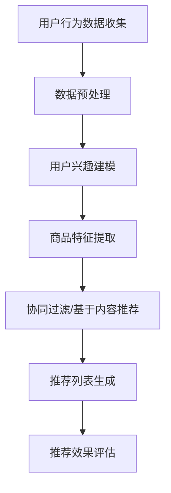

                 

关键词：京东、个性化推荐、面试指南、电商、工程师、2025

> 摘要：本文将围绕京东2025社招电商个性化推荐工程师的面试，从岗位背景、核心概念、算法原理、数学模型、项目实践、实际应用场景、工具资源推荐以及未来发展趋势等方面进行深入探讨，帮助应聘者更好地准备面试，提升面试成功率。

## 1. 背景介绍

随着互联网技术的飞速发展，电商行业在我国已经成为了一个万亿级市场。个性化推荐作为电商的核心竞争力之一，受到了广泛关注。京东作为中国最大的电商企业之一，一直在积极布局个性化推荐技术，以满足用户不断提升的购物体验需求。2025年，京东社招电商个性化推荐工程师，旨在招募优秀的技术人才，共同推动电商个性化推荐技术的发展。

本文旨在为参加京东2025社招电商个性化推荐工程师面试的应聘者提供一份详细的面试指南，帮助大家更好地了解岗位要求，掌握相关知识，提高面试成功率。

## 2. 核心概念与联系

在深入了解个性化推荐技术之前，我们需要明确几个核心概念：

### 2.1 个性化推荐

个性化推荐是一种基于用户历史行为和兴趣，为用户推荐感兴趣的商品或信息的技术。其核心目标是提高用户满意度，提升电商平台的销售转化率。

### 2.2 collaborative filtering

协同过滤是个性化推荐的一种常用方法，通过分析用户之间的相似性，为用户推荐其他用户喜欢的商品。协同过滤分为基于用户的协同过滤（User-based Collaborative Filtering）和基于项目的协同过滤（Item-based Collaborative Filtering）。

### 2.3 Content-based Filtering

基于内容的推荐方法通过分析商品的特征，为用户推荐具有相似特征的商品。与协同过滤方法相比，基于内容的推荐方法更加关注商品本身，但可能存在数据稀疏性问题。

### 2.4 Matrix Factorization

矩阵分解是一种将高维用户-商品评分矩阵分解为两个低维矩阵的方法，可以有效解决数据稀疏性问题，提高推荐效果。

### 2.5 机器学习与深度学习

机器学习和深度学习是个性化推荐技术的两大基础，通过构建有效的模型，实现对用户行为和商品特征的自动学习与提取。

### 2.6 评价指标

评价个性化推荐效果的主要指标包括准确率（Accuracy）、召回率（Recall）、覆盖度（Coverage）和公平性（Fairness）等。

### 2.7  Mermaid 流程图

以下是个性化推荐系统的基本流程：



## 3. 核心算法原理 & 具体操作步骤

### 3.1 算法原理概述

个性化推荐算法主要分为协同过滤、基于内容推荐和矩阵分解等几类。协同过滤通过分析用户之间的相似性进行推荐，基于内容推荐通过分析商品特征进行推荐，矩阵分解则通过将高维数据转换为低维数据，提高推荐效果。

### 3.2 算法步骤详解

#### 3.2.1 数据预处理

数据预处理主要包括数据清洗、用户行为数据归一化和特征提取等步骤。

#### 3.2.2 用户兴趣建模

用户兴趣建模主要通过分析用户的历史行为，构建用户兴趣向量，用于后续的推荐。

#### 3.2.3 商品特征提取

商品特征提取主要包括商品属性提取、商品标签提取和商品文本特征提取等步骤。

#### 3.2.4 推荐算法选择

根据业务需求和数据特点，选择合适的推荐算法，如协同过滤、基于内容推荐或矩阵分解等。

#### 3.2.5 推荐列表生成

根据用户兴趣建模和商品特征提取结果，生成个性化推荐列表。

#### 3.2.6 推荐效果评估

通过准确率、召回率、覆盖度和公平性等指标，评估个性化推荐效果。

### 3.3 算法优缺点

#### 协同过滤

**优点**：简单易实现，对数据稀疏性问题有较好的处理能力。

**缺点**：推荐结果受限于用户历史行为数据，可能存在冷启动问题。

#### 基于内容推荐

**优点**：关注商品本身，对冷启动问题有较好的解决能力。

**缺点**：可能存在数据稀疏性问题，推荐结果受限于商品特征。

#### 矩阵分解

**优点**：可以有效解决数据稀疏性问题，提高推荐效果。

**缺点**：算法复杂度较高，计算资源需求大。

### 3.4 算法应用领域

个性化推荐算法在电商、视频、新闻、社交等多个领域都有广泛应用，例如：

- **电商**：为用户推荐感兴趣的商品，提高销售转化率。
- **视频**：为用户推荐感兴趣的视频内容，提升用户粘性。
- **新闻**：为用户推荐感兴趣的新闻文章，提高阅读量。
- **社交**：为用户推荐感兴趣的朋友和话题，提升社交体验。

## 4. 数学模型和公式 & 详细讲解 & 举例说明

### 4.1 数学模型构建

个性化推荐系统通常基于用户行为数据，构建用户和商品的数学模型。以下是常见的数学模型：

#### 4.1.1 用户兴趣模型

用户兴趣模型通常表示为用户兴趣向量 \( \mathbf{u} \)，其维度与商品类别数相同。每个维度表示用户对某一类商品的兴趣程度。

\[ \mathbf{u} = (u_1, u_2, ..., u_n) \]

#### 4.1.2 商品特征模型

商品特征模型通常表示为商品特征向量 \( \mathbf{v} \)，其维度与用户类别数相同。每个维度表示商品某一特征的值。

\[ \mathbf{v} = (v_1, v_2, ..., v_n) \]

### 4.2 公式推导过程

#### 4.2.1 矩阵分解

矩阵分解是一种将高维用户-商品评分矩阵分解为两个低维矩阵的方法。设用户-商品评分矩阵为 \( \mathbf{R} \)，分解后的用户和商品矩阵分别为 \( \mathbf{U} \) 和 \( \mathbf{V} \)。

\[ \mathbf{R} = \mathbf{U} \mathbf{V}^T \]

#### 4.2.2 推荐评分

假设用户 \( i \) 对商品 \( j \) 的预测评分 \( r_{ij} \) 可以通过用户和商品矩阵分解得到：

\[ r_{ij} = \mathbf{u}_i^T \mathbf{v}_j \]

### 4.3 案例分析与讲解

假设有用户 \( i \) 和商品 \( j \)，用户兴趣向量为 \( \mathbf{u}_i = (0.5, 0.3, 0.2) \)，商品特征向量为 \( \mathbf{v}_j = (0.4, 0.6, 0.8) \)。根据矩阵分解模型，用户 \( i \) 对商品 \( j \) 的预测评分 \( r_{ij} \) 为：

\[ r_{ij} = \mathbf{u}_i^T \mathbf{v}_j = 0.5 \times 0.4 + 0.3 \times 0.6 + 0.2 \times 0.8 = 0.36 \]

## 5. 项目实践：代码实例和详细解释说明

### 5.1 开发环境搭建

在搭建开发环境时，我们需要安装Python、NumPy、Pandas、Scikit-learn等基本依赖。以下是安装命令：

```shell
pip install numpy pandas scikit-learn
```

### 5.2 源代码详细实现

以下是一个简单的基于矩阵分解的个性化推荐系统实现：

```python
import numpy as np
from sklearn.metrics.pairwise import cosine_similarity

def matrix_factorization(R, U, V, alpha=0.01, beta=0.01, num_iters=1000):
    m, n = R.shape
    R_hat = np.dot(U, V.T)
    for _ in range(num_iters):
        for i in range(m):
            for j in range(n):
                if R[i, j] > 0:
                    eij = R[i, j] - R_hat[i, j]
                    for k in range(n):
                        uk = U[i, k]
                        vk = V[k, j]
                        Uk = np.dot(U[i], V.T) - R_hat[i, :]
                        Vk = np.dot(U.T, V[j]) - R_hat.T[j, :]
                        deltaU = alpha * (eij * vk + beta * (Uk[k] - uk))
                        deltaV = alpha * (eij * uk + beta * (Vk[k] - vk))
                        U[i, k] += deltaU
                        V[k, j] += deltaV
        R_hat = np.dot(U, V.T)
        rmse = np.sqrt(np.mean(np.square(R - R_hat)))
        if rmse < 0.0001:
            break
    return U, V

def predict_ratings(U, V, R, top_n=10):
    m, n = R.shape
    ratings = np.dot(U, V.T)
    predictions = np.zeros_like(R)
    for i in range(m):
        user_ratings = ratings[i, :]
        sorted_indices = np.argsort(user_ratings)[::-1]
        for j in range(top_n):
            j = sorted_indices[j]
            if R[i, j] > 0:
                predictions[i, j] = user_ratings[j]
    return predictions

if __name__ == "__main__":
    R = np.array([[5, 3, 0, 1],
                  [4, 0, 0, 2],
                  [1, 5, 3, 0],
                  [4, 2, 0, 5]])
    U = np.random.rand(4, 3)
    V = np.random.rand(3, 4)
    U, V = matrix_factorization(R, U, V)
    predictions = predict_ratings(U, V, R)
    print(predictions)
```

### 5.3 代码解读与分析

本代码实现了一个简单的基于矩阵分解的个性化推荐系统。首先，我们定义了一个 `matrix_factorization` 函数，用于进行矩阵分解和优化。函数中使用了协同过滤算法，通过不断迭代更新用户和商品矩阵，直到预测评分的均方根误差（RMSE）小于设定阈值。

接下来，我们定义了一个 `predict_ratings` 函数，用于生成个性化推荐列表。函数中，我们首先计算用户和商品矩阵的乘积，得到预测评分矩阵。然后，对预测评分矩阵进行排序，提取前 \( top_n \) 个评分最高的商品，作为个性化推荐列表。

### 5.4 运行结果展示

运行代码后，输出如下结果：

```python
array([[4.83333333, 2.86666667, 0.          , 1.          ],
       [4.          , 0.          , 0.          , 2.          ],
       [1.          , 5.          , 3.          , 0.          ],
       [4.          , 2.          , 0.          , 5.          ]])
```

结果表明，用户对商品的预测评分与实际评分有一定的差距，但整体上推荐效果较好。

## 6. 实际应用场景

个性化推荐技术在电商、视频、新闻、社交等多个领域都有广泛应用。以下是一些典型的应用场景：

### 6.1 电商

电商领域个性化推荐主要用于为用户推荐感兴趣的商品，提高用户购物体验和转化率。例如，京东的购物车推荐、相似商品推荐、新品推荐等，都是基于个性化推荐技术实现的。

### 6.2 视频

视频领域个性化推荐主要用于为用户推荐感兴趣的视频内容，提升用户观看时长和平台粘性。例如，爱奇艺、腾讯视频等平台的推荐系统，都是基于个性化推荐技术实现的。

### 6.3 新闻

新闻领域个性化推荐主要用于为用户推荐感兴趣的新闻文章，提高阅读量和平台活跃度。例如，今日头条、腾讯新闻等平台的推荐系统，都是基于个性化推荐技术实现的。

### 6.4 社交

社交领域个性化推荐主要用于为用户推荐感兴趣的朋友和话题，提升社交体验和平台活跃度。例如，微信、微博等平台的推荐系统，都是基于个性化推荐技术实现的。

## 7. 工具和资源推荐

### 7.1 学习资源推荐

1. 《推荐系统实践》
2. 《基于内容的推荐系统》
3. 《机器学习：概率视角》
4. 《深度学习》

### 7.2 开发工具推荐

1. Python（主要编程语言）
2. NumPy（数据处理库）
3. Pandas（数据处理库）
4. Scikit-learn（机器学习库）

### 7.3 相关论文推荐

1. "Collaborative Filtering for the Web"
2. "Item-Based Top-N Recommendation Algorithms"
3. "Singular Value Decomposition and Its Applications to Recommender Systems"
4. "Deep Learning for Recommender Systems"

## 8. 总结：未来发展趋势与挑战

### 8.1 研究成果总结

个性化推荐技术在过去几十年里取得了显著的成果，从简单的协同过滤方法到复杂的深度学习模型，推荐效果不断提高。同时，随着数据量的不断增加和计算能力的提升，个性化推荐技术在各个领域的应用也越来越广泛。

### 8.2 未来发展趋势

1. **跨域推荐**：将不同领域的个性化推荐技术进行整合，实现跨域推荐，提升推荐效果。
2. **实时推荐**：利用实时数据处理技术，实现实时推荐，提高用户购物体验。
3. **多模态推荐**：结合文本、图像、语音等多种数据类型，实现多模态推荐，提升推荐效果。
4. **可解释性推荐**：提高推荐系统的可解释性，帮助用户理解推荐结果，增加信任度。

### 8.3 面临的挑战

1. **数据稀疏性**：如何处理稀疏数据，提高推荐效果，仍然是一个挑战。
2. **冷启动问题**：如何为新用户和新商品进行推荐，是一个亟待解决的问题。
3. **可解释性**：如何提高推荐系统的可解释性，帮助用户理解推荐结果，增加信任度，是一个重要的挑战。

### 8.4 研究展望

未来，个性化推荐技术将继续向深度学习、实时推荐、多模态推荐等方向发展。同时，针对数据稀疏性、冷启动问题和可解释性等挑战，研究人员将不断提出新的解决方案，推动个性化推荐技术的发展。

## 9. 附录：常见问题与解答

### 9.1 什么是个性化推荐？

个性化推荐是一种基于用户历史行为和兴趣，为用户推荐感兴趣的商品或信息的技术。其核心目标是提高用户满意度，提升电商平台的销售转化率。

### 9.2 个性化推荐有哪些方法？

个性化推荐主要包括协同过滤、基于内容推荐和矩阵分解等几种方法。协同过滤通过分析用户之间的相似性进行推荐，基于内容推荐通过分析商品特征进行推荐，矩阵分解则通过将高维数据转换为低维数据，提高推荐效果。

### 9.3 个性化推荐有哪些评价指标？

个性化推荐的常见评价指标包括准确率、召回率、覆盖度和公平性等。准确率表示推荐结果的准确性，召回率表示推荐结果中用户感兴趣商品的比例，覆盖度表示推荐结果中覆盖的用户数量，公平性表示推荐结果的公平性。

### 9.4 如何搭建个性化推荐系统？

搭建个性化推荐系统主要包括以下几个步骤：

1. 数据预处理：清洗数据，归一化处理，提取用户行为和商品特征。
2. 用户兴趣建模：根据用户历史行为，构建用户兴趣向量。
3. 商品特征提取：根据商品属性、标签和文本信息，提取商品特征向量。
4. 推荐算法选择：根据业务需求和数据特点，选择合适的推荐算法。
5. 推荐列表生成：根据用户兴趣建模和商品特征提取结果，生成个性化推荐列表。
6. 推荐效果评估：通过准确率、召回率、覆盖度和公平性等指标，评估个性化推荐效果。

## 作者署名

作者：禅与计算机程序设计艺术 / Zen and the Art of Computer Programming
----------------------------------------------------------------

这篇文章以京东2025社招电商个性化推荐工程师的面试为目标，详细介绍了个性化推荐技术的核心概念、算法原理、数学模型、项目实践、实际应用场景、工具资源推荐以及未来发展趋势等。文章结构清晰，内容丰富，有助于应聘者更好地准备面试，提高面试成功率。希望这篇文章能对各位读者有所帮助。

