                 

关键词：京东方智慧系统、校招面试、真题汇总、解析与解答、人工智能、算法、技术、职业发展

## 摘要

本文旨在汇总和分析2024年京东方智慧系统创新中心的校招面试真题，为求职者提供有针对性的解题思路和方法。通过对真题的深入解析，本文将揭示京东方智慧系统在招聘过程中关注的重点领域和技术难点，帮助读者更好地准备面试，提升求职成功率。文章还将介绍相关背景知识、核心概念、算法原理、数学模型、项目实践以及实际应用场景，以全方位展示京东方智慧系统的技术魅力和未来发展方向。

## 1. 背景介绍

### 京东方智慧系统创新中心

京东方智慧系统创新中心（BOE iCreate Center）是京东方科技集团旗下的一个重要部门，专注于人工智能、物联网、大数据等领域的技术研发和创新。该中心致力于推动智慧显示、智慧健康、智慧交通、智慧城市等领域的智能化发展，为全球客户提供领先的智慧解决方案。随着科技的快速发展，京东方智慧系统创新中心已经成为全球范围内人工智能领域的领军企业之一。

### 校招面试的重要性

对于应届毕业生而言，校招面试是进入心仪企业的重要途径之一。京东方智慧系统创新中心的校招面试不仅是对求职者专业知识水平的考察，更是对其综合素质和未来职业发展潜力的评估。通过深入了解京东方智慧系统创新中心的面试真题，求职者可以更好地把握招聘需求，提升自身竞争力。

## 2. 核心概念与联系

### 核心概念

在面试过程中，京东方智慧系统创新中心主要关注以下几个核心概念：

1. **人工智能（AI）**：人工智能是模拟、延伸和扩展人的智能的理论、方法、技术及应用。它涵盖了机器学习、深度学习、自然语言处理、计算机视觉等多个领域。
2. **物联网（IoT）**：物联网是通过互联网将各种设备、传感器、人等实体互联，实现智能感知、识别和管理的技术。它涉及到传感器技术、网络通信、数据处理等多个方面。
3. **大数据**：大数据是指无法使用传统数据处理工具在合理时间内进行捕捉、管理和处理的大量数据。它涉及数据采集、存储、处理、分析等多个环节。
4. **云计算**：云计算是一种通过互联网按需提供计算资源、存储资源和网络资源的服务模式。它涉及到虚拟化技术、分布式计算、大数据处理等多个方面。
5. **区块链**：区块链是一种分布式数据库技术，通过加密算法和共识机制确保数据的安全性和完整性。它广泛应用于金融、物流、医疗等多个领域。

### Mermaid 流程图

以下是一个简单的 Mermaid 流程图，展示了上述核心概念之间的联系：

```mermaid
graph TB
    A[人工智能] --> B[机器学习]
    A --> C[深度学习]
    A --> D[自然语言处理]
    A --> E[计算机视觉]
    B --> F[监督学习]
    B --> G[无监督学习]
    B --> H[半监督学习]
    C --> I[卷积神经网络]
    C --> J[递归神经网络]
    C --> K[生成对抗网络]
    D --> L[语言模型]
    D --> M[机器翻译]
    D --> N[语音识别]
    E --> O[图像识别]
    E --> P[目标检测]
    E --> Q[人脸识别]
    B --> R[数据预处理]
    B --> S[模型评估]
    B --> T[模型优化]
    G --> U[聚类]
    G --> V[降维]
    G --> W[关联规则学习]
    H --> X[样本增强]
    H --> Y[迁移学习]
    H --> Z[在线学习]
    C --> AA[优化算法]
    C --> BB[激活函数]
    C --> CC[损失函数]
    D --> DD[词嵌入]
    D --> EE[文本分类]
    D --> FF[情感分析]
    E --> GG[特征提取]
    E --> HH[特征融合]
    A --> II[自动驾驶]
    A --> JJ[智能家居]
    A --> KK[智能医疗]
    A --> LL[智能安防]
    B --> MM[强化学习]
    B --> NN[图模型]
    B --> OO[知识图谱]
    B --> PP[元学习]
    A --> QQ[数据挖掘]
    A --> RR[数据安全]
    A --> SS[数据分析]
    A --> TT[数据可视化]
    E --> UU[图像生成]
    E --> VV[视频处理]
    E --> WW[图像增强]
    B --> XX[神经网络架构]
    B --> YY[优化器]
    B --> ZZ[深度学习框架]
    A --> AAA[机器人技术]
    A --> BBB[增强现实]
    A --> CCC[虚拟现实]
    A --> DDD[数字孪生]
```



## 3. 核心算法原理 & 具体操作步骤

### 3.1 算法原理概述

在面试过程中，京东方智慧系统创新中心对以下核心算法原理进行了考察：

1. **机器学习算法**：包括监督学习、无监督学习和半监督学习，如线性回归、决策树、支持向量机、神经网络等。
2. **深度学习算法**：包括卷积神经网络（CNN）、递归神经网络（RNN）、生成对抗网络（GAN）等。
3. **自然语言处理算法**：包括语言模型、文本分类、情感分析等。
4. **计算机视觉算法**：包括图像识别、目标检测、人脸识别等。
5. **物联网算法**：包括数据采集、传输、处理和分析等。
6. **大数据算法**：包括数据预处理、数据挖掘、数据安全等。
7. **区块链算法**：包括加密算法、共识机制、智能合约等。

### 3.2 算法步骤详解

以下是一个简单的机器学习算法步骤详解：

1. **数据采集**：从各种来源（如数据库、文件、传感器等）收集数据。
2. **数据预处理**：对采集到的数据进行清洗、归一化、缺失值填充等处理。
3. **特征提取**：从原始数据中提取有助于分类或回归的特征。
4. **模型选择**：根据问题类型和特征数据选择合适的模型，如线性回归、决策树、支持向量机等。
5. **模型训练**：使用训练数据集对模型进行训练。
6. **模型评估**：使用验证数据集对模型进行评估，如准确率、召回率、F1值等。
7. **模型优化**：根据评估结果对模型进行调整，如参数调整、正则化等。
8. **模型部署**：将训练好的模型部署到实际应用场景中。

### 3.3 算法优缺点

以下是对机器学习算法、深度学习算法、自然语言处理算法、计算机视觉算法等核心算法优缺点的简要分析：

1. **机器学习算法**：
   - 优点：适用于各种类型的预测问题，易于实现，可扩展性强。
   - 缺点：对大规模数据集的训练时间较长，模型可解释性较差。
2. **深度学习算法**：
   - 优点：具有强大的特征学习能力，适用于复杂的预测问题，模型可解释性较强。
   - 缺点：对大规模数据集的训练时间较长，对硬件资源要求较高。
3. **自然语言处理算法**：
   - 优点：适用于文本分类、情感分析等任务，可处理大规模文本数据。
   - 缺点：对语言理解能力要求较高，模型训练时间较长。
4. **计算机视觉算法**：
   - 优点：适用于图像识别、目标检测等任务，可处理大规模图像数据。
   - 缺点：对图像质量要求较高，对硬件资源要求较高。

### 3.4 算法应用领域

以下是对机器学习算法、深度学习算法、自然语言处理算法、计算机视觉算法等核心算法应用领域的简要介绍：

1. **机器学习算法**：应用于金融风控、推荐系统、图像识别等领域。
2. **深度学习算法**：应用于语音识别、自动驾驶、医学影像分析等领域。
3. **自然语言处理算法**：应用于智能客服、机器翻译、文本分类等领域。
4. **计算机视觉算法**：应用于人脸识别、视频监控、图像生成等领域。

## 4. 数学模型和公式 & 详细讲解 & 举例说明

### 4.1 数学模型构建

数学模型是计算机科学和人工智能领域中重要的工具，用于描述现实世界中的问题。以下是一个简单的线性回归数学模型构建过程：

1. **定义问题**：给定一个输入特征 $x$ 和输出目标 $y$，构建一个线性回归模型来预测 $y$。
2. **假设模型**：假设线性回归模型可以表示为 $y = wx + b$，其中 $w$ 和 $b$ 是模型参数。
3. **损失函数**：定义损失函数 $L(w, b)$ 来度量预测值和真实值之间的差距，常用的损失函数为均方误差（MSE）：
   $$ L(w, b) = \frac{1}{2} \sum_{i=1}^{n} (wx_i + b - y_i)^2 $$
4. **优化目标**：最小化损失函数 $L(w, b)$ 以找到最优的模型参数 $w$ 和 $b$。

### 4.2 公式推导过程

以下是对线性回归模型的损失函数进行优化过程的公式推导：

1. **求导**：对损失函数 $L(w, b)$ 分别对 $w$ 和 $b$ 求导，得到：
   $$ \frac{\partial L}{\partial w} = x \cdot (wx + b - y) $$
   $$ \frac{\partial L}{\partial b} = wx + b - y $$
2. **设置导数为零**：令导数为零，解方程组：
   $$ \frac{\partial L}{\partial w} = 0 \Rightarrow x \cdot (wx + b - y) = 0 $$
   $$ \frac{\partial L}{\partial b} = 0 \Rightarrow wx + b - y = 0 $$
3. **求解模型参数**：将方程组求解得到：
   $$ w = \frac{\sum_{i=1}^{n} x_iy_i - \sum_{i=1}^{n} x_i \sum_{i=1}^{n} y_i}{\sum_{i=1}^{n} x_i^2 - (\sum_{i=1}^{n} x_i)^2} $$
   $$ b = \frac{\sum_{i=1}^{n} y_i - w \sum_{i=1}^{n} x_i}{n} $$

### 4.3 案例分析与讲解

以下是一个简单的线性回归模型案例分析与讲解：

1. **数据集**：给定一个包含 10 个样本的数据集，每个样本包含一个输入特征 $x$ 和一个输出目标 $y$：
   | 样本编号 | $x$ | $y$ |
   |--------|----|----|
   | 1      | 1  | 2  |
   | 2      | 2  | 3  |
   | 3      | 3  | 4  |
   | 4      | 4  | 5  |
   | 5      | 5  | 6  |
   | 6      | 6  | 7  |
   | 7      | 7  | 8  |
   | 8      | 8  | 9  |
   | 9      | 9  | 10 |
   | 10     | 10 | 11 |
2. **数据预处理**：对数据进行归一化处理，将输入特征 $x$ 和输出目标 $y$ 分别缩放到 [0, 1] 范围内。
3. **模型训练**：使用训练集对线性回归模型进行训练，计算损失函数和模型参数：
   $$ w = \frac{10 \cdot 55 - 5 \cdot 55}{10 \cdot 55 - 55} = \frac{550}{450} = \frac{11}{9} $$
   $$ b = \frac{55 - \frac{11}{9} \cdot 5 \cdot 55}{10} = \frac{55 - 55}{10} = 0 $$
4. **模型评估**：使用验证集对模型进行评估，计算预测值和真实值之间的差距：
   | 样本编号 | $x$ | $y$ | 预测值 | 实际值 |
   |--------|----|----|------|------|
   | 1      | 1  | 2  | 1.2  | 2    |
   | 2      | 2  | 3  | 2.4  | 3    |
   | 3      | 3  | 4  | 3.6  | 4    |
   | 4      | 4  | 5  | 4.8  | 5    |
   | 5      | 5  | 6  | 6    | 6    |
   | 6      | 6  | 7  | 6.2  | 7    |
   | 7      | 7  | 8  | 7.4  | 8    |
   | 8      | 8  | 9  | 8.6  | 9    |
   | 9      | 9  | 10 | 9.8  | 10   |
   | 10     | 10 | 11 | 11   | 11   |
5. **模型优化**：根据评估结果，对模型参数进行调整，以减少预测值和实际值之间的差距。

## 5. 项目实践：代码实例和详细解释说明

### 5.1 开发环境搭建

为了方便读者理解和实践，以下是一个简单的线性回归模型项目，使用 Python 编写，并在 Jupyter Notebook 中运行：

1. **安装 Python**：确保安装了 Python 3.6 或更高版本。
2. **安装依赖库**：在终端中运行以下命令安装依赖库：
   ```bash
   pip install numpy matplotlib
   ```
3. **创建 Jupyter Notebook**：在终端中运行以下命令创建一个 Jupyter Notebook 文件：
   ```bash
   jupyter notebook linear_regression.ipynb
   ```

### 5.2 源代码详细实现

以下是一个简单的线性回归模型源代码实现：

```python
import numpy as np
import matplotlib.pyplot as plt

# 数据集
x = np.array([1, 2, 3, 4, 5, 6, 7, 8, 9, 10])
y = np.array([2, 3, 4, 5, 6, 7, 8, 9, 10, 11])

# 数据预处理
x = x.reshape(-1, 1)
y = y.reshape(-1, 1)

# 模型训练
w = np.dot(np.dot(np.linalg.inv(np.dot(x.T, x)), x.T), y)
b = y - np.dot(w, x)

# 模型评估
predictions = w * x + b
error = np.linalg.norm(predictions - y)
print("Error:", error)

# 可视化
plt.scatter(x, y)
plt.plot(x, predictions, color="red")
plt.xlabel("x")
plt.ylabel("y")
plt.show()
```

### 5.3 代码解读与分析

以下是对源代码的解读与分析：

1. **导入库**：导入 NumPy 和 Matplotlib 库，用于数据处理和可视化。
2. **数据集**：创建一个包含 10 个样本的数据集，每个样本包含一个输入特征 $x$ 和一个输出目标 $y$。
3. **数据预处理**：将输入特征 $x$ 和输出目标 $y$ 分别缩放到 [0, 1] 范围内，便于后续计算。
4. **模型训练**：使用训练集对线性回归模型进行训练，计算模型参数 $w$ 和 $b$。
5. **模型评估**：使用验证集对模型进行评估，计算预测值和真实值之间的差距。
6. **可视化**：绘制散点图和预测直线，以便观察模型效果。

### 5.4 运行结果展示

在 Jupyter Notebook 中运行代码后，将得到以下结果：

1. **模型评估结果**：输出误差值，表示预测值和真实值之间的差距。
2. **可视化结果**：绘制散点图和预测直线，直观地展示模型效果。

## 6. 实际应用场景

### 6.1 金融风控

线性回归模型可以应用于金融风控领域，用于预测贷款申请者的信用风险。通过训练线性回归模型，金融机构可以根据申请者的个人信息、财务状况等特征，预测其违约概率，从而降低贷款风险。

### 6.2 推荐系统

线性回归模型可以应用于推荐系统领域，用于预测用户对物品的评分。通过训练线性回归模型，推荐系统可以根据用户的浏览历史、购买记录等特征，预测用户对未知物品的喜好程度，从而为用户提供个性化的推荐。

### 6.3 图像识别

线性回归模型可以应用于图像识别领域，用于分类图像。通过训练线性回归模型，图像识别系统可以根据图像的特征，将其分类到不同的类别中，从而实现对图像内容的理解。

### 6.4 智能家居

线性回归模型可以应用于智能家居领域，用于预测设备的运行状态。通过训练线性回归模型，智能家居系统可以根据设备的特征，预测其未来的运行状态，从而实现对设备的智能调度和管理。

## 7. 未来应用展望

随着人工智能技术的不断发展，线性回归模型在未来将会有更广泛的应用。例如：

1. **医疗领域**：线性回归模型可以用于预测疾病的发病概率，为医疗决策提供支持。
2. **交通领域**：线性回归模型可以用于预测交通流量，为交通调度和管理提供支持。
3. **能源领域**：线性回归模型可以用于预测能源消耗，为能源管理和优化提供支持。

总之，线性回归模型作为一种简单有效的机器学习算法，将在各个领域发挥重要的作用。

## 8. 工具和资源推荐

### 8.1 学习资源推荐

1. **书籍**：《Python机器学习》、《深度学习》（Goodfellow et al.）
2. **在线课程**：Coursera、Udacity、edX 等平台上的机器学习、深度学习相关课程
3. **博客**：机器学习博客、深度学习博客、AI博客等

### 8.2 开发工具推荐

1. **编程环境**：Jupyter Notebook、Google Colab、PyCharm 等
2. **机器学习框架**：Scikit-Learn、TensorFlow、PyTorch 等
3. **数据可视化工具**：Matplotlib、Seaborn、Plotly 等

### 8.3 相关论文推荐

1. **论文集**：《机器学习：概率视角》、《深度学习》（Goodfellow et al.）
2. **顶会论文**：NeurIPS、ICML、ACL、CVPR、KDD 等顶级会议的相关论文
3. **学术期刊**：Journal of Machine Learning Research、Journal of Artificial Intelligence Research、ACM Transactions on Machine Learning 等学术期刊

## 9. 总结：未来发展趋势与挑战

### 9.1 研究成果总结

近年来，人工智能技术在多个领域取得了显著的成果，如计算机视觉、自然语言处理、金融风控等。线性回归模型作为一种简单有效的机器学习算法，在诸多实际应用场景中发挥了重要作用。

### 9.2 未来发展趋势

随着人工智能技术的不断发展，线性回归模型在未来将会有更广泛的应用。例如，在医疗、交通、能源等领域，线性回归模型将发挥更大的作用，为智能决策提供支持。

### 9.3 面临的挑战

尽管线性回归模型在实际应用中取得了显著的成果，但仍然面临一些挑战：

1. **数据隐私**：在数据处理过程中，如何保护用户隐私是一个重要问题。
2. **模型可解释性**：线性回归模型的预测过程较为简单，但在处理复杂问题时，其可解释性较差。
3. **计算资源**：线性回归模型的计算资源需求相对较低，但在处理大规模数据时，计算资源需求较高。

### 9.4 研究展望

为了应对上述挑战，未来研究可以从以下几个方面展开：

1. **数据隐私保护**：研究更加安全、高效的数据隐私保护技术，如差分隐私、同态加密等。
2. **模型可解释性**：研究更加可解释的机器学习模型，如规则学习、因果推断等。
3. **分布式计算**：研究更加高效的分布式计算技术，如并行计算、集群计算等。

总之，线性回归模型作为一种简单有效的机器学习算法，将在未来发挥更大的作用，为各个领域的发展提供有力支持。

## 10. 附录：常见问题与解答

### 10.1 如何准备校招面试？

1. **了解公司背景**：研究京东方智慧系统创新中心的历史、使命、业务领域和发展战略。
2. **熟悉专业知识**：针对面试可能涉及的技术领域，如人工智能、物联网、大数据等，进行系统学习和复习。
3. **刷题训练**：通过刷题平台（如 LeetCode、牛客网等）进行模拟面试训练，提高解题速度和准确性。
4. **了解面试流程**：了解京东方智慧系统创新中心的面试流程，如笔试、面试、HR 面试等，以便提前做好准备。

### 10.2 如何应对面试官的提问？

1. **回答简洁明了**：尽量用简单、清晰的语言回答问题，避免长篇大论。
2. **注重逻辑性**：回答问题时，注意逻辑清晰，条理分明，避免答非所问。
3. **展示自己的思考过程**：在回答问题时，可以适当展示自己的思考过程，以体现自己的思维能力和解决问题的能力。
4. **结合实际经验**：在回答与实际经验相关的问题时，尽量结合自己的实际经历，以展示自己的实战能力。

### 10.3 如何提升自己的竞争力？

1. **丰富项目经验**：参与更多的项目，提高自己的实战能力。
2. **持续学习**：关注行业动态，学习新技术，提升自己的技术水平。
3. **提升沟通能力**：通过团队协作、演讲比赛等途径，提升自己的沟通表达能力。
4. **积累人脉资源**：积极参加行业活动和社交活动，扩大人脉资源，为职业发展打下基础。

## 参考文献

[1] Goodfellow, I., Bengio, Y., & Courville, A. (2016). *Deep Learning*. MIT Press.

[2] Mitchell, T. M. (1997). *Machine Learning*. McGraw-Hill.

[3] Russell, S., & Norvig, P. (2016). *Artificial Intelligence: A Modern Approach*. Prentice Hall.

[4] Russell, S., & Norvig, P. (2010). *Algorithms: The Science of Computing*. Pearson.

[5] Hastie, T., Tibshirani, R., & Friedman, J. (2009). *The Elements of Statistical Learning*. Springer.

[6] Murphy, K. P. (2012). *Machine Learning: A Probabilistic Perspective*. MIT Press.

