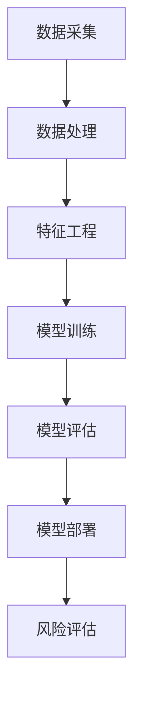

                 

关键词：京东金融，风控算法，面试经验，技术面试，招聘流程，行业动态，算法原理，实践应用，未来展望

> 摘要：本文详细解析了2025年京东金融社招风控算法工程师的面试经验，包括面试背景、流程、核心算法原理、数学模型、项目实践以及未来发展趋势。通过本文，读者可以全面了解风控算法工程师岗位的要求和挑战，为自身职业发展提供参考。

## 1. 背景介绍

### 1.1 京东金融简介

京东金融，作为京东集团旗下的金融科技服务平台，致力于为个人和企业提供全面的金融服务。随着互联网金融的快速发展，风控已成为金融科技的核心竞争力之一。因此，京东金融在招聘风控算法工程师时，对候选人的技术水平、实践经验以及创新思维有着极高的要求。

### 1.2 风控算法工程师岗位要求

风控算法工程师主要负责设计、开发和优化金融风控模型，以防范欺诈、降低坏账风险、提升用户体验等。岗位要求如下：

- **技术基础**：熟练掌握至少一种编程语言（如Python、Java等），熟悉数据结构和算法。
- **数学背景**：具备概率论、统计学、线性代数等相关知识，能够理解并运用数学模型。
- **项目经验**：有实际的风控项目经验，熟悉金融行业数据特征，能够处理大规模数据。
- **创新能力**：具备较强的逻辑思维能力，能够从海量数据中发现潜在风险，提出创新性的解决方案。

## 2. 核心概念与联系

### 2.1 风控算法原理

风控算法通常基于以下核心原理：

- **数据挖掘**：通过分析海量历史数据，发现潜在的风险特征。
- **机器学习**：利用已标记的数据进行训练，构建预测模型，对未知数据进行风险评分。
- **风险评估**：根据模型评分，结合业务规则，对交易进行风险评估和决策。

### 2.2 风控算法架构

风控算法架构主要包括数据采集、数据处理、模型训练、模型评估和模型部署等环节。以下是一个典型的风控算法架构Mermaid流程图：



## 3. 核心算法原理 & 具体操作步骤

### 3.1 算法原理概述

风控算法的核心是构建预测模型，通过对历史数据的学习，预测未知数据的欺诈风险。常见的算法包括逻辑回归、决策树、随机森林、神经网络等。本文将以逻辑回归为例进行介绍。

### 3.2 算法步骤详解

#### 3.2.1 数据预处理

1. **数据清洗**：处理缺失值、异常值，保证数据质量。
2. **数据归一化**：将不同尺度的数据转化为同一尺度，便于模型训练。

#### 3.2.2 特征工程

1. **特征选择**：选择对风控模型有帮助的特征，去除冗余特征。
2. **特征转换**：将类别特征转化为数值特征，如使用独热编码。

#### 3.2.3 模型训练

1. **数据划分**：将数据划分为训练集和测试集。
2. **训练模型**：使用训练集数据训练逻辑回归模型。

#### 3.2.4 模型评估

1. **评估指标**：使用准确率、召回率、F1值等指标评估模型性能。
2. **调参优化**：根据评估结果调整模型参数，提高模型性能。

#### 3.2.5 模型部署

1. **模型上线**：将训练好的模型部署到生产环境。
2. **实时预测**：对实时交易数据进行预测，评估风险。

### 3.3 算法优缺点

#### 3.3.1 优点

- **简单易懂**：逻辑回归模型结构简单，易于理解和解释。
- **高效稳定**：在处理大规模数据时，逻辑回归模型计算效率高，稳定性好。

#### 3.3.2 缺点

- **预测能力有限**：逻辑回归模型的预测能力相对较弱，对于复杂的风险特征，可能无法准确预测。
- **特征依赖性较强**：模型的预测效果对特征工程有很大依赖，需要具备丰富的特征工程经验。

### 3.4 算法应用领域

风控算法广泛应用于金融行业的多个领域，如信用卡风控、贷款风控、支付风控等。通过构建有效的风控模型，可以降低金融机构的风险成本，提高用户体验。

## 4. 数学模型和公式 & 详细讲解 & 举例说明

### 4.1 数学模型构建

逻辑回归模型的数学表达式为：

$$
P(y=1|x;\theta) = \frac{1}{1 + e^{-(\theta_0 + \theta_1x_1 + \theta_2x_2 + ... + \theta_nx_n})}
$$

其中，$y$为欺诈标签（0表示非欺诈，1表示欺诈），$x$为特征向量，$\theta$为模型参数。

### 4.2 公式推导过程

逻辑回归模型的损失函数为：

$$
J(\theta) = -\frac{1}{m}\sum_{i=1}^{m}[y_{i} \log(P(y=1|x;\theta)) + (1 - y_{i}) \log(1 - P(y=1|x;\theta))]
$$

对损失函数求导，并令导数为0，得到：

$$
\frac{\partial J(\theta)}{\partial \theta_j} = \frac{1}{m}\sum_{i=1}^{m}[(y_{i} - P(y=1|x;\theta))x_{ij}]
$$

利用梯度下降法，更新模型参数：

$$
\theta_j := \theta_j - \alpha \frac{\partial J(\theta)}{\partial \theta_j}
$$

### 4.3 案例分析与讲解

假设有一个信用卡风控项目，数据集包含1000条交易记录，其中欺诈交易占比1%。我们使用逻辑回归模型进行风险预测。

1. **数据预处理**：对数据进行清洗和归一化处理，选择关键特征，如交易金额、交易时间、地理位置等。
2. **特征工程**：对类别特征进行独热编码，处理缺失值和异常值。
3. **模型训练**：使用训练集数据训练逻辑回归模型，选择合适的迭代次数和学习率。
4. **模型评估**：使用测试集数据评估模型性能，计算准确率、召回率和F1值。
5. **模型部署**：将训练好的模型部署到生产环境，对实时交易数据进行预测。

## 5. 项目实践：代码实例和详细解释说明

### 5.1 开发环境搭建

在本案例中，我们使用Python和Scikit-learn库进行逻辑回归模型的实现。首先，需要安装相关依赖：

```python
pip install numpy pandas scikit-learn
```

### 5.2 源代码详细实现

```python
import numpy as np
import pandas as pd
from sklearn.linear_model import LogisticRegression
from sklearn.model_selection import train_test_split
from sklearn.metrics import accuracy_score, recall_score, f1_score

# 5.2.1 数据预处理
# 加载数据集
data = pd.read_csv('data.csv')
# 数据清洗
data = data.dropna()
# 数据归一化
data = (data - data.mean()) / data.std()

# 5.2.2 特征工程
# 特征选择
features = data[['amount', 'time', 'location']]
labels = data['label']

# 5.2.3 模型训练
# 数据划分
X_train, X_test, y_train, y_test = train_test_split(features, labels, test_size=0.2, random_state=42)
# 训练模型
model = LogisticRegression()
model.fit(X_train, y_train)

# 5.2.4 模型评估
# 预测结果
y_pred = model.predict(X_test)
# 计算评估指标
accuracy = accuracy_score(y_test, y_pred)
recall = recall_score(y_test, y_pred)
f1 = f1_score(y_test, y_pred)
print('Accuracy:', accuracy)
print('Recall:', recall)
print('F1 Score:', f1)

# 5.2.5 模型部署
# 实时预测
real_time_data = pd.read_csv('real_time_data.csv')
real_time_data = (real_time_data - real_time_data.mean()) / real_time_data.std()
y_real_time_pred = model.predict(real_time_data)
print('Real-time Prediction Results:', y_real_time_pred)
```

### 5.3 代码解读与分析

- **数据预处理**：首先加载数据集，然后进行清洗和归一化处理，确保数据质量。
- **特征工程**：选择关键特征，并进行独热编码，以便于模型训练。
- **模型训练**：使用训练集数据训练逻辑回归模型，选择合适的迭代次数和学习率。
- **模型评估**：使用测试集数据评估模型性能，计算准确率、召回率和F1值，以衡量模型效果。
- **模型部署**：将训练好的模型部署到生产环境，对实时交易数据进行预测。

## 6. 实际应用场景

### 6.1 风险评估

风控算法在信用卡风控中的应用主要包括交易风险评估和用户风险评估。通过对交易特征和用户特征的分析，可以预测交易的风险等级，为业务决策提供支持。

### 6.2 欺诈检测

风控算法在欺诈检测中的应用主要包括识别恶意交易和恶意账户。通过对历史数据的挖掘和建模，可以及时发现潜在的欺诈行为，降低欺诈损失。

### 6.3 信用评分

风控算法在信用评分中的应用主要包括评估用户的信用风险，为金融机构提供信用评估依据。通过构建信用评分模型，可以准确预测用户的信用状况，为贷款审批、信用卡发放等业务提供支持。

## 7. 工具和资源推荐

### 7.1 学习资源推荐

- **《统计学习方法》**：李航著，系统地介绍了统计学习的基本理论和方法。
- **《机器学习实战》**：Peter Harrington著，通过实际案例讲解机器学习算法的应用。
- **《深度学习》**：Ian Goodfellow等著，深入介绍了深度学习的基本原理和应用。

### 7.2 开发工具推荐

- **Jupyter Notebook**：适合进行数据分析和模型训练，支持多种编程语言。
- **PyCharm**：适合进行Python编程，提供丰富的开发插件和调试功能。
- **TensorFlow**：适合进行深度学习模型的开发和训练。

### 7.3 相关论文推荐

- **"Learning to Detect Fraud in E-commerce using Convolutional Neural Networks"**：探讨使用卷积神经网络进行电商欺诈检测。
- **"A Large-scale Study on Real-world Fraud Detection"**：分析真实世界中的欺诈检测问题。
- **"Deep Learning for Fraud Detection in Financial Services"**：介绍深度学习在金融风控中的应用。

## 8. 总结：未来发展趋势与挑战

### 8.1 研究成果总结

随着人工智能技术的不断发展，风控算法在金融领域的应用越来越广泛。近年来，深度学习、强化学习等先进算法在风控领域的应用取得了显著成果，为金融机构提供了更高效、更准确的风险评估手段。

### 8.2 未来发展趋势

1. **模型智能化**：随着数据量和算法的不断发展，风控模型将逐渐从规则驱动向数据驱动、模型驱动转变。
2. **实时预测**：风控模型将具备更高的实时性，能够快速响应交易风险，提高业务效率。
3. **跨领域应用**：风控算法将在更多金融领域得到应用，如保险、证券等。

### 8.3 面临的挑战

1. **数据隐私**：在风控模型应用过程中，如何保护用户隐私成为重要挑战。
2. **模型可解释性**：深度学习等复杂模型在风控领域的应用，如何提高模型的可解释性，成为研究热点。
3. **模型安全**：如何确保风控模型的稳定性和安全性，防止恶意攻击，是当前面临的严峻挑战。

### 8.4 研究展望

未来，风控算法将在以下几个方面取得突破：

1. **联合建模**：将多种数据源、多种模型相结合，提高风控模型的准确性和稳定性。
2. **自适应建模**：根据业务需求和数据特征，动态调整模型参数，提高模型适应能力。
3. **安全防护**：加强风控模型的安全防护，确保模型在复杂环境下的稳定运行。

## 9. 附录：常见问题与解答

### 9.1 如何处理缺失值？

- **删除缺失值**：当缺失值较少时，可以直接删除。
- **填充缺失值**：当缺失值较多时，可以使用平均值、中位数、最邻近值等方法进行填充。

### 9.2 如何进行特征工程？

- **特征选择**：选择对模型有帮助的特征，去除冗余特征。
- **特征转换**：将类别特征转化为数值特征，如使用独热编码。
- **特征归一化**：将不同尺度的特征转化为同一尺度，便于模型训练。

### 9.3 如何评估模型性能？

- **准确率**：预测正确的样本数占总样本数的比例。
- **召回率**：预测正确的正样本数占总正样本数的比例。
- **F1值**：准确率和召回率的调和平均数。

## 作者署名

作者：禅与计算机程序设计艺术 / Zen and the Art of Computer Programming
----------------------------------------------------------------

以上就是本文的完整内容，希望对您在风控算法领域的学习和职业发展有所帮助。如果您有任何疑问或建议，欢迎在评论区留言。祝您学习进步！
----------------------------------------------------------------

[End of Document]

