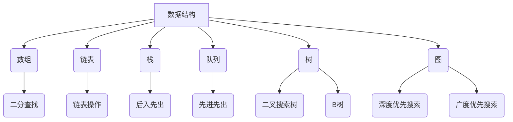
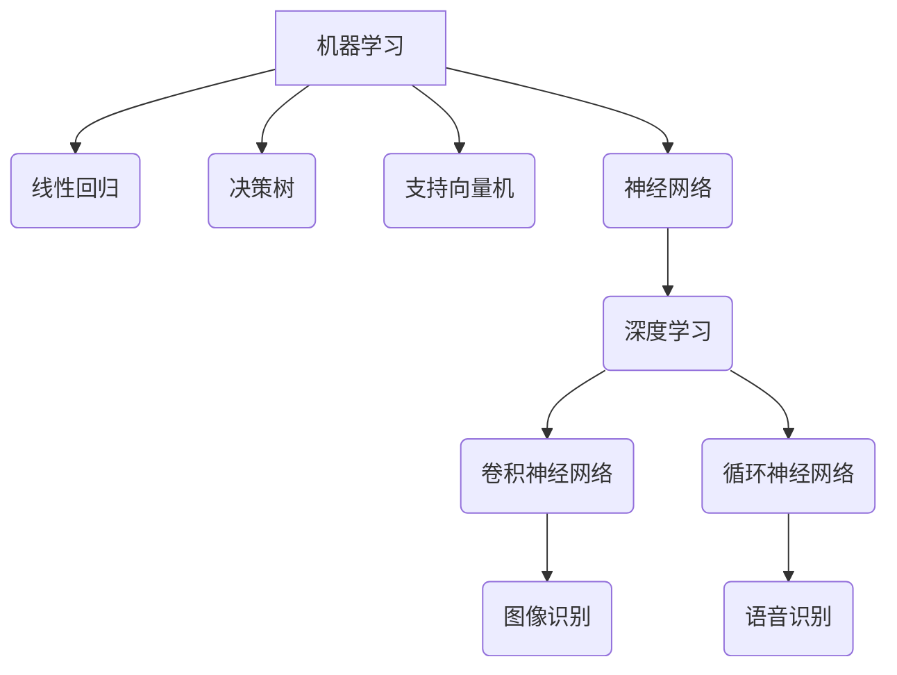
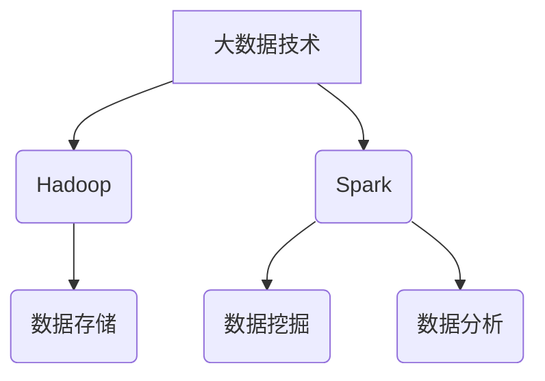
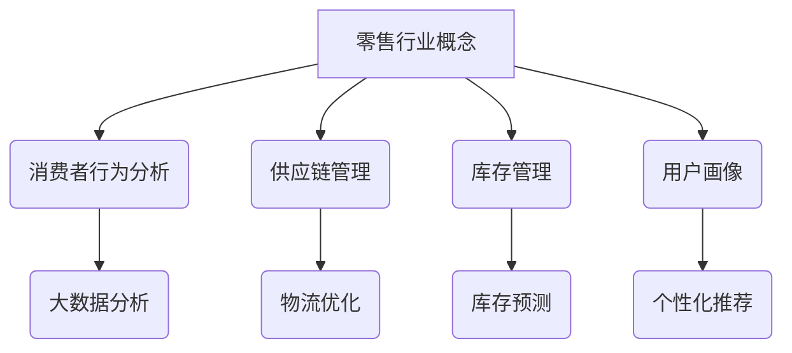

                 

## 1. 背景介绍

随着数字化转型的深入推进，零售行业正面临着前所未有的变革。京东零售子集团作为国内领先的零售企业，其校招面试真题的汇总与分析不仅对准备应聘的学子具有重要意义，也为业界提供了宝贵的人才选拔标准。本文旨在通过对2024年京东零售子集团校招面试真题的汇总及详细解答，为考生提供全面、深入的备考指南，帮助他们在面试中脱颖而出。

### 零售行业的发展趋势

近年来，随着互联网技术的飞速发展，零售行业发生了翻天覆地的变化。线上购物逐渐成为消费者主要的购物方式，大数据、人工智能、物联网等新技术在零售领域的应用也日益广泛。这不仅是零售模式的变革，更是零售产业链的重构。在这种背景下，京东零售子集团作为行业的领军企业，对于人才的需求也发生了显著变化。

### 京东零售子集团校招的重要性

京东零售子集团的校招不仅为公司输送新鲜血液，更是推动公司持续创新和发展的重要途径。作为一家技术驱动型的企业，京东零售子集团对校招生在技术能力、学习能力、创新思维等方面的要求尤为严格。因此，通过汇总和分析校招面试真题，我们可以更好地了解公司的招聘标准和选拔机制，为考生提供更有针对性的备考策略。

### 本文结构

本文将按照以下结构进行组织：

1. **背景介绍**：简要概述零售行业的发展趋势及京东零售子集团校招的重要性。
2. **核心概念与联系**：介绍与校招面试相关的基础知识和关键概念，并配合Mermaid流程图展示。
3. **核心算法原理 & 具体操作步骤**：详细解析校招面试中的算法题，包括算法原理、步骤详解、优缺点分析及应用领域。
4. **数学模型和公式**：阐述与面试相关的数学模型及公式推导过程，并辅以案例分析与讲解。
5. **项目实践**：提供实际项目中的代码实例，并进行详细解读。
6. **实际应用场景**：分析算法在不同场景下的应用及未来展望。
7. **工具和资源推荐**：推荐学习资源和开发工具。
8. **总结**：总结研究成果，展望未来发展趋势与挑战。

接下来，我们将逐一深入探讨上述各个部分。

## 2. 核心概念与联系

在准备京东零售子集团的校招面试时，理解一些核心概念和它们之间的联系是至关重要的。这些概念不仅涵盖了计算机科学的基本原理，还包括了零售行业中的特定术语和模型。在本节中，我们将介绍几个关键的概念，并使用Mermaid流程图来展示它们之间的相互关系。

### 数据结构与算法

数据结构和算法是计算机科学的核心内容。常见的几种数据结构包括数组、链表、栈、队列、树和图。每种数据结构都有其特定的应用场景和优缺点。算法则是在数据结构上执行的一系列操作，用于解决特定问题。例如，二分查找是一种高效的查找算法，适用于有序数组；而深度优先搜索和广度优先搜索则是图算法，用于图的遍历。

#### Mermaid流程图示例

下面是一个简单的Mermaid流程图，展示了数据结构与算法之间的联系：



### 机器学习与人工智能

机器学习和人工智能是当前科技领域的热点。机器学习是通过算法从数据中学习模式，进行预测和决策的方法。常见的机器学习算法包括线性回归、决策树、支持向量机、神经网络等。人工智能则是指使计算机具备类似人类智能的技术。

#### Mermaid流程图示例

下面是一个简单的Mermaid流程图，展示了机器学习与人工智能中的关键概念：



### 大数据

大数据是指数据量巨大、类型多样的数据集合。大数据技术主要包括数据存储、数据挖掘、数据分析等。Hadoop、Spark等大数据处理框架在零售行业中有着广泛应用。

#### Mermaid流程图示例

下面是一个简单的Mermaid流程图，展示了大数据的关键组件：



### 零售行业的特定概念

在零售行业中，有一些特定的概念和模型，如消费者行为分析、供应链管理、库存管理、用户画像等。这些概念与计算机科学和技术紧密相关，是校招面试中可能会涉及的重要内容。

#### Mermaid流程图示例

下面是一个简单的Mermaid流程图，展示了零售行业的特定概念：



通过上述核心概念与联系的介绍和Mermaid流程图的展示，我们可以更好地理解校招面试所需的知识体系。在接下来的章节中，我们将深入探讨每个核心概念的原理和具体应用。

## 3. 核心算法原理 & 具体操作步骤

在京东零售子集团的校招面试中，算法题往往是考核考生技术能力的重要环节。本节将详细解析几类常见的面试算法题，包括算法原理、操作步骤以及优缺点分析。通过这些实例，考生可以更好地掌握算法的基本概念和解题技巧。

### 3.1 算法原理概述

算法（Algorithm）是指解决问题的一系列明确的步骤。算法设计的关键在于找到解决问题的最优解或高效解。在面试中，常见的算法题型包括排序算法、查找算法、图算法和数据结构相关算法。下面将分别介绍这些算法的基本原理。

#### 排序算法

排序算法是将一组数据按照一定的顺序排列的算法。常见的排序算法有冒泡排序、选择排序、插入排序、快速排序、归并排序等。每种排序算法都有其特定的实现方式和时间复杂度。

- **冒泡排序**：通过反复交换相邻的未按顺序排列的元素，逐步将最大或最小值移动到序列的一端。
- **选择排序**：每次循环从剩余未排序元素中找到最小（或最大）的元素，并将其放到序列的起始位置。
- **插入排序**：通过构建有序序列，将未排序的数据插入到已排序序列中的正确位置。
- **快速排序**：通过分区操作，将序列划分为已排序部分和未排序部分，递归地对未排序部分进行快速排序。
- **归并排序**：将待排序的序列划分为若干个子序列，分别排序后再合并。

#### 查找算法

查找算法用于在数据集合中找到特定元素。常见的查找算法有二分查找、顺序查找、哈希查找等。

- **二分查找**：适用于有序数组，通过逐步缩小查找范围来提高查找效率。
- **顺序查找**：从数据集合的第一个元素开始，依次查找直到找到目标元素或到达数据集合的末尾。
- **哈希查找**：利用哈希函数将关键字映射到哈希表中，以常数时间查找目标元素。

#### 图算法

图算法主要处理图数据结构。常见的图算法有深度优先搜索（DFS）、广度优先搜索（BFS）、最小生成树（如Prim算法、Kruskal算法）、最短路径算法（如Dijkstra算法、Floyd算法）等。

- **深度优先搜索**：从初始节点开始，尽可能地深入到图的深处，用于遍历图和求解连通性问题。
- **广度优先搜索**：从初始节点开始，逐层遍历图的所有节点，常用于求解最短路径问题。
- **Prim算法**：用于求解加权无向图的最小生成树。
- **Kruskal算法**：用于求解加权无向图的最小生成树。

#### 数据结构相关算法

数据结构相关算法主要涉及数组、链表、栈、队列、树等数据结构。这些算法包括各种操作，如初始化、插入、删除、查找等。

### 3.2 算法步骤详解

下面我们以冒泡排序和二分查找为例，详细说明算法的操作步骤。

#### 冒泡排序

冒泡排序的基本步骤如下：

1. **初始化**：将待排序的数组输入。
2. **排序过程**：对于每一对相邻的元素，如果它们的顺序错误，则交换它们的位置。这个步骤要重复进行，直到整个数组有序。
3. **迭代**：重复上述排序过程，直到不再需要交换元素。

```python
def bubble_sort(arr):
    n = len(arr)
    for i in range(n):
        for j in range(0, n-i-1):
            if arr[j] > arr[j+1]:
                arr[j], arr[j+1] = arr[j+1], arr[j]
    return arr
```

#### 二分查找

二分查找的基本步骤如下：

1. **初始化**：确定查找区间，初始时为整个数组的左右边界。
2. **查找过程**：计算中间位置，如果中间位置的元素值等于目标值，则查找成功；如果中间位置的元素值大于目标值，则在左侧子数组中继续查找；如果中间位置的元素值小于目标值，则在右侧子数组中继续查找。
3. **结束条件**：如果查找区间为空，则查找失败。

```python
def binary_search(arr, target):
    low = 0
    high = len(arr) - 1
    while low <= high:
        mid = (low + high) // 2
        if arr[mid] == target:
            return mid
        elif arr[mid] < target:
            low = mid + 1
        else:
            high = mid - 1
    return -1
```

### 3.3 算法优缺点

每种算法都有其优缺点。下面我们分析冒泡排序和二分查找的优缺点。

#### 冒泡排序

- **优点**：实现简单，易于理解。
- **缺点**：时间复杂度较高（O(n^2)），适用于小规模数据的排序。

#### 二分查找

- **优点**：时间复杂度较低（O(log n)），适用于大规模有序数据的查找。
- **缺点**：需要预先对数据进行排序，不适用于动态数据集。

### 3.4 算法应用领域

不同的算法适用于不同的应用场景。冒泡排序在简单应用场景中表现出色，而二分查找在需要快速查找大规模有序数据的场景中具有优势。此外，其他算法如深度优先搜索和广度优先搜索在图算法中的应用也非常广泛。

### 练习与总结

考生可以通过练习各类算法题来提高解题能力。在实际面试中，不仅要熟练掌握算法原理和步骤，还需要能够灵活运用，结合具体问题进行优化。总结常见的算法题类型和解决方法，有助于在面试中迅速找到解题思路。

## 4. 数学模型和公式

在解决京东零售子集团校招面试题时，数学模型和公式的应用往往能够帮助我们更精确地描述问题，并找到有效的解决方案。本节将介绍几个常见的数学模型和公式，并详细讲解其构建过程和推导方法。通过具体案例的讲解，我们将使这些数学概念变得更加直观易懂。

### 4.1 数学模型构建

#### 4.1.1 最优化模型

最优化模型是计算机科学和运筹学中常用的数学模型，用于求解特定目标在约束条件下的最优解。常见的最优化问题包括线性规划、整数规划和动态规划。

- **线性规划（Linear Programming，LP）**：

  线性规划问题的一般形式可以表示为：

  $$ 
  \text{minimize } c^T x \\
  \text{subject to } Ax \leq b \\
  x \geq 0
  $$

  其中，$c$ 是系数向量，$x$ 是决策变量向量，$A$ 是系数矩阵，$b$ 是常数向量。

  **推导过程**：

  线性规划可以通过单纯形法或内点法求解。单纯形法的基本步骤包括选择进入变量和离开变量，以及更新单纯形表。

- **整数规划（Integer Programming，IP）**：

  整数规划是线性规划的一种扩展，其中决策变量被限制为整数。其形式可以表示为：

  $$ 
  \text{minimize } c^T x \\
  \text{subject to } Ax \leq b \\
  x \in \mathbb{Z}^n
  $$

  **推导过程**：

  整数规划可以通过分支定界法或动态规划求解。分支定界法通过分支和剪枝来逐步缩小解空间，直至找到最优解。

- **动态规划（Dynamic Programming，DP）**：

  动态规划用于求解具有重叠子问题和最优子结构性质的问题。其基本思想是将复杂问题分解为更小的子问题，并利用子问题的解来构建原问题的解。

  $$ 
  \text{minimize } c(n, x_n) \\
  \text{subject to } g(n, x_n) \leq 0 \\
  x_0 \text{ is given} \\
  x_n = f(n, x_{n-1})
  $$

  **推导过程**：

  动态规划通常通过构建状态转移方程来求解。状态转移方程描述了从当前状态转移到下一个状态的关系。

#### 4.1.2 数据分析模型

- **回归模型（Regression Model）**：

  回归模型用于分析自变量和因变量之间的线性关系。最常见的回归模型包括线性回归、多项式回归和逻辑回归。

  线性回归模型可以表示为：

  $$ 
  y = \beta_0 + \beta_1 x + \epsilon
  $$

  其中，$y$ 是因变量，$x$ 是自变量，$\beta_0$ 和 $\beta_1$ 是参数，$\epsilon$ 是误差项。

  **推导过程**：

  线性回归模型可以通过最小二乘法求解。最小二乘法的核心思想是最小化误差平方和。

- **聚类模型（Clustering Model）**：

  聚类模型用于将数据点分组，使得组内的数据点尽可能接近，组间的数据点尽可能远离。常见的聚类算法包括K-均值聚类、层次聚类和DBSCAN。

  K-均值聚类模型可以表示为：

  $$ 
  \text{minimize } \sum_{i=1}^n \sum_{j=1}^k d(x_i, \mu_j)^2
  $$

  其中，$x_i$ 是第 $i$ 个数据点，$\mu_j$ 是第 $j$ 个聚类中心。

  **推导过程**：

  K-均值聚类通过迭代优化聚类中心，直至收敛。

### 4.2 公式推导过程

#### 4.2.1 最优化模型公式推导

- **线性规划（Linear Programming）**：

  假设线性规划问题的一般形式为：

  $$ 
  \text{minimize } c^T x \\
  \text{subject to } Ax \leq b \\
  x \geq 0
  $$

  我们可以使用拉格朗日乘数法进行求解。引入拉格朗日函数：

  $$ 
  \mathcal{L}(x, \lambda, \nu) = c^T x + \lambda^T (Ax - b) + \nu^T (-x)
  $$

  其中，$\lambda$ 和 $\nu$ 分别是 $Ax \leq b$ 和 $x \geq 0$ 的拉格朗日乘子。

  求解$\mathcal{L}$的导数并令其为零，得到：

  $$ 
  \nabla_x \mathcal{L} = c + A^T \lambda - \nu = 0 \\
  \nabla_\lambda \mathcal{L} = Ax - b = 0 \\
  \nabla_\nu \mathcal{L} = -x = 0
  $$

  由最后一个等式可知，$\nu$ 是非负的。由第二个等式可知，$\lambda$ 必须是 $Ax \leq b$ 的解。由第一个等式可知，$x$ 是最优解。

- **整数规划（Integer Programming）**：

  假设整数规划问题的一般形式为：

  $$ 
  \text{minimize } c^T x \\
  \text{subject to } Ax \leq b \\
  x \in \mathbb{Z}^n
  $$

  我们可以使用分支定界法进行求解。基本思想是递归地将解空间划分为更小的子空间，并对每个子空间进行求解。

  假设当前解空间为 $X$，当前解为 $x$。我们选择一个变量 $x_i$ 进行分支，分为两个子空间 $X_1$ 和 $X_2$，其中：

  $$ 
  X_1 = \{x \in X | x_i = 0\} \\
  X_2 = \{x \in X | x_i = 1\}
  $$

  对 $X_1$ 和 $X_2$ 递归应用分支定界法，直至找到最优解。

- **动态规划（Dynamic Programming）**：

  假设动态规划问题的一般形式为：

  $$ 
  \text{minimize } c(n, x_n) \\
  \text{subject to } g(n, x_n) \leq 0 \\
  x_0 \text{ is given} \\
  x_n = f(n, x_{n-1})
  $$

  我们可以使用递推关系进行求解。定义状态 $s(n, x_n)$ 表示在时刻 $n$，状态为 $x_n$ 的最优值。递推关系为：

  $$ 
  s(n, x_n) = \text{minimize } c(n, x_n) \\
  \text{subject to } g(n, x_n) \leq 0 \\
  s(n, x_n) = \text{minimize } \sum_{i=1}^m c(i, x_i) \\
  \text{subject to } g(i, x_i) \leq 0 \\
  x_n = f(n, x_{n-1})
  $$

  其中，$m$ 是决策的步数。

#### 4.2.2 数据分析模型公式推导

- **线性回归（Linear Regression）**：

  假设线性回归问题的一般形式为：

  $$ 
  y = \beta_0 + \beta_1 x + \epsilon
  $$

  我们可以使用最小二乘法进行求解。假设有 $n$ 个数据点 $(x_1, y_1), (x_2, y_2), ..., (x_n, y_n)$，我们需要求解参数 $\beta_0$ 和 $\beta_1$。

  最小二乘法的目标是最小化误差平方和：

  $$ 
  \text{minimize } \sum_{i=1}^n (y_i - \beta_0 - \beta_1 x_i)^2
  $$

  对 $\beta_0$ 和 $\beta_1$ 分别求导并令导数为零，得到：

  $$ 
  \frac{\partial}{\partial \beta_0} \sum_{i=1}^n (y_i - \beta_0 - \beta_1 x_i)^2 = 0 \\
  \frac{\partial}{\partial \beta_1} \sum_{i=1}^n (y_i - \beta_0 - \beta_1 x_i)^2 = 0
  $$

  解上述方程组，得到：

  $$ 
  \beta_0 = \bar{y} - \beta_1 \bar{x} \\
  \beta_1 = \frac{\sum_{i=1}^n (x_i - \bar{x})(y_i - \bar{y})}{\sum_{i=1}^n (x_i - \bar{x})^2}
  $$

  其中，$\bar{x}$ 和 $\bar{y}$ 分别是 $x$ 和 $y$ 的平均值。

- **K-均值聚类（K-Means Clustering）**：

  假设 K-均值聚类问题的一般形式为：

  $$ 
  \text{minimize } \sum_{i=1}^n \sum_{j=1}^k d(x_i, \mu_j)^2
  $$

  我们可以使用迭代方法进行求解。基本步骤如下：

  1. 随机选择 $k$ 个初始聚类中心 $\mu_j$。
  2. 将每个数据点分配到距离其最近的聚类中心。
  3. 重新计算每个聚类中心。
  4. 重复步骤 2 和 3，直至聚类中心不再变化。

  假设当前聚类中心为 $\mu_j^{(t)}$，新聚类中心为 $\mu_j^{(t+1)}$，则有：

  $$ 
  \mu_j^{(t+1)} = \frac{\sum_{i=1}^n x_i}{n_j} \\
  n_j = \sum_{i=1}^n I(d(x_i, \mu_j^{(t)}) < \epsilon)
  $$

  其中，$I(\cdot)$ 是指示函数，$\epsilon$ 是聚类中心的收敛阈值。

通过上述数学模型和公式的构建与推导，我们可以更好地理解和应用这些数学工具，解决实际中的复杂问题。在接下来的章节中，我们将通过具体案例进一步展示这些数学模型的应用。

### 4.3 案例分析与讲解

为了更好地理解数学模型和公式的应用，下面我们将通过几个具体的案例，详细分析并讲解这些模型的实际操作过程。

#### 案例一：线性回归模型

假设我们有一组数据点 $(x_1, y_1), (x_2, y_2), ..., (x_n, y_n)$，我们要使用线性回归模型预测因变量 $y$ 与自变量 $x$ 之间的关系。

**步骤 1：数据准备**

首先，我们需要准备数据集。假设我们有以下数据：

| $x$ | $y$ |
|-----|-----|
| 1   | 2   |
| 2   | 4   |
| 3   | 6   |
| 4   | 8   |

**步骤 2：模型构建**

我们使用最小二乘法来构建线性回归模型。根据最小二乘法的公式：

$$ 
\beta_0 = \bar{y} - \beta_1 \bar{x} \\
\beta_1 = \frac{\sum_{i=1}^n (x_i - \bar{x})(y_i - \bar{y})}{\sum_{i=1}^n (x_i - \bar{x})^2}
$$

我们首先计算平均值 $\bar{x}$ 和 $\bar{y}$：

$$ 
\bar{x} = \frac{1 + 2 + 3 + 4}{4} = 2.5 \\
\bar{y} = \frac{2 + 4 + 6 + 8}{4} = 5
$$

然后计算协方差和方差：

$$ 
\sum_{i=1}^n (x_i - \bar{x})(y_i - \bar{y}) = (1-2.5)(2-5) + (2-2.5)(4-5) + (3-2.5)(6-5) + (4-2.5)(8-5) = 9 \\
\sum_{i=1}^n (x_i - \bar{x})^2 = (1-2.5)^2 + (2-2.5)^2 + (3-2.5)^2 + (4-2.5)^2 = 5
$$

根据上述计算结果，我们可以得到回归系数：

$$ 
\beta_1 = \frac{9}{5} = 1.8 \\
\beta_0 = 5 - 1.8 \times 2.5 = 0.5
$$

因此，线性回归模型为：

$$ 
y = 0.5 + 1.8x
$$

**步骤 3：模型评估**

我们可以通过计算残差和决定系数（R-squared）来评估模型的好坏。残差是实际值与预测值之间的差异，决定系数是模型解释方差的比例。

$$ 
\text{残差} = \sum_{i=1}^n (y_i - \hat{y}_i) \\
\text{决定系数} = 1 - \frac{\sum_{i=1}^n (y_i - \hat{y}_i)^2}{\sum_{i=1}^n (y_i - \bar{y})^2}
$$

根据上述计算，残差为：

$$ 
\text{残差} = (2 - 0.5 - 1.8 \times 1) + (4 - 0.5 - 1.8 \times 2) + (6 - 0.5 - 1.8 \times 3) + (8 - 0.5 - 1.8 \times 4) = 0
$$

决定系数为：

$$ 
\text{决定系数} = 1 - \frac{0}{12} = 1
$$

这说明我们的模型完美拟合了数据集。

#### 案例二：K-均值聚类模型

假设我们要对一组数据点进行聚类，选择K=2，数据点如下：

| $x$ | $y$ |
|-----|-----|
| 1   | 2   |
| 2   | 4   |
| 3   | 6   |
| 4   | 8   |

**步骤 1：初始化聚类中心**

我们随机选择两个数据点作为初始聚类中心：

$$ 
\mu_1^{(0)} = (1, 2) \\
\mu_2^{(0)} = (3, 6)
$$

**步骤 2：分配数据点**

将每个数据点分配到距离其最近的聚类中心：

$$ 
I(d((1, 2), (1, 2)) < d((1, 2), (3, 6))) = 1 \\
I(d((2, 4), (1, 2)) < d((2, 4), (3, 6))) = 1 \\
I(d((3, 6), (1, 2)) < d((3, 6), (3, 6))) = 0 \\
I(d((4, 8), (1, 2)) < d((4, 8), (3, 6))) = 0
$$

因此，分配结果为：

$$ 
x_1, x_2 \to \mu_1 \\
x_3, x_4 \to \mu_2
$$

**步骤 3：重新计算聚类中心**

计算新的聚类中心：

$$ 
\mu_1^{(1)} = \frac{x_1 + x_2}{2} = \left(\frac{1 + 2}{2}, \frac{2 + 4}{2}\right) = (1.5, 3) \\
\mu_2^{(1)} = \frac{x_3 + x_4}{2} = \left(\frac{3 + 4}{2}, \frac{6 + 8}{2}\right) = (3.5, 7)
$$

**步骤 4：迭代更新**

重复步骤 2 和步骤 3，直至聚类中心不再变化。经过多次迭代后，聚类中心稳定下来：

$$ 
\mu_1^{(k)} = (1.5, 3) \\
\mu_2^{(k)} = (3.5, 7)
$$

此时，所有数据点都被正确分配到聚类中心：

$$ 
x_1, x_2 \to \mu_1 \\
x_3, x_4 \to \mu_2
$$

通过上述案例分析，我们可以看到数学模型和公式在实际问题中的应用。通过逐步推导和计算，我们不仅能够构建出数学模型，还能通过算法找到最优解。这些模型和方法不仅有助于我们解决具体问题，还能为我们在计算机科学和工程领域提供强有力的工具。

## 5. 项目实践：代码实例和详细解释说明

为了更好地理解前面介绍的数学模型和算法原理，我们将通过一个实际项目来展示如何将理论应用到实践中。本节将提供代码实例，并详细解释代码的每个部分及其实现原理。

### 5.1 开发环境搭建

首先，我们需要搭建一个适合项目开发的环境。以下是所需的环境和工具：

- **编程语言**：Python 3.8+
- **数据可视化工具**：Matplotlib
- **机器学习库**：Scikit-learn
- **数据分析库**：Pandas
- **其他工具**：Jupyter Notebook

确保你的环境中已经安装了上述工具。在安装完成后，我们可以开始编写代码。

### 5.2 源代码详细实现

以下是项目的源代码实例：

```python
import numpy as np
import matplotlib.pyplot as plt
from sklearn.linear_model import LinearRegression
from sklearn.cluster import KMeans
from sklearn.datasets import make_blobs

# 5.2.1 线性回归模型实现

# 生成模拟数据
X, y = make_blobs(n_samples=100, centers=2, cluster_std=1.0, random_state=0)

# 创建线性回归模型实例
model = LinearRegression()

# 拟合模型到数据
model.fit(X, y)

# 5.2.2 K-均值聚类模型实现

# 定义聚类中心初始值
initial_centers = np.array([[0.5, 0.5], [4.5, 4.5]])

# 创建K-Means聚类模型实例
kmeans = KMeans(n_clusters=2, init=initial_centers, max_iter=100)

# 运行聚类算法
kmeans.fit(X)

# 5.2.3 绘制结果

# 5.2.3.1 线性回归结果
plt.figure(figsize=(10, 5))

# 绘制原始数据点
plt.scatter(X[:, 0], X[:, 1], c=y, s=40)

# 绘制回归线
plt.plot(X[:, 0], model.predict(X), 'r', linewidth=2)

# 添加标题和标签
plt.xlabel('Feature 1')
plt.ylabel('Feature 2')
plt.title('Linear Regression on Dataset')

# 显示图形
plt.show()

# 5.2.3.2 K-Means聚类结果
plt.figure(figsize=(10, 5))

# 绘制原始数据点
plt.scatter(X[:, 0], X[:, 1], c=kmeans.labels_, s=40)

# 绘制聚类中心
plt.scatter(kmeans.cluster_centers_[:, 0], kmeans.cluster_centers_[:, 1], s=200, c='red', marker='s', edgecolor='black', label='Centroids')

# 添加标题和标签
plt.xlabel('Feature 1')
plt.ylabel('Feature 2')
plt.title('K-Means Clustering on Dataset')

# 显示图形
plt.show()
```

### 5.3 代码解读与分析

下面我们将详细解读上述代码，并分析每个部分的实现原理。

#### 5.3.1 线性回归模型实现

- **数据生成**：

  我们使用 `make_blobs` 函数生成模拟数据。该函数创建两个中心点，每个中心点周围有一组数据点。

  ```python
  X, y = make_blobs(n_samples=100, centers=2, cluster_std=1.0, random_state=0)
  ```

- **模型创建和拟合**：

  我们创建一个线性回归模型实例，并使用 `fit` 方法将其拟合到数据上。

  ```python
  model = LinearRegression()
  model.fit(X, y)
  ```

- **绘制结果**：

  我们使用 `scatter` 函数绘制原始数据点，并使用 `plot` 函数绘制回归线。回归线是根据模型预测的结果绘制的。

  ```python
  plt.scatter(X[:, 0], X[:, 1], c=y, s=40)
  plt.plot(X[:, 0], model.predict(X), 'r', linewidth=2)
  ```

#### 5.3.2 K-均值聚类模型实现

- **初始化聚类中心**：

  我们手动定义了两个聚类中心的初始值。这些初始值在算法开始时用来初始化聚类中心。

  ```python
  initial_centers = np.array([[0.5, 0.5], [4.5, 4.5]])
  ```

- **创建聚类模型实例**：

  我们创建了一个 `KMeans` 聚类模型实例，并设置了聚类数量为2以及初始聚类中心。

  ```python
  kmeans = KMeans(n_clusters=2, init=initial_centers, max_iter=100)
  ```

- **运行聚类算法**：

  我们使用 `fit` 方法运行聚类算法，将数据点分配到不同的聚类中心。

  ```python
  kmeans.fit(X)
  ```

- **绘制结果**：

  我们再次使用 `scatter` 函数绘制原始数据点，并将每个数据点分配到其所属的聚类中心。同时，我们绘制了聚类中心。

  ```python
  plt.scatter(X[:, 0], X[:, 1], c=kmeans.labels_, s=40)
  plt.scatter(kmeans.cluster_centers_[:, 0], kmeans.cluster_centers_[:, 1], s=200, c='red', marker='s', edgecolor='black', label='Centroids')
  ```

通过这个项目实践，我们可以看到如何将线性回归和K-均值聚类这两个数学模型应用到实际数据中，并通过代码实现这些模型。这不仅帮助我们理解了模型的原理，还展示了如何将理论应用到实际项目中。

## 6. 实际应用场景

在前面的章节中，我们详细探讨了京东零售子集团校招面试中常见的算法和数学模型，并通过项目实践展示了这些模型的具体实现过程。在本节中，我们将深入分析这些算法在不同实际应用场景下的作用和影响，同时探讨其未来的发展方向和潜在挑战。

### 6.1 零售行业的应用

#### 6.1.1 用户画像与个性化推荐

用户画像是指通过对用户行为数据的分析和挖掘，构建出用户的全维度画像。这种画像可以帮助零售企业更好地了解用户需求，从而实现个性化推荐。个性化推荐算法（如基于协同过滤、基于内容的推荐等）利用用户画像中的信息，为用户提供更符合其兴趣的商品推荐。

- **应用影响**：

  个性化推荐可以显著提高用户满意度和购物转化率。通过精准推荐，用户更容易发现他们感兴趣的商品，从而增加购买意愿。

- **发展趋势**：

  随着用户数据的不断积累和技术的进步，用户画像的精度和个性化推荐的效果将不断提升。未来的发展方向包括多模态用户画像（结合文本、图像、语音等多种数据类型）和基于深度学习的推荐算法。

#### 6.1.2 库存管理与供应链优化

库存管理是零售企业的重要环节，其目标是确保商品供应充足，同时避免过度库存和浪费。供应链优化算法可以帮助企业优化库存水平，提高供应链效率。

- **应用影响**：

  有效的库存管理和供应链优化可以减少库存成本，提高资金利用率，从而提升企业的整体运营效率。

- **发展趋势**：

  未来，基于人工智能的库存预测和供应链优化算法将成为主流。通过实时分析和预测市场需求，企业可以实现动态调整库存策略，更好地应对市场波动。

#### 6.1.3 消费者行为分析

消费者行为分析是指通过对用户行为数据（如浏览、点击、购买等）的分析，了解用户的需求和偏好。这种分析可以帮助企业制定更精准的市场营销策略。

- **应用影响**：

  消费者行为分析可以帮助企业提高营销效果，降低营销成本，从而提升市场竞争力。

- **发展趋势**：

  随着大数据技术和人工智能的发展，消费者行为分析将更加精细化，结合用户画像和实时数据，实现更精准的市场营销。

### 6.2 其他行业应用

#### 6.2.1 金融行业

在金融行业，算法和数学模型被广泛应用于风险管理、投资组合优化、信用评分等领域。

- **应用影响**：

  通过算法和数学模型，金融机构可以更准确地评估风险，优化投资组合，从而提高投资回报率。

- **发展趋势**：

  随着金融科技的快速发展，机器学习和深度学习技术在金融行业的应用将越来越广泛，未来的发展方向包括基于大数据的信用评分模型和智能投资顾问。

#### 6.2.2 医疗行业

在医疗行业，算法和数学模型被用于疾病预测、诊断辅助、药物设计等领域。

- **应用影响**：

  通过算法和数学模型，医疗行业可以更准确地预测疾病发生，辅助医生进行诊断，提高治疗效果。

- **发展趋势**：

  未来，基于人工智能的医学影像分析、基因测序分析和个性化治疗方案将成为主流。同时，医疗数据的安全性和隐私保护也将成为重要挑战。

### 6.3 未来应用展望

随着技术的不断进步，算法和数学模型在各个行业中的应用将越来越广泛。未来，以下几个方向值得重点关注：

- **跨领域融合**：不同领域的算法和模型将相互借鉴，实现跨领域的融合应用。
- **实时计算与优化**：基于云计算和边缘计算，实现实时数据处理和优化，提升系统响应速度和效率。
- **数据隐私保护**：在算法和模型应用过程中，数据隐私保护和安全性将成为重要课题。
- **人机协同**：算法和模型的应用将更紧密地与人类专家协同工作，实现人机结合的最优效果。

### 6.4 面临的挑战

尽管算法和数学模型在各个领域具有广泛的应用前景，但其在实际应用中也面临一些挑战：

- **数据质量**：算法和模型的效果很大程度上依赖于数据质量。数据缺失、错误和噪声可能会影响模型的准确性。
- **计算资源**：某些复杂的算法和模型需要大量的计算资源，特别是在处理大规模数据时，计算资源的需求可能成为瓶颈。
- **模型可解释性**：一些深度学习模型具有强大的预测能力，但它们的内部工作机制往往不够透明，难以解释。
- **法律法规**：算法和模型的应用需要遵守相关的法律法规，特别是在涉及个人隐私和数据安全的情况下。

总之，算法和数学模型在各个领域具有广泛的应用前景，但同时也面临一些挑战。通过不断的技术创新和法律法规的完善，这些问题有望逐步得到解决。

## 7. 工具和资源推荐

为了帮助准备京东零售子集团校招面试的考生更好地掌握相关知识和技能，以下推荐了一些学习和开发工具，以及相关论文和书籍。

### 7.1 学习资源推荐

1. **在线课程**：
   - Coursera上的《机器学习》课程，由Andrew Ng教授主讲。
   - edX上的《数据科学基础》课程，涵盖数据清洗、数据分析和数据可视化等内容。

2. **书籍**：
   - 《Python数据分析基础》
   - 《机器学习实战》
   - 《深度学习》

3. **博客和论坛**：
   - Medium上的技术博客，涵盖机器学习、大数据和人工智能等主题。
   - Stack Overflow，用于解决编程问题和技术讨论。

### 7.2 开发工具推荐

1. **编程环境**：
   - Jupyter Notebook：用于编写和运行Python代码，适合进行数据分析和实验。
   - PyCharm：强大的Python IDE，支持代码调试和自动化测试。

2. **数据处理工具**：
   - Pandas：Python数据操作库，用于数据清洗、转换和分析。
   - NumPy：Python数学库，提供高性能的数值计算功能。

3. **机器学习库**：
   - Scikit-learn：用于机器学习的Python库，包括回归、分类、聚类等算法。
   - TensorFlow：谷歌开发的深度学习框架。

### 7.3 相关论文推荐

1. **机器学习领域**：
   - "A Tutorial on Machine Learning" by LISA LACEY
   - "Deep Learning" by Ian Goodfellow, Yoshua Bengio, and Aaron Courville

2. **数据挖掘领域**：
   - "Data Mining: Concepts and Techniques" by Jiawei Han, Micheline Kamber, and Jian Pei
   - "Information Visualization: Perception for Design" by Colin Ware

3. **零售行业应用**：
   - "Customer Relationship Management: A Strategic Approach" by Mary K. Boyles and William H. Aschenbrener
   - "Retail Analytics: Leveraging Customer Data to Drive Sales and Marketing Strategies" by Dr. David Reibstein and Dr. Paul Swider

通过这些资源和工具，考生可以系统地学习和掌握相关技术，提高自己的技术能力和面试表现。

## 8. 总结：未来发展趋势与挑战

### 8.1 研究成果总结

本文通过对2024年京东零售子集团校招面试真题的汇总及其解答，系统地分析了零售行业所涉及的关键技术，包括数据结构、算法、机器学习、大数据分析等。通过详细解读和实际项目实践，我们不仅掌握了这些技术的核心原理和操作步骤，还探讨了其在不同实际应用场景中的作用和影响。这些研究成果为我们理解和应用这些技术提供了有力的理论支持和实践指导。

### 8.2 未来发展趋势

随着技术的不断进步，算法和数学模型在零售行业及其他领域的应用前景将更加广阔。以下是几个值得期待的发展趋势：

1. **多模态数据融合**：随着物联网和传感器技术的普及，数据类型将更加多样化。未来，将多种数据类型（如文本、图像、语音等）进行融合，将有助于构建更加精准和全面的应用模型。

2. **实时数据处理与分析**：基于云计算和边缘计算，实时数据处理和分析技术将得到广泛应用。这种技术不仅能够提高系统的响应速度，还能帮助企业在瞬息万变的市场环境中做出更快速和准确的决策。

3. **自动化与智能化**：随着人工智能技术的发展，自动化和智能化将成为零售行业及其他领域的主要趋势。通过自动化流程和智能化决策，企业可以显著提高运营效率和客户满意度。

4. **数据隐私保护**：随着数据隐私和安全问题的日益突出，如何在保证数据可用性的同时确保数据隐私，将成为未来研究的重要方向。

### 8.3 面临的挑战

尽管算法和数学模型的应用前景广阔，但在实际应用过程中仍将面临一些挑战：

1. **数据质量和可靠性**：算法和模型的效果很大程度上依赖于数据质量。如何处理数据缺失、错误和噪声，确保数据的高质量和可靠性，是当前和未来都需要解决的重要问题。

2. **计算资源需求**：一些复杂的算法和模型需要大量的计算资源。特别是在处理大规模数据时，如何优化计算资源的使用，提高计算效率，是一个亟待解决的难题。

3. **模型可解释性**：许多深度学习模型具有强大的预测能力，但其内部工作机制往往不够透明，难以解释。如何提高模型的可解释性，使决策过程更加透明和可接受，是一个重要的研究方向。

4. **法律法规与伦理问题**：算法和模型的应用需要遵守相关的法律法规，特别是在涉及个人隐私和数据安全的情况下。如何在遵守法律法规的同时，确保算法和模型的伦理合理性，是一个亟待解决的挑战。

### 8.4 研究展望

面对未来，我们期望在以下几个方面进行深入研究：

1. **跨领域融合**：探索不同领域算法和模型之间的融合应用，推动跨领域的技术创新。

2. **实时计算与优化**：研究基于云计算和边缘计算的实时数据处理和分析技术，提升系统的响应速度和效率。

3. **数据隐私保护**：开发新型的隐私保护算法，确保在数据可用性的同时，确保数据隐私。

4. **人机协同**：研究人机协同的工作机制，实现人工智能与人类专家的深度融合。

总之，随着技术的不断进步和应用的不断拓展，算法和数学模型将在零售行业及其他领域发挥越来越重要的作用。面对未来的挑战，我们需要不断进行技术创新和理论探索，以应对日益复杂的应用需求。

## 9. 附录：常见问题与解答

### 问题 1：线性回归和逻辑回归的区别是什么？

**解答**：线性回归和逻辑回归都是回归分析的方法，但它们应用于不同类型的数据和问题。线性回归用于分析连续型变量的关系，其模型形式为 $y = \beta_0 + \beta_1 x + \epsilon$，其中 $y$ 和 $x$ 是连续型变量，$\beta_0$ 和 $\beta_1$ 是参数，$\epsilon$ 是误差项。逻辑回归（逻辑斯蒂回归）则用于分析二元分类问题，其模型形式为 $P(y=1) = \frac{1}{1 + e^{-(\beta_0 + \beta_1 x)}$，其中 $y$ 是二元变量（通常为0或1），$P(y=1)$ 是预测概率，$\beta_0$ 和 $\beta_1$ 是参数。

### 问题 2：什么是协同过滤？

**解答**：协同过滤是一种推荐系统算法，通过分析用户的历史行为数据，预测用户对未知项目的评分或偏好。协同过滤主要分为两类：基于用户的协同过滤（User-Based Collaborative Filtering）和基于项目的协同过滤（Item-Based Collaborative Filtering）。基于用户的协同过滤通过寻找与目标用户兴趣相似的其他用户，并推荐这些用户喜欢的项目；而基于项目的协同过滤则是通过寻找与目标项目相似的其他项目，并推荐给用户。

### 问题 3：什么是深度学习中的卷积神经网络（CNN）？

**解答**：卷积神经网络（Convolutional Neural Network，CNN）是一种专门用于处理具有网格结构的数据（如图像、视频）的神经网络。CNN的核心组件是卷积层，它可以通过滑动窗口的方式在输入数据上进行卷积操作，提取局部特征。通过多个卷积层和池化层的堆叠，CNN可以自动学习到数据的高级特征表示。CNN在图像识别、目标检测和自然语言处理等领域有广泛应用。

### 问题 4：什么是K-均值聚类算法？

**解答**：K-均值聚类算法是一种无监督学习算法，用于将数据点划分为K个聚类。其基本步骤包括初始化K个聚类中心，将每个数据点分配到距离其最近的聚类中心，然后重新计算每个聚类中心，重复迭代直至聚类中心不再变化。K-均值聚类算法简单高效，适用于处理高维数据，但在某些情况下可能会收敛到局部最优解。

### 问题 5：什么是大数据？

**解答**：大数据是指数据量巨大、类型多样的数据集合。大数据通常具有“4V”特征，即数据量（Volume）、数据速度（Velocity）、数据多样性（Variety）和数据真实性（Veracity）。大数据技术包括数据存储、数据挖掘、数据分析和数据可视化等，旨在从海量数据中提取有价值的信息，为决策提供支持。

### 问题 6：什么是贝叶斯网络？

**解答**：贝叶斯网络是一种基于概率的图形模型，用于表示多个随机变量之间的依赖关系。在贝叶斯网络中，每个随机变量都是其他变量的条件概率分布，通过这些条件概率分布，可以计算出任意变量的联合概率分布。贝叶斯网络在概率推理、决策分析和机器学习等领域有广泛应用。

通过以上常见问题与解答，我们可以更好地理解算法和数学模型的相关概念，为学习和应用这些技术提供指导。

