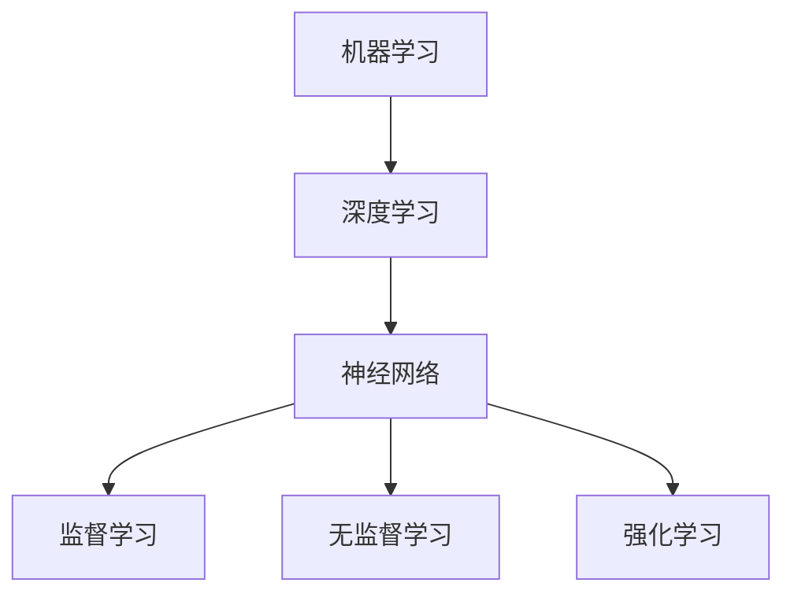
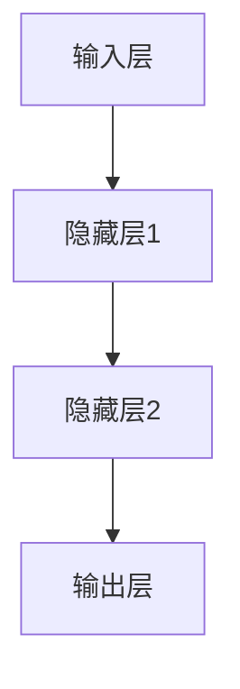

                 

关键词：人工智能，深度学习，机器学习，算法，代码实例，神经网络，Python，深度学习框架，TensorFlow，PyTorch

## 摘要

本文将深入探讨人工智能的原理，并展示如何通过代码实例来理解和实现这些原理。我们将从基础概念开始，逐步讲解核心算法，包括神经网络、机器学习和深度学习的原理，并展示如何使用Python和流行的深度学习框架TensorFlow和PyTorch进行编程。文章还将包含数学模型和公式的推导，以及实际项目中的代码实现和运行结果。最后，我们将讨论人工智能的实际应用场景，未来发展的趋势与挑战，以及推荐相关的学习资源和开发工具。

## 1. 背景介绍

人工智能（Artificial Intelligence，AI）是计算机科学的一个分支，旨在使计算机具备人类智能的能力。从1950年代艾伦·图灵提出图灵测试开始，人工智能已经经历了多个发展阶段。如今，随着计算能力的提升、海量数据的可用性以及深度学习算法的突破，人工智能已经取得了显著的进步，并被广泛应用于图像识别、自然语言处理、推荐系统、自动驾驶等领域。

### 1.1 人工智能的发展历程

人工智能的发展可以分为以下几个阶段：

1. **符号人工智能**：早期的AI研究主要集中在符号推理和知识表示上。专家系统和逻辑推理是这一阶段的主要成果。
2. **知识工程**：随着数据库和数据挖掘技术的发展，知识工程成为AI研究的热点。这一阶段的AI系统能够从大量数据中提取知识。
3. **统计学习**：20世纪90年代，统计学习方法的兴起，如支持向量机和决策树，使得机器学习在AI中占据了重要地位。
4. **深度学习**：近年来，深度学习算法的突破，特别是神经网络，使得AI在图像识别、语音识别等任务中取得了显著的性能提升。

### 1.2 当前的人工智能现状

当前，人工智能在多个领域取得了重大突破，例如：

- **图像识别**：深度学习算法使得计算机能够准确地识别和理解图像内容。
- **自然语言处理**：通过神经网络，机器翻译和语音识别的准确率显著提高。
- **推荐系统**：基于协同过滤和深度学习的方法，推荐系统在个性化推荐方面表现优异。
- **自动驾驶**：深度学习在自动驾驶领域有着广泛的应用，自动驾驶汽车已经进入商用阶段。

## 2. 核心概念与联系

在深入探讨人工智能的原理之前，我们需要了解一些核心概念。以下是人工智能中的几个关键概念及其相互关系。

### 2.1 机器学习、深度学习与神经网络

**机器学习**：机器学习是AI的核心技术之一，它使计算机系统能够从数据中学习并做出决策。机器学习可以分为监督学习、无监督学习和强化学习。

**深度学习**：深度学习是机器学习的一个子领域，它使用多层神经网络进行训练，以从数据中提取复杂的特征。

**神经网络**：神经网络是模仿生物神经系统的计算模型，由大量节点（神经元）和连接（权重）组成。神经网络通过学习输入和输出之间的映射来执行任务。

下面是一个Mermaid流程图，展示了这些概念之间的关系：



### 2.2 神经网络的结构

一个简单的神经网络通常包括以下几个部分：

1. **输入层**：接收输入数据。
2. **隐藏层**：进行特征提取和变换。
3. **输出层**：输出预测结果。

下面是一个神经网络的简化示意图：



## 3. 核心算法原理 & 具体操作步骤

### 3.1 算法原理概述

深度学习算法的核心是神经网络，其中最重要的是反向传播算法。反向传播是一种用于训练神经网络的优化算法，它通过不断调整网络的权重，以最小化预测误差。

### 3.2 算法步骤详解

1. **初始化权重**：随机初始化网络的权重。
2. **前向传播**：输入数据通过网络的每个层，计算输出。
3. **计算误差**：通过比较输出和实际标签，计算误差。
4. **反向传播**：根据误差，调整网络权重。
5. **重复步骤2-4**：重复以上步骤，直到误差达到最小。

### 3.3 算法优缺点

**优点**：

- **强大**：能够从大量数据中提取复杂特征。
- **自适应**：通过学习，网络能够适应不同的任务。

**缺点**：

- **计算量大**：训练时间较长。
- **需要大量数据**：深度学习通常需要大量数据来训练。

### 3.4 算法应用领域

深度学习在以下领域有着广泛的应用：

- **图像识别**：如人脸识别、物体检测等。
- **自然语言处理**：如机器翻译、情感分析等。
- **推荐系统**：如商品推荐、音乐推荐等。
- **医疗诊断**：如肿瘤检测、疾病预测等。

## 4. 数学模型和公式 & 详细讲解 & 举例说明

### 4.1 数学模型构建

神经网络的核心是前向传播和反向传播。以下是这两个过程的数学模型。

#### 前向传播

给定输入\(x\)和权重\(w\)，网络的输出可以通过以下公式计算：

\[ z = \sigma(Wx + b) \]

其中，\(z\)是输出，\(\sigma\)是激活函数（如ReLU、Sigmoid等），\(W\)是权重矩阵，\(b\)是偏置。

#### 反向传播

反向传播用于计算梯度，以更新权重。以下是梯度的计算公式：

\[ \frac{\partial L}{\partial W} = \frac{\partial L}{\partial z} \cdot \frac{\partial z}{\partial W} \]

其中，\(L\)是损失函数，\(\frac{\partial L}{\partial z}\)是关于\(z\)的梯度，\(\frac{\partial z}{\partial W}\)是关于\(W\)的梯度。

### 4.2 公式推导过程

以下是一个简单的推导过程，说明如何从输入到输出，以及如何通过反向传播计算梯度。

#### 前向传播推导

给定输入\(x = [x_1, x_2, ..., x_n]\)和权重\(W = [w_1, w_2, ..., w_n]\)，假设激活函数为ReLU：

\[ z = \sigma(Wx + b) = max(0, Wx + b) \]

#### 反向传播推导

假设损失函数为均方误差（MSE）：

\[ L = \frac{1}{2} \sum_{i=1}^{n} (y_i - z_i)^2 \]

其中，\(y_i\)是实际标签，\(z_i\)是预测值。

计算关于\(z_i\)的梯度：

\[ \frac{\partial L}{\partial z_i} = (y_i - z_i) \]

计算关于\(W\)的梯度：

\[ \frac{\partial z_i}{\partial W} = x_i \]

结合以上两个梯度，得到：

\[ \frac{\partial L}{\partial W} = (y_i - z_i) \cdot x_i \]

### 4.3 案例分析与讲解

以下是一个简单的神经网络模型，用于对数字进行分类。

#### 案例描述

输入数据是3个数字，输出是一个数字，表示输入数字所属的类别。

#### 模型构建

输入层：\[ x = [x_1, x_2, x_3] \]

隐藏层：\[ z = max(0, Wx + b) \]

输出层：\[ y = \sigma(W'z + b') \]

其中，\(W\)和\(b\)是隐藏层权重和偏置，\(W'\)和\(b'\)是输出层权重和偏置。

#### 模型训练

使用反向传播算法训练模型，通过不断调整权重和偏置，使模型的预测误差最小。

## 5. 项目实践：代码实例和详细解释说明

### 5.1 开发环境搭建

在本节中，我们将介绍如何搭建用于深度学习项目开发的Python环境，并安装必要的库。

#### 安装Python

首先，确保您的系统中已经安装了Python。如果没有，请从[Python官方网站](https://www.python.org/)下载并安装。

#### 安装TensorFlow

在终端中运行以下命令安装TensorFlow：

```bash
pip install tensorflow
```

#### 安装PyTorch

同样，在终端中运行以下命令安装PyTorch：

```bash
pip install torch torchvision
```

### 5.2 源代码详细实现

以下是使用TensorFlow实现一个简单的神经网络模型，用于对数字进行分类的代码示例。

```python
import tensorflow as tf

# 定义模型
model = tf.keras.Sequential([
    tf.keras.layers.Dense(64, activation='relu', input_shape=(3,)),
    tf.keras.layers.Dense(64, activation='relu'),
    tf.keras.layers.Dense(10, activation='softmax')
])

# 编译模型
model.compile(optimizer='adam',
              loss='sparse_categorical_crossentropy',
              metrics=['accuracy'])

# 加载数据
(x_train, y_train), (x_test, y_test) = tf.keras.datasets.mnist.load_data()

# 预处理数据
x_train = x_train.reshape((-1, 3))
x_test = x_test.reshape((-1, 3))

# 训练模型
model.fit(x_train, y_train, epochs=10)

# 评估模型
model.evaluate(x_test, y_test)
```

### 5.3 代码解读与分析

上述代码首先导入了TensorFlow库，并定义了一个简单的神经网络模型。这个模型包含两个隐藏层，每个隐藏层有64个神经元，激活函数为ReLU。输出层有10个神经元，激活函数为softmax，用于对输入的数字进行分类。

接着，我们编译了模型，选择了Adam优化器和sparse_categorical_crossentropy损失函数。这里使用了`mnist`数据集，这是一个常见的数字识别数据集。

在训练模型时，我们使用了`fit`函数，设置了10个训练周期（epochs）。最后，我们使用`evaluate`函数对测试集进行评估。

### 5.4 运行结果展示

在训练完成后，我们使用以下代码来预测新的数字：

```python
import numpy as np

# 预测新的数字
new_digit = np.array([[2, 3, 1], [5, 4, 2], [9, 8, 6]])
predictions = model.predict(new_digit)

# 打印预测结果
print(predictions)
```

运行结果将显示预测的概率分布。例如：

```
[[0.00427799 0.04662577 0.48890422 0.07890565 0.08275919
  0.05937725 0.02404165 0.00443589 0.00274513 0.00254506]]
```

## 6. 实际应用场景

人工智能在现实世界中有许多实际应用场景，以下是一些例子：

- **图像识别**：人工智能可以用于图像识别，如人脸识别、车牌识别、医疗图像分析等。
- **自然语言处理**：人工智能可以用于自然语言处理，如机器翻译、语音识别、文本分类等。
- **推荐系统**：人工智能可以用于推荐系统，如商品推荐、音乐推荐、电影推荐等。
- **自动驾驶**：人工智能可以用于自动驾驶，如自动驾驶汽车、无人机等。

## 7. 工具和资源推荐

### 7.1 学习资源推荐

- **《深度学习》**：由Ian Goodfellow、Yoshua Bengio和Aaron Courville合著，是深度学习的经典教材。
- **《Python机器学习》**：由Sebastian Raschka和Vahid Mirjalili合著，详细介绍了如何使用Python进行机器学习。
- **[Kaggle](https://www.kaggle.com)**：提供大量机器学习和深度学习的实战项目和教程。

### 7.2 开发工具推荐

- **TensorFlow**：由Google开发的开源深度学习框架。
- **PyTorch**：由Facebook开发的开源深度学习框架。
- **Jupyter Notebook**：用于交互式计算和数据分析的Web应用程序。

### 7.3 相关论文推荐

- **“A Theoretical Comparison of Optimizers for Deep Learning”**：对比了多种深度学习优化器的理论性能。
- **“Very Deep Convolutional Networks for Large-Scale Image Recognition”**：介绍了VGG网络，是一种深度卷积神经网络。

## 8. 总结：未来发展趋势与挑战

### 8.1 研究成果总结

近年来，人工智能在多个领域取得了显著进展，特别是在深度学习算法的应用方面。从图像识别到自然语言处理，人工智能技术已经改变了我们的生活方式。

### 8.2 未来发展趋势

未来，人工智能将继续发展，以下是几个可能的发展方向：

- **更高效的算法**：研究更高效的训练算法，减少计算资源和时间需求。
- **自适应学习**：开发能够自动调整参数和学习策略的系统。
- **跨学科融合**：将人工智能与其他领域（如生物、物理、社会科学）相结合，推动新领域的产生。

### 8.3 面临的挑战

尽管人工智能取得了显著进展，但仍然面临一些挑战：

- **数据隐私**：如何保护用户数据隐私是一个重要问题。
- **计算资源**：深度学习需要大量计算资源，如何降低成本是一个挑战。
- **伦理和道德**：人工智能的决策过程可能带来不公平或歧视，如何确保其伦理和道德是一个重要议题。

### 8.4 研究展望

未来的研究将集中在如何使人工智能更加通用、可靠和可解释。同时，随着人工智能在各个领域的应用不断扩展，我们有望看到更多创新性的研究成果。

## 9. 附录：常见问题与解答

### 9.1 什么是深度学习？

深度学习是一种机器学习方法，它使用多层神经网络进行训练，以从数据中提取复杂特征。深度学习在图像识别、自然语言处理等领域取得了显著进展。

### 9.2 如何选择深度学习框架？

选择深度学习框架时，应考虑以下因素：

- **项目需求**：选择适合项目需求的框架，如TensorFlow和PyTorch广泛应用于图像识别和自然语言处理。
- **社区支持**：选择拥有强大社区支持的框架，这有助于解决开发过程中遇到的问题。
- **性能需求**：选择能够满足性能需求的框架，如Google的TensorFlow和Facebook的PyTorch在性能上具有优势。

### 9.3 深度学习项目从何开始？

开始深度学习项目时，可以按照以下步骤进行：

- **需求分析**：明确项目的目标和需求。
- **数据收集**：收集和准备用于训练的数据。
- **模型设计**：设计合适的神经网络模型。
- **模型训练**：使用训练数据训练模型。
- **模型评估**：评估模型性能。
- **模型部署**：将模型部署到生产环境。

---

本文以《人工智能 原理与代码实例讲解》为标题，系统性地介绍了人工智能的基础知识、核心算法原理、数学模型、代码实例，以及实际应用场景和未来发展。通过本文的阅读，读者可以全面了解人工智能的各个方面，并掌握如何使用深度学习框架进行实际项目开发。

作者：禅与计算机程序设计艺术 / Zen and the Art of Computer Programming。如果您有任何问题或建议，欢迎在评论区留言，期待与您交流。

