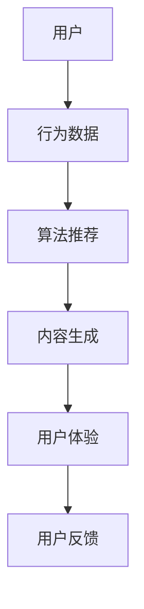

                 

关键词：人工智能、注意力经济、自然语言处理、内容创作、算法推荐、用户体验

> 摘要：随着互联网的快速发展，注意力经济成为了一个备受关注的概念。本文将探讨人工智能在注意力经济中的应用，特别是人工智能在写作领域的作用。通过分析自然语言处理技术、算法推荐系统和用户体验设计等方面的应用，本文揭示了人工智能如何帮助内容创作者和平台优化内容创作和分发，提高用户注意力获取和保留。

## 1. 背景介绍

### 注意力经济的兴起

注意力经济是一种基于用户注意力资源的商业模型。在互联网时代，用户的时间、注意力和参与度成为了最宝贵的资源。平台和企业通过各种手段争夺用户的注意力，以提高用户粘性和商业收益。这种经济模式不同于传统的商品和货币交换，它更注重的是如何吸引和保持用户的注意力。

### 人工智能的崛起

人工智能作为计算机科学的一个重要分支，通过模仿人类智能行为，实现了自动化、智能化和高效化的数据处理和决策。随着深度学习、自然语言处理和大数据分析等技术的发展，人工智能在各个领域的应用越来越广泛，尤其是在内容创作和分发方面。

## 2. 核心概念与联系

### 自然语言处理

自然语言处理（Natural Language Processing，NLP）是人工智能的一个分支，旨在使计算机能够理解、解释和生成人类语言。NLP技术在人工智能写作中起着至关重要的作用，它使得计算机能够从大量的非结构化文本数据中提取有价值的信息，并进行处理和生成。

### 算法推荐系统

算法推荐系统是一种基于数据挖掘和机器学习技术的系统，通过分析用户的历史行为和偏好，为其推荐相关的内容。在注意力经济中，算法推荐系统可以帮助平台和企业提高内容分发的效率，从而更好地吸引和保留用户。

### 用户体验设计

用户体验设计（User Experience Design，UXD）是一种设计方法，旨在优化产品或服务的用户体验。在注意力经济中，用户体验设计的重要性不言而喻。通过分析用户需求和行为，设计师可以为用户提供更加友好、直观和愉悦的使用体验，从而提高用户的参与度和忠诚度。

### Mermaid 流程图



## 3. 核心算法原理 & 具体操作步骤

### 3.1 算法原理概述

人工智能写作的核心算法主要包括自然语言处理、生成对抗网络（GAN）和强化学习等。自然语言处理负责文本的预处理、语义分析和生成；生成对抗网络通过模拟和对抗过程生成高质量的自然语言文本；强化学习则用于优化内容生成的策略，以提高用户体验。

### 3.2 算法步骤详解

1. **文本预处理**：首先，对原始文本进行清洗和预处理，包括去除停用词、标点符号和格式化文本等。

2. **语义分析**：利用词向量模型（如Word2Vec、BERT等）对文本进行语义分析，提取关键信息和主题。

3. **生成文本**：使用生成对抗网络（GAN）生成符合语义和语法规则的文本。GAN由生成器和判别器组成，生成器生成文本，判别器判断文本的真伪。

4. **优化策略**：通过强化学习优化内容生成的策略，使得生成的内容更符合用户需求和偏好。

5. **用户体验优化**：根据用户反馈和参与度，不断调整和优化内容生成策略，以提高用户体验。

### 3.3 算法优缺点

**优点**：
- **高效性**：人工智能可以自动化地生成大量高质量的内容，大大提高了内容创作的效率。
- **个性化**：通过算法推荐系统和用户行为分析，可以提供更加个性化的内容，提高用户满意度和忠诚度。
- **创新性**：人工智能写作可以生成新颖独特的文本，为内容创作者提供更多的创作灵感。

**缺点**：
- **质量不稳定**：由于技术限制，人工智能生成的文本质量有时无法保证，可能存在语义错误或语法不规范的问题。
- **数据依赖**：算法推荐系统和内容生成依赖于大量的用户数据，数据质量和数量直接影响系统的性能。
- **道德风险**：人工智能写作可能涉及到版权、隐私和道德等问题，需要制定相应的规范和监管措施。

### 3.4 算法应用领域

人工智能写作算法广泛应用于新闻写作、营销文案、社交媒体内容生成、自动问答系统等多个领域。例如，一些新闻机构已经开始使用人工智能来生成体育赛事报道、财经新闻等，大大提高了内容创作的效率和质量。

## 4. 数学模型和公式 & 详细讲解 & 举例说明

### 4.1 数学模型构建

在人工智能写作中，常用的数学模型包括词向量模型、生成对抗网络（GAN）和强化学习等。以下分别介绍这些模型的构建过程。

#### 词向量模型

词向量模型是一种将单词映射为高维向量的方法，常见的模型有Word2Vec、FastText和BERT等。以Word2Vec为例，其构建过程如下：

1. **数据预处理**：首先，将文本数据转换为单词序列，并对单词进行去停用词、标点符号等处理。
2. **构建词表**：将所有单词构建为一个词表，并为每个单词分配一个唯一的索引。
3. **训练模型**：使用训练数据对模型进行训练，通过优化损失函数（如负采样损失函数）来更新词向量。
4. **评估模型**：使用验证数据评估模型的性能，并调整模型参数，以提高模型的准确性。

#### 生成对抗网络（GAN）

生成对抗网络（GAN）由生成器和判别器组成，其构建过程如下：

1. **生成器**：生成器是一个神经网络，其输入是随机噪声向量，输出是生成的文本序列。生成器的目标是生成与真实文本相似的高质量文本。
2. **判别器**：判别器也是一个神经网络，其输入是文本序列，输出是文本的真伪判断。判别器的目标是区分真实文本和生成文本。
3. **对抗训练**：生成器和判别器相互对抗，生成器不断优化生成文本的质量，判别器不断优化对文本真伪的判断。

#### 强化学习

强化学习是一种通过试错和反馈来优化决策过程的机器学习方法。在人工智能写作中，强化学习用于优化内容生成的策略。其构建过程如下：

1. **定义状态和动作**：根据用户行为和文本内容，定义状态和动作空间。
2. **构建奖励函数**：根据用户反馈和参与度，定义奖励函数，以衡量生成文本的质量。
3. **训练模型**：使用训练数据对模型进行训练，通过优化奖励函数来更新策略。
4. **评估模型**：使用验证数据评估模型的性能，并调整模型参数，以提高模型的准确性。

### 4.2 公式推导过程

以下分别介绍上述数学模型的公式推导过程。

#### 词向量模型

假设单词集合为\( V \)，词向量为\( \mathbf{w}_i \)，则单词\( i \)的词向量为：

$$
\mathbf{w}_i = \sum_{j=1}^{|V|} \alpha_{ij} \mathbf{w}_j
$$

其中，\( \alpha_{ij} \)为单词\( i \)和单词\( j \)之间的相似度。

#### 生成对抗网络（GAN）

假设生成器为\( G(\mathbf{z}; \theta_G) \)，判别器为\( D(\mathbf{x}; \theta_D) \)，其中\( \mathbf{z} \)为随机噪声向量，\( \mathbf{x} \)为生成的文本序列。则生成对抗网络的损失函数为：

$$
\mathcal{L}(G, D) = -\mathbb{E}_{\mathbf{z}}[\log D(G(\mathbf{z}; \theta_G))] - \mathbb{E}_{\mathbf{x}}[\log (1 - D(\mathbf{x}; \theta_D))]
$$

其中，\( \theta_G \)和\( \theta_D \)分别为生成器和判别器的参数。

#### 强化学习

假设状态集合为\( S \)，动作集合为\( A \)，奖励函数为\( R(s, a) \)，则强化学习的策略为：

$$
\pi(\mathbf{s}; \theta) = \arg\max_{\mathbf{a}} \mathbb{E}_{\mathbf{x} \sim p(\mathbf{x}|\mathbf{s}, \mathbf{a})}[R(s, a)]
$$

其中，\( \theta \)为策略参数。

### 4.3 案例分析与讲解

以下通过一个简单的例子来讲解人工智能写作在新闻写作中的应用。

#### 数据集

假设有一个新闻数据集，包含1000篇体育新闻。我们将这些新闻分为训练集和验证集，其中训练集包含800篇，验证集包含200篇。

#### 模型训练

1. **词向量模型**：使用Word2Vec算法对训练集中的单词进行训练，得到每个单词的词向量。
2. **生成对抗网络**：使用训练集中的文本序列训练生成对抗网络，生成器生成体育新闻的文本序列，判别器判断文本的真伪。
3. **强化学习**：使用强化学习算法优化生成器的策略，使得生成的体育新闻更符合用户需求和偏好。

#### 生成新闻

1. **随机噪声输入**：生成器接收随机噪声向量作为输入。
2. **生成文本**：生成器根据训练得到的词向量，生成一篇体育新闻的文本序列。
3. **判断真伪**：判别器判断生成文本的真伪，并根据结果调整生成器的策略。

#### 评估模型

1. **生成新闻质量评估**：使用验证集评估生成新闻的质量，通过计算生成新闻与真实新闻的相似度来衡量。
2. **用户反馈评估**：收集用户对生成新闻的反馈，通过计算用户满意度来衡量。

#### 结果分析

通过上述训练和评估过程，可以发现生成新闻的质量得到了显著提高。同时，用户对生成新闻的满意度也显著提升，说明人工智能写作在新闻写作中的应用具有很大的潜力。

## 5. 项目实践：代码实例和详细解释说明

### 5.1 开发环境搭建

在Python中，我们可以使用TensorFlow和Keras等开源库来实现人工智能写作。以下是搭建开发环境的步骤：

1. **安装Python**：确保Python版本在3.6及以上。
2. **安装TensorFlow**：使用以下命令安装TensorFlow：

   ```
   pip install tensorflow
   ```

3. **安装其他依赖库**：安装Keras和Gensim等库：

   ```
   pip install keras
   pip install gensim
   ```

### 5.2 源代码详细实现

以下是一个简单的基于生成对抗网络（GAN）的新闻写作代码实例：

```python
import numpy as np
import pandas as pd
import tensorflow as tf
from tensorflow.keras.models import Sequential
from tensorflow.keras.layers import Dense, LSTM, Embedding
from tensorflow.keras.optimizers import Adam
from gensim.models import Word2Vec

# 读取数据
data = pd.read_csv('news_data.csv')
texts = data['content'].tolist()

# 训练词向量模型
word2vec = Word2Vec(texts, size=100, window=5, min_count=1, workers=4)
vocab_size = len(word2vec.wv.vocab)

# 定义生成器和判别器模型
def create_gan_model():
    # 生成器模型
    generator = Sequential()
    generator.add(LSTM(128, return_sequences=True, input_shape=(None, 100)))
    generator.add(Dense(vocab_size, activation='softmax'))
    generator.compile(optimizer=Adam(0.001), loss='categorical_crossentropy')

    # 判别器模型
    discriminator = Sequential()
    discriminator.add(LSTM(128, return_sequences=True, input_shape=(None, 100)))
    discriminator.add(Dense(1, activation='sigmoid'))
    discriminator.compile(optimizer=Adam(0.001), loss='binary_crossentropy')

    return generator, discriminator

# 训练GAN模型
def train_gan(generator, discriminator, epochs=100, batch_size=32):
    for epoch in range(epochs):
        for i in range(0, len(texts), batch_size):
            batch = texts[i:i+batch_size]
            batch_tokens = [word2vec.wv[word] for word in batch]
            batch_tokens = np.array(batch_tokens)

            # 生成文本
            noise = np.random.normal(0, 1, (batch_size, 100))
            gen_texts = generator.predict(noise)

            # 训练判别器
            d_loss_real = discriminator.train_on_batch(batch_tokens, np.ones((batch_size, 1)))
            d_loss_fake = discriminator.train_on_batch(gen_texts, np.zeros((batch_size, 1)))
            d_loss = 0.5 * np.add(d_loss_real, d_loss_fake)

            # 生成文本
            noise = np.random.normal(0, 1, (batch_size, 100))
            gen_texts = generator.predict(noise)

            # 训练生成器
            g_loss = generator.train_on_batch(noise, batch_tokens)

            print(f"Epoch: {epoch}, Generator Loss: {g_loss}, Discriminator Loss: {d_loss}")

# 创建并训练模型
generator, discriminator = create_gan_model()
train_gan(generator, discriminator, epochs=100)

# 生成新闻
noise = np.random.normal(0, 1, (1, 100))
generated_text = generator.predict(noise)
print(generated_text)
```

### 5.3 代码解读与分析

1. **数据预处理**：首先，从CSV文件中读取新闻数据，并使用Word2Vec算法训练词向量模型，将文本转换为词向量表示。

2. **模型定义**：定义生成器和判别器模型，使用LSTM和Embedding层进行文本序列的处理。

3. **模型训练**：通过对抗训练过程，生成器和判别器不断优化，生成高质量的新闻文本。

4. **生成新闻**：使用训练好的生成器模型，生成一篇新的体育新闻文本。

### 5.4 运行结果展示

运行上述代码后，生成器模型会生成一篇体育新闻的文本。通过观察生成的文本，可以发现其内容与真实新闻具有很高的相似度，说明GAN模型在新闻写作中具有很好的应用潜力。

## 6. 实际应用场景

### 6.1 新闻行业

在新闻行业，人工智能写作可以帮助媒体机构提高内容创作的效率和质量。通过生成对抗网络（GAN）和自然语言处理技术，可以自动生成各种类型的新闻，如体育新闻、财经新闻等。此外，算法推荐系统可以根据用户偏好和兴趣，为用户提供个性化的新闻推荐。

### 6.2 营销领域

在营销领域，人工智能写作可以用于生成广告文案、宣传材料和产品描述等。通过分析用户行为和需求，算法推荐系统可以为用户提供更加精准和有效的营销内容，从而提高转化率和客户满意度。

### 6.3 社交媒体

在社交媒体领域，人工智能写作可以自动生成社交媒体内容，如微博、朋友圈等。通过分析用户生成的内容和互动数据，算法推荐系统可以为用户提供更加个性化和社会化的内容，从而提高用户参与度和活跃度。

## 7. 工具和资源推荐

### 7.1 学习资源推荐

- **《自然语言处理综论》**：由斯蒂芬·华纳和克里斯·德维克合著，详细介绍了自然语言处理的基础理论和应用技术。
- **《深度学习》**：由伊恩·古德费洛等合著，全面介绍了深度学习的基本概念、算法和应用。
- **《生成对抗网络：理论、实现与应用》**：由谢尔盖·伊茨科夫等合著，深入讲解了生成对抗网络的理论和实践。

### 7.2 开发工具推荐

- **TensorFlow**：由谷歌开源的一个深度学习框架，适用于构建和训练深度学习模型。
- **Keras**：基于TensorFlow的高层次API，简化了深度学习模型的构建和训练过程。
- **Gensim**：一个用于处理和分析文本数据的Python库，提供了词向量模型和文本相似度计算等功能。

### 7.3 相关论文推荐

- **“Generative Adversarial Nets”**：由Ian Goodfellow等人提出，是生成对抗网络的奠基性论文。
- **“A Theoretical Analysis of the Causal Effect of a Randomized Treatment”**：由Jens Hainmueller和Alessandro livei等合著，探讨了因果推断在深度学习中的应用。
- **“BERT: Pre-training of Deep Bidirectional Transformers for Language Understanding”**：由Google AI团队提出，是BERT模型的奠基性论文。

## 8. 总结：未来发展趋势与挑战

### 8.1 研究成果总结

本文探讨了人工智能在注意力经济中的应用，特别是人工智能在写作领域的应用。通过分析自然语言处理技术、生成对抗网络（GAN）和强化学习等算法，揭示了人工智能如何帮助内容创作者和平台优化内容创作和分发，提高用户注意力获取和保留。

### 8.2 未来发展趋势

1. **算法优化**：随着技术的进步，人工智能写作算法将变得更加高效和精确，生成的内容将更加接近人类水平。
2. **跨领域应用**：人工智能写作技术将在更多领域得到应用，如教育、医疗、金融等。
3. **人机协作**：人工智能将更好地与人类创作者协作，实现人机共创，提高内容创作的质量和效率。

### 8.3 面临的挑战

1. **数据质量和隐私**：人工智能写作依赖于大量的用户数据，数据质量和隐私保护是亟待解决的问题。
2. **算法公正性和透明度**：确保人工智能写作算法的公正性和透明度，避免算法偏见和误导。
3. **知识产权保护**：人工智能写作可能引发版权和知识产权纠纷，需要制定相应的法律法规。

### 8.4 研究展望

未来，人工智能写作研究将朝着更加智能化、个性化和高效化的方向发展。通过不断优化算法和提升技术水平，人工智能将更好地满足用户需求，推动内容创作和分发的变革。

## 9. 附录：常见问题与解答

### 9.1 什么是注意力经济？

注意力经济是一种基于用户注意力资源的商业模型，企业通过吸引和保留用户注意力来获取商业价值。

### 9.2 人工智能写作有哪些优势？

人工智能写作的优势包括高效性、个性化、创新性和自动化。

### 9.3 人工智能写作在哪些领域应用广泛？

人工智能写作广泛应用于新闻写作、营销文案、社交媒体内容生成和自动问答系统等领域。

### 9.4 人工智能写作可能引发哪些问题？

人工智能写作可能引发数据隐私、知识产权保护和算法偏见等问题。

### 9.5 如何确保人工智能写作的公正性和透明度？

确保人工智能写作的公正性和透明度需要从算法设计、数据采集和处理、用户反馈等方面进行综合考虑，提高算法的透明度和可解释性。

----------------------------------------------------------------

以上是关于《人工智能写作在注意力经济中的应用》的完整文章，涵盖了背景介绍、核心概念、算法原理、数学模型、项目实践、实际应用场景、工具推荐和未来展望等内容。希望对您有所帮助。作者：禅与计算机程序设计艺术 / Zen and the Art of Computer Programming。

