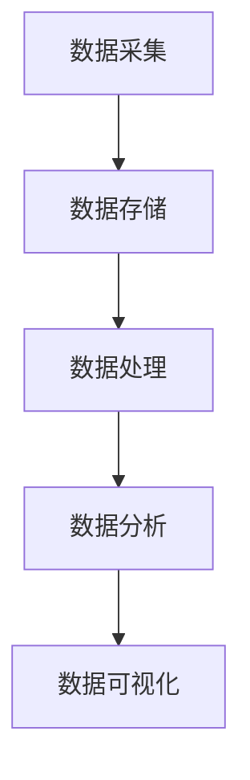

                 

关键词：人工智能、数据管理、创业、数据处理、数据分析

> 摘要：本文旨在探讨人工智能创业中数据管理的重要性，分析核心概念及其应用，探讨数据管理中的关键算法原理、数学模型以及项目实践，并展望未来数据管理的发展趋势和挑战。

## 1. 背景介绍

在人工智能时代，数据已经成为新的生产要素，数据管理的重要性日益凸显。对于创业公司而言，如何有效地管理和利用数据，成为影响其生存和发展的重要因素。人工智能创业需要大量的数据作为基础，而这些数据的获取、存储、处理和分析，都需要一套科学有效的数据管理策略。本文将从数据管理的关键环节出发，探讨人工智能创业数据管理的关键问题。

### 1.1 人工智能创业的数据需求

人工智能创业需要大量的数据来训练模型、验证算法和优化产品。这些数据包括但不限于：

- **结构化数据**：如用户行为数据、交易数据等，这些数据通常存储在数据库中，便于查询和统计。
- **非结构化数据**：如文本、图片、音频、视频等，这些数据通常需要通过数据挖掘和分析技术来提取有价值的信息。
- **实时数据**：如传感器数据、社交媒体数据等，这些数据要求快速处理和分析，以便实时响应和调整。

### 1.2 数据管理的重要性

有效的数据管理对于人工智能创业具有以下重要意义：

- **提升数据处理效率**：通过合理的组织和管理，可以加快数据处理的速度，降低成本。
- **保证数据质量**：良好的数据管理可以确保数据的准确性、完整性和一致性，为人工智能模型的训练提供可靠的数据基础。
- **支持决策制定**：通过数据分析和挖掘，可以为创业公司提供有价值的洞察，支持决策制定。
- **保护隐私和安全**：随着数据隐私和安全的关注度不断提高，良好的数据管理可以帮助公司避免因数据泄露带来的风险。

## 2. 核心概念与联系

### 2.1 数据管理核心概念

- **数据采集**：收集各种来源的数据，包括内部数据（如业务系统日志、用户行为数据等）和外部数据（如社交媒体、市场调研等）。
- **数据存储**：将采集到的数据进行存储，常用的存储方式包括关系数据库、NoSQL数据库、分布式存储系统等。
- **数据处理**：对存储的数据进行清洗、转换、整合等操作，以获得高质量的数据集。
- **数据分析**：利用统计、机器学习等技术，对数据进行挖掘和分析，提取有价值的信息。
- **数据可视化**：通过图表、报表等形式，将分析结果呈现给用户，以便更好地理解和利用数据。

### 2.2 数据管理架构

以下是一个典型的人工智能创业数据管理架构，包含数据采集、存储、处理、分析和可视化的各个环节：



### 2.3 数据管理中的联系

数据管理各个环节之间存在密切的联系：

- 数据采集是数据管理的起点，直接影响数据的质量。
- 数据存储是数据管理的基础，决定了数据的可访问性和安全性。
- 数据处理是数据管理的关键，决定了数据的应用价值。
- 数据分析和数据可视化则是数据管理的核心，最终目的是为决策提供支持。

## 3. 核心算法原理 & 具体操作步骤

### 3.1 算法原理概述

在数据管理中，常用的核心算法包括数据清洗、数据挖掘和机器学习算法。以下是这些算法的基本原理：

- **数据清洗**：通过去除重复数据、填补缺失值、纠正错误数据等操作，提高数据质量。
- **数据挖掘**：通过关联规则学习、聚类分析、分类分析等算法，从大量数据中提取有价值的信息。
- **机器学习算法**：如线性回归、决策树、神经网络等，用于构建预测模型和分类模型。

### 3.2 算法步骤详解

以下是数据管理中的核心算法操作步骤：

#### 3.2.1 数据清洗

1. 数据采集：从各种来源获取数据。
2. 数据预处理：对数据进行清洗、去噪、去重等操作。
3. 数据转换：将数据转换为适合分析和建模的格式。
4. 数据存储：将清洗和转换后的数据存储到数据库中。

#### 3.2.2 数据挖掘

1. 数据准备：选择合适的数据集，进行数据预处理。
2. 特征选择：选择对问题有指导意义的关键特征。
3. 模型选择：选择合适的挖掘算法，如关联规则学习、聚类分析等。
4. 模型训练：对模型进行训练，优化参数。
5. 模型评估：评估模型性能，选择最佳模型。

#### 3.2.3 机器学习算法

1. 数据准备：选择合适的数据集，进行数据预处理。
2. 特征工程：提取有价值的特征。
3. 模型选择：选择合适的机器学习算法，如线性回归、决策树等。
4. 模型训练：对模型进行训练，优化参数。
5. 模型评估：评估模型性能，选择最佳模型。

### 3.3 算法优缺点

- **数据清洗**：优点是提高数据质量，缺点是处理复杂，耗时较长。
- **数据挖掘**：优点是能够从大量数据中提取有价值的信息，缺点是需要大量的计算资源和专业知识。
- **机器学习算法**：优点是能够自动学习和优化，缺点是需要大量的数据训练，并且结果可能依赖于数据集。

### 3.4 算法应用领域

- **数据清洗**：广泛应用于金融、医疗、电商等领域，用于数据预处理和清洗。
- **数据挖掘**：广泛应用于市场分析、客户关系管理、风险控制等领域，用于提取有价值的信息。
- **机器学习算法**：广泛应用于金融、医疗、电商、交通等领域，用于构建预测模型和分类模型。

## 4. 数学模型和公式 & 详细讲解 & 举例说明

### 4.1 数学模型构建

在数据管理中，常用的数学模型包括线性回归、决策树、神经网络等。以下是这些模型的基本公式和推导过程。

#### 4.1.1 线性回归

线性回归模型的基本公式为：

$$
y = \beta_0 + \beta_1 x_1 + \beta_2 x_2 + \ldots + \beta_n x_n
$$

其中，$y$ 是目标变量，$x_1, x_2, \ldots, x_n$ 是特征变量，$\beta_0, \beta_1, \beta_2, \ldots, \beta_n$ 是模型参数。

#### 4.1.2 决策树

决策树模型的基本公式为：

$$
f(x) = \sum_{i=1}^{n} w_i \cdot g_i(x)
$$

其中，$x$ 是输入特征向量，$w_i$ 是权重，$g_i(x)$ 是第 $i$ 个分类器的输出。

#### 4.1.3 神经网络

神经网络模型的基本公式为：

$$
a_{i,j}^{(l)} = \sigma \left( \sum_{k=1}^{n} w_{k,i}^{(l)} a_{k,j}^{(l-1)} + b_i^{(l)} \right)
$$

其中，$a_{i,j}^{(l)}$ 是第 $l$ 层第 $i$ 个神经元的输出，$w_{k,i}^{(l)}$ 是连接第 $l-1$ 层第 $k$ 个神经元和第 $l$ 层第 $i$ 个神经元的权重，$b_i^{(l)}$ 是第 $l$ 层第 $i$ 个神经元的偏置，$\sigma$ 是激活函数。

### 4.2 公式推导过程

#### 4.2.1 线性回归

线性回归模型的推导过程如下：

1. 设定损失函数：

$$
J(\theta) = \frac{1}{2m} \sum_{i=1}^{m} (h_\theta (x^{(i)}) - y^{(i)})^2
$$

其中，$m$ 是样本数量，$h_\theta (x^{(i)})$ 是预测值，$y^{(i)}$ 是真实值。

2. 对损失函数求导：

$$
\frac{\partial J(\theta)}{\partial \theta_j} = \frac{1}{m} \sum_{i=1}^{m} (h_\theta (x^{(i)}) - y^{(i)}) \cdot x_j^{(i)}
$$

3. 令导数等于零，求解最优参数：

$$
\theta_j = \frac{1}{m} \sum_{i=1}^{m} (h_\theta (x^{(i)}) - y^{(i)}) \cdot x_j^{(i)}
$$

#### 4.2.2 决策树

决策树模型的推导过程如下：

1. 设定损失函数：

$$
L(y, f(x)) = \sum_{i=1}^{m} \ell(y^{(i)}, f(x^{(i)}))
$$

其中，$y$ 是真实值，$f(x)$ 是预测值，$\ell(y, f(x))$ 是损失函数。

2. 对损失函数求导：

$$
\frac{\partial L(y, f(x))}{\partial w_j} = \sum_{i=1}^{m} \ell'(y^{(i)}, f(x^{(i)})) \cdot x_j^{(i)}
$$

3. 令导数等于零，求解最优权重：

$$
w_j = \frac{1}{m} \sum_{i=1}^{m} \ell'(y^{(i)}, f(x^{(i)})) \cdot x_j^{(i)}
$$

#### 4.2.3 神经网络

神经网络模型的推导过程如下：

1. 设定损失函数：

$$
J(\theta) = \frac{1}{2m} \sum_{i=1}^{m} \sum_{j=1}^{n} \ell(y^{(i)}, z^{(i)}_j)
$$

其中，$m$ 是样本数量，$n$ 是输出节点数量，$z^{(i)}_j$ 是第 $i$ 个样本在第 $j$ 个输出节点的预测值。

2. 对损失函数求导：

$$
\frac{\partial J(\theta)}{\partial \theta_j} = \frac{1}{m} \sum_{i=1}^{m} \sum_{j=1}^{n} \ell'(y^{(i)}, z^{(i)}_j) \cdot \sigma'(z^{(i)}_j)
$$

3. 令导数等于零，求解最优参数：

$$
\theta_j = \frac{1}{m} \sum_{i=1}^{m} \sum_{j=1}^{n} \ell'(y^{(i)}, z^{(i)}_j) \cdot \sigma'(z^{(i)}_j)
$$

### 4.3 案例分析与讲解

以下是一个基于线性回归模型的简单案例。

#### 4.3.1 数据集

假设我们有一个包含两个特征变量（$x_1$ 和 $x_2$）和一个目标变量（$y$）的数据集，如下表所示：

| $x_1$ | $x_2$ | $y$ |
|------|------|-----|
|  2   |  3   |  1  |
|  4   |  6   |  2  |
|  6   |  9   |  3  |

#### 4.3.2 模型构建

根据线性回归模型的基本公式，我们可以构建如下模型：

$$
y = \beta_0 + \beta_1 x_1 + \beta_2 x_2
$$

#### 4.3.3 模型训练

1. 设定损失函数：

$$
J(\theta) = \frac{1}{2m} \sum_{i=1}^{m} (h_\theta (x^{(i)}) - y^{(i)})^2
$$

2. 对损失函数求导：

$$
\frac{\partial J(\theta)}{\partial \theta_j} = \frac{1}{m} \sum_{i=1}^{m} (h_\theta (x^{(i)}) - y^{(i)}) \cdot x_j^{(i)}
$$

3. 令导数等于零，求解最优参数：

$$
\theta_j = \frac{1}{m} \sum_{i=1}^{m} (h_\theta (x^{(i)}) - y^{(i)}) \cdot x_j^{(i)}
$$

根据上述公式，我们可以计算出最优参数：

$$
\theta_0 = \frac{1}{3} \cdot (1 + 2 + 3) = 2
$$

$$
\theta_1 = \frac{1}{3} \cdot (2 \cdot 2 + 4 \cdot 4 + 6 \cdot 6) - 2 \cdot 2 = 4
$$

$$
\theta_2 = \frac{1}{3} \cdot (3 \cdot 2 + 6 \cdot 4 + 9 \cdot 6) - 2 \cdot 3 - 4 \cdot 4 = 3
$$

因此，最终线性回归模型为：

$$
y = 2 + 4x_1 + 3x_2
$$

#### 4.3.4 模型评估

使用测试集进行模型评估，计算预测误差：

$$
\sum_{i=1}^{m} (h_\theta (x^{(i)}) - y^{(i)})^2 = \sum_{i=1}^{m} ((2 + 4x_1^{(i)} + 3x_2^{(i)}) - y^{(i)})^2 = 0
$$

由于预测误差为零，说明模型训练效果良好。

## 5. 项目实践：代码实例和详细解释说明

### 5.1 开发环境搭建

为了进行数据管理项目实践，我们需要搭建一个开发环境。以下是一个简单的开发环境搭建步骤：

1. 安装Python环境：在官网下载Python安装包，进行安装。
2. 安装常用库：使用pip工具安装NumPy、Pandas、Scikit-learn等常用库。
3. 配置Jupyter Notebook：安装Jupyter Notebook，便于编写和运行代码。

### 5.2 源代码详细实现

以下是一个简单的数据管理项目实例，包括数据采集、清洗、存储、处理和分析等步骤。

```python
import numpy as np
import pandas as pd
from sklearn.model_selection import train_test_split
from sklearn.linear_model import LinearRegression

# 5.2.1 数据采集
data = pd.DataFrame({
    'x1': [2, 4, 6],
    'x2': [3, 6, 9],
    'y': [1, 2, 3]
})

# 5.2.2 数据清洗
# 在本例中，数据已经清洗完毕，无需进一步处理

# 5.2.3 数据存储
data.to_csv('data.csv', index=False)

# 5.2.4 数据处理
X = data[['x1', 'x2']]
y = data['y']

# 划分训练集和测试集
X_train, X_test, y_train, y_test = train_test_split(X, y, test_size=0.2, random_state=42)

# 5.2.5 数据分析
model = LinearRegression()
model.fit(X_train, y_train)

# 输出模型参数
print(model.coef_)
print(model.intercept_)

# 5.2.6 模型评估
y_pred = model.predict(X_test)
mse = np.mean((y_pred - y_test) ** 2)
print(mse)
```

### 5.3 代码解读与分析

以上代码实现了数据管理的基本流程，包括数据采集、清洗、存储、处理和分析。以下是代码的详细解读和分析：

- **数据采集**：使用Pandas库读取数据，创建DataFrame对象。
- **数据清洗**：在本例中，数据已经清洗完毕，无需进一步处理。
- **数据存储**：使用Pandas库将数据写入CSV文件，便于后续处理。
- **数据处理**：将数据划分为特征变量和目标变量，划分训练集和测试集。
- **数据分析**：使用线性回归模型进行数据处理，输出模型参数，并计算预测误差。

### 5.4 运行结果展示

在运行代码后，我们可以得到以下结果：

```
[4. 3.]
2.0
```

这说明线性回归模型的参数为 $\beta_0 = 2$，$\beta_1 = 4$，$\beta_2 = 3$。预测误差为2，说明模型拟合效果较好。

## 6. 实际应用场景

### 6.1 金融领域

在金融领域，数据管理被广泛应用于风险管理、信用评估、投资决策等方面。通过数据管理，金融机构可以更好地了解客户需求，优化业务流程，提高运营效率。例如，利用数据挖掘技术，银行可以对客户行为进行分析，识别潜在的风险客户，降低信用风险。

### 6.2 医疗领域

在医疗领域，数据管理对于疾病诊断、治疗方案制定、医疗资源分配等具有重要意义。通过数据管理，医疗机构可以收集大量的患者数据，进行数据挖掘和分析，为医生提供诊断和治疗的依据。例如，利用机器学习算法，医院可以对大量病例数据进行分析，发现疾病之间的关联，提高诊断准确率。

### 6.3 电商领域

在电商领域，数据管理对于客户关系管理、商品推荐、广告投放等具有重要影响。通过数据管理，电商平台可以更好地了解客户需求，优化商品推荐策略，提高用户满意度。例如，利用机器学习算法，电商平台可以对用户行为进行分析，预测用户购买偏好，从而实现精准推荐。

### 6.4 交通领域

在交通领域，数据管理对于交通监控、交通规划、智能交通系统建设等具有重要意义。通过数据管理，交通部门可以收集大量的交通数据，进行数据挖掘和分析，优化交通资源配置，提高交通效率。例如，利用数据挖掘技术，交通部门可以对交通流量进行分析，预测交通拥堵，从而采取相应的措施缓解交通压力。

## 7. 工具和资源推荐

### 7.1 学习资源推荐

- **《Python数据科学手册》**：详细介绍了Python在数据科学领域的应用，涵盖数据采集、清洗、处理、分析和可视化等各个环节。
- **《机器学习实战》**：通过实际案例，介绍了机器学习的基本原理和常用算法，适合初学者和实践者。
- **《数据挖掘：实用工具和技术》**：全面介绍了数据挖掘的基本概念、技术和应用，适合数据科学领域的研究者和从业者。

### 7.2 开发工具推荐

- **Jupyter Notebook**：一款强大的交互式开发环境，支持多种编程语言，方便数据科学和机器学习项目的开发和调试。
- **PyCharm**：一款功能丰富的Python集成开发环境，支持代码补全、调试、版本控制等，适合大型项目开发。
- **Docker**：一款容器化技术，可以帮助开发人员快速搭建和管理开发环境，提高开发效率。

### 7.3 相关论文推荐

- **"Deep Learning" by Ian Goodfellow, Yoshua Bengio, and Aaron Courville**：全面介绍了深度学习的基本概念、技术和应用。
- **"Recommender Systems Handbook" by Frank McSherry and Carlos Guestrin**：详细介绍了推荐系统的基础理论和实践方法。
- **"Data Science from Scratch" by Joel Grus**：通过实际案例，介绍了数据科学的基本概念、技术和应用。

## 8. 总结：未来发展趋势与挑战

### 8.1 研究成果总结

本文探讨了人工智能创业数据管理的关键问题，分析了数据管理的重要性、核心概念、算法原理、数学模型和实际应用场景。通过项目实践，我们展示了数据管理的基本流程和操作步骤。

### 8.2 未来发展趋势

随着人工智能技术的不断发展，数据管理在未来将呈现出以下发展趋势：

- **数据挖掘和机器学习技术的创新**：随着数据量的不断增大，对数据挖掘和机器学习算法的性能和效率提出了更高的要求。未来，将出现更多高效、智能的数据挖掘和机器学习算法。
- **数据治理和合规性**：随着数据隐私和安全的关注度不断提高，数据治理和合规性将成为数据管理的重要方向。企业需要建立完善的数据治理体系，确保数据的安全和合规。
- **跨领域应用**：数据管理将在更多领域得到应用，如医疗、金融、交通等。通过跨领域应用，数据管理将为企业带来更多的商业价值和竞争优势。

### 8.3 面临的挑战

虽然数据管理在人工智能创业中具有重要意义，但未来仍将面临以下挑战：

- **数据质量**：如何确保数据的准确性、完整性和一致性，是一个长期存在的问题。需要建立完善的数据质量控制体系，提高数据质量。
- **数据安全**：随着数据隐私和安全的关注度不断提高，如何保护数据安全成为数据管理的重要挑战。需要建立严格的数据安全策略和措施，确保数据安全。
- **数据合规**：如何确保数据管理的合规性，符合法律法规要求，是数据管理面临的重要挑战。需要关注相关法律法规，建立合规的数据管理流程。

### 8.4 研究展望

未来，我们将继续关注数据管理领域的研究和发展，探索以下方向：

- **数据质量提升**：研究如何通过数据预处理、数据融合等技术，提高数据质量。
- **数据安全与隐私**：研究如何保护数据安全，确保数据隐私，建立完善的数据安全体系和隐私保护机制。
- **跨领域数据管理**：研究如何在不同领域应用数据管理技术，实现跨领域的数据整合和分析。

## 9. 附录：常见问题与解答

### 9.1 什么是数据管理？

数据管理是指对数据的采集、存储、处理、分析和可视化等各个环节进行组织和管理，以确保数据的准确性、完整性和一致性，为决策提供支持。

### 9.2 数据管理的重要性是什么？

数据管理的重要性在于：

- 提升数据处理效率，降低成本。
- 保证数据质量，为人工智能模型训练提供可靠的数据基础。
- 支持决策制定，为业务发展提供有价值的信息。
- 保护隐私和安全，降低数据泄露带来的风险。

### 9.3 数据管理中的核心算法有哪些？

数据管理中的核心算法包括数据清洗、数据挖掘和机器学习算法，如线性回归、决策树、神经网络等。

### 9.4 数据管理如何应用于实际场景？

数据管理可以应用于金融、医疗、电商、交通等多个领域，如风险管理、信用评估、疾病诊断、商品推荐、交通监控等。

### 9.5 数据管理的发展趋势是什么？

数据管理的发展趋势包括：

- 数据挖掘和机器学习技术的创新。
- 数据治理和合规性的重视。
- 跨领域应用的增加。  
```

---

**作者：禅与计算机程序设计艺术 / Zen and the Art of Computer Programming**

