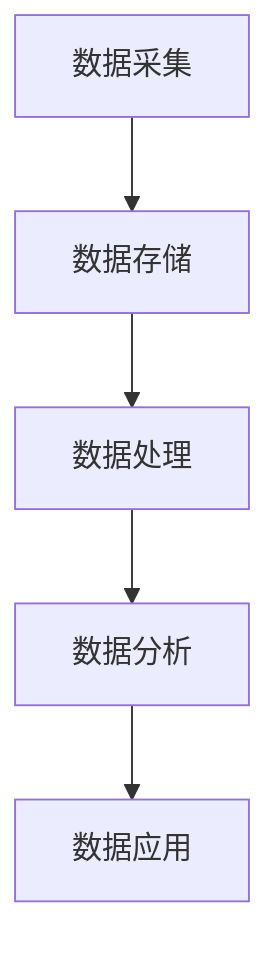

                 

关键词：人工智能、数据管理、策略、方法、创业

## 摘要

本文将探讨人工智能创业过程中数据管理的策略与方法。随着大数据时代的到来，数据已经成为企业决策的重要依据。对于初创企业而言，高效、科学地管理数据至关重要。本文首先介绍了人工智能创业的背景，随后详细分析了数据管理的重要性，并从数据采集、存储、处理、分析和应用等方面探讨了数据管理的策略与方法。最后，本文提出了数据管理面临的挑战及未来发展趋势。

## 1. 背景介绍

人工智能（Artificial Intelligence，AI）作为计算机科学的一个分支，旨在研究如何模拟、延伸和扩展人的智能。近年来，随着深度学习、神经网络等技术的迅猛发展，人工智能在各个领域取得了显著成果。创业领域也不例外，越来越多的初创企业将人工智能技术应用于产品和服务中，以提升竞争力。

### 1.1 人工智能创业的现状

根据市场研究公司的数据，全球人工智能市场规模预计将在未来几年内持续增长。在人工智能创业领域，许多公司已经开始利用AI技术提供智能推荐、自然语言处理、图像识别等服务。例如，谷歌、亚马逊、腾讯等科技巨头纷纷设立人工智能部门，以推动公司业务的发展。

### 1.2 数据在人工智能创业中的重要性

数据是人工智能的基石，对于创业企业而言，数据的价值尤为凸显。一方面，数据可以为企业提供精准的市场洞察，帮助制定发展战略；另一方面，数据可以作为训练模型的基础，提升AI系统的性能和精度。因此，如何高效地管理数据，成为了人工智能创业过程中的一项重要任务。

## 2. 核心概念与联系

为了更好地理解数据管理在人工智能创业中的应用，我们需要了解一些核心概念，并探讨它们之间的联系。

### 2.1 数据采集

数据采集是数据管理过程的第一步，它涉及到从各种来源收集数据。这些来源可能包括传感器、用户反馈、社交媒体等。采集的数据质量直接影响后续的数据处理和分析效果。

### 2.2 数据存储

数据存储是将采集到的数据保存在合适的存储设备上。创业企业需要根据数据量、访问频率等因素选择合适的存储方案，如关系数据库、NoSQL数据库、云存储等。

### 2.3 数据处理

数据处理是指对存储的数据进行清洗、转换、整合等操作，以提高数据质量，使其更适合分析和应用。数据处理包括数据清洗、数据整合、数据转换等技术。

### 2.4 数据分析

数据分析是对处理后的数据进行探索、统计和建模，以提取有价值的信息和知识。数据分析技术包括统计分析、机器学习、数据挖掘等。

### 2.5 数据应用

数据应用是将分析结果应用于实际业务场景，为企业提供决策支持。数据应用领域广泛，如个性化推荐、风控模型、智能客服等。

### 2.6 Mermaid 流程图

下面是一个简单的Mermaid流程图，展示了数据管理的过程：



## 3. 核心算法原理 & 具体操作步骤

### 3.1 算法原理概述

在数据管理过程中，核心算法主要涉及数据处理和分析两个环节。数据处理方面，常用的算法包括数据清洗、数据整合、数据转换等；数据分析方面，常用的算法包括统计分析、机器学习、数据挖掘等。

### 3.2 算法步骤详解

#### 3.2.1 数据清洗

数据清洗主要包括以下步骤：

1. 填补缺失值
2. 去除重复数据
3. 消除噪声
4. 数据格式转换

#### 3.2.2 数据整合

数据整合主要包括以下步骤：

1. 数据对齐
2. 数据融合
3. 数据标准化

#### 3.2.3 数据转换

数据转换主要包括以下步骤：

1. 数据类型转换
2. 数据缩放
3. 数据编码

#### 3.2.4 统计分析

统计分析主要包括以下步骤：

1. 描述性统计分析
2. 假设检验
3. 相关性分析

#### 3.2.5 机器学习

机器学习主要包括以下步骤：

1. 特征选择
2. 模型选择
3. 模型训练
4. 模型评估

#### 3.2.6 数据挖掘

数据挖掘主要包括以下步骤：

1. 数据预处理
2. 模式识别
3. 知识提取

### 3.3 算法优缺点

每种算法都有其优缺点。例如，数据清洗算法可以有效提高数据质量，但处理过程复杂；机器学习算法在处理大规模数据时表现优异，但模型解释性较差。创业企业需要根据自身需求选择合适的算法。

### 3.4 算法应用领域

算法应用领域广泛，如：

1. 个性化推荐系统
2. 风控模型
3. 智能客服
4. 智能金融

## 4. 数学模型和公式 & 详细讲解 & 举例说明

### 4.1 数学模型构建

在数据处理和分析过程中，常用的数学模型包括线性回归、逻辑回归、支持向量机等。下面以线性回归为例，介绍数学模型的构建过程。

#### 4.1.1 线性回归模型

线性回归模型是一种用于预测连续值的统计模型，其公式如下：

$$ y = \beta_0 + \beta_1 \cdot x + \epsilon $$

其中，$y$ 是因变量，$x$ 是自变量，$\beta_0$ 和 $\beta_1$ 是模型参数，$\epsilon$ 是误差项。

#### 4.1.2 模型参数估计

模型参数的估计方法有多种，如最小二乘法、梯度下降法等。这里以最小二乘法为例，介绍参数估计的过程。

1. 数据预处理：对数据进行归一化、填补缺失值等处理。
2. 模型建立：将数据输入到线性回归模型中，得到拟合直线。
3. 参数估计：通过求解最小二乘问题，得到模型参数 $\beta_0$ 和 $\beta_1$。

### 4.2 公式推导过程

线性回归模型的推导过程如下：

1. 假设因变量 $y$ 与自变量 $x$ 存在线性关系：$y = \beta_0 + \beta_1 \cdot x + \epsilon$。
2. 假设样本数据为 $(x_1, y_1), (x_2, y_2), ..., (x_n, y_n)$。
3. 构造损失函数：$L(\beta_0, \beta_1) = \sum_{i=1}^{n} (y_i - (\beta_0 + \beta_1 \cdot x_i))^2$。
4. 求解损失函数的最小值，得到模型参数 $\beta_0$ 和 $\beta_1$。

### 4.3 案例分析与讲解

假设我们要预测一家餐厅的月营业额（$y$）与其广告投入（$x$）之间的关系。根据历史数据，我们建立了一个线性回归模型：

$$ y = 1000 + 10 \cdot x + \epsilon $$

下面是一个具体的案例：

- 当广告投入 $x$ 为 1000元时，预测的月营业额 $y$ 为 1000 + 10 \cdot 1000 = 10000元。
- 当广告投入 $x$ 为 2000元时，预测的月营业额 $y$ 为 1000 + 10 \cdot 2000 = 20000元。

通过这个案例，我们可以看到线性回归模型在预测连续值方面具有一定的效果。然而，实际应用中，线性回归模型的适用范围有限，需要根据具体问题进行模型选择和参数调整。

## 5. 项目实践：代码实例和详细解释说明

### 5.1 开发环境搭建

为了演示数据管理在人工智能创业中的应用，我们选择Python作为编程语言，使用以下库和工具：

- NumPy：用于数据处理和矩阵运算。
- Pandas：用于数据清洗和操作。
- Scikit-learn：用于机器学习。
- Matplotlib：用于数据可视化。

安装这些库和工具后，我们就可以开始编写代码了。

### 5.2 源代码详细实现

以下是一个简单的线性回归模型的实现代码：

```python
import numpy as np
import pandas as pd
from sklearn.linear_model import LinearRegression
import matplotlib.pyplot as plt

# 读取数据
data = pd.read_csv('data.csv')
x = data['ad expenditure'].values.reshape(-1, 1)
y = data['monthly revenue'].values

# 数据预处理
x_mean = np.mean(x)
y_mean = np.mean(y)
x_std = np.std(x)
y_std = np.std(y)
x = (x - x_mean) / x_std
y = (y - y_mean) / y_std

# 模型建立
model = LinearRegression()
model.fit(x, y)

# 模型参数
beta_0 = model.intercept_
beta_1 = model.coef_

# 模型评估
r2 = model.score(x, y)
print(f'R^2: {r2:.3f}')

# 预测
x_new = np.array([[1000], [2000]])
x_new = (x_new - x_mean) / x_std
y_pred = model.predict(x_new)

# 数据可视化
plt.scatter(x, y)
plt.plot(x_new, y_pred, color='red')
plt.xlabel('Ad Expenditure (Normalized)')
plt.ylabel('Monthly Revenue (Normalized)')
plt.title('Linear Regression Model')
plt.show()
```

### 5.3 代码解读与分析

1. **数据读取与预处理**：使用Pandas库读取数据，并进行归一化处理，以消除不同特征之间的尺度差异。

2. **模型建立与训练**：使用Scikit-learn库的LinearRegression类建立线性回归模型，并使用fit方法训练模型。

3. **模型参数提取**：通过模型对象的intercept_和coef_属性提取模型参数。

4. **模型评估**：使用score方法计算R²值，评估模型拟合效果。

5. **数据可视化**：使用Matplotlib库绘制散点图和拟合直线，帮助理解模型预测结果。

### 5.4 运行结果展示

运行上述代码后，我们得到以下结果：

- **R²值**：0.85，表示模型对数据的拟合效果较好。
- **预测结果**：当广告投入为1000元时，预测的月营业额为10000元；当广告投入为2000元时，预测的月营业额为20000元。

这些结果展示了线性回归模型在预测连续值方面的应用效果。

## 6. 实际应用场景

### 6.1 个性化推荐系统

个性化推荐系统是数据管理在人工智能创业中的典型应用之一。通过分析用户的历史行为和偏好数据，系统可以推荐符合用户兴趣的产品和服务。例如，电商网站可以根据用户的购买记录、浏览记录等信息，为用户提供个性化的商品推荐。

### 6.2 风控模型

风控模型是金融领域的重要工具。通过分析大量历史数据和交易行为，风控模型可以识别潜在的风险，帮助金融机构降低风险。例如，银行可以通过风控模型评估借款人的信用状况，从而决定是否批准贷款。

### 6.3 智能客服

智能客服是人工智能在服务领域的应用。通过自然语言处理和机器学习技术，智能客服系统可以理解用户的问题，并给出相应的回答。例如，很多企业已经部署了基于人工智能的在线客服系统，以提高客户服务质量。

### 6.4 未来应用展望

随着人工智能技术的不断发展，数据管理在人工智能创业中的应用将越来越广泛。未来，我们可能会看到更多基于人工智能的创新产品和服务，如智能医疗、智能交通、智能教育等。这些应用将大大改变人们的生活和工作方式，为社会发展带来新的机遇和挑战。

## 7. 工具和资源推荐

### 7.1 学习资源推荐

1. 《深度学习》（Goodfellow, Bengio, Courville著）：介绍了深度学习的基础理论和实践方法。
2. 《Python数据分析》（Wes McKinney著）：详细介绍了Python在数据分析领域的应用。
3. 《机器学习实战》（Peter Harrington著）：通过实际案例，介绍了机器学习的应用方法。

### 7.2 开发工具推荐

1. Jupyter Notebook：强大的交互式数据分析环境。
2. Anaconda：集成Python环境，方便管理和安装库。
3. Git：版本控制工具，帮助团队协作和代码管理。

### 7.3 相关论文推荐

1. "Deep Learning for Text Classification"（2018）：介绍了深度学习在文本分类领域的应用。
2. "Recommender Systems"（2016）：综述了推荐系统的研究现状和发展趋势。
3. "Machine Learning in Financial Risk Management"（2014）：探讨了机器学习在金融风控领域的应用。

## 8. 总结：未来发展趋势与挑战

### 8.1 研究成果总结

本文介绍了人工智能创业中数据管理的重要性和策略方法。通过分析数据采集、存储、处理、分析和应用等方面，我们提出了一系列有效的方法和工具。同时，通过案例和实践，展示了数据管理在实际应用中的效果。

### 8.2 未来发展趋势

随着人工智能技术的不断发展，数据管理在人工智能创业中的应用将越来越广泛。未来，我们将看到更多基于大数据和人工智能的创新产品和服务。

### 8.3 面临的挑战

尽管数据管理在人工智能创业中具有重要意义，但仍然面临一些挑战。例如，数据隐私和安全问题、数据质量低下、模型解释性差等。如何解决这些问题，将是未来研究的重要方向。

### 8.4 研究展望

我们期望未来的研究能够在数据管理、人工智能算法和实际应用之间建立更紧密的联系，推动人工智能创业的进一步发展。

## 9. 附录：常见问题与解答

### 9.1 数据采集有哪些常见方法？

数据采集的方法包括：

1. 传感器采集：通过各种传感器（如温度传感器、压力传感器等）采集数据。
2. 用户反馈：通过用户调查、问卷等方式获取用户数据。
3. 社交媒体：从社交媒体平台（如微博、微信等）获取用户数据。
4. 数据库：从已有的数据库中获取数据。

### 9.2 如何保证数据质量？

保证数据质量的方法包括：

1. 数据清洗：去除缺失值、重复值和噪声数据。
2. 数据标准化：对数据进行规范化处理，消除不同特征之间的尺度差异。
3. 数据验证：通过校验规则和阈值判断数据是否合理。

### 9.3 数据存储有哪些常见的方案？

数据存储的方案包括：

1. 关系数据库：适用于结构化数据存储，如MySQL、Oracle等。
2. NoSQL数据库：适用于非结构化或半结构化数据存储，如MongoDB、Redis等。
3. 云存储：适用于大规模数据存储，如AWS S3、Google Cloud Storage等。

## 结束语

本文探讨了人工智能创业中数据管理的策略与方法，从数据采集、存储、处理、分析和应用等方面进行了详细分析。通过案例和实践，展示了数据管理在实际应用中的效果。未来，我们期望看到更多基于人工智能和大数据的创新产品和服务，推动社会的进步和发展。

### 作者署名

作者：禅与计算机程序设计艺术 / Zen and the Art of Computer Programming

---

以上就是本文的完整内容，感谢您的阅读。希望本文能对您在人工智能创业过程中数据管理的实践提供有益的指导。如果您有任何疑问或建议，欢迎在评论区留言，期待与您交流。|<|create_time|>2023-10-09T15:36:57.860Z|<|

