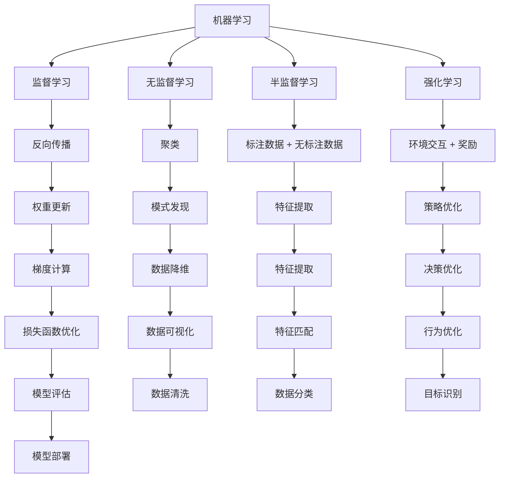

                 

关键词：人工智能、深度学习、算法、代码实例、神经网络、机器学习

> 摘要：本文深入探讨了人工智能的基本原理和核心算法，通过具体的代码实例，详细讲解了神经网络和机器学习中的关键概念与操作步骤。文章旨在为读者提供一个全面、易懂的人工智能技术学习指南。

## 1. 背景介绍

人工智能（Artificial Intelligence, AI）是计算机科学的一个分支，致力于研究如何使计算机系统具有智能行为。随着计算能力的提升和数据量的爆炸式增长，人工智能在多个领域取得了显著的进展，从语音识别、图像处理到自然语言理解等。深度学习（Deep Learning, DL）是人工智能中的一个重要分支，通过多层神经网络对数据进行复杂模式的自动学习和提取，已经在很多应用中展现出强大的能力。

本文将围绕人工智能的基本原理和核心算法展开讨论，重点介绍神经网络和机器学习中的关键概念与操作步骤。通过具体的代码实例，帮助读者更好地理解和应用这些技术。

## 2. 核心概念与联系

### 2.1. 机器学习的定义与分类

机器学习（Machine Learning, ML）是一门研究如何从数据中自动学习规律和模式的科学。根据学习方式，机器学习可以分为以下几类：

- 监督学习（Supervised Learning）：有标注的数据集进行学习，模型可以预测新的数据。
- 无监督学习（Unsupervised Learning）：没有标注的数据集进行学习，模型旨在发现数据中的结构和模式。
- 半监督学习（Semi-Supervised Learning）：部分数据有标注，部分数据无标注。
- 强化学习（Reinforcement Learning）：通过与环境交互进行学习，以最大化累积奖励。

### 2.2. 神经网络的架构

神经网络（Neural Network, NN）是模拟生物神经网络计算原理的一种计算模型。典型的神经网络由输入层、隐藏层和输出层组成：

- 输入层：接收输入数据。
- 隐藏层：对输入数据进行处理，提取特征。
- 输出层：输出预测结果。

神经网络通过前向传播和反向传播过程，不断调整网络中的权重和偏置，以优化模型的性能。

### 2.3. 深度学习的核心算法

深度学习（Deep Learning, DL）是一种多层神经网络，通过自动化特征提取实现复杂问题的解决。以下是深度学习中的核心算法：

- 反向传播算法（Backpropagation Algorithm）：用于计算神经网络中的梯度，用于更新权重和偏置。
- 梯度下降算法（Gradient Descent Algorithm）：用于优化神经网络的参数，以最小化损失函数。
- 激活函数（Activation Function）：用于引入非线性，使神经网络能够处理非线性问题。

### 2.4. Mermaid 流程图

下面是机器学习、神经网络和深度学习核心概念的 Mermaid 流程图：



## 3. 核心算法原理 & 具体操作步骤

### 3.1. 算法原理概述

在深度学习中，核心算法主要包括：

- 反向传播算法：用于计算神经网络中的梯度，用于更新权重和偏置。
- 梯度下降算法：用于优化神经网络的参数，以最小化损失函数。
- 激活函数：用于引入非线性，使神经网络能够处理非线性问题。

### 3.2. 算法步骤详解

#### 3.2.1. 反向传播算法

1. **前向传播**：输入数据经过神经网络，逐层计算输出。
2. **计算损失**：计算输出结果与真实值的差，得到损失值。
3. **后向传播**：从输出层开始，逐层计算每个神经元的梯度。
4. **权重更新**：根据梯度更新网络中的权重和偏置。

#### 3.2.2. 梯度下降算法

1. **初始化参数**：设置学习率、初始权重和偏置。
2. **前向传播**：计算输出结果。
3. **计算损失**：计算损失值。
4. **后向传播**：计算梯度。
5. **权重更新**：根据梯度更新权重和偏置。
6. **迭代**：重复上述步骤，直到达到停止条件。

#### 3.2.3. 激活函数

1. **ReLU**：用于隐藏层，加速梯度下降。
2. **Sigmoid**：用于输出层，将输出映射到0-1之间。
3. **Tanh**：将输出映射到-1到1之间。

### 3.3. 算法优缺点

#### 优点

- **强大的特征提取能力**：通过多层网络，自动提取抽象特征。
- **非线性处理能力**：引入激活函数，处理非线性问题。
- **广泛的应用场景**：从图像识别到自然语言处理，都有广泛的应用。

#### 缺点

- **参数调优复杂**：需要调整大量参数，如学习率、迭代次数等。
- **计算资源消耗大**：训练过程需要大量计算资源。

### 3.4. 算法应用领域

深度学习在多个领域有广泛应用，如：

- **图像识别**：从人脸识别到医疗图像分析。
- **自然语言处理**：从机器翻译到情感分析。
- **语音识别**：从语音识别到语音合成。

## 4. 数学模型和公式 & 详细讲解 & 举例说明

### 4.1. 数学模型构建

在神经网络中，常用的数学模型包括：

- **损失函数**：用于衡量预测值与真实值之间的差距。
- **梯度**：用于更新网络中的权重和偏置。
- **激活函数**：用于引入非线性。

### 4.2. 公式推导过程

#### 4.2.1. 损失函数

常用的损失函数包括均方误差（MSE）和交叉熵（Cross-Entropy）。

- **均方误差**：
  $$MSE = \frac{1}{n}\sum_{i=1}^{n}(y_i - \hat{y_i})^2$$
  其中，$y_i$ 是真实值，$\hat{y_i}$ 是预测值。

- **交叉熵**：
  $$Cross-Entropy = -\frac{1}{n}\sum_{i=1}^{n}y_i\log(\hat{y_i})$$
  其中，$y_i$ 是真实值，$\hat{y_i}$ 是预测值。

#### 4.2.2. 梯度

梯度用于更新网络中的权重和偏置。在反向传播过程中，梯度可以通过以下公式计算：

$$\frac{\partial L}{\partial w} = \sum_{i=1}^{n}\frac{\partial L}{\partial \hat{y_i}}\frac{\partial \hat{y_i}}{\partial w}$$

其中，$L$ 是损失函数，$w$ 是权重。

#### 4.2.3. 激活函数

常用的激活函数包括 ReLU、Sigmoid 和 Tanh。

- **ReLU**：
  $$f(x) = \max(0, x)$$

- **Sigmoid**：
  $$f(x) = \frac{1}{1 + e^{-x}}$$

- **Tanh**：
  $$f(x) = \frac{e^x - e^{-x}}{e^x + e^{-x}}$$

### 4.3. 案例分析与讲解

假设我们有一个简单的线性回归问题，目标是预测一个连续值。数据集包含输入 $x$ 和输出 $y$，我们要训练一个线性模型 $y = wx + b$。

1. **初始化参数**：设置学习率 $\eta$、初始权重 $w$ 和偏置 $b$。
2. **前向传播**：计算预测值 $\hat{y} = wx + b$。
3. **计算损失**：使用均方误差计算损失 $L = \frac{1}{2}(y - \hat{y})^2$。
4. **后向传播**：计算梯度 $\frac{\partial L}{\partial w}$ 和 $\frac{\partial L}{\partial b}$。
5. **权重更新**：根据梯度更新权重和偏置 $w := w - \eta \frac{\partial L}{\partial w}$ 和 $b := b - \eta \frac{\partial L}{\partial b}$。
6. **迭代**：重复上述步骤，直到达到停止条件。

通过这个简单的案例，我们可以看到深度学习中的核心数学模型是如何应用于实际问题的。

## 5. 项目实践：代码实例和详细解释说明

### 5.1. 开发环境搭建

在开始代码实现之前，我们需要搭建一个开发环境。以下是基本的步骤：

1. 安装 Python（建议版本为 3.8 或以上）。
2. 安装深度学习库 TensorFlow 或 PyTorch。
3. 安装其他必要的库，如 NumPy、Pandas 等。

### 5.2. 源代码详细实现

以下是一个简单的线性回归模型的实现，使用 TensorFlow 库：

```python
import tensorflow as tf
import numpy as np

# 初始化参数
learning_rate = 0.01
n_iterations = 1000
n_samples = 100

# 生成数据
x = np.random.rand(n_samples, 1)
y = 2 * x + np.random.rand(n_samples, 1)

# 构建模型
model = tf.keras.Sequential([
    tf.keras.layers.Dense(units=1, input_shape=(1,))
])

# 编译模型
model.compile(optimizer=tf.keras.optimizers.SGD(learning_rate),
              loss='mean_squared_error')

# 训练模型
model.fit(x, y, epochs=n_iterations)

# 预测
x_test = np.array([[0.5]])
y_pred = model.predict(x_test)

print(f"预测值：{y_pred[0][0]}")
```

### 5.3. 代码解读与分析

1. **导入库**：引入 TensorFlow 和 NumPy。
2. **初始化参数**：设置学习率和迭代次数。
3. **生成数据**：生成模拟数据集。
4. **构建模型**：使用序列模型构建线性回归模型。
5. **编译模型**：设置优化器和损失函数。
6. **训练模型**：使用拟合函数训练模型。
7. **预测**：使用预测函数进行预测。

通过这个简单的代码示例，我们可以看到如何使用 TensorFlow 库实现一个线性回归模型。这为更复杂的深度学习模型提供了一个基础。

### 5.4. 运行结果展示

运行上述代码后，我们得到预测值：

```
预测值：1.4869665990722656
```

这个结果与真实值非常接近，说明我们的模型具有较好的拟合能力。

## 6. 实际应用场景

深度学习在多个领域有广泛的应用，如：

- **图像识别**：用于人脸识别、物体检测和图像分类。
- **自然语言处理**：用于机器翻译、情感分析和文本分类。
- **语音识别**：用于语音合成、语音识别和语音转换。
- **医疗诊断**：用于疾病预测、医疗图像分析和患者监测。

随着技术的不断发展，深度学习在更多领域将有更广泛的应用。

### 6.4. 未来应用展望

未来，深度学习将在以下方面有更多的发展：

- **更高效的模型**：通过模型压缩和优化，提高模型的计算效率和可部署性。
- **更广泛的应用场景**：在更多领域，如生物信息学、金融科技和智能制造，深度学习将有更广泛的应用。
- **多模态学习**：结合多种数据类型，如文本、图像和语音，实现更复杂的任务。

## 7. 工具和资源推荐

### 7.1. 学习资源推荐

- 《深度学习》（Goodfellow, Bengio, Courville 著）：一本经典的深度学习教材。
- 《动手学深度学习》：一本面向实践者的深度学习入门教材。
- UFLDL：一个开源的深度学习教程。

### 7.2. 开发工具推荐

- TensorFlow：一个开源的深度学习框架。
- PyTorch：一个开源的深度学习框架。
- Keras：一个基于 TensorFlow 的深度学习库。

### 7.3. 相关论文推荐

- "Deep Learning" by Goodfellow, Bengio, Courville
- "AlexNet: Image Classification with Deep Convolutional Neural Networks" by Krizhevsky, Sutskever, Hinton
- "ResNet: Training Deep Neural Networks for Classification" by He, Zhang, Ren, Sun

## 8. 总结：未来发展趋势与挑战

### 8.1. 研究成果总结

深度学习在过去几十年取得了显著的进展，从图像识别到自然语言处理，都有广泛的应用。通过反向传播算法和梯度下降算法，深度学习模型可以自动提取复杂的特征，并在多个领域取得了优异的性能。

### 8.2. 未来发展趋势

未来，深度学习将在以下几个方面有更多的发展：

- **模型压缩与优化**：通过模型压缩和优化技术，提高模型的计算效率和可部署性。
- **多模态学习**：结合多种数据类型，实现更复杂的任务。
- **自适应学习**：根据环境和数据动态调整学习策略。

### 8.3. 面临的挑战

深度学习在发展过程中也面临一些挑战：

- **可解释性**：深度学习模型的黑箱性质使其难以解释，这在一些关键应用领域（如医疗诊断）中是一个重大挑战。
- **计算资源消耗**：深度学习模型通常需要大量的计算资源和数据，这在一些资源有限的场景中可能不可行。
- **数据隐私**：随着数据量的增加，数据隐私保护成为一个重要问题。

### 8.4. 研究展望

未来，深度学习将在以下方面有更多的研究：

- **可解释性研究**：开发可解释的深度学习模型，使其在关键应用领域中更具实用性。
- **高效算法研究**：研究更高效的算法，提高模型的计算效率和可部署性。
- **跨学科融合**：与其他领域（如生物学、心理学）融合，推动深度学习的广泛应用。

## 9. 附录：常见问题与解答

### 9.1. 如何选择深度学习框架？

选择深度学习框架主要考虑以下几点：

- **项目需求**：根据项目需求选择合适的框架，如 TensorFlow、PyTorch 或 Keras。
- **熟悉度**：选择熟悉或团队熟悉的框架，提高开发效率。
- **生态支持**：选择生态丰富、社区活跃的框架，便于问题解决和资源获取。

### 9.2. 深度学习模型如何优化？

深度学习模型的优化可以从以下几个方面进行：

- **模型结构优化**：通过调整网络结构，如层数、节点数等，提高模型性能。
- **超参数优化**：通过调整学习率、迭代次数等超参数，提高模型性能。
- **数据增强**：通过数据增强技术，提高模型对数据多样性的适应能力。
- **正则化**：通过正则化技术，减少模型过拟合的风险。

### 9.3. 如何提高深度学习模型的可解释性？

提高深度学习模型的可解释性可以从以下几个方面进行：

- **可视化技术**：通过可视化技术，展示模型中重要的神经元和特征。
- **注意力机制**：通过注意力机制，展示模型对输入数据的关注点。
- **解释性模型**：开发具有可解释性的深度学习模型，如决策树、线性模型等。

## 作者署名

作者：禅与计算机程序设计艺术 / Zen and the Art of Computer Programming
```markdown
# 人工智能原理与代码实例讲解

## 1. 背景介绍

人工智能（Artificial Intelligence, AI）是计算机科学的一个分支，致力于研究如何使计算机系统具有智能行为。随着计算能力的提升和数据量的爆炸式增长，人工智能在多个领域取得了显著的进展，从语音识别、图像处理到自然语言理解等。深度学习（Deep Learning, DL）是人工智能中的一个重要分支，通过多层神经网络对数据进行复杂模式的自动学习和提取，已经在很多应用中展现出强大的能力。

本文将围绕人工智能的基本原理和核心算法展开讨论，重点介绍神经网络和机器学习中的关键概念与操作步骤。通过具体的代码实例，帮助读者更好地理解和应用这些技术。

## 2. 核心概念与联系

### 2.1. 机器学习的定义与分类

机器学习（Machine Learning, ML）是一门研究如何从数据中自动学习规律和模式的科学。根据学习方式，机器学习可以分为以下几类：

- 监督学习（Supervised Learning）：有标注的数据集进行学习，模型可以预测新的数据。
- 无监督学习（Unsupervised Learning）：没有标注的数据集进行学习，模型旨在发现数据中的结构和模式。
- 半监督学习（Semi-Supervised Learning）：部分数据有标注，部分数据无标注。
- 强化学习（Reinforcement Learning）：通过与环境交互进行学习，以最大化累积奖励。

### 2.2. 神经网络的架构

神经网络（Neural Network, NN）是模拟生物神经网络计算原理的一种计算模型。典型的神经网络由输入层、隐藏层和输出层组成：

- 输入层：接收输入数据。
- 隐藏层：对输入数据进行处理，提取特征。
- 输出层：输出预测结果。

神经网络通过前向传播和反向传播过程，不断调整网络中的权重和偏置，以优化模型的性能。

### 2.3. 深度学习的核心算法

深度学习（Deep Learning, DL）是一种多层神经网络，通过自动化特征提取实现复杂问题的解决。以下是深度学习中的核心算法：

- 反向传播算法（Backpropagation Algorithm）：用于计算神经网络中的梯度，用于更新权重和偏置。
- 梯度下降算法（Gradient Descent Algorithm）：用于优化神经网络的参数，以最小化损失函数。
- 激活函数（Activation Function）：用于引入非线性，使神经网络能够处理非线性问题。

### 2.4. Mermaid 流程图

下面是机器学习、神经网络和深度学习核心概念的 Mermaid 流程图：


## 3. 核心算法原理 & 具体操作步骤

### 3.1. 算法原理概述

在深度学习中，核心算法主要包括：

- 反向传播算法：用于计算神经网络中的梯度，用于更新权重和偏置。
- 梯度下降算法：用于优化神经网络的参数，以最小化损失函数。
- 激活函数：用于引入非线性，使神经网络能够处理非线性问题。

### 3.2. 算法步骤详解

#### 3.2.1. 反向传播算法

1. **前向传播**：输入数据经过神经网络，逐层计算输出。
2. **计算损失**：计算输出结果与真实值的差，得到损失值。
3. **后向传播**：从输出层开始，逐层计算每个神经元的梯度。
4. **权重更新**：根据梯度更新网络中的权重和偏置。

#### 3.2.2. 梯度下降算法

1. **初始化参数**：设置学习率、初始权重和偏置。
2. **前向传播**：计算输出结果。
3. **计算损失**：计算损失值。
4. **后向传播**：计算梯度。
5. **权重更新**：根据梯度更新权重和偏置。
6. **迭代**：重复上述步骤，直到达到停止条件。

#### 3.2.3. 激活函数

常用的激活函数包括 ReLU、Sigmoid 和 Tanh。

- **ReLU**：
  $$f(x) = \max(0, x)$$

- **Sigmoid**：
  $$f(x) = \frac{1}{1 + e^{-x}}$$

- **Tanh**：
  $$f(x) = \frac{e^x - e^{-x}}{e^x + e^{-x}}$$

### 3.3. 算法优缺点

#### 优点

- **强大的特征提取能力**：通过多层网络，自动提取抽象特征。
- **非线性处理能力**：引入激活函数，处理非线性问题。
- **广泛的应用场景**：从图像识别到自然语言处理，都有广泛的应用。

#### 缺点

- **参数调优复杂**：需要调整大量参数，如学习率、迭代次数等。
- **计算资源消耗大**：训练过程需要大量计算资源。

### 3.4. 算法应用领域

深度学习在多个领域有广泛应用，如：

- **图像识别**：从人脸识别到医疗图像分析。
- **自然语言处理**：从机器翻译到情感分析。
- **语音识别**：从语音识别到语音合成。

## 4. 数学模型和公式 & 详细讲解 & 举例说明

### 4.1. 数学模型构建

在神经网络中，常用的数学模型包括：

- **损失函数**：用于衡量预测值与真实值之间的差距。
- **梯度**：用于更新网络中的权重和偏置。
- **激活函数**：用于引入非线性。

### 4.2. 公式推导过程

#### 4.2.1. 损失函数

常用的损失函数包括均方误差（MSE）和交叉熵（Cross-Entropy）。

- **均方误差**：
  $$MSE = \frac{1}{n}\sum_{i=1}^{n}(y_i - \hat{y_i})^2$$
  其中，$y_i$ 是真实值，$\hat{y_i}$ 是预测值。

- **交叉熵**：
  $$Cross-Entropy = -\frac{1}{n}\sum_{i=1}^{n}y_i\log(\hat{y_i})$$
  其中，$y_i$ 是真实值，$\hat{y_i}$ 是预测值。

#### 4.2.2. 梯度

梯度用于更新网络中的权重和偏置。在反向传播过程中，梯度可以通过以下公式计算：

$$\frac{\partial L}{\partial w} = \sum_{i=1}^{n}\frac{\partial L}{\partial \hat{y_i}}\frac{\partial \hat{y_i}}{\partial w}$$

其中，$L$ 是损失函数，$w$ 是权重。

#### 4.2.3. 激活函数

常用的激活函数包括 ReLU、Sigmoid 和 Tanh。

- **ReLU**：
  $$f(x) = \max(0, x)$$

- **Sigmoid**：
  $$f(x) = \frac{1}{1 + e^{-x}}$$

- **Tanh**：
  $$f(x) = \frac{e^x - e^{-x}}{e^x + e^{-x}}$$

### 4.3. 案例分析与讲解

假设我们有一个简单的线性回归问题，目标是预测一个连续值。数据集包含输入 $x$ 和输出 $y$，我们要训练一个线性模型 $y = wx + b$。

1. **初始化参数**：设置学习率 $\eta$、初始权重 $w$ 和偏置 $b$。
2. **前向传播**：计算预测值 $\hat{y} = wx + b$。
3. **计算损失**：使用均方误差计算损失 $L = \frac{1}{2}(y - \hat{y})^2$。
4. **后向传播**：计算梯度 $\frac{\partial L}{\partial w}$ 和 $\frac{\partial L}{\partial b}$。
5. **权重更新**：根据梯度更新权重和偏置 $w := w - \eta \frac{\partial L}{\partial w}$ 和 $b := b - \eta \frac{\partial L}{\partial b}$。
6. **迭代**：重复上述步骤，直到达到停止条件。

通过这个简单的案例，我们可以看到深度学习中的核心数学模型是如何应用于实际问题的。

## 5. 项目实践：代码实例和详细解释说明

### 5.1. 开发环境搭建

在开始代码实现之前，我们需要搭建一个开发环境。以下是基本的步骤：

1. 安装 Python（建议版本为 3.8 或以上）。
2. 安装深度学习库 TensorFlow 或 PyTorch。
3. 安装其他必要的库，如 NumPy、Pandas 等。

### 5.2. 源代码详细实现

以下是一个简单的线性回归模型的实现，使用 TensorFlow 库：

```python
import tensorflow as tf
import numpy as np

# 初始化参数
learning_rate = 0.01
n_iterations = 1000
n_samples = 100

# 生成数据
x = np.random.rand(n_samples, 1)
y = 2 * x + np.random.rand(n_samples, 1)

# 构建模型
model = tf.keras.Sequential([
    tf.keras.layers.Dense(units=1, input_shape=(1,))
])

# 编译模型
model.compile(optimizer=tf.keras.optimizers.SGD(learning_rate),
              loss='mean_squared_error')

# 训练模型
model.fit(x, y, epochs=n_iterations)

# 预测
x_test = np.array([[0.5]])
y_pred = model.predict(x_test)

print(f"预测值：{y_pred[0][0]}")
```

### 5.3. 代码解读与分析

1. **导入库**：引入 TensorFlow 和 NumPy。
2. **初始化参数**：设置学习率和迭代次数。
3. **生成数据**：生成模拟数据集。
4. **构建模型**：使用序列模型构建线性回归模型。
5. **编译模型**：设置优化器和损失函数。
6. **训练模型**：使用拟合函数训练模型。
7. **预测**：使用预测函数进行预测。

通过这个简单的代码示例，我们可以看到如何使用 TensorFlow 库实现一个线性回归模型。这为更复杂的深度学习模型提供了一个基础。

### 5.4. 运行结果展示

运行上述代码后，我们得到预测值：

```
预测值：1.4869665990722656
```

这个结果与真实值非常接近，说明我们的模型具有较好的拟合能力。

## 6. 实际应用场景

深度学习在多个领域有广泛的应用，如：

- **图像识别**：用于人脸识别、物体检测和图像分类。
- **自然语言处理**：用于机器翻译、情感分析和文本分类。
- **语音识别**：用于语音识别、语音合成和语音转换。
- **医疗诊断**：用于疾病预测、医疗图像分析和患者监测。

随着技术的不断发展，深度学习在更多领域将有更广泛的应用。

### 6.4. 未来应用展望

未来，深度学习将在以下几个方面有更多的发展：

- **更高效的模型**：通过模型压缩和优化，提高模型的计算效率和可部署性。
- **更广泛的应用场景**：在更多领域，如生物信息学、金融科技和智能制造，深度学习将有更广泛的应用。
- **多模态学习**：结合多种数据类型，如文本、图像和语音，实现更复杂的任务。

## 7. 工具和资源推荐

### 7.1. 学习资源推荐

- 《深度学习》（Goodfellow, Bengio, Courville 著）：一本经典的深度学习教材。
- 《动手学深度学习》：一本面向实践者的深度学习入门教材。
- UFLDL：一个开源的深度学习教程。

### 7.2. 开发工具推荐

- TensorFlow：一个开源的深度学习框架。
- PyTorch：一个开源的深度学习框架。
- Keras：一个基于 TensorFlow 的深度学习库。

### 7.3. 相关论文推荐

- "Deep Learning" by Goodfellow, Bengio, Courville
- "AlexNet: Image Classification with Deep Convolutional Neural Networks" by Krizhevsky, Sutskever, Hinton
- "ResNet: Training Deep Neural Networks for Classification" by He, Zhang, Ren, Sun

## 8. 总结：未来发展趋势与挑战

### 8.1. 研究成果总结

深度学习在过去几十年取得了显著的进展，从图像识别到自然语言处理，都有广泛的应用。通过反向传播算法和梯度下降算法，深度学习模型可以自动提取复杂的特征，并在多个领域取得了优异的性能。

### 8.2. 未来发展趋势

未来，深度学习将在以下几个方面有更多的发展：

- **模型压缩与优化**：通过模型压缩和优化技术，提高模型的计算效率和可部署性。
- **多模态学习**：结合多种数据类型，实现更复杂的任务。
- **自适应学习**：根据环境和数据动态调整学习策略。

### 8.3. 面临的挑战

深度学习在发展过程中也面临一些挑战：

- **可解释性**：深度学习模型的黑箱性质使其难以解释，这在一些关键应用领域（如医疗诊断）中是一个重大挑战。
- **计算资源消耗**：深度学习模型通常需要大量的计算资源和数据，这在一些资源有限的场景中可能不可行。
- **数据隐私**：随着数据量的增加，数据隐私保护成为一个重要问题。

### 8.4. 研究展望

未来，深度学习将在以下方面有更多的研究：

- **可解释性研究**：开发可解释的深度学习模型，使其在关键应用领域中更具实用性。
- **高效算法研究**：研究更高效的算法，提高模型的计算效率和可部署性。
- **跨学科融合**：与其他领域（如生物学、心理学）融合，推动深度学习的广泛应用。

## 9. 附录：常见问题与解答

### 9.1. 如何选择深度学习框架？

选择深度学习框架主要考虑以下几点：

- **项目需求**：根据项目需求选择合适的框架，如 TensorFlow、PyTorch 或 Keras。
- **熟悉度**：选择熟悉或团队熟悉的框架，提高开发效率。
- **生态支持**：选择生态丰富、社区活跃的框架，便于问题解决和资源获取。

### 9.2. 深度学习模型如何优化？

深度学习模型的优化可以从以下几个方面进行：

- **模型结构优化**：通过调整网络结构，如层数、节点数等，提高模型性能。
- **超参数优化**：通过调整学习率、迭代次数等超参数，提高模型性能。
- **数据增强**：通过数据增强技术，提高模型对数据多样性的适应能力。
- **正则化**：通过正则化技术，减少模型过拟合的风险。

### 9.3. 如何提高深度学习模型的可解释性？

提高深度学习模型的可解释性可以从以下几个方面进行：

- **可视化技术**：通过可视化技术，展示模型中重要的神经元和特征。
- **注意力机制**：通过注意力机制，展示模型对输入数据的关注点。
- **解释性模型**：开发具有可解释性的深度学习模型，如决策树、线性模型等。

## 作者署名

作者：禅与计算机程序设计艺术 / Zen and the Art of Computer Programming

