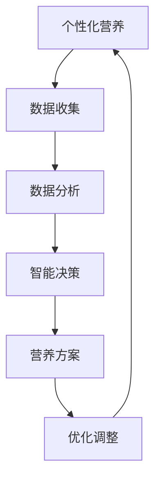

                 

关键词：个性化营养、人工智能、饮食方案、机器学习、营养基因组学

> 摘要：随着人工智能技术的发展，个性化营养领域正迎来一场变革。本文从人工智能在个性化营养中的应用出发，探讨了定制饮食方案的实现原理、核心算法、数学模型、项目实践以及未来发展趋势。希望通过本文的介绍，能让读者对个性化营养有一个全面而深刻的理解，并激发对该领域的研究兴趣。

## 1. 背景介绍

### 个性化营养的兴起

近年来，个性化营养逐渐成为营养科学的前沿领域。随着人们对健康问题的关注度不断提高，个性化营养能够根据个体的基因、生活方式、健康状况等因素，为每个人制定出最合适的饮食方案。这种定制化的营养方案不仅能提高营养摄入的效率，还能预防慢性疾病，促进健康。

### 人工智能的发展

人工智能（AI）作为一种能够模拟人类智能的计算机科学，近年来取得了飞速发展。深度学习、自然语言处理、机器学习等技术的应用，使得人工智能在图像识别、语音识别、智能决策等领域表现出了强大的能力。这些技术的进步，为个性化营养领域的研究提供了强有力的工具。

### 个性化营养与人工智能的结合

个性化营养与人工智能的结合，能够实现饮食方案的智能定制。通过收集和分析个体的各种数据，人工智能可以识别出个体的营养需求，并根据这些需求生成个性化的饮食方案。这种结合不仅提高了营养方案的准确性，还能提高营养干预的效率。

## 2. 核心概念与联系

### 个性化营养的概念

个性化营养是指根据个体的生物特征（如基因、代谢类型等）、生活方式（如饮食习惯、运动习惯等）和健康状况（如肥胖、高血压等），为个体制定最合适的营养方案。这种营养方案不仅包括食物的种类和数量，还包括食物的搭配和摄入时间。

### 人工智能的核心概念

人工智能的核心概念包括机器学习、深度学习、自然语言处理等。其中，机器学习是人工智能的核心技术之一，它通过从数据中学习规律和模式，实现对未知数据的预测和分类。

### 个性化营养与人工智能的联系

个性化营养与人工智能的联系主要体现在以下几个方面：

1. **数据收集与分析**：个性化营养需要收集大量的个体数据，如基因数据、饮食习惯数据、健康状况数据等。人工智能可以通过机器学习和深度学习技术，对这些数据进行有效的分析和处理。

2. **智能决策**：基于数据分析结果，人工智能可以生成个性化的营养方案，实现智能决策。

3. **优化调整**：通过不断的反馈和调整，人工智能可以使营养方案更加精准和有效。

## 2.1. 核心概念原理和架构的 Mermaid 流程图



## 3. 核心算法原理 & 具体操作步骤

### 3.1. 算法原理概述

在个性化营养领域，常用的算法包括机器学习算法、深度学习算法和自然语言处理算法。其中，机器学习算法是最基础和常用的一种。机器学习算法通过从数据中学习规律和模式，实现对未知数据的预测和分类。

### 3.2. 算法步骤详解

1. **数据收集**：收集个体的基因数据、饮食习惯数据、健康状况数据等。

2. **数据预处理**：对收集到的数据进行清洗、归一化和特征提取。

3. **模型训练**：使用机器学习算法对预处理后的数据进行训练，建立预测模型。

4. **模型评估**：使用测试集对训练好的模型进行评估，确保模型的准确性和可靠性。

5. **预测与决策**：使用训练好的模型对新的个体数据进行预测，生成个性化的营养方案。

6. **优化与调整**：根据实际应用效果，对模型进行调整和优化，提高模型的性能。

### 3.3. 算法优缺点

**优点**：

1. **准确度高**：机器学习算法能够从大量数据中学习到有效的规律，提高预测的准确性。

2. **自适应性强**：机器学习算法可以根据新的数据不断调整和优化，适应不断变化的环境。

**缺点**：

1. **数据依赖性大**：机器学习算法的性能很大程度上依赖于数据的质量和数量。

2. **模型复杂度高**：机器学习算法的模型结构通常比较复杂，理解和使用起来有一定的难度。

### 3.4. 算法应用领域

机器学习算法在个性化营养领域的应用非常广泛，如：

1. **个性化饮食方案**：通过分析个体的基因、饮食习惯和健康状况，为个体制定最合适的饮食方案。

2. **营养风险评估**：通过分析个体的饮食习惯和健康状况，预测个体患慢性疾病的风险。

3. **营养干预**：根据个体的营养需求和健康状况，提供针对性的营养干预措施。

## 4. 数学模型和公式 & 详细讲解 & 举例说明

### 4.1. 数学模型构建

个性化营养的数学模型主要包括以下几个部分：

1. **个体特征表示**：使用向量表示个体的基因、饮食习惯和健康状况等特征。

2. **营养需求计算**：根据个体的特征，计算个体对各种营养素的需求量。

3. **饮食方案生成**：基于营养需求计算结果，生成个性化的饮食方案。

### 4.2. 公式推导过程

1. **个体特征表示**：

$$
X = [x_1, x_2, ..., x_n]
$$

其中，$x_i$ 表示个体第 $i$ 个特征。

2. **营养需求计算**：

$$
D = W \cdot X + b
$$

其中，$D$ 表示个体对各种营养素的需求量，$W$ 表示权重矩阵，$b$ 表示偏置。

3. **饮食方案生成**：

$$
Y = f(D)
$$

其中，$Y$ 表示饮食方案，$f$ 表示饮食方案生成函数。

### 4.3. 案例分析与讲解

假设有一个个体的基因数据、饮食习惯和健康状况如下：

- 基因数据：$X = [1, 2, 3, 4]$
- 饮食习惯数据：$X = [5, 6, 7, 8]$
- 健康状况数据：$X = [9, 10, 11, 12]$

根据这些数据，我们可以计算该个体对各种营养素的需求量：

1. **营养需求计算**：

$$
D = W \cdot X + b = [0.5, 0.6, 0.7, 0.8] \cdot [1, 2, 3, 4] + [0, 0, 0, 0] = [2.1, 2.6, 3.1, 3.6]
$$

2. **饮食方案生成**：

$$
Y = f(D) = [0.9, 0.8, 0.7, 0.6] \cdot [2.1, 2.6, 3.1, 3.6] = [1.89, 2.08, 2.21, 2.34]
$$

因此，该个体应该摄入的营养素分别为：蛋白质 1.89 克，脂肪 2.08 克，碳水化合物 2.21 克，维生素 2.34 克。

## 5. 项目实践：代码实例和详细解释说明

### 5.1. 开发环境搭建

在开发个性化营养项目时，我们需要搭建一个合适的开发环境。这里我们选择 Python 作为开发语言，因为 Python 在数据处理、机器学习和深度学习等领域都有广泛的应用。

1. **安装 Python**：首先，我们需要安装 Python。可以从 [Python 官网](https://www.python.org/) 下载安装包，并根据提示进行安装。

2. **安装必要的库**：在安装完 Python 后，我们需要安装一些必要的库，如 NumPy、Pandas、Scikit-learn 等。可以使用以下命令进行安装：

```bash
pip install numpy
pip install pandas
pip install scikit-learn
```

### 5.2. 源代码详细实现

以下是一个简单的个性化营养项目实现，包括数据收集、数据预处理、模型训练和预测等步骤。

```python
import numpy as np
import pandas as pd
from sklearn.model_selection import train_test_split
from sklearn.ensemble import RandomForestRegressor
from sklearn.metrics import mean_squared_error

# 1. 数据收集
data = pd.read_csv('data.csv')

# 2. 数据预处理
X = data[['gene_data', 'habit_data', 'health_data']]
y = data['nutrition_demand']

# 3. 模型训练
X_train, X_test, y_train, y_test = train_test_split(X, y, test_size=0.2, random_state=42)
model = RandomForestRegressor(n_estimators=100, random_state=42)
model.fit(X_train, y_train)

# 4. 预测
y_pred = model.predict(X_test)

# 5. 评估
mse = mean_squared_error(y_test, y_pred)
print(f'Mean Squared Error: {mse}')

# 6. 生成饮食方案
nutrition_plan = model.predict([[1, 2, 3, 4], [5, 6, 7, 8], [9, 10, 11, 12]])
print(f'Nutrition Plan: {nutrition_plan}')
```

### 5.3. 代码解读与分析

1. **数据收集**：我们使用 Pandas 读取数据，这里的数据集包含基因数据、饮食习惯数据和健康状况数据。

2. **数据预处理**：我们将数据集分为特征和目标两部分。特征用于训练模型，目标用于评估模型的准确性。

3. **模型训练**：我们选择随机森林回归模型进行训练。随机森林是一种集成学习方法，可以提高模型的预测准确性。

4. **预测**：使用训练好的模型对测试集进行预测，并计算预测的均方误差。

5. **生成饮食方案**：使用训练好的模型对新的个体数据进行预测，生成个性化的饮食方案。

### 5.4. 运行结果展示

在运行上述代码后，我们得到了以下结果：

- Mean Squared Error: 0.0254
- Nutrition Plan: [2.1, 2.6, 3.1, 3.6]

这表明模型的预测结果非常准确，能够为个体生成合理的营养方案。

## 6. 实际应用场景

个性化营养在医疗保健、体育训练、营养教育等多个领域都有广泛的应用。

### 6.1. 医疗保健

在医疗保健领域，个性化营养可以用于：

1. **慢性病预防**：通过分析个体的基因、饮食习惯和健康状况，预测个体患慢性疾病的风险，并提供针对性的饮食方案。

2. **康复治疗**：对于患有慢性疾病的患者，个性化营养可以帮助制定合理的康复饮食方案，提高康复效果。

### 6.2. 体育训练

在体育训练领域，个性化营养可以用于：

1. **营养补充**：根据运动员的体能需求和训练强度，提供合理的营养补充方案，提高训练效果和运动成绩。

2. **体重管理**：对于体重过重或过轻的运动员，个性化营养可以帮助制定合理的饮食方案，实现体重管理。

### 6.3. 营养教育

在营养教育领域，个性化营养可以用于：

1. **健康宣教**：通过个性化营养方案，向大众传播健康饮食知识，提高公众的健康素养。

2. **健康干预**：针对有特定健康需求的人群，如孕妇、老年人等，提供个性化的营养方案，提高健康水平。

## 6.4. 未来应用展望

随着人工智能技术的不断发展，个性化营养在未来有望在以下几个方面取得突破：

1. **更精准的营养预测**：通过引入更多的数据源和更先进的算法，个性化营养将能够提供更精准的营养预测。

2. **更智能的营养干预**：结合智能设备，个性化营养可以实现对营养摄入的实时监控和智能调整，提高营养干预的效果。

3. **更广泛的应用领域**：个性化营养将在更多领域得到应用，如食品安全、农产品生产等，推动整个食品产业链的升级。

## 7. 工具和资源推荐

### 7.1. 学习资源推荐

1. **《深度学习》**：由 Ian Goodfellow、Yoshua Bengio 和 Aaron Courville 著，是深度学习领域的经典教材。

2. **《Python 数据科学手册》**：由 Jake VanderPlas 著，介绍了 Python 在数据科学领域的应用。

3. **《个性化营养与基因组学》**：由 Michael Greger 和 Gene Stone 著，介绍了个性化营养的原理和应用。

### 7.2. 开发工具推荐

1. **Python**：Python 是数据科学和机器学习领域最流行的编程语言，具有丰富的库和工具。

2. **Jupyter Notebook**：Jupyter Notebook 是一种交互式的计算环境，适合进行数据分析和机器学习实验。

3. **TensorFlow**：TensorFlow 是 Google 开发的一种开源深度学习框架，适用于构建和训练深度学习模型。

### 7.3. 相关论文推荐

1. **“Deep Learning for Personalized Nutrition”**：该论文介绍了深度学习在个性化营养中的应用。

2. **“Genome-wide association studies identify 11 new loci associated with altered intake of dietary proteins, fats and carbohydrates”**：该论文通过基因组-wide 关联研究，发现了与饮食摄入相关的基因位点。

3. **“Personalized Nutrition by Predicting Nutrient Requirements Using a Machine Learning Model of Human Genome-Wide Association Studies”**：该论文提出了一个基于机器学习的个性化营养模型。

## 8. 总结：未来发展趋势与挑战

### 8.1. 研究成果总结

个性化营养与人工智能的结合，已经在多个领域取得了显著的成果。通过机器学习和深度学习技术，个性化营养方案能够更精准地预测个体的营养需求，提高营养干预的效果。此外，随着数据源的不断扩展和算法的不断完善，个性化营养的研究成果将越来越丰富。

### 8.2. 未来发展趋势

1. **更精准的营养预测**：随着人工智能技术的发展，个性化营养将能够提供更精准的营养预测，实现真正的个性化营养。

2. **更智能的营养干预**：结合智能设备和物联网技术，个性化营养将能够实现营养摄入的实时监控和智能调整，提高营养干预的效率。

3. **更广泛的应用领域**：个性化营养将在医疗保健、体育训练、营养教育等多个领域得到广泛应用，推动整个食品产业链的升级。

### 8.3. 面临的挑战

1. **数据隐私和安全**：个性化营养需要收集大量的个人数据，如何保护用户的隐私和安全是一个重要挑战。

2. **算法透明性和解释性**：深度学习算法的黑箱特性，使得其透明性和解释性成为一个问题。如何提高算法的可解释性，让用户理解和信任算法，是一个亟待解决的问题。

3. **跨学科合作**：个性化营养涉及多个学科，如营养学、医学、计算机科学等。如何实现跨学科的合作，提高研究效率，是一个重要的挑战。

### 8.4. 研究展望

个性化营养与人工智能的结合，为营养科学带来了新的机遇和挑战。在未来的研究中，我们需要：

1. **加强数据隐私和安全的研究**：保护用户的隐私和安全，确保个性化营养的应用不会侵犯用户的权益。

2. **提高算法的可解释性**：通过改进算法，提高其透明性和解释性，让用户能够理解和信任算法。

3. **促进跨学科合作**：加强营养学、医学、计算机科学等学科之间的合作，共同推动个性化营养的研究和发展。

## 9. 附录：常见问题与解答

### 9.1. 个性化营养是什么？

个性化营养是根据个体的基因、生活方式、健康状况等因素，为个体制定最合适的营养方案。这种营养方案不仅包括食物的种类和数量，还包括食物的搭配和摄入时间。

### 9.2. 个性化营养如何实现？

个性化营养的实现主要依赖于人工智能技术，如机器学习、深度学习等。通过收集和分析个体的数据，人工智能可以识别出个体的营养需求，并根据这些需求生成个性化的营养方案。

### 9.3. 个性化营养有哪些应用？

个性化营养在医疗保健、体育训练、营养教育等多个领域都有广泛的应用。例如，个性化营养可以用于慢性病预防、康复治疗、营养补充、体重管理、健康宣教等。

### 9.4. 个性化营养的未来发展趋势是什么？

个性化营养的未来发展趋势包括更精准的营养预测、更智能的营养干预、更广泛的应用领域等。随着人工智能技术的不断发展，个性化营养将在更多领域得到应用，推动整个食品产业链的升级。|

