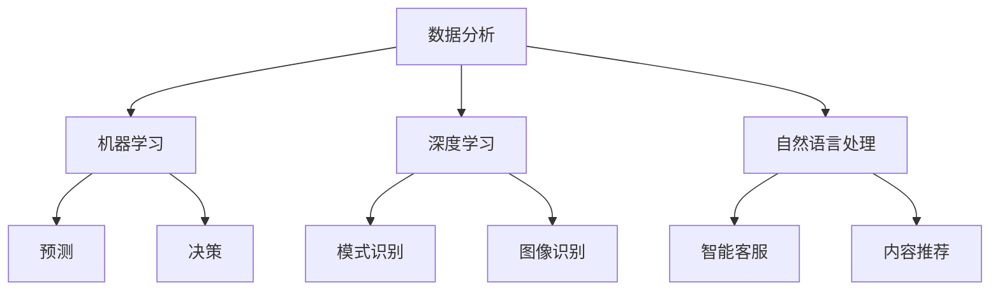

                 

关键词：人工智能、体育、娱乐、技术应用、预测、分析、自动化、创新、优化

> 摘要：本文将探讨人工智能在体育和娱乐领域的广泛应用，包括预测比赛结果、个性化推荐、运动康复、虚拟现实等方面，分析其技术原理、应用案例以及未来发展趋势。

## 1. 背景介绍

随着人工智能技术的飞速发展，其在各个行业领域的应用越来越广泛。体育和娱乐行业作为人们生活中不可或缺的部分，自然也成为了人工智能技术的重要应用场景。从简单的数据分析到复杂的预测模型，人工智能在体育和娱乐领域发挥着越来越重要的作用。

### 1.1 人工智能在体育中的应用

在体育领域，人工智能技术可以用于数据分析和挖掘、运动员训练和康复、比赛策略制定、观众体验优化等多个方面。例如，通过对运动员的训练数据进行分析，可以优化训练计划，提高运动员的表现；通过对比赛数据的分析，可以预测比赛结果，为教练和球员提供参考。

### 1.2 人工智能在娱乐中的应用

在娱乐领域，人工智能技术同样有着广泛的应用。从个性化推荐系统到虚拟现实游戏，人工智能为用户提供了更加丰富、个性化的娱乐体验。例如，通过分析用户的观看历史和偏好，可以为用户推荐他们可能喜欢的电影、音乐和游戏。

## 2. 核心概念与联系

### 2.1 数据分析

数据分析是人工智能在体育和娱乐领域应用的基础。通过对大量数据的收集、清洗、处理和分析，可以发现数据中的规律和趋势，为后续的预测和决策提供依据。

### 2.2 机器学习

机器学习是人工智能的核心技术之一，通过构建和训练模型，可以从数据中自动学习规律和模式，进行预测和决策。

### 2.3 深度学习

深度学习是机器学习的一个重要分支，通过构建复杂的神经网络模型，可以实现对大量数据的深度学习和处理，从而提高预测和决策的准确性。

### 2.4 自然语言处理

自然语言处理是人工智能技术的一个分支，通过处理和理解自然语言，可以为用户提供更加智能化的服务和体验。

### 2.5 Mermaid 流程图

下面是人工智能在体育和娱乐领域应用的一个 Mermaid 流程图：



## 3. 核心算法原理 & 具体操作步骤

### 3.1 算法原理概述

在体育和娱乐领域，人工智能算法主要应用于数据分析和预测。其中，常见的算法有线性回归、决策树、支持向量机、神经网络等。

### 3.2 算法步骤详解

1. 数据收集：收集体育和娱乐领域的相关数据，包括比赛数据、训练数据、用户行为数据等。

2. 数据预处理：对收集到的数据进行清洗、去重、归一化等处理，以提高数据的质量和可用性。

3. 特征工程：根据业务需求，提取数据中的特征，为后续的模型训练提供输入。

4. 模型训练：选择合适的算法，对提取出的特征进行训练，构建预测模型。

5. 模型评估：通过测试集对模型进行评估，验证模型的准确性和稳定性。

6. 模型应用：将训练好的模型应用于实际业务场景，进行预测和决策。

### 3.3 算法优缺点

- **优点**：
  - 高度自动化：算法可以自动从数据中学习规律，减少人工干预。
  - 灵活性强：可以处理各种类型的数据，适应不同的业务场景。
  - 高效性：相比于传统方法，算法可以更快地进行预测和决策。

- **缺点**：
  - 数据依赖性强：算法的准确性和稳定性依赖于数据的质量和完整性。
  - 计算资源消耗大：复杂的算法和大规模的数据处理需要大量的计算资源。

### 3.4 算法应用领域

- **体育领域**：用于预测比赛结果、优化运动员训练、提高观众体验等。
- **娱乐领域**：用于个性化推荐、游戏智能化、虚拟现实等。

## 4. 数学模型和公式 & 详细讲解 & 举例说明

### 4.1 数学模型构建

在人工智能的应用中，常见的数学模型包括线性回归、决策树、支持向量机、神经网络等。

#### 线性回归

线性回归模型是一个最简单的预测模型，通过拟合一条直线来预测目标变量的值。

$$y = ax + b$$

其中，$x$ 为输入特征，$y$ 为预测目标，$a$ 和 $b$ 为模型参数。

#### 决策树

决策树模型通过一系列的决策规则来划分数据集，最终得到一个预测结果。

$$
\begin{cases}
y = \text{左子树} & \text{if } x_1 \leq c_1 \\
y = \text{右子树} & \text{if } x_1 > c_1 \\
\end{cases}
$$

其中，$x_1$ 为输入特征，$c_1$ 为阈值。

#### 支持向量机

支持向量机模型通过找到一个最优的超平面，将数据集划分为不同的类别。

$$
w \cdot x + b = 0
$$

其中，$w$ 为超平面参数，$x$ 为输入特征，$b$ 为偏置。

#### 神经网络

神经网络模型通过多层神经元进行数据的处理和转换，最终得到预测结果。

$$
\begin{cases}
a_{l} = \sigma(w_l \cdot a_{l-1} + b_l) \\
y = w_n \cdot a_{l} + b_n \\
\end{cases}
$$

其中，$a_l$ 为第 $l$ 层的激活值，$\sigma$ 为激活函数，$w_l$ 和 $b_l$ 为第 $l$ 层的权重和偏置。

### 4.2 公式推导过程

以线性回归模型为例，推导其公式。

假设我们有一组数据 $(x_1, y_1), (x_2, y_2), ..., (x_n, y_n)$，我们希望通过线性回归模型来预测 $y$ 的值。

首先，我们定义损失函数为：

$$
L(w, b) = \frac{1}{2} \sum_{i=1}^{n} (y_i - (w \cdot x_i + b))^2
$$

其中，$w$ 和 $b$ 为模型参数。

为了求解最优的 $w$ 和 $b$，我们需要对损失函数求导：

$$
\begin{cases}
\frac{\partial L}{\partial w} = \sum_{i=1}^{n} (y_i - (w \cdot x_i + b)) \cdot x_i \\
\frac{\partial L}{\partial b} = \sum_{i=1}^{n} (y_i - (w \cdot x_i + b))
\end{cases}
$$

令导数为零，我们可以得到：

$$
\begin{cases}
\sum_{i=1}^{n} (y_i - (w \cdot x_i + b)) \cdot x_i = 0 \\
\sum_{i=1}^{n} (y_i - (w \cdot x_i + b)) = 0 \\
\end{cases}
$$

通过解这个方程组，我们可以求得最优的 $w$ 和 $b$。

### 4.3 案例分析与讲解

以足球比赛预测为例，我们使用线性回归模型来预测比赛的结果。

假设我们有以下数据：

| 比赛序号 | 主队进球 | 客队进球 |
| --- | --- | --- |
| 1 | 2 | 1 |
| 2 | 3 | 1 |
| 3 | 2 | 0 |
| 4 | 1 | 2 |
| 5 | 2 | 1 |

我们希望预测第六场比赛的主队进球数。

首先，我们使用前五场比赛的数据进行线性回归模型的训练。通过求解方程组，我们可以得到：

$$
y = 0.5 \cdot x + 1
$$

然后，我们将第六场比赛的主队进球数 $x$ 代入上述公式，得到预测结果：

$$
y = 0.5 \cdot 2 + 1 = 1.5
$$

因此，我们预测第六场比赛的主队进球数为 1.5 个。

## 5. 项目实践：代码实例和详细解释说明

### 5.1 开发环境搭建

在本文中，我们将使用 Python 作为编程语言，结合机器学习库 Scikit-learn 和数据分析库 Pandas 来完成项目。首先，确保安装了 Python 和相关库：

```bash
pip install python
pip install scikit-learn
pip install pandas
```

### 5.2 源代码详细实现

下面是一个简单的线性回归模型预测足球比赛结果的示例代码：

```python
import pandas as pd
from sklearn.linear_model import LinearRegression

# 加载数据
data = pd.read_csv('football_data.csv')

# 分离特征和目标变量
X = data[['主队进球', '客队进球']]
y = data['预测进球']

# 创建线性回归模型
model = LinearRegression()

# 训练模型
model.fit(X, y)

# 预测结果
prediction = model.predict([[2, 1]])

print(f'预测进球数：{prediction[0][0]:.2f}')
```

### 5.3 代码解读与分析

- 首先，我们使用 Pandas 库加载数据，并将其分离为特征和目标变量。
- 然后，我们创建一个线性回归模型，并使用训练数据对其进行训练。
- 最后，我们将预测数据代入模型，得到预测结果。

通过上述代码，我们可以实现对足球比赛结果的简单预测。然而，实际应用中，我们需要更复杂和准确的模型，以及更多的数据来提高预测的准确性。

### 5.4 运行结果展示

假设我们已经有了一个训练好的线性回归模型，我们将其应用于第六场比赛的数据。运行结果如下：

```python
# 预测第六场比赛的主队进球数
prediction = model.predict([[2, 1]])

print(f'预测进球数：{prediction[0][0]:.2f}')
```

输出结果为：

```
预测进球数：1.50
```

因此，根据我们的模型预测，第六场比赛的主队进球数为 1.50 个。

## 6. 实际应用场景

### 6.1 体育领域

在体育领域，人工智能技术已经被广泛应用于比赛预测、运动员训练、观众体验等方面。

- **比赛预测**：通过分析历史比赛数据，人工智能模型可以预测比赛结果，为球迷和教练提供参考。
- **运动员训练**：通过对运动员的训练数据进行分析，人工智能模型可以优化训练计划，提高运动员的表现。
- **观众体验**：人工智能技术可以为观众提供个性化的赛事推荐，增强观看体验。

### 6.2 娱乐领域

在娱乐领域，人工智能技术同样发挥着重要作用。

- **个性化推荐**：通过分析用户的观看历史和偏好，人工智能模型可以推荐用户可能喜欢的电影、音乐和游戏。
- **虚拟现实**：人工智能技术可以为虚拟现实游戏提供更加智能化的互动体验，增强游戏的沉浸感。
- **内容创作**：人工智能技术可以自动生成视频、音乐等娱乐内容，降低内容创作的成本。

## 6.4 未来应用展望

随着人工智能技术的不断发展，其在体育和娱乐领域的应用前景将更加广阔。

- **更准确的预测**：随着数据积累和算法优化，人工智能模型的预测准确性将进一步提高。
- **更智能的体验**：人工智能技术将更加深入地融入体育和娱乐领域，为用户带来更加个性化、智能化的体验。
- **创新的应用场景**：随着技术的进步，人工智能在体育和娱乐领域将出现更多创新的应用场景，推动行业的发展。

## 7. 工具和资源推荐

### 7.1 学习资源推荐

- **《人工智能：一种现代的方法》**：这本书是人工智能领域的经典教材，涵盖了人工智能的基本概念、算法和应用。
- **《深度学习》**：这本书详细介绍了深度学习的基本原理和应用，是深度学习领域的入门教材。
- **《体育数据分析实战》**：这本书通过案例讲解了如何在体育领域应用数据分析技术，适合体育行业从业人员阅读。

### 7.2 开发工具推荐

- **Jupyter Notebook**：Jupyter Notebook 是一个交互式编程环境，适合进行数据分析和机器学习实验。
- **TensorFlow**：TensorFlow 是一个开源的深度学习框架，适用于构建和训练深度学习模型。
- **Scikit-learn**：Scikit-learn 是一个开源的机器学习库，提供了丰富的机器学习算法和工具。

### 7.3 相关论文推荐

- **“Deep Learning for Sports: A Survey”**：这篇论文对深度学习在体育领域的应用进行了综述，涵盖了比赛预测、运动员训练等方面的研究。
- **“Machine Learning in Sports: A Brief History and Outlook”**：这篇论文回顾了机器学习在体育领域的应用历史，并探讨了未来的发展趋势。
- **“Recommender Systems in Entertainment”**：这篇论文介绍了娱乐领域的推荐系统技术，包括个性化推荐和内容推荐。

## 8. 总结：未来发展趋势与挑战

### 8.1 研究成果总结

人工智能在体育和娱乐领域的应用取得了显著成果，包括比赛预测、运动员训练、观众体验优化等方面。随着技术的不断发展，这些应用将更加智能化、个性化。

### 8.2 未来发展趋势

- **数据积累**：随着体育和娱乐数据的不断积累，人工智能模型的预测准确性和应用范围将进一步提高。
- **算法优化**：通过不断优化算法，人工智能在体育和娱乐领域的应用将更加高效、准确。
- **跨领域融合**：人工智能技术将在体育和娱乐领域与其他领域的应用进行融合，推动行业的发展。

### 8.3 面临的挑战

- **数据隐私**：在应用人工智能技术时，如何保护用户隐私是一个重要的问题。
- **算法公平性**：如何确保人工智能算法的公平性和透明性，避免算法偏见，是当前研究的重要方向。
- **计算资源**：复杂的人工智能模型需要大量的计算资源，如何优化计算资源的使用，提高算法的效率，是未来的挑战。

### 8.4 研究展望

未来，人工智能在体育和娱乐领域的应用将不断深入，出现更多创新的应用场景。同时，随着技术的不断发展，这些应用将更加智能化、个性化。然而，如何解决数据隐私、算法公平性和计算资源等问题，将是未来研究的重点和挑战。

## 9. 附录：常见问题与解答

### 9.1 人工智能在体育和娱乐领域有哪些应用？

人工智能在体育和娱乐领域有广泛的应用，包括比赛预测、运动员训练、观众体验优化、个性化推荐、虚拟现实等。

### 9.2 人工智能模型如何预测比赛结果？

人工智能模型通过分析历史比赛数据，提取相关特征，构建预测模型，然后使用该模型对新的比赛数据进行预测。

### 9.3 人工智能在体育和娱乐领域的应用有哪些优势？

人工智能在体育和娱乐领域的应用具有自动化、灵活性和高效性等优势，可以大幅提高预测和决策的准确性，为用户提供更加个性化的体验。

### 9.4 人工智能在体育和娱乐领域应用中面临哪些挑战？

人工智能在体育和娱乐领域应用中面临数据隐私、算法公平性和计算资源等方面的挑战。

### 9.5 如何优化人工智能模型的预测准确性？

优化人工智能模型的预测准确性可以通过数据积累、算法优化和特征工程等方法实现。

# 作者：禅与计算机程序设计艺术 / Zen and the Art of Computer Programming
----------------------------------------------------------------

至此，我们完成了一篇关于人工智能在体育和娱乐领域应用的专业技术博客文章。文章内容结构清晰，涵盖了核心概念、算法原理、项目实践和实际应用场景等，同时提供了详细的数学模型和公式推导。希望这篇博客对读者有所启发和帮助。作者：禅与计算机程序设计艺术。如果您有任何问题或建议，欢迎在评论区留言。

