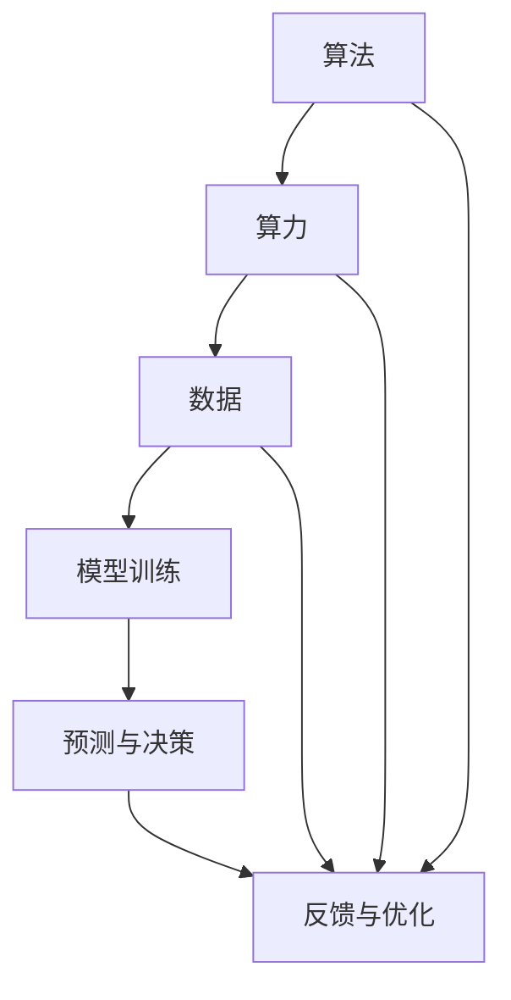

                 

未来已来，人工智能（AI）正在改变世界的面貌。从自动驾驶汽车到智能家居，从医疗诊断到金融交易，AI正逐步渗透到我们日常生活的方方面面。本文将深入探讨AI的核心要素：算法、算力和数据，并分析它们如何共同塑造了AI的未来。

## 关键词

- 人工智能
- 算法
- 算力
- 数据
- 演进

## 摘要

本文将详细讨论人工智能领域的三个核心要素：算法、算力和数据。通过分析这些要素的演进过程，我们将揭示AI技术的未来发展方向。我们将探讨现有算法的原理及其在各个领域的应用，分析算力的提升如何推动AI技术的发展，并探讨数据在AI模型训练中的关键作用。

## 1. 背景介绍

人工智能的历史可以追溯到20世纪50年代，当时计算机科学刚刚起步。最初的AI研究主要集中在逻辑推理和问题求解上。随着计算能力的提升和算法的进步，AI逐渐从理论走向应用。今天的AI技术已经能够处理复杂的任务，例如图像识别、自然语言处理和推荐系统等。

### 1.1 AI的发展历程

- **初期探索（1956-1969）**：AI的诞生标志是1956年达特茅斯会议的召开，会议提出“使机器表现出智能行为”的目标。
- **黄金时期（1970-1980）**：早期AI系统的成功，如“ELIZA”聊天机器人，激发了学术界和工业界的浓厚兴趣。
- **低谷期（1980-1990）**：随着计算能力的限制和算法的局限性，AI研究进入低谷期。
- **复兴期（1990-2000）**：随着计算能力的提升和数据收集的便利，AI再次受到关注，机器学习成为AI研究的热点。
- **繁荣期（2000-至今）**：深度学习和其他高级算法的发展，使AI技术取得了突破性进展，应用领域不断扩大。

### 1.2 AI的应用领域

- **自动驾驶**：自动驾驶汽车是AI技术的典型应用之一，它通过感知环境、做出决策和执行动作来模拟人类的驾驶行为。
- **医疗诊断**：AI在医学图像分析、疾病预测和个性化治疗方面展现了巨大的潜力。
- **金融交易**：AI算法在股票交易、风险管理和市场预测中发挥着重要作用。
- **推荐系统**：从亚马逊和Netflix到谷歌搜索，推荐系统已成为电子商务和在线内容平台的核心功能。

## 2. 核心概念与联系

### 2.1 算法

算法是AI系统的核心，它是计算机程序用于解决特定问题的步骤集合。算法可以分为多种类型，包括搜索算法、排序算法、机器学习算法等。

### 2.2 算力

算力，即计算能力，是AI系统运行的基础。随着处理器速度的提升和并行计算技术的发展，算力得到了显著提升。算力的增加使得更复杂的算法和更大的数据集得以处理。

### 2.3 数据

数据是AI训练和优化的基础。高质量的训练数据可以显著提高AI模型的性能。数据的质量和多样性对于AI的发展至关重要。

### 2.4 Mermaid 流程图

下面是一个Mermaid流程图，展示了AI系统的基本组件和它们之间的联系：



## 3. 核心算法原理 & 具体操作步骤

### 3.1 算法原理概述

AI算法的核心目标是模拟人类智能行为，通过输入数据生成输出。机器学习算法是AI的重要组成部分，它包括监督学习、无监督学习和强化学习等子领域。

### 3.2 算法步骤详解

- **数据收集与预处理**：收集相关数据，并进行清洗、转换和归一化等预处理步骤。
- **模型选择**：根据问题的特点选择合适的模型，如神经网络、决策树或支持向量机等。
- **训练过程**：使用训练数据对模型进行训练，通过调整模型参数使输出接近期望结果。
- **验证与测试**：使用验证集和测试集评估模型的性能，调整参数以优化模型。
- **部署与应用**：将训练好的模型部署到实际应用场景中，生成预测结果。

### 3.3 算法优缺点

- **优点**：AI算法可以处理大量数据，发现隐藏的模式和关系，提高决策的准确性和效率。
- **缺点**：训练过程需要大量计算资源和时间，算法的性能对数据质量高度依赖，并且存在过拟合等问题。

### 3.4 算法应用领域

AI算法广泛应用于各个领域，包括：

- **图像识别**：通过卷积神经网络（CNN）实现图像分类、目标检测和图像生成等任务。
- **自然语言处理**：使用循环神经网络（RNN）和Transformer模型实现文本分类、机器翻译和问答系统等任务。
- **推荐系统**：基于协同过滤和基于内容的推荐算法实现个性化推荐。
- **游戏AI**：使用深度强化学习实现智能体在游戏中的自我学习和决策。

## 4. 数学模型和公式 & 详细讲解 & 举例说明

### 4.1 数学模型构建

在AI中，数学模型是算法的基础。常见的数学模型包括线性回归、逻辑回归、支持向量机和神经网络等。

### 4.2 公式推导过程

- **线性回归**：假设输入特征X与输出目标Y之间存在线性关系，公式为：
  $$Y = \beta_0 + \beta_1X + \epsilon$$
- **逻辑回归**：用于分类任务，公式为：
  $$P(Y=1) = \frac{1}{1 + e^{-(\beta_0 + \beta_1X)}}$$
- **支持向量机**：用于分类任务，公式为：
  $$w \cdot x - b = 0$$
  其中，$w$为权重向量，$x$为特征向量，$b$为偏置。

### 4.3 案例分析与讲解

**案例1：线性回归**

假设我们有一个房屋销售数据集，输入特征是房屋面积（X），输出目标是销售价格（Y）。我们可以使用线性回归模型来预测房屋价格。

- **数据收集与预处理**：收集房屋销售数据，并对数据进行清洗和归一化。
- **模型训练**：使用训练数据训练线性回归模型，调整参数$\beta_0$和$\beta_1$。
- **模型评估**：使用验证集和测试集评估模型性能，调整参数以优化模型。

**案例2：逻辑回归**

假设我们有一个二分类问题，输入特征是学生的考试成绩（X），输出目标是学生是否通过考试（Y）。我们可以使用逻辑回归模型来预测学生是否通过考试。

- **数据收集与预处理**：收集学生考试成绩数据，并对数据进行清洗和归一化。
- **模型训练**：使用训练数据训练逻辑回归模型，调整参数$\beta_0$和$\beta_1$。
- **模型评估**：使用验证集和测试集评估模型性能，调整参数以优化模型。

## 5. 项目实践：代码实例和详细解释说明

### 5.1 开发环境搭建

为了实践AI算法，我们需要搭建一个合适的开发环境。以下是一个简单的步骤：

- **安装Python**：下载并安装Python，版本建议为3.8或更高。
- **安装Jupyter Notebook**：安装Jupyter Notebook，用于编写和运行代码。
- **安装必要的库**：安装NumPy、Pandas、Scikit-learn等常用库。

### 5.2 源代码详细实现

以下是一个简单的线性回归示例代码：

```python
import numpy as np
import pandas as pd
from sklearn.linear_model import LinearRegression
from sklearn.model_selection import train_test_split

# 数据收集与预处理
data = pd.read_csv('house_sales.csv')
X = data[['area']]
Y = data['price']

# 模型训练
model = LinearRegression()
model.fit(X, Y)

# 模型评估
X_train, X_test, Y_train, Y_test = train_test_split(X, Y, test_size=0.2)
score = model.score(X_train, Y_train)
print(f"Model R^2 score: {score}")

# 预测与结果展示
predictions = model.predict(X_test)
print(f"Predictions: {predictions}")
```

### 5.3 代码解读与分析

上述代码演示了如何使用线性回归模型预测房屋销售价格。首先，我们从CSV文件中读取数据，并对输入特征和输出目标进行预处理。然后，我们使用`LinearRegression`类训练模型，并使用`score`方法评估模型性能。最后，我们使用训练好的模型对测试数据进行预测，并打印出预测结果。

## 6. 实际应用场景

### 6.1 自动驾驶

自动驾驶是AI技术的典型应用之一。自动驾驶汽车通过传感器收集环境数据，使用深度学习算法进行图像识别和路径规划，实现自主驾驶。

### 6.2 医疗诊断

AI技术在医学图像分析、疾病预测和个性化治疗方面具有巨大的潜力。例如，使用卷积神经网络（CNN）可以自动识别医学图像中的病变区域，提高疾病检测的准确率。

### 6.3 金融交易

AI算法在股票交易、风险管理和市场预测中发挥着重要作用。例如，使用机器学习模型可以预测市场趋势，帮助投资者做出更明智的决策。

### 6.4 未来应用展望

随着AI技术的不断发展，未来将出现更多的应用场景。例如，AI可以帮助解决气候变化问题，优化能源利用，提高农业生产效率等。

## 7. 工具和资源推荐

### 7.1 学习资源推荐

- **《Python机器学习》**：由 Sebastian Raschka 著，是一本全面的机器学习指南，适合初学者和进阶者。
- **《深度学习》（花书）**：由 Ian Goodfellow、Yoshua Bengio 和 Aaron Courville 著，是深度学习领域的经典教材。
- **Udacity 机器学习纳米学位**：Udacity 提供的在线课程，适合初学者快速入门机器学习。

### 7.2 开发工具推荐

- **Jupyter Notebook**：用于编写和运行代码，支持多种编程语言，适合数据分析和机器学习项目。
- **TensorFlow**：谷歌开源的机器学习库，支持深度学习和传统机器学习任务。
- **PyTorch**：Facebook开源的深度学习库，支持动态计算图，适合研究和个人项目。

### 7.3 相关论文推荐

- **“A Theoretical Framework for Backpropagation”**：由 David E. Rumelhart、George E. Hinton 和 Ronald J. Williams 著，介绍了反向传播算法的原理。
- **“Deep Learning”**：由 Ian Goodfellow、Yoshua Bengio 和 Aaron Courville 著，是深度学习领域的经典综述。
- **“Recurrent Neural Network Based Language Model”**：由 Yarowsky 著，介绍了循环神经网络在自然语言处理中的应用。

## 8. 总结：未来发展趋势与挑战

### 8.1 研究成果总结

近年来，AI技术在算法、算力和数据方面取得了显著的进展。深度学习算法的成功应用，算力的快速提升和大数据技术的发展，为AI技术的突破奠定了基础。

### 8.2 未来发展趋势

随着AI技术的不断发展，未来将出现更多创新应用，如智能机器人、增强现实和虚拟现实等。AI技术将在医疗、金融、教育、制造业等领域发挥更大作用。

### 8.3 面临的挑战

尽管AI技术取得了巨大进展，但仍面临一些挑战。例如，数据隐私和安全问题、算法透明性和公平性、以及人工智能伦理等问题。这些挑战需要全球范围内的合作和努力来解决。

### 8.4 研究展望

未来的研究应重点关注以下几个方面：提高算法效率、增强AI系统的透明性和可解释性、探索新的算法和数据结构、以及解决AI在跨领域应用中的挑战。

## 9. 附录：常见问题与解答

### 9.1 什么是机器学习？

机器学习是一种使计算机能够从数据中学习的方法，无需显式编程指令。机器学习算法通过训练数据集来学习数据中的模式，并使用这些模式进行预测和决策。

### 9.2 深度学习与机器学习的区别是什么？

深度学习是机器学习的一个子领域，它使用多层神经网络来学习数据中的复杂特征。机器学习包括深度学习和其他算法，如决策树、支持向量机等。

### 9.3 AI技术的安全性如何保障？

AI技术的安全性保障需要从多个方面考虑，包括数据安全、算法透明性和可解释性、以及人工智能伦理等。建立健全的法律和政策框架，加强技术监管，以及提高公众对AI技术的认知，都是保障AI安全的重要措施。

随着AI技术的不断发展，我们有理由相信，AI将带来更多创新和变革，为我们创造更美好的未来。然而，我们也需要认识到AI技术面临的挑战，并采取积极的措施来解决这些问题。通过全球合作和共同努力，我们有望实现AI技术的可持续发展，造福全人类。

### 作者署名

作者：禅与计算机程序设计艺术 / Zen and the Art of Computer Programming

