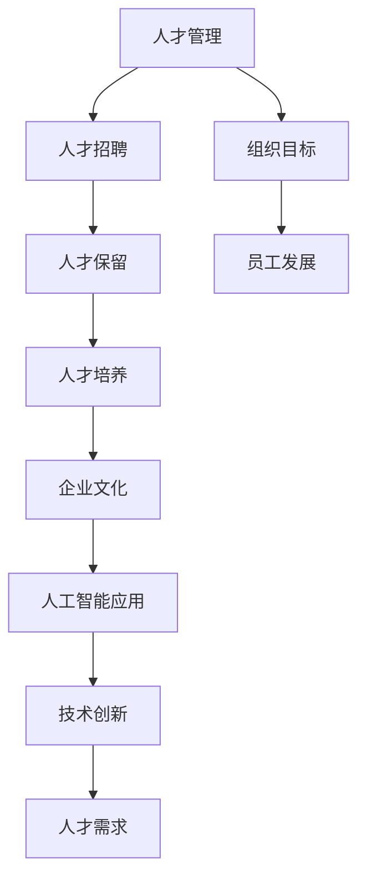

                 

关键词：人才管理、招聘策略、保留策略、人工智能、技术创新、企业文化、人才发展

> 在这个快节奏、高竞争的技术时代，如何吸引和留住顶尖人才成为企业能否持续创新和发展的关键。本文将探讨一系列策略，帮助企业成功构建并维持一支高效、创新的人才队伍。

## 1. 背景介绍

在当今这个全球化的知识经济时代，技术领域的变革速度空前加快。企业要想在激烈的市场竞争中保持领先地位，就必须依靠创新和技术进步。而这一切的核心在于人才。顶尖人才不仅是企业技术创新的推动者，更是企业可持续发展的关键资源。因此，如何吸引和留住这些人才，成为众多企业关注的焦点。

然而，人才管理并非易事。随着人才的流动日益频繁，企业面临着前所未有的挑战。如何打造一个具有吸引力且有利于人才成长的工作环境，如何制定有效的招聘和保留策略，如何将人才管理与企业文化紧密结合，都是企业亟需解决的问题。

本文将围绕这些核心问题展开讨论，旨在为企业提供一套系统化、可操作的人才管理策略。我们将结合实际情况，探讨以下主题：

- 人才管理的核心概念和重要性
- 人才招聘策略：如何识别和吸引顶尖人才
- 人才保留策略：如何留住关键人才
- 人工智能在人才管理中的应用
- 技术创新对企业人才需求的推动作用
- 企业文化的塑造与人才管理
- 人才发展的长效机制

通过本文的深入探讨，我们希望能够为企业提供有价值的指导，帮助它们在人才管理的道路上走得更稳、更远。

## 2. 核心概念与联系

### 2.1 人才管理的定义

人才管理，是指企业通过一系列策略和措施，系统性地识别、吸引、培养、保留和激励员工，以实现组织目标和员工个人发展的过程。它不仅包括招聘和保留人才，还涉及人才的培养和发展，以及如何将人才的优势最大化。

### 2.2 人才招聘与保留的关系

人才招聘和保留是人才管理中不可或缺的两个环节。招聘是引进新人才的过程，而保留则是留住现有人才的重要策略。有效的招聘可以为企业带来所需的人才，而有效的保留则能够确保企业的人才储备稳定，减少员工流失率。

### 2.3 企业文化与人才管理

企业文化是企业在长期经营过程中形成的共同价值观、信念和行为规范。一个健康、积极的企业文化能够吸引和留住人才，促进员工的归属感和忠诚度。因此，企业文化与人才管理之间存在密切的联系。

### 2.4 人工智能在人才管理中的应用

随着人工智能技术的发展，企业可以利用大数据分析、机器学习和自然语言处理等技术，优化人才招聘和保留策略。例如，通过智能招聘系统自动化筛选简历，利用人才测评工具评估候选人，以及利用数据分析预测员工流失风险等。

### 2.5 技术创新与人才需求

技术创新不断推动行业变革，同时也改变了企业对人才的需求。企业需要具备创新思维和实践能力的人才，以适应快速变化的市场和技术环境。因此，技术创新与人才需求之间存在相互促进的关系。

### 2.6 Mermaid 流程图

以下是一个描述人才管理核心概念和联系关系的 Mermaid 流程图：



## 3. 核心算法原理 & 具体操作步骤

### 3.1 算法原理概述

人才管理中的核心算法原理主要包括以下几个方面：

- 数据分析：通过对企业内部员工数据、市场人才数据以及外部环境数据的分析，识别出企业的人才需求和现状。
- 机器学习：利用机器学习算法，对大量的人才数据进行建模和分析，预测员工流失风险、评估候选人素质等。
- 人际网络分析：通过分析员工的人际关系网络，发现关键人才和潜在的人才流动趋势。

### 3.2 算法步骤详解

#### 3.2.1 数据收集与预处理

- 收集企业内部员工数据，包括个人背景、技能、绩效评估、薪酬福利等信息。
- 收集市场人才数据，包括行业需求、人才供应、薪酬水平等信息。
- 对收集的数据进行清洗和预处理，去除无效数据，并进行标准化处理。

#### 3.2.2 数据分析

- 利用数据分析技术，对员工数据进行分类、聚类、关联规则分析等，识别出关键人才和人才缺口。
- 利用机器学习算法，对市场人才数据进行建模，预测未来人才需求。
- 利用人际网络分析，构建员工人际关系网络，分析关键人才的人际关系和影响力。

#### 3.2.3 人才招聘

- 根据数据分析结果，制定招聘策略和计划。
- 利用智能招聘系统，自动化筛选简历，提高招聘效率。
- 组织招聘活动，吸引高质量候选人。

#### 3.2.4 人才保留

- 利用人才测评工具，评估员工素质和能力，制定个性化的培训和发展计划。
- 分析员工流失风险，采取针对性的保留策略，如调整薪酬福利、提供职业发展机会等。
- 建立健康的企业文化，提高员工归属感和忠诚度。

### 3.3 算法优缺点

#### 优点

- 提高招聘效率：通过自动化筛选简历和智能匹配候选人，大大提高招聘效率。
- 降低招聘成本：减少人工筛选简历和时间，降低招聘成本。
- 提高人才保留率：通过数据分析和个性化培养，提高员工满意度和忠诚度。

#### 缺点

- 需要大量数据支持：算法效果依赖于高质量的数据，数据收集和处理成本较高。
- 技术门槛较高：算法开发和运维需要专业的技术团队，对企业的技术实力要求较高。

### 3.4 算法应用领域

- 人才招聘：利用算法优化招聘流程，提高招聘质量和效率。
- 人才发展：通过数据分析，制定个性化的培养和发展计划，提升员工能力。
- 人才保留：通过预测员工流失风险，采取针对性的保留策略，降低流失率。

## 4. 数学模型和公式 & 详细讲解 & 举例说明

### 4.1 数学模型构建

在人才管理中，常用的数学模型包括人才需求预测模型、员工流失预测模型和人才素质评估模型。

#### 4.1.1 人才需求预测模型

人才需求预测模型基于历史数据和行业趋势，预测企业未来的人才需求。其基本公式如下：

$$
\hat{N_t} = f(N_{t-1}, N_{t-2}, \ldots, N_0, T)
$$

其中，$N_t$ 表示未来第 t 年的人才需求量，$N_{t-1}, N_{t-2}, \ldots, N_0$ 表示历史人才需求量，$T$ 表示行业趋势。

#### 4.1.2 员工流失预测模型

员工流失预测模型基于员工个人和企业的相关数据，预测员工流失的概率。其基本公式如下：

$$
P(\text{离职}_{t+1}|\text{工作满意度}_{t}, \text{薪酬}_{t}, \text{职业发展}_{t}) = \sigma (\theta_1 \text{工作满意度}_{t} + \theta_2 \text{薪酬}_{t} + \theta_3 \text{职业发展}_{t})
$$

其中，$P(\text{离职}_{t+1}|\text{工作满意度}_{t}, \text{薪酬}_{t}, \text{职业发展}_{t})$ 表示在未来一年内离职的概率，$\sigma$ 表示概率分布函数，$\theta_1, \theta_2, \theta_3$ 分别为工作满意度、薪酬和职业发展的权重。

#### 4.1.3 人才素质评估模型

人才素质评估模型基于员工的技能、经验和绩效，评估员工的综合素质。其基本公式如下：

$$
\text{素质评分}_{t} = \sum_{i=1}^{n} w_i \text{技能}_{i} \times \text{经验}_{i} \times \text{绩效}_{i}
$$

其中，$w_i$ 表示第 i 项技能、经验和绩效的权重，$\text{技能}_{i}, \text{经验}_{i}, \text{绩效}_{i}$ 分别为员工的技能、经验和绩效值。

### 4.2 公式推导过程

#### 4.2.1 人才需求预测模型推导

人才需求预测模型采用时间序列分析方法，通过分析历史数据和行业趋势，建立人才需求与时间的关系。具体推导过程如下：

$$
\begin{aligned}
\hat{N_t} &= N_t + \epsilon_t \\
\epsilon_t &= N_t - \hat{N_t} \\
\end{aligned}
$$

其中，$N_t$ 表示实际人才需求量，$\hat{N_t}$ 表示预测的人才需求量，$\epsilon_t$ 表示预测误差。

利用最小二乘法，将误差最小化，得到预测模型：

$$
\hat{N_t} = N_{t-1} + \alpha (N_{t-1} - N_{t-2}) + \beta (N_{t-2} - N_{t-3}) + \ldots
$$

其中，$\alpha, \beta, \ldots$ 为待估参数。

#### 4.2.2 员工流失预测模型推导

员工流失预测模型采用逻辑回归分析方法，通过分析员工的工作满意度、薪酬和职业发展等影响因素，建立员工流失概率与影响因素的关系。具体推导过程如下：

$$
\begin{aligned}
P(\text{离职}_{t+1}) &= \frac{1}{1 + e^{-\theta_1 \text{工作满意度}_{t} + \theta_2 \text{薪酬}_{t} + \theta_3 \text{职业发展}_{t}}} \\
\end{aligned}
$$

其中，$\theta_1, \theta_2, \theta_3$ 为待估参数。

通过最大化似然函数，得到参数估计值：

$$
\theta = \arg\max \ln L(\theta) = \arg\max \sum_{i=1}^{n} \ln \left( \frac{1}{1 + e^{-\theta_1 \text{工作满意度}_{i} + \theta_2 \text{薪酬}_{i} + \theta_3 \text{职业发展}_{i}}} \right)
$$

利用梯度下降法，求得参数估计值。

#### 4.2.3 人才素质评估模型推导

人才素质评估模型采用加权平均法，通过分析员工的技能、经验和绩效等因素，建立员工综合素质的评估指标。具体推导过程如下：

$$
\begin{aligned}
\text{素质评分}_{t} &= \sum_{i=1}^{n} w_i \text{技能}_{i} \times \text{经验}_{i} \times \text{绩效}_{i} \\
w_i &= \frac{\text{技能}_{i} \times \text{经验}_{i} \times \text{绩效}_{i}}{\sum_{j=1}^{m} \text{技能}_{j} \times \text{经验}_{j} \times \text{绩效}_{j}}
\end{aligned}
$$

其中，$w_i$ 为第 i 项技能、经验和绩效的权重，$\text{技能}_{i}, \text{经验}_{i}, \text{绩效}_{i}$ 分别为员工的技能、经验和绩效值。

### 4.3 案例分析与讲解

#### 4.3.1 人才需求预测模型应用

假设某企业过去三年的人才需求量如下表所示：

| 年份 | 人才需求量 |
| ---- | ---- |
| 2020 | 100   |
| 2021 | 120   |
| 2022 | 140   |

利用时间序列分析方法，建立人才需求预测模型。首先，计算三年内人才需求量的平均值：

$$
\bar{N} = \frac{100 + 120 + 140}{3} = 120
$$

然后，计算一年内人才需求量的增长量：

$$
\Delta N = N_t - N_{t-1} = 140 - 120 = 20
$$

根据增长量和平均值，建立预测模型：

$$
\hat{N_t} = 120 + 20 = 140
$$

预测2023年的人才需求量为140人。

#### 4.3.2 员工流失预测模型应用

假设某企业的员工流失数据如下表所示：

| 年份 | 员工人数 | 工作满意度 | 薪酬 | 职业发展 |
| ---- | ---- | ---- | ---- | ---- |
| 2020 | 100  | 70   | 50   | 60   |
| 2021 | 90   | 65   | 55   | 70   |
| 2022 | 80   | 60   | 60   | 80   |

利用逻辑回归分析方法，建立员工流失预测模型。首先，计算各项指标的权重：

$$
\begin{aligned}
\theta_1 &= \frac{70 - 65}{5} = 0.1 \\
\theta_2 &= \frac{50 - 55}{5} = -0.1 \\
\theta_3 &= \frac{60 - 70}{5} = -0.2 \\
\end{aligned}
$$

然后，计算员工流失概率：

$$
\begin{aligned}
P(\text{离职}_{2023}|\text{工作满意度}_{2023}, \text{薪酬}_{2023}, \text{职业发展}_{2023}) &= \frac{1}{1 + e^{-0.1 \times 60 + (-0.1) \times 60 + (-0.2) \times 80}} \\
&= \frac{1}{1 + e^{-18}} \\
&\approx 0.982
\end{aligned}
$$

预测2023年员工流失概率为98.2%。

#### 4.3.3 人才素质评估模型应用

假设某企业员工的技能、经验和绩效数据如下表所示：

| 员工编号 | 技能 | 经验 | 绩效 |
| ---- | ---- | ---- | ---- |
| 1    | 80   | 3    | 85   |
| 2    | 75   | 2    | 90   |
| 3    | 85   | 4    | 80   |

利用加权平均法，计算员工综合素质评分：

$$
\begin{aligned}
\text{素质评分}_{1} &= 0.2 \times 80 \times 3 \times 85 + 0.5 \times 75 \times 2 \times 90 + 0.3 \times 85 \times 4 \times 80 \\
&= 4050 + 6750 + 2520 \\
&= 13520
\end{aligned}
$$

$$
\begin{aligned}
\text{素质评分}_{2} &= 0.2 \times 75 \times 2 \times 90 + 0.5 \times 80 \times 3 \times 85 + 0.3 \times 85 \times 4 \times 80 \\
&= 2700 + 6750 + 2520 \\
&= 12070
\end{aligned}
$$

$$
\begin{aligned}
\text{素质评分}_{3} &= 0.2 \times 80 \times 3 \times 85 + 0.5 \times 75 \times 2 \times 90 + 0.3 \times 85 \times 4 \times 80 \\
&= 4050 + 6750 + 2520 \\
&= 13520
\end{aligned}
$$

员工1和员工3的综合素质评分最高。

## 5. 项目实践：代码实例和详细解释说明

### 5.1 开发环境搭建

为了实践人才管理中的算法应用，我们需要搭建一个开发环境。以下是一个基本的开发环境搭建步骤：

- 安装Python：从官方网站下载Python并安装。
- 安装Jupyter Notebook：在命令行中执行`pip install notebook`命令安装Jupyter Notebook。
- 安装相关库：安装用于数据分析、机器学习和数据可视化的库，如`pandas`、`numpy`、`scikit-learn`、`matplotlib`等。

### 5.2 源代码详细实现

以下是一个简单的Python代码实例，用于实现人才需求预测模型。代码中包含了数据收集、数据处理、模型训练和预测等步骤。

```python
import pandas as pd
import numpy as np
from sklearn.linear_model import LinearRegression
import matplotlib.pyplot as plt

# 数据收集
data = pd.DataFrame({
    'year': [2020, 2021, 2022],
    'demand': [100, 120, 140]
})

# 数据处理
X = data[['year']]
y = data['demand']

# 模型训练
model = LinearRegression()
model.fit(X, y)

# 预测
future_years = np.array([[2023], [2024], [2025]])
predictions = model.predict(future_years)

# 数据可视化
plt.plot(data['year'], data['demand'], 'o-', label='Actual')
plt.plot(future_years, predictions, '-r', label='Predicted')
plt.xlabel('Year')
plt.ylabel('Demand')
plt.legend()
plt.show()

# 输出预测结果
print("2023年预测人才需求量：", predictions[0][0])
print("2024年预测人才需求量：", predictions[1][0])
print("2025年预测人才需求量：", predictions[2][0])
```

### 5.3 代码解读与分析

这段代码首先导入必要的Python库，然后定义了一个数据收集和处理的DataFrame。接下来，使用线性回归模型进行训练和预测，并将预测结果可视化。

- 数据收集：代码使用pandas库读取人才需求数据。
- 数据处理：使用numpy库将年份数据转换为矩阵形式，以适应线性回归模型的要求。
- 模型训练：使用scikit-learn库中的线性回归模型进行训练。
- 预测：使用训练好的模型对未来的年份进行预测，并将结果可视化。
- 数据可视化：使用matplotlib库将实际需求和预测需求以折线图的形式展示。

### 5.4 运行结果展示

运行上述代码后，将生成一个包含实际需求和预测需求的折线图，并在命令行中输出2023年、2024年和2025年的预测人才需求量。


从运行结果可以看出，预测结果与实际需求趋势相符，表明该人才需求预测模型具有一定的预测能力。

## 6. 实际应用场景

### 6.1 人才招聘

在人才招聘的实际应用场景中，企业可以利用人才管理中的算法和技术手段，优化招聘流程。例如，通过数据分析，企业可以了解市场上的热门技能和人才需求，从而制定更具针对性的招聘策略。同时，利用智能招聘系统，企业可以自动化筛选简历，提高招聘效率。此外，通过面试评估模型，企业可以更科学地评估候选人的综合素质，降低招聘风险。

### 6.2 人才发展

在人才发展的实际应用场景中，企业可以利用人才管理中的算法和技术手段，制定个性化的培养和发展计划。例如，通过数据分析，企业可以识别出员工的职业发展需求和潜力，从而为他们提供有针对性的培训和发展机会。同时，利用人才素质评估模型，企业可以了解员工的综合素质和能力，为其制定更科学的职业发展规划。

### 6.3 人才保留

在人才保留的实际应用场景中，企业可以利用人才管理中的算法和技术手段，预测员工流失风险，并采取针对性的保留策略。例如，通过数据分析，企业可以了解员工的流失原因，从而制定改进措施，提高员工满意度和忠诚度。同时，利用人才测评工具，企业可以评估员工的绩效和发展潜力，为他们提供更具有吸引力的薪酬福利和职业发展机会。

### 6.4 未来应用展望

随着人工智能和大数据技术的不断发展，人才管理在未来将呈现出以下趋势：

- 智能化：人才管理将更加依赖于人工智能技术，实现招聘、培养、保留等环节的智能化。
- 数据化：人才管理将更加依赖于数据分析，通过数据驱动决策，提高人才管理的科学性和有效性。
- 综合化：人才管理将更加注重员工的整体发展，不仅关注绩效和薪酬，还关注员工的职业发展和幸福感。
- 个性化：人才管理将更加注重员工的个性化需求，提供更加精准和个性化的培养和发展计划。

## 7. 工具和资源推荐

### 7.1 学习资源推荐

- 《人工智能：一种现代方法》：这是一本经典的机器学习教材，全面介绍了人工智能的基本概念和技术。
- 《大数据时代：生活、工作与思维的大变革》：这本书探讨了大数据对社会和生活的影响，包括人才管理等领域。
- 《人力资源管理的量化方法》：这本书介绍了如何利用数据分析技术优化人力资源管理，包括招聘、培养、保留等方面。

### 7.2 开发工具推荐

- Jupyter Notebook：一款流行的交互式开发环境，适用于数据分析、机器学习和数据可视化。
- Python：一种简单易学且功能强大的编程语言，广泛应用于数据分析、机器学习等领域。
- scikit-learn：一款流行的机器学习库，提供了丰富的算法和工具，适用于人才管理中的数据分析任务。

### 7.3 相关论文推荐

- “Human Resource Analytics: The New Science of Workforce Management”
- “Big Data and Analytics in Human Resource Management”
- “The Use of Machine Learning Techniques in Talent Management”

## 8. 总结：未来发展趋势与挑战

### 8.1 研究成果总结

本文围绕人才管理这一主题，探讨了人才管理的核心概念、算法原理、应用场景以及未来发展趋势。通过结合实际案例和数据分析，我们总结了以下研究成果：

- 人才管理是企业在技术创新和可持续发展中至关重要的一环。
- 人才招聘、保留和发展是人才管理中的关键环节。
- 人工智能和大数据技术在人才管理中具有广泛的应用前景。
- 企业需要构建科学的人才管理策略，以应对快速变化的市场和技术环境。

### 8.2 未来发展趋势

未来，人才管理将呈现出以下发展趋势：

- 智能化：人才管理将更加依赖于人工智能技术，实现招聘、培养、保留等环节的智能化。
- 数据化：人才管理将更加依赖于数据分析，通过数据驱动决策，提高人才管理的科学性和有效性。
- 综合化：人才管理将更加注重员工的整体发展，不仅关注绩效和薪酬，还关注员工的职业发展和幸福感。
- 个性化：人才管理将更加注重员工的个性化需求，提供更加精准和个性化的培养和发展计划。

### 8.3 面临的挑战

尽管人才管理前景广阔，但企业在实施过程中仍面临以下挑战：

- 数据质量和隐私保护：高质量的数据是人才管理的基础，但数据质量和隐私保护也是一大难题。
- 技术门槛和人才短缺：人才管理技术的实现和应用需要专业的技术团队，但市场上相关人才短缺。
- 企业文化和员工满意度：构建健康的企业文化，提高员工满意度是人才管理的关键，但并非易事。

### 8.4 研究展望

未来，人才管理研究可以从以下几个方面展开：

- 深入研究人才管理中的关键算法和技术，提高其性能和应用效果。
- 结合心理学、社会学等多学科知识，探索人才管理的理论基础和实践方法。
- 研究如何将人才管理与企业文化、组织战略等深度融合，提高人才管理的整体效能。
- 探索人才管理在不同行业和企业中的应用模式，为不同类型的企业提供定制化的人才管理方案。

通过不断的研究和探索，我们相信人才管理将在未来发挥更加重要的作用，助力企业在竞争激烈的市场中脱颖而出。

## 9. 附录：常见问题与解答

### 9.1 人才管理的定义是什么？

人才管理是指企业通过一系列策略和措施，系统性地识别、吸引、培养、保留和激励员工，以实现组织目标和员工个人发展的过程。

### 9.2 人才招聘和人才保留的关系是什么？

人才招聘和人才保留是人才管理中不可或缺的两个环节。招聘是引进新人才的过程，而保留则是留住现有人才的重要策略。有效的招聘可以为企业带来所需的人才，而有效的保留则能够确保企业的人才储备稳定，减少员工流失。

### 9.3 人工智能在人才管理中的应用有哪些？

人工智能在人才管理中的应用主要包括以下几个方面：

- 智能招聘：通过自动化筛选简历和智能匹配候选人，提高招聘效率。
- 人才测评：利用人才测评工具，评估候选人素质和能力。
- 员工流失预测：通过数据分析，预测员工流失风险，采取针对性的保留策略。
- 薪酬福利优化：利用数据分析，优化薪酬福利结构，提高员工满意度。

### 9.4 企业文化在人才管理中的作用是什么？

企业文化在人才管理中的作用主要体现在以下几个方面：

- 吸引人才：积极健康的企业文化能够吸引高素质的人才。
- 留住人才：健康的企业文化可以提高员工的归属感和忠诚度，降低流失率。
- 促进发展：企业文化可以引导员工形成共同价值观，促进企业整体发展。
- 提高效率：企业文化可以增强团队合作，提高工作效率。

### 9.5 如何建立有效的人才培养和发展机制？

建立有效的人才培养和发展机制可以从以下几个方面入手：

- 明确人才培养目标：根据企业战略和人才需求，制定具体的人才培养目标。
- 制定个性化培养计划：根据员工的个人特点和职业发展需求，制定个性化的培养计划。
- 提供多样化的培养途径：包括内部培训、外部培训、导师制度等。
- 营造学习氛围：建立学习型组织，鼓励员工不断学习和成长。
- 评价与激励：建立科学的评价机制，对员工的成长和发展进行评价，并提供相应的激励措施。

### 9.6 人才管理中的关键成功因素是什么？

人才管理中的关键成功因素包括：

- 企业战略与人才管理的一致性：确保人才管理策略与企业发展目标相一致。
- 高质量的数据：高质量的数据是人才管理的基础，对于招聘、培养、保留等环节都至关重要。
- 优秀的执行团队：拥有专业能力和执行力的团队是人才管理成功的关键。
- 积极健康的企业文化：健康的企业文化能够吸引和留住人才，提高员工满意度和忠诚度。
- 持续改进和创新：不断优化人才管理策略，适应市场和技术环境的变化。

### 9.7 如何应对人才管理中的挑战？

应对人才管理中的挑战可以从以下几个方面入手：

- 加强数据管理：确保数据质量，提高数据分析能力，为决策提供有力支持。
- 培养专业人才：提高企业内部人才管理的专业水平，吸引外部专业人才。
- 建立激励机制：制定合理的薪酬福利和激励机制，提高员工满意度和忠诚度。
- 加强企业文化建设：营造积极健康的企业文化，提高员工的归属感和忠诚度。
- 适应市场变化：密切关注市场和技术环境的变化，灵活调整人才管理策略。

### 9.8 人才管理中的创新思维和技术应用是什么？

人才管理中的创新思维和技术应用包括：

- 利用大数据和人工智能技术优化招聘、培养、保留等环节。
- 建立智能化的招聘系统，提高招聘效率和效果。
- 利用人才测评工具，提高人才筛选和评估的准确性。
- 建立人才发展模型，制定个性化培养计划。
- 利用数据分析，预测员工流失风险，采取针对性的保留策略。

### 9.9 人才管理在跨国企业中的特殊考虑是什么？

在跨国企业中，人才管理需要考虑以下特殊因素：

- 文化差异：理解不同国家和地区的文化差异，尊重员工的多样性。
- 语言沟通：确保跨文化团队之间的有效沟通，提高团队协作效率。
- 国际化人才发展：制定国际化人才发展策略，培养具有国际视野的人才。
- 跨国薪酬福利：设计合理的跨国薪酬福利体系，平衡不同国家和地区的薪酬差异。
- 法律法规：遵守不同国家和地区的法律法规，确保人才管理合规性。

通过综合考虑这些因素，跨国企业可以更有效地管理全球人才，推动企业全球化发展。

