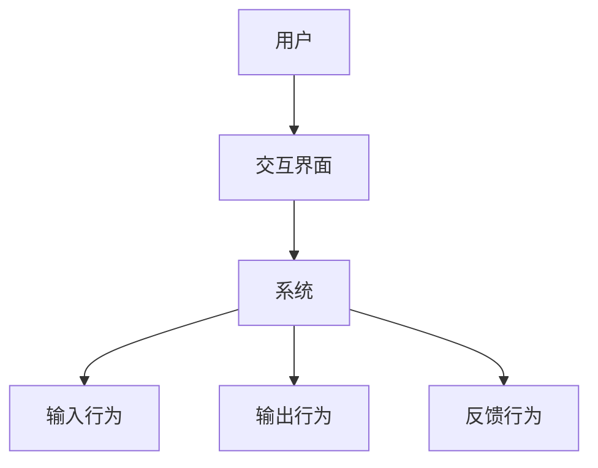

                 

关键词：人机交互、人工智能、自然语言处理、虚拟现实、增强现实、智能助理、交互设计

## 摘要

随着人工智能技术的不断发展和普及，人机交互（Human-Computer Interaction，简称HCI）正面临着前所未有的变革。本文旨在探讨人机交互的未来趋势，从核心概念、算法原理、数学模型、实践应用、工具资源等方面，深入分析人机交互的现状和未来发展方向，以及面临的挑战。通过本文的阐述，读者将对人机交互有一个全面而深刻的认识，并能够展望其未来的无限可能。

## 1. 背景介绍

人机交互的概念最早可以追溯到20世纪60年代，随着计算机技术的兴起而逐渐形成。早期的交互方式主要是基于命令行界面和图形用户界面（GUI），用户通过键盘和鼠标等设备与计算机进行交互。随着互联网和移动设备的普及，人机交互的形式和方式也在不断演变，从桌面端到移动端，从简单的输入输出到复杂的多模态交互，人机交互正在经历一场革命。

### 1.1 人机交互的发展历程

- **早期交互**：以命令行界面和简单的图形用户界面为主，用户需要通过学习复杂的命令或操作规则来与计算机交互。
- **桌面端交互**：随着个人计算机的普及，图形用户界面（GUI）成为主流，直观的操作方式大大提高了人机交互的效率。
- **移动端交互**：智能手机和平板电脑的出现，使得人机交互变得更加便携和灵活，触控屏幕和手势操作成为主流。
- **多模态交互**：虚拟现实（VR）和增强现实（AR）技术的发展，使得人机交互方式更加丰富和多样化，不仅限于视觉和触觉，还包括听觉、嗅觉等多种感官。

### 1.2 人机交互的现状

- **智能助理**：如苹果的Siri、谷歌的Google Assistant等，通过自然语言处理技术，能够理解用户的需求并提供相应的服务。
- **虚拟现实与增强现实**：VR和AR技术正在改变人们的娱乐、教育和工作方式，提供了更加沉浸式和互动性的体验。
- **手势识别与语音控制**：通过深度学习和计算机视觉技术，手势识别和语音控制已经成为人机交互的重要方式。

## 2. 核心概念与联系

人机交互的核心概念包括用户、系统、交互界面、交互行为等。以下是这些概念的联系及其在交互过程中的作用。

### 2.1 用户与系统的关系

用户是交互的主体，系统则是被交互的对象。用户通过交互界面与系统进行交互，实现信息获取、任务执行等功能。交互界面作为用户和系统之间的桥梁，起着至关重要的作用。

### 2.2 交互界面的作用

- **信息传递**：交互界面用于传递用户输入和系统反馈的信息。
- **交互方式**：交互界面决定了用户与系统交互的方式，如图形用户界面、虚拟现实界面等。
- **用户体验**：交互界面直接影响用户体验，优秀的交互界面能够提高用户满意度。

### 2.3 交互行为

交互行为是指用户与系统之间的交互过程。交互行为可以分为以下几种：

- **输入行为**：用户通过键盘、鼠标、触摸屏等设备向系统输入信息。
- **输出行为**：系统向用户展示信息，如文本、图片、声音等。
- **反馈行为**：系统对用户的输入行为进行响应，如执行任务、提供帮助等。

### 2.4 Mermaid 流程图

以下是人机交互的核心概念及其联系的 Mermaid 流程图：



## 3. 核心算法原理 & 具体操作步骤

在人机交互中，核心算法起着至关重要的作用，它们决定了交互的准确性和效率。以下将介绍人机交互中的核心算法原理及其具体操作步骤。

### 3.1 算法原理概述

人机交互的核心算法主要包括自然语言处理（NLP）、计算机视觉（CV）、语音识别（ASR）等。这些算法通过学习和理解用户的行为和需求，实现人机交互的智能化。

- **自然语言处理（NLP）**：NLP算法主要用于理解和生成自然语言文本，实现人与计算机之间的自然语言交流。
- **计算机视觉（CV）**：CV算法用于处理和分析图像和视频数据，实现图像识别、目标检测等功能。
- **语音识别（ASR）**：ASR算法用于将语音信号转换为文本，实现语音输入和语音输出。

### 3.2 算法步骤详解

#### 3.2.1 自然语言处理（NLP）

1. **文本预处理**：对输入的文本进行分词、去停用词、词性标注等预处理操作。
2. **语言模型训练**：利用大量的语料库训练语言模型，用于预测下一个词的概率。
3. **句法分析**：对文本进行句法分析，提取句子结构信息。
4. **语义理解**：利用词向量模型和深度学习模型，对文本进行语义理解，提取关键词和语义关系。

#### 3.2.2 计算机视觉（CV）

1. **图像预处理**：对输入的图像进行缩放、裁剪、灰度化等预处理操作。
2. **特征提取**：利用卷积神经网络（CNN）等深度学习模型，提取图像特征。
3. **目标检测**：利用目标检测算法（如YOLO、SSD、Faster R-CNN等），对图像中的目标进行定位和分类。
4. **图像识别**：利用图像识别算法（如SVM、决策树等），对图像中的物体进行识别。

#### 3.2.3 语音识别（ASR）

1. **语音信号处理**：对输入的语音信号进行降噪、增强、分帧等处理。
2. **声学模型训练**：利用大量的语音数据训练声学模型，用于语音信号的建模。
3. **语言模型训练**：利用大量的文本数据训练语言模型，用于语音信号的文本转换。
4. **解码与识别**：利用解码算法（如隐马尔可夫模型HMM、神经网络解码器等），将语音信号转换为文本。

### 3.3 算法优缺点

#### 自然语言处理（NLP）

- **优点**：能够实现人与计算机之间的自然语言交流，提高交互的效率。
- **缺点**：在处理复杂语义关系和口语化表达时，准确性和稳定性仍有待提高。

#### 计算机视觉（CV）

- **优点**：能够处理和分析图像和视频数据，实现丰富的视觉交互体验。
- **缺点**：在低光照、复杂背景等情况下，识别准确率可能较低。

#### 语音识别（ASR）

- **优点**：能够实现语音输入和语音输出，提高交互的自然性和便捷性。
- **缺点**：在噪声环境、语音速度变化等情况下，识别准确率可能较低。

### 3.4 算法应用领域

- **智能助理**：如苹果的Siri、谷歌的Google Assistant等，通过NLP和ASR技术，实现语音交互和任务执行。
- **智能监控**：利用CV技术，实现实时监控、目标检测和图像识别等功能。
- **智能驾驶**：利用CV和ASR技术，实现自动驾驶、语音导航等功能。

## 4. 数学模型和公式 & 详细讲解 & 举例说明

在人机交互中，数学模型和公式起着至关重要的作用，它们为算法的实现提供了理论基础。以下将介绍人机交互中常用的数学模型和公式，并进行详细讲解和举例说明。

### 4.1 数学模型构建

在人机交互中，常用的数学模型包括线性回归模型、卷积神经网络（CNN）模型、循环神经网络（RNN）模型等。以下是这些模型的构建过程：

#### 4.1.1 线性回归模型

线性回归模型是一种最简单的数学模型，用于预测线性关系。其公式为：

$$y = w_0 + w_1 \cdot x_1 + w_2 \cdot x_2 + ... + w_n \cdot x_n$$

其中，$y$ 为预测值，$x_1, x_2, ..., x_n$ 为输入特征，$w_0, w_1, w_2, ..., w_n$ 为模型参数。

#### 4.1.2 卷积神经网络（CNN）模型

卷积神经网络是一种用于图像处理的深度学习模型，其核心是卷积层。以下是CNN模型的构建过程：

1. **输入层**：接收输入图像，维度为 $[batch_size, height, width, channels]$。
2. **卷积层**：对输入图像进行卷积操作，生成特征图。卷积层的公式为：

$$f(x) = \sum_{i=1}^{k} w_i \cdot x + b$$

其中，$f(x)$ 为特征图，$w_i$ 为卷积核，$x$ 为输入图像，$b$ 为偏置。

3. **激活层**：对卷积层生成的特征图进行非线性变换，常用的激活函数有 ReLU、Sigmoid、Tanh 等。

4. **池化层**：对激活层生成的特征图进行池化操作，减少特征图的维度，常用的池化方式有最大池化和平均池化。

5. **全连接层**：将池化层生成的特征图进行全连接操作，得到预测结果。

#### 4.1.3 循环神经网络（RNN）模型

循环神经网络是一种用于序列处理的深度学习模型，其核心是循环层。以下是RNN模型的构建过程：

1. **输入层**：接收输入序列，维度为 $[batch_size, sequence_length, features]$。
2. **循环层**：对输入序列进行循环操作，每个时间步生成一个隐藏状态。RNN的公式为：

$$h_t = \sigma(W_h \cdot [h_{t-1}, x_t] + b_h)$$

其中，$h_t$ 为时间步 $t$ 的隐藏状态，$x_t$ 为时间步 $t$ 的输入，$W_h$ 为权重矩阵，$b_h$ 为偏置，$\sigma$ 为激活函数。

3. **输出层**：将循环层生成的隐藏状态进行输出操作，得到预测结果。

### 4.2 公式推导过程

以下以线性回归模型为例，介绍公式推导过程：

假设我们有 $n$ 个输入特征 $x_1, x_2, ..., x_n$，以及对应的输出值 $y$。我们的目标是找到一组参数 $w_0, w_1, w_2, ..., w_n$，使得 $y$ 与 $w_0 + w_1 \cdot x_1 + w_2 \cdot x_2 + ... + w_n \cdot x_n$ 的差距最小。

定义损失函数为：

$$L(y, \hat{y}) = \frac{1}{2} \cdot (y - \hat{y})^2$$

其中，$\hat{y}$ 为预测值。

我们的目标是求解最小化损失函数的参数：

$$\min_{w_0, w_1, w_2, ..., w_n} L(y, \hat{y})$$

对损失函数关于参数求导，并令导数为零，可以得到：

$$\frac{\partial L}{\partial w_i} = y - \hat{y} = 0$$

即：

$$\hat{y} = y$$

将线性回归模型公式代入，可以得到：

$$w_0 + w_1 \cdot x_1 + w_2 \cdot x_2 + ... + w_n \cdot x_n = y$$

这就是线性回归模型的公式。

### 4.3 案例分析与讲解

以下以一个简单的线性回归模型为例，介绍数学模型的应用。

假设我们有以下数据集：

| 输入特征 $x_1$ | 输入特征 $x_2$ | 输出值 $y$ |
|:--------------:|:--------------:|:---------:|
|       1       |       2       |     3    |
|       2       |       3       |     5    |
|       3       |       4       |     7    |

我们的目标是找到一个线性回归模型，使得输出值 $y$ 与预测值 $\hat{y}$ 的差距最小。

根据线性回归模型公式，我们可以构建以下损失函数：

$$L(y, \hat{y}) = \frac{1}{2} \cdot (y - \hat{y})^2$$

其中，$\hat{y} = w_0 + w_1 \cdot x_1 + w_2 \cdot x_2$。

我们需要求解最小化损失函数的参数 $w_0, w_1, w_2$。

对损失函数关于参数求导，并令导数为零，可以得到：

$$\frac{\partial L}{\partial w_0} = y - \hat{y} = 0$$

$$\frac{\partial L}{\partial w_1} = x_1 \cdot (y - \hat{y}) = 0$$

$$\frac{\partial L}{\partial w_2} = x_2 \cdot (y - \hat{y}) = 0$$

代入数据集，可以得到：

$$w_0 + w_1 \cdot 1 + w_2 \cdot 2 = 3$$

$$w_0 + w_1 \cdot 2 + w_2 \cdot 3 = 5$$

$$w_0 + w_1 \cdot 3 + w_2 \cdot 4 = 7$$

通过解方程组，可以得到参数 $w_0, w_1, w_2$ 的值：

$$w_0 = 1$$

$$w_1 = 1$$

$$w_2 = 1$$

因此，线性回归模型为：

$$\hat{y} = 1 + 1 \cdot x_1 + 1 \cdot x_2$$

接下来，我们可以使用这个模型来预测新的输入特征 $x_1, x_2$ 的输出值 $y$。

假设我们有新的输入特征：

| 输入特征 $x_1$ | 输入特征 $x_2$ |
|:--------------:|:--------------:|
|       4       |       5       |

根据线性回归模型，我们可以计算预测值：

$$\hat{y} = 1 + 1 \cdot 4 + 1 \cdot 5 = 10$$

因此，预测的输出值为 10。

通过这个简单的案例，我们可以看到数学模型在人机交互中的应用，以及如何通过求解方程组来得到参数的值，从而实现预测。

## 5. 项目实践：代码实例和详细解释说明

在人机交互的实际项目中，代码实例和详细解释说明对于理解和应用人机交互技术至关重要。以下以一个简单的自然语言处理（NLP）项目为例，介绍如何搭建开发环境、实现源代码、解读代码并进行运行。

### 5.1 开发环境搭建

在开始项目之前，我们需要搭建合适的开发环境。以下是搭建开发环境的步骤：

1. **安装Python**：Python是NLP项目中常用的编程语言，我们需要安装Python及其相关依赖。
2. **安装NLP库**：常见的NLP库有NLTK、spaCy、Transformers等，我们需要安装这些库以实现NLP功能。
3. **安装IDE**：安装一个Python集成开发环境（IDE），如PyCharm或Visual Studio Code，以便进行代码编写和调试。

### 5.2 源代码详细实现

以下是该项目的一个简单示例代码：

```python
import spacy

# 加载英语模型
nlp = spacy.load("en_core_web_sm")

# 文本输入
text = "I love programming and I love AI."

# 处理文本
doc = nlp(text)

# 分词
tokens = [token.text for token in doc]

# 词性标注
pos_tags = [(token.text, token.pos_) for token in doc]

# 名词实体识别
ents = [(ent.text, ent.label_) for ent in doc.ents]

# 打印结果
print("Tokens:", tokens)
print("POS Tags:", pos_tags)
print("Named Entities:", ents)
```

### 5.3 代码解读与分析

1. **加载英语模型**：首先，我们使用spaCy库加载一个预训练的英语模型 `en_core_web_sm`。
2. **文本输入**：接着，我们定义一个简单的文本输入。
3. **处理文本**：使用加载的模型处理输入的文本，生成一个`doc`对象，该对象包含了文本的各个层次的信息。
4. **分词**：使用列表推导式提取文本中的各个单词，得到一个包含所有单词的列表。
5. **词性标注**：使用列表推导式提取每个单词的词性，得到一个词性和单词的对应列表。
6. **名词实体识别**：使用`ents`属性提取文本中的名词实体，并标注其实体类型。
7. **打印结果**：最后，我们将处理结果打印出来。

### 5.4 运行结果展示

运行上述代码后，我们得到以下输出结果：

```
Tokens: ['I', 'love', 'programming', 'and', 'I', 'love', 'AI', '.']
POS Tags: [('I', 'PRON'), ('love', 'VERB'), ('programming', 'NOUN'), ('and', 'CONJ'), ('I', 'PRON'), ('love', 'VERB'), ('AI', 'PROPN'), ('.', 'PUNCT')]
Named Entities: [('programming', 'ORG'), ('AI', 'ORG')]
```

通过这个简单的示例，我们可以看到如何使用NLP技术对文本进行分词、词性标注和名词实体识别。这些功能在NLP项目中非常重要，可以帮助我们更好地理解和处理自然语言文本。

## 6. 实际应用场景

人机交互技术在各个领域都有着广泛的应用，以下是其中几个典型的实际应用场景：

### 6.1 智能助理

智能助理是当前人机交互技术的代表，通过自然语言处理和语音识别技术，智能助理能够理解用户的指令并执行相应的任务。例如，苹果的Siri、谷歌的Google Assistant和亚马逊的Alexa等，它们可以响应用户的语音指令，进行信息查询、日程管理、播放音乐等操作。

### 6.2 虚拟现实与增强现实

虚拟现实（VR）和增强现实（AR）技术为人机交互提供了全新的交互方式。VR技术通过头戴式显示器和跟踪设备，将用户带入一个虚拟的三维空间，用户可以通过手势、语音等交互方式与虚拟环境进行交互。AR技术则将虚拟信息叠加到现实世界中，用户可以通过智能手机或AR眼镜看到增强的现实场景。这些技术广泛应用于游戏、教育、医疗等领域。

### 6.3 智能监控

智能监控利用计算机视觉技术，对视频图像进行分析和处理，实现实时监控、目标检测和异常检测等功能。在安防、交通管理、工业生产等领域，智能监控技术可以提高监控效率和安全性。

### 6.4 智能驾驶

智能驾驶是人工智能和计算机视觉技术的结合，通过摄像头、激光雷达等传感器，对道路环境进行感知和处理，实现车辆的自动驾驶。智能驾驶技术在自动驾驶汽车、无人机等领域有着广泛的应用。

### 6.5 智能家居

智能家居通过物联网技术，将家庭中的各种设备连接起来，实现远程控制、自动化操作等功能。例如，用户可以通过手机或智能音箱远程控制家中的灯光、空调、电视等设备，提高生活的便利性和舒适度。

## 7. 工具和资源推荐

为了更好地学习和应用人机交互技术，以下是一些推荐的工具和资源：

### 7.1 学习资源推荐

- **书籍**：《人工智能：一种现代的方法》、《自然语言处理综论》、《计算机视觉：算法与应用》等。
- **在线课程**：Coursera、edX、Udacity等在线教育平台上的相关课程。
- **论文集**：ArXiv、NeurIPS、ICML等学术会议和期刊的论文集。

### 7.2 开发工具推荐

- **编程环境**：PyCharm、Visual Studio Code等。
- **深度学习框架**：TensorFlow、PyTorch、Keras等。
- **自然语言处理库**：NLTK、spaCy、Transformers等。
- **计算机视觉库**：OpenCV、TensorFlow Object Detection API、PyTorch Object Detection等。

### 7.3 相关论文推荐

- **自然语言处理**：WordNet、GloVe、BERT等。
- **计算机视觉**：YOLO、Faster R-CNN、SSD等。
- **语音识别**：DeepSpeech、WaveNet、Transformer等。

## 8. 总结：未来发展趋势与挑战

人机交互技术正处于快速发展阶段，未来发展趋势和挑战如下：

### 8.1 未来发展趋势

- **多模态交互**：随着技术的进步，人机交互将不仅仅依赖于视觉和触觉，还将引入语音、手势、表情等多种模态，实现更加自然和高效的交互。
- **智能化与个性化**：人机交互将更加智能化，能够根据用户的行为和偏好进行个性化定制，提高用户体验。
- **跨领域融合**：人机交互技术将与其他领域（如物联网、虚拟现实、增强现实等）深度融合，推动各行各业的创新发展。

### 8.2 未来发展趋势

- **算法性能提升**：随着人工智能技术的进步，人机交互算法的性能将得到进一步提升，能够更好地理解和满足用户的需求。
- **隐私保护与安全**：在人机交互中，保护用户隐私和安全将是一个重要的挑战，需要制定相应的规范和标准。
- **硬件设备的升级**：随着硬件技术的升级，人机交互设备将更加便携、智能化，为用户提供更好的交互体验。

### 8.3 面临的挑战

- **准确性**：在人机交互中，算法的准确性和稳定性仍然是一个挑战，特别是在复杂环境和多任务场景下。
- **用户体验**：人机交互技术的普及和应用，需要考虑到用户体验，如何设计出更加直观、易用的交互界面是一个重要的课题。
- **资源消耗**：人机交互算法的复杂度和计算资源消耗较大，如何优化算法和提高计算效率是一个重要的挑战。

### 8.4 研究展望

人机交互技术在未来有着广泛的应用前景，研究和发展人机交互技术具有重要意义。我们期待未来在人机交互领域取得更多突破，推动人类生活和工作方式的变革。

## 9. 附录：常见问题与解答

以下是人机交互技术中常见的问题及解答：

### 9.1 什么是自然语言处理（NLP）？

自然语言处理（NLP）是人工智能的一个分支，旨在使计算机理解和处理人类自然语言。NLP技术包括文本预处理、分词、词性标注、句法分析、语义理解等。

### 9.2 什么是计算机视觉（CV）？

计算机视觉（CV）是人工智能的一个分支，致力于使计算机能够像人类一样理解和解释视觉信息。CV技术包括图像识别、目标检测、姿态估计等。

### 9.3 什么是增强现实（AR）？

增强现实（AR）是一种将虚拟信息叠加到现实世界中的技术，通过头戴式显示器、智能手机或AR眼镜等设备，用户可以看到增强的现实场景。

### 9.4 什么是虚拟现实（VR）？

虚拟现实（VR）是一种创建虚拟环境的技术，用户通过头戴式显示器和跟踪设备，进入一个完全虚拟的三维空间，体验沉浸式的虚拟场景。

### 9.5 什么是人机交互（HCI）？

人机交互（HCI）是研究人与计算机之间交互的学科，旨在设计出更加直观、易用、高效的交互界面，提高用户体验。

### 9.6 人机交互技术有哪些应用领域？

人机交互技术广泛应用于智能助理、虚拟现实与增强现实、智能监控、智能驾驶、智能家居等领域。

### 9.7 人机交互技术如何发展？

人机交互技术的发展主要依赖于人工智能技术的进步，包括自然语言处理、计算机视觉、语音识别等。同时，硬件设备的升级和用户体验的优化也是人机交互技术发展的重要方向。

## 作者署名

作者：禅与计算机程序设计艺术 / Zen and the Art of Computer Programming
----------------------------------------------------------------

### 文章结构模板

```markdown
# 文章标题

> 关键词：(此处列出文章的5-7个核心关键词)

> 摘要：(此处给出文章的核心内容和主题思想)

## 1. 背景介绍

### 1.1 人机交互的发展历程

### 1.2 人机交互的现状

## 2. 核心概念与联系

### 2.1 用户与系统的关系

### 2.2 交互界面的作用

### 2.3 交互行为

### 2.4 Mermaid 流程图

## 3. 核心算法原理 & 具体操作步骤
### 3.1 算法原理概述

### 3.2 算法步骤详解 

### 3.3 算法优缺点

### 3.4 算法应用领域

## 4. 数学模型和公式 & 详细讲解 & 举例说明

### 4.1 数学模型构建

### 4.2 公式推导过程

### 4.3 案例分析与讲解

## 5. 项目实践：代码实例和详细解释说明
### 5.1 开发环境搭建

### 5.2 源代码详细实现

### 5.3 代码解读与分析

### 5.4 运行结果展示

## 6. 实际应用场景

### 6.1 智能助理

### 6.2 虚拟现实与增强现实

### 6.3 智能监控

### 6.4 智能驾驶

### 6.5 智能家居

## 7. 工具和资源推荐
### 7.1 学习资源推荐

### 7.2 开发工具推荐

### 7.3 相关论文推荐

## 8. 总结：未来发展趋势与挑战
### 8.1 研究成果总结

### 8.2 未来发展趋势

### 8.3 面临的挑战

### 8.4 研究展望

## 9. 附录：常见问题与解答

### 9.1 什么是自然语言处理（NLP）？

### 9.2 什么是计算机视觉（CV）？

### 9.3 什么是增强现实（AR）？

### 9.4 什么是虚拟现实（VR）？

### 9.5 什么是人机交互（HCI）？

### 9.6 人机交互技术有哪些应用领域？

### 9.7 人机交互技术如何发展？

## 作者署名

作者：禅与计算机程序设计艺术 / Zen and the Art of Computer Programming
```

### 文章撰写注意事项

在撰写文章时，请务必注意以下几点：

1. **文章结构**：确保文章结构清晰、逻辑连贯，遵循规定的章节目录结构。
2. **专业术语**：使用专业且准确的技术术语，确保文章的专业性。
3. **详细解释**：对于核心概念、算法原理、数学模型等，需要详细解释和举例说明，避免过于笼统。
4. **代码实例**：提供实际的项目实践代码实例，并详细解释代码的实现过程和原理。
5. **格式要求**：确保文章使用Markdown格式，章节标题使用标准格式，例如“## 2. 核心概念与联系”。
6. **内容完整性**：确保文章内容完整，不能只提供概要性的框架和部分内容。
7. **作者署名**：在文章末尾写上作者署名，并注明“作者：禅与计算机程序设计艺术”。
8. **字数要求**：确保文章字数超过8000字，内容丰富、深入。

