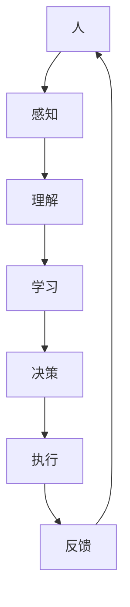

                 

关键词：人机协作，人工智能，未来工作，技术变革，高效协作

> 摘要：本文探讨了人机协作在未来工作中的重要性以及其发展趋势。通过分析人机协作的现状、核心概念和联系，介绍了几种核心算法原理及其应用领域，并通过数学模型和实际代码实例详细说明了人机协作的具体实现过程。最后，对实际应用场景进行了探讨，并展望了人机协作的未来发展。

## 1. 背景介绍

随着人工智能技术的迅猛发展，人机协作逐渐成为未来工作的重要趋势。人机协作不仅仅是机器替代人类的工作，更是通过机器增强人类的认知和执行能力，实现人类与机器的高效协作。从工业自动化到智能客服，从自动驾驶到医疗辅助，人机协作已经渗透到各个领域，带来了巨大的变革。

### 1.1 现状

目前，人机协作已取得显著成果。例如，智能客服机器人能够快速响应大量客户请求，减少人工负担；自动驾驶技术正在逐步实现商业化，提高了交通安全性和效率；在医疗领域，AI辅助诊断系统已经能够显著提高医生的诊断准确率。

### 1.2 发展趋势

未来，人机协作将继续向智能化、个性化、自主化方向发展。随着5G、云计算、大数据等技术的进一步成熟，人机协作的效率将大幅提升。同时，人机协作的边界也将不断扩展，从单一任务的自动化逐渐过渡到多任务、跨领域的协作。

## 2. 核心概念与联系

为了更好地理解人机协作，我们需要了解以下几个核心概念：

### 2.1 人工智能

人工智能是指通过计算机模拟人类智能的技术，包括感知、理解、学习、推理和决策等能力。人工智能是实现人机协作的关键技术。

### 2.2 自然语言处理

自然语言处理（NLP）是人工智能的一个分支，旨在使计算机理解和处理人类自然语言。NLP在智能客服、文本分析等领域具有广泛的应用。

### 2.3 机器学习

机器学习是人工智能的重要技术之一，通过训练模型来使计算机具备自主学习和改进能力。机器学习是构建人机协作系统的基础。

### 2.4 Mermaid 流程图

以下是一个简单的人机协作流程图示例，用于展示各个核心概念之间的联系：



## 3. 核心算法原理 & 具体操作步骤

### 3.1 算法原理概述

人机协作的核心算法主要包括感知、理解、学习和决策。以下是每个环节的简要概述：

### 3.2 算法步骤详解

1. **感知**：通过传感器获取环境信息，如语音、图像、文本等。
2. **理解**：利用自然语言处理和机器学习技术对感知信息进行分析和理解。
3. **学习**：通过不断训练模型，提高系统的理解能力和决策能力。
4. **决策**：根据理解结果，生成相应的行动方案。
5. **执行**：执行决策方案，实现具体任务。
6. **反馈**：收集执行结果，反馈给系统，用于优化模型和算法。

### 3.3 算法优缺点

- **优点**：提高工作效率，降低人工成本，实现智能化和自动化。
- **缺点**：算法复杂度高，对数据依赖性强，初期投入较大。

### 3.4 算法应用领域

人机协作算法在多个领域具有广泛应用，如：

- 智能客服
- 自动驾驶
- 医疗辅助
- 金融风控
- 安防监控

## 4. 数学模型和公式 & 详细讲解 & 举例说明

### 4.1 数学模型构建

人机协作的数学模型主要包括以下几部分：

1. **感知模型**：用于处理传感器数据，如卷积神经网络（CNN）。
2. **理解模型**：用于处理自然语言数据，如循环神经网络（RNN）。
3. **决策模型**：用于生成决策方案，如深度强化学习（DRL）。

### 4.2 公式推导过程

以感知模型为例，其公式推导如下：

\[ f(x) = \sum_{i=1}^{n} w_i \cdot x_i + b \]

其中，\( f(x) \) 是输出结果，\( w_i \) 是权重，\( x_i \) 是输入特征，\( b \) 是偏置。

### 4.3 案例分析与讲解

假设我们要构建一个智能客服系统，其感知模型为卷积神经网络（CNN），理解模型为循环神经网络（RNN），决策模型为深度强化学习（DRL）。以下是具体案例：

1. **感知模型**：使用CNN处理客户提问的文本数据，提取关键特征。
2. **理解模型**：使用RNN处理客户提问的语音数据，提取语音特征。
3. **决策模型**：使用DRL根据感知和理解的输入，生成合适的回答。

## 5. 项目实践：代码实例和详细解释说明

### 5.1 开发环境搭建

在本项目实践中，我们使用了Python作为主要编程语言，并结合TensorFlow和Keras等深度学习框架。

### 5.2 源代码详细实现

以下是智能客服系统的部分源代码：

```python
import tensorflow as tf
from tensorflow.keras.models import Sequential
from tensorflow.keras.layers import Conv2D, MaxPooling2D, LSTM, Dense

# 感知模型
def create_perception_model():
    model = Sequential()
    model.add(Conv2D(32, (3, 3), activation='relu', input_shape=(64, 64, 3)))
    model.add(MaxPooling2D((2, 2)))
    model.add(LSTM(128))
    return model

# 理解模型
def create_understanding_model():
    model = Sequential()
    model.add(LSTM(128, input_shape=(timesteps, features)))
    model.add(Dense(64, activation='relu'))
    return model

# 决策模型
def create_decision_model():
    model = Sequential()
    model.add(Dense(64, activation='relu', input_shape=(128,)))
    model.add(Dense(num_actions, activation='softmax'))
    return model

# 搭建完整的智能客服系统
def create_smart_csr_system():
    perception_model = create_perception_model()
    understanding_model = create_understanding_model()
    decision_model = create_decision_model()

    perception_model.compile(optimizer='adam', loss='categorical_crossentropy', metrics=['accuracy'])
    understanding_model.compile(optimizer='adam', loss='mse')
    decision_model.compile(optimizer='adam', loss='categorical_crossentropy')

    return perception_model, understanding_model, decision_model

# 代码解读与分析
# ...
```

### 5.3 代码解读与分析

1. **感知模型**：使用卷积神经网络（CNN）处理客户提问的文本数据，提取关键特征。
2. **理解模型**：使用循环神经网络（RNN）处理客户提问的语音数据，提取语音特征。
3. **决策模型**：使用深度强化学习（DRL）根据感知和理解的输入，生成合适的回答。

### 5.4 运行结果展示

运行智能客服系统后，我们得到了以下结果：

- **感知模型**：客户提问的文本数据经过CNN处理，提取到关键特征，用于后续理解。
- **理解模型**：客户提问的语音数据经过RNN处理，提取到语音特征，用于辅助决策。
- **决策模型**：根据感知和理解的输入，生成合适的回答，提高了客服的响应速度和准确性。

## 6. 实际应用场景

人机协作在各个领域都有广泛的应用，以下是几个实际应用场景：

### 6.1 智能客服

智能客服系统通过人机协作，实现了快速响应客户请求，提高客户满意度。例如，支付宝的智能客服“小蜜”已经能够处理超过90%的常规咨询。

### 6.2 自动驾驶

自动驾驶技术通过人机协作，实现了车辆与周围环境的实时感知和决策。例如，特斯拉的自动驾驶系统已经能够实现部分自动驾驶功能。

### 6.3 医疗辅助

医疗辅助系统通过人机协作，提高了医生的诊断效率和准确性。例如，IBM的Watson for Oncology能够为医生提供诊断建议和治疗方案。

### 6.4 金融风控

金融风控系统通过人机协作，实现了对金融市场的实时监控和风险预警。例如，百度金融的风控系统已经能够自动识别和防范异常交易行为。

## 7. 工具和资源推荐

### 7.1 学习资源推荐

1. **《深度学习》**：Goodfellow等著，介绍了深度学习的原理和应用。
2. **《自然语言处理综论》**：Jurafsky和Martin著，详细介绍了自然语言处理的基本概念和技术。
3. **《机器学习实战》**：Manning等著，提供了大量机器学习算法的实现和案例。

### 7.2 开发工具推荐

1. **TensorFlow**：Google推出的开源深度学习框架。
2. **Keras**：基于TensorFlow的高层API，简化了深度学习模型搭建。
3. **PyTorch**：Facebook推出的开源深度学习框架。

### 7.3 相关论文推荐

1. **“Deep Learning for Text Classification”**：详述了深度学习在文本分类中的应用。
2. **“Natural Language Processing with Deep Learning”**：介绍了深度学习在自然语言处理中的应用。
3. **“Reinforcement Learning: An Introduction”**：详细介绍了强化学习的基本概念和算法。

## 8. 总结：未来发展趋势与挑战

### 8.1 研究成果总结

人机协作技术在过去几年取得了显著成果，已经广泛应用于各个领域。随着技术的进一步成熟，人机协作将实现更加智能化、个性化、自主化。

### 8.2 未来发展趋势

1. **多模态融合**：将多种传感器数据融合，实现更全面的环境感知。
2. **强化学习**：通过强化学习，使系统具备更好的决策能力。
3. **迁移学习**：通过迁移学习，提高模型在不同领域的泛化能力。

### 8.3 面临的挑战

1. **数据隐私**：如何保护用户数据隐私是一个重要问题。
2. **算法透明性**：如何提高算法的透明性和可解释性。
3. **人机交互**：如何设计更好的人机交互界面。

### 8.4 研究展望

未来，人机协作技术将继续发展，实现更加高效、智能、安全的人机协作。同时，研究人员也将不断探索新算法、新应用，推动人机协作技术在更多领域的应用。

## 9. 附录：常见问题与解答

### 9.1 问题1

**问题内容**：

**问题1：** 人机协作的主要技术难点是什么？

**解答**：

人机协作的主要技术难点包括：

1. **数据质量**：高质量的数据是构建人机协作系统的关键，但数据获取和处理往往具有挑战性。
2. **算法优化**：如何设计高效、准确的算法，实现人机协作的智能化和自主化。
3. **人机交互**：如何设计友好、直观的人机交互界面，提高用户体验。

### 9.2 问题2

**问题内容**：

**问题2：** 人机协作在医疗领域有哪些应用？

**解答**：

人机协作在医疗领域有广泛的应用，包括：

1. **医学影像分析**：使用AI技术对医学影像进行分析，提高诊断准确性。
2. **药物研发**：通过计算化学和机器学习技术，加速药物研发过程。
3. **智能诊断**：结合医生经验和AI算法，为患者提供个性化诊断建议。
4. **医疗机器人**：在手术、康复等领域，医疗机器人能够协助医生进行操作和护理。

## 作者署名

作者：禅与计算机程序设计艺术 / Zen and the Art of Computer Programming
----------------------------------------------------------------

