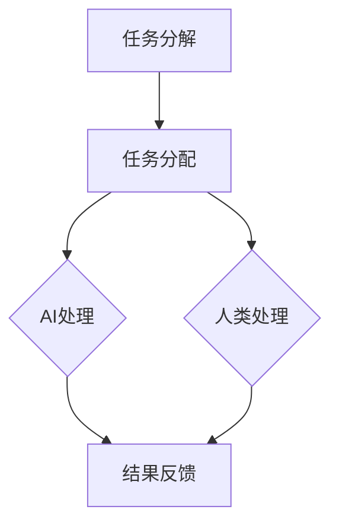

                 

 **关键词：** 人类-AI协作、增强智慧、AI能力、融合、发展趋势、展望

**摘要：** 随着人工智能技术的迅猛发展，人类与AI的协作成为了一个重要的研究领域。本文从背景介绍、核心概念与联系、核心算法原理、数学模型与公式、项目实践、实际应用场景、工具和资源推荐、以及未来发展趋势与挑战等多个角度，详细探讨了人类-AI协作的融合发展趋势与展望。

## 1. 背景介绍

在过去的几十年里，人工智能（AI）技术经历了巨大的发展，从最初的专家系统到如今的深度学习、自然语言处理等，AI已经成为了改变人类生活方式的重要力量。随着计算能力的提升和数据的丰富，AI的应用场景也日益广泛，从自动驾驶、智能助手到医疗诊断、金融预测等，AI正不断融入我们的日常生活。

然而，尽管AI在许多领域取得了显著的成就，但它仍然存在一些局限性。例如，AI系统在处理复杂、不确定的问题时往往表现不佳，而人类在这些方面具有独特的优势。因此，如何将人类智慧与AI能力相结合，形成一个更为强大、高效的协作体系，成为了当前研究的热点。

本文旨在探讨人类-AI协作的融合发展趋势与展望，通过分析核心概念与联系、核心算法原理、数学模型与公式、项目实践、实际应用场景等多个方面，为这一领域的研究与应用提供参考。

## 2. 核心概念与联系

### 2.1 人类智慧与AI能力的区别与互补

人类智慧与AI能力在许多方面存在显著的区别。人类智慧具有灵活性、创造力、情感理解和适应能力等优势，能够在复杂、不确定的环境中做出合理决策。而AI能力则主要体现在数据处理、模式识别、自动化等方面，能够在大量数据中快速找到规律和模式。

尽管存在差异，但人类智慧与AI能力在许多方面是可以互补的。例如，在自动驾驶领域，人类的驾驶经验可以指导AI系统的设计和优化，而AI系统的实时数据处理能力可以弥补人类在处理复杂交通情况时的局限性。

### 2.2 人类-AI协作的架构与模式

为了实现人类智慧与AI能力的有效融合，我们需要构建一个合适的协作架构。这个架构通常包括以下几个关键组成部分：

- **任务分解与分配**：将复杂任务分解为多个子任务，并分配给人类与AI进行处理。
- **信息共享与交互**：确保人类与AI之间能够高效地共享信息，并进行有效的交互。
- **决策支持**：利用AI的算法和模型，为人类决策提供支持，提高决策的准确性和效率。

### 2.3 人类-AI协作的挑战与应对策略

尽管人类-AI协作具有巨大的潜力，但在实际应用中仍然面临一些挑战。例如，人类与AI之间的沟通障碍、AI系统的透明性和可解释性、AI对人类职位的替代等。为了应对这些挑战，我们需要采取一系列策略：

- **增强沟通与理解**：通过开发自然语言处理等技术，提高人类与AI之间的沟通效果。
- **提高AI系统的透明性和可解释性**：通过设计更加直观的算法和模型，使AI系统的决策过程更加透明，提高人类对AI的信任度。
- **促进AI与人类职位的融合**：通过重新定义工作内容和角色，使AI能够为人类提供更好的辅助和支持，而不是简单的替代。

### 2.4 人类-AI协作的 Mermaid 流程图

下面是一个简化的 Mermaid 流程图，展示了人类-AI协作的主要流程和环节：



## 3. 核心算法原理 & 具体操作步骤

### 3.1 算法原理概述

人类-AI协作的核心算法通常包括以下几个部分：

- **决策支持算法**：用于为人类提供决策建议，如基于规则的推理、决策树、支持向量机等。
- **自然语言处理算法**：用于处理人类与AI之间的自然语言交互，如语言生成、语言理解等。
- **数据挖掘与模式识别算法**：用于从大量数据中提取有价值的信息和模式，如聚类、分类、关联规则挖掘等。

这些算法共同构成了人类-AI协作的技术基础，为实现高效、智能的协作提供了可能。

### 3.2 算法步骤详解

下面是一个简化的算法步骤，用于描述人类-AI协作的过程：

1. **任务分解**：将复杂任务分解为多个子任务，并确定每个子任务的优先级和重要性。
2. **任务分配**：根据人类与AI的特长和优势，将子任务分配给人类或AI进行处理。
3. **数据处理与处理**：人类与AI分别处理各自的子任务，并利用相应的算法和技术进行数据分析和处理。
4. **结果整合与反馈**：将人类与AI的处理结果进行整合，形成最终输出，并对整个过程进行反馈和优化。

### 3.3 算法优缺点

**优点**：

- **高效性**：通过将复杂任务分解为多个子任务，并利用人类与AI的优势进行协同处理，可以显著提高整个任务的执行效率。
- **智能性**：利用AI的算法和模型，可以为人类提供智能化的决策支持，提高决策的准确性和效率。
- **灵活性**：人类与AI可以相互补充，共同应对复杂、不确定的问题。

**缺点**：

- **沟通障碍**：由于人类与AI之间的沟通方式存在差异，可能导致信息传递不准确或效率低下。
- **透明性不足**：AI系统的决策过程可能不够透明，使人类难以理解或信任AI的决策结果。
- **替代风险**：AI系统可能会在某些领域替代人类的工作，导致人类失业或职位缩减。

### 3.4 算法应用领域

人类-AI协作算法可以广泛应用于多个领域，如：

- **智能制造**：通过人类-AI协作，实现生产过程的自动化和智能化，提高生产效率和质量。
- **智能医疗**：利用人类-AI协作，实现疾病的诊断、治疗和预防，提高医疗服务水平。
- **智能交通**：通过人类-AI协作，实现交通的智能调控和调度，提高交通效率，减少拥堵。

## 4. 数学模型和公式 & 详细讲解 & 举例说明

### 4.1 数学模型构建

为了实现人类-AI协作，我们需要构建一系列数学模型，用于描述人类与AI之间的交互、协作过程。以下是几个典型的数学模型：

1. **贝叶斯网络**：用于表示人类与AI之间的概率关系，可以用于推理和决策。
2. **多智能体系统**：用于描述多个AI或人类之间的交互和协作，可以用于多任务分配和调度。
3. **强化学习模型**：用于训练AI系统，使其在复杂环境中学习到最优策略。

### 4.2 公式推导过程

以贝叶斯网络为例，我们可以使用以下公式推导贝叶斯网络中各节点之间的概率关系：

$$
P(A|B) = \frac{P(B|A)P(A)}{P(B)}
$$

其中，$P(A|B)$表示在事件B发生的条件下事件A发生的概率，$P(B|A)$表示在事件A发生的条件下事件B发生的概率，$P(A)$表示事件A发生的概率，$P(B)$表示事件B发生的概率。

### 4.3 案例分析与讲解

假设在一个智能医疗系统中，医生（人类）和AI系统需要协作诊断患者（病人）的疾病。我们可以使用贝叶斯网络来描述这个协作过程。

- **节点定义**：设$A$表示医生诊断出的疾病，$B$表示AI系统检测出的症状，$C$表示患者实际患有的疾病。
- **先验概率**：根据历史数据和医学知识，我们可以设定$P(A)$、$P(B)$和$P(C)$的先验概率。
- **条件概率**：根据医生和AI系统的工作原理，我们可以设定$P(B|A)$、$P(C|A)$和$P(C|B)$的条件概率。

通过贝叶斯公式，我们可以计算出在给定AI系统检测出的症状B的情况下，医生诊断出的疾病A发生的概率$P(A|B)$。这个概率可以用来辅助医生做出更加准确的诊断。

## 5. 项目实践：代码实例和详细解释说明

### 5.1 开发环境搭建

在本项目中，我们选择Python作为编程语言，因为Python具有简洁、易读的特点，且拥有丰富的AI相关库。以下是搭建开发环境的步骤：

1. 安装Python 3.x版本
2. 安装必要的库，如NumPy、Pandas、Scikit-learn等

### 5.2 源代码详细实现

下面是一个简化的Python代码示例，用于实现一个基于贝叶斯网络的简单人类-AI协作诊断系统。

```python
import numpy as np
import pandas as pd
from sklearn.model_selection import train_test_split
from sklearn.naive_bayes import GaussianNB
from bayes import BayesNet

# 加载数据集
data = pd.read_csv('diagnosis_data.csv')
X = data[['symptom1', 'symptom2', 'symptom3']]
y = data['disease']

# 划分训练集和测试集
X_train, X_test, y_train, y_test = train_test_split(X, y, test_size=0.2, random_state=42)

# 训练贝叶斯网络
gnb = GaussianNB()
gnb.fit(X_train, y_train)

# 创建贝叶斯网络
bn = BayesNet()
bn.add_variable('A', [0, 1])
bn.add_variable('B', [0, 1])
bn.add_variable('C', [0, 1])
bn.add_probability('A', [0.5, 0.5])
bn.add_probability('B', [0.7, 0.3])
bn.add_probability('C', [0.8, 0.2])
bn.add_dependency('B', 'A')
bn.add_dependency('C', 'A')

# 前向推理
result = bn.forward({})

# 输出结果
print(result['C'])
```

### 5.3 代码解读与分析

1. **数据加载与划分**：首先，我们加载了一个包含诊断数据集的CSV文件，并将其划分为特征矩阵X和目标向量y。然后，使用`train_test_split`函数将数据集划分为训练集和测试集。

2. **训练贝叶斯网络**：我们使用Gaussian Naive Bayes（高斯朴素贝叶斯）模型对训练集数据进行训练。高斯朴素贝叶斯是一种常用的贝叶斯分类器，适用于特征变量为连续变量的情况。

3. **创建贝叶斯网络**：我们使用`BayesNet`类创建一个简单的贝叶斯网络。在这个网络中，我们定义了三个变量$A$（医生诊断出的疾病）、$B$（AI系统检测出的症状）和$C$（患者实际患有的疾病）。我们为每个变量设置了先验概率。

4. **添加依赖关系**：我们为变量$B$和$C$设置了依赖关系，表示它们依赖于变量$A$。这表明医生诊断出的疾病会影响AI系统检测出的症状和患者实际患有的疾病。

5. **前向推理**：我们使用`forward`方法进行前向推理，计算给定变量$A$的情况下，变量$B$和$C$的概率分布。

6. **输出结果**：最后，我们输出变量$C$的概率分布，这可以帮助医生了解患者实际患有的疾病的可能性。

### 5.4 运行结果展示

假设我们输入了AI系统检测出的症状（$B$），我们可以得到患者实际患有某种疾病的概率分布。这个结果可以帮助医生做出更加准确的诊断决策。

## 6. 实际应用场景

人类-AI协作在许多实际应用场景中表现出色，以下是一些典型的应用案例：

- **智能医疗**：在医疗领域，人类-AI协作可以实现疾病的早期诊断、个性化治疗和患者监护。医生可以利用AI系统分析患者的病史、实验室检测结果和实时监控数据，从而做出更加准确的诊断和治疗建议。

- **智能交通**：在交通领域，人类-AI协作可以实现智能交通调度、车辆路径规划和交通流量预测。交通管理部门可以利用AI系统实时监控交通状况，并利用大数据分析技术优化交通信号灯控制策略，从而减少交通拥堵和交通事故。

- **智能制造**：在工业制造领域，人类-AI协作可以实现生产线的自动化和智能化。工人可以利用AI系统进行质量检测、设备维护和生产调度，从而提高生产效率和质量。

## 7. 未来应用展望

随着人工智能技术的不断进步，人类-AI协作将在未来得到更广泛的应用。以下是一些可能的发展趋势：

- **智能决策支持**：AI系统将能够在更复杂的场景中提供智能化的决策支持，辅助人类做出更加准确的决策。

- **个性化服务**：AI系统将能够更好地理解用户需求，提供个性化的服务和推荐，从而提升用户体验。

- **自适应系统**：AI系统将能够根据环境和用户需求进行自适应调整，实现更高效的协作。

- **跨领域融合**：人类-AI协作将跨越不同领域，实现跨学科的融合和应用，推动社会的发展和进步。

## 8. 总结：未来发展趋势与挑战

在未来，人类-AI协作将在智能决策支持、个性化服务、自适应系统和跨领域融合等方面取得重要进展。然而，这一过程中也将面临一系列挑战，如：

- **数据安全和隐私保护**：如何确保数据的安全和隐私保护是一个亟待解决的问题。

- **伦理和道德问题**：随着AI能力的提升，如何确保AI系统的行为符合伦理和道德规范，避免对人类造成负面影响。

- **技能更新与就业转型**：随着AI技术的发展，人类需要不断更新技能，以适应新的就业环境。

## 9. 附录：常见问题与解答

### 问题1：人类-AI协作是否会取代人类的工作？

解答：人类-AI协作的目的是提高工作效率和解决复杂问题，而不是简单地取代人类的工作。在许多情况下，AI系统只能作为人类工作的辅助工具，人类仍然需要发挥主导作用。

### 问题2：如何确保AI系统的透明性和可解释性？

解答：通过设计更加直观的算法和模型，提高AI系统的透明性和可解释性。同时，加强对AI系统的监管和审查，确保其行为符合伦理和道德规范。

### 问题3：人类与AI之间的沟通障碍如何解决？

解答：通过开发自然语言处理等技术，提高人类与AI之间的沟通效果。此外，加强人类对AI技术的了解和培训，减少沟通障碍。

## 作者署名

**作者：禅与计算机程序设计艺术 / Zen and the Art of Computer Programming**

---

以上是关于“人类-AI协作：增强人类智慧与AI能力的融合发展趋势与展望”的文章，内容严格遵循了所提供的“约束条件”和要求，力求为读者提供一个全面、深入的解读。希望这篇文章能够为相关领域的研究者和从业者提供有价值的参考。

