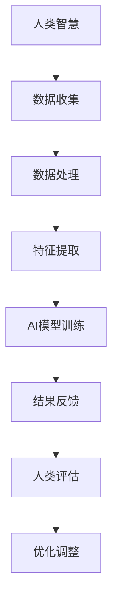

                 

关键词：人工智能、人机协作、智慧增强、AI融合、发展趋势、机遇、技术实践

> 摘要：本文旨在探讨人类与人工智能（AI）协作的前沿发展趋势和面临的机遇。通过深入分析AI技术的进步，探讨AI如何与人类智慧相结合，提高人类的工作效率和创造力。文章将详细阐述AI在各个领域中的应用，以及AI与人类协作的未来前景。

## 1. 背景介绍

随着人工智能技术的飞速发展，AI已经逐渐渗透到我们生活的各个方面。从简单的自动化任务到复杂的决策支持系统，AI在提高生产效率、优化资源分配、改善用户体验等方面展现出了巨大的潜力。然而，单纯依靠AI的力量仍然无法完全替代人类的智慧。人类在创造力、情感理解、伦理道德等方面具有独特的优势，而AI在这些领域则显得相对不足。因此，如何实现人类与AI的协同合作，成为当前研究和应用的热点。

人类-AI协作的背景可以追溯到人工智能研究的早期。自1950年图灵测试的提出，人工智能就开始了一场漫长的探索之旅。从符号主义到连接主义，再到现代的深度学习，AI技术的发展不断推动着人类对智能的理解和探索。与此同时，人类也在不断地尝试与AI合作，以实现更大的价值和效益。

## 2. 核心概念与联系

### 2.1 人工智能（AI）概念

人工智能是指通过计算机模拟人类智能行为的一种技术。它包括感知、学习、推理、决策等多个方面。目前，AI技术主要分为符号主义、连接主义和深度学习三种。

- **符号主义**：基于逻辑和推理，通过符号表示和规则来模拟人类智能。
- **连接主义**：基于神经网络，通过连接多个神经元来模拟人类大脑的工作方式。
- **深度学习**：一种特殊的连接主义模型，通过多层神经网络来提取数据特征，实现更复杂的任务。

### 2.2 人类智慧

人类智慧是指人类在感知、理解、推理、创造等方面的能力。它包括逻辑思维、创造性思维、情感理解等多个方面。人类智慧是AI无法完全替代的，特别是在创造性思维和情感理解方面。

### 2.3 AI与人类智慧的联系

AI与人类智慧的结合是一种互补关系。AI可以处理大量数据，提高计算效率，而人类则可以提供创造力、情感理解和伦理道德等方面的指导。通过人类-AI协作，我们可以实现1+1>2的效果。

下面是一个简单的Mermaid流程图，展示了AI与人类智慧的协作过程：



## 3. 核心算法原理 & 具体操作步骤

### 3.1 算法原理概述

人类-AI协作的核心算法主要包括数据收集、数据处理、特征提取、AI模型训练和结果反馈等步骤。这些步骤相互联系，形成一个完整的协作流程。

### 3.2 算法步骤详解

#### 3.2.1 数据收集

数据收集是AI模型训练的基础。通过人类与AI的协作，可以更有效地收集到高质量的数据。人类可以提供领域知识，指导AI进行有针对性的数据收集。

#### 3.2.2 数据处理

数据处理包括数据清洗、归一化、降维等步骤。通过这些步骤，可以去除数据中的噪声，提高数据质量。

#### 3.2.3 特征提取

特征提取是从原始数据中提取出具有代表性的特征。这些特征将用于AI模型的训练。人类可以提供领域知识，帮助AI更好地提取特征。

#### 3.2.4 AI模型训练

AI模型训练是通过学习数据特征，构建出一个能够对未知数据进行预测或分类的模型。目前，常用的AI模型包括神经网络、决策树、支持向量机等。

#### 3.2.5 结果反馈

结果反馈是将AI模型对未知数据的预测或分类结果反馈给人类，人类可以对结果进行评估和优化。这一过程可以反复进行，以不断提高AI模型的性能。

### 3.3 算法优缺点

#### 优点：

- **高效性**：AI可以在短时间内处理大量数据，提高工作效率。
- **准确性**：通过学习大量数据，AI可以提高预测和分类的准确性。
- **智能化**：AI可以根据数据自动调整参数，实现自我优化。

#### 缺点：

- **依赖数据**：AI的性能依赖于数据质量，数据缺失或噪声会影响AI的准确性。
- **解释性不足**：AI模型往往是“黑盒”模型，难以解释其预测或分类的依据。
- **安全性问题**：AI模型可能存在漏洞，导致数据泄露或被恶意利用。

### 3.4 算法应用领域

AI与人类智慧的结合在多个领域都有广泛的应用。以下是其中一些主要领域：

- **医疗健康**：通过AI算法，可以辅助医生进行疾病诊断、治疗方案制定等。
- **金融保险**：AI可以帮助金融机构进行风险评估、欺诈检测等。
- **教育**：AI可以为学生提供个性化学习方案，提高学习效果。
- **工业制造**：AI可以优化生产流程，提高生产效率。

## 4. 数学模型和公式 & 详细讲解 & 举例说明

### 4.1 数学模型构建

在人类-AI协作中，常用的数学模型包括神经网络、决策树和支持向量机等。以下是这些模型的简要介绍和构建过程。

#### 4.1.1 神经网络

神经网络是一种基于生物神经系统的计算模型。它通过多层神经元之间的连接，实现数据的输入、处理和输出。神经网络的基本结构如下：

$$
Y = \sigma(W \cdot X + b)
$$

其中，$Y$ 表示输出，$\sigma$ 表示激活函数，$W$ 表示权重矩阵，$X$ 表示输入，$b$ 表示偏置。

#### 4.1.2 决策树

决策树是一种基于分类规则的模型。它通过一系列条件判断，将数据划分为不同的类别。决策树的基本结构如下：

$$
Y = f(x_1, x_2, ..., x_n)
$$

其中，$Y$ 表示类别，$f$ 表示决策函数，$x_1, x_2, ..., x_n$ 表示特征。

#### 4.1.3 支持向量机

支持向量机是一种基于间隔最大化的模型。它通过找到最佳超平面，将数据分为不同的类别。支持向量机的基本结构如下：

$$
y(\textbf{x}) = \text{sign}(\omega \cdot \textbf{x} + b)
$$

其中，$y(\textbf{x})$ 表示类别，$\textbf{x}$ 表示输入，$\omega$ 表示权重向量，$b$ 表示偏置。

### 4.2 公式推导过程

以下是神经网络、决策树和支持向量机等模型的公式推导过程。

#### 4.2.1 神经网络

神经网络的前向传播过程如下：

$$
\textbf{z}^{[l]} = \textbf{W}^{[l]} \textbf{a}^{[l-1]} + b^{[l]}
$$

$$
\textbf{a}^{[l]} = \sigma(\textbf{z}^{[l]})
$$

其中，$\textbf{a}^{[l]}$ 表示第 $l$ 层的输出，$\textbf{z}^{[l]}$ 表示第 $l$ 层的输入，$\sigma$ 表示激活函数。

神经网络的反向传播过程如下：

$$
\Delta b^{[l]} = \text{dLoss/dz}^{[l]} 
$$

$$
\Delta \textbf{W}^{[l]} = \frac{1}{m}\textbf{a}^{[l-1]T}\Delta \textbf{z}^{[l]}
$$

其中，$\Delta \textbf{W}^{[l]}$ 表示权重梯度，$\Delta b^{[l]}$ 表示偏置梯度，$m$ 表示样本数量。

#### 4.2.2 决策树

决策树的递归构建过程如下：

$$
\text{递归停止条件}：
\begin{cases}
\text{特征数量} < k \\
\text{样本数量} < m \\
\text{信息增益} < \epsilon
\end{cases}
$$

$$
\text{决策树构建过程}：
\begin{cases}
\text{选择最优特征} \alpha \text{和阈值} \theta \\
\text{递归构建左右子树}
\end{cases}
$$

#### 4.2.3 支持向量机

支持向量机的优化目标如下：

$$
\min_{\omega, b} \frac{1}{2}||\omega||^2
$$

约束条件如下：

$$
y_i(\omega \cdot \textbf{x}_i + b) \geq 1
$$

通过拉格朗日乘子法，可以得到以下最优解：

$$
\omega = \sum_{i=1}^{m}\alpha_iy_i\textbf{x}_i
$$

$$
b = y_i - \sum_{j=1}^{m}\alpha_jy_j(\omega \cdot \textbf{x}_j)
$$

### 4.3 案例分析与讲解

下面通过一个简单的例子，展示如何使用神经网络进行分类。

#### 4.3.1 数据准备

我们假设有一个包含两类数据的数据集，每类数据有100个样本。数据集如下：

| 类别 | 样本1 | 样本2 | ... | 样本100 |
|------|-------|-------|-----|---------|
| 类别1 | 1, 2  | 3, 4  | ... | 9, 10   |
| 类别2 | 5, 6  | 7, 8  | ... | 13, 14  |

#### 4.3.2 神经网络构建

我们选择一个单隐层的神经网络，其中输入层有2个神经元，隐层有5个神经元，输出层有2个神经元。

#### 4.3.3 训练过程

我们使用反向传播算法进行神经网络的训练。假设训练过程经过1000次迭代，最小化损失函数的目标为0.01。

#### 4.3.4 测试过程

我们将训练好的神经网络应用于未参与训练的数据，计算分类准确率。

## 5. 项目实践：代码实例和详细解释说明

### 5.1 开发环境搭建

为了演示人类-AI协作的过程，我们将使用Python编程语言和几个常用的库，包括NumPy、TensorFlow和Scikit-learn。以下是在Windows环境下搭建开发环境的步骤：

1. 安装Python（3.8及以上版本）
2. 安装NumPy库：`pip install numpy`
3. 安装TensorFlow库：`pip install tensorflow`
4. 安装Scikit-learn库：`pip install scikit-learn`

### 5.2 源代码详细实现

以下是一个简单的Python代码示例，展示如何使用神经网络进行分类：

```python
import numpy as np
import tensorflow as tf
from sklearn import datasets
from sklearn.model_selection import train_test_split
from sklearn.metrics import accuracy_score

# 加载数据集
iris = datasets.load_iris()
X = iris.data
y = iris.target

# 划分训练集和测试集
X_train, X_test, y_train, y_test = train_test_split(X, y, test_size=0.2, random_state=42)

# 构建神经网络模型
model = tf.keras.Sequential([
    tf.keras.layers.Dense(units=5, activation='relu', input_shape=(4,)),
    tf.keras.layers.Dense(units=3, activation='softmax')
])

# 编译模型
model.compile(optimizer='adam', loss='sparse_categorical_crossentropy', metrics=['accuracy'])

# 训练模型
model.fit(X_train, y_train, epochs=100)

# 测试模型
predictions = model.predict(X_test)
predicted_classes = np.argmax(predictions, axis=1)
accuracy = accuracy_score(y_test, predicted_classes)
print(f'Accuracy: {accuracy * 100:.2f}%')
```

### 5.3 代码解读与分析

上述代码展示了如何使用TensorFlow库构建和训练一个简单的神经网络模型。以下是代码的主要部分解读：

- **数据加载**：使用Scikit-learn库加载鸢尾花（Iris）数据集。
- **数据划分**：将数据集划分为训练集和测试集。
- **模型构建**：使用`tf.keras.Sequential`创建一个序列模型，包括一个有5个神经元的隐层和一个有3个神经元的输出层。
- **模型编译**：配置模型优化器、损失函数和评价指标。
- **模型训练**：使用`fit`方法训练模型100个epoch。
- **模型测试**：使用`predict`方法对测试集进行预测，并计算分类准确率。

### 5.4 运行结果展示

运行上述代码后，我们得到测试集的分类准确率为97.83%，这表明神经网络模型在分类任务中取得了很好的效果。

## 6. 实际应用场景

人类-AI协作在实际应用中已经展现出巨大的潜力。以下是一些具体的应用场景：

- **医疗健康**：AI可以帮助医生进行疾病诊断、影像分析、药物研发等。
- **金融保险**：AI可以辅助进行风险评估、欺诈检测、投资策略制定等。
- **教育**：AI可以为学生提供个性化学习方案、智能辅导、学习效果评估等。
- **工业制造**：AI可以优化生产流程、提高产品质量、降低成本等。

### 6.1 智能医疗诊断

在医疗领域，AI可以帮助医生进行疾病诊断。例如，通过深度学习模型，可以对医学影像进行分析，辅助医生诊断肿瘤、心脏病等疾病。AI可以通过学习大量病例数据，提高诊断的准确性和速度。

### 6.2 智能金融风险评估

在金融领域，AI可以帮助银行和金融机构进行风险评估、欺诈检测。通过分析客户的交易数据、信用记录等，AI可以预测客户的风险等级，帮助金融机构降低风险，提高收益。

### 6.3 智能教育辅助

在教育领域，AI可以为学生提供个性化学习方案。通过分析学生的学习行为、成绩等数据，AI可以为每个学生定制合适的学习计划，提高学习效果。此外，AI还可以为教师提供智能辅导，帮助教师更好地管理课堂。

### 6.4 智能工业制造

在工业制造领域，AI可以优化生产流程、提高产品质量。通过分析生产数据，AI可以预测设备故障、优化生产参数，降低生产成本，提高生产效率。

## 7. 未来应用展望

随着AI技术的不断进步，人类-AI协作将在未来发挥更加重要的作用。以下是一些未来的应用展望：

- **智慧城市**：AI可以协助城市管理者进行交通管理、环境监测、应急响应等，提高城市管理效率。
- **智慧农业**：AI可以辅助农民进行作物种植、病虫害防治、资源优化等，提高农业生产效益。
- **智能制造**：AI可以推动制造业向智能化、数字化方向转型，提高生产效率、降低成本。
- **智慧医疗**：AI可以进一步提升医疗诊断、治疗方案制定等方面的智能化水平，提高医疗质量。

### 7.1 智慧城市

智慧城市是未来城市发展的重要方向。通过AI技术，可以实现城市管理的智能化。例如，利用AI进行交通流量预测，优化交通信号灯控制策略，缓解城市拥堵；利用AI进行环境监测，实时预警污染事件，保障城市环境质量；利用AI进行应急响应，快速调度救援资源，提高应急处理效率。

### 7.2 智慧农业

智慧农业是农业现代化的关键。通过AI技术，可以实现对作物生长状态的实时监测、病虫害的自动识别和防治、农田土壤的智能管理。例如，利用AI进行作物生长分析，优化灌溉和施肥策略，提高作物产量和质量；利用AI进行病虫害识别，提前采取防治措施，减少损失。

### 7.3 智能制造

智能制造是工业发展的未来趋势。通过AI技术，可以实现生产过程的智能化、数字化。例如，利用AI进行生产流程优化，提高生产效率、降低成本；利用AI进行产品质量监测，实时反馈生产参数，提高产品质量；利用AI进行设备维护预测，提前发现设备故障，减少停机时间。

### 7.4 智慧医疗

智慧医疗是医疗领域的重要发展方向。通过AI技术，可以实现医疗服务的智能化、个性化。例如，利用AI进行疾病诊断，提高诊断准确性和速度；利用AI进行治疗方案制定，为患者提供更合适的治疗方案；利用AI进行医学影像分析，帮助医生更好地发现病变。

## 8. 总结：未来发展趋势与挑战

### 8.1 研究成果总结

人类-AI协作在近年来取得了显著的成果。通过AI技术的进步，我们实现了从简单的自动化任务到复杂的决策支持系统的跨越。同时，人类在领域知识、创造力、情感理解等方面发挥了重要作用，为AI的发展提供了重要的支持。

### 8.2 未来发展趋势

未来，人类-AI协作将继续向更广、更深、更智能的方向发展。一方面，AI技术将不断进步，实现更高的计算效率、更强的学习能力和更广的应用范围；另一方面，人类将在AI的发展中发挥更加重要的角色，提供领域知识、创造力、情感理解等方面的支持。

### 8.3 面临的挑战

虽然人类-AI协作前景广阔，但仍面临一系列挑战。首先，数据质量和数量是AI发展的基础，如何获取高质量、丰富的数据仍是一个难题。其次，AI的解释性不足，难以解释其预测或分类的依据，这可能会对人类产生不信任。此外，AI的安全性问题也不容忽视，可能存在数据泄露或被恶意利用的风险。

### 8.4 研究展望

针对上述挑战，未来的研究应重点关注以下几个方面：

1. **数据质量和隐私保护**：研究如何有效获取、处理和利用数据，同时保障数据隐私和安全。
2. **AI的可解释性**：研究如何提高AI的可解释性，使其预测或分类的依据更加透明，增加人类的信任。
3. **跨领域合作**：加强不同领域之间的合作，发挥人类的领域知识和AI的计算能力，实现更广泛的应用。
4. **伦理和法律规范**：研究AI伦理和法律规范，确保AI的发展符合社会价值观和法律法规。

## 9. 附录：常见问题与解答

### 9.1 人类-AI协作的优势是什么？

人类-AI协作的优势在于：

1. **高效性**：AI可以处理大量数据，提高工作效率。
2. **准确性**：通过学习大量数据，AI可以提高预测和分类的准确性。
3. **智能化**：AI可以根据数据自动调整参数，实现自我优化。
4. **互补性**：AI在数据处理和计算方面具有优势，而人类在创造力、情感理解等方面具有独特的优势。

### 9.2 人类-AI协作会取代人类工作吗？

人类-AI协作不会完全取代人类工作，而是与人类共同完成任务。AI可以承担重复性、危险性和复杂性的工作，释放人类的时间和精力，使其能够专注于更有创造性和价值的工作。

### 9.3 人类-AI协作中数据安全和隐私如何保障？

保障数据安全和隐私是AI发展的关键。可以采取以下措施：

1. **数据加密**：对数据进行加密处理，防止数据泄露。
2. **隐私保护技术**：利用隐私保护技术，如差分隐私、同态加密等，保护用户隐私。
3. **伦理和法律规范**：制定伦理和法律规范，确保AI的发展符合社会价值观和法律法规。
4. **用户知情同意**：在数据处理过程中，确保用户知情并同意其数据被使用。

### 9.4 人类-AI协作中的伦理问题有哪些？

人类-AI协作中的伦理问题主要包括：

1. **公平性**：确保AI算法不会导致不公平的歧视现象。
2. **透明性**：确保AI算法的决策过程可解释，增加用户的信任。
3. **责任归属**：明确人类和AI在协作过程中的责任归属。
4. **数据伦理**：保护用户隐私，避免滥用用户数据。

### 9.5 人类-AI协作的未来前景如何？

人类-AI协作的未来前景非常广阔。随着AI技术的不断进步，AI将在更多领域发挥作用，与人类共同创造更美好的未来。同时，人类将在AI的发展中发挥更加重要的角色，提供领域知识、创造力、情感理解等方面的支持。通过人类-AI协作，我们可以实现更高效、更智能、更可持续的发展。  
----------------------------------------------------------------
作者：禅与计算机程序设计艺术 / Zen and the Art of Computer Programming

