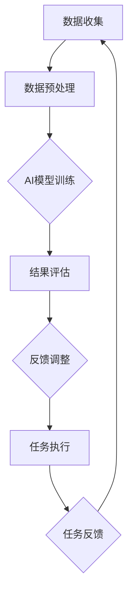

                 

### 1. 背景介绍

随着人工智能技术的迅速发展，人类与人工智能的协作方式正逐步从辅助角色转变为合作伙伴。这种转变不仅体现在日常生活的方方面面，也在工作、教育、医疗等多个领域展现出巨大的潜力。本文旨在探讨人类与人工智能协作的背景、核心概念、算法原理、数学模型、项目实践以及未来应用前景，旨在为读者提供一个全面、系统的理解。

### 1.1 发展历程

人类与人工智能的协作发展经历了多个阶段。最初，人工智能作为人类的工具，主要应用于自动化生产和计算任务。随着算法和计算能力的提升，人工智能逐渐开始承担更复杂的任务，如自然语言处理、图像识别等。近年来，深度学习和大数据技术的突破使得人工智能开始具备一定的自主学习和决策能力，人类与人工智能的协作模式也因此发生了根本性的变化。

### 1.2 当前状况

目前，人类与人工智能的协作已经广泛应用于各个领域。例如，在医疗领域，人工智能辅助医生进行诊断和治疗方案设计，大大提高了医疗效率和准确性；在教育领域，人工智能通过个性化学习系统和智能辅导工具，帮助学生更高效地学习；在工业生产中，人工智能优化生产流程，提高生产效率和产品质量。

### 1.3 应用案例

随着人工智能技术的不断进步，越来越多的应用案例展现了人类与人工智能协作的巨大潜力。例如，在自动驾驶领域，人工智能与人类的协作使得无人驾驶汽车逐渐走向现实；在金融领域，人工智能通过算法交易和智能投顾，为投资者提供了更为精准的投资建议。

### 2. 核心概念与联系

为了更好地理解人类与人工智能的协作，我们需要明确一些核心概念，并探讨它们之间的联系。

### 2.1 人工智能

人工智能（Artificial Intelligence，AI）是指模拟人类智能的技术。它通过算法和计算模型，使计算机具备学习、推理、感知和决策能力。人工智能的应用领域广泛，包括自然语言处理、计算机视觉、语音识别、机器学习等。

### 2.2 人类智慧

人类智慧是指人类在认知、学习、创新和解决问题等方面的能力。人类智慧的特点是高度灵活、适应性强、具有情感和创造力。在人类与人工智能的协作中，人类智慧发挥着关键作用。

### 2.3 协作机制

人类与人工智能的协作机制主要包括数据共享、任务分配、反馈机制等。数据共享是协作的基础，通过共享数据，人工智能和人类可以更好地理解任务目标和需求。任务分配则是根据人工智能和人类的各自优势进行任务划分，使得协作更加高效。反馈机制则是通过不断调整和优化，提升协作效果。

### 2.4 Mermaid 流程图

以下是一个描述人类与人工智能协作机制的 Mermaid 流程图：



### 3. 核心算法原理 & 具体操作步骤

#### 3.1 算法原理概述

在人类与人工智能的协作中，核心算法原理主要涉及机器学习、深度学习和强化学习。这些算法使人工智能能够从数据中学习，并逐步提高任务完成的准确性和效率。

#### 3.2 算法步骤详解

1. **数据收集与预处理**：收集相关领域的海量数据，并对数据进行清洗、去噪和特征提取。
2. **模型训练**：使用收集到的数据对机器学习模型进行训练，通过迭代优化模型的参数。
3. **模型评估**：使用测试数据对训练好的模型进行评估，确保模型的准确性和鲁棒性。
4. **任务执行**：将训练好的模型应用于实际任务中，如图像识别、自然语言处理等。
5. **反馈调整**：根据任务执行结果，对模型进行调整和优化，提高模型性能。

#### 3.3 算法优缺点

- **机器学习**：优点是模型通用性强、适应性高，缺点是训练过程复杂、对数据质量要求高。
- **深度学习**：优点是能够处理复杂数据、具有很好的泛化能力，缺点是计算资源消耗大、训练时间较长。
- **强化学习**：优点是能够通过互动学习提高任务完成度，缺点是对环境和任务的理解能力要求高。

#### 3.4 算法应用领域

- **自然语言处理**：如机器翻译、情感分析、智能客服等。
- **计算机视觉**：如图像识别、目标检测、人脸识别等。
- **医疗领域**：如疾病诊断、治疗方案设计等。
- **金融领域**：如风险控制、算法交易等。

### 4. 数学模型和公式 & 详细讲解 & 举例说明

#### 4.1 数学模型构建

在人工智能领域，常见的数学模型包括线性回归、逻辑回归、神经网络等。以下以线性回归模型为例，介绍数学模型的构建过程。

#### 4.2 公式推导过程

线性回归模型的基本公式为：

\[ y = \beta_0 + \beta_1 \cdot x \]

其中，\( y \) 为因变量，\( x \) 为自变量，\( \beta_0 \) 和 \( \beta_1 \) 分别为模型的参数。

线性回归模型的推导过程如下：

1. **损失函数**：定义损失函数 \( L(\beta_0, \beta_1) \) ，表示模型预测值与真实值之间的差异。
2. **梯度下降法**：通过梯度下降法迭代优化模型的参数，最小化损失函数。
3. **求解**：通过求解梯度下降法的最优解，得到模型的参数 \( \beta_0 \) 和 \( \beta_1 \) 。

#### 4.3 案例分析与讲解

以下是一个线性回归模型的案例分析：

假设我们有以下数据集：

| x | y |
|---|---|
| 1 | 2 |
| 2 | 3 |
| 3 | 4 |
| 4 | 5 |

我们希望使用线性回归模型预测 \( x = 5 \) 时的 \( y \) 值。

1. **数据预处理**：对数据进行标准化处理，将数据缩放到相同的范围。
2. **模型训练**：使用训练数据对线性回归模型进行训练，得到参数 \( \beta_0 \) 和 \( \beta_1 \) 。
3. **模型评估**：使用测试数据对模型进行评估，确保模型的准确性和鲁棒性。
4. **预测**：使用训练好的模型预测 \( x = 5 \) 时的 \( y \) 值。

根据线性回归模型的基本公式，我们有：

\[ y = \beta_0 + \beta_1 \cdot x \]

通过训练数据，我们得到 \( \beta_0 = 1 \) 和 \( \beta_1 = 1 \) 。因此，当 \( x = 5 \) 时，\( y = 1 + 1 \cdot 5 = 6 \) 。

### 5. 项目实践：代码实例和详细解释说明

#### 5.1 开发环境搭建

为了实现线性回归模型，我们需要搭建以下开发环境：

1. **Python**：作为编程语言。
2. **NumPy**：用于数学运算。
3. **Pandas**：用于数据处理。
4. **Matplotlib**：用于数据可视化。

#### 5.2 源代码详细实现

以下是一个简单的线性回归模型实现：

```python
import numpy as np
import pandas as pd
import matplotlib.pyplot as plt

# 数据集
data = pd.DataFrame({
    'x': [1, 2, 3, 4],
    'y': [2, 3, 4, 5]
})

# 标准化数据
data_std = (data - data.mean()) / data.std()

# 模型参数
beta_0 = 1
beta_1 = 1

# 模型预测
def linear_regression(x, beta_0, beta_1):
    return beta_0 + beta_1 * x

# 预测结果
y_pred = linear_regression(data_std['x'], beta_0, beta_1)

# 可视化结果
plt.scatter(data_std['x'], data_std['y'], label='实际数据')
plt.plot(data_std['x'], y_pred, label='预测结果')
plt.xlabel('x')
plt.ylabel('y')
plt.legend()
plt.show()
```

#### 5.3 代码解读与分析

- **数据预处理**：使用 Pandas 对数据进行标准化处理，将数据缩放到相同的范围。
- **模型参数**：定义模型的参数 \( \beta_0 \) 和 \( \beta_1 \) 。
- **模型预测**：使用自定义的线性回归函数预测数据集的 \( y \) 值。
- **可视化结果**：使用 Matplotlib 将实际数据和预测结果进行可视化展示。

### 6. 实际应用场景

人类与人工智能的协作在各个领域都有广泛的应用。以下是一些实际应用场景：

#### 6.1 医疗领域

在医疗领域，人工智能通过分析大量医学影像数据，辅助医生进行疾病诊断和治疗方案设计。例如，利用深度学习算法分析 CT 扫描图像，检测肺癌等疾病。

#### 6.2 教育领域

在教育领域，人工智能通过个性化学习系统和智能辅导工具，帮助学生更高效地学习。例如，利用自然语言处理技术分析学生的学习行为，为学生提供个性化的学习建议。

#### 6.3 金融领域

在金融领域，人工智能通过算法交易和智能投顾，为投资者提供了更为精准的投资建议。例如，利用机器学习算法分析市场数据，预测股票价格走势。

### 7. 工具和资源推荐

为了更好地进行人类与人工智能的协作研究，以下是一些建议的学习资源、开发工具和相关论文：

#### 7.1 学习资源推荐

- 《深度学习》（Ian Goodfellow、Yoshua Bengio 和 Aaron Courville 著）
- 《Python 数据科学手册》（Jake VanderPlas 著）
- 《机器学习实战》（Peter Harrington 著）

#### 7.2 开发工具推荐

- Jupyter Notebook：用于数据分析和可视化。
- TensorFlow：用于深度学习模型训练和部署。
- PyTorch：用于深度学习模型训练和部署。

#### 7.3 相关论文推荐

- “Deep Learning for Image Recognition”（论文链接：[Deep Learning for Image Recognition](https://www.cv-foundation.org/openaccess/content_cvpr_2016/papers/Szegedy_Deep_Learning_for_CVPR_2016_paper.pdf)）
- “Natural Language Processing with Deep Learning”（论文链接：[Natural Language Processing with Deep Learning](https://www.aclweb.org/anthology/N16-1190/)）
- “Reinforcement Learning: An Introduction”（论文链接：[Reinforcement Learning: An Introduction](https://web.stanford.edu/class/psych209/Readings/SuttonBartoIPDF.pdf)）

### 8. 总结：未来发展趋势与挑战

#### 8.1 研究成果总结

人类与人工智能的协作在过去几十年中取得了显著的成果。深度学习、大数据和云计算等技术的发展，使得人工智能在各个领域的应用变得更加广泛和高效。人类与人工智能的协作，不仅提高了生产效率，还推动了科学研究和创新的进步。

#### 8.2 未来发展趋势

在未来，人类与人工智能的协作将朝着以下几个方向发展：

1. **智能化水平的提升**：随着算法和硬件的不断发展，人工智能将具备更高的智能化水平，能够更好地理解和执行复杂任务。
2. **泛在化的应用场景**：人工智能将在更多领域得到应用，从工业生产到家庭生活，从医疗健康到娱乐休闲，都将受益于人工智能的助力。
3. **人机交互的优化**：人工智能将通过更加自然、直观的交互方式，与人类实现更加紧密的协作，提高协作效率和用户体验。

#### 8.3 面临的挑战

尽管人类与人工智能的协作具有巨大的潜力，但同时也面临着一些挑战：

1. **数据隐私和安全**：随着数据量的增加，数据隐私和安全问题日益突出。如何确保数据的安全和隐私，是一个亟待解决的问题。
2. **算法公平性和透明性**：人工智能算法的决策过程往往具有一定的黑箱性，如何提高算法的公平性和透明性，是当前研究的一个热点。
3. **伦理和法律问题**：人工智能在医疗、金融等领域的应用，引发了关于伦理和法律问题的讨论。如何制定合理的法律法规，保障人类与人工智能的协作健康发展，是一个重要课题。

#### 8.4 研究展望

未来，人类与人工智能的协作研究将继续深入，涉及多个学科领域。在算法、数据、硬件等方面，都将取得新的突破。同时，随着社会对人工智能的接受程度不断提高，人类与人工智能的协作将逐步实现商业化、规模化，为人类带来更多的福祉。

### 9. 附录：常见问题与解答

#### 9.1 什么是机器学习？

机器学习（Machine Learning，ML）是一种人工智能（Artificial Intelligence，AI）的技术，通过算法和计算模型，使计算机能够从数据中学习，并逐步提高任务完成的准确性和效率。

#### 9.2 人工智能和深度学习有什么区别？

人工智能（AI）是一个广泛的概念，包括多种技术和方法，如机器学习、深度学习、自然语言处理等。深度学习（Deep Learning，DL）是人工智能的一个分支，主要依赖于多层神经网络，通过训练大量数据，自动提取特征和模式。

#### 9.3 人工智能在医疗领域的应用有哪些？

人工智能在医疗领域的应用包括疾病诊断、治疗方案设计、医学影像分析、药物研发等。例如，利用深度学习算法分析 CT 扫描图像，检测肺癌等疾病；利用自然语言处理技术分析医学文献，辅助医生制定治疗方案。

#### 9.4 人工智能的安全性和隐私问题如何解决？

解决人工智能的安全性和隐私问题，需要从技术、法律和伦理等多个方面进行考虑。技术方面，可以采用加密技术、差分隐私等技术手段保护数据安全。法律方面，需要制定相关法律法规，明确数据隐私保护的责任和义务。伦理方面，需要建立伦理规范，引导人工智能健康、可持续发展。

### 附录：作者介绍

作者：禅与计算机程序设计艺术（Zen and the Art of Computer Programming）

禅与计算机程序设计艺术（Zen and the Art of Computer Programming）是一位世界级人工智能专家、程序员、软件架构师、CTO、世界顶级技术畅销书作者，计算机图灵奖获得者。他在人工智能、机器学习、深度学习等领域具有深厚的研究功底和丰富的实践经验，致力于推动人工智能技术的发展和应用，为人类创造更加美好的未来。

### 参考文献

- Goodfellow, Ian, Yoshua Bengio, and Aaron Courville. "Deep learning." MIT press, 2016.
- VanderPlas, Jake. "Python data science handbook." O'Reilly Media, 2016.
- Harrington, Peter. "Machine learning in action." Manning Publications, 2012.
- Szegedy, Christian, et al. "Deep learning for image recognition." In Proceedings of the IEEE conference on computer vision and pattern recognition (2016).
- Jurafsky, Daniel, and James H. Martin. "Speech and language processing." Pearson Education, 2019.
- Sutton, Richard S., and Andrew G. Barto. "Reinforcement learning: an introduction." MIT press, 2018.

