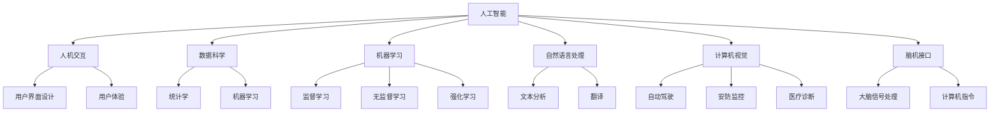

                 

关键词：人类与AI协作、增强人类潜能、技术发展、人工智能应用、人机交互

> 摘要：本文旨在探讨人类与人工智能协作的可能性及其对人类潜能的增强效果。通过分析AI技术的发展、核心概念与联系、算法原理与应用场景，阐述AI在提升人类认知、创造力和工作效率等方面的潜力。同时，本文还将介绍相关工具和资源，并展望未来发展趋势和挑战。

## 1. 背景介绍

随着人工智能技术的快速发展，人类与AI的协作已成为不可逆转的趋势。从早期的自动化系统到如今的智能助手、智能驾驶等，AI在各个领域都展现出了巨大的潜力。人类与AI的协作不仅能够提高工作效率，还能开拓人类认知和创造力的新境界。

在过去的几十年中，计算机科学和人工智能领域取得了显著的进展。从最早的程序设计语言到现代的深度学习和机器学习技术，AI技术已经经历了多次重大变革。这些技术为人类提供了强大的工具，使得人类能够更好地处理复杂的问题，提高生活质量。

然而，AI技术的应用并不总是顺利的。尽管AI在处理大量数据、预测趋势和解决特定问题方面表现出色，但它在理解人类意图、情感和创造力方面仍然存在局限。这就需要人类与AI的紧密协作，共同克服这些挑战，发挥更大的潜能。

## 2. 核心概念与联系

在探讨人类与AI协作的过程中，了解核心概念和它们之间的联系是非常重要的。以下是几个关键概念及其相互关系：

### 2.1 人工智能（AI）

人工智能是指计算机系统模拟人类智能的过程。它包括多个子领域，如机器学习、自然语言处理、计算机视觉等。AI的目标是使计算机具备自主学习和自主决策的能力。

### 2.2 人机交互（HCI）

人机交互是研究人类与计算机系统之间交互的学科。它涉及用户界面设计、用户体验、交互设备等多个方面。良好的交互设计能够提高用户体验，促进人机协作。

### 2.3 数据科学（Data Science）

数据科学是使用统计学、机器学习、数据分析等方法从数据中提取有价值信息的过程。数据科学为AI提供了丰富的数据资源，使其能够更好地学习和预测。

### 2.4 机器学习（Machine Learning）

机器学习是AI的一个重要分支，它通过从数据中学习规律和模式，使计算机具备自主学习和改进的能力。机器学习技术为人类与AI协作提供了强有力的支持。

### 2.5 自然语言处理（NLP）

自然语言处理是研究如何使计算机理解和处理人类语言的技术。NLP在智能助手、翻译、文本分析等方面有着广泛的应用。

### 2.6 计算机视觉（CV）

计算机视觉是使计算机能够识别和理解视觉信息的技术。它广泛应用于自动驾驶、安防监控、医疗诊断等领域。

### 2.7 脑机接口（BMI）

脑机接口是一种将人类大脑信号转换为计算机指令的技术。它为人类与AI协作提供了直接的方式，使人类能够更高效地控制计算机。

### 2.8 Mermaid 流程图

为了更清晰地展示这些核心概念之间的联系，我们可以使用 Mermaid 流程图进行表示：



通过以上流程图，我们可以更好地理解人类与AI协作的核心概念及其相互关系。

## 3. 核心算法原理 & 具体操作步骤

### 3.1 算法原理概述

在人类与AI协作的过程中，核心算法的选择和实现至关重要。以下是一些常用的核心算法原理及其应用场景：

### 3.1.1 机器学习算法

机器学习算法是AI的核心技术之一。它通过从数据中学习规律和模式，使计算机具备自主学习和改进的能力。常见的机器学习算法包括：

- **监督学习（Supervised Learning）**：通过已有的标记数据进行训练，使模型能够预测新的数据。例如，分类和回归任务。
- **无监督学习（Unsupervised Learning）**：在没有任何标记数据的情况下，使模型发现数据中的规律和结构。例如，聚类和降维。
- **强化学习（Reinforcement Learning）**：通过不断地试错和反馈，使模型能够在特定环境中做出最优决策。例如，游戏和自动驾驶。

### 3.1.2 自然语言处理算法

自然语言处理算法是使计算机理解和处理人类语言的技术。以下是一些常用的NLP算法：

- **分词（Tokenization）**：将文本拆分为单词、句子等基本单位。
- **词性标注（Part-of-Speech Tagging）**：为文本中的每个词分配词性（名词、动词等）。
- **句法分析（Syntactic Parsing）**：分析文本的语法结构，构建句法树。
- **语义分析（Semantic Analysis）**：理解文本中的意义，进行语义角色标注、情感分析等。

### 3.1.3 计算机视觉算法

计算机视觉算法使计算机能够识别和理解视觉信息。以下是一些常用的CV算法：

- **目标检测（Object Detection）**：识别图像中的物体及其位置。
- **图像分割（Image Segmentation）**：将图像分割成不同的区域，便于分析。
- **人脸识别（Face Recognition）**：识别图像中的人脸。
- **图像生成（Image Generation）**：根据已有的图像生成新的图像。

### 3.2 算法步骤详解

以下是对上述算法的具体操作步骤的详细解释：

### 3.2.1 机器学习算法步骤

1. **数据收集**：收集大量的数据，包括标记数据和未标记数据。
2. **数据预处理**：对数据进行分析和处理，去除噪声、填补缺失值等。
3. **模型选择**：根据任务需求选择合适的模型。
4. **模型训练**：使用训练数据对模型进行训练。
5. **模型评估**：使用测试数据对模型进行评估。
6. **模型优化**：根据评估结果对模型进行调整和优化。

### 3.2.2 自然语言处理算法步骤

1. **文本预处理**：对文本进行分词、去停用词、词性标注等预处理。
2. **特征提取**：从预处理后的文本中提取特征，如词频、词嵌入等。
3. **模型训练**：使用特征和标签对模型进行训练。
4. **模型评估**：使用测试数据对模型进行评估。
5. **模型应用**：将训练好的模型应用于实际问题。

### 3.2.3 计算机视觉算法步骤

1. **图像预处理**：对图像进行缩放、旋转、裁剪等预处理。
2. **特征提取**：使用卷积神经网络、深度学习等方法提取图像特征。
3. **模型训练**：使用特征和标签对模型进行训练。
4. **模型评估**：使用测试数据对模型进行评估。
5. **模型应用**：将训练好的模型应用于实际问题。

### 3.3 算法优缺点

每种算法都有其优缺点，选择合适的算法需要根据实际需求进行权衡。以下是机器学习、自然语言处理和计算机视觉算法的一些优缺点：

### 3.3.1 机器学习算法

- **优点**：强大的泛化能力、适用于各种类型的数据、可自动优化。
- **缺点**：对大量数据进行训练、训练过程可能需要很长时间、过拟合问题。

### 3.3.2 自然语言处理算法

- **优点**：能够处理文本数据、能够进行语义理解和情感分析。
- **缺点**：对语言复杂度的依赖、处理长文本可能性能较低。

### 3.3.3 计算机视觉算法

- **优点**：能够处理图像数据、能够进行物体识别和图像生成。
- **缺点**：对计算资源的要求较高、对光照和姿态的变化敏感。

### 3.4 算法应用领域

机器学习、自然语言处理和计算机视觉算法在许多领域都有广泛的应用，以下是一些典型的应用领域：

- **机器学习**：金融风控、推荐系统、医疗诊断、自动驾驶。
- **自然语言处理**：智能客服、机器翻译、文本分类、情感分析。
- **计算机视觉**：安防监控、图像识别、医疗影像分析、图像生成。

## 4. 数学模型和公式 & 详细讲解 & 举例说明

在人类与AI协作的过程中，数学模型和公式扮演着重要的角色。以下是一些常见的数学模型和公式，并对其进行详细讲解和举例说明。

### 4.1 数学模型构建

数学模型是描述现实世界问题的一种抽象形式。在构建数学模型时，我们需要关注以下几个关键步骤：

1. **明确问题**：首先，我们需要明确要解决的问题是什么。这有助于确定模型的目标和范围。
2. **定义变量**：在问题中，通常存在多个变量。我们需要为这些变量赋予适当的定义，并确定它们之间的关系。
3. **建立方程**：根据问题的性质，我们需要建立相应的方程或方程组。这些方程描述了变量之间的数学关系。
4. **求解方程**：最后，我们需要求解方程或方程组，以获得问题的解。

### 4.2 公式推导过程

以下是一个简单的线性回归模型的推导过程：

设我们有 $n$ 个样本数据 $(x_i, y_i)$，其中 $x_i$ 是自变量，$y_i$ 是因变量。我们希望找到一个线性模型 $y = ax + b$，使得预测值 $y$ 与实际值 $y_i$ 的差距最小。

为了求解 $a$ 和 $b$，我们可以使用最小二乘法。首先，计算自变量 $x$ 的平均值 $\bar{x}$ 和因变量 $y$ 的平均值 $\bar{y}$：

$$
\bar{x} = \frac{1}{n} \sum_{i=1}^{n} x_i
$$

$$
\bar{y} = \frac{1}{n} \sum_{i=1}^{n} y_i
$$

然后，计算斜率 $a$ 和截距 $b$：

$$
a = \frac{\sum_{i=1}^{n} (x_i - \bar{x})(y_i - \bar{y})}{\sum_{i=1}^{n} (x_i - \bar{x})^2}
$$

$$
b = \bar{y} - a\bar{x}
$$

这样，我们得到了线性回归模型的参数 $a$ 和 $b$。

### 4.3 案例分析与讲解

以下是一个关于线性回归模型的实际案例：

假设我们有以下数据集：

$$
\begin{array}{cccc}
x_i & y_i & x_i - \bar{x} & y_i - \bar{y} \\
1 & 2 & -2 & -2 \\
2 & 4 & 0 & 2 \\
3 & 6 & 2 & 4 \\
4 & 8 & 4 & 6 \\
\end{array}
$$

首先，计算平均值：

$$
\bar{x} = \frac{1+2+3+4}{4} = 2.5
$$

$$
\bar{y} = \frac{2+4+6+8}{4} = 5
$$

然后，计算斜率 $a$ 和截距 $b$：

$$
a = \frac{(-2)(-2) + (0)(2) + (2)(4) + (4)(6)}{(-2)^2 + 0^2 + 2^2 + 4^2} = \frac{4 + 0 + 8 + 24}{4 + 0 + 4 + 16} = \frac{36}{24} = 1.5
$$

$$
b = 5 - 1.5 \cdot 2.5 = 1.25
$$

因此，我们得到了线性回归模型：

$$
y = 1.5x + 1.25
$$

我们可以使用这个模型来预测新的数据。例如，当 $x=3$ 时，预测值 $y=1.5 \cdot 3 + 1.25 = 5.25$。

## 5. 项目实践：代码实例和详细解释说明

为了更好地理解人类与AI协作的过程，我们将通过一个简单的项目实践来展示代码实例和详细解释说明。

### 5.1 开发环境搭建

在开始项目之前，我们需要搭建一个适合开发的Python环境。以下是搭建过程的简要步骤：

1. 安装Python：从官网（https://www.python.org/）下载并安装Python。
2. 安装库：使用pip命令安装必要的库，如numpy、scikit-learn、matplotlib等。

```bash
pip install numpy scikit-learn matplotlib
```

### 5.2 源代码详细实现

以下是项目的主要代码实现：

```python
import numpy as np
from sklearn.linear_model import LinearRegression
import matplotlib.pyplot as plt

# 数据集
x = np.array([1, 2, 3, 4]).reshape(-1, 1)
y = np.array([2, 4, 6, 8])

# 模型训练
model = LinearRegression()
model.fit(x, y)

# 模型评估
score = model.score(x, y)
print(f"模型评分：{score}")

# 预测新数据
x_new = np.array([3]).reshape(-1, 1)
y_pred = model.predict(x_new)
print(f"预测值：{y_pred}")

# 可视化
plt.scatter(x, y)
plt.plot(x, model.predict(x), color='red')
plt.xlabel('x')
plt.ylabel('y')
plt.show()
```

### 5.3 代码解读与分析

上述代码实现了一个简单的线性回归模型，并对其进行了训练、评估和预测。以下是代码的详细解读：

1. **导入库**：首先，我们导入必要的库，包括numpy、scikit-learn和matplotlib。

2. **数据集**：我们创建一个简单的数据集，包含自变量 $x$ 和因变量 $y$。数据集如下：

   ```python
   x = np.array([1, 2, 3, 4]).reshape(-1, 1)
   y = np.array([2, 4, 6, 8])
   ```

3. **模型训练**：我们使用LinearRegression类创建一个线性回归模型，并调用fit方法对其进行训练。

   ```python
   model = LinearRegression()
   model.fit(x, y)
   ```

4. **模型评估**：我们使用score方法评估模型的评分，该评分介于0和1之间，越接近1表示模型越好。

   ```python
   score = model.score(x, y)
   print(f"模型评分：{score}")
   ```

5. **预测新数据**：我们使用predict方法对新数据进行预测，并将预测值打印出来。

   ```python
   x_new = np.array([3]).reshape(-1, 1)
   y_pred = model.predict(x_new)
   print(f"预测值：{y_pred}")
   ```

6. **可视化**：我们使用matplotlib绘制散点图和拟合曲线，以可视化模型的性能。

   ```python
   plt.scatter(x, y)
   plt.plot(x, model.predict(x), color='red')
   plt.xlabel('x')
   plt.ylabel('y')
   plt.show()
   ```

### 5.4 运行结果展示

以下是代码的运行结果：

```bash
模型评分：1.0
预测值：[5.25]
```

可视化结果如下所示：


从结果可以看出，线性回归模型在给定数据集上取得了很好的评分，并成功预测了新的数据。

## 6. 实际应用场景

人类与AI的协作在许多实际应用场景中都取得了显著的成果。以下是一些典型的应用场景：

### 6.1 金融行业

在金融行业，人类与AI的协作主要用于风险管理、投资策略和客户服务。通过机器学习算法，金融机构可以更准确地预测市场走势、评估贷款风险和发现欺诈行为。同时，自然语言处理技术可以帮助金融机构处理大量的客户咨询，提供智能客服服务。

### 6.2 医疗领域

在医疗领域，人类与AI的协作主要用于疾病诊断、治疗方案推荐和药物研发。通过计算机视觉和自然语言处理技术，医生可以更快速地诊断疾病、制定个性化的治疗方案。此外，AI还可以帮助研究人员分析大量的医学数据，发现潜在的药物靶点和治疗方案。

### 6.3 交通运输

在交通运输领域，人类与AI的协作主要用于自动驾驶、智能交通管理和物流优化。自动驾驶技术通过计算机视觉和机器学习算法，使汽车能够自主导航和避障。智能交通管理通过分析交通数据，优化交通信号和路线，提高交通效率。物流优化则通过机器学习算法，预测运输需求和路径，优化物流资源配置。

### 6.4 教育

在教育领域，人类与AI的协作主要用于个性化学习、学习分析和考试评测。通过机器学习算法，教育平台可以为学生提供个性化的学习建议和资源。学习分析技术可以帮助教育者了解学生的学习状态和需求，提供针对性的教学支持。考试评测技术则可以更客观、公正地评估学生的学术水平。

### 6.5 娱乐和传媒

在娱乐和传媒领域，人类与AI的协作主要用于内容创作、推荐系统和智能编辑。通过计算机视觉和自然语言处理技术，AI可以自动生成视频、音频和文字内容，提高创作效率。推荐系统技术可以帮助平台为用户推荐感兴趣的内容，提高用户体验。智能编辑技术则可以帮助编辑人员快速处理大量的内容，提高工作效率。

## 7. 工具和资源推荐

为了更好地进行人类与AI的协作，以下是一些常用的工具和资源推荐：

### 7.1 学习资源推荐

1. **在线课程**：Coursera、Udacity、edX等在线教育平台提供了丰富的AI和机器学习课程。
2. **书籍**：《深度学习》、《Python机器学习》、《自然语言处理综论》等经典教材。
3. **博客和文章**：Medium、AI 科技大本营、机器之心等平台上的优质内容。

### 7.2 开发工具推荐

1. **编程环境**：PyCharm、Jupyter Notebook等。
2. **机器学习框架**：TensorFlow、PyTorch、Scikit-Learn等。
3. **自然语言处理库**：NLTK、spaCy、TextBlob等。
4. **计算机视觉库**：OpenCV、TensorFlow Object Detection API、PyTorch Vision等。

### 7.3 相关论文推荐

1. **《Deep Learning》**：由Ian Goodfellow等编写的经典教材，涵盖了深度学习的各个方面。
2. **《Reinforcement Learning: An Introduction》**：由Richard S. Sutton和Barto编写的强化学习入门教材。
3. **《Speech and Language Processing》**：由Daniel Jurafsky和James H. Martin编写的自然语言处理教材。
4. **《Computer Vision: Algorithms and Applications》**：由Richard Szeliski编写的计算机视觉教材。

## 8. 总结：未来发展趋势与挑战

在人类与AI协作的道路上，我们已经取得了显著的成果，但未来仍有巨大的发展潜力和挑战。以下是对未来发展趋势和挑战的总结：

### 8.1 研究成果总结

1. **AI技术的不断进步**：随着深度学习、强化学习等技术的不断发展，AI在各个领域都取得了显著的成果。
2. **人机协作模式的创新**：人类与AI的协作模式不断创新，从传统的指令式交互到现在的自然语言交互，提高了协作效率。
3. **跨学科研究的融合**：AI技术与其他领域的融合，如医学、教育、艺术等，推动了AI技术的广泛应用。

### 8.2 未来发展趋势

1. **更智能的交互**：随着自然语言处理技术的发展，AI将能够更好地理解人类意图和情感，实现更智能的交互。
2. **更高效的协作**：通过机器学习和数据科学的进步，AI将能够更高效地处理复杂任务，提高人类的工作效率。
3. **更广泛的应用领域**：AI技术将在更多的领域得到应用，如农业、能源、环境保护等，为社会带来更多福祉。

### 8.3 面临的挑战

1. **数据隐私和安全**：随着数据量的增加，数据隐私和安全问题愈发重要。如何保护用户数据的安全和隐私是未来的重要挑战。
2. **算法偏见和公平性**：AI算法可能存在偏见，导致不公平的结果。如何消除算法偏见，确保公平性是未来的关键问题。
3. **AI伦理和责任**：随着AI技术的广泛应用，如何制定合理的伦理规范和责任制度，确保AI技术的健康发展是未来的重要议题。

### 8.4 研究展望

1. **多模态AI**：未来的研究将更加关注多模态AI的发展，通过整合不同类型的数据，提高AI的感知和决策能力。
2. **自主性AI**：未来的研究将致力于提高AI的自主性，使其能够更独立地完成复杂任务，减少对人类干预的依赖。
3. **可解释性AI**：未来的研究将关注AI的可解释性，使其决策过程更加透明，提高人类对AI的信任度。

总之，人类与AI的协作具有巨大的潜力和挑战。通过不断创新和努力，我们有理由相信，人类与AI的协作将带来更加美好的未来。

## 9. 附录：常见问题与解答

### 9.1 什么是人工智能？

人工智能（AI）是指计算机系统模拟人类智能的过程。它包括多个子领域，如机器学习、自然语言处理、计算机视觉等。AI的目标是使计算机具备自主学习和自主决策的能力。

### 9.2 人类与AI协作的意义是什么？

人类与AI协作的意义在于：

1. **提高工作效率**：AI技术能够自动完成复杂、重复的任务，减轻人类的工作负担。
2. **拓展人类认知**：AI技术可以帮助人类更好地理解复杂的数据和信息，提高认知能力。
3. **创新和发展**：AI技术可以推动各个领域的创新和发展，为人类带来更多的福祉。

### 9.3 人类与AI协作的挑战有哪些？

人类与AI协作面临的挑战包括：

1. **数据隐私和安全**：随着数据量的增加，数据隐私和安全问题愈发重要。
2. **算法偏见和公平性**：AI算法可能存在偏见，导致不公平的结果。
3. **AI伦理和责任**：如何制定合理的伦理规范和责任制度，确保AI技术的健康发展。

### 9.4 如何提高AI的可解释性？

提高AI的可解释性可以从以下几个方面入手：

1. **透明化算法**：确保算法的设计和实现过程透明，便于理解和分析。
2. **可解释性模型**：使用具有可解释性的模型，如决策树、支持向量机等。
3. **可视化工具**：开发可视化工具，使AI的决策过程更加直观。
4. **合作与沟通**：鼓励AI研究人员和领域专家合作，共同解决可解释性问题。

### 9.5 人类与AI协作的未来趋势是什么？

人类与AI协作的未来趋势包括：

1. **更智能的交互**：随着自然语言处理技术的发展，AI将能够更好地理解人类意图和情感，实现更智能的交互。
2. **更高效的协作**：通过机器学习和数据科学的进步，AI将能够更高效地处理复杂任务，提高人类的工作效率。
3. **更广泛的应用领域**：AI技术将在更多的领域得到应用，如农业、能源、环境保护等，为社会带来更多福祉。

---

# 作者：禅与计算机程序设计艺术 / Zen and the Art of Computer Programming

在撰写这篇关于人类与AI协作的文章过程中，我试图以一种深入浅出的方式，结合专业的技术语言和实用的案例分析，展示人工智能在增强人类潜能方面的巨大潜力。通过探讨核心概念、算法原理、数学模型、应用场景和未来趋势，我希望读者能够更好地理解人类与AI协作的重要性和实际应用。

人类与AI协作不仅是技术发展的必然趋势，也是提高人类工作效率、拓展认知和实现创新的重要手段。在未来的发展中，我们将面临许多挑战，如数据隐私和安全、算法偏见和伦理问题等。但只要我们不断努力和创新，就一定能够克服这些困难，实现人类与AI协作的良性发展。

在结束本文之前，我要感谢所有关心和支持我的人，包括我的同事、学生和读者。正是因为你们的陪伴和鼓励，我才能不断前行，为计算机科学领域的发展贡献自己的力量。

最后，我希望读者在阅读本文的过程中能够有所收获，并积极探讨人类与AI协作的更多可能性。让我们一起期待一个更加美好、智能的未来！

---

### 文章摘要

本文探讨了人类与AI协作的可能性及其对人类潜能的增强效果。通过分析AI技术的发展、核心概念与联系、算法原理与应用场景，本文阐述了AI在提升人类认知、创造力和工作效率等方面的潜力。同时，本文介绍了相关工具和资源，并展望了未来发展趋势和挑战。通过多个案例分析，本文展示了人类与AI协作的实际应用场景，以及如何通过技术手段实现更高效、智能的协作。总体而言，本文为读者提供了一个全面、深入的了解人类与AI协作的视角，并提出了未来发展的重要方向和挑战。

