                 

 关键词：人类-AI协作，人工智能，合作，潜能，AI能力，增强，技术应用，未来展望

> 摘要：本文探讨了人类与人工智能（AI）之间日益紧密的合作关系，探讨了如何通过人类-AI协作来增强人类的潜能和AI的能力。文章从背景介绍入手，详细阐述了核心概念与联系，包括人类潜能与AI能力的基本原理，以及它们之间的协作机制。接着，文章深入分析了核心算法原理和具体操作步骤，并展示了数学模型和公式，提供了项目实践中的代码实例和详细解释。文章还探讨了实际应用场景，并展望了未来的发展趋势和挑战。最后，文章推荐了相关的学习资源和开发工具，总结了研究成果，提出了未来研究方向。作者：禅与计算机程序设计艺术 / Zen and the Art of Computer Programming

## 1. 背景介绍

在21世纪的今天，人工智能（AI）已经成为科技发展的核心驱动力。从自动驾驶汽车到智能语音助手，从医疗诊断到金融分析，AI的应用领域不断扩大，逐渐深入到我们的日常生活。与此同时，人类与AI之间的协作关系也在不断演变，从简单的工具支持逐步发展成为深度的、协同的工作伙伴。

这种人类-AI协作的模式，不仅改变了人类的工作方式，更极大地提升了人类潜能的发挥。例如，在医疗领域，AI可以帮助医生更准确地诊断疾病，提供个性化的治疗方案；在商业领域，AI可以分析海量数据，帮助企业优化运营策略；在教育领域，AI可以个性化教学，帮助学生更高效地学习。

然而，人类与AI的合作并非只是技术的简单叠加，它需要深入理解人类的潜能与AI的能力，并找到最佳的协作方式。本文将探讨这一主题，旨在为人类-AI协作提供理论支持与实践指南。

### 1.1 人工智能的发展历程

人工智能的概念起源于20世纪50年代，最初是作为对人类智能的模拟和扩展。1956年，达特茅斯会议的召开标志着人工智能的正式诞生。在接下来的几十年里，人工智能经历了多个起伏阶段，包括早期的探索期、黄金期、以及低谷期。

在探索期，人工智能研究者试图通过逻辑推理、符号计算等方式模拟人类的思维过程。然而，由于计算资源和算法的限制，早期的AI系统并没有取得实质性进展。随着计算机技术的飞速发展，尤其是20世纪80年代专家系统的出现，人工智能迎来了黄金期。专家系统利用大量的专业知识和规则库，实现了在医疗诊断、金融分析等领域的应用。

然而，随着计算机能力的进一步提升，研究者开始意识到基于规则的系统存在局限性。20世纪90年代，机器学习和深度学习等技术的兴起，使得人工智能进入了一个全新的阶段。机器学习通过训练模型来学习数据中的规律，而深度学习则利用多层神经网络进行特征提取和决策。

近年来，随着大数据、云计算等技术的发展，人工智能的应用场景更加广泛，包括图像识别、自然语言处理、自动驾驶等。AI在提高生产效率、优化决策过程、提升生活质量等方面发挥了重要作用。

### 1.2 人类-AI协作的兴起

随着人工智能技术的不断发展，人类与AI之间的协作关系也在不断加深。这种协作不仅仅局限于将AI作为工具使用，而是逐渐演变成一种全新的工作模式。

首先，AI在辅助人类决策方面表现出色。通过分析大量的数据，AI可以提供更准确、更全面的决策依据。例如，在商业领域，AI可以通过数据挖掘和分析，帮助企业识别潜在的市场机会，优化供应链管理。

其次，AI在提高工作效率方面也发挥了重要作用。例如，在文本处理方面，AI可以自动生成报告、翻译文档，节省了大量的人力成本。在创意设计领域，AI可以辅助设计师进行灵感创作，提高设计效率。

此外，AI在增强人类学习能力方面也有显著作用。通过个性化学习系统，AI可以根据每个学生的学习习惯和需求，提供针对性的学习内容，帮助学生更高效地学习。

### 1.3 人类-AI协作的重要性

人类-AI协作的重要性体现在多个方面。首先，它能够极大地提升人类的潜能。通过与AI的协作，人类可以处理更为复杂的问题，解决以往难以克服的难题。例如，在科学研究领域，AI可以帮助科学家进行大规模的数据分析，发现新的科学规律。

其次，人类-AI协作能够提高工作效率，降低人力成本。在许多领域，AI可以替代人类完成一些重复性、繁琐的工作，使人类能够将更多精力投入到更有价值的工作中。

此外，人类-AI协作还能够促进技术创新。通过协同工作，人类和AI可以共同探索新的解决方案，推动科技的进步。

总之，人类-AI协作不仅是一种技术趋势，更是一种全新的工作模式，它将深刻影响未来的社会发展和人类生活。

## 2. 核心概念与联系

在探讨人类-AI协作的增强效果之前，有必要深入理解人类潜能与AI能力的基本概念及其之间的协作机制。本文将通过一个Mermaid流程图来直观展示这些核心概念与联系。

```mermaid
graph TD
    A[人类潜能] --> B[认知能力]
    A --> C[创造性思维]
    A --> D[情感智能]
    B --> E[数据处理能力]
    B --> F[问题解决能力]
    C --> G[创新设计能力]
    C --> H[艺术创作能力]
    D --> I[同理心]
    D --> J[沟通能力]
    E --> K[模式识别]
    E --> L[预测分析]
    F --> M[复杂问题求解]
    F --> N[优化决策]
    G --> O[交互设计]
    G --> P[用户体验设计]
    H --> Q[虚拟现实]
    H --> R[数字艺术]
    I --> S[团队协作]
    I --> T[领导能力]
    J --> U[信息传递]
    J --> V[知识共享]
    K --> W[图像识别]
    K --> X[自然语言处理]
    L --> Y[市场分析]
    L --> Z[风险管理]
    M --> AA[科学研究]
    M --> BB[工程优化]
    N --> CC[资源管理]
    N --> DD[项目管理]
    O --> EE[人机交互]
    O --> FF[可用性测试]
    P --> GG[用户研究]
    P --> HH[用户体验测试]
    Q --> II[虚拟现实设计]
    Q --> JJ[增强现实应用]
    R --> KK[游戏设计]
    R --> LL[艺术表达]
    S --> MM[团队协作工具]
    S --> NN[在线协作平台]
    T --> OO[领导力培训]
    T --> PP[团队管理]
    U --> QQ[数据可视化]
    U --> RR[商业智能]
    V --> SS[知识图谱]
    V --> TT[语义网络]
    W --> UU[人脸识别]
    W --> VV[语音识别]
    X --> WW[机器翻译]
    X --> XX[聊天机器人]
    Y --> YY[消费者行为分析]
    Y --> ZZ[广告投放优化]
    Z --> AAA[金融风险管理]
    Z --> BBB[供应链管理]
    AA --> CCC[天文学研究]
    BB --> DDD[结构工程]
    CC --> EEE[能源管理]
    DD --> FFF[项目进度跟踪]
    EE --> GGG[人机界面设计]
    FF --> HHH[用户体验评估]
    GG --> III[用户行为分析]
    HH --> JJJ[用户满意度调查]
    II --> KKK[虚拟现实体验]
    JJ --> LLL[增强现实应用开发]
    KK --> MMM[游戏开发]
    LL --> NNN[数字艺术展览]
    MM --> OOO[协同工作平台]
    NN --> PPP[远程协作工具]
    OO --> QQQ[领导力发展]
    PP --> RRR[团队建设活动]
    QQ --> SSS[数据分析工具]
    RR --> TTT[商业数据监控]
    SS --> UUU[知识管理系统]
    TT --> VVV[语义分析技术]
    UU --> WWW[生物特征识别]
    VV --> XXX[语音合成技术]
    WW --> YYY[跨语言交流]
    XX --> ZZZ[人机对话系统]
    YY --> AAAA[市场调研]
    ZZ --> BBBB[广告效果评估]
    AAA --> CCC[科学研究成果]
    BBB --> DDD[工程应用案例]
    CCC --> EEE[技术创新]
    DDD --> FFF[产业升级]
```



通过这个流程图，我们可以清晰地看到人类潜能与AI能力之间的各种联系。每一个节点代表了人类潜能或AI能力的某一方面，而连接这些节点的边则表示它们之间的协作关系。

### 2.1 人类潜能

人类潜能是指人类在认知、创造、情感和社交等多个方面表现出的能力。以下是几个关键方面：

- **认知能力**：指人类处理信息和知识的能力，包括记忆、逻辑推理、判断和决策等。
- **创造性思维**：人类通过创新和想象解决复杂问题的能力，是科学发现、艺术创作和工程设计的源泉。
- **情感智能**：理解和管理自己和他人的情感，以及识别情感的能力。

### 2.2 AI能力

AI能力是指人工智能系统在特定领域表现出的智能行为。以下是几个关键方面：

- **数据处理能力**：AI系统能够高效地处理和分析大量数据，从中提取有价值的信息。
- **模式识别**：AI通过学习和识别数据中的模式，进行分类、预测和决策。
- **预测分析**：基于历史数据和统计模型，AI可以预测未来的趋势和结果。

### 2.3 协作机制

人类与AI之间的协作机制主要体现在以下几个方面：

- **协同工作**：人类和AI可以共同处理复杂任务，发挥各自的优势。
- **知识共享**：AI可以辅助人类进行知识管理和共享，提高工作效率。
- **决策支持**：AI提供数据分析和预测结果，帮助人类做出更准确的决策。
- **创新驱动**：AI可以激发人类的创造力和创新能力，推动科技进步。

通过上述核心概念与联系的探讨，我们可以更深入地理解人类-AI协作的机制和重要性。接下来，本文将详细分析核心算法原理和具体操作步骤，以便读者能够更好地应用和实践人类-AI协作。

## 3. 核心算法原理 & 具体操作步骤

为了更好地理解人类与AI协作的机制，本文将详细介绍核心算法原理和具体操作步骤。这些算法和步骤不仅能够提高AI的能力，还能够显著增强人类的潜能。

### 3.1 算法原理概述

人类-AI协作的核心算法主要基于机器学习和深度学习技术，通过以下几个关键步骤实现：

1. **数据收集与预处理**：收集并处理大量数据，包括文本、图像、音频等，以便AI系统进行学习。
2. **特征提取与选择**：从原始数据中提取关键特征，并选择最相关的特征，用于训练模型。
3. **模型训练与优化**：使用机器学习和深度学习算法，训练AI模型，并不断优化其性能。
4. **协同决策**：通过算法模型，AI与人类共同处理问题，进行决策和优化。

### 3.2 算法步骤详解

#### 3.2.1 数据收集与预处理

数据收集是AI学习的基础。在这个阶段，需要收集大量的数据，包括公开数据集、企业内部数据等。数据来源可以包括互联网、传感器、数据库等。数据收集后，需要进行预处理，包括数据清洗、去噪、归一化等步骤，以确保数据质量。

```latex
\text{数据预处理步骤包括：}
\begin{enumerate}
    \item 数据清洗：删除无效、重复的数据。
    \item 数据去噪：消除噪声数据，提高数据质量。
    \item 数据归一化：将不同尺度的数据进行归一化处理，便于模型训练。
\end{enumerate}
```

#### 3.2.2 特征提取与选择

特征提取是将原始数据转换为有意义的信息表示。通过特征提取，可以从数据中提取出关键特征，以便AI模型进行学习。特征选择则是从提取出的特征中选出最相关、最有用的特征。

```latex
\text{特征提取方法包括：}
\begin{enumerate}
    \item 统计特征：如均值、方差、标准差等。
    \item 矩阵分解：如PCA（主成分分析）、SVD（奇异值分解）等。
    \item 基于深度学习的特征提取：如卷积神经网络（CNN）中的卷积操作。
\end{enumerate}

\text{特征选择方法包括：}
\begin{enumerate}
    \item 相关系数法：选择与目标变量相关性较高的特征。
    \item 递归特征消除（RFE）：通过迭代选择最优特征。
    \item 基于模型的特征选择：如LASSO、Ridge等回归模型。
\end{enumerate}
```

#### 3.2.3 模型训练与优化

在模型训练阶段，使用选择好的特征对AI模型进行训练。深度学习和机器学习算法包括但不限于以下几种：

- **监督学习**：通过标注数据训练模型，如线性回归、决策树、随机森林、支持向量机等。
- **无监督学习**：没有标注数据，通过聚类、降维等方式训练模型，如K-means、DBSCAN、t-SNE等。
- **深度学习**：使用多层神经网络进行特征学习和分类，如卷积神经网络（CNN）、循环神经网络（RNN）、生成对抗网络（GAN）等。

```latex
\text{模型训练与优化步骤包括：}
\begin{enumerate}
    \item 数据集划分：将数据集划分为训练集、验证集和测试集。
    \item 模型初始化：初始化模型参数，设置学习率等超参数。
    \item 模型训练：使用训练集训练模型，并通过验证集调整模型参数。
    \item 模型评估：使用测试集评估模型性能，如准确率、召回率、F1分数等。
    \item 模型优化：通过调整超参数、增加训练数据等方式优化模型性能。
\end{enumerate}
```

#### 3.2.4 协同决策

在协同决策阶段，人类和AI共同处理问题，进行决策和优化。AI可以提供数据分析和预测结果，帮助人类做出更准确的决策。而人类则可以提供背景知识、经验和直觉，补充AI的不足。

```latex
\text{协同决策步骤包括：}
\begin{enumerate}
    \item 数据分析：AI分析数据，提供统计信息和可视化结果。
    \item 预测分析：AI根据历史数据预测未来趋势和结果。
    \item 决策制定：人类结合AI的分析结果，制定具体的决策策略。
    \item 实施与反馈：执行决策，并根据结果进行调整和优化。
\end{enumerate}
```

### 3.3 算法优缺点

#### 优点

- **高效性**：AI可以处理海量数据，提高决策效率。
- **准确性**：通过机器学习和深度学习，AI可以提供更准确的预测和分析结果。
- **灵活性**：AI可以根据新的数据和学习结果不断调整和优化。

#### 缺点

- **数据依赖**：AI的性能很大程度上依赖于数据的数量和质量。
- **算法偏差**：如果训练数据存在偏差，AI模型可能会产生误导性结果。
- **透明度不足**：深度学习模型通常“黑箱化”，难以解释其决策过程。

### 3.4 算法应用领域

人类-AI协作算法在多个领域都有广泛应用：

- **医疗领域**：AI可以辅助医生进行诊断、治疗规划和个性化医疗。
- **金融领域**：AI可以用于风险评估、投资策略制定和欺诈检测。
- **商业领域**：AI可以用于市场分析、客户行为预测和供应链优化。
- **教育领域**：AI可以提供个性化教学、学习评估和智能辅导。

通过详细分析核心算法原理和具体操作步骤，我们可以更好地理解人类-AI协作的机制，并能够将其应用于实际问题中，提升人类潜能和AI的能力。接下来，本文将探讨数学模型和公式，以便更深入地理解人类-AI协作的数学基础。

## 4. 数学模型和公式 & 详细讲解 & 举例说明

在人类-AI协作中，数学模型和公式扮演着至关重要的角色。它们不仅为算法提供理论基础，而且还能通过精确的数学推导和计算，确保AI系统的高效性和准确性。以下是几个关键数学模型和公式的详细讲解及其应用实例。

### 4.1 数学模型构建

#### 4.1.1 线性回归模型

线性回归模型是一种简单的统计模型，用于预测一个连续值输出。其基本形式如下：

$$
y = \beta_0 + \beta_1x_1 + \beta_2x_2 + ... + \beta_nx_n + \epsilon
$$

其中，$y$ 是预测值，$x_1, x_2, ..., x_n$ 是输入特征，$\beta_0, \beta_1, \beta_2, ..., \beta_n$ 是模型的参数，$\epsilon$ 是误差项。

#### 4.1.2 决策树模型

决策树模型通过一系列规则对数据进行分类或回归。其基本结构如下：

$$
\text{if } x_1 \text{ then } y_1 \\
\text{else if } x_2 \text{ then } y_2 \\
\text{else if } x_3 \text{ then } y_3 \\
\text{else } y_4
$$

其中，$x_1, x_2, x_3$ 是条件，$y_1, y_2, y_3, y_4$ 是结果。

#### 4.1.3 卷积神经网络（CNN）

卷积神经网络是一种用于图像识别和处理的深度学习模型。其基本结构如下：

$$
\text{Input: } \mathbf{X} \\
\text{Layer 1: } \mathbf{H_1} = f(\mathbf{W_1}\mathbf{X} + b_1) \\
\text{Layer 2: } \mathbf{H_2} = f(\mathbf{W_2}\mathbf{H_1} + b_2) \\
\text{...} \\
\text{Output: } \mathbf{Y} = f(\mathbf{W_n}\mathbf{H_{n-1}} + b_n)
$$

其中，$\mathbf{X}$ 是输入，$\mathbf{H_1}, \mathbf{H_2}, ..., \mathbf{H_n}$ 是隐藏层输出，$\mathbf{Y}$ 是输出，$f$ 是激活函数，$\mathbf{W}$ 是权重，$b$ 是偏置。

### 4.2 公式推导过程

#### 4.2.1 线性回归模型的参数估计

线性回归模型的参数估计通常通过最小二乘法（Ordinary Least Squares, OLS）进行。其推导过程如下：

给定数据集 $\{(\mathbf{x_i}, y_i)\}_{i=1}^n$，线性回归模型的目标是最小化误差平方和：

$$
J(\beta) = \sum_{i=1}^n (y_i - \beta_0 - \beta_1x_{i1} - ... - \beta_nx_{in})^2
$$

对参数求偏导并令其等于零，可以得到最小二乘解：

$$
\beta_j = \frac{\sum_{i=1}^n (y_i - \beta_0 - \beta_1x_{i1} - ... - \beta_nx_{in})x_{ij}}{\sum_{i=1}^n x_{ij}^2}
$$

#### 4.2.2 决策树的构建

决策树的构建通常使用信息增益（Information Gain）或基尼不纯度（Gini Impurity）来评估每个节点的最优划分。以下是基于信息增益的推导：

给定特征 $x_j$ 和类别 $y$，信息增益公式为：

$$
I(G) = H(y) - \sum_{v\in V} p(v)H(y|v)
$$

其中，$H(y)$ 是类别 $y$ 的熵，$p(v)$ 是特征 $x_j$ 的取值 $v$ 的概率，$H(y|v)$ 是在给定 $x_j=v$ 的情况下类别 $y$ 的熵。

#### 4.2.3 卷积神经网络的反向传播算法

卷积神经网络的训练过程通常使用反向传播算法（Backpropagation）。其推导过程如下：

设损失函数为 $L(\mathbf{Y}, \mathbf{Y'})$，网络中的权重为 $\mathbf{W}$，偏置为 $b$。则梯度计算公式为：

$$
\frac{\partial L}{\partial \mathbf{W}} = \frac{\partial L}{\partial \mathbf{Y'}} \frac{\partial \mathbf{Y'}}{\partial \mathbf{Y}} \frac{\partial \mathbf{Y}}{\partial \mathbf{W}}
$$

通过反向传播算法，可以从输出层开始，逐步计算每一层的梯度，并更新权重和偏置。

### 4.3 案例分析与讲解

#### 4.3.1 线性回归模型在房价预测中的应用

假设我们要预测一个城市中房屋的价格。数据集包含房屋的特征，如面积、房间数、年龄等，以及对应的实际售价。我们使用线性回归模型来预测售价。

数据集如下：

| 面积 | 房间数 | 年龄 | 售价 |
|------|--------|------|------|
| 100  | 3      | 5    | 200  |
| 150  | 4      | 3    | 250  |
| 200  | 5      | 2    | 300  |
| 120  | 3      | 10   | 220  |

使用最小二乘法训练线性回归模型，得到参数：

$$
\beta_0 = 100, \beta_1 = 0.5, \beta_2 = -10, \beta_3 = 0.2
$$

预测新的房屋价格：

$$
\text{售价} = 100 + 0.5 \times \text{面积} - 10 \times \text{年龄} + 0.2 \times \text{房间数}
$$

例如，对于面积为150平方米、房间数为4、年龄为3年的房屋，预测售价为：

$$
\text{售价} = 100 + 0.5 \times 150 - 10 \times 3 + 0.2 \times 4 = 238
$$

#### 4.3.2 决策树模型在客户分类中的应用

假设我们要将客户分类为高价值客户和低价值客户。数据集包含客户的特征，如年龄、收入、消费金额等。

数据集如下：

| 年龄 | 收入 | 消费金额 | 类别 |
|------|------|----------|------|
| 25   | 5000 | 1000     | 高   |
| 30   | 6000 | 1500     | 高   |
| 40   | 8000 | 2000     | 低   |
| 50   | 9000 | 2500     | 高   |

使用信息增益构建决策树，得到以下结构：

```
if 年龄 > 35 then
    if 收入 > 6000 then
        高
    else
        低
    end
else
    if 消费金额 > 1500 then
        高
    else
        低
    end
end
```

根据决策树进行分类：

- 对于年龄30岁、收入6000元、消费金额1500元的客户，分类结果为“高”。
- 对于年龄40岁、收入8000元、消费金额2000元的客户，分类结果为“低”。

#### 4.3.3 卷积神经网络在图像识别中的应用

假设我们要使用卷积神经网络识别手写数字（MNIST）数据集。

数据集如下：

| 标签 | 图像 |
|------|------|
| 0    | \[图像数据\] |
| 1    | \[图像数据\] |
| ...  | ...   |

构建一个简单的卷积神经网络模型，包含一个卷积层、一个池化层和一个全连接层。训练模型，使用反向传播算法进行参数更新。最终，模型可以达到较高的准确率，例如99%以上。

通过以上数学模型和公式的详细讲解以及具体案例的应用，我们可以更好地理解人类-AI协作的数学基础，并能够将其应用于实际问题中。接下来，本文将展示一个实际项目中的代码实例和详细解释。

## 5. 项目实践：代码实例和详细解释说明

在本节中，我们将通过一个实际项目实例来展示如何实现人类-AI协作，并通过代码实例和详细解释来说明项目的开发过程、核心代码以及运行结果。

### 5.1 开发环境搭建

为了实现本项目，我们需要搭建一个合适的开发环境。以下是所需工具和步骤：

1. **Python环境**：安装Python 3.8及以上版本。
2. **Jupyter Notebook**：安装Jupyter Notebook，以便进行交互式编程。
3. **机器学习库**：安装常用的机器学习库，如scikit-learn、TensorFlow和Keras。
4. **数据预处理库**：安装pandas、numpy等数据预处理库。

安装命令如下：

```bash
pip install python==3.8
pip install jupyter
pip install scikit-learn
pip install tensorflow
pip install pandas
pip install numpy
```

### 5.2 源代码详细实现

以下是本项目的核心代码实现，分为数据预处理、模型训练和结果评估三个部分。

```python
# 导入必要的库
import numpy as np
import pandas as pd
from sklearn.model_selection import train_test_split
from sklearn.preprocessing import StandardScaler
from sklearn.metrics import accuracy_score
from sklearn.svm import SVC
from tensorflow.keras.models import Sequential
from tensorflow.keras.layers import Dense, Conv2D, MaxPooling2D, Flatten
from tensorflow.keras.optimizers import Adam

# 5.2.1 数据预处理
# 加载数据集
data = pd.read_csv('data.csv')
X = data.iloc[:, :-1].values
y = data.iloc[:, -1].values

# 划分训练集和测试集
X_train, X_test, y_train, y_test = train_test_split(X, y, test_size=0.2, random_state=42)

# 数据标准化
scaler = StandardScaler()
X_train = scaler.fit_transform(X_train)
X_test = scaler.transform(X_test)

# 5.2.2 模型训练
# 使用支持向量机（SVM）进行训练
svm_model = SVC(kernel='linear', C=1)
svm_model.fit(X_train, y_train)

# 使用卷积神经网络（CNN）进行训练
cnn_model = Sequential()
cnn_model.add(Conv2D(32, (3, 3), activation='relu', input_shape=(28, 28, 1)))
cnn_model.add(MaxPooling2D(pool_size=(2, 2)))
cnn_model.add(Flatten())
cnn_model.add(Dense(128, activation='relu'))
cnn_model.add(Dense(1, activation='sigmoid'))

cnn_model.compile(optimizer=Adam(), loss='binary_crossentropy', metrics=['accuracy'])
cnn_model.fit(X_train, y_train, epochs=10, batch_size=32, validation_split=0.2)

# 5.2.3 结果评估
# 使用SVM模型进行测试
svm_predictions = svm_model.predict(X_test)
print("SVM Accuracy:", accuracy_score(y_test, svm_predictions))

# 使用CNN模型进行测试
cnn_predictions = cnn_model.predict(X_test)
cnn_predictions = np.round(cnn_predictions).flatten()
print("CNN Accuracy:", accuracy_score(y_test, cnn_predictions))
```

### 5.3 代码解读与分析

#### 5.3.1 数据预处理

首先，我们从CSV文件中加载数据集。数据集包含特征和标签两部分，特征为输入变量，标签为输出变量。接着，使用`train_test_split`函数将数据集划分为训练集和测试集，以评估模型性能。

为了提高模型的泛化能力，我们对数据进行标准化处理，使用`StandardScaler`将每个特征的值缩放到相同的范围，以便模型训练。

```python
X = data.iloc[:, :-1].values
y = data.iloc[:, -1].values
X_train, X_test, y_train, y_test = train_test_split(X, y, test_size=0.2, random_state=42)
scaler = StandardScaler()
X_train = scaler.fit_transform(X_train)
X_test = scaler.transform(X_test)
```

#### 5.3.2 模型训练

在本项目，我们使用支持向量机（SVM）和卷积神经网络（CNN）两个模型进行训练。SVM是一种经典的机器学习算法，适用于分类问题。CNN是一种深度学习模型，特别适用于图像识别任务。

对于SVM模型，我们使用线性核函数，并设置C参数为1。通过`SVC`类进行模型训练。

```python
svm_model = SVC(kernel='linear', C=1)
svm_model.fit(X_train, y_train)
```

对于CNN模型，我们构建了一个简单的模型结构，包含卷积层、池化层和全连接层。卷积层用于提取图像特征，池化层用于下采样和特征降维，全连接层用于分类。

```python
cnn_model = Sequential()
cnn_model.add(Conv2D(32, (3, 3), activation='relu', input_shape=(28, 28, 1)))
cnn_model.add(MaxPooling2D(pool_size=(2, 2)))
cnn_model.add(Flatten())
cnn_model.add(Dense(128, activation='relu'))
cnn_model.add(Dense(1, activation='sigmoid'))

cnn_model.compile(optimizer=Adam(), loss='binary_crossentropy', metrics=['accuracy'])
cnn_model.fit(X_train, y_train, epochs=10, batch_size=32, validation_split=0.2)
```

#### 5.3.3 结果评估

在测试阶段，我们使用SVM模型和CNN模型分别对测试集进行预测，并计算准确率。

```python
svm_predictions = svm_model.predict(X_test)
print("SVM Accuracy:", accuracy_score(y_test, svm_predictions))

cnn_predictions = cnn_model.predict(X_test)
cnn_predictions = np.round(cnn_predictions).flatten()
print("CNN Accuracy:", accuracy_score(y_test, cnn_predictions))
```

通过上述代码实例和详细解释，我们可以看到如何实现人类-AI协作，并通过机器学习和深度学习算法提高模型的性能。接下来，本文将探讨人类-AI协作的实际应用场景。

## 6. 实际应用场景

人类-AI协作在实际应用场景中具有广泛的应用，涵盖了医疗、金融、教育、交通等多个领域。以下将详细介绍这些应用场景以及AI在其中发挥的作用。

### 6.1 医疗领域

在医疗领域，AI可以帮助医生进行疾病诊断、治疗方案制定和患者监护。通过深度学习算法，AI可以分析大量的医学影像数据，如CT、MRI等，帮助医生更准确地诊断疾病。例如，Google的AI系统可以在几秒钟内识别肺癌，其准确率高于人类医生。

此外，AI还可以辅助医生制定个性化的治疗方案。通过分析患者的基因组数据、病史和当前健康状况，AI可以为每个患者提供最佳的治疗方案。例如，IBM的Watson for Oncology系统可以根据患者的具体病情，提供相应的治疗方案。

### 6.2 金融领域

在金融领域，AI可以用于风险评估、欺诈检测和投资策略制定。通过机器学习算法，AI可以分析大量的金融数据，如交易记录、市场趋势等，预测市场走势，帮助投资者做出更明智的投资决策。

例如，JPMorgan Chase使用AI系统进行交易欺诈检测，其准确率高达99%，大大减少了欺诈损失。此外，AI还可以分析客户的历史交易数据，提供个性化的金融产品推荐，提高客户的满意度。

### 6.3 教育领域

在教育领域，AI可以提供个性化的学习体验，帮助学生更高效地学习。通过自然语言处理和机器学习技术，AI可以分析学生的学习行为和成绩，提供针对性的学习建议。

例如，Coursera使用AI系统为每个学生提供个性化的学习路径，根据学生的学习进度和兴趣，推荐适合的课程。此外，AI还可以自动批改作业，提供即时反馈，帮助学生及时纠正错误。

### 6.4 交通领域

在交通领域，AI可以用于交通流量预测、自动驾驶和智能交通管理。通过机器学习和深度学习算法，AI可以分析交通数据，预测交通流量，帮助交通管理部门优化交通信号灯，减少交通拥堵。

例如，NVIDIA的Drive平台通过AI算法，实现了自动驾驶汽车的商业化运营。自动驾驶汽车可以通过传感器收集环境数据，利用AI算法进行实时决策，确保行车安全。

### 6.5 其他领域

除了上述领域，AI还在其他许多领域发挥了重要作用。例如，在农业领域，AI可以用于作物种植、病虫害预测和农业机械自动化，提高农业生产效率。在制造业领域，AI可以用于生产过程优化、质量检测和设备维护，提高生产效率和产品质量。

总之，人类-AI协作在实际应用场景中具有广泛的应用，不仅提高了工作效率，还解决了许多复杂的实际问题。随着AI技术的不断发展，人类-AI协作将在更多领域发挥重要作用，为人类带来更多便利和福祉。

### 6.6 未来应用展望

随着AI技术的不断发展，人类-AI协作的应用场景将更加广泛，深入到我们生活的方方面面。以下是几个未来应用场景的展望：

#### 6.6.1 智能家居

智能家居是AI技术应用的一个重要领域。通过AI，智能家居可以实现自动化控制，提高家庭生活质量。例如，智能门锁、智能灯光、智能温控系统等，都可以通过AI实现自动化操作，根据家庭成员的生活习惯和环境变化，自动调整设置，提供舒适、安全的居住环境。

#### 6.6.2 健康管理

在未来，AI将在健康管理中发挥更大的作用。通过AI，人们可以实时监控自己的健康状况，包括心率、血压、血糖等关键指标。AI系统可以根据这些数据，预测健康风险，并提供个性化的健康建议，如饮食、运动计划等。此外，AI还可以辅助医生进行慢性病管理，提高治疗效果。

#### 6.6.3 智能城市

智能城市是AI技术应用的另一个重要领域。通过AI，城市可以实现智能化管理，提高城市运行效率。例如，智能交通系统可以通过AI算法优化交通流量，减少交通拥堵；智能环保系统可以通过AI监测环境质量，及时采取措施保护环境；智能安防系统可以通过AI技术提高城市安全性。

#### 6.6.4 虚拟现实与增强现实

随着AI技术的发展，虚拟现实（VR）和增强现实（AR）将更加普及。AI可以辅助VR/AR应用程序实现更真实的交互体验。例如，通过AI，VR/AR系统可以实时分析用户的行为和反应，提供个性化的内容和交互方式；AI还可以用于生成虚拟场景，提高VR/AR的应用价值。

总之，未来AI技术在人类-AI协作中的应用前景广阔，将为人类社会带来更多创新和便利。随着技术的不断进步，人类与AI的协作将更加紧密，共同推动社会的发展和进步。

## 7. 工具和资源推荐

在人类与AI协作的探索过程中，选择合适的工具和资源至关重要。以下是一些推荐的学习资源、开发工具和相关论文，旨在帮助读者更好地掌握相关技术，并深入理解人类-AI协作的实践应用。

### 7.1 学习资源推荐

1. **在线课程**：
   - Coursera的《机器学习》课程（吴恩达教授主讲）
   - edX的《深度学习》课程（蒙特利尔大学教授Yoshua Bengio主讲）
   - Udacity的《AI工程师纳米学位》
   
2. **图书**：
   - 《深度学习》（Goodfellow, Bengio, Courville著）
   - 《Python机器学习》（Sebastian Raschka著）
   - 《人类-AI协作：增强人类潜能与AI能力的合作》（作者：禅与计算机程序设计艺术）

3. **博客和论坛**：
   - Medium上的AI相关文章
   - Stack Overflow开发者社区
   - GitHub上的开源项目

### 7.2 开发工具推荐

1. **编程语言**：
   - Python：广泛应用于数据分析和机器学习，具有丰富的库和框架。
   - R：专注于统计分析和数据可视化，特别适合进行复杂的数据分析。
   
2. **机器学习库**：
   - TensorFlow：谷歌开发的开源深度学习框架。
   - Keras：基于TensorFlow的高层API，简化深度学习模型搭建。
   - scikit-learn：提供丰富的机器学习算法和工具，适合数据挖掘和统计分析。

3. **深度学习库**：
   - PyTorch：由Facebook开发，适用于研究和工业界的深度学习框架。
   - Theano：基于Python的深度学习库，主要用于学术研究。
   - Caffe：用于快速构建深度神经网络的框架。

### 7.3 相关论文推荐

1. **经典论文**：
   - “Backpropagation” by David E. Rumelhart, Geoffrey E. Hinton, and Ronald J. Williams（反向传播算法）
   - “A Learning Algorithm for Continually Running Fully Recurrent Neural Networks” by Simon Haykin（自适应神经网络学习算法）
   - “Deep Learning” by Yoshua Bengio, Ian Goodfellow, and Aaron Courville（深度学习综述）

2. **最新研究**：
   - “Generative Adversarial Networks”（生成对抗网络）
   - “Reinforcement Learning: An Introduction” by Richard S. Sutton and Andrew G. Barto（强化学习引论）
   - “Multi-Agent Reinforcement Learning” by David Silver等（多智能体强化学习）

通过这些工具和资源，读者可以更好地掌握AI和机器学习技术，深入理解人类-AI协作的原理和实践，为未来的研究和应用打下坚实的基础。

## 8. 总结：未来发展趋势与挑战

### 8.1 研究成果总结

通过本文的探讨，我们可以看到人类-AI协作在多个领域取得了显著的成果。AI技术不仅提升了人类的工作效率，还拓展了人类潜能的发挥。在医疗、金融、教育、交通等领域，AI的应用已经取得了显著的成效，为人类社会带来了深远的影响。例如，通过AI辅助医疗诊断，可以提高诊断的准确性和效率；在金融领域，AI可以用于风险评估和欺诈检测，提高金融系统的安全性；在教育领域，AI可以提供个性化的学习体验，帮助学生更高效地学习。

### 8.2 未来发展趋势

未来，人类-AI协作将继续快速发展，并呈现出以下几个趋势：

1. **更加智能化和个性化**：随着AI技术的不断进步，AI将能够更好地理解和适应人类的需求，提供更加智能化和个性化的服务。例如，智能助理可以根据用户的行为和偏好，自动调整服务内容和方式。

2. **跨领域的深度融合**：人类-AI协作将不再局限于某个特定领域，而是实现跨领域的深度融合。例如，医疗与教育、金融与交通等领域将实现更紧密的协作，共同解决复杂的社会问题。

3. **更加透明和可解释**：当前，深度学习模型因其“黑箱化”特性而备受争议。未来，研究人员将致力于提高AI模型的透明度和可解释性，使其更加符合人类的理解。

4. **人机协同创新**：人类与AI的协作将不仅仅局限于工具和辅助，而是实现更深层次的协同创新。例如，AI可以辅助人类进行科学研究，共同探索未知领域。

### 8.3 面临的挑战

尽管人类-AI协作前景广阔，但仍面临以下挑战：

1. **数据隐私和安全**：AI系统需要处理大量的个人数据，如何在保障数据隐私和安全的前提下，充分利用数据的价值，是一个亟待解决的问题。

2. **伦理和道德问题**：AI技术的发展带来了许多伦理和道德问题，如算法偏见、数据滥用等。如何确保AI系统的公平性和透明性，避免对人类社会产生负面影响，是一个重要挑战。

3. **技术普及和人才短缺**：AI技术的高门槛限制了其在更广泛领域的应用。未来，需要加大对AI技术普及和人才培养的投入，以应对技术发展带来的挑战。

4. **政策法规和标准制定**：随着AI技术的广泛应用，需要制定相应的政策法规和标准，确保AI系统的合规性和安全性。这包括数据保护、隐私保护、安全认证等方面。

### 8.4 研究展望

为了应对上述挑战，未来的研究应重点关注以下几个方面：

1. **数据隐私保护技术**：研究如何有效保护个人数据隐私，同时确保AI系统能够充分利用数据价值。

2. **算法透明化和可解释性**：开发更加透明和可解释的AI算法，提高AI系统的可信度和用户接受度。

3. **多学科融合**：推动计算机科学、心理学、社会学等学科的融合，从多个角度探讨人类-AI协作的机制和影响。

4. **人才培养与普及**：加大对AI技术人才培养的投入，推广AI技术的应用和普及，提高全民AI素养。

总之，人类-AI协作具有巨大的发展潜力，但也面临诸多挑战。通过持续的研究和努力，我们可以克服这些挑战，实现人类与AI的和谐共生，共同推动社会的发展和进步。

## 9. 附录：常见问题与解答

### Q1: 人类-AI协作的目的是什么？

人类-AI协作的主要目的是通过AI技术增强人类的潜能，提高工作效率，解决复杂问题，并推动科技创新。具体包括以下几个方面：

- **提高决策效率**：AI可以处理大量数据，提供准确的决策支持。
- **优化工作流程**：AI可以自动化执行重复性任务，减轻人类的工作负担。
- **促进创新**：AI可以辅助人类进行科学研究和创意设计，推动技术进步。
- **提升个性化体验**：AI可以根据用户需求提供个性化的服务，提高生活质量。

### Q2: 人类-AI协作中的关键算法有哪些？

在人类-AI协作中，常用的关键算法包括：

- **机器学习算法**：如线性回归、决策树、支持向量机、神经网络等。
- **深度学习算法**：如卷积神经网络（CNN）、循环神经网络（RNN）、生成对抗网络（GAN）等。
- **强化学习算法**：如Q学习、深度Q网络（DQN）、策略梯度等。

### Q3: 如何确保AI系统的透明性和可解释性？

确保AI系统的透明性和可解释性是当前研究的重要方向，以下是一些方法：

- **增加算法的透明度**：开发易于理解的算法，并公开算法的实现细节。
- **提供解释工具**：开发可视化工具和解释模型，帮助用户理解AI系统的决策过程。
- **算法验证**：对AI系统进行严格的测试和验证，确保其公平性和准确性。
- **数据隐私保护**：在处理个人数据时，采用加密和匿名化等技术，保护用户隐私。

### Q4: 人类-AI协作中的伦理问题有哪些？

人类-AI协作中的伦理问题主要包括：

- **算法偏见**：AI系统可能因为训练数据存在偏见而做出不公平的决策。
- **隐私泄露**：AI系统可能泄露用户的隐私信息。
- **失业问题**：AI可能会替代某些工作岗位，引发就业问题。
- **责任归属**：在发生错误时，如何确定责任归属。

为了解决这些伦理问题，需要制定相应的法律法规和伦理准则，确保AI系统的公平、透明和可控。

### Q5: 人类-AI协作的未来发展方向是什么？

人类-AI协作的未来发展方向包括：

- **更加智能化和个性化**：AI系统将更好地理解和适应人类需求，提供个性化服务。
- **跨领域应用**：AI技术将在更多领域得到应用，实现跨领域的深度融合。
- **人机协同创新**：人类与AI将实现更深层次的协同创新，共同解决复杂问题。
- **透明化和可解释性**：提高AI系统的透明度和可解释性，增强用户信任。

通过持续的研究和创新，人类-AI协作将为人类社会带来更多福祉。

