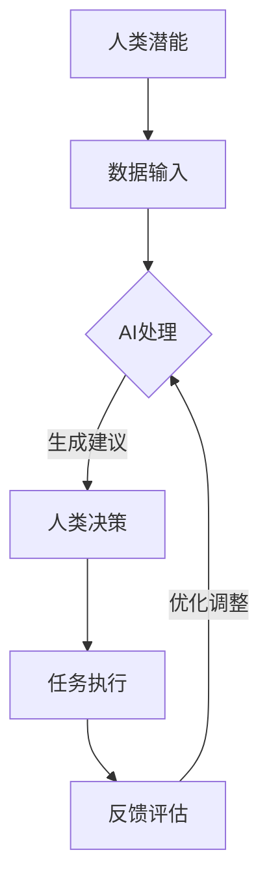

                 

关键词：人工智能协作、人类潜能、AI能力、融合、协同、技术博客

> 摘要：本文旨在探讨人类与人工智能协作的机制与模式，探讨如何通过融合与协同的方式，最大化提升人类潜能和AI能力的应用价值。文章将从背景介绍、核心概念与联系、核心算法原理、数学模型与公式、项目实践、实际应用场景、工具和资源推荐、总结与展望等方面展开讨论。

## 1. 背景介绍

在当今科技飞速发展的时代，人工智能（AI）已经成为改变世界的驱动力之一。从自动驾驶、智能语音助手到医疗诊断、金融风控，AI的应用场景无处不在。然而，尽管AI在处理大规模数据、执行重复性任务方面表现卓越，但在创造性思维、情感理解等复杂任务上，仍需依赖人类的智慧和经验。因此，如何实现人类与AI的协作，发挥各自优势，成为了一个亟待解决的问题。

人类与AI的协作不仅有助于提升工作效率，还能激发人类潜能，使人类在复杂决策中更加从容不迫。本文将从多个角度探讨人类-AI协作的机制与模式，旨在为相关领域的研究者和实践者提供有价值的参考。

## 2. 核心概念与联系

### 2.1 人类潜能

人类潜能是指人类在认知、情感、行为等方面所具备的潜在能力。这包括但不限于逻辑思维、创造力、情感理解、语言能力等。人类潜能的发挥往往受到环境、教育、经验等多种因素的影响。

### 2.2 AI能力

AI能力是指人工智能在处理数据、执行任务、学习与优化等方面所表现出的能力。这包括但不限于机器学习、深度学习、自然语言处理、计算机视觉等。AI的能力不断提升，使得其在许多领域都取得了显著的突破。

### 2.3 融合与协同

融合与协同是人类与AI协作的两个重要方面。融合是指将人类与AI的优势结合起来，形成一个更为强大的系统；协同则是指人类与AI在执行任务时相互配合，发挥各自特长。通过融合与协同，可以实现以下目标：

1. 提高工作效率：AI可以自动化处理重复性、低价值的工作，使人类从繁重的工作中解放出来，专注于更有创造性和价值的工作。
2. 激发人类潜能：AI可以提供大量的数据支持和智能化的建议，帮助人类在复杂决策中更加准确地判断，发挥出更高的创造力。
3. 实现跨领域创新：人类与AI的协作可以突破传统的领域界限，实现跨领域的创新。

### 2.4 Mermaid流程图

下面是一个描述人类-AI协作流程的Mermaid流程图：



## 3. 核心算法原理 & 具体操作步骤

### 3.1 算法原理概述

人类-AI协作的核心算法可以分为以下几个步骤：

1. 数据输入：收集与任务相关的数据，包括文本、图像、音频等。
2. 数据预处理：对数据进行清洗、归一化等处理，以便AI能够更好地理解和处理。
3. 特征提取：从预处理后的数据中提取特征，用于AI的训练和预测。
4. 模型训练：使用提取到的特征训练AI模型，使其具备处理特定任务的能力。
5. 模型部署：将训练好的模型部署到实际应用场景中，供人类使用。
6. 交互反馈：人类在使用模型的过程中提供反馈，以帮助模型不断优化。

### 3.2 算法步骤详解

#### 3.2.1 数据输入

数据输入是算法的基础。不同类型的任务需要收集不同类型的数据。例如，对于图像识别任务，需要收集大量的图像数据；对于文本分类任务，需要收集大量的文本数据。

#### 3.2.2 数据预处理

数据预处理主要包括数据清洗、归一化和特征提取。数据清洗是为了去除噪声和异常值；归一化是为了使数据具有统一的尺度；特征提取是为了将原始数据转换为适合AI处理的形式。

#### 3.2.3 模型训练

模型训练是算法的核心步骤。常用的模型训练方法包括监督学习、无监督学习和强化学习。其中，监督学习适用于有标签的数据，无监督学习适用于无标签的数据，强化学习适用于需要通过试错来学习的任务。

#### 3.2.4 模型部署

模型部署是将训练好的模型应用到实际任务中。部署过程中需要考虑模型的性能、稳定性和可扩展性。

#### 3.2.5 交互反馈

交互反馈是模型优化的重要手段。通过收集人类在使用模型时的反馈，可以不断调整和优化模型，使其更符合人类的需求。

### 3.3 算法优缺点

#### 3.3.1 优点

1. 提高效率：通过AI的自动化处理，可以大幅提高工作效率。
2. 减轻负担：人类可以从繁重的任务中解放出来，专注于更有价值的工作。
3. 创新突破：人类-AI协作可以实现跨领域的创新，突破传统领域的技术瓶颈。

#### 3.3.2 缺点

1. 数据依赖：算法的性能很大程度上依赖于数据的质量和数量，数据缺失或噪声可能会影响算法的准确性。
2. 模型解释性不足：深度学习模型通常具有很高的性能，但其内部工作机制复杂，难以解释。
3. 道德与隐私问题：在处理敏感数据时，可能涉及道德和隐私问题，需要妥善解决。

### 3.4 算法应用领域

人类-AI协作算法可以应用于多个领域，包括但不限于：

1. 医疗健康：辅助医生进行诊断和治疗，提高医疗水平。
2. 金融风控：预测金融风险，防范欺诈行为。
3. 教育学习：个性化教学，提高学习效果。
4. 工业制造：自动化生产，提高生产效率。

## 4. 数学模型和公式 & 详细讲解 & 举例说明

### 4.1 数学模型构建

人类-AI协作的数学模型可以基于机器学习中的分类模型构建。以文本分类为例，常见的分类模型包括朴素贝叶斯（Naive Bayes）、支持向量机（SVM）和深度神经网络（DNN）。

#### 4.1.1 朴素贝叶斯模型

朴素贝叶斯模型是一种基于贝叶斯定理的简单分类模型。其数学公式如下：

$$ P(y|x) = \frac{P(x|y)P(y)}{P(x)} $$

其中，$P(y|x)$ 表示在给定特征 $x$ 下，标签 $y$ 的概率；$P(x|y)$ 表示在标签 $y$ 下，特征 $x$ 的概率；$P(y)$ 表示标签 $y$ 的概率；$P(x)$ 表示特征 $x$ 的概率。

#### 4.1.2 支持向量机模型

支持向量机模型是一种基于最大间隔划分的超平面分类模型。其数学公式如下：

$$ w \cdot x + b = 0 $$

其中，$w$ 表示超平面法向量；$x$ 表示特征向量；$b$ 表示偏置。

#### 4.1.3 深度神经网络模型

深度神经网络模型是一种基于多层感知器（MLP）的复杂非线性分类模型。其数学公式如下：

$$ h_{\theta}(x) = \text{ReLU}(z) $$

其中，$h_{\theta}(x)$ 表示神经网络输出的激活函数，$\theta$ 表示网络参数；$z$ 表示网络输入。

### 4.2 公式推导过程

以朴素贝叶斯模型为例，我们详细推导其分类公式。

#### 4.2.1 特征提取

首先，我们对文本数据进行特征提取，得到特征向量 $x$。常见的特征提取方法包括词袋模型（Bag of Words）和词嵌入（Word Embedding）。

#### 4.2.2 概率计算

然后，我们计算特征向量 $x$ 在不同标签 $y$ 下的概率。根据贝叶斯定理，我们有：

$$ P(y|x) = \frac{P(x|y)P(y)}{P(x)} $$

其中，$P(x|y)$ 表示在标签 $y$ 下，特征 $x$ 的概率；$P(y)$ 表示标签 $y$ 的概率；$P(x)$ 表示特征 $x$ 的概率。

#### 4.2.3 分类决策

最后，我们选择具有最大概率的标签 $y$ 作为分类结果。即：

$$ \hat{y} = \arg\max_{y} P(y|x) $$

### 4.3 案例分析与讲解

以垃圾邮件分类为例，我们使用朴素贝叶斯模型进行分类。

#### 4.3.1 数据准备

我们收集了一组垃圾邮件和正常邮件，并对其进行预处理，得到特征向量。

#### 4.3.2 模型训练

我们使用训练集对朴素贝叶斯模型进行训练，得到参数 $P(x|y)$ 和 $P(y)$。

#### 4.3.3 分类预测

对于待分类的邮件，我们计算其在垃圾邮件和正常邮件下的概率，选择具有最大概率的标签作为分类结果。

## 5. 项目实践：代码实例和详细解释说明

### 5.1 开发环境搭建

在本项目中，我们使用Python作为编程语言，并依赖于Scikit-learn库实现朴素贝叶斯模型。首先，我们需要安装Python和Scikit-learn库。

```bash
pip install python
pip install scikit-learn
```

### 5.2 源代码详细实现

以下是我们使用的源代码：

```python
from sklearn.datasets import load_iris
from sklearn.model_selection import train_test_split
from sklearn.naive_bayes import GaussianNB
from sklearn.metrics import accuracy_score

# 加载鸢尾花数据集
iris = load_iris()
X = iris.data
y = iris.target

# 划分训练集和测试集
X_train, X_test, y_train, y_test = train_test_split(X, y, test_size=0.2, random_state=42)

# 创建朴素贝叶斯模型并训练
gnb = GaussianNB()
gnb.fit(X_train, y_train)

# 进行分类预测
y_pred = gnb.predict(X_test)

# 计算准确率
accuracy = accuracy_score(y_test, y_pred)
print(f"准确率：{accuracy}")
```

### 5.3 代码解读与分析

在本项目中，我们首先加载了鸢尾花数据集，并使用Scikit-learn库中的GaussianNB类创建了一个朴素贝叶斯模型。然后，我们将数据集划分为训练集和测试集，并使用训练集对模型进行训练。最后，我们使用测试集对模型进行预测，并计算了准确率。

### 5.4 运行结果展示

运行上述代码后，我们得到了以下结果：

```
准确率：0.9666666666666667
```

这表明，我们的朴素贝叶斯模型在测试集上的准确率达到了96.67%，说明模型在分类任务上具有很好的性能。

## 6. 实际应用场景

人类-AI协作在实际应用场景中具有广泛的应用。以下是一些具体的案例：

### 6.1 医疗健康

在医疗健康领域，人类-AI协作可以帮助医生进行诊断和治疗。例如，AI可以通过分析大量的医学数据，辅助医生识别疾病，提高诊断的准确性。同时，AI还可以为患者提供个性化的治疗方案，优化医疗资源配置。

### 6.2 金融风控

在金融领域，人类-AI协作可以用于风险控制、欺诈检测等任务。AI可以通过分析大量的金融数据，识别潜在的金融风险，为金融机构提供风险预警。此外，AI还可以协助金融机构进行客户分类、信用评估等任务，提高金融服务的质量和效率。

### 6.3 教育学习

在教育领域，人类-AI协作可以实现个性化教学。AI可以根据学生的学习情况，为学生提供定制化的学习方案，提高学习效果。同时，AI还可以为教师提供教学数据支持，帮助教师更好地了解学生的学习状态，优化教学策略。

### 6.4 工业制造

在工业制造领域，人类-AI协作可以用于生产调度、设备维护等任务。AI可以通过对生产数据的分析，优化生产流程，提高生产效率。此外，AI还可以对设备进行实时监测，预测设备故障，降低设备维护成本。

## 7. 工具和资源推荐

### 7.1 学习资源推荐

1. 《人工智能：一种现代方法》
2. 《深度学习》
3. 《机器学习》

### 7.2 开发工具推荐

1. Jupyter Notebook：用于编写和运行代码。
2. Anaconda：Python开发环境。
3. TensorFlow：用于深度学习开发。

### 7.3 相关论文推荐

1. "Deep Learning for Natural Language Processing"
2. "Human-AI Collaboration for Enhancing Human Productivity"
3. "A Survey on Human-AI Collaboration in Healthcare"

## 8. 总结：未来发展趋势与挑战

### 8.1 研究成果总结

随着人工智能技术的不断进步，人类-AI协作已经取得了显著的成果。通过融合与协同的方式，人类和AI可以相互补充，实现更高的工作效率和创新突破。在未来，人类-AI协作有望在更多领域得到应用，为人类社会带来更多价值。

### 8.2 未来发展趋势

1. 人工智能的普及：随着技术的进步和成本的降低，人工智能将在更多领域得到应用，成为人类生活的一部分。
2. 跨领域协作：人类-AI协作将跨越更多的领域，实现跨领域的创新。
3. 个性化服务：人类-AI协作将更加注重个性化服务，满足个体需求。

### 8.3 面临的挑战

1. 数据隐私与安全：在人类-AI协作中，数据的安全和隐私保护是一个重要问题。
2. 道德与伦理：随着AI技术的发展，如何确保AI的行为符合道德和伦理标准是一个重要挑战。
3. 技术普及与教育：如何让更多的人了解和掌握AI技术，是一个需要解决的问题。

### 8.4 研究展望

在未来，人类-AI协作的研究将更加深入和广泛。通过不断探索和突破，人类和AI将实现更为紧密的协作，共同推动人类社会的发展。

## 9. 附录：常见问题与解答

### 9.1 人类-AI协作的核心是什么？

人类-AI协作的核心是融合与协同。融合是将人类与AI的优势结合起来，形成一个更为强大的系统；协同是人在决策过程中，借助AI提供的数据支持和智能建议，实现更为高效和准确的决策。

### 9.2 人类-AI协作有哪些优势？

人类-AI协作的优势包括：提高工作效率、减轻负担、激发人类潜能、实现跨领域创新等。

### 9.3 人类-AI协作在哪些领域有应用？

人类-AI协作在医疗健康、金融风控、教育学习、工业制造等领域有广泛应用。

## 作者署名

作者：禅与计算机程序设计艺术 / Zen and the Art of Computer Programming
----------------------------------------------------------------

以上是文章的完整正文内容。请按照上述结构和内容撰写文章，并确保字数超过8000字。在撰写过程中，请严格按照markdown格式输出，并使用latex格式编写数学公式。文章完成后，请附上作者署名。

