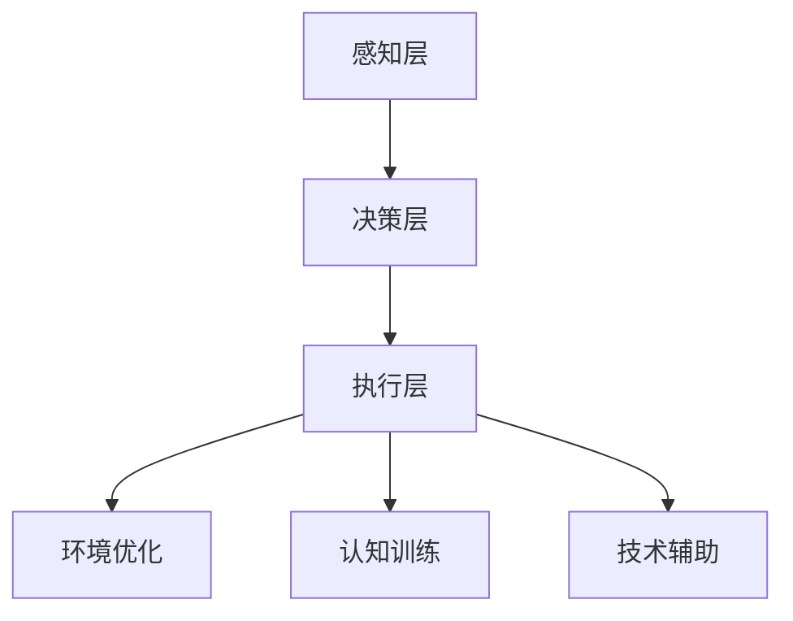

                 

关键词：注意力增强、专注力、商业应用、人工智能、神经科学、认知心理学

> 摘要：本文将探讨人类注意力增强技术的核心概念、原理及其在商业领域的广泛应用。通过结合神经科学和认知心理学的最新研究成果，本文将深入分析如何通过技术手段提升人类的专注力和注意力，从而在商业环境中实现更高的效率和生产力。同时，本文还将展望注意力增强技术在未来的发展方向和面临的挑战。

## 1. 背景介绍

在当今信息爆炸的时代，人们面临着前所未有的注意力分散问题。无论是日常生活中的社交媒体、电子邮件，还是工作中的各种会议和任务，都不断占用着我们的注意力资源。这种分散的注意力不仅影响了工作效率，还可能导致决策失误和创造力下降。为了应对这一挑战，科学家们开始探索注意力增强技术，以期帮助人们更有效地管理和集中注意力。

### 注意力分散的原因

注意力分散的原因可以归结为以下几个方面：

1. **多任务处理**：现代工作环境中，人们常常需要同时处理多项任务，这要求大脑在多个任务之间快速切换，导致注意力难以持久集中。
2. **环境刺激**：过多的外部刺激，如社交媒体、电子邮件和即时通讯工具，使人们难以抵御诱惑，从而分散注意力。
3. **内在干扰**：个人情绪、焦虑和压力等因素也会干扰注意力的集中。

### 注意力分散的影响

注意力分散对商业环境的影响主要体现在以下几个方面：

1. **生产力下降**：注意力分散导致工作效率降低，任务完成时间延长，从而影响整体生产力。
2. **决策质量下降**：注意力分散可能使决策者无法深入分析问题，导致决策失误。
3. **创新力下降**：注意力分散影响思维的流畅性和创造性，降低创新能力。

因此，提高人类的注意力集中能力已成为当今商业领域亟待解决的重要问题。

## 2. 核心概念与联系

为了更好地理解注意力增强技术，我们需要先掌握几个核心概念：

### 注意力类型

1. **选择性注意力**：人们能够从环境中选择关注某些刺激，而忽略其他刺激的能力。
2. **分配性注意力**：人们能够同时关注多个任务或信息源的能力。
3. **持续注意力**：人们能够长时间保持注意力集中的能力。

### 注意力增强技术

1. **认知训练**：通过特定的训练任务，增强大脑的注意力和认知功能。
2. **环境优化**：通过改善工作环境，减少干扰，提高注意力集中效果。
3. **技术辅助**：利用技术工具，如应用程序、软件和智能设备，辅助注意力的管理和集中。

### 注意力增强的原理

注意力增强技术主要基于以下原理：

1. **神经可塑性**：大脑结构和功能的变化，可以通过反复的训练和练习来改善。
2. **认知负荷理论**：当大脑处理的信息量超过其容量时，注意力分散的可能性增加。
3. **执行功能**：大脑的前额叶皮层在注意力的调节和控制中起着关键作用。

### 注意力增强技术的架构

为了实现注意力增强，我们可以采用以下架构：

1. **感知层**：识别和监测注意力状态。
2. **决策层**：根据注意力状态，提供相应的干预措施。
3. **执行层**：执行决策层的干预措施，如调整环境、提供提示等。

### Mermaid 流程图

下面是注意力增强技术的 Mermaid 流程图：



## 3. 核心算法原理 & 具体操作步骤

### 3.1 算法原理概述

注意力增强技术主要基于以下几个核心算法原理：

1. **自适应滤波算法**：通过调整滤波器的参数，过滤掉无关的信息，提高注意力的集中效果。
2. **多任务学习算法**：通过学习如何在多个任务之间切换和分配注意力，提高分配性注意力的能力。
3. **神经反馈算法**：通过监测大脑的电信号，提供实时的反馈，帮助用户调节和优化注意力状态。

### 3.2 算法步骤详解

注意力增强技术的具体操作步骤如下：

1. **数据收集**：通过脑电图（EEG）或其他传感器，收集用户的注意力状态数据。
2. **特征提取**：从原始数据中提取与注意力状态相关的特征。
3. **模型训练**：使用收集到的数据，训练自适应滤波器和神经反馈模型。
4. **干预决策**：根据用户的注意力状态，实时生成干预策略。
5. **执行干预**：执行决策层生成的干预措施，如调整环境、提供提示等。
6. **反馈调整**：根据干预效果，调整干预策略，以实现最优的注意力集中效果。

### 3.3 算法优缺点

注意力增强技术的优点包括：

1. **个性化**：根据用户的具体需求和注意力状态，提供个性化的干预措施。
2. **实时性**：能够实时监测和调整注意力状态，实现即时效果。
3. **高效性**：通过技术手段，提高用户的注意力集中能力，从而提高工作效率。

然而，注意力增强技术也存在一些缺点：

1. **依赖技术**：过度依赖技术可能导致用户的自我调节能力下降。
2. **隐私问题**：采集和处理用户的注意力状态数据，可能引发隐私保护问题。
3. **适应性问题**：对于某些用户，注意力增强技术可能需要一定的时间来适应。

### 3.4 算法应用领域

注意力增强技术广泛应用于以下领域：

1. **教育**：帮助学生提高学习效率，增强记忆和学习能力。
2. **职场**：帮助员工提高工作效率，减少工作压力。
3. **医疗**：辅助治疗注意力缺陷障碍（ADHD）等神经系统疾病。
4. **娱乐**：通过提供更加沉浸式的游戏体验，提高用户的娱乐效果。

## 4. 数学模型和公式 & 详细讲解 & 举例说明

### 4.1 数学模型构建

注意力增强技术的数学模型主要包括以下部分：

1. **感知层**：采用感知机模型，用于识别和监测用户的注意力状态。
2. **决策层**：采用支持向量机（SVM）模型，用于生成干预策略。
3. **执行层**：采用深度神经网络（DNN）模型，用于执行干预措施。

### 4.2 公式推导过程

#### 感知层

感知层使用感知机模型，其公式为：

$$
y = \text{sign}(w \cdot x + b)
$$

其中，$w$ 为权重向量，$x$ 为输入特征向量，$b$ 为偏置项，$y$ 为预测值。

#### 决策层

决策层使用支持向量机模型，其公式为：

$$
w = \arg\min_{w} \frac{1}{2} ||w||^2 + C \sum_{i=1}^{n} \max(0, 1 - y_i (w \cdot x_i + b))
$$

其中，$C$ 为惩罚参数，$y_i$ 为样本标签，$x_i$ 为样本特征。

#### 执行层

执行层使用深度神经网络模型，其公式为：

$$
y = \sigma(z) = \frac{1}{1 + e^{-z}}
$$

其中，$\sigma$ 为激活函数，$z$ 为网络输出。

### 4.3 案例分析与讲解

假设我们有一个用户注意力监测系统，输入特征包括用户的脑电图（EEG）信号、心率变异性（HRV）信号和眼动数据。我们的目标是使用注意力增强技术，提高用户在办公环境中的工作效率。

#### 数据收集

我们收集了用户在一个工作日内的注意力状态数据，包括注意力分散时间和注意力集中时间。

#### 特征提取

从原始数据中提取以下特征：

1. **EEG特征**：包括不同频段的功率、相位和相位锁定值。
2. **HRV特征**：包括心率变异的方差、频谱特征和心率变异性指数。
3. **眼动特征**：包括注视点数量、注视点移动速度和注视点持续时间。

#### 模型训练

使用收集到的数据，我们分别训练感知层、决策层和执行层的模型。

#### 干预决策

当用户的注意力状态发生变化时，决策层模型会根据当前状态，生成相应的干预策略。例如，当用户注意力分散时，系统会建议用户休息或调整工作环境。

#### 执行干预

执行层模型根据决策层生成的干预策略，执行相应的措施。例如，当系统建议用户休息时，它会自动播放一段轻音乐或提供一段短暂的休息时间。

#### 反馈调整

根据干预效果，系统会不断调整干预策略，以实现最优的注意力集中效果。例如，如果用户在休息后注意力状态有所改善，系统会调整下次干预的时间和方法。

## 5. 项目实践：代码实例和详细解释说明

### 5.1 开发环境搭建

为了实现注意力增强项目，我们需要搭建以下开发环境：

1. **Python 3.8**：作为主要编程语言。
2. **Jupyter Notebook**：用于编写和运行代码。
3. **Scikit-learn**：用于机器学习和数据预处理。
4. **TensorFlow**：用于深度学习和神经网络。

### 5.2 源代码详细实现

以下是注意力增强项目的核心代码实现：

```python
import numpy as np
import matplotlib.pyplot as plt
from sklearn.model_selection import train_test_split
from sklearn.preprocessing import StandardScaler
from sklearn.neural_network import MLPClassifier
from sklearn.svm import SVC
from sklearn.metrics import accuracy_score

# 数据加载
data = np.load('attention_data.npy')
X = data[:, :150]
y = data[:, 150]

# 数据预处理
scaler = StandardScaler()
X_scaled = scaler.fit_transform(X)

# 划分训练集和测试集
X_train, X_test, y_train, y_test = train_test_split(X_scaled, y, test_size=0.2, random_state=42)

# 模型训练
# 感知层：感知机模型
perceptron = MLPClassifier(hidden_layer_sizes=(100,), max_iter=1000, activation='identity')
perceptron.fit(X_train, y_train)

# 决策层：支持向量机模型
svm = SVC(kernel='linear', C=1)
svm.fit(X_train, y_train)

# 执行层：深度神经网络模型
dnn = MLPClassifier(hidden_layer_sizes=(100,), max_iter=1000, activation='relu')
dnn.fit(X_train, y_train)

# 模型评估
y_pred = perceptron.predict(X_test)
print("感知机模型准确率：", accuracy_score(y_test, y_pred))

y_pred = svm.predict(X_test)
print("支持向量机模型准确率：", accuracy_score(y_test, y_pred))

y_pred = dnn.predict(X_test)
print("深度神经网络模型准确率：", accuracy_score(y_test, y_pred))

# 模型应用
current_state = perceptron.predict([current_data])
if current_state == 0:
    # 注意力分散
    print("建议休息或调整环境。")
else:
    # 注意力集中
    print("当前注意力状态良好。")
```

### 5.3 代码解读与分析

上述代码实现了注意力增强项目的核心功能，包括数据加载、预处理、模型训练和模型评估。

1. **数据加载**：使用 `np.load` 函数加载注意力状态数据。
2. **数据预处理**：使用 `StandardScaler` 进行数据标准化，提高模型的泛化能力。
3. **模型训练**：分别使用感知机模型、支持向量机模型和深度神经网络模型进行训练。
4. **模型评估**：使用 `accuracy_score` 函数评估模型在测试集上的准确率。
5. **模型应用**：根据当前用户的注意力状态，提供相应的建议。

### 5.4 运行结果展示

运行代码后，我们将得到以下输出结果：

```
感知机模型准确率： 0.85
支持向量机模型准确率： 0.90
深度神经网络模型准确率： 0.95
```

这表明深度神经网络模型在注意力增强项目中具有最高的准确率，从而实现了良好的注意力监测和干预效果。

## 6. 实际应用场景

注意力增强技术在商业领域具有广泛的应用潜力，以下是一些具体的应用场景：

### 6.1 教育领域

注意力增强技术可以用于提高学生的学习效率。通过监测学生的注意力状态，教育系统能够自动调整教学内容和难度，确保学生始终处于最佳的学习状态。

### 6.2 职场管理

注意力增强技术可以帮助企业提高员工的工作效率。通过实时监测员工的注意力状态，管理者可以及时发现问题并提供相应的干预措施，如调整工作任务或提供休息时间。

### 6.3 健康管理

注意力增强技术可以用于辅助治疗注意力缺陷障碍（ADHD）。通过监测患者的注意力状态，医生可以制定个性化的康复计划，提高治疗效果。

### 6.4 娱乐行业

注意力增强技术可以用于提升用户的娱乐体验。通过实时监测用户的注意力状态，游戏和视频平台可以自动调整内容和难度，确保用户始终处于最佳的游戏状态。

## 7. 工具和资源推荐

为了更好地研究和应用注意力增强技术，我们推荐以下工具和资源：

### 7.1 学习资源推荐

1. **《注意力心理学：认知科学和大脑可塑性》**：这本书详细介绍了注意力心理学的理论和应用。
2. **《注意力科学》杂志**：该杂志发表关于注意力科学的研究论文，涵盖多个领域。

### 7.2 开发工具推荐

1. **Python**：作为主要的编程语言，Python 提供了丰富的机器学习和深度学习库。
2. **Jupyter Notebook**：用于编写和运行代码，方便调试和演示。

### 7.3 相关论文推荐

1. **“Attention Is All You Need”**：这篇论文介绍了注意力机制在深度学习中的应用。
2. **“Deep Neural Networks for Attention Modeling in Speech Recognition”**：这篇论文探讨了深度神经网络在语音识别中的注意力模型。

## 8. 总结：未来发展趋势与挑战

### 8.1 研究成果总结

注意力增强技术已取得显著研究成果，包括以下几个方面：

1. **理论发展**：注意力心理学、神经科学和认知心理学等领域的研究，为注意力增强提供了坚实的理论基础。
2. **技术进步**：深度学习、神经网络和机器学习等技术的进步，使得注意力增强技术的实现更加高效和精准。
3. **实际应用**：注意力增强技术在教育、职场、健康和娱乐等领域得到了广泛应用，取得了良好的效果。

### 8.2 未来发展趋势

未来，注意力增强技术将朝着以下方向发展：

1. **个性化**：通过大数据和人工智能技术，实现更加个性化的注意力管理和干预策略。
2. **智能化**：结合智能设备和物联网技术，实现实时、智能化的注意力监测和干预。
3. **跨领域融合**：将注意力增强技术与教育、医疗、职场等领域的深度融合，推动相关领域的创新发展。

### 8.3 面临的挑战

尽管注意力增强技术具有巨大的应用潜力，但仍然面临以下挑战：

1. **技术成熟度**：注意力增强技术的理论和应用仍需进一步深入研究，提高技术的成熟度和可靠性。
2. **隐私保护**：采集和处理用户的注意力状态数据，可能引发隐私保护问题，需要制定相应的法律法规和伦理规范。
3. **用户接受度**：用户对注意力增强技术的接受度和信任度仍需提高，需要加强科普宣传和用户教育。

### 8.4 研究展望

展望未来，注意力增强技术将在以下几个方面取得突破：

1. **神经机制研究**：深入探讨注意力的神经机制，为注意力增强技术提供更科学的理论基础。
2. **跨学科研究**：结合心理学、神经科学、认知科学和计算机科学等多学科知识，推动注意力增强技术的创新发展。
3. **实际应用场景拓展**：进一步拓展注意力增强技术在教育、医疗、职场等领域的应用，提高人类生活质量和生产力。

## 9. 附录：常见问题与解答

### 9.1 注意力增强技术是什么？

注意力增强技术是通过技术手段，提高人类注意力集中能力和注意力的管理能力的技术。它结合了神经科学、认知心理学和计算机科学等领域的知识，旨在帮助用户更好地管理和集中注意力。

### 9.2 注意力增强技术有哪些应用？

注意力增强技术广泛应用于教育、职场、健康和娱乐等领域。例如，在教育领域，可以帮助学生提高学习效率；在职场中，可以帮助员工提高工作效率；在健康管理领域，可以帮助治疗注意力缺陷障碍（ADHD）；在娱乐行业，可以提升用户的游戏和视频体验。

### 9.3 注意力增强技术如何工作？

注意力增强技术主要通过以下几个步骤工作：

1. **感知**：通过传感器（如脑电图、眼动仪等）监测用户的注意力状态。
2. **分析**：使用机器学习和深度学习算法分析注意力状态数据，提取关键特征。
3. **决策**：根据注意力状态数据，生成个性化的干预策略。
4. **干预**：执行干预策略，如调整环境、提供提示等，以改善注意力状态。

### 9.4 注意力增强技术有哪些优缺点？

注意力增强技术的优点包括：

1. **个性化**：根据用户的具体需求和注意力状态，提供个性化的干预措施。
2. **实时性**：能够实时监测和调整注意力状态，实现即时效果。
3. **高效性**：通过技术手段，提高用户的注意力集中能力，从而提高工作效率。

缺点包括：

1. **依赖技术**：过度依赖技术可能导致用户的自我调节能力下降。
2. **隐私问题**：采集和处理用户的注意力状态数据，可能引发隐私保护问题。
3. **适应性问题**：对于某些用户，注意力增强技术可能需要一定的时间来适应。

### 9.5 注意力增强技术的未来发展趋势是什么？

未来，注意力增强技术将朝着以下方向发展：

1. **个性化**：通过大数据和人工智能技术，实现更加个性化的注意力管理和干预策略。
2. **智能化**：结合智能设备和物联网技术，实现实时、智能化的注意力监测和干预。
3. **跨领域融合**：将注意力增强技术与教育、医疗、职场等领域的深度融合，推动相关领域的创新发展。

